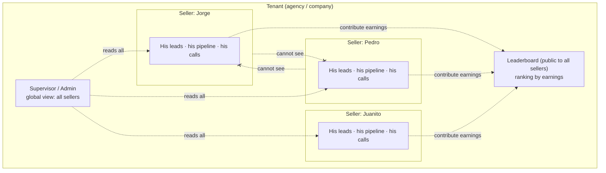
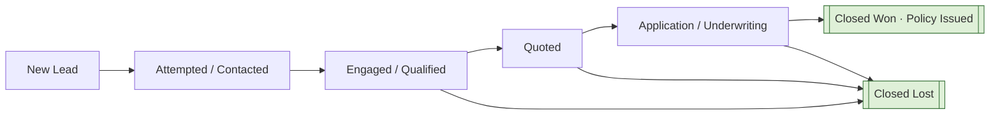
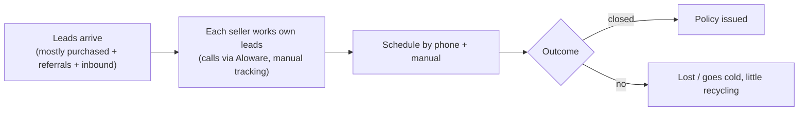

# 00 — Discovery: Business Landing & Gap Closure

> **Phase 0 deliverable.** Status: **complete, pending GATE 0.**
> Language policy: this document is technical documentation → English. UI microcopy is en-US. Source: structured interview with Jorge (blocks 1–4), 2026-07-30/31. Nothing here is invented; every unvalidated item is marked as an **assumption** or **open question**.

---

## 1. Purpose

Understand the real operation this system serves so that every later phase is designed on facts, not on an imaginary CRM. This document consolidates the discovery interview and is the factual anchor for Phase 1 (market research) and Phase 2 (functional map).

---

## 2. Business Profile

| Dimension | Finding |
|---|---|
| **Product being built** | Web system to capture, manage and track sales leads end-to-end (enter → work → won/lost → measure). |
| **Who uses it** | Salespeople based in the **United States**. ~**50 sellers** at MVP scale. |
| **First vertical** | **Insurance** — specifically the **Life family**: **Final Expense** + a **cash-value / investment-linked life product (interpreted as IUL / whole-life / annuity)**. *(See Open Question OQ-1 — Jorge described it as "the money is invested"; needs one-line confirmation.)* |
| **Vertical strategy** | The **core is vertical-agnostic**. Insurance is the first configuration; a future user could run another line of business. Pipeline, stages, and fields must be **configurable**, never hardcoded to insurance. |
| **Currency** | **USD**. |
| **Commercial ambition** | Internal use first, **multi-tenant-ready** architecture to sell to other US sales teams later without a rewrite. No billing/plans/customer-onboarding in MVP. |
| **Reference product** | GoHighLevel — adopt proven patterns (pipeline/opportunities, calendars, conversations), avoid its bloat and heavy UX. |
| **Build methodology** | Vibecoding with Claude Code. No human-hour estimates anywhere; "cost to build" = relative technical complexity only. |

---

## 3. Users, Roles & Visibility Model

Roles at MVP: **admin**, **supervisor**, **seller**. Marketing is a *lead source*, not a dedicated user.

**The isolation model is the defining architectural fact of this product:**

- **Each seller is a silo.** A seller logs in and manages **only their own** leads, calls, and pipeline. Sellers **do not see each other's leads**. There is **no central lead-routing/assignment engine** in the MVP — leads live directly in each seller's own workspace.
- **Supervisor/admin** have **global visibility** across the team (all sellers' data) for oversight and reporting.
- **Exception — the Leaderboard is public.** While lead data is private per seller, **performance is transparent to everyone**: every seller can open the ranking and see the full standings. (See §8.)

**Design implication:** every domain entity is owned by a `user_id` and scoped by `tenant_id`. Seller queries filter to `owner = self`; supervisor/admin queries span the tenant; earnings aggregates feed a tenant-wide leaderboard.

---

## 4. Pipeline, Closing Mechanic & "Earnings"

- **Pipeline template + per-seller adjustment.** Sellers start from a **common configurable template** and can adjust their own stages — flexible without chaos. (Whether stages are stored per-user or per-tenant-with-overrides is an architecture decision for Phase 5.)
- **Configurable "closed" columns.** One or more stages are flagged as **closed**. Moving a lead into a *Closed Won* stage adds its **deal value** to that seller's **earnings**.
- **Deal value = annual premium** (editable numeric field on the opportunity). Commission is a **post-MVP** layer.
- **UI terminology:** the seller-facing metric is **"Earnings"**, not "Profit."

**Proposed Life-insurance pipeline (provisional — to validate in Phase 1):**

*Closed Won* → adds annual premium to earnings. *Closed Lost* → requires a typified loss reason (§7).

---

## 5. Lead Sources

Jorge did not specify exact channels/volumes → **default assumed, pending validation in Phase 1**:

| Channel | Assumed relevance | Notes |
|---|---|---|
| Purchased leads (lead vendors) | **Primary** | Common in US life/final-expense; shared vs exclusive matters. Cool fast → speed-to-lead is critical. |
| Inbound calls | Secondary | Fits Aloware. |
| Referrals | Secondary | Higher quality, lower volume. |
| Aged leads (recycled) | Tertiary | Feeds the "recycle lost/cold" flow. |

> **OQ-2:** real channels + approximate monthly volume per channel + relative quality.

---

## 6. Communication & Integrations

- **Primary channels:** **SMS + email + phone call.** WhatsApp is **future** (not US-dominant here).
- **Aloware (already contracted)** — US dialer / contact-center for **calls (and SMS)**. Concrete integration target: click-to-call, call logging into the contact timeline, and (depth TBD) SMS. **Research in Phase 1** (API, webhooks, embedded dialer). MVP = lightweight bridge + activity logging.
- **Google Calendar sync** — desired. MVP-vs-V1.1 priority decided in Phase 3.
- **Legal on comms:** **TCPA** (consent + opt-out for SMS/calls via Aloware) and **CCPA** apply — designed in from the start.

---

## 7. Scheduling & Business Rules

**Scheduling (today = phone + manual):**
- Meetings are primarily **phone appointments** (fits Aloware).
- MVP: **internal calendar + reminders + no-show logging**; **Google Calendar sync** as the next step; booking links later.

**Business rules (recommendations accepted, configurable):**
- **Cold lead** = **no activity for 7 days** (configurable threshold).
- **Loss reasons (base set, editable):** price/affordability · not contactable/no answer · already insured · doesn't qualify (e.g., health/age) · not interested · no funds.
- **Recycling** lost/cold leads back to re-contact: **yes**, as a **manual action** in MVP.

---

## 8. Metrics, Dashboards & Leaderboard

**Seller dashboard:** *My Day* (today's tasks/calls/follow-ups) + *My Funnel* (own conversion by stage) + *My Earnings*.

**Supervisor/Admin dashboard:** team ranking + aggregate funnel + conversion by stage + team earnings.

**Leaderboard module (first-class, motivational, public to all sellers):**
- A **podium (1st / 2nd / 3rd)** plus a ranked **list of sellers by earnings** below.
- Every seller can open it to see the **current standings**; explicit purpose = **inspire and motivate** through healthy competition.
- Metric label in UI = **Earnings** (sum of Closed-Won deal values per seller). Period/reset semantics (all-time vs monthly) → **OQ-3**.

---

## 9. Requirements & Constraints

**Functional (from discovery):**
- Per-seller data isolation; supervisor/admin global view; tenant-wide public leaderboard.
- Configurable pipeline (template + per-seller adjust), configurable "closed" flags, configurable loss reasons, configurable cold threshold.
- `deal_value` (annual premium) on opportunity; earnings = Σ closed-won per seller.
- Lead lifecycle end-to-end: enter → contact → schedule → meet → advance → won/lost → measured.
- Manual recycling of lost/cold leads.

**Non-functional / constraints:**
- **UI in English (en-US)**, **i18n-ready** for Spanish later. Code/data/docs in English; Jorge↔Claude conversation in Spanish.
- **Responsive**: desktop-biased for management, mobile for quick contact.
- **Infra budget:** target **< $100/month** initially.
- **Legal:** TCPA (consent/opt-out) + CCPA, from design.
- **Multi-tenant-ready** data model; no billing in MVP.
- **Integrations:** Aloware (MVP bridge), Google Calendar (priority TBD), WhatsApp (future).
- **No date milestones** flagged by Jorge.

---

## 10. Current-State Process (reconstructed — partly assumed)

Jorge did not have the current tooling/stages fully mapped and asked for a researched proposal. Best current understanding:

> Tooling *today* (spreadsheet vs prior CRM vs Aloware-only) is **not confirmed** → **OQ-4**, to be firmed with Phase-1 research.

---

## 11. Prioritized Pain Hypotheses (evidence pending Phase 1)

These are grounded in Jorge's answers + US life-insurance norms, **to be validated with sources in Phase 1**:

| # | Pain | Why it hurts | Severity (hyp.) |
|---|---|---|---|
| 1 | **Slow speed-to-lead** on purchased leads | Bought life/FE leads cool in minutes; late first contact = lost money | **High** |
| 2 | **No-shows** on phone appointments without systematic reschedule | Wasted slots, leads slip | **High** |
| 3 | **Post-quote follow-up drop-off** | Quoted-but-not-closed with no cadence is where deals die | **High** |
| 4 | **No single per-seller workspace** (fuzzy tooling today) | Context scattered; nothing is "one place" | **Med-High** |
| 5 | **No live motivation/visibility** of standings | Morale & competition untapped | **Med** (addressed by Leaderboard) |
| 6 | **Manual scheduling** (phone + manual) | Friction, missed reminders | **Med** |
| 7 | **Cold leads not recycled** | Acquisition cost wasted | **Med** |

---

## 12. Sellability Vision (future)

- **Who we'd sell to later:** other US insurance sales teams/agencies (Life/Final Expense first), then other verticals via the agnostic core.
- **Why choose this over GoHighLevel:** **radical simplicity + speed + per-seller pipeline + live earnings/leaderboard motivation** — the opposite of GHL's bloat.

---

## 13. Assumptions

| ID | Assumption | Status |
|---|---|---|
| A-1 | UI in en-US; WhatsApp-first discarded | **Validated** |
| A-2 | No lead-routing engine in MVP (per-seller silos) | **Validated** |
| A-3 | Lead channels = mostly purchased + referrals + inbound | Pending (OQ-2) |
| A-4 | Insurance line = Life (Final Expense + IUL/cash-value) | Pending (OQ-1) |
| A-5 | Ticket/cycle: no hard numbers → use Phase-1 industry ranges | Pending |
| A-6 | Legal = TCPA + CCPA | Pending confirmation |
| A-7 | Deal value = annual premium; earnings = Σ closed-won | **Validated** |

---

## 14. Open Questions (carried into Phase 1)

- **OQ-1:** Confirm the second/third product — is "commercial" actually a **cash-value/investment life product (IUL/annuity)** rather than commercial P&C?
- **OQ-2:** Real lead channels + monthly volume + quality per channel.
- **OQ-3:** Leaderboard period — **all-time vs monthly reset** (and does it reset for fair competition?).
- **OQ-4:** Current tooling and the real stages a lead passes through today.

---

## 15. Interview Answer Log (blocks 1–4, condensed)

- **B1:** Users = US sellers (~50); USD; roles admin/supervisor/seller; devices mixed (desktop mgmt + mobile contact); "closed" = configurable pipeline columns that feed per-seller earnings.
- **B2:** Vertical = insurance (agnostic core); multi-tenant-ready, each seller owns their book; UI en-US + i18n; comms SMS/email/call + **Aloware**, WhatsApp future; deal value = annual premium.
- **B3:** No central assignment — sellers are silos; channels left at default; deal value = annual premium; scheduling by phone+manual today, Google sync desired, internal calendar+no-show in MVP.
- **B4:** Leaderboard is a full public module (podium + list by earnings, motivational); line = Life (Final Expense + investment-linked); cold = 7d; base loss reasons; manual recycling; dashboards seller vs admin; infra < $100/mo; TCPA/CCPA; differentiate on simplicity/speed/leaderboard vs GHL.
