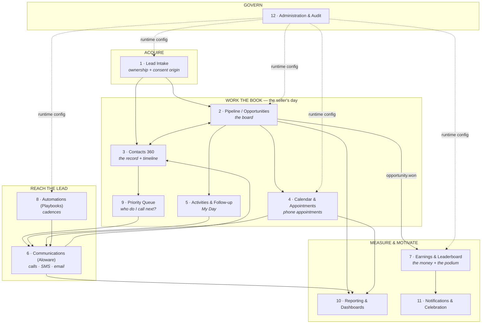

# 02 — Complete Functional Map: The Total System Vision

> **Phase 2 deliverable.** Status: **complete, pending GATE 2.**
> This is the **long-term inventory**, not the MVP. Phase 3 does the cutting. Nothing here is a commitment to build; everything here is a commitment to have *decided*.
> **Method:** 12 module specs written by parallel senior-designer agents (Opus, high effort), each then torn apart by an adversarial **sales-ops critic** with 15 years on US life-telesales floors, plus a cross-cutting capability pass. 24 agent outputs consolidated here. Full per-module detail lives in [`docs/02-modules/`](02-modules/) — this document is the map, those are the territory.
> **Anchors:** every line traces to Phase 0 (silos, Earnings, Aloware, leaderboard) and Phase 1 (Top-20 patterns, anti-bloat). Companion document: [`02b-integration-map.md`](02b-integration-map.md).
> ⚠️ **Read §6 first.** After this map was drafted, Jorge recalibrated the scope: **this is a seller's CRM, not an insurance platform.** Much of the vertical depth catalogued below is now explicitly future depth, not scope. The module inventory is unchanged — what changed is how much of the insurance machinery Phase 3 is allowed to keep.

---

## 1. The system in one paragraph

Fifty US life-insurance sellers each work **their own isolated book of business**. A purchased Final Expense lead arrives by ping-post and is dialable in **one tap within seconds**; every call, text and email **logs itself** from Aloware webhooks into a single per-contact timeline; the seller's whole day is **one board plus one ranked list of what to do next**; a promise made on a call becomes an appointment that **reminds the lead by itself**; and the one gesture that ends a sale — dropping a card into a **Closed-Won** stage — is the single event that writes **Earnings**, re-ranks a **public real-time leaderboard**, and fires a celebration on every screen in the agency, including the TV on the wall. Nobody sees anybody else's leads. Everybody sees the score.

---

## 2. Module inventory & verdicts

| # | Module | Verdict | Features | Screens | Entities | Emits | Detail |
|---|---|---|---|---|---|---|---|
| 1 | **Lead Intake & Ownership Origin** | KEEP · reshaped into the *ownership-binding + consent-provenance* layer | 26 | 9 | 14 | 18 | [01](02-modules/01-lead-intake.md) |
| 2 | **Pipeline / Opportunities** | KEEP · **#1 MVP anchor** | 37 | 9 | 11 | 19 | [02](02-modules/02-pipeline.md) |
| 3 | **Contacts 360** | KEEP · it is a *timeline with a form attached*, not a form | 33 | 7 | 14 | 25 | [03](02-modules/03-contacts-360.md) |
| 4 | **Calendar & Appointments** | KEEP · **MVP anchor** · it is the *appointment engine*, not a grid | 32 | 9 | 13 | 17 | [04](02-modules/04-calendar.md) |
| 5 | **Activities & Follow-up** | KEEP · reshaped into **the Activity Engine of the whole system** | 27 | 12 | 12 | 21 | [05](02-modules/05-tasks.md) |
| 6 | **Communications (Aloware)** | KEEP · highest-leverage integration; execution + ingestion + compliance gate | 42 | 9 | 14 | 28 | [06](02-modules/06-conversations.md) |
| 7 | **Earnings & Leaderboard** | KEEP · **the headline differentiator** | 34 | 8 | 12 | 16 | [07](02-modules/07-leaderboard.md) |
| 8 | **Automations (Playbooks)** | RESHAPE · a curated **catalog**, never a blank canvas | 37 | 9 | 11 | 25 | [08](02-modules/08-automations.md) |
| 9 | **Priority & Work Queue** | RESHAPE · headless engine + **one** surface (Call Next). *Routing/assignment cut.* | 22 | 5 | 9 | 13 | [09](02-modules/09-scoring-priority.md) |
| 10 | **Reporting & Dashboards** | RESHAPE · the tenant's canonical **metrics layer** | 36 | 11 | 14 | 16 | [10](02-modules/10-reporting.md) |
| 11 | **Notifications & Celebration** | KEEP · a **Signal Router** with a hard anti-noise contract; staff-facing only | 35 | 7 | 11 | 17 | [11](02-modules/11-notifications.md) |
| 12 | **Administration & Audit** | KEEP · split into **Configuration Console** + **Audit/Compliance Ledger** | 46 | 15 | 27 | 53 | [12](02-modules/12-admin-audit.md) |
| 13 | *Cross-cutting capabilities* | 22 ADOPT · 2 ADOPT LATER · 2 REJECT | 26 | — | — | — | [13](02-modules/13-crosscutting.md) |

**Totals:** 407 catalogued features (283 flagged as MVP candidates by their authors — Phase 3 will cut that hard), 110 screens, 162 entities.

**Module 13 of the original candidate list (Tenants & Billing)** stays documented-not-built inside Administration: the data model carries `tenant_id` everywhere and a `tenant`/`subscription` entity is reserved, but no billing, plans or customer onboarding is designed for the MVP — exactly as decided in Phase 0.

**Two candidate modules from the prompt did not survive as designed:**
- **"Scoring & Assignment" → "Priority & Work Queue".** Assignment, routing, round-robin and shared queues are **deleted outright**: they contradict the defining architectural fact (per-seller silos, no routing engine). What survives is *prioritization inside a seller's own book* — the answer to "who do I call next?" — which a 300-lead silo genuinely needs.
- **"Conversations" and the Aloware bridge are ONE module (Communications).** Split apart they create two consent-enforcement points and two webhook receivers, which is exactly how a STOP gets honored on SMS but not on the dialer.

---

## 3. What each module is for (and what the critic found)

Condensed. Full features, screens with states, payloads, permissions and the complete adversarial review are in the linked detail files.

### 1 · Lead Intake & Ownership Origin → [detail](02-modules/01-lead-intake.md)
**Purpose:** get every new lead — hand-typed, ping-posted by a vendor in milliseconds, CSV-imported, or arriving as an unknown inbound call — into **exactly one seller's book**, deduplicated, with its **TCPA consent certificate attached**, and callable with one tap before it goes cold.
**Reshape:** in a system with no routing engine, intake is not a form builder — it is the **ownership-binding + consent-provenance layer**. Ownership is a property of the *source*, resolved by five deterministic binding modes (endpoint token, payload field map, importer identity, creator identity, inbound Aloware number). Never by an algorithm.
**Critic's must-fix:** live/warm **transfer intake** (a large share of FE volume) is absent; **vendor credit/return workflow** (the daily money loop of every FE floor) is missing; **TrustedForm/Jornaya certificates must be *claimed via API* within seconds** or the legal evidence evaporates — storing a URL is worthless; **calling-window computation belongs here** (zip→timezone, DST-aware) because intake is the only place it can be established.
**Silo fix:** the duplicate typeahead is an unrate-limited cross-silo oracle — the accepted-lead and blocked-lead responses must be **indistinguishable in wording and timing**.

### 2 · Pipeline / Opportunities → [detail](02-modules/02-pipeline.md)
**Purpose:** the seller's entire working day on one screen — every deal they own as a card they can call, text, schedule and drag — and the single gesture (dropping a card into Closed-Won) that turns a sale into **Earnings**.
**Card anatomy** (Phase-1 pattern #2): premium · days-since-last-touch · next activity · source · health dot. **Stale alert lives on the board**, not in a report. **Required-field gate** blocks Closed-Won without an annual premium and Closed-Lost without a typified reason.
**Critic's must-fix:** it models a B2B kanban for a business that runs on **dial attempts** — no attempt cadence (an FE lead needs 6–12 attempts across day-parts over 10–14 days), no **Aloware Power Dialer list push** (the difference between 40 and 150 dials/day), no **lead-local calling window** per card, and **no DOB/state** (which decide rate band, carrier availability, calling window and age knockouts — asked in the first 60 seconds of every FE call).
**Cuts:** weighted pipeline value / stage probability (nothing in a 3-day FE cycle is probabilistic), the admin custom-field builder, per-seller stage rename/reorder.

### 3 · Contacts 360 → [detail](02-modules/03-contacts-360.md)
**Purpose:** one screen per person holding everything that ever happened — every call with recording and AI summary, every text, note and stage move — plus the insurance facts (age, state, health, existing coverage, draft date) and whether it is **legally safe to dial or text right now**.
**Reshape:** build the **timeline + Aloware auto-log pipeline first**; the field editor is secondary. A CRM that costs the seller typing dies of data rot.
**Critic's must-fix:** **the money unit is wrong** — FE is quoted and sold *monthly* ($47/mo) while `deal_value` is *annual*; without a `premium_mode` field and auto-annualization the **public all-time leaderboard will be wrong by 12×**; **IUL premium semantics are undefined** (minimum/target/max non-MEC/1035); **no TCPA calling-window gate** despite a timezone field existing; **no two-party recording-consent handling** (CA/FL/PA/IL/WA/MA) even though we record, store and transcribe every call.
**Silo fix:** owner reassignment must **not** hand the previous seller's recordings and private notes to the new owner; supervisor bulk actions must never execute "as the seller" (it inflates counters that feed a public leaderboard).

### 4 · Calendar & Appointments → [detail](02-modules/04-calendar.md)
**Purpose:** make sure every promise a seller makes on a call actually happens — book from the card in two clicks, remind by SMS+email, put the call one tap away at the right minute **in the lead's timezone**, and refuse to let the day end without recording whether the lead showed up.
**Reshape:** it is the **appointment engine**, not a grid. Its center of gravity is the phone appointment, the Today strip with tap-to-call, and the **Needs Outcome** queue — not the month view.
**Critic's must-fix:** the **carrier tele-app / phone interview three-way call with voice signature** is how an FE sale actually closes and is entirely unbuilt; **no draft-date scheduling** (FE drafts align to Social Security deposit dates); **no persistency/chargeback-window cadence** (day-30/60/90 retention touches — the only annual review fires *after* the money is clawed back); **no second attendee** ("Thursday at 3 when my husband gets home" is the most common booking sentence in FE).
**Cuts:** month view, the entire booking-links/public-booking-page subsystem (an FE senior was never going to self-book), iCal feed.

### 5 · Activities & Follow-up (the Activity Engine) → [detail](02-modules/05-tasks.md)
**Purpose:** tell the seller exactly who to contact right now and why — one urgency-ranked list of every call due, reply waiting, appointment prep and post-quote follow-up — and keep chasing automatically until the lead answers or books.
**Reshape:** it owns **ONE `activity` record** that every other module writes into (Phase-1 pattern #5). If it owns a private to-do list while calls live elsewhere, **"My Day" becomes a lie** and the seller goes back to a notepad.
**Critic's must-fix:** the flagship **speed-to-lead SLA is wired to the wrong events** — it stops on `call.completed`, so a seller who dials at 0:22 and talks 18 minutes shows **BREACHED**; it must stop on **dial initiation**. **SLA gaming**: any outbound SMS currently satisfies the clock, so an auto-SMS at second 5 marks every lead "met" while nobody dials — for first-contact the stop event must be a **dial, full stop**. And there is **no answer for an unavailable seller** (a lead landing at 11:40pm starts a 60-second clock guaranteed to breach).
**Cuts:** supervisor "coaching activities" written into a seller's book (the first brick of the forbidden assignment engine), sequence version-pinning, branch-on-outcome cadences.

### 6 · Communications (Aloware) → [detail](02-modules/06-conversations.md)
**Purpose:** every call, text and email in one thread — press "Call now" the second a lead arrives, and the disposition, recording, transcript and AI summary **write themselves** — while the system silently refuses to contact anyone without consent.
**Reshape:** three jobs, not an inbox: **execution layer** (Two-Legged Call API, Chrome click-to-call, Power Dialer), **ingestion layer** (webhooks auto-writing into the record — Phase-1 pattern #16), and **compliance gate** every other module routes sends through.
**Critic's must-fix:** **voicemail drop** (60–70% of FE dials hit an answering machine; leaving the same message 80×/day by mouth is the difference between 200 and 320 dials); **caller-ID reputation and local-presence number rotation** (a number tagged "Spam Likely" halves answer rates overnight and nobody notices for two weeks); **agent state-licensing guard** (a US life agent may only solicit where licensed and appointed — an E&O/DOI issue, not just wasted dials); **lead-vendor performance feedback loop** (the owner's daily decision is which vendor to keep buying).
**Silo fix:** unmatched/ambiguous inbound calls are undefined — and that gap is a routing engine waiting to be built. Tenant-wide suppression is legally required but must never reveal *whose* lead opted out.

### 7 · Earnings & Leaderboard → [detail](02-modules/07-leaderboard.md)
**Purpose:** every seller works alone and never sees another's leads — this is the one place the whole floor sees the same thing: who is closing, and exactly what it takes to move up one spot.
**Confirmed with Jorge:** **all-time + real-time** is the v1 board. Design consequence: **`period_key` is written on every ledger entry from day one**, so a monthly/weekly board is a config flip, never a migration.
**Adopted from Phase 1:** podium 1-2-3 · **top-10 + always-visible self rank with neighbors** (Close's top10+2) · distance to next rank · live re-rank with motion · event-driven celebration · kiosk/TV view.
**Confirmed with Jorge (D3/D4):** **one board, one number** — no FE/IUL tabs, no deals-won board. And each seller decides which of their own columns count as Earnings; the moment a lead lands there, their total and rank move on the shared ranking.
**Critic's must-fix that survives the recalibration:** **no today/this-week production surface** — a floor runs on *today's* number at 2pm, and an all-time rank cannot change behavior in the last three hours of dial time; **no goal/quota** ("distance to next rank" never says whether either seller is on track); **no team dimension** (50 sellers sit under 3–6 team leads — that is org structure, not routing, so it does not violate the silo rule).
**Dropped by D1/D6:** carrier reconciliation, placement/chargeback reversal machinery and product-line boards — fields captured, workflows not built.
**The structural risk to name out loud:** **an all-time, never-reset, revenue-only board demotes 60–70% of the floor** (Phase-1 research) and is *worse* for every new hire. The recognition layer (Most Improved, streaks, personal bests) ships in the **same release** as the money board — it is not a nice-to-have, it is the mitigation.
**Silo fix:** the **kiosk token** is the highest-risk artifact in the product — an unauthenticated URL rendering named US employees ranked by earnings. Admin-only minting, short expiry, revocable, no PII beyond display name.

### 8 · Automations (Playbooks) → [detail](02-modules/08-automations.md)
**Purpose:** a purchased FE lead gets called and texted within seconds of landing, and every no-answer, post-quote, no-show and cold lead keeps getting followed up — inside TCPA quiet hours and consent rules.
**Reshape:** ship **Playbooks** — a closed, curated catalog of installable Life/FE/IUL recipes over a **short plain-English trigger vocabulary** (Phase-1 patterns #14, #15). The blank-canvas condition builder is **CUT**: it is precisely the "simple to use, brutal to administer" anti-pattern we positioned against.
**Critic's must-fix:** **frequency caps, opt-out and do-not-automate are keyed on `lead_id`** — but ping-post sells the same senior to two sellers in the same agency, so caps and STOP must be keyed on **E.164 phone at tenant scope** or the same person gets two cadences from the same 10DLC brand; **`user.deactivated` / owner-change are not consumed**, so when an agent quits, automated texts keep firing from a disabled user's book; **state-level calling law** (FL/OK mini-TCPA, Sunday restrictions) needs a rule table where the **narrowest of federal/state/tenant wins**.
**Hard rule adopted:** an automation may **never** move an opportunity into a Closed stage. Automations must not be able to write to the public leaderboard.

### 9 · Priority & Work Queue → [detail](02-modules/09-scoring-priority.md)
**Purpose:** answer the only question a seller asks 60 times a day — "which of **my** leads do I call right now?" — while silently hiding anyone it would be illegal or pointless to dial.
**Reshape:** a **headless priority engine** + exactly **one** surface (Call Next). No scoring dashboard, no grade letters, no second kanban.
**Critic's must-fix:** **multiple phone numbers per lead** — FE vendor leads arrive with 1–3 numbers and aged lists are full of disconnects; contactability, DNC, opt-out and attempts are all **number-level facts**, not lead-level; **the entire post-sale money layer is absent** (the highest-value call of the week is a **save call** on a failed first draft or pending lapse); **draft-date/SSA deposit timing** is name-dropped and modeled nowhere; **the underwriting chase has no data source** (unsigned application, PHI interview outstanding, APS pending, carrier requirement letter).
**Cuts:** the 0–100 score with factor breakdowns and model versioning — replace with a **deterministic rule ladder** where the reason *is* the rank ("promised callback at 4:00"). Also cut `priority_score_history` (millions of rows/month against a <$100 budget).

### 10 · Reporting & Dashboards → [detail](02-modules/10-reporting.md)
**Purpose:** answer the seller's two questions ("who do I call now?", "how much have I earned?") and the owner's three ("who is producing, where are deals dying, which lead vendor is worth paying for?") using **one shared, auditable Earnings number that can never disagree with the leaderboard**.
**Critic's must-fix:** **placement/issued premium is absent** — Earnings credits at Closed-Won on *submitted* business, but in FE **20–40% of submitted business never issues**, so a public all-time board becomes gameable on business that never existed; **no carrier dimension anywhere**; **persistency/early-lapse unmeasured** (a seller whose book lapses at month 4 is ranked a hero); **lead cost is optional** when cost-per-acquisition is the reason the owner buys software at all.
**Cuts:** the forecast subsystem, the goals subsystem as designed, cohort-by-lead-week — CRM boilerplate that has to come out to pay for placement and carrier data.

### 11 · Notifications & Celebration → [detail](02-modules/11-notifications.md)
**Purpose:** tap the seller on the shoulder within seconds, on the device in their hand, the moment one of **their** leads becomes worth money — with a one-tap "Call now" right there — and shut up about everything else.
**Reshape:** a **Signal Router with one Attention Inbox** and a hard anti-noise contract: severity tiers, collapse keys, **auto-resolve when the reason disappears**, cross-channel suppression. **Staff-facing only** — anything that reaches a *lead* belongs to Communications (which keeps TCPA surface out of this module entirely).
**Critic's must-fix:** the **P0 tier as specced cannot be delivered by iOS web push** (no action buttons, no custom sound, PWA-install-only) while the SMS fallback is non-MVP — that gap must be closed or the tier is a promise the platform breaks; **zero policy-lifecycle alerts** (carrier decision, APS outstanding, first-draft NSF, pending lapse); **scheduled callbacks demoted to P2** when a promised callback is the most-broken promise on an FE floor; **no "your lead is calling you right now"** signal.
**Silo fix:** `leaderboard.rank_changed` must not notify all 50 sellers on every close; scope to users whose **own** rank changed. Celebration amount display must be a tenant policy with a stated default.

### 12 · Administration & Audit → [detail](02-modules/12-admin-audit.md)
**Purpose:** the single place where the owner decides **how the CRM behaves** — and the single place that can **prove**, on demand, who did what and that every call and text had consent.
**Reshape into two surfaces:** a **Configuration Console** (every row is a runtime variable other modules evaluate — so every change emits an event and shows its blast radius before saving) and an **append-only Audit & Compliance Ledger** (the thing a prospective third-party client asks about before signing).
**Critic's must-fix:** **the Earnings recognition policy is undefined** (submitted vs issued vs first-drafted) and **how a chargeback reverses a public all-time leaderboard** is unanswered — see §5; **no calling-window/quiet-hours engine** (Aloware will not enforce this for *our* sequences, reminders or click-to-call); **TrustedForm/Jornaya claiming**; **verbal revocation capture** (in FE, "take me off your list" is almost always *spoken* — it needs a one-tap agent action that writes suppression instantly).
**Silo fix:** `lead_source` with a default pipeline but **no target seller** implies a shared pool that something must distribute — that something is the forbidden routing engine. Every posting endpoint binds to exactly one seller. Book transfer must target **a single destination seller**, never "seller(s)" with preview counts.

---

## 4. Cross-cutting capabilities (the quality signature) → [detail](02-modules/13-crosscutting.md)

**22 ADOPT (v1) · 2 ADOPT LATER · 2 REJECT.** The ones that decide whether this feels like a 2026 product or like GoHighLevel:

| Capability | Verdict | Why it matters here |
|---|---|---|
| **Silo enforcement at the data layer** | ADOPT — non-negotiable | Enforced in components instead of the query layer = the first new endpoint leaks another seller's leads. That is a PII incident, not a bug. Default deny; exactly one whitelisted public projection (the leaderboard). |
| **Event backbone (append-only log)** | ADOPT — v1 | Auto-logging calls and Closed-Won→Earnings→re-rank→celebration are the *same mechanism seen twice*. Two code paths = leaderboard and timeline drift apart and the demo dies mid-pitch. |
| **Real-time updates** | ADOPT — v1 | Jorge chose real-time. A leaderboard that needs F5 is a report, not motivation. p95 < 2s from drop to every client including the kiosk. |
| **Cmd+K that searches AND executes** | ADOPT — v1 (FIND + ~10 hard-coded DO commands) | Typing a phone number and hitting Enter to dial is shorter than any navigation — and it is the cheapest "this isn't GHL" signal in a 10-minute demo. |
| **Keyboard shortcuts (dial · dispose · note · next)** | ADOPT — v1 | The FE loop repeats ~100×/day. Every mouse trip is friction × 100. |
| **Performance budgets as a product feature** | ADOPT — v1 | Without numeric budgets the speed claim is marketing. |
| **Mobile-first *contact* surface** | ADOPT — v1 | Sellers contact from phones. Declaring what mobile does **not** do is what prevents the afterthought port that GHL shipped. |
| **Demo data (realistic US life-insurance seed)** | ADOPT — v1, first-class | The single highest-ROI item for sellability: a dashboard that looks alive at first login. |
| **Compliance rails (TCPA · DNC · opt-out · calling hours · CCPA)** | ADOPT — v1 | Aloware covers carrier-side obligations; this covers ours. It is also a demo asset. |
| **Timezone & calling-window as a primitive** | ADOPT — v1 | Cheap up front, brutal to retrofit. |
| **Idempotent, replayable ingestion** | ADOPT — v1 | Aloware webhooks retry and arrive out of order. Without keys, auto-logging double-writes the timeline — the exact data rot the feature exists to kill. |
| **Optimistic UI with undo** | ADOPT — v1 | With a stated exception list; the Closed-Won undo window is the tricky part. |
| **Config resolution (product → tenant → seller)** | ADOPT — v1 | This is what makes "vertical-agnostic core" true rather than aspirational. |
| **i18n infrastructure** | ADOPT — v1 (**and explicitly do not ship Spanish**) | en-US now; adding a language later must not be a rewrite. |
| **WCAG 2.1 AA on a defined critical path** | ADOPT — v1 (scoped) | Full-app audit rejected as v1 scope. |
| **Dark mode** | **ADOPT LATER** (theming tokens now) | Does not earn v1 scope against speed-to-lead work. |
| **Saved views · advanced filters · bulk actions** | **ADOPT LATER (v1.1)** | Ship fixed system views in v1. |
| **Full offline-first PWA** | **REJECT for MVP** | High complexity, marginal value for phone-based inside sales. A resilient write queue is adopted instead. |
| **User-facing custom-object / generic condition builder** | **REJECT — and say so out loud** | Adopting it imports the precise bloat we positioned against. |

---

## 5. Cross-module rulings (conflicts I resolved as consolidator)

Twelve independent designers produced twelve overlapping claims. These are the binding decisions; §6 lists what still needs **you**.

1. **One writer for money.** Pipeline, Reporting and Leaderboard *each* claimed the earnings ledger. **Ruling: the `earnings_ledger` is owned by module 7 (Earnings & Leaderboard).** Pipeline emits `opportunity.won / .lost / .reopened / .value_changed` and **never writes a total**; Reporting and dashboards are **readers** of the same ledger. Two writers to a public money number is an unfixable bug class.
2. **Earnings is an append-only ledger of signed deltas**, never a mutable total — with `period_key` on every row. This is what makes all-time+real-time work now and a monthly reset a config flip later.
3. **Post-close edits must move the board.** `opportunity.value_changed` (when closed-won) and `opportunity.reopened` are first-class money events. Without them, an all-time board is wrong *forever*.
4. **One consent authority.** Consent lives on the Contact and **Contacts 360 is the only emitter** of `consent.updated`. Communications, Automations, Calendar and Priority are **enforcers** calling one shared guard. One writer, many enforcers.
5. **One activity object.** Module 5 owns `activity`; Calendar owns `meeting` and links to it. Duplicating the time field is how a rescheduled meeting shows two different times in My Day and on the card.
6. **One timeline, derived not written.** Contacts 360 owns the timeline as a **projection over the event stream**; Communications owns composition and provider state. Nobody writes timeline rows directly — that is what keeps it complete when WhatsApp arrives.
7. **Automations own enrollment state; Aloware Sequences are an execution backend only.** Two engines with two states is how a lead replies in our app and Aloware keeps texting.
8. **Reporting and Leaderboard stay separate modules** despite both being "analytics": they have **opposite visibility rules** (Reporting is silo-scoped; Leaderboard is deliberately tenant-public and carries no lead data). Merging them is how lead data leaks.
9. **Cmd+K never writes.** It invokes the owning module's command path and lets that module emit the event. A palette that writes directly produces a logged call that never reaches the timeline.
10. **Celebration delivery belongs to Notifications** (mute, DND, kiosk broadcast), consuming `opportunity.won` and `leaderboard.rank_changed`. Leaderboard must not send notifications directly or mute policy gets implemented twice.
11. **The dedupe/suppression paradox, resolved.** TCPA requires tenant-wide suppression by phone number; the silo forbids revealing another seller's lead. **Ruling:** suppression is enforced by a service that answers *blocked / not blocked* **without attribution**, and every "why" message is generic ("this number is on the do-not-contact list"), never "opted out on Feb 3 with another agent".
12. **Cross-owner contact merge is forbidden by default.** A merge that moves a closed-won opportunity between sellers moves money on a public board. Cross-owner merges are an admin-only, audited, explicitly-confirmed operation that emits an earnings correction — never an automatic reaction.
13. **Automations may not close deals.** No automation path may move an opportunity into a Closed stage.

---

## 6. Decisions taken (Jorge, 2026-07-31) — D1–D6 resolved

> **Scope recalibration — read this before anything else in Phase 3.**
> Jorge's ruling: *"No enfoquemos tanto esto a lo de los seguros. Esto es más: vendedor llama leads e intenta convencerlos de contratar el seguro. Si lo hace bien, bien; si no, next. Vendedor consigue ventas y listo."*
> **This product is a seller's CRM, not an insurance platform.** Insurance is the current use case, not the axis of the design. The deep vertical machinery the critics demanded — carrier tele-app three-ways, underwriting chase, placement/persistency reconciliation, draft-date cadences, FE-vs-IUL segmentation — is **documented in the module files as future vertical depth and is out of scope**. What survives from the vertical is only what protects money or the law: speed-to-lead, TCPA/DNC/calling windows, and the premium-unit guard. This ruling *strengthens* the Phase-0 decision that the core is vertical-agnostic.

| # | Decision | Resolution |
|---|---|---|
| **D1** | When does a sale count as Earnings? | **When the card enters a stage the seller configured as "counts as Earnings". Full stop.** No submitted-vs-issued distinction, no Issued-AP second column, no placement machinery. A descriptive `policy_type` field may exist on the opportunity, and that is as far as product typing goes. |
| **D2** | Premium mode (monthly vs annual) | **Adopted.** The win gate asks *"monthly or annual?"*, stores both, displays the annual figure. Product-agnostic and cheap — and it is the only thing standing between a seller typing `47` and a public board that is wrong by 12×. |
| **D3** | One board or product-line boards? | **One board. One number.** No FE/IUL tabs, no per-product ranking, no deals-won board in v1. Sellers sell; the board shows total Earnings, all-time, real-time. |
| **D4** | Per-seller pipeline configuration | **Full freedom, confirmed — the seller is the customer.** Each seller configures their own stages *and* flags which columns count as Earnings. The moment a lead lands in one of those columns, that seller's total and rank update on the shared ranking. The critic's request to restrict this is **overruled**: ease of managing one's own book outranks reporting comparability. |
| **D5** | Seller availability / off-hours leads | **Deferred (post-MVP).** No shift/presence model in v1. |
| **D6** | Carrier / policy number / draft date | **Captured as optional fields from day one** (cheap now, impossible to backfill) — **but no chargeback, persistency or carrier-reconciliation workflow is built.** Fields, not machinery. |

**One consequence of D4 I am recording rather than arguing:** because each seller defines which of their own columns count as Earnings, the public ranking compares numbers whose definition each seller controls. That is an accepted trade-off of "the seller is the customer", and it is the same trust model as any CRM where a rep marks their own deals won. Two guardrails keep it honest without restricting anyone: the win gate still **requires a deal value** before a card can enter an Earnings column, and every stage-config change that flips an Earnings flag **emits `pipeline.stage_config_changed` and recomputes that seller's ledger** — so the number is always explainable and auditable, never silently drifting.

---

## 7. What Phase 2 proves

Twelve modules, 407 features and 162 entities were catalogued — and then **the adversarial pass cut, reshaped or re-scoped every single module**: one candidate module deleted outright (Assignment/Routing), two merged (Conversations + Aloware), one demoted to headless (Priority), and roughly a third of the "MVP candidate" flags challenged as not-an-MVP. Twelve of the most expensive mistakes were found *before* a line of code: the 12× premium bug, the SLA that breaks on its own headline metric, the automations that could close deals into a public leaderboard, and the four separate places where a routing engine was quietly sneaking back in.

The integration proof — the event catalog that turns these twelve modules into one organism — is in **[`02b-integration-map.md`](02b-integration-map.md)**.
