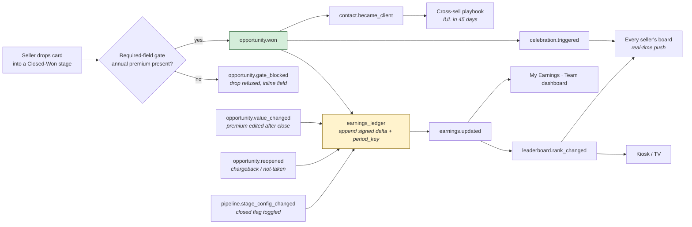
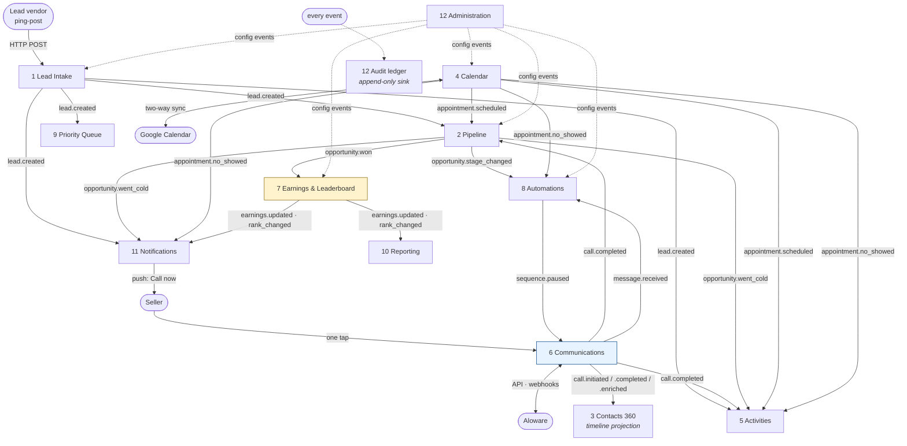

# 02b — Integration Map: The Event Backbone

> **Phase 2 deliverable — the star document.** Status: **complete, pending GATE 2.**
> This is the proof that the twelve modules of [`02-functional-map.md`](02-functional-map.md) are **one organism, not a pile of screens**. It contains the mandatory event envelope, the canonical event catalog, the reconciliation that produced it, the data-flow diagrams, and five end-to-end integration stories.

---

## 1. Why this document exists

Principle 4 of the project: *integration before modules*. The single most valuable behavior we build — **Aloware calls auto-logging themselves into the lead timeline** — and the single most motivational one — **Closed-Won → Earnings → re-rank → celebration** — are the **same mechanism seen twice**. If they are two code paths, the leaderboard and the timeline drift apart and the demo dies mid-pitch.

So the architecture is: **one append-only event log**, three classes of consumer (timeline projections, the automation engine, and rollups/projections like Earnings and the leaderboard), and a **plain-English event vocabulary** that a seller could read aloud.

---

## 2. The reconciliation (how 262 events became 40)

The twelve module specs were written independently. Cross-checking every declared emitter and consumer produced this:

| Measure | Count | What it means |
|---|---|---|
| Distinct events **emitted** across all specs | **262** | Event sprawl: each module invented its own vocabulary |
| Distinct events **consumed** | 113 | |
| **Orphans** (emitted, nobody consumes) | **215** | Most were internal state changes dressed as integration events |
| **Ghosts** (consumed, nobody emits) | **66** | The dangerous class — modules waiting for events that would never arrive |
| **Multi-emitter collisions** | 3 | `consent.captured`, `consent.revoked`, `earnings.updated` — each claimed by 3 modules |
| **Canonical catalog after reconciliation** | **40** | The authoritative vocabulary below |

**The ghosts were the real finding** — every one is a silent integration failure that would have shipped:

| A module was waiting for… | …but the real event is | Consequence if unfixed |
|---|---|---|
| `opportunity.closed_won` (6 modules) | **`opportunity.won`** | Celebration, tasks-closing and reporting never fire on a sale |
| `lead.went_cold` (6 modules) | **`opportunity.went_cold`** | The 7-day cold rule has no home; board badges never appear |
| `email.received` / `sms.received` (6 modules) | **`message.received`** (channel enum) | Sequences never auto-pause on reply → robots text people who already answered |
| `sms.opt_out_received` (4 modules) | **`consent.updated`** (status=revoked) | A STOP is honored on SMS but **not** on the dialer |
| `meeting.booked` / `meeting.cancelled` | **`appointment.scheduled` / `.canceled`** | Booked meetings never reach My Day or the card |
| `task.created` / `task.completed` / `task.overdue` | **`activity.*`** | Two activity models; "My Day" becomes a lie |
| `tenant.settings_changed` / `pipeline.settings_updated` | **`admin.setting_changed` / `pipeline.stage_config_changed`** | Cold threshold and stage-flag changes silently ignored |
| `automation.action_requested` (4 modules) | *(deleted)* — automations call the owning module's command path | A parallel write path bypassing every gate |
| `lead.assigned_owner_changed` | **`lead.owner_changed`**, admin-only | Routing sneaking in the back door |

**Deliberate merges** (one business fact = one event): `call.recording_ready` + `call.transcript_ready` + `call.summary_ready` → **`call.enriched`** with `parts_available[]`; `sms.*` + `email.*` → **`message.*`** with a `channel` enum (**this is exactly how WhatsApp arrives later without touching a single consumer**); `meeting.reminder_sent` → just a `message.sent` with `related_appointment_id`; `pipeline.card_moved` → `opportunity.stage_changed` (the board is not an event source).

> ⚠️ **Method note.** The audit agent that produced the first catalog draft received an empty digest (an orchestration bug on my side) and reconstructed it from the Phase 0/1 source documents. I then re-ran the emitter/consumer reconciliation **mechanically against the twelve real specs** — the table above and the ghost list are computed from actual module output, not reconstructed. The catalog in §4 has been reconciled against that computation. The raw computation is preserved in the session scratchpad (`reconciliation.md`).

---

## 3. The mandatory event envelope

**Not one of the 262 originally-declared events carried an envelope.** This is the missing spine, and it is non-negotiable:

```jsonc
{
  "event_id":        "uuid",        // idempotency — Aloware WILL deliver twice
  "tenant_id":       "uuid",        // without it, multi-tenant is a lie
  "owner_user_id":   "uuid",        // in a silo model, an unowned event is invisible to everyone
  "actor_user_id":   "uuid|null",   // who did it (null = system/automation)
  "occurred_at_utc_ms": 1234567890123, // when it happened in the world
  "recorded_at_utc_ms": 1234567890456, // when we learned about it (a webhook 40s late still threads correctly)
  "schema_version":  1,
  "source_system":   "app|aloware|vendor_post|scheduler|import",
  "correlation_id":  "uuid"         // ties a whole story together across modules
}
```

**Rules:** default-deny scoping — every consumer filters by `tenant_id` and, unless it is the leaderboard projection, by `owner_user_id`. Every ingestion path is **idempotent on a natural key** (`aloware_call_id`, `vendor_lead_id`, `provider_message_id`). Every event is **replayable**: rebuilding the leaderboard from scratch must be one job — which is also how a monthly reset ships later with zero redesign.

---

## 4. The canonical event catalog (40)

Authoritative. Any module emitting or consuming a name not on this list is a bug.

| Event | Emitter | When | Payload | Consumers | Notes |
|---|---|---|---|---|---|
| `lead.created` | Lead Intake | A workable new lead lands in ONE seller's book: vendor ping-post POST, web form, inbound call from an unknown number, manual quick-add, or an accepted CSV import row. Fires only after Contact + Opportunity + consent record exist. This is the event that starts the speed-to-lead clock. | ENVELOPE + event_id, tenant_id, owner_user_id, actor_user_id, occurred_at_utc_ms, schema_version, source_system, contact_id, opportunity_id, source_channel (vendor_ping_post \| web_form \| inbound_call \| manual \| csv_import \| referral), vendor_id, vendor_lead_id, received_at_utc_ms (millisecond precision — speed-to-lead is measured from here), phone_e164, email, contact_timezone (TCPA calling-hours guard), state_code, product_interest (final_expense \| iul), tcpa_consent_flag, consent_certificate_url, consent_captured_at, dedupe_status (unique \| auto_merged \| flagged_for_review) | Pipeline (creates card in first stage), Activities (creates 'Call now' activity due immediately), Notifications (push: 'New FE lead — call now'), Communications/Aloware (pre-creates contact + optional Power Dialer list entry), Automations (plain-English trigger: 'lead created'), Contacts (timeline seed), Reporting, Audit | NEVER emit this without owner_user_id — in a silo model an unowned lead is invisible to everyone. consent_certificate_url is the TCPA defense for purchased leads and is non-negotiable at intake. |
| `lead.duplicate_detected` | Lead Intake | Cheap dedupe at intake or import matches phone_e164 / email against an existing contact in the tenant — including one owned by a DIFFERENT seller. | ENVELOPE, incoming_payload_ref, incoming_source_channel, matched_contact_id, matched_owner_user_id, match_basis (phone_e164 \| email \| name_dob), match_confidence, incoming_consent (tcpa_consent_flag, consent_certificate_url), resolution (auto_merged \| queued_for_review \| rejected) | Contacts (merge/review queue), Notifications (notifies the EXISTING owner only), Admin (review queue metrics), Reporting (vendor duplicate rate per lead vendor), Audit | Silo rule: the payload may name matched_owner_user_id, but no consumer may render the other seller's lead detail to the incoming path. Duplicate rate per vendor_id is a purchasing decision for the owner. |
| `lead.import_completed` | Lead Intake | A CSV import job finishes. | ENVELOPE, import_id, rows_total, rows_created, rows_merged, rows_rejected, reject_reasons[], declared_consent_source, default_product_interest | Notifications (importing seller only), Contacts (merge queue backlog), Pipeline (bulk card creation), Reporting, Audit | Import is the second dedupe checkpoint (Kommo/GHL pattern), not a bypass of the first. |
| `contact.created` | Contacts 360 | A Contact row is born by any path. | ENVELOPE, contact_id, created_via (lead_intake \| manual \| inbound_call \| import \| merge_survivor), phone_e164, email, full_name | Audit, Search/Cmd+K index, Reporting | Deliberately low-consumption. It is NOT an automation trigger — the plain-English vocabulary uses 'lead created'. Keeping both prevents Intake and Contacts from double-emitting the same business fact. |
| `contact.merged` | Contacts 360 | Two contact records are merged (auto at intake or manually from the review queue). | ENVELOPE, surviving_contact_id, merged_contact_id, surviving_owner_user_id, merged_owner_user_id, field_resolution_map, opportunities_moved[] (opportunity_id, old_owner_user_id, new_owner_user_id, was_closed_won, deal_value), timeline_entries_moved_count, consent_resolution (most_restrictive_wins) | Pipeline (re-parents opportunities), Communications (re-threads calls/SMS/email), Earnings & Leaderboard (recompute ONLY if a closed-won opportunity changed owner), Activities, Contacts timeline, Reporting, Audit | The cross-silo landmine: a merge can move a closed-won deal between sellers and therefore move money on a public leaderboard. Consent resolution must take the most restrictive value (an opt-out on either record wins). |
| `contact.became_client` | Contacts 360 | The contact's FIRST opportunity reaches Closed-Won (consumed from opportunity.won). | ENVELOPE, contact_id, first_policy_opportunity_id, first_policy_product_type (final_expense \| iul), annual_premium_usd, issued_at, cross_sell_eligible_products[], age_band, state_code | Automations (schedules the IUL cross-sell sequence after an FE issue), Pipeline (shows 'Cross-sell IUL' quick action on the contact), Activities, Reporting (client base, cross-sell penetration), Audit | This is what turns a one-shot FE sale into a second opportunity on the same contact. Without it, cross-sell is a memory exercise. |
| `consent.updated` | Contacts 360 (consent service) | Consent state changes for a channel: STOP keyword via Aloware webhook, DNC suppression, manual revoke by seller, or a new signed certificate at intake/recycle. | ENVELOPE, contact_id, channel (sms \| call \| email \| whatsapp_reserved), status (granted \| revoked \| dnc_suppressed), reason (stop_keyword \| manual \| dnc_list \| vendor_certificate \| recycle_revalidation), evidence_ref, effective_at, previous_status | Communications (hard-blocks dial/SMS composer), Automations (immediately pauses every active sequence on that contact), Pipeline (compliance badge on the card), Notifications (tells the owner why the lead just went untouchable), Admin, Reporting, Audit | ONE canonical consent event. Aloware enforces DNC/STOP on its side; we mirror it so our UI never offers a button that will be refused, and so we can prove state at any point in time. |
| `opportunity.created` | Pipeline | A new sale process starts on an existing contact — cross-sell, recycle, or manual. (Intake-born opportunities are announced by lead.created, which carries opportunity_id.) | ENVELOPE, opportunity_id, contact_id, pipeline_id, stage_id, product_type (final_expense \| iul), deal_value_annual_premium_usd (nullable at creation), created_from (cross_sell \| recycle \| manual \| lead_intake), parent_opportunity_id (nullable) | Activities, Automations, Contacts timeline, Reporting, Audit | Opportunity is decoupled from Contact (GHL/Attio pattern) — this is what makes 'same FE client, second IUL policy' a first-class flow instead of a hack. |
| `opportunity.stage_changed` | Pipeline | A card moves stage — kanban drag, Cmd+K command, mobile, or automation. | ENVELOPE, opportunity_id, contact_id, from_stage_id, from_stage_name, to_stage_id, to_stage_name, to_stage_is_closed (resolved at move time), to_stage_closed_type (won \| lost \| null), deal_value_annual_premium_usd, product_type, days_in_previous_stage, moved_via (kanban_drag \| command_palette \| mobile \| automation), required_fields_satisfied[] | Automations (stage-bound triggers — Kommo Digital Pipeline pattern), Activities, Contacts timeline, Notifications, Reporting (funnel + velocity), Communications (auto-pauses sequences when entering a closed stage), Audit | Must carry to_stage_is_closed/closed_type RESOLVED AT MOVE TIME. Stage config is per-seller mutable, so a consumer that re-reads config later can reach a different answer than the moment of the move. Earnings deliberately does NOT consume this — it consumes opportunity.won only. |
| `opportunity.won` | Pipeline | A card enters a stage flagged closed=won, after the required-field gate has forced a non-null annual premium. | ENVELOPE, opportunity_id, contact_id, deal_value_annual_premium_usd (non-null, enforced), product_type (final_expense \| iul), carrier, policy_number, stage_id, closed_at, source_channel, vendor_id, days_from_lead_created, touches_to_close (calls, sms, appointments) | Earnings & Leaderboard (append earnings delta, re-rank), Notifications/Celebration (tenant-wide celebration), Contacts (emits contact.became_client on first win), Activities (closes open tasks on the opportunity), Automations (post-sale onboarding + cross-sell scheduling), Communications (stops sequences), Reporting (conversion by vendor/product), Audit | THE money event. Gating (HubSpot pattern) guarantees Earnings math is never blank. source_channel + vendor_id ride along so the owner can answer 'which lead vendor actually pays for itself'. |
| `opportunity.lost` | Pipeline | A card enters a stage flagged closed=lost; a typified loss reason is required by the same gate. | ENVELOPE, opportunity_id, contact_id, loss_reason_code (price_affordability \| not_contactable \| already_insured \| does_not_qualify \| not_interested \| no_funds), loss_reason_note, stage_id_at_loss, deal_value_at_loss, product_type, recyclable (bool), recycle_eligible_at | Automations (stops sequences; schedules a recycle nudge), Activities (clears open tasks), Contacts timeline, Reporting (loss-reason mix — tells the owner whether to change vendors or change pitch), Notifications, Audit | Loss reasons are tenant-configurable but the code list must stay stable; Reporting keys on loss_reason_code, never the label. |
| `opportunity.value_changed` | Pipeline | deal_value (annual premium) is edited — including AFTER the opportunity is already closed-won. | ENVELOPE, opportunity_id, contact_id, old_value_usd, new_value_usd, is_closed_won (bool), stage_id, changed_by_user_id, reason_note | Earnings & Leaderboard (MUST recompute when is_closed_won=true), Reporting, Notifications (supervisor visibility on post-close edits), Audit | The single most-forgotten link in the money chain. If Earnings only listens to opportunity.won, editing a premium after close silently corrupts a PUBLIC all-time leaderboard — and public numbers that are wrong destroy the module's motivational purpose. |
| `opportunity.reopened` | Pipeline | A closed opportunity is dragged back out of a closed stage (policy not taken, chargeback, lapse, or plain mistake). | ENVELOPE, opportunity_id, contact_id, from_stage_id, previous_closed_type (won \| lost), to_stage_id, deal_value_reversed_usd, reason_note, reopened_by_user_id | Earnings & Leaderboard (subtracts the earnings delta and re-ranks), Reporting, Notifications (supervisor), Activities, Audit | Non-negotiable for an ALL-TIME board: with no monthly reset, an un-reversed bad win is wrong forever. This is why earnings must be an append-only delta ledger, not a mutable total. |
| `opportunity.went_cold` | Pipeline (staleness scheduler) | days_since_last_activity crosses the tenant-configured threshold (default 7) on a non-closed opportunity. | ENVELOPE, opportunity_id, contact_id, stage_id, stage_name, last_activity_at, last_activity_type, days_since_last_activity, threshold_days, deal_value_annual_premium_usd, tcpa_consent_flag | Pipeline board (cold badge on the card — alert on the BOARD, not in a report), Activities (auto-creates a re-engage task in My Day), Automations (plain-English trigger: 'lead went cold'), Notifications (owner only), Reporting (cold rate by stage — shows WHERE deals die), Audit | ONE event, not four. 'stale', 'rotting', 'idle', 'dormant' all collapse here. Fires once per crossing (idempotent per opportunity per cold episode), or it becomes notification spam. Board rot styling is derived from last_activity_at, not from a second event. |
| `opportunity.recycled` | Pipeline | A seller manually recycles a cold or lost opportunity back into an active stage (MVP recycling is manual by decision). | ENVELOPE, opportunity_id, contact_id, previous_outcome (lost \| cold), previous_loss_reason_code, recycled_into_stage_id, consent_revalidated (bool), consent_age_days, tcpa_consent_flag, new_opportunity_id (if a fresh opportunity was spawned instead of reusing) | Activities (fresh call task), Automations (re-engagement sequence), Communications (re-checks consent age before allowing dial/SMS), Contacts timeline, Reporting (recycle → win rate), Audit | Recycling aged leads is a TCPA landmine: consent gathered 14 months ago may no longer be defensible. consent_age_days must ride the event so Communications can refuse. |
| `call.initiated` | Communications (Aloware bridge) | A dial starts: 'Call now' one-tap (Two-Legged Call API), Power Dialer next-number, or Aloware Talk Chrome extension click-to-call. | ENVELOPE, call_id (internal), aloware_call_id (nullable until confirmed), contact_id, opportunity_id, direction (outbound \| inbound), initiated_via (call_now_button \| power_dialer \| chrome_extension \| manual), tcpa_consent_flag, consent_evidence_ref, dnc_checked (bool), contact_timezone, local_time_at_contact (calling-hours guard), seller_caller_id, initiated_at_utc_ms | Activities (marks the attempt in progress), Pipeline (resets the staleness clock optimistically), Contacts timeline (pending entry), Reporting (speed-to-lead: initiated_at − lead.received_at), Automations, Audit | Emitted by us before Aloware confirms; reconciled by call.completed on aloware_call_id. Carrying consent + local time on the dial event is what makes TCPA provable per call rather than per contact. |
| `call.completed` | Communications (Aloware webhook consumer) | Aloware posts the call disposition webhook (any outcome, inbound or outbound). | ENVELOPE, call_id, aloware_call_id (idempotency key), contact_id, opportunity_id, direction, disposition_raw (Aloware code), disposition_canonical (connected \| no_answer \| voicemail \| busy \| missed \| wrong_number \| dnc_request \| callback_requested), talk_time_seconds, ring_time_seconds, recording_url (nullable), started_at, ended_at, agent_user_id | Contacts timeline (ZERO-EFFORT auto-log — the anti-data-rot behavior), Activities (auto-completes the matching call task), Pipeline (resets staleness; suggests New Lead → Attempted), Automations (plain-English triggers: 'call connected', 'missed call'), Reporting (dials, contact rate, actual speed-to-lead), Earnings & Leaderboard (activity inputs for the secondary 'Most Improved' category), Notifications, Audit | Idempotent on aloware_call_id — webhooks retry and arrive out of order. 'Missed call' in the automation vocabulary = this event filtered to direction=inbound + disposition_canonical=missed; it is NOT a separate event. |
| `call.enriched` | Communications (Aloware webhook consumer) | Late Aloware payloads arrive for a call already logged: recording, transcription, and/or AloAi summary. | ENVELOPE, call_id, aloware_call_id, contact_id, opportunity_id, parts_available[] (recording \| transcript \| ai_summary), recording_url, transcript_url, ai_summary_text, detected_next_steps[], sentiment | Contacts timeline (updates the EXISTING entry in place — never a duplicate row), Activities (suggests the next step from the AI summary), Pipeline (summary preview on the card), Reporting, Audit | Three Aloware webhooks (recording / transcript / summary) collapse into ONE internal event with parts_available[] so consumers need one handler, not three. Arrives seconds-to-minutes after call.completed. |
| `message.sent` | Communications | An outbound SMS or email leaves the system — typed by the seller, fired by a sequence step, or sent as an appointment reminder. | ENVELOPE, message_id, channel (sms \| email \| whatsapp_reserved), direction=outbound, contact_id, opportunity_id, template_id, body, sent_by (user \| automation), sequence_enrollment_id (nullable), related_appointment_id (nullable), tcpa_consent_flag, provider_message_id (Aloware), provider_status | Contacts timeline, Activities, Pipeline (last-touch / staleness reset), Reporting, Automations, Audit | Channel-agnostic by design — the whatsapp_reserved slot is how WhatsApp arrives later without a new event family. Appointment reminders ARE messages: there is no separate appointment.reminder_sent event. |
| `message.received` | Communications | An inbound SMS or email reply lands (Aloware SMS webhook or mailbox). | ENVELOPE, message_id, channel, direction=inbound, contact_id (nullable if unknown sender), opportunity_id, body, intent_hint (stop \| help \| reply \| out_of_office), provider_message_id, received_at, unknown_sender (bool) | Automations (AUTO-PAUSES every active sequence — the reply rule), Notifications (real-time to the owner), Activities (creates a reply task), Communications inbox thread, Contacts timeline, Pipeline (staleness reset), Contacts consent service (intent_hint=stop → consent.updated), Reporting, Audit | A lead replying while a robot keeps texting is the fastest way to lose trust and invite a TCPA complaint. This event must reach Automations before the next sequence step is due. |
| `message.delivery_failed` | Communications | Provider reports a hard bounce, invalid number, carrier rejection, or A2P block. | ENVELOPE, message_id, channel, contact_id, opportunity_id, error_code, provider_error, is_hard_bounce (bool), suggested_action (mark_bad_number \| mark_bad_email \| retry) | Contacts (flags bad number/email on the record), Communications inbox, Activities (creates a 'find a better number' task), Notifications (owner), Reporting (data quality by lead vendor), Audit | Bad-contact-data rate per vendor_id is a purchasing lever for the owner, not just a technical error log. |
| `appointment.scheduled` | Calendar & Scheduling | A phone appointment is booked — from the pipeline card, My Day, Cmd+K, or during a live call. | ENVELOPE, appointment_id, contact_id, opportunity_id, starts_at_utc, contact_timezone, duration_minutes, appointment_type (phone \| video \| in_person), dial_number_or_location, created_via (pipeline_card \| my_day \| command_palette \| during_call), google_event_id (nullable), reminder_plan[] (offset_minutes, channel, template_id) | Pipeline (next scheduled activity shown inline on the card), Activities (creates the linked activity — booking auto-creates work), Automations (schedules reminder messages), Automations (auto-pauses nurture sequences — booked means stop selling the meeting), Notifications, Contacts timeline, Google Calendar sync, Reporting, Audit | starts_at_utc + contact_timezone are both mandatory: reminders fired in the wrong local time are both useless and a TCPA hours risk. |
| `appointment.rescheduled` | Calendar & Scheduling | An existing appointment's time changes. | ENVELOPE, appointment_id, contact_id, opportunity_id, old_starts_at_utc, new_starts_at_utc, contact_timezone, reason, rescheduled_by (seller \| contact \| automation_recovery), originating_no_show_id (nullable) | Activities (updates the linked activity's due time), Automations (re-plans reminders, cancels the old plan), Pipeline (card next-activity refresh), Google Calendar sync, Notifications, Reporting (no-show → rebook rate), Audit | originating_no_show_id is what lets Reporting prove the no-show recovery flow actually recovers revenue. |
| `appointment.canceled` | Calendar & Scheduling | The appointment is called off before it happens. | ENVELOPE, appointment_id, contact_id, opportunity_id, scheduled_start_utc, canceled_by (seller \| contact \| system), reason | Activities (cancels the linked activity), Automations (kills pending reminders; may start a re-book cadence), Pipeline, Notifications, Reporting, Audit |  |
| `appointment.completed` | Calendar & Scheduling | The seller marks the meeting as held (or it is auto-inferred from a connected call spanning the slot). | ENVELOPE, appointment_id, contact_id, opportunity_id, scheduled_start_utc, actual_duration_minutes, outcome_note, linked_call_id (nullable), marked_by (seller \| auto_from_call) | Pipeline (prompts the stage advance — Quoted / Application), Activities (completes the linked activity), Automations (post-meeting follow-up cadence), Contacts timeline, Reporting (held rate, meeting → win rate), Earnings & Leaderboard (secondary activity category), Audit | linked_call_id is what ties an Aloware phone appointment to its recording and AI summary in one timeline entry. |
| `appointment.no_showed` | Calendar & Scheduling | The lead does not attend — marked by the seller or automatically after a configured grace period with no connected call in the window. | ENVELOPE, appointment_id, contact_id, opportunity_id, scheduled_start_utc, contact_timezone, marked_at, marked_by (seller \| auto_after_grace), grace_minutes, attempt_call_ids[] (dials made during the window), tcpa_consent_flag, reschedule_attempt_number | Activities (auto-creates a reschedule task due within minutes), Automations (no-show recovery template: immediate SMS + call task + next-day retry), Pipeline (no-show badge on the card), Notifications (owner), Reporting (no-show rate by day/hour/vendor — tells the owner which slots to stop booking), Contacts timeline, Audit | Plain-English named on purpose ('appointment no-showed'), not a generic appointment.status_changed — the automation vocabulary must read like a sentence a seller would say. |
| `calendar.sync_failed` | Calendar & Scheduling | A per-user Google Calendar connection breaks or a push/pull fails. | ENVELOPE, user_id, provider (google), error_code, error_message, affected_appointment_ids[], retry_count, connection_state (expired_token \| revoked \| rate_limited) | Notifications (that seller only — 'reconnect your calendar', with a one-click fix), Admin (integration health board), Audit | Silent calendar drift is how a seller misses a meeting and blames the CRM. Self-service reconnection is the point. |
| `activity.created` | Activities & Follow-up | Any unit of work is born — manually, or spawned by another module's event. | ENVELOPE, activity_id, type (call \| sms \| email \| task \| appointment_link \| note), contact_id, opportunity_id, title, due_at_utc, priority, created_by (user \| automation \| system_rule), source_event_id, source_event_name, linked_appointment_id (nullable) | My Day view, Pipeline (next activity inline on the card), Notifications, Reporting (workload, follow-through), Audit | source_event_name is what lets a seller ask 'why is this on my list today' and get a real answer. A single Activity object is what makes My Day possible (Pipedrive pattern). |
| `activity.completed` | Activities & Follow-up | An activity is done — checked off manually or auto-completed by a real-world event (call.completed, message.sent, appointment.completed). | ENVELOPE, activity_id, type, contact_id, opportunity_id, completed_at, outcome, auto_completed (bool), completing_event_id, completing_event_name | Pipeline (resets the staleness clock — the authoritative last_activity_at), Earnings & Leaderboard (activity inputs for secondary categories), Reporting, Contacts timeline, Automations, Audit | Auto-completion from call/SMS events is the whole point: the seller never does bookkeeping, and the cold-lead rule stays honest because last_activity_at is real. |
| `activity.overdue` | Activities & Follow-up (scheduler) | An activity passes its due time by the configured escalation offset. | ENVELOPE, activity_id, type, contact_id, opportunity_id, due_at_utc, hours_overdue, escalation_level | Notifications (owner; supervisor at higher escalation levels), My Day (sort to top), Pipeline (overdue badge), Reporting (follow-through rate per seller), Audit | Idempotent per activity per escalation_level, or it becomes the notification firehose that trains sellers to ignore the app. |
| `sequence.enrolled` | Automations & Sequences | A contact/opportunity enters a cadence — manually, from a template, or from a stage-bound trigger. | ENVELOPE, enrollment_id, sequence_id, sequence_name, contact_id, opportunity_id, enrolled_by (user \| automation), trigger_event_id, steps_count, first_step_due_at, tcpa_consent_flag, aloware_sequence_id (when execution is delegated to Aloware) | Communications (executes steps / enrolls in the Aloware Sequence API), Activities (creates call steps as activities), Contacts timeline, Reporting (sequence → reply/book/win rate), Audit | Enrollment state is OURS even when Aloware executes. Two engines with two states is how a replied lead keeps getting texted. |
| `sequence.paused` | Automations & Sequences | A running sequence stops early: the contact replied, an appointment was booked, the opportunity closed, consent was revoked, or the seller paused it. | ENVELOPE, enrollment_id, sequence_id, contact_id, opportunity_id, pause_reason (contact_replied \| appointment_booked \| opportunity_closed \| consent_revoked \| dnc \| manual), triggering_event_id, triggering_event_name, paused_at, steps_remaining | Communications (calls Aloware disenroll — CRITICAL, otherwise Aloware keeps sending), Contacts timeline, Notifications, Reporting (which pause reason dominates), Audit | ONE pause event with a reason, not four differently-named ones. pause_reason=consent_revoked has legal weight and must be distinguishable from a friendly reply-pause forever. |
| `sequence.completed` | Automations & Sequences | All steps executed without an early pause. | ENVELOPE, enrollment_id, sequence_id, contact_id, opportunity_id, steps_executed, outcome (no_response \| replied_late \| booked) | Activities (creates a human-touch task — a finished robot must hand back to a person), Automations (may enroll in a longer-interval nurture), Reporting, Audit |  |
| `automation.executed` | Automations & Sequences | Any automation rule runs, successfully or not. | ENVELOPE, automation_id, template_id, trigger_event_name, trigger_event_id, contact_id, opportunity_id, actions_performed[], result (success \| partial \| failed), error_code, error_message | Admin (automation health), Notifications (on failure, to the rule owner), Reporting, Audit | This is the answer to 'why did the system text my lead?'. Without it, automation becomes a black box sellers distrust and disable. |
| `earnings.updated` | Earnings & Leaderboard | The earnings ledger appends a delta — from opportunity.won, opportunity.reopened, opportunity.value_changed (closed-won), contact.merged with owner change, or a stage-config change that flips closed_won. | ENVELOPE, seller_user_id, delta_usd (signed), new_total_all_time_usd, period_key (all_time + YYYY-MM bucket written in parallel), triggering_opportunity_id, triggering_event_id, triggering_event_name, product_type, effective_at | Leaderboard ranking engine, Seller dashboard ('My Earnings'), Supervisor/Admin dashboard (team earnings), Notifications, Reporting, Audit | Append-only signed deltas with a period_key on every row is EXACTLY the design that lets a monthly reset ship later with zero redesign, while v1 serves all-time in real time. Never store a mutable total as the source of truth. |
| `leaderboard.rank_changed` | Earnings & Leaderboard | Recomputation after earnings.updated changes any seller's position. | ENVELOPE, period_key, seller_user_id, seller_display_name, seller_avatar_url, old_rank, new_rank, new_total_all_time_usd, podium_entered (bool), podium_displaced_user_id, overtaken_seller_user_id, computed_at | Leaderboard UI (real-time push to EVERY seller — the one legitimate cross-silo broadcast), Kiosk/TV full-screen view, Notifications ('You just passed Dana — you're #2'), Celebration engine, Reporting, Audit | Carries names, avatars, totals and ranks only — never lead data. This is how performance stays public while books of business stay private. old_rank + overtaken_seller_user_id are required to render the motivational copy at all. |
| `celebration.triggered` | Notifications (celebration engine) | A celebration-worthy fact occurs: closed-won, podium entry, personal best, or the weekly Most Improved award. | ENVELOPE, celebration_type (closed_won \| podium_entry \| personal_best \| most_improved), seller_user_id, seller_display_name, amount_usd (nullable per display policy), product_type, source_event_id, message_template_id, broadcast_scope (tenant_wide \| kiosk_only \| owner_only), muted_for_user_ids[] | In-app real-time toast for all sellers, Kiosk/TV leaderboard view, Push notifications, Leaderboard UI (confetti on the podium), Reporting (celebration volume per seller — the fairness check), Audit | amount_usd display is a supervisor policy toggle (some floors celebrate the win, not the number). most_improved is the research-mandated mitigation for an all-time board that would otherwise demote most of the team permanently. |
| `pipeline.stage_config_changed` | Administration | The tenant template or a seller's own stage overrides change: stages added/removed/reordered, closed flags toggled, required fields changed. | ENVELOPE, pipeline_id, scope (tenant_template \| user_override), affected_user_ids[], stages_before[], stages_after[], closed_flags_changed[] (stage_id, old_closed_type, new_closed_type), required_fields_changed[], affected_opportunity_count, migration_map (old_stage_id → new_stage_id) | Pipeline (rebuilds boards, migrates cards), Earnings & Leaderboard (RECOMPUTES when a closed_won flag toggles — every opportunity in that stage just gained or lost money), Automations (stage-bound rules may now point at a deleted stage — must be flagged, not silently broken), Reporting (funnel definitions change), Notifications (affected sellers), Audit | The nastiest hidden dependency in the system: a per-seller stage tweak can silently move a PUBLIC leaderboard. Almost every module spec forgets this event exists. |
| `admin.setting_changed` | Administration | A tenant/user setting changes: cold threshold days, loss reason list, custom fields, celebration policy, business hours, integration keys. | ENVELOPE, setting_key, scope (tenant \| user), scoped_to_user_id, old_value, new_value, changed_by_user_id | The owning module keyed by setting_key (e.g. cold_threshold_days → Pipeline staleness scheduler recomputes), Reporting, Notifications, Audit | Deliberately generic ONLY for low-blast-radius settings. Anything that can move money (stage closed flags) gets its own explicit event above. |
| `user.deactivated` | Administration | A seller is deactivated or leaves the agency. | ENVELOPE, user_id, role, book_of_business_size, open_opportunity_ids[], reassign_to_user_id (nullable), earnings_disposition (keep_in_history \| exclude_from_board), closed_won_total_usd | Earnings & Leaderboard (decides whether a departed seller stays on the all-time board), Pipeline (orphaned cards must land somewhere or they are invisible forever), Communications (revokes Aloware seat mapping), Calendar (cancels/reassigns upcoming appointments), Notifications, Reporting, Audit | An all-time leaderboard with no departure policy eventually shows a #1 who left two years ago. earnings_disposition forces the decision at the moment it matters. |

---

## 4b. Amendment 1 — Phase 4 additions (catalog grows 40 → 49)

> Designing the six end-to-end flows surfaced **11 event names in use that were not in the catalog**. Rule §4 says any name not on the list is a bug — so each one was judged: is this a **business fact** the system must record, or a **derived value** that belongs in a projection? Nine were promoted; the rest were rejected and remapped.

**Added (9):**

| Event | Emitter | When | Why it must exist |
|---|---|---|---|
| `lead.reposted` | Lead Intake | A vendor re-posts a lead the same seller already owns; the record updates in place instead of creating a second card | Without it the re-post is invisible: no timeline entry, and the vendor's duplicate rate cannot be measured |
| `compliance.send_blocked` | Compliance gate | Any dial/SMS/reminder is refused (channel + reason: `outside_window`, `no_consent`, `stop`, `dnc`, `10dlc_pending`, `bad_number`) | **The number that proves the gate works.** Without it we can count sends and failures but never *refusals* |
| `compliance.override_started` | Administration | Admin engages the break-glass override | Legally load-bearing: who opened the door, and when |
| `compliance.override_ended` | Administration | The override is lifted or expires | Duration is what an auditor asks for |
| `appointment.starting_soon` | Calendar (scheduler) | T-15m before a scheduled appointment | The notification trigger both flows and stories assumed existed |
| `opportunity.gate_blocked` | Pipeline | A card is refused entry to an `earning`/`lost` stage because required data is missing | Proves the 12× guard is firing rather than being bypassed |
| `contact.owner_changed` | Administration | Admin transfers a single record to another seller (audited) | Ownership moves leads **and** money between books; it cannot be silent |
| `contact.bad_number_flagged` | Contacts 360 | A number is marked bad after a failed dial or delivery | Drives dial suppression and vendor data-quality reporting |
| `integration.mapping_verified` | Administration | A test call/SMS confirms an Aloware number resolves to the intended seller | The rollout guard: an unverified map silently routes leads into the wrong book |

**Rejected and remapped (with reason):**

| Proposed name | Ruling |
|---|---|
| `speed_to_lead.stopped` | **Derived.** First-touch latency is a field on the opportunity, computed from `call.completed`. Not an event. |
| `earnings.credited` / `earnings.reversed` / `earnings.adjusted` | **Redundant.** `earnings.updated` already carries a signed delta plus the triggering event; three names for one fact re-creates the drift this catalog exists to prevent. |
| `notification.dispatched` | **No consumer in the MVP.** The notification-fatigue metric it would feed is out of scope. |
| `book.viewed` / `touch.recorded` | **Rejected.** One is surveillance with no operational payoff; the other is a projection (`last_activity_at`). |
| `conversation.needs_reply` | **Derived** from `message.received`. It is a state on the thread, not an event. |
| `meeting.outcome_recorded` | **Remap** to `appointment.completed` / `appointment.no_showed`. |
| `stage_config.changed`, `lead.imported`, `lead.assigned_owner_changed` | **Remap** to `pipeline.stage_config_changed`, `lead.import_completed`, `contact.owner_changed`. |

**Two bindings corrected by the same review:**
1. **`call.initiated` is emitted before Aloware confirms** (as §4 always said), and reconciled by `call.completed` on `aloware_call_id`. One flow had proposed emitting it only on a 2xx — under that rule an Aloware 5xx *after* the seller's handset already rang would leave a lead whose phone rang with no record, which is precisely what `attempt_count` exists to prevent.
2. **Speed-to-lead stops on `call.completed`** with a connected or voicemail outcome — **never on dial initiation**. Four separate specs had bound it to the tap, which would have made every no-answer dial report a perfect 21-second first touch: a fabricated version of the one number that justifies the lead spend.

---

## 5. Data flow between modules

### 5.1 The money chain (the one that must never break)



The three grey arrows into the ledger (`value_changed`, `reopened`, `stage_config_changed`) are the ones every module spec forgot. On an **all-time board that never resets**, an uncorrected bad win is wrong *forever*.

### 5.2 The full organism



### 5.3 Consumer classes

| Class | Reads | Rebuildable? | Visibility |
|---|---|---|---|
| **Timeline projection** (Contacts 360) | all contact-scoped events | ✅ yes | owner + supervisor/admin |
| **Work projections** (My Day, board, Call Next) | activity/opportunity/call events | ✅ yes | owner only |
| **Money ledger** (Earnings) | `opportunity.won/.reopened/.value_changed`, `contact.merged`, `pipeline.stage_config_changed` | ⚠️ append-only, corrected by reversal — **never** mutated | totals public, source rows owner+admin |
| **Leaderboard projection** | `earnings.updated` | ✅ yes | **public within tenant** — names, avatars, totals, ranks. **Never lead data.** |
| **Automation engine** | the plain-English trigger subset | n/a | scoped to the owning seller |
| **Audit ledger** | everything | ❌ immutable, no derived logic | admin only |

---

## 6. Integration stories (end-to-end proof)

### Story 1 — The Master Flow: a purchased FE lead at 9:04 am becomes a $1,380 policy by 4:12 pm

Marcus sells Final Expense out of Tampa. At **9:04:11 am** a vendor ping-posts Doris R., 68, Ocala FL, into his book — he did not pick it, nobody routed it, it is simply his. His phone buzzes *"New FE lead — Doris R. — Call now"*. He taps once. He does not choose a number, check the DNC list, or open Aloware: the system already verified the vendor consent certificate, confirmed it is inside calling hours in Ocala, and placed the two-legged call. **Elapsed: 41 seconds** — the number that decides whether this lead was worth the money.

Doris answers. Six minutes later Marcus hangs up and **types nothing**: the disposition webhook lands, the call appears on her timeline with the recording, his "Call now" task ticks itself complete, and a minute later the AloAi summary attaches to that *same* entry — one entry, not three. From the card he books a 2:00 pm Thursday phone appointment; the card face reads *"Next: Thu 2:00 pm"*, a linked activity lands in My Day, and the nurture sequence **auto-pauses** (you don't keep pitching a meeting to someone who booked one). Doris gets two reminder texts she never knew were automated. Thursday she answers; Marcus marks the meeting held and drags the card to Application. At 4:12 pm the carrier approves and he drags it into **Closed Won** — the board **refuses the drop** until he types the annual premium, $1,380. That single drag is the only thing he does: his Earnings tile ticks up, he moves **#4 → #3**, and on the TV over the bullpen — and on every other seller's screen, including the ones who cannot see a single one of his leads — confetti fires. Dana, #3 ninety seconds ago, gets told she was passed.

**Event chain:** `lead.created` → `activity.created` + notification + Aloware pre-create → `call.initiated` (speed-to-lead = 41s) → `call.completed` → `activity.completed` (auto) → `call.enriched` (updates the *existing* entry) → `appointment.scheduled` → `sequence.paused(appointment_booked)` → `message.sent` ×2 → `appointment.completed` → `opportunity.stage_changed` → **`opportunity.won`** → `earnings.updated` → `leaderboard.rank_changed` → `celebration.triggered` → `contact.became_client` → cross-sell scheduled.

**Why it proves integration:** Marcus performed **four deliberate actions all day** — one tap, one booking, two drags. Everything else was modules reacting to each other. Eleven modules participated; not one was opened as a screen.

### Story 2 — No-Show Recovery: the 2:00 pm that didn't happen, rescued by 2:47 pm

Marcus dials for a scheduled IUL review. No answer at 2:00, none at 2:04. At 2:10 the grace window closes and the system marks it **no-showed by itself** — which is precisely why no-show data is garbage in every CRM that asks a human to log it. A red badge appears on the card; a reschedule task tops My Day; and before he reads it, the recovery playbook has already texted: *"Renee, sorry we missed each other at 2 — want me to try you at 5:30 or tomorrow morning?"* At 2:47 she replies *"tomorrow 9 works"*. That reply does three things at once: the recovery sequence **stops dead**, Marcus gets a real-time notification, and a reply task appears. He rebooks; the card's next-activity line updates; the chain is stamped so the supervisor's report can later show that **38% of no-shows were recovered** — and that Thursday 2 pm slots no-show twice as often as mornings, which changes how the whole floor books.

**Event chain:** `call.initiated`/`call.completed` ×2 (no_answer) → **`appointment.no_showed`** (auto, with `attempt_call_ids[]`) → board badge + `activity.created` → `sequence.enrolled(no_show_recovery)` → `message.sent` → **`message.received`** → `sequence.paused(contact_replied)` → Aloware disenroll → `appointment.rescheduled` (with `originating_no_show_id`) → reporting.

**Why it proves integration:** the no-show was **detected, not confessed**; the recovery went out before the human noticed; the reply killed the robot mid-cadence. Six modules cooperated in 47 minutes with **one** human action.

### Story 3 — The Cold Lead: an IUL prospect goes quiet for seven days and the board says so

Priya quoted Alan $4,800 AP eleven days ago, then the week ate her. On day 7 with no calls, texts or meetings, the staleness scheduler crosses the threshold and Alan's card turns **amber in the Quoted column: "7 days since your last call"** — not a weekly report she has to open. **The card itself.** A re-engage task lands in My Day; because Alan replied three weeks ago and never opted out, a re-engagement text is allowed to run. He doesn't answer. Two days later she opens the card, reads the **AI summary of their last call** still sitting there (*"wants to compare against the whole life quote from his bank"*), calls him, and he says he went with the bank. She drags to **Closed Lost** — the system refuses the drop without a reason, so she picks *"already insured"*. Six weeks later she recycles him from her lost-leads filter and **the system stops her**: consent is 187 days old and must be re-confirmed before the dialer will place a call. Meanwhile the owner's loss-reason report shows *"already insured"* has **tripled for one vendor** — a purchasing decision, not a coaching one.

**Event chain:** `opportunity.went_cold` → board badge + `activity.created` + `sequence.enrolled` → `message.sent` (resets `last_activity_at`, clears the badge) → `call.completed` → **`opportunity.lost`** (gate-enforced reason) → reporting by `loss_reason_code × vendor_id` → `opportunity.recycled` (`consent_age_days=187`) → **Communications refuses the dial** → `consent.updated(granted, recycle_revalidation)` → dialer unblocked, proof stored in Audit.

**Why it proves integration:** one time-based rule propagates into a badge, a task, a compliant text, an auto-logged call, a gated loss reason, a vendor-quality insight, and — six weeks later — a **consent check that blocks an illegal dial**. The silence itself became an event.

### Story 4 — Same Number, Different Seller: a duplicate re-enters and the silo holds

An inbound call hits the agency line. Aloware looks the number up: this is Warren K., in **Kelsey's** book since March. The system does not create a second Warren, does not hand him to whoever is free, and — the part that matters — **does not show Warren's file to the seller near the phone**. Kelsey gets *"Warren K. is calling in — your lead."* She takes it, and the call threads onto the same timeline holding March's four calls and eleven texts, so she sees the whole history before saying hello. Two days later a vendor ping-posts Warren as a *fresh* lead and bills for him. Dedupe catches it at intake, refuses the duplicate, and quietly stamps the vendor. By month end the owner's report shows that vendor **re-selling leads the agency already owns at a 9% rate** — a contract conversation with numbers behind it. The only human decision is a low-confidence email-only match, routed to **the existing owner**, never to a stranger.

**Event chain:** Aloware contact lookup → `lead.duplicate_detected(resolution=rejected)` — **and no `lead.created`, so no second card is born** → notification **to Kelsey only** (the silo is enforced on the *consumer*, not in the UI) → `call.initiated`/`call.completed`/`call.enriched` threaded under the existing contact → second `lead.duplicate_detected` from the vendor post → vendor duplicate-rate metric → low-confidence match → `contact.merged` (same owner; Earnings checks whether a closed-won opportunity changed hands — it did not — and stays silent).

**Why it proves integration:** the same human arriving through **three different doors** in a system where sellers must not see each other's leads. Dedupe is not a monthly cleanup chore — it is an **intake-time event that protects the silo**, preserves one continuous timeline, and converts a data-quality problem into a vendor-negotiation asset.

### Story 5 — The Second Policy: an FE client becomes an IUL opportunity 45 days later

Doris's FE policy issued at $1,380. In most CRMs that is the end of the record's useful life. Here it is a **state change**: the moment her first opportunity closes won she stops being a lead and becomes a **client**, flagged eligible for IUL. Forty-five days later Marcus opens My Day and finds a task he never created: *"Doris R. — IUL review (45 days post-issue)"*. Her card shows a **Cross-sell IUL** action. He taps it and a **second opportunity is created on the same contact** — its own card, its own IUL pipeline, its own premium and close date — while every call, text and recording from the FE sale stays on **one unbroken timeline underneath**. Three weeks later she signs an IUL at $3,600. He drags, types 3600, and the leaderboard moves again — this time from a contact the agency **already paid for months ago, at zero acquisition cost**. Because the board is all-time and never resets, the weekly **Most Improved** award goes to a seller sitting at #17, so the people climbing but not near the podium still get named.

**Event chain:** `opportunity.won(FE)` → `contact.became_client(cross_sell_eligible=[iul])` → `automation.executed` → `activity.created(due=+45d)` → **`opportunity.created(created_from=cross_sell, parent_opportunity_id)`** → calls threaded on the same timeline → `opportunity.stage_changed` ×N on the IUL card → `opportunity.won(IUL, $3,600)` → `earnings.updated` → `leaderboard.rank_changed` → `celebration.triggered` → weekly `celebration.triggered(most_improved)`.

**Why it proves integration:** this is the story **only the decoupled Opportunity-from-Contact model can tell**, and it is where the vertical pays: the FE sale funds acquisition, the IUL sale is nearly free margin, both live on one contact with one timeline and two independent pipelines — which is also the clean path to a second vertical. It answers the owner's real question: **what is one purchased lead actually worth over its life?**

---

## 7. Boundary rulings enforced by this catalog

| Ruling | Consequence |
|---|---|
| **One writer for Earnings** (module 7) | Pipeline emits, never totals. Reporting reads. No second `SUM()` anywhere. |
| **One consent authority** (Contacts 360 emits `consent.updated`) | Communications/Automations/Calendar/Priority are enforcers calling one guard. A STOP can never be honored on one channel and not another. |
| **One activity object** (module 5) | Calendar owns `meeting` and links; the time field is never duplicated. |
| **Timeline is derived, never written** | Adding WhatsApp later touches zero consumers. |
| **Automations own enrollment; Aloware executes** | A reply in our app disenrolls in Aloware. Two states = a replied lead still getting texted. |
| **Cmd+K executes via the owning module** | No command path bypasses a gate. |
| **Audit is a pure sink** | No `audit.log_written` event; immutable, no derived logic — this is what makes the product sellable to a third-party agency. |
| **Leaderboard payloads carry names, avatars, totals, ranks — never lead rows** | Performance is public; books of business stay private. This is enforced in the *projection*, not the UI. |

---

## 8. Open integration questions (carried to Phases 3 and 5)

> **Resolved by Jorge on 2026-07-31 (see `02-functional-map.md` §6):** the recognition point is simply **entry into a stage the seller flagged as "counts as Earnings"** — no placement/issued successor event, no product-line ledgers. Seller unavailability (D5) is deferred. Consequently `opportunity.won` stays the single money event, and **`pipeline.stage_config_changed` becomes more load-bearing than originally assumed**: because each seller controls their own Earnings flags, that event is the one that keeps a public ranking explainable.

1. **Per-seller Earnings flags and the shared ranking** — the ledger must record *which stage configuration* produced each delta, so a flag change recomputes rather than silently re-writes history.
2. ~~Seller unavailability escalation~~ — deferred (D5).
3. **Inbound calls from unknown numbers** — the one path where "who owns this?" has no deterministic answer. Must resolve to an admin quarantine queue, never an auto-assignment.
4. **`user.deactivated` fan-out** — the departure policy touches Earnings (does a departed seller stay on an all-time board?), enrollments, dialer lists and calendars. Decided in Phase 3.
5. **Event transport in the MVP** — in-process dispatcher vs. durable queue is a **Phase 5** decision; this catalog is deliberately transport-agnostic, but replayability and idempotency are requirements either way.
