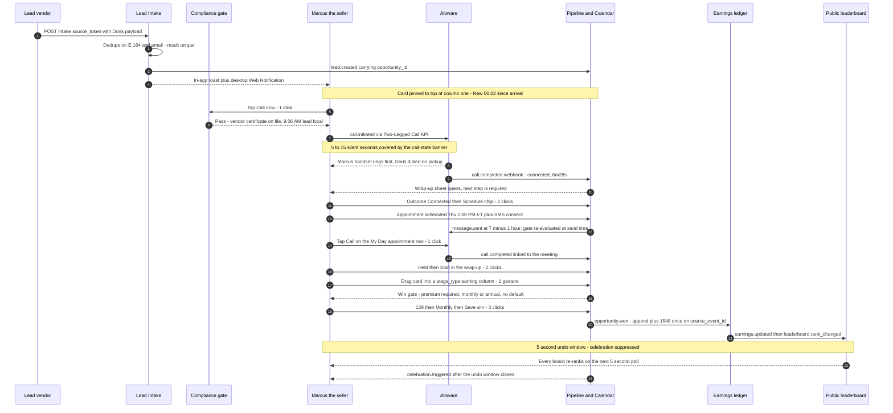
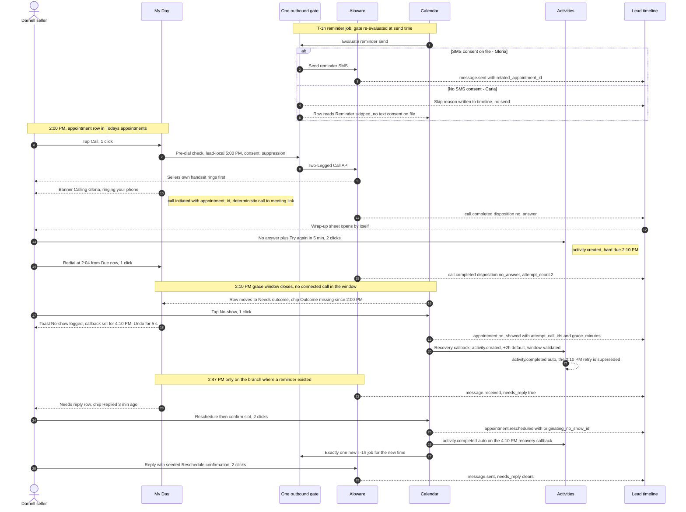
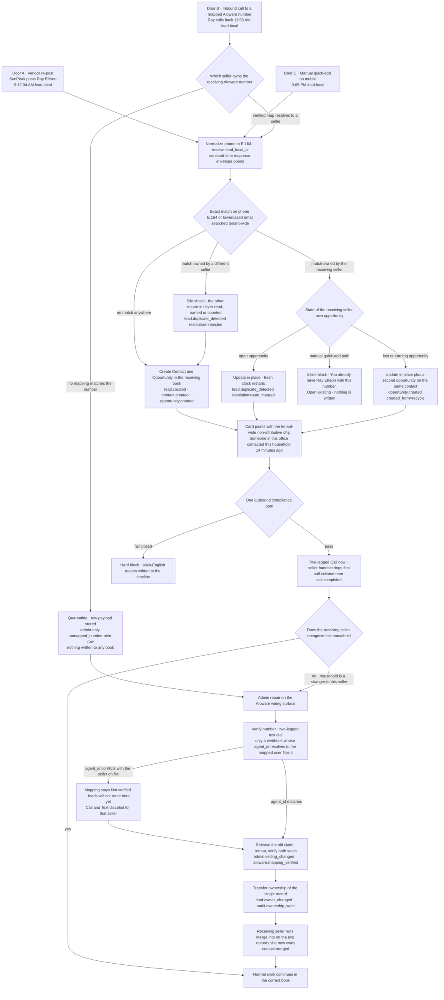
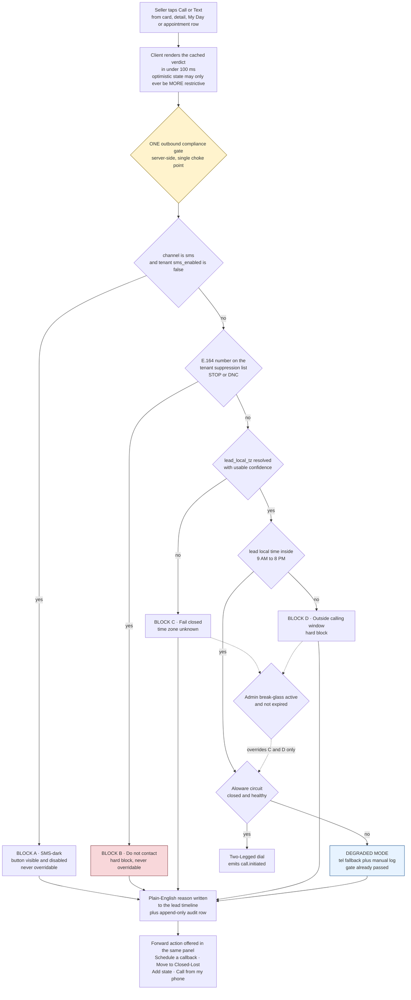
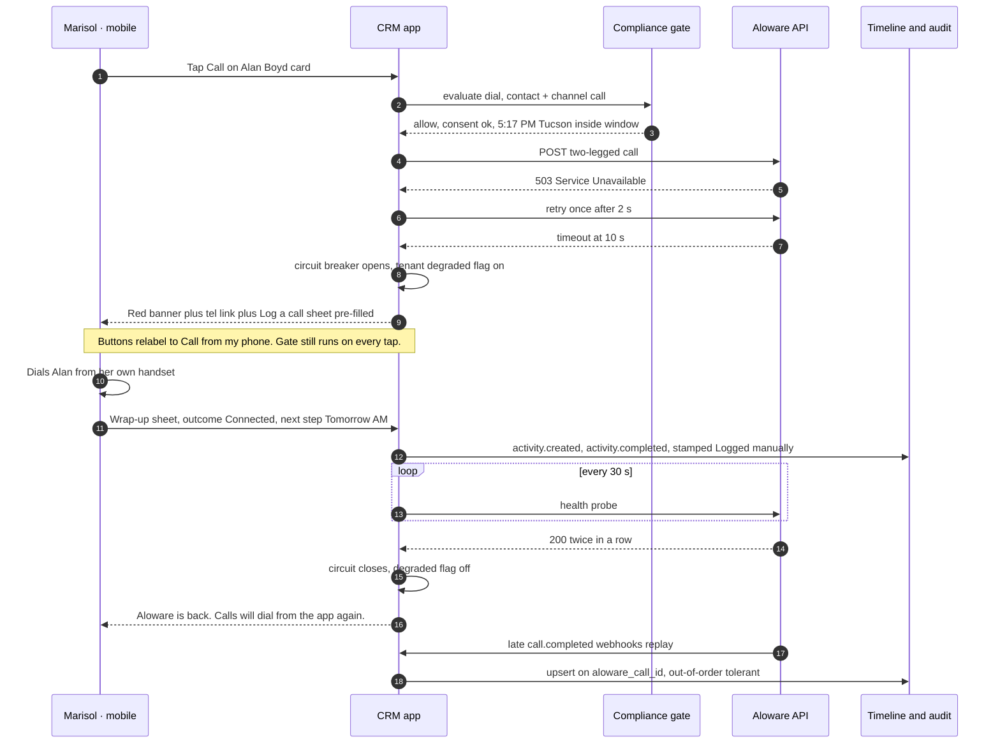
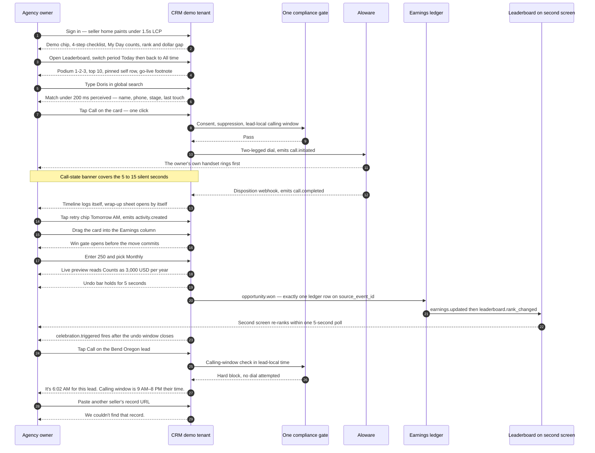
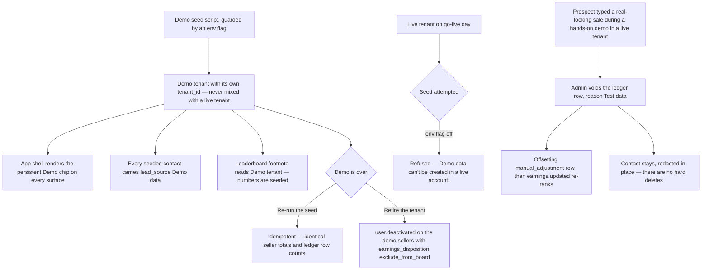

```mermaid
flowchart TD
  START["Open opportunity on Renata's board"] --> NULLQ{"last_touch_at IS NULL"}

  NULLQ -- "yes: imported card or never worked" --> SUPPRESS["Decay suppressed<br/>Card shows chip Uncalled and Not worked yet<br/>No rot flag - no No next step flag"]
  SUPPRESS --> WORKIT["Seller works it from My Book chip Uncalled<br/>or from My Day Fresh leads"]
  WORKIT --> TOUCH

  NULLQ -- "no: at least one human touch" --> CLOSEDQ{"stage_type of current stage"}
  CLOSEDQ -- "earning or lost" --> QUIET["No rot - no No next step - no fresh clock<br/>Closed cards are never nagged"]
  CLOSEDQ -- "open" --> DAYS{"days_since_touch vs cold_threshold_days"}

  DAYS -- "below threshold" --> CLEAN["Card renders clean<br/>Card face shows days since touch and attempt count"]
  DAYS -- "at or over threshold, default 7" --> AMBER["Amber flag: Rotting - 7 days since last touch<br/>emit opportunity.went_cold once per cold episode"]
  AMBER --> RED{"days_since_touch at or over twice the threshold"}
  RED -- "yes, default 14" --> COLD["Flag turns red - My Book chip flips to Cold<br/>no second opportunity.went_cold"]
  RED -- "no" --> ATRISK
  COLD --> ATRISK["Card listed in seller home At risk section"]

  ATRISK --> DIAL["Seller taps Call on the card - 1 tap<br/>through the one compliance gate"]
  CLEAN --> DIAL
  DIAL --> GATE{"Compliance gate verdict"}
  GATE -- "blocked: suppression, window or unknown timezone" --> BLOCKED["Hard block - plain-English reason on the timeline<br/>only forward action is Schedule a callback"]
  GATE -- "allowed" --> TOUCH["call.initiated then call.completed<br/>touch engine resets last_touch_at - rot flag clears"]

  TOUCH --> WRAP{"After-call wrap-up outcome"}
  WRAP -- "No answer or Voicemail" --> RETRY["Retry chip creates scheduled callback<br/>activity.created with a hard due time"]
  WRAP -- "Not interested or Wrong number" --> LOSTGATE["Loss gate bound to stage_type = lost"]
  WRAP -- "Sold" --> WINGATE["Win gate bound to stage_type = earning<br/>not this flow"]

  LOSTGATE --> REASON{"Typified reason chosen"}
  REASON -- "cancel" --> NOWRITE["Card stays in its stage - nothing written"]
  REASON -- "Bought elsewhere" --> LOST["opportunity.stage_changed then opportunity.lost<br/>no ledger row - card never entered an earning stage"]

  LOST --> DEAD["Contact stays in My Book with chip No open deal<br/>Start a deal is enabled"]
  DEAD --> CALLBACK["Six weeks later the lead calls back"]
  CALLBACK --> SEARCH["Ctrl+K global owner-scoped search by phone<br/>query normalized to E.164 - 2 interactions to the record"]
  SEARCH --> FOUND{"Match in my own book"}
  FOUND -- "no" --> EMPTY["No matches in your book.<br/>action: Quick-add this number"]
  FOUND -- "yes" --> START2["Tap Start a deal - 1 tap<br/>opportunity.created with created_from recycle and parent_opportunity_id"]
  START2 --> UNBROKEN["Same contact - one timeline<br/>April calls, the loss reason and today's callback in one stream"]
  UNBROKEN --> SCHED["Schedule then pick a slot - 2 clicks<br/>appointment.scheduled and consent.updated captured at booking"]
```

# 04 — Experience & Flows: The System That Sells Itself

> **Phase 4 deliverable.** Status: **complete, pending GATE 4.**
> Companion: [`04b-design-system.md`](04b-design-system.md). Feature scope: [`03-mvp-definition.md`](03-mvp-definition.md). Events: [`02b-integration-map.md`](02b-integration-map.md).
> **Method:** six end-to-end flows written in parallel by senior designers, four design-system areas, then a ruthless UX critic and a "what actually sells" pass. The critic found 57 gaps and contradictions across the package — including three incompatible design systems and eleven event names that did not exist. Part I is the resolution. Rulings in Part I are **normative and override anything below them.**

---

# Part I — Rulings (normative)

These close every conflict the review found. Where a flow or a design file below still reads differently, **this section wins**.

## R1 · The money chain

| # | Ruling |
|---|---|
| **R1.1** | **Speed-to-lead stops on `call.completed`** with a connected or voicemail outcome — **never on dial initiation.** Four specs had bound it to the tap, which would have made every no-answer dial report a perfect ~20-second first touch: a fabricated version of the one number that justifies the lead spend. |
| **R1.2** | **The ledger row is written inside the win-gate transaction** (exactly-once on `source_event_id`). It is not queued. |
| **R1.3** | **The public leaderboard projection excludes ledger entries younger than the undo window (5s).** This is how the undo-vs-celebration race is closed without delaying the write: no viewer ever sees a number that later corrects itself. The seller's own *My Earnings* may show the pending row immediately, marked pending. |
| **R1.4** | The celebration fires **after** the undo window closes. An undo inside the window is silent — no toast, no broadcast. |
| **R1.5** | The win gate and the loss gate bind to **`stage_type`** (`open` / `earning` / `lost`), **never to a stage name**. Renaming a column must change nothing. Enforced **server-side** on every path: drag, move-sheet, keyboard, wrap-up "Sold", and the raw API. |
| **R1.6** | The wrap-up "Sold" path and a drag into an earning stage are **the same server transition**. One credit per opportunity; the second is a no-op. |
| **R1.7** | **One threshold:** `cold_threshold_days`, default 7, configurable. There is no separate "rot" threshold. |

## R2 · Movement and input

| # | Ruling |
|---|---|
| **R2.1** | **Drag on desktop, move-sheet on mobile.** (This reverses the story text written in Phase 3, which had been drafted from the pre-override cut — [`03-mvp-stories.md`](03-mvp-stories.md) US-LCP-12 has been corrected.) A touch-drag must never write money by accident. |
| **R2.2** | **Mobile card quick actions are exactly four: Call · Text · Schedule · Move.** Note and Log live in the record; manual Log is a rare off-platform case because auto-logging plus the wrap-up sheet cover the normal path. This is what makes the ≤2-tap rule true instead of asserted. |
| **R2.3** | **A retry chip in the wrap-up sheet auto-commits and closes the sheet.** `Save` appears only when a note was typed. This is the highest-frequency action in the product; a mandatory third tap would cost ~60 taps a day. |
| **R2.4** | The wrap-up sheet opens **on call-banner close, not on the webhook.** The seller is never blocked by a third party. If the webhook lands later, it enriches the entry in place. |
| **R2.5** | The wrap-up sheet shows a **meeting-outcome control only when the call is meeting-linked** — otherwise the "one event, two chores" problem the deterministic link exists to prevent comes straight back. |
| **R2.6** | Reminder consent at booking is **2 taps to book + 1 optional tap** for the consent checkbox. The published click budget says exactly that. |

## R3 · Compliance in the interface

| # | Ruling |
|---|---|
| **R3.1** | Outside the lead-local calling window is a **hard block**, never a warn-and-attest. An "I'll call anyway" checkbox would produce an append-only log of exactly who chose to dial at 8:40 p.m. local — the plaintiff's exhibit, not the defense. |
| **R3.2** | **Every block offers the legal alternative one tap away** (`Schedule a callback`). A block that dead-ends teaches the floor that compliance means lost work. |
| **R3.3** | Break-glass copy must say what is **still** enforced: `Compliance override is on — calling-window checks are paused. STOP and DNC are still enforced.` Admin-only, audited, auto-expiring. |
| **R3.4** | The 10DLC banner never advertises email (email is V1.1): `Texting is pending carrier registration (10DLC). Calling works normally.` |
| **R3.5** | **Never render another seller's identity in a seller-facing timeline.** After an ownership repair, prior activity reads `Handled before this record moved to you`. |
| **R3.6** | The non-attributive recent-contact chip has a **reserved slot in the card anatomy**. A compliance mitigation with nowhere to render does not ship. |

## R4 · Demo integrity

| # | Ruling |
|---|---|
| **R4.1** | The demo tenant seeds **12–15 sellers**, not 3. With three rows there is no podium, no top-10 and no self-row with neighbours — the headline differentiator demos as an empty screen. |
| **R4.2** | The seed must include **a lead whose local time is outside the calling window at any hour a demo is likely to run.** The compliance-block moment currently disappears for any afternoon pitch, because at 2 p.m. ET no US timezone is outside 9 a.m.–8 p.m. |
| **R4.3** | The silo-proof URL is **baked into the runbook.** Asking a presenter to obtain another seller's record URL live guarantees a fumble. |
| **R4.4** | Two demo moments need scripted words, not silence: the **slow-webhook line** ("it lands a few seconds later — watch") and the **~10 seconds** between the win and the second screen re-ranking. The draining undo bar is deliberate choreography; the presenter must know that. |
| **R4.5** | Demo data lives in a **separate tenant**, is **idempotent**, is visibly marked, and **refuses to run in a live account.** |

## R5 · Consistency

| # | Ruling |
|---|---|
| **R5.1** | Eleven event names in use did not exist in the catalog. Nine were promoted to canonical and the rest remapped or rejected — see [`02b-integration-map.md` §4b](02b-integration-map.md). The catalog is now **49 events**. A demo script may never narrate an event that is a bug. |
| **R5.2** | The three competing design systems are reconciled into **one** in [`04b-design-system.md`](04b-design-system.md): one token per name, one hex per token, one kanban card height, one string per moment. |
| **R5.3** | The leaderboard period selector persists **to the URL** for sharing, **never across sessions**. All-time is the default on every fresh load, or the promise "all-time is the default" stops being true for anyone who has used the product. |
| **R5.4** | Surfaces the review found used-everywhere-and-specified-nowhere — **seller home, today activity strip, compliance block panel, My Day row, contact detail anatomy** — are specified in `04b`. The demo's opening surface cannot be the least-specified thing in the phase. |

## R6 · Performance budgets (these go into CI)

| Budget | Threshold | Measured where |
|---|---|---|
| Pipeline initial load | **LCP < 1.5s** with 500 leads (virtualized) | Seeded 500-lead tenant, cold cache |
| Interaction feedback | **< 100ms** to first visual response | Card quick actions, stage move, search keystroke |
| Drag | **sustained 60fps**, no dropped frames | 500-card board, desktop |
| API | **p95 < 300ms** | All read endpoints under seeded load |
| Global search | **< 200ms perceived** | Keystroke to first result row |
| Call banner | **< 300ms** from tap to banner | Stubbed Aloware that never answers leg A |
| Board re-rank | **< 5s** from ledger write to a second, non-focused client | Two browser contexts |

**These fail the build, not a dashboard.**

## R7 · Still open (carried to Phase 5)

- Exact fixed card height vs. anatomy density — resolved in `04b` on performance grounds; re-validate against a real 500-card render during the spike.
- The compliance gate's timezone-resolution failure path (`We can't confirm this lead's time zone`) needs a data source decision (zip→tz table vs. area code) in Phase 5.

---

# Part II — The end-to-end flows

# Master flow — a purchased lead lands, and 50 hours later it is money on the public board

> **Phase 4 · Flow F1 (experience, design & integration).** Every feature named here is inside the approved 68-item MVP ([`03-mvp-definition.md`](../../../../../Desktop/Agencia%20de%20Ventas/docs/03-mvp-definition.md) §3). Every event name is quoted from the canonical 40-event catalog ([`02b-integration-map.md`](../../../../../Desktop/Agencia%20de%20Ventas/docs/02b-integration-map.md) §4). Nothing below contradicts the Given/When/Then in [`03-mvp-stories.md`](../../../../../Desktop/Agencia%20de%20Ventas/docs/03-mvp-stories.md) except one item, which is called out as an **open conflict** in §5 rather than silently resolved.

---

## The narrative

**Marcus Bell** sells out of Tampa. His display timezone is `America/New_York`; so is the tenant business timezone. He has never opened a routing screen in his life, because there isn't one — leads are simply *his*.

**Tuesday, August 4, 2026, 12:06:31 PM ET.** The vendor SeniorLeadWorks POSTs **Doris Whitfield**, 68, Yuma, Arizona, to `POST /intake/{source_token}`. The token belongs to Marcus, so Doris belongs to Marcus. Her `lead_local_tz` resolves to `America/Phoenix` from the zip — **9:06 AM her time**, one hundred and six minutes into her calling window. Two seconds later Marcus's board lifts a card to the top of column one with a live counter: `New — 00:02 since arrival`.

**12:06:52 PM.** He taps **Call now**. One tap. The compliance gate reads the vendor consent certificate, the suppression list and the lead-local clock, passes, and hands the dial to Aloware's Two-Legged Call API. There is no softphone in this product — **his own handset has to ring first**. For the next eight seconds nothing happens in the physical world, and this is exactly where a lesser demo dies. The screen does not go quiet: a banner reads *"Calling Doris — ringing your phone…"* with a sub-line, *"Answer your phone first. We'll dial Doris the moment you pick up."* At 12:07:01 his phone rings. He answers. The banner flips to *"Dialing Doris…"*, then at 12:07:19 to **Connected** with a running timer. The card's clock has already stopped and been replaced by `First touch in 21s` — persisted once, never overwritten.

Six minutes and twenty-eight seconds later he hangs up and **types nothing**. The Aloware webhook lands five seconds after the hangup and writes the call onto Doris's timeline by itself. The wrap-up sheet is already open. He taps **Connected**, then the **Schedule** chip: the Quick Schedule sheet opens on the same beat, showing Thursday's slots labeled in both clocks — *"2:00 PM (11:00 AM their time)"*. He ticks *"Text her a reminder"* because she agreed to one out loud, taps the 2:00 PM slot, and the sheet closes. The card face now reads `Next: Thu 2:00 PM`. **Two taps to a booked appointment**, plus one for consent.

**Thursday, August 6, 1:00 PM ET.** A durable job wakes up, re-runs the compliance gate at send time — not at enqueue time — and texts Doris at 10:00 AM her time. One send. There is no ladder.

**2:00 PM ET.** Doris's appointment sits at the top of My Day. Marcus taps the row's **Call** — one tap, and because the dial was launched from the appointment row the call and the meeting are deterministically linked, so the outcome will not be a second chore. They talk for thirty-one minutes. She buys: **$129 a month.**

The wrap-up sheet opens carrying the meeting. He taps **Held**, then **Sold**. On the desktop board behind the sheet he drags the card from *Presented* into *Closed Won* — a stage whose `stage_type` is `earning`, which is the only thing the system cares about; he could have renamed that column *"Money"* and nothing would change. The board **refuses the drop** until the gate is answered: an amount, and an explicit **Monthly** or **Annual** with nothing preselected. He types `129`, taps **Monthly**, and the gate reads back *"Counts as $1,548.00 per year"* before he can save. He taps **Save win**.

The card lands. A toast holds a **5-second undo window**. The ledger appends exactly one row — `+1,548`, `period_key_day = 2026-08-06` stamped in the tenant business timezone, exactly-once on `source_event_id`. Marcus's all-time total goes from `$18,420` to `$19,968`; on the next 5-second poll, every screen in the agency — including the forty-nine sellers who cannot see a single one of his leads — watches him pass **Dana Reyes** and take **#6**. The undo window closes. *Then*, and only then, the confetti fires on his screen alone: *"Boom. $1,548 added. You're #6 — $612 behind Priya N."*

Deliberate actions Marcus performed across two days: **eleven**. Everything else was modules reacting to each other.

---

## Diagram

---

## Step table

Click counts are **interactions the seller performs**, counted from the surface named in the row. A drag gesture counts as 1. Typing into an already-focused field is not counted as a click; a field the seller must click into first is.

| # | What the seller does | Surface | Clicks | Responsible module | Events emitted | What each role sees |
|---|---|---|---|---|---|---|
| 1 | *Nothing.* Vendor POSTs Doris to Marcus's token at 12:06:31 PM ET | `POST /intake/{source_token}` | **0** | 1 Lead Intake | `lead.created` (carries `opportunity_id`, `received_at_utc_ms`, `contact_timezone`), `contact.created`, `consent.updated` (`channel=call`, `status=granted`, `reason=vendor_certificate`) | **Seller:** nothing yet. **Supervisor/Admin:** nothing yet — no intake console in MVP. |
| 2 | *Nothing.* Dedupe runs before anything is written: exact E.164, then lowercased email, silo-shielded | Intake service | **0** | 1 Lead Intake | none on a unique match. On a match in **Marcus's own** book: `lead.reposted` instead of `lead.created`. On a match in **another seller's** book: `lead.duplicate_detected` (`resolution=rejected`) and a second contact is still created in Marcus's book | **Seller:** nothing. **Supervisor/Admin:** nothing. The other seller is never named, hinted at, or counted. |
| 3 | *Nothing.* Opportunity auto-opens in the **first stage of Marcus's own stage set**, `value=null` | Pipeline write path | **0** | 2 Pipeline | `opportunity.created` (`created_from=lead_intake`) | **Seller:** card appears. **Supervisor:** card appears in the global read-scoped board with an owner chip. **Admin:** same, read-only. |
| 4 | *Nothing.* Tenant-wide non-attributive recent-contact check runs | Compliance core | **0** | 2 Compliance core | none | **Seller:** if this household was dialed by the office in the last hour, the card carries `This household was contacted by this office 12 minutes ago` — **no name, no record, no owner**. |
| 5 | Sees the toast and the desktop Web Notification `New lead — Doris W. — Call now` | App shell / OS | **0** | 11 Notifications *(consumer of `lead.created`, emits nothing)* | none | **Seller:** toast + desktop notification within 5s. **Supervisor/Admin:** **nothing** — notifications are owner-scoped, verified with two sellers logged in. |
| 6 | Looks at the board. The card is pinned to the top of column one with `New — 00:21 since arrival` ticking live | Pipeline board (desktop) / board (mobile) | **0** | 2 Pipeline | none | **Seller:** NEW treatment + live counter. **Supervisor:** the same card with an owner chip, no NEW pin priority in their global view. |
| 7 | **Taps `Call now` on the card face** | Card quick actions | **1** | 6 Communications → 2 Compliance core | `call.initiated` (`initiated_via=call_now_button`, `tcpa_consent_flag`, `local_time_at_contact`, `dnc_checked=true`) | **Seller:** call-state banner. **Supervisor/Admin:** the quick action is not rendered; a direct API call returns `403`. |
| 8 | *Nothing.* Gate verdict is recorded before the dial leaves the building | Compliance core | **0** | 2 Compliance core | audit row (append-only; the gate's input snapshot + verdict) | **Admin:** verdict visible in the audit log. **Seller:** only the outcome — pass is silent, block is loud. |
| 9 | *Waits 5–15 seconds.* The banner covers the silence: `Calling Doris — ringing your phone…` + `Answer your phone first. We'll dial Doris the moment you pick up.` → `Dialing Doris…` → `Connected 00:00` | Persistent call-state banner (survives navigation) | **0** | 6 Communications | none — `call.initiated` already fired at the 2xx | **Seller:** banner on every screen. **Supervisor/Admin:** nothing. |
| 10 | *Nothing.* The speed-to-lead clock stops **on dial initiation**, not on answer | Card | **0** | 2 Pipeline | none — `first_touch_latency_seconds = 21` is persisted on the opportunity, once, never overwritten | **Seller:** counter replaced by `First touch in 21s`. **Supervisor:** same value, read-only — this is the number that justifies the lead spend. |
| 11 | Hangs up at 12:13:47 PM. **Types nothing.** | — | **0** | 6 Communications (webhook consumer) | `call.completed` (idempotent on `aloware_call_id`; `disposition_canonical=connected`, `talk_time_seconds=388`), `activity.completed` (`auto_completed=true`) | **Seller:** the call is on the timeline before he looks. **Supervisor/Admin:** same entry in the read-scoped timeline. |
| 12 | The **wrap-up sheet opens by itself**. Taps **`Connected`** | After-call wrap-up sheet (desktop + mobile) | **1** | 6 Communications | none yet — the sheet is the source of **semantic outcome**; the Aloware disposition is enrichment only | **Seller:** sheet. **Supervisor/Admin:** never — supervisors do not wrap up calls they did not make. |
| 13 | Taps the **`Schedule`** chip to satisfy the **required next step** | Wrap-up sheet | **1** | 4 Calendar | none yet | **Seller:** Quick Schedule sheet, prefilled with Doris + this opportunity + this call. |
| 14 | Ticks **`Text her a reminder`** (unchecked by default — consent must be affirmative) | Quick Schedule sheet | **1** *(optional)* | 2 Compliance core | `consent.updated` (`channel=sms`, `status=granted`, `reason=manual`, evidence = verbal on this call) on confirm | **Seller:** checkbox. **Admin:** the consent row, with the call it was captured on. |
| 15 | Taps the slot **`2:00 PM (11:00 AM their time)`** — the tap *is* the confirm | Quick Schedule sheet | **1** | 4 Calendar | `appointment.scheduled` (`appointment_type=phone`, `starts_at_utc`, `contact_timezone`, `created_via=during_call`), `activity.created` (linked) | **Seller:** card face updates to `Next: Thu 2:00 PM`, sheet closes. **Supervisor:** appointment visible in the read-scoped view. |
| 16 | *Nothing.* Thu 1:00 PM ET: the durable job fires the **single T-1h reminder**, re-running the gate **at send time** | Job runner → 6 Communications | **0** | 6 Communications | `message.sent` (`channel=sms`, `related_appointment_id`, locked opt-out footer, `sent_by=automation`) — there is no `appointment.reminder_sent` event by design | **Seller:** the outbound text on the timeline. **Supervisor/Admin:** same, read-only. |
| 17 | Thu 2:00 PM ET: taps **`Call`** on the appointment row in **My Day** | My Day → *Today's appointments* | **1** | 6 Communications | `call.initiated` (`initiated_via=call_now_button`, carrying the meeting link) | **Seller:** the same banner; the same 5–15 second cover. **Supervisor:** their *own* My Day only — global visibility lives on the read-scoped board, never here. |
| 18 | Talks 31 minutes, hangs up. **Types nothing.** | — | **0** | 6 Communications | `call.completed` (`linked` to the meeting deterministically, because the dial was launched from the appointment row) | **Seller:** call auto-logged and already tied to the meeting. |
| 19 | Wrap-up sheet opens carrying the meeting. Taps **`Held`** | Wrap-up sheet (meeting control appears only when the call is meeting-linked) | **1** | 4 Calendar | `appointment.completed` (`marked_by=seller`, `linked_call_id`) | **Seller:** the Needs-outcome row never has to exist. **Supervisor:** show-rate becomes a fact rather than a confession. |
| 20 | Taps **`Sold`** | Wrap-up sheet | **1** | 6 Communications → 2 Pipeline | none yet — `Sold` satisfies the required next step and exposes one primary button, **`Record the sale`**, which is the *same server transition* as dropping the card into an earning stage | **Seller:** sheet closes to the board with `Record the sale` still available. |
| 21 | **Drags the card** from *Presented* into *Closed Won* (`stage_type = earning`) | Pipeline board, desktop (mobile: **Move** → target stage = 2 taps) | **1** *(gesture)* | 2 Pipeline | `opportunity.stage_changed` (`to_stage_closed_type=won` **resolved at move time**, `moved_via=kanban_drag`) — emitted only after the gate below returns | **Seller:** the drop is refused mid-air until the gate is answered. **Supervisor/Admin:** move API returns `403` with *"Supervisors have read-only access to seller books."* |
| 22 | **Win gate.** Types `129`, taps **`Monthly`** (no preselected default), reads `Counts as $1,548.00 per year`, taps **`Save win`** | Win gate modal (server-enforced) | **3** | 2 Pipeline (gate) | `opportunity.won` (`deal_value_annual_premium_usd = 1548.00`, non-null enforced) with a `source_event_id` | **Seller:** the gate. **Admin:** every field it wrote, in the audit log. |
| 23 | *Nothing.* Ledger appends **one** row, `period_key_day/week/month` stamped in the **tenant business timezone** | Earnings ledger (single writer) | **0** | 7 Earnings & Leaderboard | `earnings.updated` (`delta_usd = +1548`, `new_total_all_time_usd = 19968`, `triggering_event_id`) | **Seller:** total ticks in *My Earnings*. **Supervisor/Admin:** tenant total in the board header. |
| 24 | Sees the undo toast for **5 seconds**: `Moved to Closed Won. $1,548 credited. Undo` | Board toast | **0** *(1 only if undone)* | 2 Pipeline | on undo only: `opportunity.reopened` → reversal delta, **silently** — no toast, no desktop notification, no broadcast | **Seller:** the toast. **Everyone else:** nothing until the poll tick. |
| 25 | *Nothing.* Every board in the agency re-ranks on its next **5-second poll** | Public leaderboard | **0** | 7 Earnings & Leaderboard | `leaderboard.rank_changed` (`old_rank=7`, `new_rank=6`, `overtaken_seller_user_id` = Dana Reyes; names, avatars, totals and ranks only — **never lead data**) | **All 50 sellers + supervisors + admins:** the one legitimate cross-silo broadcast in the product. |
| 26 | **After** the undo window: the celebration fires on the closer's screen — `Boom. $1,548 added. You're #6 — $612 behind Priya N.` | Closer toast | **0** | 11 Notifications (celebration engine) | `celebration.triggered` (`celebration_type=closed_won`, `broadcast_scope=owner_only`, once per opportunity forever) | **Seller:** confetti + the gap line. **Everyone else:** the re-ranked board, no interruption. No floor-wide takeover in MVP. |
| 27 | *Nothing.* Doris stops being a lead | Contacts 360 | **0** | 3 Contacts 360 | `contact.became_client` | **Seller:** `Client` chip in My Book. **Supervisor/Admin:** same, read-only. *(The cross-sell automation this event feeds is V1.1 — the event is emitted, nothing consumes it in MVP.)* |

### Proving the ≤ 2-click rule

| Frequent action, measured from the pipeline board | Clicks | Rule |
|---|---|---|
| Call a lead (`Call now` on the card face) | **1** | ✅ |
| Call a lead from My Day / an appointment row | **1** | ✅ |
| Book an appointment (`Schedule` → slot tap commits) | **2** | ✅ *(+1 only to tick reminder consent)* |
| Create the next step after a no-answer (retry chip in the wrap-up) | **1** | ✅ |
| Text a lead (`Text` → seeded message → `Send`) | **3** | ⚠️ Bounded by design: the seeded-message tap and the send are two distinct compliance-relevant decisions. |
| Add a note (`Note` → type → save) | **2** | ✅ |
| Move a card between open stages | **1** drag (desktop) / **2** taps (mobile move-sheet) | ✅ |
| **Win a deal** (drag + amount + Monthly/Annual + Save win) | **4** | 🚫 **Deliberate exception.** This writes to a public number. The rule is optimistic-UI-with-undo *except* for money-moving actions, and the gate is the reason the leaderboard is trustworthy. |
| Undo any of the above | **1** | ✅ |

**Worst-case click count for the most frequent action in this flow — placing a call — is 1**, from all four surfaces that offer it (card face, contact action bar, My Day row, appointment row).

---

## States and edge cases

Every surface below defines **empty / loading / error / no-permission**. Skeletons, never spinners.

### Intake and ownership

| Condition | Behavior | Exact en-US microcopy |
|---|---|---|
| Token unknown, revoked or malformed | `401`, nothing written, no `lead.created` | *(API only — no seller-facing copy; an admin alert row is written)* |
| No usable phone **or** email | `422`, raw body persisted to the intake error log, seller notified | `Lead rejected from SeniorLeadWorks: no usable phone or email` |
| Vendor retries the same `provider_lead_id` | Exactly one contact, exactly one `lead.created`; second POST returns `200` | `{"status":"duplicate_ignored"}` |
| Timezone resolved from area code only | Lead is still created — the flag **never** blocks intake | `Time zone unconfirmed` |
| Same person already in **Marcus's** book with an open card | No second card; the existing card goes fresh again, clock restarts | `Re-posted from SeniorLeadWorks on Aug 4` |
| Same person in **another seller's** book | A separate contact is created in Marcus's book. The other record is never read, referenced, counted or hinted at | *(no copy — the absence is the feature)* |
| Marcus opens Doris by URL and she is not his | Owner-scoped not-found. Never a partial header, never her name | `We couldn't find that record.` |

### The dial — the highest-risk 15 seconds in the product

| Condition | Behavior | Exact en-US microcopy |
|---|---|---|
| Normal two-legged dial | Banner, three states, survives navigation | `Calling Doris — ringing your phone…` → `Dialing Doris…` → `Connected` → `Wrap up` |
| The 5–15 silent seconds | Sub-line under the banner from t=0 **(NEW copy)** | `Answer your phone first. We'll dial Doris the moment you pick up.` |
| Still silent at 12 seconds **(NEW copy)** | Elapsed counter appears in the banner | `Still ringing your phone — 12s.` |
| Marcus's handset never rings (20s, no leg-A answer) **(NEW copy)** | Banner turns amber, `tel:` fallback + **Log a call** offered | `Your phone didn't ring. Call from your phone instead and we'll log it.` |
| Aloware returns 5xx or times out at 10s | Red degraded-mode banner, `tel:` link, **Log a call** form opens pre-filled — the attempt is never lost | `Aloware is unavailable. Dialing from your phone; log this call manually.` |
| Marcus's number mapping is `unverified` | Call and Text disabled everywhere, with tooltip | `Your calling number isn't verified yet. Ask your admin to finish setup.` |
| Doris is on the suppression list | **Hard block.** Call/Text disabled; Log, Note and Schedule stay enabled. Written to the timeline | `Blocked: this number opted out on Mar 4. Texting and calling are off.` |
| It is 6:04 AM in Yuma (the lead landed at 9:04 AM ET instead of 12:06 PM) | **Hard block**, not a warning. The card offers **Schedule a callback** as the only forward action | `It's 6:04 AM for this lead. Calling window is 9 AM–8 PM their time.` |
| Timezone cannot be confirmed | Gate **fails closed** | `We can't confirm this lead's time zone. Add their state to continue.` |
| Gate is failing closed tenant-wide on a bad lookup | Admin-only, reason-required, 60-minute auto-expiring break-glass; every permitted dial writes an audit row; persistent banner for **every** signed-in user | `Compliance override is on — calling-window checks are paused. STOP and DNC are still enforced.` |
| Marcus is offline | Call disabled; nothing is queued and silently sent later | `You're offline — calls are paused.` **(NEW copy)** |

### Webhook, wrap-up and the next step

| Condition | Behavior | Exact en-US microcopy |
|---|---|---|
| Webhook delivered twice | Idempotency key short-circuits it: one Activity, one notification, `attempt_count` incremented once | *(silent)* |
| Webhook arrives out of order | Final state identical to in-order processing; the earlier event never overwrites richer later data | *(silent)* |
| Signature fails, or processing throws after N retries | Dead-letter queue, raw body retained, admin counter increments. **Nothing is discarded.** | *(admin surface only)* |
| Disposition code not in the map | Call still logs with `outcome = unknown`, card still shows the attempt, admin alert row written | *(silent to the seller)* |
| Webhook never arrives (Aloware silent) | The wrap-up sheet opens on **banner close**, not on the webhook — the seller is never blocked by the integration | — |
| Seller tries to dismiss the sheet with no next step | Sheet stays open | `Pick a next step before you close this.` |
| Outcome = **No answer** / **Voicemail** (70–80% of dials) | Retry chips `+2 hours` · `Tomorrow AM` · `Tomorrow PM` · `Pick a time` — **one tap** creates the scheduled callback with a hard due time and closes the sheet | — |
| Outcome = **Wrong number** | Number flagged, excluded from future dials, reversible from the contact | `Marked as a wrong number.` |
| Outcome = **Not interested** | Routes to the typified loss reason (`stage_type = lost`), not to a next step | — |
| Call taken on a personal phone, off platform | Same sheet, same taxonomy, manual date/time picker | `Logged manually` |

### Scheduling and the single reminder

| Condition | Behavior | Exact en-US microcopy |
|---|---|---|
| Slot falls outside the lead-local window | Blocked, nearest valid slot suggested | `That's 8:30 PM for this lead — outside the 9 AM–8 PM calling window.` |
| Doris already has an upcoming appointment | Duplicate guard; **Reschedule that one** is the default action | `Doris Whitfield already has an appointment Thu 2:00 PM.` |
| Reminder consent not captured | The appointment books fine; the reminder simply never schedules | `Reminder off — no text consent captured.` **(NEW copy)** |
| Gate fails at send time (STOP arrived Wednesday) | Send skipped, reason on the timeline and on the appointment | `Reminder skipped: lead opted out.` |
| Job runner restarted between enqueue and fire | Durable store — the reminder still fires | — |
| Fire time already more than 15 minutes past | Dropped, not sent late | `Reminder skipped: too late to be useful.` |
| 10DLC not approved on go-live | Every SMS entry point **visible but disabled**; the reminder resolves to `skipped: sms_disabled`; the gate enforces it, not the UI | `Texting is pending carrier registration (10DLC). Calling works normally.` |
| Doris replies *"can we move it?"* | **Not parsed.** It becomes a needs-reply row in My Day for a human. Only STOP/START are keyword-handled | `Lead sent STOP on Aug 5. All outbound is blocked.` *(STOP case)* |
| Meeting end time passes with no outcome | Enters *Needs outcome* in My Day within 60 seconds and **cannot be dismissed** | `Needs outcome (1)` |
| No-show | One tap records it **and** auto-creates a recovery callback at +2 hours, editable in the same sheet | `No-show` |

### The win gate, the ledger and the board

| Condition | Behavior | Exact en-US microcopy |
|---|---|---|
| Drop into `stage_type=earning` with no premium | Move fails **server-side** with `422 premium_required` — never enforced in the drag handler | — |
| Monthly-or-annual not chosen | `Save win` stays disabled; there is **no preselected default** | — |
| `129` + `Monthly` | Stores `premium_monthly=129.00` **and** `premium_annual=1548.00`; every public surface shows the annual figure with `/yr` | `Counts as $1,548.00 per year` |
| Amount ≤ 0, non-numeric, or > $100,000/yr | Blocked, nothing written | `Enter a premium between $1 and $100,000 per year.` |
| Gate submitted twice (double-click, retry, replay) | Unique constraint on `(tenant_id, source_event_id)` rejects the second insert. Total unchanged. Logged, not shown as an error | *(silent)* |
| Ledger insert fails | The stage move **rolls back with it** — one transaction | `Couldn't record this sale — nothing was saved. Try again.` |
| Server rejects the move (403, validation, stale version) | The card visibly returns to its original column | `Couldn't move that card — nothing was changed.` |
| Undo tapped inside 5 seconds | `opportunity.reopened` → reversal delta appended (the original row is **never** mutated), celebration cancelled, `opportunity.celebrated_at` never set. **Silent** — no toast, no notification, no broadcast | *(silent by design)* |
| A viewer's 5-second poll lands between the credit and the undo | They see `$19,968` for up to 5 seconds and then see it corrected. **Stated, not hidden** — this is the honest cost of writing the ledger at commit rather than at T+5s | — |
| Premium corrected later | Reason required; a `value_correction` delta is appended; the board re-ranks; the timeline records it | `Deal value corrected $1,548 → $1,200 — carrier issued at a lower face.` |
| Card moved back out of the earning stage | Reversal delta appended; total drops; **no** celebration, **no** floor-wide notice | `Earnings reversed — moved from Closed Won to Presented.` |
| Marcus later un-flags *Closed Won* as an Earnings stage | **Forward-only.** Existing rows are immutable; his total does not drop | `Past Earnings already credited from this stage stay on the leaderboard.` |
| A non-human actor (import, webhook, job, API token) tries to enter an earning stage | Refused with `actor_type must be human`; admin alert row; no ledger row | *(no seller-facing copy)* |
| Leaderboard poll fails 3× consecutively | Last known values stay on screen. The board **never blanks and never renders a false `$0`** | `Reconnecting…` |
| Go-live day, no ledger rows | Distinct empty states per period, plus a permanent footnote | `No earnings yet. First sale of the day owns the top spot.` · `Nothing on the board yet today.` · `The board starts at go-live — imported history isn't counted.` |
| Someone taps another seller's leaderboard row | **Nothing opens.** Name and total only; there is no path from the board into anyone's book | — |

### Loading, empty, and no-permission on every surface in this flow

| Surface | Loading | Empty | No permission |
|---|---|---|---|
| Pipeline board | Column-shaped skeletons, real column headers and counts render first | `Nothing here yet` per column + `Quick-add lead` — **the empty state teaches the first action** | Supervisor: read-only, no quick actions, no move-sheet; move API `403` |
| My Day | Section headers with counts render first, rows skeleton in | `You're clear. Nothing due right now.` per section | Supervisor sees **their own** My Day only |
| Call-state banner | n/a — appears at the API 2xx, inside 2s | n/a | Hidden entirely without a verified mapping |
| Wrap-up sheet | Opens instantly; the webhook fills the duration in place | n/a | Never rendered for a non-owner |
| Quick Schedule | 7-day slot grid skeletons; existing appointments blocked out | n/a | Not rendered for a non-owner |
| Win gate | Submit shows an inline progress state on the button, never a full-screen spinner | n/a | `403` server-side for supervisor/admin |
| Leaderboard | Podium + 10 row skeletons, self-row skeleton pinned | `No earnings yet. First sale of the day owns the top spot.` | None — this is the one tenant-public surface |

### Performance budget checkpoints on this flow (CI-enforceable)

| Checkpoint | Budget | Where it is measured |
|---|---|---|
| Board initial load, 500 leads, paginated/virtualized | **LCP < 1.5 s** | Step 6 |
| `Call now` tap → banner visible | **< 100 ms** perceived; API 2xx → `call.initiated` on the timeline **< 2 s** | Step 7 |
| Drag frame rate | **60 fps, no perceptible dropped frames** | Step 21 |
| Any API call on this path | **p95 < 300 ms** | Steps 7, 15, 22 |
| Owner-scoped search (pulling Doris up when she calls back) | **< 200 ms** perceived, results in **< 500 ms** | Not in the happy path — in the recovery path |
| `earnings.updated` → visible on every board | **≤ 5 s** (poll interval) | Step 25 |
| Notification dispatch after `lead.created` | **≤ 5 s** | Step 5 |

### Accessibility on this critical path (WCAG 2.1 AA)

- **The drag is never the only way.** The move-sheet is the keyboard and screen-reader path on desktop as well as the touch path on mobile: focus the card, `Enter` opens **Move**, arrow keys select the stage, `Enter` commits — the same server transition, the same gate.
- The call-state banner is an `aria-live="polite"` region so the three state changes are announced, which matters most during the 5–15 silent seconds.
- The win gate traps focus, `Save win` is unreachable until both inputs are valid, and `Escape` cancels leaving the card where it was.
- Rank, gap and dollar figures are text, never color-only; the compliance badge pairs color with a word (`OK to contact` / `Do not contact` / `Outside calling hours`).
- Visible focus on every interactive element on this path; the celebration respects `prefers-reduced-motion`.

---

## What each role sees

### Seller (Marcus)
Everything above, and **only his own book**. He sees Doris, his board, his My Day, his ledger, his rank and his gap. He sees the public leaderboard — the one and only place he sees data outside his silo, and it carries names, avatars, totals and ranks, never a lead row. He can configure his own stages, including which ones count as Earnings, and the win gate binds to `stage_type`, so renaming *Closed Won* to *Money* changes nothing. He can undo his own move for 5 seconds. He can correct his own deal value with a reason, which appends a delta and never mutates history.

### Supervisor
Global **read** scoping applied to the *same* screens — no separate reports were built. Every card and every row carries an owner chip and the header offers a seller filter. The exception views a supervisor actually needs (unworked fresh leads, missing outcomes, no next step) are produced by sorting and filtering those same surfaces. Every write is refused: stage move, note, edit, dial, win gate all return `403` with *"Supervisors have read-only access to seller books."* My Day shows the supervisor's **own** items, not the floor's. On the leaderboard, **no self-row is rendered** — they don't sell — and the header shows the tenant total for the selected period instead. Opening a seller's book writes a `book.viewed` audit row.

### Admin
Everything the supervisor sees, plus: the Aloware user↔number identity map and its **Verify number** step (a mapping stays `unverified` and rejects dials and webhooks until a test call resolves back to that seller); users and fixed roles; the configurable cold threshold; the reminder kill switch; single-record ownership transfer, which moves the record but **never** moves Earnings already credited; ledger void/adjust-with-reason, where a typed reason is mandatory, an offsetting `manual_adjustment` row is written, the original row is never deleted, and the reason text is shown to the affected seller in **My Earnings**; and the tenant-scoped, 60-minute, auto-expiring break-glass override. Every one of those writes an append-only audit row with actor, timestamp, entity and before/after, and there is no API path that can update or delete an audit row.

### Nobody
No unauthenticated surface. No kiosk route. No tappable seller profile from the leaderboard. No path from a public rank into a private book.

---

## §5 · One open conflict that needs a ruling before build

**Drag-and-drop vs. the move-sheet.** `03-mvp-definition.md` §2 rejects Critic A's proposal to drop drag entirely and rules: **drag on desktop, move-sheet on mobile**, with the undo/celebration race resolved by **delaying the celebration by the 5-second undo window** (MVP items 30 and 31, and the binding decisions for this phase). But `03-mvp-stories.md` **US-LCP-12** was written to the *un-counter-ruled* version — *"there is NO drag-and-drop anywhere in the product"* — and **US-9.8** then reasons from that premise: *"Because drag-and-drop was replaced by the move-sheet on all devices, there is no undo-vs-celebration race to handle."*

This flow is written to the **binding decision** (drag on desktop, move-sheet on mobile, celebration after the undo window), because that is the ruling of record and because the drag is on the protected demo list. Two acceptance criteria in the stories document therefore need to be rewritten before they reach CI:

- **US-LCP-12** must read *"move-sheet on mobile and as the keyboard path on desktop; drag on desktop pointer input"* rather than *"no drag-and-drop anywhere."*
- **US-9.8** must restore the undo-window delay: the celebration fires at **T+5 s**, is cancelled if a reversal exists, and `opportunity.celebrated_at` is set only when it actually fires.

Everything else in this flow is consistent with both documents.

---

# Flow F2 — Exception: the appointment nobody answered, and the one whose reminder never went out

> **Phase 4 · Experience, design & integration.** Everything below uses only features from the approved 68-item MVP (`03-mvp-definition.md`) and only event names from the canonical 40-event catalog (`02b-integration-map.md` §4). Where this flow needs a behavior the acceptance criteria do not yet specify, it is called out explicitly under **Gaps this flow exposes** rather than invented silently.

---

## The story

**Darnell Foster** sells out of Phoenix. `user_display_tz = America/Phoenix`, `tenant_business_tz = America/New_York`. He has two phone appointments on Thursday, August 6.

**2:00 PM — Gloria Ibarra**, 61, Macon GA (`lead_local_tz = America/New_York`, so 5:00 PM her time). She arrived as a vendor ping-post with a certificate URL on file. When Darnell booked her on Tuesday he checked **May we text you a reminder?** in the Quick Schedule sheet, so there is an express SMS consent row on her number captured at booking.

**3:30 PM — Carla Whitfield**, Toledo OH (`lead_local_tz = America/New_York`, 6:30 PM her time). Carla is a referral Darnell quick-added from his truck last week. There is no vendor certificate and he never checked the reminder box. **She has no SMS consent at all.**

At **1:00 PM** the T-1h job for Gloria wakes up, re-runs the compliance gate at send time, passes, and one text goes out. At **2:30 PM** the T-1h job for Carla wakes up, re-runs the same gate, and is refused — no text is transmitted and the appointment row starts reading `Reminder skipped: no text consent on file.`

At **2:00 PM** Darnell taps **Call** once on Gloria's row in My Day. His own handset rings first — the two-legged path means there is no softphone, so for eleven seconds nothing would be happening if the screen were blank. It isn't: a call-state banner reads `Calling Gloria — ringing your phone…` with an elapsed timer. He answers, Aloware dials Macon, and nobody picks up. The wrap-up sheet opens by itself; he taps **No answer** and **Try again in 5 min**. At **2:04** he redials from the Due now row. Nothing again. At **2:10** the grace window closes, the appointment drops into **Needs outcome** with the chip `Outcome missing since 2:00 PM`, and Darnell taps **No-show** — one tap, which records the outcome *and* books the recovery callback for 4:10 PM, with a five-second **Undo** toast before anything leaves the browser.

At **2:47** Gloria answers the reminder text — *"so sorry, I was at the pharmacy, can we do tomorrow morning?"* — and **Needs reply** lights up with `Replied 3 min ago`. The product does not parse that sentence; nothing beyond STOP/START is parsed in MVP, and a human is the intended reader. Darnell opens the row, taps **Reschedule**, picks Friday 9:30 AM, and the sheet shows him `9:30 AM (12:30 PM their time)` before he confirms. The new meeting carries `originating_no_show_id`, the 4:10 PM recovery callback auto-completes as superseded, exactly one new T-1h reminder job is enqueued for 8:30 AM, and he taps the `Reschedule confirmation` seeded message to close the thread. Two hours and forty-nine minutes after a dead appointment, the card has a next step again.

Carla's 3:30 PM goes exactly the same way — two dials, no answer, **No-show** at 3:40 — with one difference that matters: **Needs reply never lights up, because no reminder ever went out.** Her row shows `No reminder was sent — no text consent on file.` The `+2 hours` recovery chip resolves to 8:40 PM her time and is refused by the calling window: `That's 8:40 PM for this lead — pick a time inside the calling window.` Darnell takes `Tomorrow AM` instead. Her recovery is call-only, and the product says so in plain English instead of pretending the text failed.

**Nothing in this entire flow writes a single Earnings ledger row.** No-shows do not move money, no celebration fires, and the public board is byte-identical at 4:00 PM to what it was at 1:00 PM. That is the design working, not a gap.

---

## Diagram

---

## Step table

Frequent actions in this flow are **dial from the Today strip**, **close a wrap-up**, **log a no-show**, and **reschedule**. Each is at or under two clicks from the surface where the seller already is.

| # | What the seller does | Surface | Clicks | Responsible module | Events emitted | What each role sees |
|---|---|---|---|---|---|---|
| 0a | *(Tuesday, setup)* Books Gloria and checks **May we text you a reminder?** | Quick Schedule sheet, from the card | 2 total to book | Calendar (#52) | `appointment.scheduled`, `consent.updated` `{channel:sms, status:granted, reason:manual}`, `activity.created` | **Seller:** card chip `Next: Thu 2:00 PM`. **Supervisor/admin:** same card read-only with an owner chip. |
| 0b | *(Last week, setup)* Books Carla, leaves the reminder box unchecked | Quick Schedule sheet | 2 | Calendar (#52) | `appointment.scheduled`, `activity.created` — **no** `consent.updated` | **Seller:** the appointment row reads `Reminder off — no text consent on file.` from the moment it is saved, not at T-1h. **Supervisor/admin:** same, read-only. |
| 1 | Nothing — the T-1h job for Gloria fires at 1:00 PM | Background job runner (#54) | 0 | Calendar + gate (#11) | `message.sent` `{related_appointment_id, channel:sms}` | **Seller:** the outbound text appears on Gloria's unified timeline. **Supervisor/admin:** same timeline, read-only. |
| 2 | Nothing — the T-1h job for Carla fires at 2:30 PM and is refused | Background job runner | 0 | Gate (#11) | **none** — no send, therefore no `message.sent` | **Seller:** timeline entry `Reminder not sent — this lead never agreed to texts.` and the appointment reads `Reminder skipped: no text consent on file.` **Admin:** the gate's input snapshot + verdict in the append-only audit log. |
| 3 | Receives the T-15m alert and glances at My Day | In-app toast + desktop Web Notification (#58, US-803) | 0 | Notifications | none *(no canonical event covers T-15m — see gaps)* | **Seller only.** No other seller can receive it — owner-scoped routing. |
| 4 | Taps **Call** on the 2:00 PM row | My Day → *Today's appointments* | **1** | Comms dial service (#41), gate (#11) | `call.initiated` `{initiated_via:call_now_button, appointment_id, local_time_at_contact}` | **Seller:** call-state banner `Calling Gloria — ringing your phone…` under 100 ms, before the Aloware 2xx. **Supervisor:** no Call button is rendered; the API returns 403. |
| 5 | Answers his own handset and waits out the 5–15 silent seconds | Persistent call-state banner (#42) | 0 | Comms | none | **Seller:** banner sub-line `Answer your phone and we'll connect you.` with an elapsed timer; the banner survives navigation to any other screen. |
| 6 | Nobody picks up | Aloware webhook (#43, #44) | 0 | Comms | `call.completed` `{disposition_canonical:no_answer, aloware_call_id}` | **Seller:** the call auto-logs on the timeline; `attempt_count` reads `1 attempt` on the card. **All roles:** the entry is idempotent on `aloware_call_id`. |
| 7 | Wrap-up sheet opens by itself; taps **No answer**, then **Try again in 5 min** | After-call wrap-up sheet (#46) | **2** | Comms + Activities (#59) | `activity.completed` *(the dial task)*, `activity.created` *(callback, hard due 2:10 PM)* | **Seller:** sheet closes, the card's next-activity chip reads `Callback 2:10 PM`. **Supervisor:** sees the resulting activity, cannot create one. |
| 8 | Redials at 2:04 from the **Due now** row | My Day → *Due now* | **1** | Comms dial service | `call.initiated`, then `call.completed` `{no_answer}` | **Seller:** card now reads `2 attempts`; both dials are on the timeline in `user_display_tz`. |
| 9 | Wrap-up again: **No answer** + **Try again in 5 min** | Wrap-up sheet | **2** | Comms + Activities | `activity.completed`, `activity.created` | Same as step 7. *(This is the double-wrap-up friction named in the gaps below.)* |
| 10 | 2:10 PM — grace closes, the row moves itself | My Day → *Needs outcome* | 0 | Calendar (#55) | none | **Seller:** chip `Outcome missing since 2:00 PM`; the item cannot be dismissed. **Supervisor:** the same appointment appears when they filter the global read view for missing outcomes. |
| 11 | Taps **No-show** | My Day → *Needs outcome* row | **1** | Calendar (#56) | `appointment.no_showed` `{marked_by:seller, grace_minutes:10, attempt_call_ids:[c1,c2], reschedule_attempt_number:1}` → `activity.created` *(recovery callback, +2h default)* → `activity.completed` *(auto, supersedes the 2:10 retry)* | **Seller:** toast `No-show logged. Callback set for 4:10 PM.` with **Undo** for 5 s; card gets the `No-show · Aug 6` badge. **Supervisor/admin:** the badge and the timeline; no ledger row anywhere — no-shows never touch Earnings. |
| 12 | *(Carla branch, 3:40 PM)* Taps **No-show**; the `+2 hours` chip resolves to 8:40 PM her time | Needs outcome row | **1** + 1 to pick another chip | Calendar (#56) + gate (#10, #11) | `appointment.no_showed`; the rejected chip emits **nothing** | **Seller:** `That's 8:40 PM for this lead — pick a time inside the calling window.` and `Tomorrow AM` is pre-highlighted. **Admin:** the refusal is in the gate's audit log. |
| 13 | 2:47 PM — Gloria's reply lands | Aloware SMS webhook (#48) | 0 | Comms | `message.received` `{channel:sms, intent_hint:reply}` | **Seller:** *Needs reply* row with `Replied 3 min ago` + one notification, within 5 s. **Carla branch:** this row never appears — see the empty state in step 15. |
| 14 | Opens the row and taps **Reschedule**, then confirms the Friday 9:30 AM slot | My Day → *Needs reply* → Quick Schedule sheet | **2** | Calendar (#52, #56) | `appointment.rescheduled` `{originating_no_show_id, old_starts_at_utc, new_starts_at_utc, rescheduled_by:contact}`, `activity.created`, `activity.completed` *(auto, on the 4:10 PM recovery callback)* | **Seller:** slot labeled `9:30 AM (12:30 PM their time)`; card chip flips to `Next: Fri 9:30 AM`. **Supervisor:** sees the rebook and the link back to the no-show. |
| 15 | Replies in the thread with the seeded **Reschedule confirmation** constant | SMS thread (#47, #49) | **2** | Comms + gate | `message.sent` | **Seller:** `needs_reply` clears and the row leaves *Needs reply* live, no refresh. **Carla branch:** the section stays on its empty state `Nothing waiting on a reply.` and the only forward action is the callback. |
| 16 | *(Carla branch)* Calls her back next morning from **Due now** | My Day | **1** | Comms dial service | `call.initiated` → `call.completed` `{connected}` → wrap-up → `appointment.scheduled` | **Seller:** the reschedule is negotiated by voice; the appointment is created fresh and carries no `originating_no_show_id` unless booked from the no-showed appointment's **Reschedule** action. |

**Click-rule proof.** Dial from the Today strip: **1**. Log a no-show *and* spawn the recovery callback: **1**. Reschedule from the needs-reply row: **2**. Reply with a seeded message: **2**. Close a wrap-up: **2**. Worst case for the most frequent action in this flow (dialing a lead at appointment time) is **1 click**.

---

## States and edge cases

### The two consent branches, side by side

| | Gloria — consent captured at booking | Carla — no SMS consent |
|---|---|---|
| At booking | Consent row written, `consent.updated {channel:sms, status:granted}` | No consent row; the sheet's checkbox is left unchecked |
| Appointment row, immediately | `Reminder on — we'll text 1 hour before.` | `Reminder off — no text consent on file.` |
| At T-1h | `message.sent` with `related_appointment_id` | Job runs, gate refuses, **no send**, timeline entry `Reminder not sent — this lead never agreed to texts.` |
| Appointment row after T-1h | Shows the sent reminder inline | `Reminder skipped: no text consent on file.` |
| **Text** button on the record | Enabled | Disabled with `Texting is off — no consent on file for this number.` — Call, Log, Note and Schedule stay enabled |
| After the no-show | *Needs reply* can light up | *Needs reply* renders `Nothing waiting on a reply.` — there is no thread to reply to |
| Recovery path | Text or call | **Call only**, and the product says so rather than implying a delivery failure |

The distinction the microcopy must never blur: **"we didn't send"** is not **"it didn't arrive."** A skipped reminder is written to the timeline as a decision with a reason; a hard bounce is written as `message.delivery_failed`. They read differently on purpose.

### Failure, missing data, no permission, bad network, external system down

| Condition | What happens | Exact en-US microcopy |
|---|---|---|
| Aloware returns 5xx or times out at 10 s on the 2:00 PM dial | Degraded dial mode: red banner, a `tel:` fallback, and **Log a call** opens pre-filled with the contact **and the appointment id**, so the manual entry still lands in `attempt_call_ids[]` | `Aloware is unavailable. Dialing from your phone; log this call manually.` |
| The `call.completed` webhook never arrives | The wrap-up sheet is still reachable from the **Wrap up** state of the call-state banner; the flow never depends on a webhook to produce an outcome | `Wrap up` |
| Webhook arrives 40 s late or out of order | `occurred_at_utc_ms` threads it at the real time while `recorded_at_utc_ms` records when we learned; upsert on `aloware_call_id` means no second Activity and no second `attempt_count` increment | — |
| Webhook fails signature verification | Envelope lands in the dead-letter queue with the raw body retained; an admin-visible counter increments; nothing is discarded | *(admin surface only)* |
| Lead's timezone cannot be resolved | The gate **fails closed** and the 2:00 PM dial is refused — which is why the `Time zone unconfirmed` badge is on the appointment row from the moment it is booked, not sprung at appointment time | `We can't confirm this lead's time zone. Add their state to continue.` |
| The recovery callback would land outside 9 AM–8 PM lead-local | The chip is refused inline and the nearest valid option is highlighted; no activity is written | `That's 8:40 PM for this lead — pick a time inside the calling window.` |
| The lead is on the suppression list when the reminder job runs | Hard block, reason on the timeline, appointment row updated | `Reminder skipped: lead opted out.` |
| The lead replies `STOP` to the reminder instead of rescheduling | `message.received` → `consent.updated {status:revoked}`; every Call and Text button for that number disables on the next render; the recovery callback **stays** but the card shows the red badge | `Lead sent STOP on Aug 6. All outbound is blocked.` |
| The reminder hard-bounces | `message.delivery_failed`; the bubble flips and the seller learns the number is bad *before* 2:00 PM | `Failed — <carrier reason>` |
| Seller is offline when the grace window closes | Write actions are disabled rather than queued optimistically — the board and My Day never claim a state the server never saw | `You're offline — outcomes are paused.` / `You're offline — calling is paused.` |
| My Day fails to load | Last good render is kept where one exists; otherwise the section renders its error state with a retry, never a spinner | `Couldn't load your day. Retry.` |
| Supervisor taps **Call** or **No-show** | Not rendered in the UI; the endpoint returns 403 with no side effect and no audit write other than the read | `Supervisors have read-only access to seller books.` |
| Another seller opens the appointment by URL | Owner-scoped not-found — never a partial header, never the lead's name | `We couldn't find that record.` |
| SMS is dark tenant-wide because 10DLC is not approved | Both branches collapse into Carla's shape: entry points visible but disabled, reminder job runs and resolves to skipped | `Texting is pending carrier registration (10DLC). Calling works normally.` · `Reminder off — texting is pending registration.` |
| The gate is failing closed floor-wide because of a bad lookup table | Admin-only break-glass, bounded and audited; every permitted dial writes an override audit row and a persistent banner is shown to every signed-in user | `Compliance override is ON.` |

### Empty / loading / error / no-permission on every surface this flow touches

| Surface | Empty | Loading | Error | No permission |
|---|---|---|---|---|
| My Day · *Today's appointments* | `Nothing on your calendar today. Tap Schedule on any card to book one.` | Skeleton rows, never a spinner | `Couldn't load your day. Retry.` | Supervisor sees their own My Day; global visibility lives on the read-scoped board |
| My Day · *Needs outcome* | `No outcomes waiting. Every meeting is accounted for.` | Skeleton rows | Section-level retry, other sections still render | Read-only for supervisor/admin |
| My Day · *Needs reply* | `Nothing waiting on a reply.` | Skeleton rows | Section-level retry | Read-only |
| Wrap-up sheet | n/a — it never opens empty | Outcome chips render instantly; the note field is last to hydrate | `Couldn't save this wrap-up. Your note is still here — try again.` | Only the owner can open it |
| Quick Schedule sheet | `No open slots in the next 7 days inside their calling window.` | Skeleton day columns | `Couldn't load your calendar. Retry.` | Supervisor: sheet is not rendered |
| SMS thread | `No messages yet. Say hello with a seeded message.` | Skeleton bubbles | `Couldn't load this conversation. Retry.` | Composer disabled with the gate's reason |

Every empty state above **teaches the next action** — book from a card, send a seeded message, or tap Schedule — rather than reporting absence.

### Accessibility on this critical path

- The wrap-up sheet **must not be a keyboard trap.** `Esc` collapses it to a persistent bottom bar reading `Wrap-up pending — 1 call needs a next step.` which reopens it. The required-next-step rule is enforced by the item staying in My Day, never by holding focus hostage. This is a WCAG 2.1 AA correction to the "the sheet stays open" wording in the wrap-up acceptance criteria.
- Focus moves to the sheet's first outcome chip on open and returns to the originating row on close.
- The call-state banner is an `aria-live="polite"` region: `Calling Gloria — ringing your phone…` → `Connected` → `Wrap up` are announced, so the silent 5–15 seconds are covered for a screen-reader user too, not only visually.
- The **Undo** toast holds focus reachability for its full 5 seconds and is dismissible by keyboard; the undo action is also available from the appointment row for 5 seconds, so a missed toast is not a lost affordance.
- No-show, outcome and consent state are never conveyed by color alone — every badge carries text (`No-show · Aug 6`, `Reminder off — no text consent on file.`).

### Performance budgets for this flow

| Interaction | Budget |
|---|---|
| Tap **Call** → call-state banner visible | < 100 ms, optimistic, before the Aloware 2xx |
| Our dial endpoint round trip | API p95 < 300 ms; Aloware hard timeout at 10 s → degraded mode |
| `call.completed` webhook → wrap-up sheet opens | < 2 s |
| `message.received` → *Needs reply* row visible | < 5 s |
| Grace window closes → row appears in *Needs outcome* | < 60 s |
| **No-show** tap → optimistic row update | < 100 ms; server write held for the 5 s undo window, flushed on navigation |
| My Day initial render with a full day of sections | < 1.5 s LCP, sections stream independently so one slow section never blocks the appointment strip |

---

## What each role sees

**Seller — Darnell (owner).** The only role that can act. He sees the two appointment rows with their reminder state written on them from the moment of booking; the call-state banner that covers the two-legged silence; the wrap-up sheet that will not let a dial end without a next step; the *Needs outcome* row at 2:10 and the *Needs reply* row at 2:47; the recovery callback with its lead-local translation; and the timeline entry explaining, in plain English, why Carla never got a text. Every query behind every one of those surfaces is scoped to `owner_user_id = Darnell`.

**Supervisor.** Global **read** scoping over the same screens — no separate exception report was built. She can open Darnell's book and board, see both no-shows with an owner chip, filter for missing outcomes and for cards with no next step, and read the full timeline including the skipped reminder and its reason. She cannot dial, cannot text, cannot record an outcome, cannot reschedule: every write returns 403 with `Supervisors have read-only access to seller books.` Her own My Day shows *her* items, not Darnell's. Opening his book writes an audit row naming who viewed whose book and when. On the leaderboard she gets no self-row — the header shows the tenant total for the selected period instead, and this flow does not change that number by a cent.

**Admin.** Everything the supervisor sees, plus the machinery: the gate's input snapshot and verdict for the refused reminder in the append-only audit log; the dead-letter queue counter if an Aloware webhook failed signature verification; the `unmapped_number` alert if a webhook arrived for a number bound to nobody; the Aloware number-map verification state; the tenant reminder kill switch; and the audited, time-bounded break-glass override if the gate ever fails closed for the whole floor. The admin's ledger void/adjust surface is **irrelevant here and that is the point** — a no-show, a skipped reminder and a reschedule write zero Earnings rows, so there is nothing public to correct.

---

## Gaps this flow exposes

1. **No canonical event covers a gate-suppressed send.** The catalog has `message.sent`, `message.received` and `message.delivery_failed`, but the refused reminder emits nothing — the skip exists only as a timeline entry and an audit row. Reporting can therefore count sends and bounces but cannot count *refusals*, which is the number that proves the gate is working. Phase 5 must either add one catalog entry or accept, in writing, that the gate's audit log is the only record.
2. **No canonical event for the T-15m appointment alert.** `US-803` and `US-9.11` both name "appointment starting in 15 minutes" as a notification trigger, but the 40-event catalog has no `meeting.starting_soon`. The scheduler must derive it from `appointment.scheduled`; that derivation is unspecified.
3. **Grace window vs. end time.** `US-703` anchors `needs_outcome` to the appointment's **end** time. A 30-minute phone appointment with two no-answers is decided at minute ten, not minute thirty. This flow anchors the no-show prompt to `scheduled_start + grace_minutes` when zero connected calls exist in the window. `grace_minutes` needs to become a named tenant setting, and the two documents need to agree.
4. **The retry chip set has no "try again now" option.** `US-605` specifies `+2 hours`, `Tomorrow AM`, `Tomorrow PM`, `Pick a time`. Inside an open appointment grace window, none of those is what the seller wants, and there is no ≤2-click way to redial in five minutes. This flow adds a `Try again in 5 min` chip, shown **only** when the call is appointment-linked and the grace window is open.
5. **Two dials inside one grace window force two wrap-up sheets.** Steps 7 and 9 are the same sheet twice in four minutes. Either the second appointment-linked wrap-up inherits the still-pending next step, or sellers will learn to dismiss.
6. **The duplicate-appointment guard will fire on every reschedule** unless it explicitly ignores appointments already in `no_showed` or `canceled` state — otherwise `US-701`'s warning appears on the single most common legitimate rebook in the product.
7. **Degraded-mode calls must be admissible as no-show evidence.** `appointment.no_showed.attempt_call_ids[]` has to accept manually logged calls, or a no-show recorded during an Aloware outage arrives at the supervisor's screen with zero proof of attempts.
8. **`marked_by: auto_after_grace` is in the catalog but not in the MVP.** Integration story 2 in `02b` celebrates no-shows being "detected, not confessed." The approved MVP ships **one-tap human logging only** (item 56). The catalog value should stay in the payload enum for V1.1, but the demo narration must not promise auto-detection.
9. **`rescheduled_by` has no `automation_recovery` producer in MVP.** With the cadence engine cut, the only values this flow can ever emit are `seller` and `contact`.
10. **The undo window's durability is unspecified.** Holding the no-show write client-side for 5 seconds means a tab closed at second three loses it. The flush-on-navigation behavior above is a decision this flow is making, and it needs a test.

---

## Flow F3 — Exception: the card that went quiet, the loss that was typified, and the dead lead that called back

Renata Ochoa sells out of Phoenix. Her display timezone is `America/Phoenix`; the agency's `tenant_business_tz` is `America/New_York`; Curtis Vance, the lead in this flow, lives in Dayton, Ohio, so his `lead_local_tz` is `America/New_York` too — the same clock the calling-window resolver uses and the only place it is used.

**Monday, April 6, 9:12 a.m. Phoenix.** A vendor ping-posts Curtis into Renata's book. `lead.created` fires, a card auto-opens in the first stage of *her own* stage set, and the `NEW` treatment starts ticking. She taps **Call** at 9:14 — no answer. The wrap-up sheet opens by itself, she taps the `+2 hours` retry chip, and the card now has a next step. She dials again at 11:20 — no answer. Tuesday 10:04 a.m. he picks up, she presents, and she moves the card to **Presented**. Friday April 10 she calls back and gets voicemail; the wrap-up sheet refuses to close without a next step, so she picks **Pick a time** and promises herself Tuesday the 14th. `attempt_count` reads `4 attempts`.

Then the week eats her. Tuesday the 14th the callback goes overdue and sits red at the top of **Due now**. She scrolls past it Wednesday. And Thursday.

**Friday, April 17, 00:05 tenant business time.** Nothing happens on screen — because nothing needs to. The staleness scheduler crosses the tenant's `cold_threshold_days = 7` against `last_touch_at = April 10`, emits `opportunity.went_cold` exactly once, and the card Renata opens at 7:00 a.m. Phoenix already reads **`Rotting — 7 days since last touch`** in amber, with `4 attempts` and `No next step` beneath it, because the overdue callback she never worked no longer counts as a future-dated activity once she finally marks it done. The board header reads `3 cards need a next step`. The badge is *derived from `last_touch_at` at render time* — the event exists so the seller-home at-risk section and the audit log have a fact to point at, not so the badge can appear. **Friday April 24** the flag turns red at 14 days and the My Book chip flips to `Cold`. No second `opportunity.went_cold` is emitted: one event per cold episode, or it becomes wallpaper.

Meanwhile, on the same board, seven cards Renata created last Tuesday from her onboarding import show **no rot flag and no `No next step` flag at all** — they carry the chip `Uncalled` and the words `Not worked yet` where days-since-touch would go. That is deliberate: decay is computed from `last_touch_at`, never from `created_at` or `imported_at`. A card that has never been worked cannot rot, because there is nothing to rot *from*. If the engine counted from creation, every signal on the floor would be red on the first Monday and the badge would mean nothing by Wednesday.

**Monday, April 27, 8:35 a.m.** Renata works her seller home's **At risk** section top-down. Curtis is the oldest. She taps **Call** from the card — one tap — and he answers: he signed with his bank's agent two weeks ago. The wrap-up sheet opens on hangup, she picks **Not interested**, and instead of demanding a next step the sheet routes her straight into the Closed-Lost path. The loss gate — bound to `stage_type = lost`, never to the column's name — makes her pick from the seeded list. She picks **Bought elsewhere**. The card leaves the open columns; rot, `No next step` and the fresh clock never render on it again. Nothing is written to the Earnings ledger, because the ledger has exactly one writer and this card never entered an `earning` stage. Her leaderboard row does not move by a cent.

**Wednesday, June 10, 2:41 p.m. Phoenix — 5:41 p.m. in Dayton.** Renata's handset rings from a 937 number she does not recognize. The inbound call will auto-log itself, but only *after* it ends, and she needs the file *now*. She hits **Ctrl+K**, types `937-555-0142`, and the search normalizes it to E.164 before matching. One row: `Curtis Vance · +1 937-555-0142 · No open deal · 44 days since last touch`. Enter. Two interactions from anywhere in the app to a contact record with 44 days of history on screen — five calls, the voicemail, the loss, and the reason she wrote in April — while the phone is still ringing.

She answers knowing exactly who he is and what happened. The bank's policy did not issue. He wants to talk again. She taps **Start a deal** — one tap — and a *second* opportunity is created on the *same* contact: a new card in the first stage of her board, `No value yet`, `0 attempts`, `parent_opportunity_id` pointing at April's lost deal. The old card stays lost and stays countable in the loss-reason mix. The timeline does not restart, does not fork and does not duplicate: it is a projection over contact-scoped events, so April's calls and June's callback render in one unbroken reverse-chronological stream under one contact. Nobody typed a name twice, and dedupe was never given the chance to be corrupted.

Two more clicks — **Schedule**, then the Thursday 10:00 a.m. slot, labeled `10:00 AM (10:00 AM their time)` — and the new card carries `Next: Thu 10:00 AM`. `No next step` never gets a chance to appear on it. The inbound call, threaded in seconds later by the Aloware webhook, is the human touch that reset `last_touch_at` to today, so the new card is honestly *warm*, not fake-fresh: no `NEW` badge, no speed-to-lead clock, `first_touch_latency_seconds` stays null on this opportunity because it was born from `opportunity.created`, not from `lead.created`.

---

### Diagram

---

### Step table

Click counts are interactions the seller performs on that surface. The `<= 2` rule is proven on every frequent action: dial from a card, open a record from search, start the re-sale deal, book the appointment.

| # | What the seller does | Surface | Clicks | Responsible module | Events emitted | What each role sees |
|---|---|---|---|---|---|---|
| 1 | Nothing — April 10 voicemail was her last human touch on Curtis | Pipeline board, desktop | 0 | Canonical touch engine | *none* — `last_touch_at` is a computed field, not an event | **Seller:** card in Presented, `4 attempts`, days-since-touch climbing. **Supervisor/admin:** same card read-only with an owner chip |
| 2 | Marks the overdue April 14 callback done without dialing | My Day → Due now | 1 | Activities | `activity.completed` | **Seller:** row leaves Due now, count decrements live. **Supervisor:** their own My Day only — global visibility lives on the read-scoped board |
| 3 | Nothing — April 17, 00:05 `tenant_business_tz`, the scheduler crosses 7 days | Staleness scheduler, no UI | 0 | Pipeline | `opportunity.went_cold` — once per cold episode, idempotent | **Seller:** amber `Rotting — 7 days since last touch` on the card face next morning, no notification, no popup. **Supervisor:** same badge on the global board, filterable. **Admin:** same, plus the audit row |
| 4 | Sees `No next step` and `3 cards need a next step` in the board header | Pipeline board header | 0 | Pipeline | *none* | **Seller:** one-tap filter to those cards. **Supervisor:** the same filter *is* the exception report — no separate screen was built |
| 5 | Scans the board and sees her seven imported cards carrying `Uncalled` and `Not worked yet` instead of red flags | Pipeline board | 0 | Canonical touch engine | *none* | **All roles:** identical rendering — suppression is computed in the board query, not in the client |
| 6 | Works the oldest at-risk card: taps **Call** on Curtis | Seller home → At risk section, card quick action | **1** | Communications / Aloware, via the one compliance gate | `call.initiated` | **Seller:** call-state banner `Calling Curtis — ringing your phone…`. **Supervisor/admin:** no Call button on another seller's record at all |
| 7 | Talks to Curtis; hangs up | Persistent call-state banner | 0 | Communications | `call.completed` — direction outbound, threaded by `aloware_call_id` | **Seller:** timeline entry writes itself; `last_touch_at` resets and the rot flag clears on the next render. **Supervisor:** the same timeline entry, read-only |
| 8 | Picks **Not interested** in the wrap-up sheet | After-call wrap-up sheet, auto-opened | **1** | Communications | `activity.completed` | **Seller:** the sheet skips the required-next-step rule and routes to the loss path. Others: nothing — the sheet is owner-scoped |
| 9 | Picks the typified reason **Bought elsewhere** and confirms | Loss-reason gate, bound to `stage_type = lost` | **2** | Pipeline | `opportunity.stage_changed` then `opportunity.lost` with `loss_reason_code` | **Seller:** card leaves the open columns, timeline stamps the reason. **Supervisor:** loss-reason mix is now countable across books. **Admin:** audit row |
| 10 | Nothing — no money moved | Earnings ledger | 0 | Earnings | *deliberately none* — no `earnings.updated`, no `leaderboard.rank_changed`, no `celebration.triggered` | **Everyone:** the public board is unchanged. A card that never entered an `earning` stage produces no delta and needs no reversal |
| 11 | Six weeks later: an unknown 937 number rings her handset | Her own phone | 0 | — | — | **Seller:** nothing on screen yet. `call.completed` for the inbound leg arrives only after the call ends, which is exactly why step 12 exists |
| 12 | Presses **Ctrl+K**, types `937-555-0142`, presses Enter | Global owner-scoped search | **2** | Search over the contact index | *none* | **Seller:** one row — `Curtis Vance · No open deal · 44 days since last touch`. **Supervisor/admin:** same query across all books with an owner chip on every row, read-only |
| 13 | Reads 44 days of history while the phone is still ringing | Contact detail + unified timeline | 0 | Contacts | *none* — the timeline is derived, never written | **Seller:** five calls, the voicemail, the stage moves, the loss and its reason. **Supervisor/admin:** identical, read-only, and the view is audit-logged |
| 14 | Taps **Start a deal** | Contact detail header | **1** | Pipeline | `opportunity.created` with `created_from = recycle` and `parent_opportunity_id` set to the April opportunity | **Seller:** new card in the first stage of *her* stage set, `No value yet`, `0 attempts`, timeline stamps `Deal started`. **Supervisor:** the new card appears on the global board under her name. **Admin:** audit row |
| 15 | Nothing — the inbound call ends and logs itself onto the same contact | Aloware webhook → timeline | 0 | Communications | `call.completed` — direction inbound, idempotent on `aloware_call_id` | **Seller:** the call threads under the *existing* contact, not a new one; `attempt_count` on the new card stays at `0 attempts` because inbound is not an attempt |
| 16 | Taps **Schedule** on the new card, picks Thursday 10:00 a.m. | Quick Schedule sheet | **2** | Calendar | `appointment.scheduled`, `activity.created` | **Seller:** card chip reads `Next: Thu 10:00 AM`; slot shown as `10:00 AM (10:00 AM their time)`. **Supervisor:** same, read-only |
| 17 | Ticks **May we text you a reminder?** while confirming the booking | Quick Schedule sheet | **0** extra — it is inside the same confirm | Consent ledger | `consent.updated` — `status = granted`, `channel = sms`, `reason = manual`, evidence = captured at booking | **Seller:** compliance badge stays `OK to contact`. **Admin:** append-only consent row, never editable |
| 18 | One hour before the meeting, nothing | Reminder job runner | 0 | Calendar + the one compliance gate | `message.sent` with `related_appointment_id` — or a skip with a plain-English reason on the timeline | **Seller:** `Reminder skipped: <reason>.` on the appointment if the gate refuses at send time. **All roles:** the gate is re-evaluated at send time, never at enqueue time |

**Frequent-action click proof:** dial from a card = **1**; open any record from anywhere = **2**; re-open a dead lead as a new deal = **1**; book the follow-up = **2**; filter the board to cards with no next step = **1**. The only three-plus-interaction sequences in this flow are the two gates — the loss reason and, on another card, the win gate — and their friction is the entire point.

---

### States and edge cases

#### The touch engine and why the flags are suppressed

One computed field feeds My Book, the card face and My Day, so all three are byte-identical.

| Condition | `days_since_touch` renders | Rot flag | `No next step` | My Book chip |
|---|---|---|---|---|
| `last_touch_at IS NULL` — never worked, or created from the onboarding import | `Not worked yet` | **suppressed** | **suppressed** | `Uncalled` |
| Touched, `days_since_touch < cold_threshold_days` | `{n} days` | none | fires if no future-dated activity | `Callback due` / `No answer` |
| `days_since_touch >= cold_threshold_days` — default 7 | `{n} days` | amber `Rotting — {n} days since last touch` | fires | — |
| `days_since_touch >= 2 × cold_threshold_days` — default 14 | `{n} days` | red | fires | `Cold` |
| Card in a stage whose `stage_type` is `earning` or `lost` | shown, un-styled | **never** | **never** | `Client` / `No open deal` |

`last_touch_at` moves **only** on human touches: `call.completed` in either direction, `message.sent`, `message.received`, a manually logged call, or a note. It does **not** move on a stage change, on the T-1h reminder, on a vendor re-post, or on opening the record. That is the whole reason the badge is trustworthy enough to put on the card face instead of in a report.

**Why the suppression is not a nicety:** the onboarding import creates contacts and deliberately creates *no* opportunities, so a 400-row book does not become 400 instantly-rotting cards. When the seller taps `Start a deal` on one of them, the card is born with a null `last_touch_at` — and decay counted from `created_at` would paint it red on day eight for a lead nobody had promised to work. Every signal red on the first Monday means no signal at all by the second.

#### Failure and degradation

| Situation | Behavior | Exact en-US microcopy |
|---|---|---|
| The staleness scheduler is late or was down overnight | The badge is unaffected — it is derived from `last_touch_at` at render time. Only the seller-home **At risk** ordering and the audit trail lag | `At risk (7)` renders normally; if the scheduler heartbeat is stale the section shows a muted line: `We're still checking for stale cards. Numbers may lag a minute.` |
| An admin changes `cold_threshold_days` from 7 to 10 | `admin.setting_changed` with `setting_key = cold_threshold_days`; derived views recompute on the next render. Cards already in a cold episode do **not** re-fire `opportunity.went_cold`, and no backfill storm is enqueued | Confirmation: `Cards already flagged stay flagged. This changes when the next card is flagged.` |
| The dial in step 6 falls outside the lead-local window — say Curtis calls at 8:10 p.m. his time and she calls straight back | **Hard block.** No attestation, no amber warn. The only forward action offered is **Schedule a callback**; the block is written to the timeline | `It's 8:12 PM for this lead. Calling window is 9 AM–8 PM their time.` and on the timeline `Call not placed — outside the lead's calling window.` |
| Curtis texted STOP during the quiet weeks | Call and Text are hard-blocked at the one gate the moment the suppression row lands. `Start a deal`, Note, Log and Schedule stay enabled — the record is still workable, it is only unreachable | `Blocked: this number opted out on May 2. Texting and calling are off.` |
| The lead-local timezone cannot be resolved | The gate **fails closed** — no dial, no text, no reminder | `We can't confirm this lead's time zone. Add their state to continue.` |
| Aloware returns 5xx or times out on the callback dial | Degraded mode: red banner, `tel:` fallback, and the **Log a call** sheet opens pre-filled so the attempt still reaches the timeline and the touch engine | `Aloware is unavailable. Dialing from your phone; log this call manually.` |
| The loss gate is cancelled | The card stays in its previous stage; no `opportunity.lost`, no `opportunity.stage_changed`, nothing on the timeline | — |
| She picks **Other** as the loss reason | The note field becomes required, 280 characters max | `Tell us briefly what happened.` |
| She picks **Wrong number** or **Do not contact** at the loss gate | The contact is flagged `Bad number` or a suppression row is written, and the timeline records the link between the loss and the flag | `Marked as a wrong number.` |
| The card *had* been credited and is now dragged to a `lost` stage | The reason is still required **and** a reversal delta is appended — both fire, in that order. Silent: no toast, no desktop notification, no floor-wide broadcast | Timeline: `Earnings reversed — moved from Closed Won to Closed Lost.` |
| A desktop drag into an `open` stage | Optimistic move with a 5-second undo window; server rollback on rejection. Drags into `earning` or `lost` stages open their gate **before** the move commits, so there is no optimistic state to undo | `Moved to Presented. Undo` · on rejection `Couldn't move that card — nothing was changed.` |
| She is offline when she tries to move a card | The move is disabled outright; no local-only stage state survives a reload | `You're offline — moves are paused.` |
| Search returns nothing | Empty state teaches the next action, prefilled with the digits typed | `No matches in your book.` with the action `Quick-add this number` |
| The number exists in **another seller's** book | Zero results, no result count, no hint that the record exists anywhere. There is no "0 results but found elsewhere" affordance to leak | `No matches in your book.` |
| She skips search and quick-adds Curtis instead | Inline block at intake dedupe — the duplicate is never written | `You already have Curtis Vance with this number.` with `Open existing` |
| She taps `Start a deal` on a contact that already has an open deal | Disabled with a tooltip — one open deal per contact in MVP | `This contact already has an open deal.` |
| `Start a deal` fails server-side | No optimistic card. The contact is untouched | `Couldn't start that deal — nothing was saved. Try again.` |
| Someone opens the lost or the new opportunity by URL and does not own it | Owner-scoped not-found. Never a partial header, never the contact's name, never "belongs to another seller" | `We couldn't find that record.` |
| A supervisor tries to move the card, dial, or start the deal | 403, no side effect of any kind — no activity, no ledger row, no audit write other than the refusal | `Supervisors have read-only access to seller books.` |
| SMS is dark on go-live | The re-sale path is fully call-only. The T-1h reminder job is still enqueued and resolves to a skip | `Texting is pending carrier registration (10DLC). Calling works normally.` and on the appointment `Reminder off — texting is pending registration.` |
| An inbound webhook is delivered twice or out of order | Idempotent on `aloware_call_id`: one timeline entry, one notification, one `attempt_count` increment. A later, richer payload never loses to an earlier one | — |

#### Surface states

Every surface in this flow defines four states, and each empty state teaches the first action.

- **Pipeline board.** *Loading:* skeleton columns with skeleton card rows, never a spinner; the board is virtualized and paginated to hold LCP under 1.5 s with 500 leads. *Empty:* `Nothing here yet` per column plus `Quick-add lead`. *Error:* last-known cards stay on screen under `Couldn't refresh the board. Retry.` *No permission:* a seller can only ever see their own board; a supervisor sees it read-only with an owner chip and no quick actions that send.
- **Seller home → At risk.** *Loading:* three skeleton rows. *Empty:* `Nothing is going stale. Nice.` *Error:* `Couldn't load your at-risk cards. Retry.`
- **Global search.** *Loading:* skeleton result rows painted on the keystroke — perceived result under 200 ms, committed results within 500 ms. *Empty:* `No matches in your book.` + `Quick-add this number`. *Error:* `Search is down. Try the contact from My Book.`
- **After-call wrap-up sheet.** Cannot be dismissed without a next step, except on **Not interested** and **Wrong number**, which route to the loss gate: `Pick a next step before you close this.`
- **Loss-reason gate.** A real single-select radio group: full keyboard navigation, visible focus ring, no reliance on color, `Save` disabled until a reason is chosen.

#### Accessibility on this path

The rot flag never encodes meaning in color alone — it always carries the words `Rotting — {n} days since last touch`, and the red state adds an icon in addition to the color change. Amber and red chips are rendered as dark text on a tinted surface to clear 4.5:1 in both themes. `Ctrl+K` opens search from any surface with focus landing in the input; arrow keys move the result list; Enter opens the record; Escape returns focus to the element that opened it. The loss gate, the wrap-up sheet and the Quick Schedule sheet trap focus, restore it on close, and announce their heading to screen readers.

---

### What each role sees

**Seller — Renata.** Her own board, her own stages, her own cards. The rot badge, the `No next step` flag, the `Uncalled`/`Cold`/`No open deal` chips, the At risk section, the wrap-up sheet, both gates, `Start a deal`, Quick Schedule. Search returns her book only — no result count, no hint, no leak. She can see, on her own **My Earnings**, that this entire flow wrote zero ledger rows.

**Supervisor.** The same screens with the ownership filter lifted: Renata's board, Renata's cards, Renata's rot badges and loss reasons, each row carrying an owner chip, with a seller filter in the header. The exception views a supervisor wants — unworked fresh leads, missing outcomes, no next step — are produced by filtering these same surfaces, because no separate exception report was built. Every write is refused: no move, no dial, no `Start a deal`, no gate. Opening a seller's book writes an audit row. On the leaderboard a supervisor gets no self-row; the header shows the tenant total for the selected period instead.

**Admin.** Everything the supervisor sees, plus the append-only audit trail behind it: the `opportunity.went_cold` row, the loss with its `loss_reason_code`, the `opportunity.created` that carries `parent_opportunity_id`, the consent row captured at booking, and the `admin.setting_changed` row if the cold threshold moved. Admin-only levers relevant to this flow: the configurable cold threshold, single-record ownership transfer (audited, and it never moves Earnings already credited), the break-glass compliance override (tenant-scoped, expiring, audited, banner shown to every signed-in user while active), and ledger void/adjust-with-reason. An admin cannot edit or delete an audit row through any API path.

**Nobody, ever.** Another seller's cards, another seller's timeline, another seller's search results, or a hint that either exists. The one legitimate cross-silo surface in the product is the leaderboard, and it carries names, totals and ranks — never lead data. This flow moved no money, so it never touched it.

---

## Flow F4 — Exception: duplicates, inbound calls and ownership repair

> **Phase 4 · Experience, design and integration.** One consumer, three doors, four books, one repair.
> Every surface named here exists in the approved 68-item MVP ([`03-mvp-definition.md`](../../../../../Desktop/Agencia%20de%20Ventas/docs/03-mvp-definition.md)). Every event name is cited from the canonical 40-event catalog ([`02b-integration-map.md`](../../../../../Desktop/Agencia%20de%20Ventas/docs/02b-integration-map.md)); where an MVP story introduced a narrower name, both are given and the divergence is flagged in §6.

---

### The cast, the clocks and the record

| | |
|---|---|
| **Ray Ellison**, 63, Mesa AZ | `+1 480-555-0132` · `lead_local_tz = America/Phoenix` — Arizona does not observe DST, which is why the calling window in this flow moves against every other clock in the story |
| **Renata Ortiz**, seller, Phoenix office | `user_display_tz = America/Phoenix`. Bought Ray from SunPeak Leads in **March**; the deal closed **Lost — Price** on Mar 19. Aloware DID `+1 480-555-0188`, Aloware user `U_9042` |
| **Devon Marsh**, seller, Tampa office | `user_display_tz = America/New_York`. Has never heard of Ray Ellison |
| **Tomás Rivera**, seller, Phoenix office | Started **Jul 28**, rollout week. Aloware DID `+1 480-555-0176`, Aloware user `U_9107` |
| **Carla Beaumont**, supervisor | Global **read-only** scoping |
| **Priya Raman**, admin | Owns the Aloware wiring surface, `Transfer ownership`, the audit log and break-glass |
| **Tenant** | `tenant_business_tz = America/New_York` — `period_key` stamping only. Leaderboard is on **All-time** by default |

**The latent defect.** On **Jul 28** Priya set Tomás up. She typed his CRM user against Aloware user id `U_9042` and number `+1 480-555-0188` — Renata's seat, copied off the wrong row of the porting spreadsheet. She pressed **Verify number**; the two-legged test dial went out, the webhook came back with `agent_id = U_9042`, which is exactly what she had typed, and the mapping flipped to **verified**. Verification proved that *the number and the Aloware user agree with each other*. It cannot prove that the human behind `U_9042` is the CRM user named Tomás Rivera. Nothing was wrong on any screen for seven days.

---

### The day — Tuesday, August 4, 2026

**9:12:04 AM lead-local (12:12:04 PM tenant business time).** SunPeak Leads ping-posts Ray Ellison to Renata's own intake endpoint. Ray is already hers — same E.164, exact match, her book. No second Ray is born. The record updates in place, the timeline gains `Re-posted from SunPeak Leads on Aug 4, 2026`, and because her only opportunity on him sits in a `lost` stage, a **second opportunity** opens on the same contact. That is the re-sale path the product was built to have: a lost lead that comes back does not need a typo'd duplicate to get a card. Her phone buzzes once. At **9:13:47** she taps **Call**, her handset rings, then Ray's — and Ray does not answer. Voicemail. `attempt_count` reads `1 attempt`.

**9:26:41 AM lead-local (12:26:41 PM ET).** SunPeak sells Ray again, this time into Devon's endpoint in Tampa. Devon is a different seller. The system does not merge, does not ask, does not hint: a **separate contact is created in Devon's book**, and Renata's record is never read, named, counted or alluded to. The vendor's HTTP response is byte-identical to the one it got for a consumer nobody in the agency has ever heard of, and it arrives inside the same latency envelope. Devon opens the card at **12:27 PM his time** and the card face carries one amber chip he has learned to respect:

> **Someone in this office contacted this household 14 minutes ago.**
> *We do not show who. This is here so two of us do not dial the same household in the same hour.*

No name. No owner. No link. No block — the chip informs, the one compliance gate is the only thing that stops a dial. Devon reads it and decides to leave Ray alone until the afternoon. **The silo held and the consumer was still protected.**

**11:58 AM lead-local (2:58 PM ET).** Ray calls back the number on his caller ID — `+1 480-555-0188`, the voicemail Renata left him. Aloware posts the inbound event. The system resolves the owner from the **verified** number map and hands the call to **Tomás Rivera**. Tomás is on another call; it goes missed. A contact and an opportunity are created in *his* book, a missed-inbound notification fires to *him*, and at **12:03 PM** he opens a card for a man in Mesa he has never spoken to — carrying the chip **Someone in this office contacted this household 2 hours ago.** The non-attributive signal, designed for ping-post collisions, is the thing that tells him the number map is wrong. He escalates without ever learning whose lead it is.

**12:09 PM.** Priya opens the Aloware wiring surface and presses **Verify number** on Tomás's mapping while he stands next to her. Across the bullpen, **Renata's phone rings**. The two-legged dial rings the mapped seller's handset first — that is what it does on every call in the product — so the defect is visible in the room, not inferred from a log. The mapping does not flip: the system also refuses to re-verify a pair whose `agent_id` now conflicts with the seller on file, and the row falls back to **Not verified — leads will not route here yet**, which immediately disables Call and Text on every surface Tomás can open.

**12:14–12:18 PM.** Priya releases Tomás's claim on `+1 480-555-0188` (one number, one seller — she cannot map it to Renata while he holds it), maps it to Renata, verifies it with Renata answering, then maps Tomás to his real DID `+1 480-555-0176` and verifies that too. Two green rows.

**12:22 PM.** She opens the misrouted record in Tomás's book and uses **Transfer ownership** → Renata Ortiz, reason `Aloware number mapped to the wrong seller during rollout`. One transaction. On Tomás's next query the record is simply gone. On Renata's board it appears — and now she owns **two** contacts for Ray Ellison, which is the honest cost of the repair. She fixes it herself in one action from the contact detail: `Merge into…`, timelines and activities consolidate onto the surviving record, the merged one is redacted in place, and no Earnings ledger row is touched because none exists.

**3:05 PM lead-local.** Renata's cousin texts her Ray's number as a referral. She taps the persistent **+** on mobile out of habit and types it in. The sheet stops her before she can create the third Ray of the day:

> **You already have Ray Ellison with this number.** · `Open existing`

Nothing is written. One tap and she is on the record, looking at the whole day — the re-post, the voicemail, the inbound call that took a two-hour detour through someone else's book, and the merge — in one reverse-chronological timeline.

---

### Diagram

---

### Step table

Clicks are counted as **discrete pointer/tap targets**, excluding keystrokes. `—` means no human acted; the system did.

| # | What the seller does | Surface | Clicks | Responsible module | Events emitted | What each role sees |
|---|---|---|---|---|---|---|
| 1 | Nothing. SunPeak POSTs to Renata's per-seller endpoint | Intake endpoint `POST /intake/:source_token` | — | Lead Intake | `lead.duplicate_detected` `resolution=auto_merged`, `match_basis=phone_e164`, `matched_owner_user_id=renata`; **no** `lead.created`; `consent.updated` `status=granted`, `reason=vendor_certificate`; `audit.ownership_write` | **Renata:** timeline gains `Re-posted from SunPeak Leads on Aug 4, 2026`. **Devon/Tomás:** nothing. **Carla:** same row with an owner chip. **Priya:** audit row |
| 2 | Nothing. Prior opportunity is `lost`, so a second deal opens on the same contact | Pipeline board | — | Pipeline | `opportunity.created` `created_from=recycle`, `parent_opportunity_id` = the March lost deal; `activity.created` `title="Call now"`, due immediately | **Renata:** new card in her own first stage, `NEW` treatment, live `New — 00:07 since arrival`, `No value yet`. **Others:** nothing |
| 3 | Reads the toast, taps **Call** on the card | Pipeline card quick actions | **1** | Communications / Aloware + Compliance gate | `call.initiated` `initiated_via=call_now_button`; gate verdict written to the append-only audit log | **Renata:** call-state banner `Calling Ray — ringing your phone…`, persistent across navigation. **Others:** nothing |
| 4 | Waits out the 5–15 silent seconds the banner covers; Ray does not answer | Call-state banner → after-call wrap-up sheet | — | Communications / Aloware | `call.completed` `disposition_canonical=no_answer`, idempotent on `aloware_call_id`; `speed_to_lead.stopped` at dial-initiation, `first_touch_latency_seconds` persisted once | **Renata:** card reads `1 attempt`, `First touch in 1m 43s`. **Carla:** same, read-only |
| 5 | Picks `No answer` → taps the `Tomorrow AM` retry chip | After-call wrap-up sheet | **2** | Activities & My Day | `activity.completed`, `activity.created` scheduled callback with a hard due time | **Renata:** card next-activity chip updates, `No next step` clears. **Others:** nothing |
| 6 | Nothing. SunPeak POSTs the same consumer to Devon's endpoint | Intake endpoint | — | Lead Intake | `lead.duplicate_detected` `resolution=rejected` — merge refused across the silo; then `lead.created` `source_channel=vendor_ping_post`, `contact.created`, `opportunity.created` `created_from=lead_intake`, all `owner_user_id=devon` | **Devon:** fresh card + one in-app toast + desktop notification. **Renata:** **nothing at all** — no notification, no timeline entry, no counter. **Carla:** two rows for one phone number, each with its owner chip. **Priya:** audit rows only |
| 7 | Opens the fresh card | Pipeline board → card | **1** | Pipeline + Compliance core | none | **Devon:** card face paints in one pass with the non-attributive chip `Someone in this office contacted this household 14 minutes ago.` **Renata/Tomás:** nothing. **Carla:** the same chip, plus the owner chips that already tell her the answer. **Priya:** same |
| 8 | Nothing. Ray dials `+1 480-555-0188` back | Aloware inbound webhook | — | Communications / Aloware + Lead Intake | owner resolved from the *verified* map → `lead.created` `source_channel=inbound_call`, `owner_user_id=tomas`; `contact.created` `created_via=inbound_call`; `opportunity.created`; `call.completed` `direction=inbound`, `disposition_canonical=missed` | **Tomás:** missed-inbound notification — an MVP trigger. **Renata:** nothing; her voicemail callback lands in a book that is not hers. **Carla:** a third row on the same phone number. **Priya:** audit rows |
| 9 | Opens the card, does not recognize the household, reads the chip | Pipeline card | **1** | Pipeline + Compliance core | none | **Tomás:** `Someone in this office contacted this household 2 hours ago.` and a card he cannot explain. He learns *that* the office worked it, never *who* |
| 10 | Escalates. Admin opens the Aloware wiring surface | Admin · Aloware wiring | **1** | Administration | `book.viewed` is **not** emitted — admin config is not a book read | **Priya:** the two mapping rows, statuses and last-verified timestamps. **Sellers/Carla:** the route returns owner-scoped not-found, never a 403 that confirms it exists |
| 11 | Presses **Verify number** on Tomás's row | Admin · Aloware wiring | **1** | Administration + Communications | two-legged test dial placed; inbound webhook `agent_id=U_9042` | **Priya:** Renata's handset rings in the room; the row does not flip and reads `Not verified — leads will not route here yet`. **Tomás:** Call and Text disable everywhere with `Your calling number isn't verified yet. Ask your admin to finish setup.` |
| 12 | Releases the claim, remaps `+1 480-555-0188` to Renata, verifies with Renata answering | Admin · Aloware wiring | **2** | Administration | `admin.setting_changed` `setting_key=aloware_number_map`, `scope=user` ×2; `aloware.mapping_verified` | **Priya:** row turns verified. **Renata:** Call/Text stay enabled throughout — her seat was never the broken one |
| 13 | Maps Tomás to his real DID `+1 480-555-0176`, verifies | Admin · Aloware wiring | **2** | Administration | `admin.setting_changed`; `aloware.mapping_verified` | **Tomás:** Call and Text re-enable on the next render, no redeploy |
| 14 | Opens the misrouted record, uses **Transfer ownership** → Renata, types a reason, confirms | Contact detail (admin view) | **2** | Administration + Contacts 360 | `lead.owner_changed` admin-only — story aliases `contact.ownership_transferred` / `ownership.transferred`; `audit.ownership_write` | **Tomás:** record disappears on his next query — no tombstone, no "moved to" copy. **Renata:** card appears on her board. **Carla:** owner chip flips. **Priya:** audit row `actor / from / to / timestamp / reason` |
| 15 | Renata opens the duplicate the repair created, taps `Merge into…`, picks the survivor | Contact detail | **2** | Contacts 360 | `contact.merged` `consent_resolution=most_restrictive_wins`, `opportunities_moved[]`, `surviving_owner_user_id = merged_owner_user_id = renata` | **Renata:** one contact, one continuous timeline holding March's calls, today's voicemail and Ray's inbound. **Earnings:** ledger untouched — no closed-won opportunity changed hands. **Carla:** two rows become one |
| 16 | Taps the persistent **+**, types the referral number, taps `Save & call` | Quick-add sheet (mobile) | **2** *(open + commit; the digits in between are keystrokes)* | Lead Intake | **none — nothing is written** | **Renata:** inline block `You already have Ray Ellison with this number.` with `Open existing`. **Others:** nothing |
| 17 | Taps `Open existing` | Quick-add sheet → contact detail | **1** | Contacts 360 | none | **Renata:** lands on the record with the action bar in view, in one navigation |
| 18 | Later: searches `4805550132` from anywhere | Global search / `Cmd+K` | **1** | Contacts 360 | none | **Renata:** her one record. **Devon:** *his* record only — Renata's is never returned, never counted in a total, and there is no "0 results but exists elsewhere" hint. **Carla:** both records with owner names, read-only. **Priya:** same as Carla |

**The ≤ 2-click rule, proved:** the frequent actions in this flow are *dial* (step 3 = **1**), *dispose the call and set the next step* (step 5 = **2**), *open a card* (steps 7, 9 = **1**), *open a found record* (steps 17, 18 = **1**). The worst frequent case is **2**. The 2-click steps in the repair path (12–15) are admin actions performed a handful of times during a 50-seat rollout, not daily seller motions.

---

### The shield: indistinguishable in wording **and** in timing

The whole silo promise collapses if a seller — or a vendor — can tell the difference between *"nobody in this agency has this consumer"* and *"someone else in this agency has this consumer."* Wording alone is not enough; latency is a side channel, because the owned path does strictly more work.

**Three probe surfaces, one rule each.**

| Surface | Cross-silo response | Baseline it must be identical to |
|---|---|---|
| Intake `POST /intake/:source_token` | `202 {"status":"accepted"}` | The same body and status for a consumer nobody owns. The only differentiated response in the product is `200 {"status":"duplicate_ignored"}` on a replay of the **same `provider_lead_id`** — idempotency, not information: the vendor already knows it sent that id |
| Quick-add / manual create | Clean create, no warning of any kind | A first-time number. `You already have {name} with this number.` fires **only** when the match is in the acting seller's own book |
| Global search | Zero results, `No matches in your book.` + `Quick-add this number` | A string that matches nothing in the tenant. No count, no hint, no "elsewhere" |
| Direct URL to another seller's record | `404` · `We couldn't find that record.` | A record id that does not exist |

**Implementation rule.** The tenant-wide exact-match lookup **always runs**, on the same query plan, for every one of these paths — it has to, because the non-attributive recent-contact signal needs it. Ownership is applied as a *render-time branch on an already-materialized result*, never as an early return. The endpoint then holds the response inside a **constant-time envelope**: a fixed 180 ms floor plus ±20 ms of jitter, which sits comfortably inside the **API p95 < 300 ms** budget and is invisible to a human on an intake webhook.

**CI assertions (they go in the pipeline, not in a wiki):**

- `|p50(no_match) − p50(cross_silo_match)| < 10 ms` and `|p95(no_match) − p95(cross_silo_match)| < 25 ms` over 1,000 requests per path, for intake, quick-add and search.
- Response bodies for `no_match` and `cross_silo_match` are **byte-identical** after removing the generated ids.
- A render-path lint fails the build if `matched_owner_user_id` — a field the catalog explicitly allows on `lead.duplicate_detected` — reaches any serializer that feeds a seller-facing surface. The catalog states the rule; this is the test that enforces it.
- The silo regression suite from `03-mvp-stories.md` runs with two sellers logged in simultaneously against every path above.

---

### The non-attributive recent-contact signal

Ping-post resells the same consumer inside the same agency; per-owner dedupe therefore *guarantees* two sellers dial the same household within the hour. This chip is the mitigation, and it is deliberately the weakest possible mechanism that works.

- **Source of truth:** the canonical touch engine. Only **human touches** count — a completed call in either direction, a sent or received SMS, a manually logged call, a note. Never a stage move, never a webhook re-post, never a page view.
- **Key:** the normalized E.164 phone, tenant-scoped. "Household" is the number, not a graph — no household graph exists in the MVP and none is implied here.
- **Window:** 24 hours. Beyond that, no chip.
- **Granularity:** relative and rounded — `14 minutes ago`, `about 2 hours ago`, `earlier today`. **Never an exact timestamp**, because an exact timestamp correlated against the leaderboard and the today activity strip would let a determined seller infer who touched it.
- **What it never carries:** a name, an owner, a record id, a link, a channel, an outcome, a count.
- **What it never does:** block. It is not a second gate. The one outbound compliance gate is the only thing in this product that refuses a dial.
- **Where it renders:** in the card's **first paint**, from the same payload as the card — not a second request that pops in after the seller has already tapped **Call**. No layout shift; the chip's slot is reserved in the skeleton.
- **Who sees it:** every role, identically. A supervisor already knows the answer from the owner chips, so the signal is not a leak for them; it is simply redundant.

⊕ **Microcopy (new to this flow):**
`Someone in this office contacted this household 14 minutes ago.`
`We do not show who. This is here so two of us do not dial the same household in the same hour.`

---

### States and edge cases

Every surface in this flow declares **empty / loading / error / no-permission**, and the empty state teaches the first action.

#### Intake (Lead Intake)

| Condition | Behavior | Exact en-US copy |
|---|---|---|
| Body has no usable phone and no email | `422`, raw body persisted to the intake error log, in-app notification to the seller | `Lead rejected from SunPeak Leads: no usable phone or email` |
| Token unknown, revoked or malformed | `401`, nothing written, no event | *(no seller-facing surface — the vendor is not a user)* |
| Same `provider_lead_id` delivered twice | Exactly one contact, exactly one event | `200 {"status":"duplicate_ignored"}` |
| Phone normalizes but zip is missing and only an area code is available | Lead is still created — the flag **never** blocks intake | badge `Time zone unconfirmed`, compliance badge renders in its unconfirmed state, tooltip names the assumed timezone |
| Neither zip nor state nor area code resolves | Lead created; the gate fails closed on the first send attempt | `We can't confirm this lead's time zone. Add their state to continue.` |
| Intake is up but the database write fails mid-transaction | Contact and opportunity roll back together — a lead never exists without either a card or an explicit `No open deal` chip | *(vendor sees `5xx` and retries; idempotency on `provider_lead_id` makes the retry safe)* |

#### The inbound call and the number map

| Condition | Behavior | Exact en-US copy |
|---|---|---|
| Inbound to a number that matches **no** mapping | Raw payload stored, **nothing written to any seller's book**, admin-only alert row. The event is never silently dropped | Admin row: `unmapped_number` · ⊕ list label `1 call from a number we do not recognize. Nothing was written to a seller's book.` |
| A second mapping tries to claim a number already mapped | Rejected at save — one number, one seller, no shared inbound | `This number is already mapped to Tomás Rivera.` ⊕ with a `Release and remap` action |
| **Verify number** returns an `agent_id` that conflicts with the seller on file | Mapping stays unverified; every Call/Text entry point for that seller disables | `Not verified — leads will not route here yet` · seller-side `Your calling number isn't verified yet. Ask your admin to finish setup.` |
| Aloware is down when **Verify number** is pressed | The row stays unverified, never optimistically green | ⊕ `We could not reach Aloware. The mapping is unchanged — try again.` |
| Aloware 5xx or 10s timeout on a **seller's** dial | Degraded mode: red banner, `tel:` fallback offered, the **Log a call** form opens pre-filled so the attempt is never lost | `Aloware is unavailable. Dialing from your phone; log this call manually.` |
| Webhook fails signature verification, or throws after N retries | Dead-letter queue with the raw body retained, admin-visible counter increments — nothing discarded | *(admin surface only)* |
| Webhook arrives out of order or twice | Idempotent on `aloware_call_id`: one activity, one notification, **`attempt_count` not double-incremented** | *(invisible by design)* |

#### The compliance gate on this consumer

| Condition | Behavior | Exact en-US copy |
|---|---|---|
| Devon's Tampa colleague opens Ray's card at 11:20 PM ET | Hard block. `Schedule a callback` is offered as the only forward action; the block is written to the timeline | `It's 8:20 PM for this lead. Calling window is 9 AM–8 PM their time.` · timeline `Call not placed — outside the lead's calling window.` |
| Ray texts `STOP` to **Devon** | Suppression is **tenant-scoped and keyed on E.164** — Call and Text disable on Renata's record too, on her next render, without a refresh. **Suppression crosses the silo; ownership does not.** | `Blocked: this number opted out on Aug 4. Texting and calling are off.` · timeline `Lead sent STOP on Aug 4, 2026. All outbound is blocked.` |
| The tenant's timezone lookup table is broken and the gate is failing closed for everyone | Admin-only, audited, time-bounded break-glass; sellers can never activate it | `Compliance override is on — calling-window checks are paused. STOP and DNC are still enforced.` |
| 10DLC is not yet approved on go-live | Every SMS entry point is **visible but disabled**, never hidden | `Texting is pending carrier registration (10DLC). Calling works normally.` |

#### The repair

| Condition | Behavior | Exact en-US copy |
|---|---|---|
| Admin confirms the transfer | Contact, opportunities, activities, notes and timeline move in one transaction; a reason is required | ⊕ `Move Ray Ellison and this deal to Renata Ortiz? Earnings already credited stay with Tomás Rivera.` · ⊕ `Why are you moving this record?` |
| Transfer succeeds | Optimistic row removal with a 5-second undo — the transfer is reversible by re-transferring, but the audit rows for both moves persist | ⊕ `Moved to Renata Ortiz. Tomás Rivera no longer sees this record.` · `Undo` |
| Transfer fails server-side | The row visibly returns; nothing partial is left behind | ⊕ `Could not move that record — nothing was changed.` |
| A **seller or supervisor** hits the transfer endpoint directly | `Transfer ownership` is not rendered at all; the route returns owner-scoped not-found, not a 403 that confirms it exists | `We couldn't find that record.` |
| A supervisor attempts any write anywhere in this flow | `403`, no ledger / activity / audit-write side effect | `Supervisors have read-only access to seller books.` |
| The transferred record duplicates one the receiving seller already owns | `Merge into…` on the contact detail. Consent resolution takes the **most restrictive** value; the merged record is redacted in place, never hard-deleted; Earnings rows are untouched | `Merge into…` |
| Renata is offline when she taps `Merge into…` | Disabled with no local-only state retained | `You're offline — moves are paused.` |
| Renata is offline on quick-add | Typed values stay on screen; no partial contact is written | `Couldn't save — you're offline. Retry.` |

#### Empty, loading, no-permission

| Surface | Empty | Loading | No permission |
|---|---|---|---|
| Pipeline board | `Nothing here yet` per column + `Quick-add lead` | Card **skeletons** in every column, never a spinner; the recent-contact chip has a reserved skeleton slot so it does not shift the card when it paints | Supervisor sees the board read-only: no move action, no sending quick action, move API returns `403` |
| Global search | `No matches in your book.` + `Quick-add this number` prefilled with the digits typed | Result-row skeletons after 2 characters; first results inside the **< 200 ms perceived** budget | Cross-silo matches are not "hidden" — they do not exist in the response |
| My Book | `Your book is empty. Add your first lead or ask your admin to import your list.` + `Quick-add lead` | Row skeletons | — |
| Admin · Aloware wiring | ⊕ `No numbers mapped yet. Map a seller to their Aloware number, then verify it with a test call.` | Row skeletons | Owner-scoped not-found for every non-admin |
| Unmapped-number alerts | ⊕ `No unrecognized calls. Every inbound number resolves to a seller.` | Skeletons | Admin only |
| Contact detail (another seller's record by URL) | — | — | `We couldn't find that record.` — never a partial header, never the contact's name |

#### Accessibility on this path (WCAG 2.1 AA)

- The recent-contact chip carries **text, not color alone**; amber-on-surface meets 4.5:1; it is not an ARIA live region and never steals focus.
- The transfer confirm dialog traps focus, is dismissible with `Esc`, and returns focus to the originating row.
- The quick-add duplicate block is announced via `aria-describedby` on the phone field, and `Open existing` is reachable by keyboard in the natural tab order.
- Every state above is reachable and operable with the keyboard alone; visible focus rings on the board, the search results, the wiring rows and the transfer dialog.

---

### What each role sees

**Seller — Renata Ortiz (the rightful owner).** One contact, one continuous timeline, two opportunities on it (March's lost deal and August's re-sale). She is never told that SunPeak resold Ray to Devon: no notification, no timeline entry, no counter, no chip on her own record. She learns her voicemail was returned only when the repaired record lands in her book — and the timeline entry for that inbound call carries `agent_user_id = Tomás Rivera`, which is honest and slightly confusing (see gaps). Her Earnings, her rank and her gap are untouched by any of it.

**Seller — Devon Marsh (the legitimate cross-silo copy).** A perfectly ordinary fresh lead with a chip that tells him a household was worked recently and refuses to say by whom. He can call — the chip does not block. He can search, and Renata's record does not exist for him at any latency. If he texts Ray and Ray replies `STOP`, his opt-out protects Renata too, because suppression is tenant-wide by E.164 while ownership is not.

**Seller — Tomás Rivera (the accidental copy).** For four minutes he owns a card for a stranger. He sees the chip, not the owner. After the transfer the record is gone from his next query with no tombstone. During the window when his mapping is unverified, every Call and Text button he can reach is **disabled and explained**, not missing.

**Supervisor — Carla Beaumont.** The same screens as everyone, with the ownership filter lifted: three rows on one phone number, each with an owner chip, plus a seller filter in the header. Every write is refused with `Supervisors have read-only access to seller books.` She cannot transfer, cannot map a number, cannot merge. Every book she opens writes a `book.viewed` audit row. She has **no** view that says "these three rows are the same person" — she infers it by searching the number.

**Admin — Priya Raman.** The Aloware wiring surface with per-row verification status and last-verified timestamps; the `unmapped_number` alert list; `Transfer ownership` on any record; the append-only audit log; break-glass. She cannot edit or delete an audit row — no API path exists. She repairs **one record at a time**: bulk ownership transfer is V1.1, and that cost is stated below rather than hidden.

---

### Gaps this flow exposed

1. **Number-map verification proves number ↔ Aloware-user, not Aloware-user ↔ CRM seller.** US-601's `agent_id` check is self-consistent with whatever the admin typed. The only real defense in the MVP is a human on the test call — the two-legged dial ringing the mapped seller's handset. That defense is a *convention*, not a check. Cheapest hardening: make **Verify number** require the *seller* to confirm from their own session ("that was my phone"), which the first-run checklist already asks for but does not enforce.
2. **`attempt_count` is opportunity-scoped, so the household's true exposure is undercounted.** Renata's card reads `1 attempt` and Devon's reads `1 attempt` while Ray has been dialed twice by the same agency in one morning. The counter Critic B added as the thing "between this floor and a harassment claim" cannot see across the silo, and the non-attributive chip deliberately does not carry a count.
3. **No cross-silo resolution path exists, by design, and nothing closes the loop.** Two legitimate records for one consumer live forever. Cross-owner merge is correctly refused; admin transfer plus same-owner merge is the only route, and it requires an admin to notice. Nothing surfaces "this consumer is open in two books" to anyone but a supervisor who happens to search the number.
4. **The repair momentarily manufactures the exact duplicate the product exists to prevent.** `Transfer ownership` and `Merge into…` are two actions by two different people. There is no transfer-and-merge, and no prompt on the receiving seller's side telling her a transferred record collides with one she already owns.
5. **A transferred call activity keeps its original `agent_user_id`.** After the repair, Renata's timeline shows an inbound call answered — or missed — by a seller who does not own the record and never will. The MVP has no annotation for "handled before transfer", so the honest history reads as a mystery.
6. **Bulk repair does not exist.** A mis-mapped number discovered on day seven of a 50-seat rollout is repaired one record at a time. If the wrong number had taken 40 inbound calls, that is 40 transfers plus 40 merges.
7. **The chip cannot distinguish a voicemail from a live conversation.** A 14-minute-old ringing voicemail and a 14-minute-old twenty-minute quote look identical to the second seller. Adding outcome would start leaking the other seller's work.
8. **Two MVP stories name the same event differently:** US-601 emits `aloware.mapping_verified`, US-9.12 emits `aloware_map.verified`. Neither is in the canonical 40. Same collision on the transfer: US-LCP-07 says `contact.ownership_transferred`, US-9.12 says `ownership.transferred`, and the catalog's ghost table already resolved this family to `lead.owner_changed` (admin-only). Pick one before build, or the audit log is written twice under two names.
9. **`lead.duplicate_detected` has no enum value for "shielded into a separate book".** The catalog offers `auto_merged | queued_for_review | rejected`; this flow overloads `rejected` to mean "merge refused across the silo", which is not the same fact as "lead refused". One more enum value would make vendor duplicate-rate reporting truthful.
10. **The vendor duplicate-rate metric the catalog promises has no MVP surface.** `lead.duplicate_detected` fires correctly on both doors, but with the CSV wizard and reporting screens out, nobody can see that SunPeak resold a consumer the agency already owned. The event is emitted into a room with no window.

---

## Flow 5 — Exception: compliance blocks and degraded Aloware

> **Phase 4 · Experience, design & integration.** Scope: the four ways this product says **no** — the lead-local calling window, consent/STOP/DNC, 10DLC not yet approved, and Aloware unreachable.
> Binding rule for this whole flow: **the product never dead-ends a seller.** Every block replaces the action it refused with a legal action that is one tap away, and writes a plain-English line to the lead's timeline so the refusal is provable a year later.
> Second binding rule: **degraded mode degrades the transport, never the gate.** When Aloware is down the seller can still dial from their own handset — but the compliance gate runs first, exactly as it does on the API path. If the gate's own inputs are unavailable, the gate fails closed.

---

### The narrative

It is **Tuesday, August 4, 2026, 5:08 PM in Phoenix**. **Marisol Vega** — seller, `user_display_tz = America/Phoenix` — is working the last block of her day off the pipeline board. Four cards, four different refusals, eleven minutes.

**5:08 PM — Doris Randall, Ocala FL.** Doris is in the *Presented* column, `$1,380/yr` on the face, `2 attempts`, next activity empty. Marisol taps **Call** on the card. Her screen says 5:08 PM; Doris's clock says **8:08 PM**. The card's compliance badge was already amber before she tapped — `Outside calling hours (9:00 a.m.–8:00 p.m. America/New_York)` — and the tap does not open a dialer. A block panel slides up: *"It's 8:08 PM for this lead. Calling window is 9 AM–8 PM their time."* Underneath it, one full-width button: **Schedule a callback**. She taps it, the Quick Schedule sheet opens pre-filtered to slots that are legal in Ocala, she picks **tomorrow 9:30 AM (12:30 PM their time)**, and the card's *No next step* flag clears. Two taps from board to booked. The timeline records `Call not placed — outside the lead's calling window.` and, one line above it, the callback.

**5:11 PM — Warren Kessler, Sacramento CA.** Warren texted STOP on **March 4**. His card carries the red `Do not contact` badge; his contact header reads `Do not contact — STOP received Mar 4`. Marisol, who inherited this card from a re-post, taps **Call** anyway out of habit. Hard block, no dialer, no ringing handset: *"Blocked: this number opted out on Mar 4. Texting and calling are off."* But Log, Note and Schedule stay live, so she opens the block panel's second line — **Move to Closed-Lost** — picks `Do not contact` from the typified reason list, and the card leaves her board with the suppression link written into the timeline. She has not gained a sale. She has stopped burning a slot on a card that can never be worked.

**5:14 PM — the whole floor is SMS-dark.** 10DLC registration went in six weeks ago and is still `pending`. Every **Text** button on Marisol's board, on every contact action bar and inside the SMS thread composer, is **rendered and disabled** — never hidden — under one banner: *"Texting is pending carrier registration \(10DLC\). Calling works normally."* The appointment she booked at 5:09 PM shows `Reminder off — texting is pending registration.` She is not confused about why her tools shrank, and she is not silently missing a feature she was demoed.

**5:17 PM — Aloware falls over.** Marisol taps **Call** on **Alan Boyd**, Tucson AZ — consented, inside his window, everything green. The Two-Legged Call API returns `503`. After 10 seconds the app stops waiting, a red banner takes the top of every screen — *"Aloware is unavailable. Dialing from your phone; log this call manually."* — the **Call** buttons across the tenant relabel to **Call from my phone**, a `tel:+1…` link is offered, and the **Log a call** sheet opens pre-filled with Alan, the current time and the outcome taxonomy. She dials from her handset, talks to Alan for six minutes, taps **Connected**, types two sentences, taps the retry chip **Tomorrow AM**, and the callback exists. Nothing about the sale was lost — only the automatic logging was, and the manual entry is stamped `Logged manually` so the difference is visible forever.

At 5:29 PM the health probe sees Aloware answer `200` twice in a row, the red banner clears itself with a green line — *"Aloware is back. Calls will dial from the app again."* — and the buttons relabel to **Call**. Marisol never opened a settings screen, never filed a ticket, and never once wondered whether she was allowed to make a call.

---

### Diagram

#### D1 — The one gate: four ways to say no

#### D2 — Degraded Aloware, end to end

---

### Step table

Click counts are taps or clicks from the surface named, counting the triggering tap. The frequent action in this flow — **hit a block and take the legal alternative** — is proven at **2** everywhere.

| # | What the seller does | Surface | Clicks | Responsible module | Events emitted | What each role sees |
|---|---|---|---|---|---|---|
| **A — Outside the lead-local calling window · hard block** ||||||
| A1 | Sees the amber badge on Doris's card before touching anything: `Outside calling hours (9:00 a.m.–8:00 p.m. America/New_York)` | Pipeline board, card face | 0 | Pipeline · calling-window resolver | none — badge is derived state | Seller: amber badge on her own card. Supervisor/admin: same badge on the same card, read-only, with the owner chip `Marisol V.` |
| A2 | Taps **Call** on the card | Board card quick action | 1 | Compliance gate | `call.initiated` is **not** emitted; gate verdict `blocked_calling_window` is written to the append-only audit log | Seller: block panel. Supervisor/admin: nothing live — they see the resulting timeline line at A3 |
| A3 | Reads the block panel: *"It's 8:08 PM for this lead. Calling window is 9 AM–8 PM their time."* | Block panel — bottom sheet on mobile, popover on desktop | 0 | Compliance gate | timeline entry `Call not placed — outside the lead's calling window.` | Seller: full panel with forward action. Supervisor/admin: the timeline line only, on the contact record |
| A4 | Taps **Schedule a callback** — the only primary action in the panel | Block panel → Quick Schedule sheet | **1 · running total 2** | Calendar | `appointment.scheduled` **or** `activity.created` for a callback with a hard due time | Seller: slot grid, every slot dual-labeled `9:30 AM (12:30 PM their time)`, illegal slots not selectable. Supervisor/admin: read-only, no confirm button |
| A5 | Confirms the slot | Quick Schedule sheet | 1 | Calendar · Activities | `appointment.scheduled`, `activity.created` | Seller: card's `No next step` flag clears, next-activity chip updates. Supervisor: appointment appears in the global read view under Marisol's book |
| **B — No consent · STOP · DNC · hard block** ||||||
| B1 | Opens Warren Kessler from global search | Search → contact detail | 1 | Contacts · search | none | Seller: red badge `Do not contact — STOP received Mar 4` in the header. Supervisor/admin: identical header, plus owner chip |
| B2 | Taps **Call** in the action bar | Contact action bar | 1 | Compliance gate | gate verdict `blocked_suppressed` to audit; `call.initiated` **not** emitted | Seller: hard block, no dialer opens, handset never rings. Supervisor/admin: the write path is 403 for them regardless — *"Supervisors have read-only access to seller books."* |
| B3 | Reads *"Blocked: this number opted out on Mar 4. Texting and calling are off."* and the sub-line *"Notes, logging and scheduling still work."* | Block panel | 0 | Compliance gate · consent ledger | timeline entry `Lead sent STOP on Mar 4. All outbound is blocked.` is already present from `consent.updated`; the blocked attempt appends its own suppressed entry | Seller: reason plus what still works. Supervisor/admin: both timeline lines |
| B4 | Taps **Move to Closed-Lost** from the same panel | Block panel → move-sheet → loss-reason gate | **1 · running total 2** | Pipeline · loss-reason gate | `opportunity.stage_changed`, then `opportunity.lost` with `loss_reason_code` | Seller: typified reason list; picks `Do not contact`. Supervisor/admin: read-only; a move API call from their session returns 403 |
| B5 | Confirms the reason | Loss-reason gate | 1 | Pipeline | `opportunity.lost` | Seller: card leaves the open columns; contact stays in My Book with the `Do not contact` chip and `Start a deal` available for a future, re-consented attempt. Admin: audit row |
| **C — 10DLC not approved · SMS-dark launch mode** ||||||
| C1 | Opens the board on go-live morning with `sms_enabled = false` | App shell · every surface with a send button | 0 | Admin · compliance gate | none | Seller: one dismissible-per-session banner — *"Texting is pending carrier registration \(10DLC\). Calling works normally."* Supervisor: same banner. Admin: same banner plus the flag on the admin surface |
| C2 | Taps a **Text** quick action on a card | Board card quick action | 1 | Compliance gate | gate verdict `blocked_sms_disabled` to audit; no `message.sent` | Seller: the button is **rendered and disabled**, tooltip/tap reveals *"Texting turns on once carrier registration is approved."* Nothing is hidden. Supervisor/admin: identical disabled state |
| C3 | Opens an SMS thread anyway to read history | Contact detail → thread | 1 | Communications | none | Seller: inbound history renders normally; composer disabled with the launch banner inline. Supervisor/admin: read-only thread |
| C4 | Books an appointment during the dark window | Quick Schedule sheet | 2 from the card | Calendar | `appointment.scheduled` — the T-1h reminder job is **still enqueued** | Seller: appointment row reads `Reminder off — texting is pending registration.` Supervisor/admin: same row |
| C5 | The T-1h job fires while still dark | Job runner → compliance gate | 0 — automatic | Compliance gate | job resolves `skipped: sms_disabled`; timeline entry `Reminder skipped: texting is pending carrier registration.` No `message.sent` | Seller: the skip reason on the appointment and on the timeline. Supervisor/admin: same |
| C6 | Admin flips the flag after approval | Admin surface | 1 | Admin | `admin.setting_changed` with `setting_key = sms_enabled`, `old_value=false`, `new_value=true` | Seller: send buttons enable within one page load; previously skipped reminders are **not** back-sent. Supervisor: buttons stay read-only. Admin: audit row naming them and the timestamp |
| **D — Aloware down · degraded mode** ||||||
| D1 | Taps **Call** on Alan Boyd; gate passes; API returns `503` | Board card quick action | 1 | Compliance gate → Communications | `call.initiated` is emitted **only** on a 2xx from Aloware — on 5xx it is **not** emitted, so no phantom attempt is written | Seller: the call-state banner shows `Calling Alan — ringing your phone…` for up to 10 s, then flips red. Supervisor/admin: nothing — no attempt was recorded |
| D2 | Sees the degraded banner: *"Aloware is unavailable. Dialing from your phone; log this call manually."* | Persistent app-shell banner, every screen | 0 | Communications · circuit breaker | internal degraded-mode flag; admin-visible counter increments | Seller: red banner + `tel:` link + **Log a call** sheet pre-filled. Supervisor: the same banner — they need to know the floor's dial data is manual right now. Admin: banner plus the failure counter |
| D3 | Taps the `tel:` link and dials from her own handset | Degraded panel · mobile-first | **1 · running total 2** | Communications | none from our side — the carrier call is invisible to us by definition | Seller: native dialer opens with the E.164 number. Supervisor/admin: nothing until D4 |
| D4 | Fills the pre-opened **Log a call** sheet: outcome `Connected`, note, retry chip **Tomorrow AM** | Wrap-up / Log-a-call sheet | 2 — outcome + chip | Communications · Activities | `activity.created` for the manual call entry, `activity.completed`, `activity.created` for the callback | Seller: entry stamped `Logged manually`; `attempt_count` increments; `last_touch_at` updates through the canonical touch engine. Supervisor/admin: the same entry with the `Logged manually` stamp visible |
| D5 | Aloware recovers; health probe closes the circuit | Automatic, every 30 s | 0 | Communications | late `call.completed` webhooks replay and upsert on `aloware_call_id`, out-of-order tolerant | Seller: green line *"Aloware is back. Calls will dial from the app again."*, buttons relabel to **Call**. Admin: DLQ counter returns to zero |
| **E — Admin break-glass · only ever for C and D of diagram D1** ||||||
| E1 | Sellers report the gate is blocking everyone — a bad timezone lookup | Report from the floor | — | — | — | Seller: `We can't confirm this lead's time zone. Add their state to continue.` repeatedly. Supervisor: sees it across books and escalates. Admin: acts |
| E2 | Admin opens **Break-glass override**, types a required reason, confirms | Admin surface — admin role only | 2 | Compliance gate · Admin | `admin.setting_changed` with `setting_key = compliance_override`, plus an append-only audit row naming the admin, the reason and the 60-minute expiry | Seller: persistent amber banner. Supervisor: same banner, cannot activate. Admin: active override with a live countdown and a **Turn off now** action |
| E3 | Every dial permitted while the override is on | Any dial surface | 1 each | Compliance gate | each permitted dial writes its own audit row referencing the override id; `call.initiated` proceeds normally | Seller: amber banner reading *"Compliance override is on — calling-window checks are paused. STOP and DNC are still enforced."* Supervisor: same. Admin: same, plus the per-dial audit trail |
| E4 | Override expires at 60 minutes with no action | Automatic | 0 | Compliance gate | `admin.setting_changed` back to `false`; audit row | Everyone: banner disappears; gate returns to fail-closed with no further action |

**Click-budget proof.** Board → blocked → legal alternative started = **2 taps** in every one of the four blocks: Call + Schedule a callback (A), Call + Move to Closed-Lost (B), Text is disabled so the block costs **1** and the alternative Call is **1** (C), Call + tel: link (D). No frequent action in this flow exceeds two.

---

### States and edge cases

#### The four block panels — exact en-US copy

| Block class | Headline copy | Sub-line | Primary forward action | Timeline entry |
|---|---|---|---|---|
| Outside the calling window | `It's 8:08 PM for this lead. Calling window is 9 AM–8 PM their time.` | `They're 3 hours ahead of you. The window opens at 6:00 AM your time.` | **Schedule a callback** | `Call not placed — outside the lead's calling window.` |
| STOP / DNC suppression | `Blocked: this number opted out on Mar 4. Texting and calling are off.` | `Notes, logging and scheduling still work.` | **Move to Closed-Lost** | `Call not placed — this number opted out on Mar 4.` |
| Time zone unknown — fail closed | `We can't confirm this lead's time zone. Add their state to continue.` | `We check the lead's local time before every dial. Without a state or ZIP we can't.` | **Add state** — opens inline contact editing on the state field | `Call not placed — we couldn't confirm this lead's time zone.` |
| SMS-dark | `Texting is pending carrier registration (10DLC). Calling works normally.` | `Your admin will turn texting on the day it's approved.` | **Call instead** | `Text not sent — texting is pending carrier registration.` |
| Aloware unavailable | `Aloware is unavailable. Dialing from your phone; log this call manually.` | `Your call won't log itself while this is on. Use Log a call so the attempt isn't lost.` | **Call from my phone** — `tel:` | `Logged manually — Aloware was unavailable.` |

Panel behavior: the panel is a **bottom sheet on mobile** with the primary action full-width at thumb height, and an **inline popover anchored to the button on desktop**. It is `role="alert"`, focus moves to the panel heading on open, the primary action is the first tab stop, `Esc` closes it, and the trigger button regains focus on close. Contrast on the amber and red panels is verified at 4.5:1 against both surfaces.

#### Loading, empty, error and no-permission on every surface this flow touches

| Surface | Loading | Empty | Error | No permission |
|---|---|---|---|---|
| Block panel | Never loads — it renders from the card's cached verdict in under 100 ms, then reconciles with the server verdict inside the API p95 of 300 ms. The optimistic verdict may only ever be **more** restrictive than the server's; a client that thinks it may dial still waits for the server. | n/a | If the gate call itself fails: `We couldn't check this lead's compliance status. The call wasn't placed.` — fail closed, with **Retry** | Supervisor/admin see the panel's *reason* on the record but no action buttons |
| Degraded banner | n/a | n/a | If the health probe itself cannot run: the banner stays red — a stuck banner is safer than a false green | Identical for all roles; this is tenant state, not owned data |
| SMS thread in dark mode | Skeleton bubbles, never a spinner | `No messages yet.` under the disabled composer | Inbound webhook failure surfaces in the admin DLQ counter, not to the seller | Supervisor/admin read-only, composer absent rather than disabled |
| My Day *Needs reply* while SMS-dark | Skeleton rows | `Nothing waiting on a reply.` | Section renders with its empty state rather than erroring — SMS-dark must never produce a stack trace | Own items only, for every role including supervisors |
| **Log a call** sheet | Skeleton fields | Pre-filled with contact, number and current time — never blank | `Couldn't save — you're offline. Retry.` with typed values preserved | Not rendered for supervisor/admin |
| Break-glass surface | Skeleton | `No override active.` | `Couldn't start the override. Nothing was changed.` | Seller and supervisor requests to the override endpoint return the **owner-scoped not-found**, never a 403 that confirms the route exists |

#### Network, offline, race and replay

- **Offline.** The gate cannot be evaluated offline, so **Call** and **Text** disable with `You're offline — calls and texts are paused.` The **Log a call** sheet stays usable and queues locally; nothing is written to the timeline until the write confirms, so the timeline never shows a call the server never saw.
- **Window closes mid-dial.** The gate is evaluated at **initiation**, not continuously. A call legally initiated at 7:58 PM lead-local is not killed at 8:00 PM. The T-1h reminder job, by contrast, re-evaluates the gate **at send time, not at enqueue time** — an appointment booked at 2 PM whose reminder fires at 7:55 PM lead-local sends; the same reminder at 8:05 PM is skipped with `Reminder skipped: outside the lead's calling window.`
- **STOP arrives while a dial is in flight.** `consent.updated` with `status = revoked` lands mid-call. The in-flight call is not terminated; every button for that number disables on the next render without a manual refresh, and the next tap is blocked.
- **Break-glass never overrides consent.** Suppression, STOP, DNC and `sms_enabled` are **not** overridable by any role, including admin. Break-glass covers exactly two verdict classes: `blocked_timezone_unknown` and `blocked_calling_window`. This is a deliberate tightening of the override's scope — an override that could dial a STOP is the plaintiff's exhibit, which is the same reasoning that made the calling window a hard block in the first place.
- **Duplicate suppressed entries.** Tapping a blocked **Call** five times writes **one** suppressed timeline entry per distinct verdict per contact per 60-second bucket, and five audit rows. The timeline is for the seller; the audit log is for the lawyer.
- **Late webhook replay after degraded mode.** When Aloware recovers, buffered `call.completed` webhooks replay and upsert on `aloware_call_id` — idempotent and out-of-order tolerant, the one event-key pattern shared with earnings, celebration and reversal. See the gap list: a manual entry and a late webhook for the same physical call can both land.
- **Circuit breaker.** Opens after 3 consecutive 5xx/timeouts inside 60 seconds; probes every 30 seconds; closes on 2 consecutive successes. The seller is never asked to judge whether Aloware is up.
- **Performance under a block.** A refusal must feel as fast as a success: the panel paints in under 100 ms from cached state, and the board's initial load budget is unchanged — under 1.5 s LCP with 500 leads, with badges computed server-side and shipped in the card payload rather than fetched per card.

---

### What each role sees

**Seller — Marisol.** She sees the badge before she taps, the reason after she taps, and the legal alternative in the same panel. She never sees the words "compliance", "TCPA" or "suppression list" — she sees *"It's 8:08 PM for this lead."* She can always, in every one of the four blocks: read the record, read the full timeline, add a note, log a call, schedule a callback, book an appointment, move the card, edit the contact, flag a bad number, and correct a deal value. She can never: activate break-glass, flip `sms_enabled`, see another seller's blocked record, or dial a suppressed number.

**Supervisor.** Global read scoping means they see the same blocked cards and the same timeline reasons across all fifty books, with an owner chip on every row and a seller filter in the header. They see the degraded and override banners because those are tenant state. Every write they attempt — dial, text, move, note, win gate — returns 403 with *"Supervisors have read-only access to seller books."* They cannot activate break-glass. Their own view of a seller's book writes an audit row recording who viewed whose book and when.

**Admin.** Everything the supervisor sees, plus the four levers: the `sms_enabled` flag, the reminder kill switch, the break-glass override with a required reason and a 60-minute auto-expiry, and the Aloware wiring surface with the DLQ counter and the `unmapped_number` alert rows. Every one of those actions writes an append-only audit row with actor, timestamp, before and after, and there is no API path to update or delete an audit row. When break-glass is on, the admin sees a live countdown and a **Turn off now** action; every other signed-in user in the tenant sees the amber banner.

---

### Canonical events used, and where they are cited

From the 40-event catalog of `02b-integration-map.md`, carried on the mandatory envelope — `event_id`, `tenant_id`, `owner_user_id`, `actor_user_id`, `occurred_at_utc_ms`, `recorded_at_utc_ms`, `schema_version`, `source_system`, `correlation_id`:

`call.initiated` · `call.completed` · `consent.updated` · `message.sent` · `activity.created` · `activity.completed` · `appointment.scheduled` · `opportunity.stage_changed` · `opportunity.lost` · `admin.setting_changed`

The gate's **refusal** verdicts and the break-glass lifecycle are cited here under the names the acceptance stories already use — `call.suppressed`, `message.suppressed`, `audit.compliance_override`, `compliance.override_started`, `compliance.override_ended`. **None of those five names is in the canonical 40.** That is a real catalog gap, not a naming preference, and it is listed below.

---

## Flow F6 — First run: the demo that sells, and day one with 50 sellers

**Monday, August 3, 2026, 9:00 a.m. ET.** Ray Delgado owns Delgado Insurance Group — 50 producers, Tampa, all Final Expense and IUL. He has ten minutes before his 9:15. The builder opens the demo tenant, **Northstar Demo Agency**, and hands Ray the laptop. Ray signs in as *Marcus T.*, a seeded demo seller. In under a second and a half the seller home paints: a **Demo** chip in the app shell, a four-item setup checklist, *Due now 3 · Today's appointments 2 · Needs outcome 1 · Needs reply 1 · Fresh leads 2*, and one number he cannot look away from — **You're #2 · $41,300 · $6,900 behind Dana R.** Ray has not clicked anything yet. Ten seconds in, he already knows what the product is about.

Nine minutes later Ray has: called **Doris R.** with one tap and watched his *own* cell phone ring on the table while the screen said *"Calling Doris — ringing your phone…"*; hung up and typed nothing while the call logged itself; tapped one retry chip to create tomorrow's callback; dragged a card into an Earnings column and been **refused** until he answered "monthly or annual?"; watched the leaderboard on the second screen re-rank inside five seconds; been **hard-blocked** from dialing a Bend, Oregon lead because it was 6:02 a.m. there; and pasted another seller's record URL to get *"We couldn't find that record."* At 9:10 he asks the only question that matters: *"How fast can my floor be on this?"*

**Monday, August 10, 2026, 9:02 a.m. tenant business time.** Go-live. **Alina Reyes** signs in from Phoenix at 6:02 a.m. her display time. The ledger is empty. The leaderboard shows fifty names, fifty zeros, and one honest line: *"The board starts at go-live — imported history isn't counted."* Her board columns read *Nothing here yet*; her book holds 312 imported contacts, every one chipped `No open deal`, and **not one red rot flag**, because decay is suppressed on imported and never-worked cards. She taps `Start a deal` on Bernard Cole in Ocala, and at 9:06 the first vendor lead of the company's life posts into her book. At 10:41 a.m. tenant business time, Wes Okafor closes the first sale. Fifty screens go from fifty zeros to one name at the top in under five seconds. That is the moment the board becomes real, and it is the reason the ledger was never allowed to start anywhere but here.

---

### Diagram

#### A · The 10-minute demo, minute by minute

#### B · Demo data — how it is marked and how it is cleared

---

### Step table

Continuous numbering. **[FR]** = first run in the demo tenant · **[D1]** = day one in the live tenant. Click counts are interactions after the surface is on screen; typing is not a click.

| # | What the seller does | Surface | Clicks | Responsible module | Events emitted | What each role sees |
|---|---|---|---|---|---|---|
| 1 | **[FR]** Signs in with email + password | Sign-in | 1 | Foundations · Auth & session | none | Seller: home. Supervisor: home with no self-row. Admin: home + Admin nav. |
| 2 | **[FR]** Reads the first 10 seconds without touching anything | Seller home | 0 | Dashboard · Seller home | none — consumes `earnings.updated`, `activity.created` | Seller: Demo chip, 4-step checklist, My Day section counts, at-risk block, Earnings block with rank and dollar gap. Supervisor/admin: same shell, tenant total instead of a self-row. |
| 3 | **[FR]** Taps checklist item 1 **Test your calling number** | Home checklist → Aloware wiring | 1 | Comms · Aloware identity map | `call.initiated` on the verification dial | Seller: `Not verified — leads won't route here yet` until it flips. Admin: the same mapping row with **Verify number**. Supervisor: item not shown. |
| 4 | **[FR]** Answers the verification call on their own handset | Handset + call-state banner | 0 | Comms · webhook consumer | `call.completed` | Seller: item 1 checks off by itself; Call/Text stop being disabled. Admin: mapping flips to `verified`, audit row written. |
| 5 | **[FR]** Taps checklist item 2 **Set up your stages** | Stages & Earnings | 1 | Pipeline · per-seller stage editor | none yet | Seller: seeded board `New`, `Contacted`, `Appointment set`, `Presented`, `Closed Won` [earning], `Closed Lost` [lost]. Supervisor/admin: read-only view of that seller's stages. |
| 6 | **[FR]** Renames `Closed Won` to `Money`, keeps `stage_type = earning`, saves | Stages & Earnings | 2 | Pipeline · stage editor | `pipeline.stage_config_changed` | Seller: confirmation *"Past sales stay counted. This only changes what happens the next time you move a card here."* Admin: audit row with before/after. Nothing changes on any other seller's board. |
| 7 | **[FR]** Taps checklist item 3 **Import your book** | Home checklist → My Book | 1 | Lead intake · onboarding import | `lead.import_completed` when the run finishes | Seller: in the demo tenant the item is pre-checked and My Book already holds ~40 seeded contacts. In a live tenant it reads `Waiting on your admin` until the run lands. |
| 8 | **[FR]** Taps checklist item 4 **Turn on desktop alerts** | Home checklist → browser permission prompt | 1 | Notifications · owner-scoped router | none — the grant is a client-side permission, not a domain event | Seller: prompt fires on this explicit gesture only. If denied: `Desktop alerts are off. You'll only see new leads while this tab is open.` |
| 9 | **[FR]** Does nothing — the checklist collapses | Seller home | 0 | Dashboard · Seller home | none | Seller: checklist gone for good; My Day is now the top of the page. Supervisor/admin: never saw the checklist. |
| 10 | **[FR]** Opens the pipeline board | Pipeline board | 1 | Pipeline · Kanban | none — consumes `opportunity.created`, `opportunity.stage_changed`, `opportunity.went_cold` | Seller: their own columns only, count + annualized premium sum per column, LCP < 1.5s at 500 leads. Supervisor: same cards read-only with an owner chip and a seller filter. Admin: same as supervisor plus admin actions. |
| 11 | **[FR]** Opens the leaderboard | Leaderboard | 1 | Earnings & Leaderboard | none — consumes `earnings.updated`, `leaderboard.rank_changed` | Seller: podium, top 10, pinned **You** row with the dollar gap. Supervisor/admin: no self-row, tenant total in the header. Everyone: the same one number and the same ranking rule. |
| 12 | **[D1]** Admin stamps the go-live date and confirms `sms_enabled` | Admin · settings seed | 2 | Administration | `admin.setting_changed` | All roles: the board footnote switches to `Earnings tracked since Aug 10, 2026`. |
| 13 | **[D1]** Builder runs 50 CSV imports the night before | Onboarding runbook, no UI | 0 | Lead intake · import script | `lead.import_completed` ×50 | Sellers: My Book populated, every contact chipped `No open deal`. **No opportunities, no cards, no ledger rows.** Admin: per-run summary with `skipped_duplicate` and `invalid_phone` counts. |
| 14 | **[D1]** Alina signs in at 6:02 a.m. Phoenix = 9:02 a.m. tenant business time | Seller home | 1 | Foundations · Auth | none | Seller: checklist, empty My Day, Earnings block `No earnings yet. Your first Closed Won lands here.` plus rank and gap. Supervisor: 50 books, all quiet. |
| 15 | **[D1]** Taps `Start a deal` on Bernard Cole | My Book row | 1 | Pipeline | `opportunity.created` | Seller: a card appears in her first stage instantly; timeline reads `Deal started`. Supervisor: same card, read-only, owner chip *Alina Reyes*. |
| 16 | **[D1]** 9:06 a.m. — the first vendor lead posts | Vendor endpoint → toast + desktop notification | 0 | Lead intake · per-seller webhook | `lead.created`, `contact.created`, `opportunity.created`, `activity.created` | Seller: `NEW` card pinned top-of-column with `New — 00:14 since arrival`. **No other seller receives anything.** Supervisor: the card appears under Alina's name. |
| 17 | **[D1]** Taps **Call** on the fresh card | Pipeline card quick action | **1** | Comms · single dial service, through the one gate | `call.initiated` | Seller: banner `Calling Bernard — ringing your phone…` covering the silent 5–15 seconds, then `Connected`, then `Wrap up`. Supervisor: no send buttons render at all. |
| 18 | **[D1]** Hangs up and types nothing | Wrap-up sheet, opens by itself | 0 to open | Comms · wrap-up | `call.completed`, then `activity.completed` | Seller: the call is already on the timeline. Supervisor: the same timeline entry, read-only. |
| 19 | **[D1]** Picks **No answer** and taps the `Tomorrow AM` retry chip | Wrap-up sheet | **2** | Activities · scheduled callback | `activity.created` | Seller: card's next-activity chip fills, `No next step` clears, `1 attempt` renders on the card face. |
| 20 | **[D1]** 10:41 a.m. — Wes drags a card into his `Money` column, answers the gate | Pipeline board → win gate | **1 drag + 2** | Pipeline win gate → Earnings ledger | `opportunity.stage_changed`, `opportunity.won`, `earnings.updated`, `leaderboard.rank_changed`, `celebration.triggered` | Wes: undo bar for 5 s, then the closer toast. Every seller: the board re-ranks within one 5-second poll. Supervisor/admin: the same board plus the ledger row in the audit trail. |
| 21 | **[D1]** Supervisor filters the board to unworked fresh leads | Pipeline board, global read scope | 2 | Oversight · global read scoping | none — an append-only audit row records who viewed whose book | Supervisor: every seller's cards with owner chips; any write returns 403. Seller: unaffected, sees nothing. |
| 22 | **[D1]** Admin voids the credit Ray typed during his hands-on demo | Admin · ledger corrections | 3 | Earnings · admin void/adjust | `earnings.updated` after the offsetting `manual_adjustment` row | Admin: reason `Test data` required. Affected seller: the row and the typed reason are visible in **My Earnings**. Everyone: the board drops that amount within 5 seconds, silently — no toast, no celebration. |

**The ≤2-click rule, proven on the frequent actions:** Call from a card = **1**. Text from a card = **1**. Log = **1**. Note = **1**. Schedule = **2** (Schedule → slot). Move on mobile = **2** (Move → target stage). Search from anywhere = **1** (`Cmd/Ctrl+K`). Leaderboard = **1**. Period switch = **1**. Checklist item = **1**. Nothing on the daily path costs a third click before a gate opens — and the gates (win, loss, compliance) are the only places extra interactions are deliberate.

---

### The 10-minute demo script, minute by minute

Run in the demo tenant, on two screens: laptop for the app, a second monitor left on the **Leaderboard** the entire time. Presenter never opens Admin.

| Minute | What the presenter does | Surface | Clicks | Events in play | Where the wow lands |
|---|---|---|---|---|---|
| **0:00–0:30** | Sign in as demo seller *Marcus T.* Say nothing for five seconds while the home paints. | Sign-in → Seller home | 1 | — | The first 10 seconds do the pitch: **Demo** chip, 4-step checklist, My Day counts, and `You're #2 · $41,300 · $6,900 behind Dana R.` above the fold. Skeletons, never a spinner. |
| **0:30–1:30** | "This is the part every owner asks for." Open the leaderboard on the laptop; the second screen already shows it. Switch **All time → Today → All time**. | Leaderboard | 3 | consumes `earnings.updated`, `leaderboard.rank_changed` | **WOW 1 — the public number.** One board, one metric, one ranking rule, a period selector, and a pinned self-row with the exact dollar gap. Say the honest part out loud: *"The board starts at go-live — imported history isn't counted."* |
| **1:30–2:30** | Open the board. Point at one card without opening it: premium `/yr`, days since touch, next activity, source, compliance badge, `2 attempts`. | Pipeline board | 1 | — | The board is the status report. 500 seeded leads, first paint under 1.5s, and the rot flags are on **cards**, not in a report nobody opens. |
| **2:30–3:00** | "Say Doris calls your cell right now." `Cmd+K`, type `doris`. Then paste `+13525550147` and get the same record. | Global search | 1 | — | **WOW 2 — the question every demo dies on.** Result under 200 ms perceived, any phone format normalized to E.164, and the result is *only* from this seller's book. |
| **3:00–4:30** | Tap **Call** on Doris's card. Put your own phone on the table so the room hears it ring. | Card quick action → call-state banner | **1** | `call.initiated`, gate evaluated | **WOW 3 — one tap and the room hears a phone ring.** The banner is doing the real work: it names the lead and covers the 5–15 seconds where a two-legged dial would otherwise look broken. |
| **4:30–5:30** | Hang up. Put your hands behind your head. Say: *"Watch what I have to type."* | Timeline + wrap-up sheet | 0 | `call.completed`, `activity.completed` | **WOW 4 — zero-effort logging.** The call is on the timeline before the presenter touches the keyboard, and the wrap-up sheet opens by itself. |
| **5:30–6:15** | In the sheet pick **No answer**, tap `Tomorrow AM`. Then reopen the card and show `No next step` is gone. | Wrap-up sheet | **2** | `activity.created` | The honest counter to "sellers don't log": a next step is *required*, and one chip satisfies it. This is what keeps 70–80% of dials from becoming dead cards. |
| **6:15–7:15** | On a second card tap **Schedule**, pick Thursday 2:00 PM, tick the reminder consent box, confirm. | Quick Schedule sheet | **2** | `appointment.scheduled`, `activity.created` | Every slot is labeled twice — `2:00 PM (11:00 AM their time)` — and the consent checkbox at booking is what legally authorizes the single T-1h reminder. Owners recognize this as the no-show fix. |
| **7:15–8:15** | Drag a card into the `Money` column. Let it get refused. Type `250`, pick **Monthly**, read the preview aloud, save. Point at the second screen. | Board → win gate → leaderboard | **1 drag + 2** | `opportunity.stage_changed`, `opportunity.won`, `earnings.updated`, `leaderboard.rank_changed`, `celebration.triggered` | **WOW 5 — the money chain, on stage.** The board *refuses* the drop; the converter shows `Counts as $3,000.00 per year`; the undo bar holds 5 seconds; then the closer toast fires and the second screen re-ranks inside one poll. Say it: *"That number can never be a monthly figure on a public screen."* |
| **8:15–9:00** | Tap **Call** on Ruth A. in Bend, Oregon. Let the gate stop you. Then show `Schedule a callback`. | Card quick action | **1** | `call.suppressed` reason written to the timeline | **WOW 6 — the one an owner feels in their wallet.** `It's 6:02 AM for this lead. Calling window is 9 AM–8 PM their time.` Hard block, not a warning; the reason is written to the lead's timeline; only an admin has the audited break-glass key. |
| **9:00–9:30** | Copy a record URL from Dana's book, paste it into the address bar as Marcus. | Any record URL | 1 | — | **WOW 7 — the silo, proven not promised.** `We couldn't find that record.` No name, no partial header, no "belongs to another seller". Row-level scoping at the data layer, not a hidden button. |
| **9:30–10:00** | Close on honesty. Show the day-one board state and read the known-limits line. | Leaderboard | 1 | — | *"On your day one this board is 50 names and 50 zeros, and it says so. Your first sale owns the top spot before lunch."* Owners buy the honesty as hard as the confetti. |

**Total presenter clicks across ten minutes: 21.** Not one of them is a configuration screen, and not one of them requires the Admin section.

---

### Demo data — how it is visually distinguishable, and how it is cleared

**Marked, four ways, none of them removable by a seller:**

1. **Separate tenant.** The demo lives in its own `tenant_id`. It is never rows inside a customer's tenant, so there is no "which of these is real?" question to answer.
2. **Persistent shell chip.** Every surface in a demo tenant renders `Demo` in the app shell, at AA contrast, with the tooltip `This is a demo tenant. Nothing here is a real lead.`
3. **Lead source.** Every seeded contact carries `lead_source = Demo data`, so the chip is visible on the card face, on the My Book row, and in search results — the three places a person actually looks.
4. **Board footnote.** The leaderboard in a demo tenant reads `Demo tenant — these numbers are seeded.` in place of the go-live footnote, so a screenshot of the board can never be mistaken for a customer's real standings.

**What the seed contains** (so all four periods and the ledger view demo without hand-setup): 3 sellers, ~40 contacts across every stage, ~15 credited opportunities dated so **Today / This week / This month / All time** are each non-empty, timelines with calls, texts and notes, 2 no-shows, and 1 reversal so the ledger view shows a negative row and the presenter can explain corrections without faking one.

**Cleared, three ways:**

- **Between demos:** re-run the seed. It is idempotent — identical seller totals and identical ledger row counts after the second run — so a prospect who moved cards around for twenty minutes costs one command, not a cleanup.
- **Retiring a demo tenant:** the demo sellers are deactivated (`user.deactivated` with `earnings_disposition = exclude_from_board`). Nothing is hard-deleted anywhere in this product; the data model is redact-in-place.
- **If a prospect typed a real-looking sale into a *live* tenant during a hands-on session:** the admin voids the ledger row with the typed reason **Test data** — one of the four seeded void reasons — which appends an offsetting `manual_adjustment` row and emits `earnings.updated`. The original row is never edited or deleted, the seller sees the reason text in **My Earnings**, and the board corrects itself within five seconds, silently.

**And it cannot happen by accident:** the seed refuses to run when the environment is production — `Demo data can't be created in a live account.`

---

### Day one for real — 50 sellers, an empty ledger, an honest board

**Before anyone signs in (the night before):** the builder runs 50 CSV imports from the onboarding runbook. Every row becomes a Contact owned by the named seller, `lead_source` defaulted to `Imported`, a consent attestation row written naming the attesting admin. **No opportunities are auto-created and no ledger rows are written.** This is the single decision that keeps day one from opening as 2,000 instantly-stale cards with every decay flag firing — decay is suppressed on imported and never-worked cards, so the first Monday has zero red wallpaper and the flags still mean something in week two.

**8:45 a.m. tenant business time:** the admin has already mapped 50 Aloware numbers and verified them one at a time. Any seller whose mapping is still `unverified` opens the app to Call and Text disabled with `Your calling number isn't verified yet. Ask your admin to finish setup.` — visible and explained, never silently missing.

**9:02 a.m.:** Alina signs in. What she sees is deliberately not an empty product:

| Surface | Day-one state | Exact en-US copy |
|---|---|---|
| Seller home | Checklist at the top, then My Day, then an Earnings block that still renders rank and gap | `No earnings yet. Your first Closed Won lands here.` |
| My Book | 312 imported contacts, all chipped `No open deal`, ordered oldest-touch first | chip `No open deal` |
| Pipeline board | Columns render with names and zero counts — never a blank page | per column `Nothing here yet`, plus `Quick-add lead` |
| Leaderboard | 50 rows, all `$0`, self-row pinned with `You` and a `$0` gap | `No earnings yet. First sale of the day owns the top spot.` · footnote `The board starts at go-live — imported history isn't counted.` · label `Earnings tracked since Aug 10, 2026` |
| My Day | Empty sections, each with its own state | `You're clear. Nothing due right now.` |
| Today activity strip | **The only number that moves before the first sale** — dials, contacts, appointments set | counts from `call.completed` on any outcome, including no-answer |

**Why the activity strip matters more on day one than any other day:** with an empty ledger, the leaderboard is honest but motionless for the first hours. The strip gives every seller a number that moves on their *third dial*, and it is the same counterweight that keeps a new hire engaged in month six when the all-time #1 is unreachable.

**10:41 a.m.:** Wes Okafor's first credit lands. `opportunity.won` → one ledger row on `source_event_id` → `earnings.updated` → `leaderboard.rank_changed`. Within one 5-second poll, fifty screens go from fifty zeros to one name at the top. **Ten seconds later the first "who is that?" message goes around the floor.** That is the product working exactly as designed, on an empty ledger, with nothing imported and nothing faked.

**Load reality at 50 seats:** the board polls every 5 seconds *while the tab is visible*, pauses when hidden, and fires immediately on refocus. Worst case is ~600 requests/minute against one tenant-scoped, role-agnostic read endpoint that must hold **API p95 < 300 ms**. This endpoint is the one place where a slow query is visible to fifty people at once, so it is the first thing in the CI budget check.

---

### States and edge cases

**Loading.** Every surface: skeletons that match the final layout, never spinners. Seller home skeleton paints under 400 ms; the pipeline board holds **LCP < 1.5s with 500 leads** (paginated/virtualized); interaction feedback under 100 ms; desktop drag stays at 60 fps with no perceptible dropped frames; search feels instant under 200 ms. If the board exceeds its budget in CI, the build fails — these are checked numbers, not aspirations.

**Empty — and every empty state teaches the first action.**
- Board: `Nothing here yet` per column + `Quick-add lead`.
- My Book: `Your book is empty. Add your first lead or ask your admin to import your list.`
- Leaderboard, all-time, day one: `No earnings yet. First sale of the day owns the top spot.`
- Leaderboard, Today, before anyone sells: `Nothing on the board yet today.` (deliberately different copy so the seller knows the filter changed, not the data).
- My Day: `You're clear. Nothing due right now.`
- My Earnings: `No earnings yet. Your first Closed Won lands here.`
- Search with no match: `No matches in your book.` + `Quick-add this number` prefilled with the digits typed.

**Aloware is down mid-demo — the single worst moment possible.** The **Call** tap returns 5xx or times out at 10 s. A red degraded banner appears: `Aloware is unavailable. Dialing from your phone; log this call manually.` A `tel:` link is offered and the **Log a call** form opens pre-filled with the contact, so the attempt is never lost. The presenter's line is written in advance: *"That's the failure mode — the product hands me the phone and keeps the record."* The demo continues; nothing else in the script depends on the dial.

**The seller's own handset does not answer the first leg.** The two-legged dial completes as a non-connect. The banner resolves rather than hanging, the wrap-up sheet still opens, and the timeline reads `Your phone didn't pick up. Nothing was dialed to the lead.` `attempt_count` still increments — an attempt that never reached the lead is still an attempt against the harassment ceiling.

**10DLC is not approved on go-live.** `sms_enabled = false`. Every SMS entry point is **visible but disabled**, never hidden, under the banner `Texting is pending carrier registration (10DLC). Calling works normally.` Booked appointments still enqueue the T-1h job, which resolves to `skipped: sms_disabled` with the reason on the timeline and the appointment showing `Reminder off — texting is pending registration.` The demo runs call-only with no missing buttons, and the flag is enforced **inside the compliance gate**, not in the UI.

**Bad network on the projector.** The leaderboard poll fails three consecutive times: last known values stay on screen under a muted `Reconnecting…` — the board never blanks and never renders a false `$0`. If the board cannot load at all: `Couldn't load the board. Retry.` with a retry action that does not lose the selected period. Offline: `Move` is disabled with `You're offline — moves are paused.` and no local-only stage state survives a reload. Quick-add mid-save offline: `Couldn't save — you're offline. Retry.` with the typed values preserved.

**Undo is pressed inside the 5 seconds.** The card returns to its original column, **no ledger row exists**, the leaderboard never moved, and **the celebration never fires** — it is scheduled after the undo window precisely so the floor is never congratulated for a move that was taken back. On the reverse path (a credited card moved back out), a reversal delta is appended and the drop is **silent**: no toast, no desktop notification, no broadcast.

**A non-human actor tries to write money.** An import, webhook, reminder job or API token attempting to move a card into an `earning` stage is refused with `actor_type must be human`, an admin alert row is written, and no ledger row is created. This is what makes the day-one import safe to run against 50 books at once.

**Permission is absent.**
- Seller opens another seller's record by URL, notification deep link, or search: **owner-scoped not-found**, `We couldn't find that record.` — never a partial header, never a name, never "belongs to another seller".
- Supervisor attempts any write during a demo — a move, a note, a dial, the win gate: 403 with `Supervisors have read-only access to seller books.` and zero side effects.
- Seller or supervisor requests an admin route: **owner-scoped not-found**, not a 403 that confirms the route exists.
- Seller opens a Call/Text button while their Aloware mapping is unverified: disabled with `Your calling number isn't verified yet. Ask your admin to finish setup.`

**Data is missing.**
- The lead-local timezone cannot be resolved: the gate **fails closed** — `We can't confirm this lead's time zone. Add their state to continue.` Low-confidence area-code resolution still creates the lead but badges it `Time zone unconfirmed`; the compliance badge renders in its unconfirmed state, never green.
- The gate is failing closed tenant-wide because of a bad lookup: an admin activates the audited, 60-minute **Break-glass override**; every signed-in user sees `Compliance override is on — calling-window checks are paused. STOP and DNC are still enforced.` Sellers can never activate it.
- Import rows: unnormalizable phone → rejected as `invalid_phone` with its line number, the rest of the file still commits; a phone already in that seller's book → `skipped_duplicate`, never a silent merge.
- Merge tag with no value: the send is blocked with `This lead has no first name. Fix the contact or edit the message.`

**Notification permission is denied or the quiet window is active.** The in-app live toast always works; a denied grant leaves the one-line banner `Desktop alerts are off. You'll only see new leads while this tab is open.` and the known-limit copy stays visible rather than buried: `Alerts reach you in the app and on your desktop. Close the app and you'll see it when you're back.` Inside a seller's quiet window, notifications are stored and badged with no popup; **fresh-lead alerts are the one category that may be configured to ignore it**, because that is the whole speed-to-lead bet.

**Accessibility on the demo path.** The seven wow moments are all keyboard-reachable at WCAG 2.1 AA: visible focus rings on the checklist items, the card quick actions, the win-gate fields, the period selector and the leaderboard rows; the desktop drag has a keyboard equivalent that opens the same move-sheet used on mobile, so the win gate is never mouse-only; the undo bar is focusable and announced; the celebration toast does not steal focus; the pinned self-row does not cover the last list item at 375 px. Contrast is checked at projector brightness — the amber `Rotting` and `Outside calling hours` states are the two most likely to fail and the two most likely to be on screen during a demo.

---

### What each role sees

**Seller (Alina, Marcus).** The first-run checklist on their home until all four items complete, then never again. Their own book, their own board, their own stages, their own ledger — every query row-level scoped, another seller's record returning owner-scoped not-found. Call/Text on every surface, each one through the one gate. A pinned **You** row on the leaderboard with the dollar gap to the seller above, in every period. The closer toast on their own screen only, once per opportunity, after the undo window. On day one: an empty ledger, an honest board, and an activity strip that moves on their third dial.

**Supervisor.** The same screens with the ownership filter lifted — the pipeline board, My Book, search results and timelines across all 50 books, each row carrying an owner chip and a seller filter in the header. **No writes:** no move-sheet, no drag, no quick actions that send, no win gate; every attempt returns 403 with `Supervisors have read-only access to seller books.` No first-run checklist. On the leaderboard, no self-row — the header shows the tenant total for the selected period instead. Their own My Day shows their own items, not the floor's. Every book they open writes an audit row naming viewer and owner.

**Admin.** Everything the supervisor sees, plus the surfaces that make day one possible: user create and role assign; the Aloware user↔number map with **Verify number** and the one-number-one-seller constraint (`This number is already mapped to <seller name>.`); single-record ownership transfer, where the record moves and **the Earnings already credited stay with the seller who earned them**; ledger void/adjust with a typed reason, which is the only sanctioned way to change a number that is already public; the break-glass compliance override, tenant-scoped, 60 minutes, audit-logged, banner shown to everyone; the reminder kill switch and the `sms_enabled` flag. The admin is the only role that can create demo data — and cannot create it in a live account at all.

---

### Notes for the build

- **One documented conflict to resolve before this flow is coded.** This spec follows the binding decision *drag & drop on desktop, move-sheet on mobile, celebration delayed by the 5-second undo window* (MVP item 30 and the Phase-3 counter-ruling). `US-LCP-12` and `US-9.8` were written to the opposite ruling — "no drag-and-drop anywhere", "no undo-vs-celebration race". The two must be reconciled in one place; everything else in this flow is identical under either ruling because both paths converge on the same server-enforced win gate.
- **Every event name used here is from the canonical 40-event catalog.** The first-run checklist, the notification permission grant and the demo seed have **no** canonical event — they are audit rows and client state, and inventing events for them would violate the "any name not on the list is a bug" rule.

---

# Part III — "This sells": the protected list

> Ten details that make this product win a 10-minute demo against GoHighLevel. **This list is protected: it is not re-scoped during implementation.** Each entry names the exact implementation shortcut that would silently kill it.

### 1. The public Earnings board re-ranks on a SECOND SCREEN within one 5-second poll of the win — podium 2·1·3, rows 4–10, and a sticky self-row that reads `$1,240 to pass Dana R.` — driven by `earnings.updated` → `leaderboard.rank_changed` off an append-only ledger, with `All time` preselected and a period selector (Today / This week / This month / All time) over the SAME number and the SAME ranking rule.

- **Demo moment:** Two moments, and they bookend the pitch. Minute 0:30–1:30: the presenter opens the board and toggles All time → Today → All time. Minute 7:15–8:15: after the win gate is answered, the presenter says nothing and points at the second monitor, which re-ranks inside one poll tick while the laptop still shows the board.
- **Why it sells:** This is the whitespace. In the benchmark matrix the entire 'Native sales leaderboard' row is ❌ for GoHighLevel, Pipedrive, HubSpot, Kommo and Attio; where it exists at all it is a paid bolt-on at $9–75/seat (Spinify, Ambition) or a static report (Close). DigitalBGA proves a ranked public board motivates FE telesales specifically. An agency owner watching his own name move on a wall screen is buying the one thing his current stack cannot sell him at any price — and the period selector is what stops the demo dying on a $0 all-time board.
- **⚠️ How it could be silently lost:** Any of four shortcuts, each individually fatal: (a) polling only the focused tab of the seller who sold, so the second screen never moves and the presenter has to say 'now imagine this refreshes'; (b) ranking computed client-side from a totals endpoint instead of the server owning the ranking, so two screens disagree mid-demo; (c) dropping the 400ms row translate and 600ms count-up animation as 'polish', which turns the money moment into an invisible number swap nobody in the room notices; (d) blanking the board or rendering `$0` when a poll fails on hotel wifi instead of holding last-known values under a muted `Reconnecting…`. Also fatal in a quieter way: writing the ledger asynchronously behind a queue instead of inside the win transaction, which makes the 5-second promise a lie under load.

### 2. The call-state banner that covers the 5–15 silent seconds of the two-legged Aloware dial: pinned under the app header at z 35, survives navigation and drawer/modal opens, appears within 300ms of the tap, and speaks three states — `Calling Doris — ringing your phone…` with the sub-line `Answer your phone first. We'll dial Doris the moment you pick up.` → `Dialing Doris…` → `Connected 00:00` — plus a 3px indeterminate bar and `Still ringing your phone — 12s.`

- **Demo moment:** Minute 3:00–4:30. The presenter puts his own cell phone face-up on the table, taps `Call` once on Doris's card, and the room hears a real phone ring. Nobody in the room knows there is no softphone.
- **Why it sells:** There is NO embeddable Aloware softphone for a custom app — we are not on their native-partner list. Those 5–15 dead seconds are the single moment where this product can look broken in front of a buyer, and the banner is the only thing standing between 'one-tap dialing' and a presenter tapping Call twice while apologizing. Handled well, the buyer concludes the integration is native-partner-grade. It also converts a hard constraint into the demo's most physical proof: a phone ringing on the table beats any screen.
- **⚠️ How it could be silently lost:** Rendering the banner off the Aloware webhook or off leg-A answer instead of off the local API 2xx — which means nothing appears on screen for the entire silent window, exactly inverting the feature. Nearly as bad: making it a component inside the board route so it dies the moment the seller opens the record drawer; replacing the named copy with a generic 'Connecting…' plus a circular spinner (there is no spinner anywhere in this product by rule); or skipping the amber 20-second `Your phone didn't ring. Call from your phone instead and we'll log it.` fallback, so a leg-A that never rings leaves the banner hanging forever in front of the buyer.

### 3. The board REFUSES the drop into a `stage_type = earning` column. The card is held at the drop point at 60% opacity — never optimistically committed — the win gate opens, `Monthly` and `Annual` have no preselected default, and the converter reads back `Counts as $3,000.00 per year` before `Save win` is enabled. Enforced server-side (`422 premium_required`), never in the drag handler. Both gates bind to `stage_type`, never to a stage name.

- **Demo moment:** Minute 7:15–8:15. The presenter drags a card into a column he renamed `Money` earlier in the demo, lets it get refused on purpose, types `250`, picks `Monthly`, reads the converted figure aloud, and delivers the line: 'That number can never be a monthly figure on a public screen.'
- **Why it sells:** An owner's first unspoken objection to a public leaderboard is 'my guys will game it.' This is the answer performed rather than claimed: the product physically will not let a sale reach the public board without an annual number, and it holds even when the seller renamed and reconfigured his own columns. It is HubSpot's required-property gating pattern applied to the one number that matters, and it is what makes every other number in the demo credible.
- **⚠️ How it could be silently lost:** Making the earning-stage drop optimistic like an open-stage drop 'for consistency' — the card lands, the ledger row is written, and the gate becomes a form you fill in afterward, which is precisely the corruption path. Preselecting `Monthly` to save the seller a tap (a mis-tap then publishes a 12× wrong number to fifty screens). Enforcing the premium requirement in the drag handler or the modal's submit button instead of on the server, so the mobile move-sheet, the keyboard move path and the raw API all bypass it. And the quiet one: binding the gate to a stage named 'Closed Won' instead of to `stage_type`, which Critic B already caught once — the demo's own 'rename it to Money' beat would then silently break the gate on stage.

### 4. Row-level ownership scoping at the DATA layer with owner-scoped not-found: pasting another seller's record URL returns `We couldn't find that record.` — not a 403, not a partial header, not a name, never 'belongs to another seller'. The same rule holds in global search (another seller's records are never returned, never counted, no 'exists elsewhere' hint), in notification deep links, and on the leaderboard, whose rows are deliberately INERT — no cursor change, no tap target, no path from a public rank into a private book.

- **Demo moment:** Minute 9:00–9:30. The presenter copies a record URL out of Dana's book, pastes it into the address bar while signed in as Marcus, and the product says it cannot find it. Then he taps a leaderboard row and nothing happens — on purpose.
- **Why it sells:** GoHighLevel's permissions are binary (all-data vs only-mine) with no manager tier — a multi-year open request on their own ideas board. An owner running 50 producers who all buy their own leads knows exactly what that costs him. Proving isolation by URL paste in eight seconds is worth more than any architecture slide, and the inert leaderboard row answers the follow-up question ('so can they click me and see my book?') before it is asked.
- **⚠️ How it could be silently lost:** Implementing the silo as a UI filter or a per-endpoint `WHERE owner_id = ?` that someone forgets on the fourteenth endpoint. Returning `403 Forbidden` instead of not-found — a 403 confirms the record exists, which is the leak the ruling exists to prevent, and a buyer's technical person will notice. A search index built tenant-wide and filtered after retrieval, so counts and pagination leak the existence of other books. Making leaderboard rows tappable 'since we already have the seller id' — that single href is the whole differentiator inverted.

### 5. Zero-effort call logging plus the after-call wrap-up sheet that opens BY ITSELF on banner close (not on the webhook), with a REQUIRED next step satisfied by one-tap retry chips — `+2 hours` · `Tomorrow AM` · `Tomorrow PM` · `Pick a time` — which create a scheduled callback with a hard due time and clear the card's `No next step` pill. `call.completed` is idempotent on `aloware_call_id`; `activity.completed` auto-fires.

- **Demo moment:** Minutes 4:30–6:15, in two beats. First the presenter hangs up, puts his hands behind his head, and says 'watch what I have to type' while the call writes itself onto the timeline. Then he picks `No answer`, taps `Tomorrow AM`, reopens the card, and shows `No next step` is gone.
- **Why it sells:** Rep non-logging is the #1 cause of CRM data rot, and every owner in the room has been burned by it — they are buying against their own experience of a CRM their floor stopped updating by week three. The second beat is the one that actually closes: 70–80% of dials don't connect, and one chip is what keeps a no-answer from becoming a dead card. An owner does the arithmetic — 60 callbacks a day that a human will never hand-create.
- **⚠️ How it could be silently lost:** Gating the wrap-up sheet on the Aloware disposition webhook — the day it is 40 seconds late (or never arrives) the sheet doesn't open at the exact moment the buyer is watching, and the whole 'you type nothing' claim collapses. Making the next step skippable / dismissible 'because sellers hate friction' — the required-step rule IS the feature. Replacing the four retry chips with a date-time picker, turning one tap into five. Treating the Aloware disposition as the source of semantic outcome instead of enrichment — on a two-legged dial Aloware returns call status, not a human disposition, so the outcome taxonomy would be mostly nulls.

### 6. ONE server-side compliance gate on every dial/SMS/reminder that HARD-BLOCKS outside the lead-local calling window, using `lead_local_tz` (never the seller's or the tenant's clock): `It's 6:02 AM for this lead. Calling window is 9 AM–8 PM their time.` The refused action is replaced with a legal one that is one tap away — `Schedule a callback` — the plain-English reason is written to the lead's timeline, and only an admin holds the audited, 60-minute, auto-expiring break-glass key.

- **Demo moment:** Minute 8:15–9:00. The presenter taps `Call` on Ruth A. in Bend, Oregon and lets the gate stop him mid-demo, then shows the reason landing on her timeline and the callback button sitting where the Call button was.
- **Why it sells:** This is the one an owner feels in his wallet: TCPA exposure runs $500–1,500 per call and he is dialing purchased lists across every US timezone. Critic B's line is the pitch — an amber 'call anyway' attestation would produce an append-only log of exactly who chose to dial at 8:40 p.m. local, which is the plaintiff's exhibit, not the defense. A hard block with a written reason is the only version that is worth money to him, and no generic CRM ships it without heavy configuration.
- **⚠️ How it could be silently lost:** Softening the block to a warning-plus-confirm during implementation because it 'blocks sellers' — that is the single change that converts the feature into a liability. Computing the window against `user_display_tz` or `tenant_business_tz` because the three named timezones got collapsed into one during data modeling. Enforcing it by disabling the button in the UI instead of inside the one server choke point, so the mobile surface, the reminder job and the API path stay open. Failing OPEN when the timezone can't be resolved instead of `We can't confirm this lead's time zone. Add their state to continue.` And dead-ending the seller: a block with no `Schedule a callback` replacement teaches the floor that compliance means lost work.

### 7. The kanban card as the whole status report — six facts without opening anything: annualized premium `$1,380/yr`, `Last touch 4d · 3 attempts`, `Next: Thu 2:00 PM · Call`, lead source, the compliance badge, and a 3px server-computed `health` rail with at most two attention pills (`NEW` > `Cold` > `Rotting` > `Needs reply` > `No next step`). 500 seeded leads, LCP < 1.5s, drag at a sustained 60fps. Rot flags are suppressed on imported and never-worked cards.

- **Demo moment:** Minute 1:30–2:30. The presenter opens the board and points at a single card WITHOUT opening it, naming each fact out loud, then drags one across a 500-lead board and nothing stutters.
- **Why it sells:** Pipedrive's card is the benchmark and GoHighLevel's is not — an owner who has watched his floor open thirty records to answer 'what do I do next' recognizes the difference in four seconds. The decay signals living on the card rather than in a report nobody opens is what makes him believe the board will still be accurate in month three. And the 500-lead smoothness is the tacit argument against GHL's heaviness (60–90 days to competence, an app that crashes during calls).
- **⚠️ How it could be silently lost:** Deriving `health` on the client so the board, My Book and My Day disagree with each other on the same lead while the buyer is looking at two of them. HIDING the Call/Text buttons when the gate blocks instead of rendering them disabled with the reason — the card then looks broken rather than protective. Trimming `attempts` or `next activity` to fit the 132px height, which removes exactly the two facts that answer 'have I burned this lead' and 'do I owe them something'. Rendering all 500 cards unvirtualized (LCP dies) or re-rendering non-dragged cards during a drag (60fps dies). And forgetting the suppression rule — every imported card flagged red on day one turns the whole signal into wallpaper before the second week.

### 8. Global owner-scoped search, `Cmd/Ctrl+K` from anywhere, ≥2 characters with a 150ms debounce, results under 200ms perceived via a local prefix cache of the seller's own book, matching name, email, and ANY phone format normalized to E.164 first. Result rows carry name, formatted phone, stage chip and last-touch age; skeletons, never a spinner; empty state is `No matches in your book.` + `Quick-add this number` prefilled with the digits typed.

- **Demo moment:** Minute 2:30–3:00. The presenter says 'say Doris calls your cell right now', hits Cmd+K, types `doris`, then pastes `+13525550147` in a different format and gets the same record.
- **Why it sells:** Critic B's finding was that a 66-feature MVP had no search anywhere, and 'show me John Smith' is the first question every buyer asks — the demo dies there or it doesn't. For a phone floor, the inbound callback is the highest-value moment in the day; a seller who cannot pull the record while the phone is ringing is a seller flying blind. The E.164 beat is what proves it works with a number read aloud off a caller ID, not just a name typed neatly.
- **⚠️ How it could be silently lost:** Shipping it as a plain server round-trip without the local prefix cache — technically 'under 500ms' and perceptually laggy in exactly the moment it is being demoed. Skipping phone normalization so `(352) 555-0147`, `352-555-0147` and `+13525550147` return three different results, one of them empty, on stage. Putting a spinner in the results panel. Filtering the silo AFTER retrieval so result counts hint at other books. And dropping the `Quick-add this number` empty state, which is the one place the product teaches the fastest path in the whole app.

### 9. The honest go-live board and its counterweight: fifty names, fifty `$0`, the permanent footnote `The board starts at go-live — imported history isn't counted.`, the label `Earnings tracked since Aug 10, 2026`, distinct copy per period (`No earnings yet. First sale of the day owns the top spot.` vs `Nothing on the board yet today.`), plus the today activity strip (dials / contacts / appointments set) — the only number that moves before the first sale, counting from `call.completed` on ANY outcome including no-answer.

- **Demo moment:** Minute 9:30–10:00, the close. The presenter switches to the day-one board state and reads the limits out loud: 'On your day one this board is 50 names and 50 zeros, and it says so. Your first sale owns the top spot before lunch.'
- **Why it sells:** Owners buy the honesty as hard as the confetti — it is the moment the demo stops being a magic trick and starts being a plan for HIS Monday. It also pre-empts the single question that would otherwise be asked after the meeting ('so I import my history and it's all there, right?'), whose honest answer is no and whose dishonest answer is fifty spreadsheets of unverifiable self-reported numbers and a dispute on day one. The activity strip is the answer to his second question — 'what keeps my #17 guy engaged in month six.'
- **⚠️ How it could be silently lost:** The obvious one: seeding the live ledger from the CSV import so the board isn't blank at launch — which is exactly the D8 ruling reversed, and it makes every number on the public board unverifiable forever. Quieter kills: dropping the footnote as clutter; using one generic empty string for all four periods so the seller thinks the data broke rather than the filter changed; and cutting the activity strip as 'reporting, that's V1.1' — on an empty ledger it is the ONLY moving number in the product for the first several hours of the company's life on it.

### 10. The first ten seconds, from a separately-tenanted, idempotent, visibly-marked demo seed: the seller home paints under 1.5s with a `Demo` chip in the shell, the four-item first-run checklist, My Day section counts (`Due now 3 · Today's appointments 2 · Needs outcome 1 · Needs reply 1 · Fresh leads 2`), and above the fold, `You're #2 · $41,300 · $6,900 behind Dana R.` The seed spans all four periods, includes one reversal so corrections can be shown without faking one, and REFUSES to run in a live environment (`Demo data can't be created in a live account.`).

- **Demo moment:** Minute 0:00–0:30. The presenter signs in and says nothing for five seconds. Ray has not clicked anything and already knows what the product is about.
- **Why it sells:** Phase 2 called demo data 'the single highest-ROI item for sellability' and the first cut dropped it silently. The rank-and-dollar-gap line above the fold does the entire pitch before a word is spoken, and it is the difference between a demo that opens on a product and a demo that opens on six blank screens. The idempotent reseed is what makes the demo survivable at scale — a prospect who spent twenty minutes dragging cards costs one command, not an evening of cleanup, which means the demo can be given daily without degrading.
- **⚠️ How it could be silently lost:** Seeding demo rows INTO a live tenant with a flag column instead of a separate `tenant_id` — which creates the 'which of these is real?' question and eventually puts fake money on a customer's public board. A non-idempotent seed, so the second demo shows doubled totals. Seeding only all-time data, so the period selector demo in minute 0:30 shows three empty tabs. Lazy-loading the Earnings block so the rank and gap arrive after the checklist and the first ten seconds are spent watching skeletons. And omitting the persistent `Demo` chip and the `Demo tenant — these numbers are seeded.` board footnote, which makes any screenshot of the demo indistinguishable from a real customer's standings.

---

## 8. The protection rule

**The Protected List is executable, or it is not protected.** Each of the ten becomes a numbered, named end-to-end assertion (`DEMO-01` … `DEMO-10`) in the acceptance suite, run on every merge against the seeded demo tenant, and the 10-minute script of F6 is itself the test fixture — same tenant, same seller, same order, same 21 clicks. The assertions test the *demo-visible behavior*, not the underlying feature: `DEMO-02` fails if the banner does not render within 300ms of the tap on a stubbed Aloware that never answers leg A; `DEMO-03` fails if a `POST /opportunities/:id/move` into a `stage_type=earning` stage ever returns 200 without a premium, on any surface including the mobile move-sheet and the raw API; `DEMO-04` fails if any endpoint returns anything but owner-scoped not-found for a foreign record id; `DEMO-01` fails if a second, non-focused browser context does not show the new ranking within 5s. The performance budgets (LCP < 1.5s at 500 leads, interaction < 100ms, 60fps drag, API p95 < 300ms, search < 200ms perceived) are wired to the same gate and fail the build, not a dashboard.

Three rules keep it from eroding anyway:

1. **No MVP item may be marked done while its protected assertion is skipped, quarantined, or marked flaky.** A skipped `DEMO-*` test blocks the item, not the release note. This is the mechanism that stops the classic failure: the feature ships, the test is disabled 'temporarily', and the detail is gone by the time anyone runs a demo.
2. **De-scoping is an edit to this document, with a date and a named reason, made BEFORE the code changes — never a silent implementation choice.** Every entry above names the exact shortcut that kills it, precisely so that taking one is a visible decision rather than an accident. If a shortcut is genuinely necessary, the correct move is to write the fallback that is already specified (the degraded-dial banner, `Reconnecting…` holding last-known values, `tel:` + Log a call, SMS-dark visible-but-disabled) — the product has a designed answer for every one of these failures, and reaching for the fallback is legitimate while quietly deleting the behavior is not.
3. **The demo is run end to end, by a human, on two screens, before any milestone is called complete** — including the three deliberate failures (the calling-window hard block, the foreign-URL paste, and Aloware returning 5xx). A green suite that has never been watched has not proven the thing this phase exists to prove. Nothing on this list may be traded for a feature outside the approved 68-item MVP; the only sanctioned way to reduce scope is to remove something that is *not* on this list.
