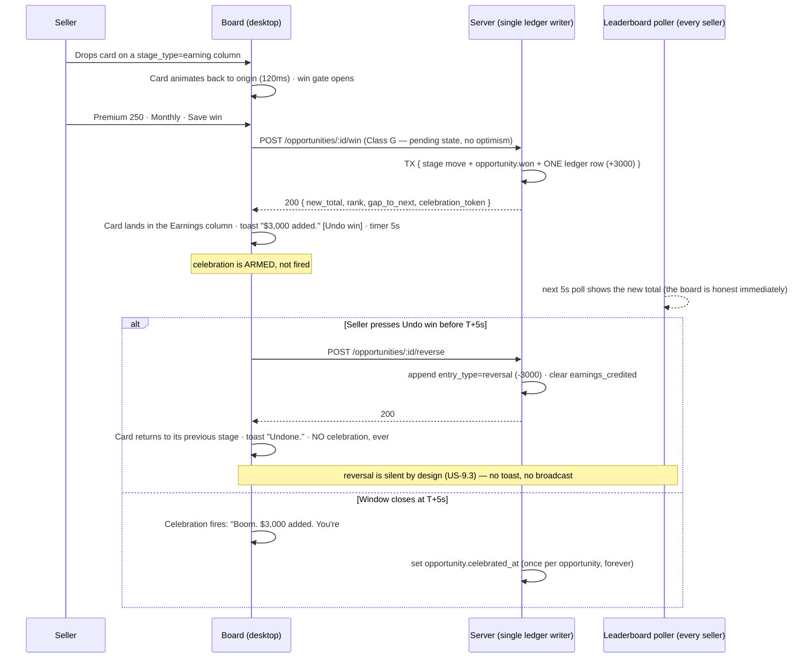

# 04b — Design System

> **Phase 4 deliverable.** Status: **complete, pending GATE 4.**
> Companion: [`04-ux-flows.md`](04-ux-flows.md) — its **Part I rulings are normative** and override anything here that still disagrees.

## How this document came to be (and why it matters)

Four specialists drafted this design system in parallel. A review found they had produced **three incompatible systems**: different token names for the same thing, different hex values under the same token name, **three different kanban card heights**, two opposite contrast verdicts on "the same" neutral, and duplicate strings for the same moment. Building from that package would have failed on the first pull request.

It was then reconciled into one. The reconciliation **recomputed every contrast ratio from the hex rather than trusting the published numbers**, and that changed outcomes:

- Two values that had been shipped as passing actually **fail WCAG**: a border at **2.49:1** (every input outline and every move-sheet radio would have been below AA) and the going-cold rail at **2.35:1** — meaning half of the two-signal cold indicator would have been invisible on the card that the whole board depends on.
- The two opposing verdicts on "the same neutral" turned out to be **measured on two different hexes**. The shipping value passes at 4.90:1, so a blanket ban was replaced by one measured rule.
- The three card heights collapsed into **one fixed height with a published row budget** proving the mandated anatomy does not fit the smallest proposal.

**The rule from here on: one token, one name, one value, one place.**

---

## Contents

1. [Tokens & foundations](#part-1--tokens--foundations) — the canonical palette, scales and paste-ready CSS
2. [Components & surfaces](#part-2--components--surfaces) — the kanban card, the inventory, and the surfaces nobody had specified
3. [Interaction, accessibility & performance](#part-3--interaction-accessibility--performance)
4. [Microcopy & the UI glossary](#part-4--microcopy--the-ui-glossary)

---

# Part 1 — Tokens & foundations

# Phase 4 · R1 — Canonical Token Layer & Foundations

> **This document supersedes D1, D2 and D3 for tokens, color, type, space, radii, elevation, layering, motion and breakpoints.** Where any of those documents states a different name, a different hex or a different number for anything below, that statement is void. Nothing here may be re-litigated inside a component spec.
>
> **Scope.** The vocabulary every other Phase-4 area is allowed to speak: board, kanban card, compliance badge, gates, wrap-up sheet, call-state banner, leaderboard, My Day. No component anatomy — except the two geometry constants (card height, column width) that R2 makes a foundation decision rather than a component decision.
>
> **Ship state.** One light theme. Dark mode is **not in v1**; its structure ships so the flip is a values-only PR.

---

## 0 · The three laws this document is built on

| # | Law | What it buys a US seller on the phone, or minute 8 of the demo |
|---|---|---|
| **L1** | **One name, one value, one job.** Every token has exactly one name and exactly one value. Every job has exactly one token. Two unrelated jobs may share a *number* (5 000 ms is both the undo window and the leaderboard poll) but never a *token* — changing one must not silently change the other. | A stage color, the going-cold threshold color or the celebration accent is re-tuned once, in one file, the night before the demo — not hunted across forty screens. |
| **L2** | **Components never name a literal.** No hex, no px, no ms, no cubic-bezier in any component file. Components read semantic tokens only; semantic tokens read primitives only; primitives are the only file with hex. | Dark mode later is a theme edit, not a refactor — and a contrast regression is caught by one CI job instead of by an auditor. |
| **L3** | **Zero web fonts, zero runtime theming JS, zero color computation in the browser.** Tokens are static CSS custom properties in one stylesheet, loaded once. | Pipeline LCP must land under **1.5 s with 500 leads**. A font file is a render-blocking round trip on a seller's phone in a parking lot; a CSS-in-JS runtime is main-thread work competing with a 60 fps drag. |

### 0.1 The tie-break law (R1), stated once and applied everywhere below

When D1, D2 and D3 disagreed on a value:

1. **If only one candidate passes its WCAG 2.1 AA threshold, that candidate wins** — regardless of which document authored it.
2. **If both (or all) candidates pass, D1 wins**, because R1 makes D1's structure the base and a system with one author is cheaper to hold in a head than a system with three.
3. **For non-color scales** (type, space, motion, layering, geometry), D1 is the base; a departure from D1 is taken only where it is bought by a named performance budget or a named seller moment, and every such departure is listed in §1.

**Every contrast number in this document was recomputed from the hex.** Three of D2's published ratios were overstated and two of D2's values fail their own stated threshold; D3's forbidden-neutral verdict was measured against a hex that is not in the shipping ramp. Those findings are in §1.

### 0.2 File layout (fixed)

```
src/styles/
  tokens/primitives.css   # the ONLY file containing a hex literal
  tokens/theme.css        # semantic layer — :root (light, shipped) + [data-theme="dark"] (declared, empty)
  tokens/motion.css       # durations, easings, prefers-reduced-motion overrides
  tokens/timing.ts        # product constants shared by CSS and TS (undo window, poll intervals)
  reset.css
```

```html
<html lang="en-US" data-theme="light" style="color-scheme: light">
```

`data-theme` is stamped by an inline 4-line script so there is no flash and no hydration wait. v1 hard-codes `light` and ships **no theme toggle**. `color-scheme` rides alongside so native controls — the date picker in Quick Schedule, the `<input type="tel">` keypad in mobile quick-add — follow the theme.

---

## 1 · Conflict-resolution table

Every token where D1, D2 or D3 disagreed. "Margin" is against the threshold that value must clear (4.5:1 text, 3:1 non-text). All ratios recomputed.

### 1.1 Color — neutrals

| Job | D1 | D2 | D3 | **WINNER** | Reason |
|---|---|---|---|---|---|
| App canvas / board bg | `#F6F8FA` | `#F7F8FA` | — | **`#F6F8FA`** (`--p-n-50`) | Non-text surface, both pass trivially → D1 precedence. |
| Column / sunken bg | `#EDF0F4` | `#EEF1F5` | — | **`#EDF0F4`** (`--p-n-100`) | Both non-text → D1 precedence. |
| Subtle divider | `#DDE3EA` (1.29) | `#E3E8EF` (1.19) | — | **`#DDE3EA`** (`--p-n-200`) | Both decorative-only; D1 precedence, and it is the darker of the two so a hairline survives a projector. |
| Decorative border | `#C3CCD6` (1.62) | `#CDD5E0` (1.42) | — | **`#C3CCD6`** (`--p-n-300`) | Both decorative-only → D1 precedence. |
| **Meaningful border** (inputs, focusable outlines) | `#868FA0` → **3.26** ✅ | `#9AA5B5` → **2.49** ❌ (D2 claimed 3.1) | — | **`#868FA0`** (`--p-n-400`) | **Only D1 passes 1.4.11.** D2's published 3.1:1 is wrong; the real ratio is 2.49:1, which would put every input outline and every move-sheet radio below AA. |
| Primary text | `#161B22` → **17.30** | `#101828` → 16.90 | — | **`#161B22`** (`--p-n-900`) | Both pass; larger margin **and** D1 precedence. |
| Secondary text | `#4E5A6B` → **7.00** ✅ | `#475467` → **7.69** ✅ (D2 claimed 8.6) | — | **`#4E5A6B`** (`--p-n-600`) | Both pass AA comfortably → D1 precedence (rule 2). D2's own number was overstated by 0.9. |
| **Tertiary text — the disputed neutral** | `#657282` → **4.90** ✅ | `#667085` → **4.97** ✅ (D2 claimed 5.7) | `#6B7889` → **4.49** ❌ "FORBIDDEN for text" | **`#657282`** (`--p-n-500`) | **The two contrast verdicts were measured on two different hexes.** D3 tested `#6B7889`, which is not in the ramp and does fail by 0.01. The shipping N500 is `#657282` at 4.90 — it passes. D3's ban is **void**, replaced by the narrower, measured rule in §1.6. |
| Inverse surface (tooltip, call banner) | `#262D37` (white on it 13.88) | — | — | **`#262D37`** (`--p-n-800`) | Uncontested. |
| Dark-theme canvas anchor | `--p-n-1000 #0B0E13` **and** a loose `#0F1319` in prose | — | `#0F1319` | **`#0B0E13`** (`--p-n-1000`) | Two hexes for one job violates L1. `#0F1319` is deleted from the system; the dark ratios both documents published against it are withdrawn (see §7.2 — dark is not shipping and will be re-measured on its own PR). |

### 1.2 Color — brand, feedback, money

| Job | D1 | D2 | D3 | **WINNER** | Reason |
|---|---|---|---|---|---|
| Primary action fill (white text on it) | `#1B54BF` → **6.85** ✅ | `#1D4ED8` → **6.70** ✅ (D2 claimed 8.6) | — | **`#1B54BF`** (`--p-b-600`) | Both pass; larger margin and D1 precedence. |
| **Focus ring** (non-text, 3:1) | `#2F6BE0` → 4.88 on white, 4.59 on canvas ✅ | `#2563EB` → 5.17 ✅ (D2 claimed 3.4) | agrees with D1 | **`#2F6BE0`** (`--p-b-500`) | Both clear 3:1 with room → D1 precedence, and D3 already cites D1's value, so two of three documents agree. |
| Money / Earnings text | `#0B6E44` → **6.31** ✅ | `#065F46` → 7.68 ✅ / `#047857` → 5.48 ✅ | — | **`#0B6E44`** (`--p-g-600`) | All three pass → D1 precedence. Also the only candidate that is legible **both** ways (6.31 as text on white *and* as a fill under white text), so `Save win` and a `$1,380/yr` figure share one token instead of two. |
| Amber text | `#855600` → **6.31** ✅ | `#B54708` → 5.43 ✅ | agrees with D1 | **`#855600`** (`--p-a-600`) | Both pass; larger margin, D1 precedence, D3 concurs. |
| **Going-cold / caution rail** (non-text, 3:1) | `#A96E00` → **4.27** ✅ | `#F79009` → **2.35** ❌ | agrees with D1 | **`#A96E00`** (`--p-a-500`) | **Only D1 passes.** D2's orange rail is invisible to 1.4.11 — and the rail is one half of the two-signal going-cold indicator, so a failing rail is a compliance-adjacent defect, not a cosmetic one. |
| Danger text | `#A31E1E` → **7.60** ✅ | `#B42318` → 6.57 ✅ | agrees with D1 | **`#A31E1E`** (`--p-r-600`) | Both pass; larger margin + D1 precedence. |
| Destructive fill (white on it) | `#C62F2F` → **5.46** ✅ | `#D92D20` → 4.83 ✅ | — | **`#C62F2F`** (`--p-r-500`) | Both pass; larger margin + D1 precedence. |
| Danger stroke / error border | `#E15555` → **3.73** ✅ | reuses `#D92D20` | — | **`#E15555`** (`--p-r-400`) | D1 separates "stroke" from "fill"; D2 used one value for both, which forces either a too-dark border or a too-light button. |
| Podium metals | gold `#A87A0B` 3.85 / silver `#7C879A` 3.63 / bronze `#9A5F35` 5.17 — **ring and icon only, numeral is `--p-n-900`** | gold `#B45309` on `#FEF0C7`, silver `#475467` on `#EAECF0`, bronze `#9A3412` on `#FFEAD5` — metal used as **text** | metals **non-text only**; name and amount must be N900 | **D1's three metals, ring/icon only** | D1 and D3 agree (2 of 3), and D2's approach invents three more tint hexes for zero decision value. 3.85:1 clears the non-text floor and fails the text floor — which is exactly why the rank numeral is neutral and the podium still reads from across a bullpen. |
| Celebration hue | violet `--p-v-*`, one appearance in the product | reuses money green (`--money-50` win toast) | — | **violet `--p-v-*`** | D2's green celebration makes the one-time moment indistinguishable from every persistent money figure on the card and the board. A colour that means "this happened once, just now" cannot also mean "this is your annual premium". |

### 1.3 Type scale

| Job | D1 | D2 | **WINNER** | Reason |
|---|---|---|---|---|
| Default desktop body | 14 px / 20 | 15 px / 22 | **14 px** (`--type-base`) | D1 precedence, and a CRM is a density product: at 15 px the six required card facts do not fit the fixed card height (§4.1). |
| **Input / mobile body** | 16 px (`--type-md`), mandatory on every `input`, `select`, `textarea` | **no 16 px step exists** | **16 px** (`--type-md`) | Not a preference: iOS Safari zooms the viewport on focus of any input below 16 px. D2's scale would give a seller quick-adding a referral at a kitchen table a zoom-and-scroll fight on the phone field. |
| Card title | 18 px / 26 | 15 px @600 | **18 px** (`--type-lg`) | D1 precedence; the lead name is the card's accessible name and its scan target. |
| Podium total | 36 px | 32 px | **36 px** (`--type-3xl`) | D1 precedence. The podium is the one surface fifty people read from across a room. |
| 17 px section step | — | `--t-h2` 17 px | **dropped** | Duplicates `--type-lg` 18 px to no purpose; L1 forbids two tokens for one job. |
| Money style | `tabular-nums lining-nums`, 700, `-0.01em` | `tabular-nums` mandatory | **D1's three-property token** | Same intent; D1 names it so it cannot be forgotten. Uncontested. |

### 1.4 Space, radii, elevation, layering

| Job | D1 | D2 | D3 | **WINNER** | Reason |
|---|---|---|---|---|---|
| Spacing scale | `0·2·4·6·8·12·16·20·24·32·40·48·64` | `2·4·6·8·12·16·20·24·32·40·48` | — | **D1** | Strict superset; D2 has no `0` and no `64` (empty-state top offset). |
| Card radius | 8 px (`--radius-md`) | 10 px (`--r-lg`) | — | **8 px** | D1 precedence. Three radii scales existed (D1 3/5/8/12/16, D2 4/6/10); D1's ships whole. |
| Elevation alpha anchor | `rgba(11,14,19,…)` | `rgba(16,24,40,…)` | — | **`rgba(11,14,19,…)`** | D1's anchor is `--p-n-1000`, so shadows and the scrim derive from a token instead of a floating triplet. |
| Elevation steps | 0–5 + `--elev-drag` | e1–e4 | — | **D1's seven** | D2 has no celebration step and no drag step; the drag ghost and the celebration toast are the two most-watched objects in the demo. |
| **Z-index scale** | 0/10/100/200/250/300/400/500/600/**700 call banner**/800/900/1000 | 0/10/20/30/**35 call banner**/40/50/**60 modal**/70 | — | **D1's scale, plus `--z-drawer: 450`** | D2 is internally contradictory: its prose says the call banner "is never covered", but its own scale puts the modal (60) above the banner (35). D1's scale is consistent — the banner outranks the modal because the seller's handset is physically ringing. D2 contributed the one layer D1 lacked (the 480 px record drawer), added at 450. |

### 1.5 Motion, geometry, breakpoints

| Job | D1 | D2 | D3 | **WINNER** | Reason |
|---|---|---|---|---|---|
| **Kanban card height** | `min-height: 96px` | **132 / 152 / 148 px**, grows with content | **fixed 108 / 92 px** | **fixed `120 px` desktop / `156 px` mobile** (R2) | R2 rules the card fixed-height for virtualization. D3 was right about *fixed* and wrong about 108 — the six mandated facts plus the R3 chip do not fit 108 px at any legal type size (row budget in §4.1). D2's anatomy fits but its variable height destroys the constant scroll stride that keeps the drag composite-only. 120 px is the smallest height that holds the mandated anatomy at `--type-base`/`--type-sm` with scale-legal padding. |
| Column width | 288 px | 288 px | — | **288 px** | Uncontested. |
| Sheet / modal max width | 520 px | 480 px | — | **520 px** (`--size-sheet-max-w`) | D1 precedence; D2's 480 survives as the **drawer** width, a different job and a different token. |
| Bottom-sheet entrance | 320 ms (`--dur-slow`) | 180 ms | 200 ms | **160 ms** (`--dur-quick`) | **A departure from D1, bought by R12.** The wrap-up sheet is the highest-frequency surface in the product — sixty-plus openings a day. 320 ms of theater on the sheet a seller opens after every dial is the difference between a tool and a tax. 160 ms is the existing ladder step nearest D2/D3's intent, so no new value enters the system. |
| Modal entrance | 320 ms | 240 ms | — | **320 ms** (`--dur-slow`) | Kept for the **win gate and the loss gate only**. Weight is deliberate here: a 320 ms entrance is what stops a fat-finger from landing on `Save win` in a modal that just materialised under the thumb. |
| Leaderboard row reorder | 240 ms (`--dur-base`) | 400 ms | — | **240 ms** | D1 precedence. Fifty rows re-ranking on a five-second poll on a wall screen: shorter is calmer, and 240 ms keeps the whole board inside D1's "nothing on the interactive path exceeds 240 ms" rule. |
| Count-up on the Earnings tile | 640 ms | 600 ms | — | **640 ms** | Both fine → D1 precedence. |
| Skeleton shimmer / confetti burst | shimmer 1 200 ms | confetti 1 200 ms | shimmer 1 200 ms | **one token, `--dur-ambient: 1200ms`** | Two tokens holding the same number for the two non-interactive animations violates L1. One token, two documented consumers. |
| Exit easing | `cubic-bezier(.3,0,.8,.15)` | `cubic-bezier(.4,0,1,1)` | — | **`cubic-bezier(.3,0,.8,.15)`** | D1 precedence; D2's entrance curve is already identical to D1's `--ease-standard`. |
| Search debounce | 120 ms | 150 ms | 120 ms | **120 ms** | Two of three, and it is the only value that leaves 80 ms of the 200 ms perceived-search budget for the round trip. |
| **Celebration delay** | `--time-celebration-delay: 5150ms` (a second timer) | T+5 000 ms | T+5 000 ms ±100 ms | **token deleted — the celebration fires on the undo window's close event** | D1's 5 150 ms drifts outside D3's own acceptance window (4 900–5 100 ms) and creates a second timer that can race the first. One timer, one event, no race, no drift, and one fewer number in the system. |
| Undo-toast lifetime | `--time-toast-undo: 5000ms` | 5 000 ms | 5 000 ms | **token deleted — the toast lives exactly `--time-undo-window`** | Two tokens for one number that must never diverge. If the toast outlived the window the seller would reach for an `Undo` that no longer works. |
| **Drag boundary** | ≥ `--bp-md` **768 px** | ≥ 1024 px **and** `(pointer: fine)` | ≥ 1024 px **and** `(pointer: fine)` | **≥ `--bp-lg` 1024 px and `(pointer: fine)`** | **A departure from D1**, taken because D2 and D3 agree and because the hazard is specific: a touch-drag on a tablet can drop a card into an Earnings column and open the money gate by accident. Drag is an input method, never the only path — the move-sheet exists at every size. |
| Threshold set | rot 7 d **and** cold 14 d | rot 7 d **and** cold 14 d | — | **one: `cold_threshold_days`, default 7** (R6) | Ruled by R6. The 14-day red tier is deleted from the system, which also frees red on the card face to mean one thing only: *you may not contact this person*. |
| Speed-to-lead clock stop | `call.initiated` | `call.initiated` | — | **`call.completed` with a connected or voicemail outcome** (R4) | Ruled by R4 against both documents. A clock that stops on the tap measures a seller's reflex, not a contact — and on a two-legged dial the tap is 5–15 seconds before anything reaches the lead. |

### 1.6 The two verdicts that replace D3's forbidden-neutral ban

D3 banned `N500` for text. The shipping `N500` is `#657282`, not the `#6B7889` D3 measured. Recomputed, `#657282` passes on white and on canvas and **fails on the column background** — so the ban becomes a precise, measured rule instead of a blanket one:

| Pair | Ratio | Verdict |
|---|---|---|
| `--color-text-tertiary` `#657282` on `--color-surface-1` `#FFFFFF` | **4.90** | ✅ AA |
| `--color-text-tertiary` on `--color-surface-2` `#FBFCFD` | **4.77** | ✅ AA |
| `--color-text-tertiary` on `--color-canvas` `#F6F8FA` | **4.61** | ✅ AA (thin — permitted, CI-watched) |
| `--color-text-tertiary` on `--color-surface-3` `#EDF0F4` | **4.29** | ⛔ **FORBIDDEN.** Use `--color-text-secondary` on the column background. |

D1's own amber verdict survives unchanged and is confirmed by D3: `--p-a-500 #A96E00` is **4.27 on white — non-text only, never text.** Amber text is always `--p-a-600 #855600` (6.31).

---

## 2 · Tier 1 — the canonical primitive palette

Hex values are final and appear nowhere else in the system. Ramps are spaced so that **the 600 step of every hue is safe as small text on white (≥ 4.5:1)** and **the 400/500 step is safe as a non-text indicator (≥ 3:1)** — that one rule is what makes the semantic layer mechanical instead of hand-tuned.

### 2.1 Neutral `--p-n-*` — surfaces, text, borders

| Token | Hex | On `#FFFFFF` | Sanctioned use |
|---|---|---|---|
| `--p-n-0` | `#FFFFFF` | — | Base surface, card face, sheet, modal |
| `--p-n-25` | `#FBFCFD` | 1.02 | Zebra row in My Book and the Earnings ledger |
| `--p-n-50` | `#F6F8FA` | 1.05 | App canvas, board background |
| `--p-n-100` | `#EDF0F4` | 1.11 | Kanban column background, skeleton base, disabled fill |
| `--p-n-200` | `#DDE3EA` | 1.29 | Hairline dividers, skeleton highlight, "no signal" rail |
| `--p-n-300` | `#C3CCD6` | 1.62 | Decorative borders only — **never a meaningful boundary** |
| `--p-n-400` | `#868FA0` | **3.26** | Meaningful borders, input outlines, empty-state glyphs |
| `--p-n-500` | `#657282` | **4.90** | Tertiary text — subject to §1.6 |
| `--p-n-600` | `#4E5A6B` | **7.00** | Secondary text |
| `--p-n-700` | `#3A4351` | **9.99** | Body text on any tint |
| `--p-n-800` | `#262D37` | 13.88 | Inverse surface: tooltip, call-state banner |
| `--p-n-900` | `#161B22` | **17.30** | Primary text, every money total |
| `--p-n-1000` | `#0B0E13` | 19.40 | Shadow and scrim alpha anchor; dark-canvas anchor (not shipped) |

### 2.2 Blue `--p-b-*` — primary action, focus, information

| Token | Hex | Key ratio | Use |
|---|---|---|---|
| `--p-b-50` | `#EEF4FF` | — | Selected row, info fill, fresh-card tint |
| `--p-b-100` | `#DAE6FF` | — | Pressed tint |
| `--p-b-200` | `#B9D0FF` | — | Drop-target fill |
| `--p-b-300` | `#8AB0FF` | — | Link on inverse surface (undo toast); dark-theme link |
| `--p-b-400` | `#5A8DF7` | — | Hover fill on inverse surfaces |
| `--p-b-500` | `#2F6BE0` | **4.88** on white · 4.59 on canvas | **Focus ring**, route progress bar, info stroke |
| `--p-b-600` | `#1B54BF` | **6.85** both ways | **Primary button fill, links, fresh rail** |
| `--p-b-700` | `#14429A` | **8.36** on `--p-b-50` | Primary hover, text on blue tint |
| `--p-b-800` | `#0F3175` | — | Primary pressed |

### 2.3 Green `--p-g-*` — success and Earnings money

| Token | Hex | Key ratio | Use |
|---|---|---|---|
| `--p-g-50` | `#E9F8EF` | — | `OK to contact` badge fill, podium #1 fill |
| `--p-g-100` | `#CFF0DD` | — | Positive ledger row tint |
| `--p-g-200` | `#A2E0BE` | — | Progress fill |
| `--p-g-300` | `#6BC998` | — | Dark-theme success (declared, not shipped) |
| `--p-g-400` | `#1E9A63` | **3.59** on white | Non-text success dot, check glyph, confetti particle |
| `--p-g-500` | `#128A56` | — | Reserved |
| `--p-g-600` | `#0B6E44` | **6.31** both ways · **5.75** on `--p-g-50` | **Earnings figures, badge text, `Save win` fill** |
| `--p-g-700` | `#085636` | — | Money-button hover, text on green tint |
| `--p-g-800` | `#06412A` | — | Money-button pressed |

### 2.4 Amber `--p-a-*` — caution: going cold, outside calling hours, override active

| Token | Hex | Key ratio | Use |
|---|---|---|---|
| `--p-a-50` | `#FFF6E5` | — | `Outside calling hours` fill, override-banner fill |
| `--p-a-100` | `#FFE9BF` | — | Warning banner fill |
| `--p-a-200` | `#FCD48A` | **12.29** with `--p-n-900` | Going-cold progress fill |
| `--p-a-300` | `#F0B44B` | — | Dark-theme caution (declared, not shipped) |
| `--p-a-400` | `#D8930F` | 2.59 on white | **Fill only — never a border, never text** |
| `--p-a-500` | `#A96E00` | **4.27** on white | Non-text indicator stroke, the going-cold rail |
| `--p-a-600` | `#855600` | **6.31** on white · **5.88** on `--p-a-50` | **All amber text and icons** |
| `--p-a-700` | `#663F00` | — | Hover / pressed |

### 2.5 Red `--p-r-*` — hard block, do-not-contact, destructive, overdue

| Token | Hex | Key ratio | Use |
|---|---|---|---|
| `--p-r-50` | `#FEF0F0` | — | `Do not contact` fill, degraded-dial banner fill |
| `--p-r-100` | `#FDDCDC` | — | Blocked banner fill |
| `--p-r-200` | `#F9BDBD` | — | Error input tint |
| `--p-r-300` | `#F08C8C` | — | Dark-theme danger (declared, not shipped) |
| `--p-r-400` | `#E15555` | **3.73** on white | Non-text danger stroke, error input border, blocked rail |
| `--p-r-500` | `#C62F2F` | **5.46** white-on-it | Destructive button fill |
| `--p-r-600` | `#A31E1E` | **7.60** on white · **6.86** on `--p-r-50` | **All red text and icons** |
| `--p-r-700` | `#7F1717` | — | Hover / text on red tint |

### 2.6 Violet `--p-v-*` — celebration only

This hue appears in exactly one place in the entire product: the Closed-Won celebration. It is deliberately unused elsewhere so it can never be mistaken for a persistent state.

| Token | Hex | Key ratio | Use |
|---|---|---|---|
| `--p-v-50` | `#F3EEFF` | — | Celebration toast fill |
| `--p-v-100` | `#E5DAFF` | — | Confetti particle A |
| `--p-v-200` | `#CBB6FF` | — | Confetti particle B |
| `--p-v-300` | `#A886F5` | — | Dark-theme celebration (declared, not shipped) |
| `--p-v-400` | `#8455E8` | — | Confetti particle C |
| `--p-v-500` | `#6B34D6` | — | Toast accent bar |
| `--p-v-600` | `#5526B0` | **9.17** on white | Celebration heading |
| `--p-v-700` | `#401C87` | **10.66** on `--p-v-50` | Celebration body text |

### 2.7 Stage identity palette `--p-stage-{1..8}-tint` / `-stroke`

Sellers configure their own stages (MVP item 35). This palette is deliberately **lower-chroma than every semantic hue above**, so a column header can never be misread as a compliance verdict or an Earnings figure.

| # | Name in the stage editor | `-tint` | `-stroke` | stroke ÷ white | stroke ÷ own tint | `--p-n-700` ÷ tint |
|---|---|---|---|---|---|---|
| 1 | Slate | `#EDF1F5` | `#7C879A` | 3.63 | 3.20 | 8.80 |
| 2 | Blue | `#E2ECFB` | `#3C6FB5` | 5.08 | 4.26 | 8.39 |
| 3 | Teal | `#DDF0EE` | `#2A7F78` | 4.77 | 4.03 | 8.46 |
| 4 | Green | `#E3F1E4` | `#3F7D4A` | 4.95 | 4.23 | 8.55 |
| 5 | Olive | `#EEF0DC` | `#6E7326` | 5.07 | 4.38 | 8.63 |
| 6 | Amber | `#FAECD6` | `#8E6314` | 5.32 | 4.57 | 8.58 |
| 7 | Orange | `#FCE7DB` | `#9C532A` | 5.70 | 4.77 | 8.37 |
| 8 | Plum | `#F0E6F7` | `#7A4A9E` | 6.36 | 5.26 | 8.26 |

**Assignment.** The seeded default board (`New`, `Contacted`, `Appointment set`, `Presented`, `Closed Won`, `Closed Lost`) takes hues 1, 2, 3, 5, 4, 7 in that order. A seller-created stage takes the lowest unused hue; past eight the palette wraps and the editor warns `This color is already used by "{stage name}".` — a warning, never a block.

**Stage hue never encodes `stage_type`.** `open` / `earning` / `lost` is carried by the words `Open` / `Counts as Earnings` / `Lost` on the column header and on every move-sheet row. A seller may paint an `open` stage green; the win gate still binds to the type, and the chip still says `Open`.

### 2.8 Podium metals `--p-medal-*` — decorative, ranks 1–3 only

| Token | Hex | On white | Rule |
|---|---|---|---|
| `--p-medal-gold` | `#A87A0B` | **3.85** | **Ring and icon only.** The rank numeral is always `--p-n-900`. |
| `--p-medal-silver` | `#7C879A` | **3.63** | Same. |
| `--p-medal-bronze` | `#9A5F35` | **5.17** | Same. |

3.85:1 clears the 3:1 non-text threshold and fails the 4.5:1 text threshold — which is precisely why the numeral is neutral. The podium reads at a glance from across a bullpen and still passes an audit.

---

## 3 · Tier 2 — the semantic layer

**Components read only this layer.** A component that references a `--p-*` primitive fails the build.

### 3.1 Surface & structure

| Token | Resolves to | Used by |
|---|---|---|
| `--color-canvas` | `--p-n-50` | App background, board background |
| `--color-surface-1` | `--p-n-0` | Card face, sheet, modal, drawer, leaderboard row |
| `--color-surface-2` | `--p-n-25` | Zebra rows in My Book and the Earnings ledger |
| `--color-surface-3` | `--p-n-100` | Kanban column background, skeleton base |
| `--color-surface-inverse` | `--p-n-800` | Tooltips, the call-state banner |
| `--color-overlay` | `rgba(11,14,19,.48)` | Scrim behind the win gate and the mobile move-sheet |
| `--color-border-subtle` | `--p-n-200` | Card outline, dividers between timeline entries |
| `--color-border-default` | `--p-n-300` | Decorative separation only |
| `--color-border-strong` | `--p-n-400` | Input outlines, move-sheet radios, drag placeholder — every boundary that carries information |
| `--color-border-focus` | `--p-b-500` | Focus ring |

### 3.2 Text

| Token | Resolves to | On `--color-surface-1` | Used by |
|---|---|---|---|
| `--color-text-primary` | `--p-n-900` | **17.30** | Lead name, every money total, headings |
| `--color-text-secondary` | `--p-n-600` | **7.00** | Card metadata, section labels, **all text on `--color-surface-3`** |
| `--color-text-tertiary` | `--p-n-500` | **4.90** | Timestamps, `{n} attempts`, helper text — never on `--color-surface-3` (§1.6) |
| `--color-text-on-tint` | `--p-n-700` | **9.99** | Any text over a stage tint or a feedback fill that has no hue-matched text token |
| `--color-text-inverse` | `--p-n-0` | 13.88 on `--color-surface-inverse` | Call-banner and tooltip text |
| `--color-text-link` | `--p-b-600` | **6.85** | Links, `How this is ranked` |

There is **no `--color-text-disabled`.** Disabled labels use `--color-action-disabled-fg`, which is measured against the disabled fill, not against white — see §3.3 and Do-not #10.

### 3.3 Interactive

| Token | Resolves to | Notes |
|---|---|---|
| `--color-action-primary-bg` / `-fg` / `-hover` / `-active` | `--p-b-600` / `--p-n-0` / `--p-b-700` / `--p-b-800` | `Call now`, `Quick-add lead`, `Book` |
| `--color-action-money-bg` / `-fg` / `-hover` / `-active` | `--p-g-600` / `--p-n-0` / `--p-g-700` / `--p-g-800` | **`Save win` and `Log the sale` only.** The button that writes to a public board must not look like every other blue button in a 10-minute demo. |
| `--color-action-secondary-bg` / `-fg` / `-border` | `--p-n-0` / `--p-n-700` / `--p-n-400` | `Schedule`, `Note`, `Log a call`, `Move` |
| `--color-action-ghost-fg` / `-hover-bg` | `--p-n-600` / `--p-n-100` | Icon-only card quick actions |
| `--color-action-destructive-bg` / `-fg` | `--p-r-500` / `--p-n-0` | Admin void, break-glass activation |
| `--color-action-disabled-bg` / `-fg` / `-border` | `--p-n-100` / `--p-n-600` / `--p-n-300` | Every gate-blocked send button |
| `--color-selected-bg` | `--p-b-50` | Selected search result, active period tab, pinned self-row |

**Disabled labels are `--p-n-600` (7.00 on white, 6.13 on the disabled fill), not `--p-n-400`.** WCAG exempts disabled controls; this product does not. A disabled `Text` button under the 10DLC banner and a disabled `Call` button under a suppression badge both carry compliance meaning — a seller must be able to *read* why their tool is off, and a supervisor must be able to read it over their shoulder.

### 3.4 Feedback — one meaning each, and only one

| Token set | fill / text / stroke | The single meaning it is allowed to carry |
|---|---|---|
| `--color-success-fill` / `-text` / `-stroke` | `--p-g-50` / `--p-g-600` / `--p-g-400` | The action worked, **or** money was credited |
| `--color-caution-fill` / `-text` / `-stroke` | `--p-a-50` / `--p-a-600` / `--p-a-500` | You may proceed, but something is degraded or time-bound |
| `--color-danger-fill` / `-text` / `-stroke` | `--p-r-50` / `--p-r-600` / `--p-r-400` | Hard block, destructive, or overdue |
| `--color-info-fill` / `-text` / `-stroke` | `--p-b-50` / `--p-b-700` / `--p-b-500` | A neutral fact the system knows. **No action implied, and never a gate verdict.** |
| `--color-neutral-state-fill` / `-text` / `-stroke` | `--p-n-100` / `--p-n-600` / `--p-n-400` | Unknown, not applicable, read-only, no permission |

### 3.5 Domain semantics — the colour jobs that decide the demo

#### 3.5.1 The compliance badge (MVP items 11–13)

One gate, one badge, five states. This badge is on the card face, on the contact header, on every My Day row and inside Quick Schedule — the most-repeated coloured object in the product, so it gets the strictest rule.

| State | Fill / text | Icon shape | Ratio of text on fill |
|---|---|---|---|
| Clear — `OK to contact` | `--color-success-fill` / `--color-success-text` | filled circle with check | **5.75** ✅ |
| Time-blocked — outside the calling window | `--color-caution-fill` / `--color-caution-text` | clock | **5.88** ✅ |
| Suppressed — STOP / DNC | `--color-danger-fill` / `--color-danger-text` | circle-slash | **6.86** ✅ |
| Time zone unconfirmed | `--color-neutral-state-fill` / `--color-neutral-state-text` | question mark | **6.13** ✅ |
| Calling number not verified | `--color-neutral-state-fill` / `--color-neutral-state-text` | plug | **6.13** ✅ |

**The badge is always icon + text. Colour is the third signal, never the first.** A seller who is red-green colour-deficient — statistically about four of a fifty-seat US floor — or who is squinting at a phone in daylight reads the word and the shape. The calling-window amber and the do-not-contact red carry different legal consequences; neither may depend on hue.

#### 3.5.2 The non-attributive recent-contact chip (MVP item 13, R3)

| Token | Resolves to |
|---|---|
| `--color-recent-contact-fill` / `-text` / `-stroke` | `--color-info-fill` / `--color-info-text` / `--color-info-stroke` |

**It has a permanent slot: the card's attention slot, at the top of the priority order** (§4.1). A mitigation with no slot does not ship.

It is **blue, not amber and not red**, for one reason: it does not block anything. It is a tenant-wide, non-attributive fact — *this office contacted this household N minutes ago* — with no names and no records attached. Rendering a non-blocking coordination hint in a gate colour would teach sellers that amber sometimes means "stop" and sometimes means "FYI", which is how a compliance signal stops being read. Blue in this system means exactly this: a fact, no action implied. Contrast: `--p-b-700` on `--p-b-50` = **8.36** ✅.

#### 3.5.3 Lead health — one threshold, one rail, two signals

R6 collapses the old two-tier (7-day amber / 14-day red) into **one configurable `cold_threshold_days`, default 7.** There is no rot threshold. This also frees red on the card face to mean one thing only.

| State | Chip tokens | Rail token | Card-face wording |
|---|---|---|---|
| Blocked (STOP / DNC / bad number) | `--color-danger-*` | `--color-rail-blocked` → `--p-r-400` | the compliance badge carries it |
| Overdue callback | `--color-danger-*` | `--color-rail-blocked` | `Due {n} min ago` |
| Fresh | `--color-info-*` | `--color-rail-fresh` → `--p-b-600` | `New — {mm:ss} since arrival` |
| Going cold (≥ `cold_threshold_days`) | `--color-caution-*` | `--color-rail-cold` → `--p-a-500` | **`Going cold - {n} days since last touch`** (R11) |
| Healthy | none | `--color-rail-none` → `--p-n-200` | — |

**Rail ratios (non-text, 3:1):** blocked `--p-r-400` 3.73 ✅ · fresh `--p-b-600` 6.85 ✅ · going cold `--p-a-500` 4.27 ✅ · none `--p-n-200` 1.29 — invisible by design, and legal because it carries no information.

**Going cold is a two-signal gradient, not a colour.** The rail's *fill percentage* tracks days-since-touch against `cold_threshold_days`; the chip text always states the number of days. The word **"Rotting" is banned on the card face** (R11) — it is the one string an owner would ask to soften, and `Going cold` says the same thing without editorialising about the seller.

**Fresh binds to `call.completed` with a connected or voicemail outcome, never to `call.initiated`** (R4). Any component or string that stops the speed-to-lead clock on dial initiation is wrong. On a two-legged dial the tap precedes the lead's handset by 5–15 seconds; a clock that stops on the tap measures reflexes, not contact.

**Suppression:** health signals are never rendered on a card in an `earning` or `lost` stage, nor on an imported card that has never been worked. Otherwise the first Monday after an onboarding import is a wall of amber and the signal becomes wallpaper.

#### 3.5.4 Money

| Token | Resolves to | Applies to |
|---|---|---|
| `--color-money-positive` | `--p-g-600` | A credited delta: `+$3,000` in My Earnings, the toast amount, the leaderboard tick |
| `--color-money-neutral` | `--p-n-900` | **Every total.** Leaderboard totals, column sums, card premium, the seller's period total |
| `--color-money-negative` | `--p-n-700` | Reversal and downward correction deltas: `−$1,200` |

**A negative ledger delta is never red.** Red in this product means *you are blocked from contacting this person*. A reversal is bookkeeping, not a compliance event, and reversals are silent by design — no toast, no broadcast. Rendering them red turns a routine correction into an alarm on a surface fifty people watch. The minus sign, the `Reversed` chip and the entry-type column carry the meaning.

#### 3.5.5 Celebration (MVP item 65)

| Token | Resolves to |
|---|---|
| `--color-celebration-fill` | `--p-v-50` |
| `--color-celebration-accent` | `--p-v-500` |
| `--color-celebration-heading` | `--p-v-600` |
| `--color-celebration-text` | `--p-v-700` |
| `--color-celebration-confetti` | `--p-v-100`, `--p-v-200`, `--p-v-400`, `--p-g-400`, `--p-medal-gold` |

**Timing is the whole design.** The celebration is emitted by the **close event of the undo window**, once the server move is confirmed — never on the drop, never inside the window, and never at all if the win was undone. Confetti fired inside the undo window is the product congratulating a seller for something it is about to take back, in front of the room.

#### 3.5.6 Read-only, no-permission, and the two banners

| Surface | Tokens | Rule |
|---|---|---|
| Supervisor viewing a seller's board | `--color-neutral-state-*` + a `Read-only` chip | **Never red, never amber.** A supervisor's read scope is designed behaviour, not a failure. |
| Owner-scoped not-found | `--color-neutral-state-*` | Must be byte-identical to a genuine 404. Any distinct styling lets a seller prove another seller's record exists. |
| Gate-blocked send button | `--color-action-disabled-*` + the plain-English reason beneath | The button stays **visible and disabled**, never hidden. |
| **10DLC / texting-off banner** | `--color-info-*` | Informational: calling is unaffected and the seller cannot act on it. String (R8): `Texting is pending carrier registration (10DLC). Calling works normally.` — it **never advertises email**, which is V1.1 and would promise the demo a channel that does not exist. |
| **Break-glass override banner** | `--color-caution-*`, at `--z-override-banner` | Degraded *and* time-bound — the exact definition of caution. String (R9): `Compliance override is on - calling-window checks are paused. STOP and DNC are still enforced.` A banner that says only "override is on" tells a seller nothing about what still protects them. |
| Degraded-dial banner | `--color-danger-fill`, 3 px top border `--color-danger-stroke`, text `--color-danger-text` | The dial does not work; that is a hard block on the seller's core motion. |

#### 3.5.7 Timeline attribution (R10)

A seller-facing timeline **never renders another seller's identity.** Prior activity on a transferred record is rendered in `--color-text-secondary` with the fixed phrase `Handled before this record moved to you`. There is no token, no chip and no avatar for another seller in a seller-facing view — the silo is a projection-level rule, and a colour or an initial is a leak.

---

## 4 · Scales — one of each

### 4.1 Geometry: the fixed kanban card (R2)

**The card is fixed-height. Performance wins over density.** A constant row stride lets the virtualiser compute offsets without measuring, which is what keeps a 500-card drag composite-only and inside the 60 fps budget.

| Token | Value | Job |
|---|---|---|
| `--size-card-h` | **120px** | Kanban card, desktop — fixed, not a minimum |
| `--size-card-h-mobile` | **156px** | Kanban card, mobile — fixed |
| `--size-card-gap` | `--space-2` (8px) | Desktop row stride = 128 px |
| `--size-column-w` | `288px` | Fixed; enables horizontal virtualization |
| `--size-rail-w` | `3px` | Lead-health left rail |

**The 120 px row budget** — this is why it is 120 and not 108:

| Row | Content | Height |
|---|---|---|
| padding-block | `--space-3` × 2 | 24 |
| 1 | Contact name (`--type-lg`) + annualized premium (`--type-money`) | 20 |
| gap | `--space-15` | 6 |
| 2 | Compliance badge · **attention slot** (recent-contact / overdue / fresh / going cold) | 22 |
| gap | `--space-15` | 6 |
| 3 | `{n}d since touch · {n} attempts · {source}` (`--type-sm`, MetaLine) | 18 |
| gap | `--space-1` | 4 |
| 4 | `Next: Thu 2:00 PM` (`--type-sm`; overdue in `--color-danger-text`) | 18 |
| | **Total** | **118 → 120** (2 px reserved for the 1 px border box) |

**What was trimmed to fit, and where it went** (R2: it moves to hover/expand, never to a taller card):

- **Quick actions** are an overlay on hover / `focus-within` (desktop), absolutely positioned over row 1's right edge — not a footer row. On mobile they are the record's action bar, reached by the card tap, plus the long-press sheet; the ≤ 2-tap contract holds.
- **Source** collapsed from its own chip into the last segment of the MetaLine. MetaLine truncates from the **end**, so touch age and attempt count — the two facts that answer *have I already burned this lead* — always survive.
- **The attention slot renders exactly one chip**, by priority: **recent-contact → overdue → fresh → going cold → needs reply → no next step.** The two blue chips (recent-contact, fresh) can never co-render, so blue on a card face always means one thing at a time.

### 4.2 Type scale — root 16 px, all values in `rem`

| Token | rem | px | Line height | Weight | Where |
|---|---|---|---|---|---|
| `--type-micro` | 0.6875 | 11 | 14 | 600 | Uppercase micro labels, `letter-spacing:.04em`. **Never a sentence.** |
| `--type-xs` | 0.75 | 12 | 16 | 500 | Chips, badges, column counts |
| `--type-sm` | 0.8125 | 13 | 18 | 400 | Card metadata, timeline timestamps |
| `--type-base` | 0.875 | 14 | 20 | 400 | **Default desktop UI text** |
| `--type-md` | 1.0 | 16 | 24 | 400 | **All mobile body text and every `<input>`, `<select>`, `<textarea>` at every breakpoint** |
| `--type-lg` | 1.125 | 18 | 26 | 600 | Card title (lead name), section headers |
| `--type-xl` | 1.375 | 22 | 28 | 600 | Sheet and modal titles, contact header name |
| `--type-2xl` | 1.75 | 28 | 34 | 700 | Page titles, seller period total, `letter-spacing:-.01em` |
| `--type-3xl` | 2.25 | 36 | 40 | 700 | Podium totals, `letter-spacing:-.015em` |
| `--type-4xl` | 3.0 | 48 | 52 | 700 | Celebration amount, `letter-spacing:-.02em` |

**12 px is the floor.** Nothing renders below `--type-xs` except `--type-micro`, which is uppercase, 600-weight and never a sentence.

**Weights:** `--font-weight-regular` 400 · `--font-weight-medium` 500 · `--font-weight-semibold` 600 · `--font-weight-bold` 700.

**Families:** system stacks only, no web font, ever, in v1. The seller's device has already rendered these before first paint — a straight subtraction from LCP — and every stack in both lists supports `font-variant-numeric: tabular-nums`, the one feature the leaderboard depends on.

**The money type style** (`--type-money-variant` / `-weight` / `-tracking`) applies to every dollar figure without exception: card premium, column sums, leaderboard totals, the self-row gap, ledger deltas, the celebration amount, the win-gate live preview. Two load-bearing reasons: the leaderboard re-polls every five seconds, and with proportional digits `$1,180 → $1,380` changes the string width and every row jitters on a surface a room is watching; and right-aligned tabular digits make column comparison instant, which is the demo question *who is winning and by how much* answered without reading.

### 4.3 Spacing scale — 4 px base

| Token | rem | px | Typical |
|---|---|---|---|
| `--space-0` | 0 | 0 | — |
| `--space-05` | .125 | 2 | Icon-to-text inside a chip |
| `--space-1` | .25 | 4 | Chip padding-y, tight card rows |
| `--space-15` | .375 | 6 | Card row gap |
| `--space-2` | .5 | 8 | Card-to-card gap, internal stack gap |
| `--space-3` | .75 | 12 | **Card padding (desktop)** |
| `--space-4` | 1 | 16 | **Card padding (mobile)**, sheet padding |
| `--space-5` | 1.25 | 20 | Section gap |
| `--space-6` | 1.5 | 24 | Column gutter, modal padding |
| `--space-8` | 2 | 32 | Page gutter (desktop) |
| `--space-10` | 2.5 | 40 | Empty-state vertical rhythm |
| `--space-12` | 3 | 48 | Major section break |
| `--space-16` | 4 | 64 | Empty-state top offset |

### 4.4 Sizes and targets

| Token | Value | Rule |
|---|---|---|
| `--size-target-min` | `44px` | Minimum tappable area below `--bp-md` — applied via padding or a pseudo-element, never by inflating the visual control |
| `--size-target-desktop` | `32px` | Minimum clickable area for a mouse, with ≥ 8 px separation |
| `--size-control-sm` / `-md` / `-lg` | 28 / 36 / 44 px | Button and input heights; `-lg` is the mobile default |
| `--size-icon-sm` / `-md` / `-lg` | 14 / 16 / 20 px | Chip / button / header |
| `--size-avatar-sm` / `-md` / `-lg` | 24 / 32 / 56 px | Leaderboard row / self-row / podium |
| `--size-row-h` | `48px` | Desktop table and list row |
| `--size-tap-row-h` | `56px` | Any full-width tap row: move-sheet, My Day on mobile, leaderboard row |
| `--size-row-stack-h` | `72px` | Two-line stacked mobile list row |
| `--size-sheet-max-w` | `520px` | Modal, bottom sheet, win gate, wrap-up sheet |
| `--size-drawer-w` | `480px` | Right-hand record drawer (full width below `--bp-md`) |
| `--size-popover-max-w` | `320px` | Popovers, menus, the compliance-reason panel |

**44 px on mobile is not a preference.** Mobile is the contact surface and the primary target is a dial that costs money to get wrong: a mis-tap on a card face is a wrong call to a real person's phone.

### 4.5 Radii

| Token | Value | Use |
|---|---|---|
| `--radius-none` | 0 | Table cells, full-bleed banners |
| `--radius-xs` | 3px | Chips, badges, the lead-health rail |
| `--radius-sm` | 5px | Inputs, small buttons |
| `--radius-md` | 8px | **Cards, buttons, list rows** |
| `--radius-lg` | 12px | Sheets, modals, the celebration toast |
| `--radius-xl` | 16px | Mobile bottom-sheet top corners |
| `--radius-full` | 999px | Avatars, rank medallions, period-selector pills |

### 4.6 Elevation

| Token | Value | Use |
|---|---|---|
| `--elev-0` | `none` | Flat rows inside a card |
| `--elev-1` | `0 1px 2px rgba(11,14,19,.06), 0 1px 3px rgba(11,14,19,.10)` | **Card at rest** |
| `--elev-2` | `0 2px 4px -1px rgba(11,14,19,.06), 0 4px 8px -2px rgba(11,14,19,.10)` | Card hover, sticky board header |
| `--elev-3` | `0 4px 8px -2px rgba(11,14,19,.06), 0 12px 16px -4px rgba(11,14,19,.10)` | Dropdown, popover, drawer |
| `--elev-4` | `0 8px 12px -4px rgba(11,14,19,.06), 0 20px 24px -4px rgba(11,14,19,.12)` | Win gate, wrap-up sheet, modal |
| `--elev-5` | `0 12px 16px -4px rgba(11,14,19,.08), 0 32px 40px -8px rgba(11,14,19,.16)` | Celebration toast |
| `--elev-drag` | `0 16px 24px -8px rgba(11,14,19,.24)` | Drag ghost only |

**Elevation is a structure token, not a decoration token, and it is never animated.** A card's hover lift is the **opacity** of a pre-rendered `--elev-2` layer over a resting `--elev-1` layer — animating `box-shadow` forces paint on every frame and is the classic way to lose the drag budget. In the future dark theme `--elev-*` resolves mostly to a surface-tint step plus a `--color-border-subtle` outline, because shadows do not read on a dark canvas; components read the same token either way, which is why that swap is a theme edit.

### 4.7 Z-index

| Token | Value | Layer |
|---|---|---|
| `--z-base` | 0 | Board, cards |
| `--z-raised` | 10 | Hovered card, sticky column header |
| `--z-drag` | 100 | Drag ghost |
| `--z-sticky` | 200 | App header, board header |
| `--z-pinned` | 250 | Leaderboard pinned self-row |
| `--z-bottom-bar` | 300 | Mobile action bar |
| `--z-dropdown` | 400 | Menus, popovers, search results |
| `--z-drawer` | 450 | Record drawer |
| `--z-sheet` | 500 | Move-sheet, Quick Schedule, wrap-up sheet |
| `--z-modal` | 600 | Win gate, loss gate, admin confirmations |
| `--z-call-banner` | 700 | **Persistent call-state banner** — survives navigation and sits above a modal, because the seller's handset is ringing and nothing on screen may hide that |
| `--z-toast` | 800 | Undo toast, error toast |
| `--z-celebration` | 900 | Celebration toast |
| `--z-override-banner` | 1000 | Break-glass banner — nothing may ever cover it |

### 4.8 Motion

| Token | Value | Use |
|---|---|---|
| `--dur-instant` | 0ms | Layout-only changes |
| `--dur-fade` | 80ms | Hover, chip appear, opacity swaps, skeleton cross-fade |
| `--dur-fast` | 120ms | Button press, tab switch, card return-to-origin on an Earnings drop |
| `--dur-quick` | 160ms | Tooltip, inline validation, **bottom-sheet enter/exit**, failed-move return |
| `--dur-base` | 240ms | **Card stage move, drop settle, dropdown, leaderboard FLIP reorder** |
| `--dur-slow` | 320ms | **Win-gate and loss-gate modal entrance only** |
| `--dur-celebration` | 480ms | Celebration toast entrance |
| `--dur-count-up` | 640ms | Money roll-up on the Earnings tile |
| `--dur-ambient` | 1200ms | Skeleton shimmer cycle **and** confetti burst lifetime — the two non-interactive animations |

**Nothing on the interactive path exceeds 240 ms.** The budget is *interaction feedback < 100 ms*: the feedback (`--dur-fast` at most) starts inside 100 ms; the animation may finish later, but the seller already knows their tap registered.

| Token | Curve | Use |
|---|---|---|
| `--ease-standard` | `cubic-bezier(.2,0,0,1)` | Default for everything moving on screen |
| `--ease-enter` | `cubic-bezier(.05,.7,.1,1)` | Entrances — sheets, toasts, cards arriving |
| `--ease-exit` | `cubic-bezier(.3,0,.8,.15)` | Exits — dismissals, a card leaving a column |
| `--ease-spring` | `cubic-bezier(.34,1.35,.64,1)` | **Celebration toast only** — the one overshoot in the product |
| `--ease-linear` | `linear` | Countdowns, the undo progress bar, the shimmer |

**The 60 fps rule.** Only `transform` and `opacity` may be transitioned or animated on any element inside the board. `will-change: transform` is set on `dragstart` and **removed on `dragend`** — leaving it on 500 cards is how the compositor budget is blown. A poll that returns identical values must produce **zero** animations: diff before you animate, or fifty screens twitch every five seconds.

**`prefers-reduced-motion: reduce`** collapses every `--dur-*` to `0ms` **except `--dur-fade`** (kept at 80 ms so state changes remain perceptible), replaces confetti with a static `--p-medal-gold` starburst, and removes the drag ghost's scale and rotation. The drag itself still tracks the pointer — direct manipulation is not animation. **No `--time-*` constant ever changes under reduced motion**; they are safety and correctness values, not motion.

### 4.9 Product timing constants (`tokens/timing.ts`, mirrored into CSS)

Different jobs may share a number; they never share a token.

| Constant | Value | Rule |
|---|---|---|
| `--time-undo-window` | **5000ms** | The undo window, and the undo toast's exact lifetime. One number a seller learns. Never shortened by reduced motion or a slow network. **The celebration is emitted by this window's close event — there is no second timer.** |
| `--time-poll-fast` | **5000ms** | Leaderboard and notifications, visible tab only; stops on `visibilitychange`, fires immediately on refocus |
| `--time-poll-slow` | **15000ms** | My Day and board deltas — covers only what other systems did |
| `--time-poll-health` | **30000ms** | Aloware health probe, only while a degraded banner is showing |
| `--time-skeleton-delay` | **120ms** | A skeleton renders only if data has not arrived within 120 ms |
| `--time-skeleton-min` | **320ms** | Once shown, a skeleton stays at least this long — prevents a strobe |
| `--time-skeleton-timeout` | **8000ms** | Then the surface's error state with `Try again`. A skeleton that never resolves is a spinner with better manners. |
| `--time-route-bar-delay` | **400ms** | The 2 px route progress bar appears only after this; below it, it is noise |
| `--time-toast-default` | **6000ms** | Informational toasts. Error toasts never auto-dismiss. |
| `--time-search-debounce` | **120ms** | Leaves 80 ms of the 200 ms perceived-search budget for the round trip |
| `--time-note-autosave` | **800ms** | Debounce after the last keystroke, hard-flushed on blur, close, route change and `pagehide` |
| `--time-clock-tick` | **1000ms** | The speed-to-lead clock and the call-state elapsed timer |
| `--time-dial-silence-max` | **15000ms** | The two-legged gap. The call-state banner must change copy at least twice inside this window, because fifteen silent seconds at minute six of the demo is the worst moment in the product. |

### 4.10 Breakpoints and density

| Token | Value | Behaviour |
|---|---|---|
| `--bp-sm` | 480px | Single column, bottom action bar pinned |
| `--bp-md` | 768px | **Density boundary.** Below: `--type-md` body, `--size-target-min` 44 px, `--size-card-h-mobile`. At and above: `--type-base` body, `--size-target-desktop` 32 px, `--size-card-h`. |
| `--bp-lg` | 1024px | **Drag boundary**, and only in combination with `(pointer: fine)`. Board shows 4 columns without horizontal scroll. |
| `--bp-xl` | 1440px | Board shows 6 columns; the leaderboard podium sits side-by-side |

**Drag is bound only at `≥ --bp-lg` AND `(pointer: fine)`.** Everywhere else — and on every device for keyboard and assistive-technology users — the move-sheet is the path. Both are input methods onto one command, so there is never a second code path. A touch-drag that can drop a card into an Earnings column and open the money gate by accident is the one hazard worth removing an interaction for.

**Density is not a user setting in v1.** It is derived from the breakpoint, because the ruling is *desktop manages, mobile contacts*: a phone at desktop density fails 44 px targets, and a desktop at mobile density fits three columns.

> **Implementation note:** CSS custom properties cannot be used inside `@media` queries. The `--bp-*` tokens are the single source of truth for the numbers; the build injects them into the media queries (SCSS variable, PostCSS custom-media, or a generated constants file). Two hard-coded breakpoint numbers anywhere in the codebase is a build failure.

---

## 5 · The contrast matrix — every shipping pair

Recomputed from hex. Thresholds: **4.5:1** for text under 24 px (this product does not use the large-text exemption for any body content), **3:1** for icons, borders, state indicators and the focus ring.

### 5.1 Text pairs

| Foreground | Background | Ratio | Verdict |
|---|---|---|---|
| `--color-text-primary` `#161B22` | `--color-surface-1` `#FFFFFF` | **17.30** | ✅ AAA |
| `--color-text-secondary` `#4E5A6B` | `--color-surface-1` | **7.00** | ✅ |
| `--color-text-secondary` | `--color-surface-3` `#EDF0F4` | **6.13** | ✅ |
| `--color-text-tertiary` `#657282` | `--color-surface-1` | **4.90** | ✅ |
| `--color-text-tertiary` | `--color-surface-2` `#FBFCFD` | **4.77** | ✅ |
| `--color-text-tertiary` | `--color-canvas` `#F6F8FA` | **4.61** | ✅ (thin — CI-watched) |
| `--color-text-tertiary` | `--color-surface-3` | 4.29 | ⛔ **forbidden** — use `--color-text-secondary` |
| `--color-text-on-tint` `#3A4351` | `--color-canvas` | **9.39** | ✅ |
| `--color-text-on-tint` | `--color-surface-3` | **8.74** | ✅ |
| `--color-text-on-tint` | stage tints 1–8 | **8.26 – 8.80** | ✅ all eight |
| `--color-text-inverse` `#FFFFFF` | `--color-surface-inverse` `#262D37` | **13.88** | ✅ call banner, tooltip |
| `--color-text-link` `#1B54BF` | `--color-surface-1` | **6.85** | ✅ |
| `--color-action-primary-fg` `#FFFFFF` | `--color-action-primary-bg` `#1B54BF` | **6.85** | ✅ |
| `--color-action-money-fg` `#FFFFFF` | `--color-action-money-bg` `#0B6E44` | **6.31** | ✅ `Save win` |
| `--color-action-destructive-fg` `#FFFFFF` | `--color-action-destructive-bg` `#C62F2F` | **5.46** | ✅ |
| `--color-action-secondary-fg` `#3A4351` | `--color-action-secondary-bg` `#FFFFFF` | **9.99** | ✅ |
| `--color-action-ghost-fg` `#4E5A6B` | `--color-action-ghost-hover-bg` `#EDF0F4` | **6.13** | ✅ |
| `--color-action-disabled-fg` `#4E5A6B` | `--color-action-disabled-bg` `#EDF0F4` | **6.13** | ✅ disabled labels are readable by rule |
| `--color-success-text` `#0B6E44` | `--color-surface-1` | **6.31** | ✅ money figures |
| `--color-success-text` | `--color-success-fill` `#E9F8EF` | **5.75** | ✅ `OK to contact` |
| `--color-caution-text` `#855600` | `--color-surface-1` | **6.31** | ✅ |
| `--color-caution-text` | `--color-caution-fill` `#FFF6E5` | **5.88** | ✅ outside-hours badge, override banner |
| `--color-danger-text` `#A31E1E` | `--color-surface-1` | **7.60** | ✅ |
| `--color-danger-text` | `--color-danger-fill` `#FEF0F0` | **6.86** | ✅ `Do not contact`, degraded banner |
| `--color-info-text` `#14429A` | `--color-info-fill` `#EEF4FF` | **8.36** | ✅ recent-contact chip, fresh chip, 10DLC banner |
| `--color-neutral-state-text` `#4E5A6B` | `--color-neutral-state-fill` `#EDF0F4` | **6.13** | ✅ read-only, unconfirmed tz, not-verified |
| `--color-text-primary` | `--p-a-200` `#FCD48A` | **12.29** | ✅ going-cold progress fill |
| `--color-celebration-heading` `#5526B0` | `--color-surface-1` | **9.17** | ✅ |
| `--color-celebration-text` `#401C87` | `--color-celebration-fill` `#F3EEFF` | **10.66** | ✅ |
| `--color-text-primary` (rank numeral) | `--color-surface-1` | 17.30 | ✅ — the metals never carry text |

### 5.2 Non-text pairs (3:1)

| Element | Colour | Against | Ratio | Verdict |
|---|---|---|---|---|
| Focus ring | `--color-border-focus` `#2F6BE0` | `--color-surface-1` | **4.88** | ✅ |
| Focus ring | `--color-border-focus` | `--color-canvas` | **4.59** | ✅ |
| Meaningful border, input outline, move-sheet radio, drag placeholder | `--color-border-strong` `#868FA0` | `--color-surface-1` | **3.26** | ✅ |
| Same, on the board canvas | `--color-border-strong` | `--color-canvas` | **3.06** | ✅ (thin — CI-watched) |
| Blocked / overdue rail, error input border | `--color-rail-blocked` `#E15555` | `--color-surface-1` | **3.73** | ✅ |
| Fresh rail | `--color-rail-fresh` `#1B54BF` | `--color-surface-1` | **6.85** | ✅ |
| Going-cold rail | `--color-rail-cold` `#A96E00` | `--color-surface-1` | **4.27** | ✅ |
| Success dot / check glyph | `--color-success-stroke` `#1E9A63` | `--color-surface-1` | **3.59** | ✅ |
| Podium ring gold / silver / bronze | `--p-medal-*` | `--color-surface-1` | **3.85 / 3.63 / 5.17** | ✅ ring and icon only |
| Stage strokes 1–8 | `--p-stage-{n}-stroke` | `--color-surface-1` | **3.63 – 6.36** | ✅ all eight |
| Stage strokes 1–8 | `--p-stage-{n}-stroke` | own tint | **3.20 – 5.26** | ✅ all eight |
| Card outline, timeline divider | `--color-border-subtle` `#DDE3EA` | `--color-surface-1` | 1.29 | ⚠️ decorative only — enforced by lint |
| Decorative separator | `--color-border-default` `#C3CCD6` | `--color-surface-1` | 1.62 | ⚠️ decorative only — enforced by lint |
| Healthy rail (no signal) | `--color-rail-none` `#DDE3EA` | `--color-surface-1` | 1.29 | ⚠️ carries no information by design |

### 5.3 Focus

```css
--focus-ring-width: 2px;
--focus-ring-offset: 2px;
--focus-ring-color: var(--color-border-focus);
--focus-ring-inner: var(--color-surface-1);
```

Applied as a **two-tone ring**: `outline: var(--focus-ring-width) solid var(--focus-ring-color); outline-offset: var(--focus-ring-offset); box-shadow: 0 0 0 1px var(--focus-ring-inner);`

The inner white hairline is what lets one rule survive on a `#C62F2F` destructive fill and on a `#1B54BF` primary fill without a per-component override: white against any fill that already clears 4.5:1 for its own label necessarily clears 3:1. One rule, every button, including the ones on coloured surfaces.

- `:focus-visible` only — a seller who taps `Call now` does not get a ring.
- Focus is **never** removed and never replaced by a background change alone.
- The ring survives a drag: the drag ghost carries it.

### 5.4 Redundant encoding (SC 1.4.1) — mandatory, not advisory

| Signal | The non-colour carrier that must also be present |
|---|---|
| Compliance badge | Icon shape (check / clock / slash / question / plug) **and** the literal text |
| Lead health | The day count in the chip text **and** the rail's fill percentage |
| Recent-contact chip | The elapsed-minutes text — never a bare blue dot |
| `stage_type` | The words `Open` / `Counts as Earnings` / `Lost` on the column header and every move-sheet row |
| Field errors | Icon + message text + `aria-describedby`, never a red border alone |
| Disabled state | `aria-disabled` + a visible reason string, never opacity alone |
| Rank movement | The numeral changes **and** the gap string changes — never a coloured arrow alone |
| Delivery state | `Sending…` / `Delivered` / `Failed — {carrier reason}` as text, never a coloured dot alone |
| Money direction | The sign and the entry-type chip — never colour alone |

---

## 6 · Paste-ready CSS

### 6.1 `tokens/primitives.css` — the only file with a hex literal

```css
:root {
  /* neutral — surfaces, text, borders */
  --p-n-0:#FFFFFF;   --p-n-25:#FBFCFD;  --p-n-50:#F6F8FA;  --p-n-100:#EDF0F4;
  --p-n-200:#DDE3EA; --p-n-300:#C3CCD6; --p-n-400:#868FA0; --p-n-500:#657282;
  --p-n-600:#4E5A6B; --p-n-700:#3A4351; --p-n-800:#262D37; --p-n-900:#161B22;
  --p-n-1000:#0B0E13;

  /* blue — primary action, focus, information */
  --p-b-50:#EEF4FF;  --p-b-100:#DAE6FF; --p-b-200:#B9D0FF; --p-b-300:#8AB0FF;
  --p-b-400:#5A8DF7; --p-b-500:#2F6BE0; --p-b-600:#1B54BF; --p-b-700:#14429A;
  --p-b-800:#0F3175;

  /* green — success and Earnings money */
  --p-g-50:#E9F8EF;  --p-g-100:#CFF0DD; --p-g-200:#A2E0BE; --p-g-300:#6BC998;
  --p-g-400:#1E9A63; --p-g-500:#128A56; --p-g-600:#0B6E44; --p-g-700:#085636;
  --p-g-800:#06412A;

  /* amber — going cold, outside calling hours, override active */
  --p-a-50:#FFF6E5;  --p-a-100:#FFE9BF; --p-a-200:#FCD48A; --p-a-300:#F0B44B;
  --p-a-400:#D8930F; --p-a-500:#A96E00; --p-a-600:#855600; --p-a-700:#663F00;

  /* red — hard block, do-not-contact, destructive, overdue */
  --p-r-50:#FEF0F0;  --p-r-100:#FDDCDC; --p-r-200:#F9BDBD; --p-r-300:#F08C8C;
  --p-r-400:#E15555; --p-r-500:#C62F2F; --p-r-600:#A31E1E; --p-r-700:#7F1717;

  /* violet — CELEBRATION ONLY, one moment in the whole product */
  --p-v-50:#F3EEFF;  --p-v-100:#E5DAFF; --p-v-200:#CBB6FF; --p-v-300:#A886F5;
  --p-v-400:#8455E8; --p-v-500:#6B34D6; --p-v-600:#5526B0; --p-v-700:#401C87;

  /* stage identity — tint / stroke, 8 hues, identity only, never stage_type */
  --p-stage-1-tint:#EDF1F5; --p-stage-1-stroke:#7C879A;
  --p-stage-2-tint:#E2ECFB; --p-stage-2-stroke:#3C6FB5;
  --p-stage-3-tint:#DDF0EE; --p-stage-3-stroke:#2A7F78;
  --p-stage-4-tint:#E3F1E4; --p-stage-4-stroke:#3F7D4A;
  --p-stage-5-tint:#EEF0DC; --p-stage-5-stroke:#6E7326;
  --p-stage-6-tint:#FAECD6; --p-stage-6-stroke:#8E6314;
  --p-stage-7-tint:#FCE7DB; --p-stage-7-stroke:#9C532A;
  --p-stage-8-tint:#F0E6F7; --p-stage-8-stroke:#7A4A9E;

  /* podium metals — ring and icon only, never text */
  --p-medal-gold:#A87A0B; --p-medal-silver:#7C879A; --p-medal-bronze:#9A5F35;
}
```

### 6.2 `tokens/theme.css` — semantic layer, light shipped, dark declared

```css
:root, :root[data-theme="light"] {
  color-scheme: light;

  /* ── surface & structure ─────────────────────────────────────────── */
  --color-canvas:            var(--p-n-50);
  --color-surface-1:         var(--p-n-0);
  --color-surface-2:         var(--p-n-25);
  --color-surface-3:         var(--p-n-100);
  --color-surface-inverse:   var(--p-n-800);
  --color-overlay:           rgba(11,14,19,.48);
  --color-border-subtle:     var(--p-n-200);
  --color-border-default:    var(--p-n-300);
  --color-border-strong:     var(--p-n-400);
  --color-border-focus:      var(--p-b-500);

  /* ── text ────────────────────────────────────────────────────────── */
  --color-text-primary:      var(--p-n-900);
  --color-text-secondary:    var(--p-n-600);
  --color-text-tertiary:     var(--p-n-500);   /* never on --color-surface-3 */
  --color-text-on-tint:      var(--p-n-700);
  --color-text-inverse:      var(--p-n-0);
  --color-text-link:         var(--p-b-600);

  /* ── interactive ─────────────────────────────────────────────────── */
  --color-action-primary-bg:      var(--p-b-600);
  --color-action-primary-fg:      var(--p-n-0);
  --color-action-primary-hover:   var(--p-b-700);
  --color-action-primary-active:  var(--p-b-800);
  --color-action-money-bg:        var(--p-g-600);
  --color-action-money-fg:        var(--p-n-0);
  --color-action-money-hover:     var(--p-g-700);
  --color-action-money-active:    var(--p-g-800);
  --color-action-secondary-bg:    var(--p-n-0);
  --color-action-secondary-fg:    var(--p-n-700);
  --color-action-secondary-border:var(--p-n-400);
  --color-action-ghost-fg:        var(--p-n-600);
  --color-action-ghost-hover-bg:  var(--p-n-100);
  --color-action-destructive-bg:  var(--p-r-500);
  --color-action-destructive-fg:  var(--p-n-0);
  --color-action-disabled-bg:     var(--p-n-100);
  --color-action-disabled-fg:     var(--p-n-600);
  --color-action-disabled-border: var(--p-n-300);
  --color-selected-bg:            var(--p-b-50);

  /* ── feedback: one meaning each ──────────────────────────────────── */
  --color-success-fill:var(--p-g-50); --color-success-text:var(--p-g-600); --color-success-stroke:var(--p-g-400);
  --color-caution-fill:var(--p-a-50); --color-caution-text:var(--p-a-600); --color-caution-stroke:var(--p-a-500);
  --color-danger-fill: var(--p-r-50); --color-danger-text: var(--p-r-600); --color-danger-stroke: var(--p-r-400);
  --color-info-fill:   var(--p-b-50); --color-info-text:   var(--p-b-700); --color-info-stroke:   var(--p-b-500);
  --color-neutral-state-fill:var(--p-n-100); --color-neutral-state-text:var(--p-n-600); --color-neutral-state-stroke:var(--p-n-400);

  /* ── domain: money ───────────────────────────────────────────────── */
  --color-money-positive: var(--p-g-600);
  --color-money-neutral:  var(--p-n-900);
  --color-money-negative: var(--p-n-700);   /* never red — red means blocked */

  /* ── domain: lead health (ONE threshold: cold_threshold_days) ─────── */
  --color-rail-blocked: var(--p-r-400);
  --color-rail-fresh:   var(--p-b-600);
  --color-rail-cold:    var(--p-a-500);
  --color-rail-none:    var(--p-n-200);

  /* ── domain: non-attributive recent-contact chip (MVP item 13) ───── */
  --color-recent-contact-fill:   var(--color-info-fill);
  --color-recent-contact-text:   var(--color-info-text);
  --color-recent-contact-stroke: var(--color-info-stroke);

  /* ── domain: celebration (one moment, one hue) ───────────────────── */
  --color-celebration-fill:    var(--p-v-50);
  --color-celebration-accent:  var(--p-v-500);
  --color-celebration-heading: var(--p-v-600);
  --color-celebration-text:    var(--p-v-700);

  /* ── state surfaces ──────────────────────────────────────────────── */
  --color-skeleton-base:      var(--p-n-100);
  --color-skeleton-highlight: var(--p-n-200);
  --color-empty-icon:         var(--p-n-400);
  --color-error-icon:         var(--p-r-400);
  --color-noperm-icon:        var(--p-n-400);

  /* ── typography ──────────────────────────────────────────────────── */
  --font-sans: ui-sans-serif, system-ui, -apple-system, "Segoe UI", Roboto,
               "Helvetica Neue", Arial, "Noto Sans", sans-serif,
               "Apple Color Emoji", "Segoe UI Emoji";
  --font-mono: ui-monospace, SFMono-Regular, "SF Mono", Menlo, Consolas,
               "Liberation Mono", monospace;
  --type-micro:.6875rem; --type-xs:.75rem;  --type-sm:.8125rem; --type-base:.875rem;
  --type-md:1rem;        --type-lg:1.125rem;--type-xl:1.375rem; --type-2xl:1.75rem;
  --type-3xl:2.25rem;    --type-4xl:3rem;
  --lh-tight:1.2; --lh-snug:1.35; --lh-normal:1.5;
  --font-weight-regular:400; --font-weight-medium:500;
  --font-weight-semibold:600; --font-weight-bold:700;
  --type-money-variant:tabular-nums lining-nums;
  --type-money-weight:var(--font-weight-bold);
  --type-money-tracking:-.01em;

  /* ── space ───────────────────────────────────────────────────────── */
  --space-0:0;      --space-05:.125rem; --space-1:.25rem;  --space-15:.375rem;
  --space-2:.5rem;  --space-3:.75rem;   --space-4:1rem;    --space-5:1.25rem;
  --space-6:1.5rem; --space-8:2rem;     --space-10:2.5rem; --space-12:3rem;
  --space-16:4rem;

  /* ── size & geometry ─────────────────────────────────────────────── */
  --size-target-min:44px;   --size-target-desktop:32px;
  --size-control-sm:28px;   --size-control-md:36px;   --size-control-lg:44px;
  --size-icon-sm:14px;      --size-icon-md:16px;      --size-icon-lg:20px;
  --size-avatar-sm:24px;    --size-avatar-md:32px;    --size-avatar-lg:56px;
  --size-row-h:48px;        --size-tap-row-h:56px;    --size-row-stack-h:72px;
  --size-card-h:120px;      --size-card-h-mobile:156px;
  --size-card-gap:var(--space-2);
  --size-column-w:288px;    --size-rail-w:3px;
  --size-sheet-max-w:520px; --size-drawer-w:480px;    --size-popover-max-w:320px;

  /* ── radius ──────────────────────────────────────────────────────── */
  --radius-none:0; --radius-xs:3px; --radius-sm:5px;  --radius-md:8px;
  --radius-lg:12px; --radius-xl:16px; --radius-full:999px;

  /* ── elevation (never animated — cross-fade two pre-rendered layers) */
  --elev-0:none;
  --elev-1:0 1px 2px rgba(11,14,19,.06),0 1px 3px rgba(11,14,19,.10);
  --elev-2:0 2px 4px -1px rgba(11,14,19,.06),0 4px 8px -2px rgba(11,14,19,.10);
  --elev-3:0 4px 8px -2px rgba(11,14,19,.06),0 12px 16px -4px rgba(11,14,19,.10);
  --elev-4:0 8px 12px -4px rgba(11,14,19,.06),0 20px 24px -4px rgba(11,14,19,.12);
  --elev-5:0 12px 16px -4px rgba(11,14,19,.08),0 32px 40px -8px rgba(11,14,19,.16);
  --elev-drag:0 16px 24px -8px rgba(11,14,19,.24);

  /* ── z-index ─────────────────────────────────────────────────────── */
  --z-base:0;      --z-raised:10;    --z-drag:100;   --z-sticky:200;
  --z-pinned:250;  --z-bottom-bar:300; --z-dropdown:400; --z-drawer:450;
  --z-sheet:500;   --z-modal:600;    --z-call-banner:700;
  --z-toast:800;   --z-celebration:900; --z-override-banner:1000;

  /* ── focus ───────────────────────────────────────────────────────── */
  --focus-ring-width:2px;
  --focus-ring-offset:2px;
  --focus-ring-color:var(--color-border-focus);
  --focus-ring-inner:var(--color-surface-1);

  /* ── breakpoints (documentation values; the build injects them into
        @media — custom properties are not usable inside a media query) */
  --bp-sm:480px; --bp-md:768px; --bp-lg:1024px; --bp-xl:1440px;
}

:root[data-theme="dark"] {
  color-scheme: dark;
  /* DECLARED, NOT SHIPPED IN V1. Filling this block is the whole of dark mode.
     No component change is permitted when it is filled. See §7. */
}
```

### 6.3 `tokens/motion.css`

```css
:root {
  --dur-instant:0ms;   --dur-fade:80ms;      --dur-fast:120ms;
  --dur-quick:160ms;   --dur-base:240ms;     --dur-slow:320ms;
  --dur-celebration:480ms; --dur-count-up:640ms; --dur-ambient:1200ms;

  --ease-standard:cubic-bezier(.2,0,0,1);
  --ease-enter:cubic-bezier(.05,.7,.1,1);
  --ease-exit:cubic-bezier(.3,0,.8,.15);
  --ease-spring:cubic-bezier(.34,1.35,.64,1);
  --ease-linear:linear;

  /* product timing constants — mirrored in tokens/timing.ts, never motion */
  --time-undo-window:5000ms;
  --time-poll-fast:5000ms;   --time-poll-slow:15000ms;  --time-poll-health:30000ms;
  --time-skeleton-delay:120ms; --time-skeleton-min:320ms; --time-skeleton-timeout:8000ms;
  --time-route-bar-delay:400ms; --time-toast-default:6000ms;
  --time-search-debounce:120ms; --time-note-autosave:800ms;
  --time-clock-tick:1000ms;    --time-dial-silence-max:15000ms;
}

@media (prefers-reduced-motion: reduce) {
  :root {
    --dur-fast:0ms; --dur-quick:0ms; --dur-base:0ms; --dur-slow:0ms;
    --dur-celebration:0ms; --dur-count-up:0ms; --dur-ambient:0ms;
    --ease-spring:linear;
    /* --dur-fade and every --time-* constant are deliberately unchanged:
       --dur-fade keeps state changes perceptible; the --time-* values are
       safety and correctness constants, not motion. */
  }
}
```

### 6.4 CI checks that ship in the same PR as the tokens

| # | Check | Fails when |
|---|---|---|
| C1 | Stylelint disallowed-value list on hex / rgb / hsl | A colour literal appears outside `tokens/primitives.css` |
| C2 | Grep gate on `--p-` | A primitive is referenced outside `tokens/theme.css` |
| C3 | Contrast job — parses `theme.css`, recomputes every pair in §5 | Any shipping pair drops below its stated threshold, **including** `--color-text-tertiary` on `--color-surface-3` and `--color-border-strong` on `--color-canvas`, which are asserted as the two thin pairs |
| C4 | Dark-parity job | A `--color-*` exists in `:root` with no counterpart in `[data-theme="dark"]` (skipped while the dark block is intentionally empty; blocking on the dark-mode PR) |
| C5 | Animatable-property lint | `transition` / `animation` targets a non-compositor property inside `src/board/**` |
| C6 | Card-height assertion | A kanban card's computed height differs from `--size-card-h` / `--size-card-h-mobile` at any content length |
| C7 | Target-size test at 375 px | Any interactive element on My Day, the card, the action bar or the move-sheet has a hit box under 44 × 44 px |
| C8 | Breakpoint-literal gate | A breakpoint number appears anywhere other than the generated media-query source |
| C9 | Token-uniqueness test | Two tokens resolve to the same job, or one token is declared twice |
| C10 | Reduced-motion snapshot | Any `--dur-*` above 80 ms survives `prefers-reduced-motion: reduce`, or any `--time-*` changes under it |

---

## 7 · Dark-mode readiness — structure ships, values do not

Dark mode is **not in v1**. What ships is the mechanism, so that turning it on later is a values-only PR with zero component changes.

### 7.1 What is already true today

- Every semantic token is an alias, never a literal. Filling `[data-theme="dark"]` is the entire job.
- `--elev-*` is a token, so on dark it can resolve to `box-shadow: none` plus a `--color-border-subtle` outline and a lighter `--color-surface-*` step — shadows do not read on a dark canvas, and no component learns about it.
- The `-300` step of every hue is reserved and unused in light, so feedback text has somewhere to go.
- `--p-n-1000` is the single dark-canvas anchor. Surfaces will invert as a **ramp of tints, not a single black** — `--color-surface-1/2/3` step *lighter* as they rise, so elevation reads without shadows.
- Stage tints will be re-derived from their strokes at **authoring time**, not at runtime — eight new hex values in one file, no runtime `color-mix`, no LCP cost.

### 7.2 What is deliberately not committed

No dark hex value and no dark contrast ratio is published here. Both D1 and D3 published dark ratios measured against `#0F1319`, a value that is not a token in this system; those numbers are withdrawn rather than carried forward as folklore. The dark palette is measured on its own PR, against `--p-n-1000`, under check C3.

---

## 8 · Do not

Colour misuses that fail this system. Each one is a lint rule or a review veto, not a preference.

1. **Never encode lead health by colour alone.** Going cold, fresh and overdue always carry the day count or the countdown as text, and the rail always carries a fill percentage. A colour-deficient seller and a seller in a sunlit parking lot are the same user.
2. **Never encode `stage_type` by stage colour.** Stage hue is identity; `Open` / `Counts as Earnings` / `Lost` is text. A seller who paints an `open` stage green must not be able to make the board imply money.
3. **Never use `--p-a-400`, `--p-a-500`, or any `-300`-or-lighter step as text.** They exist as fills and strokes. `--p-a-500` is 4.27:1 — a stroke, never a word.
4. **Never use `--color-border-subtle` or `--color-border-default` as a meaningful boundary.** 1.29:1 and 1.62:1. When a border carries information it is `--color-border-strong`.
5. **Never render a negative Earnings delta in red.** Red means *blocked from contacting*. Reversals are neutral and silent.
6. **Never use celebration violet for a persistent state.** One appearance, one meaning, one moment. A violet badge anywhere else destroys the signal.
7. **Never use red or amber for read-only or no-permission.** A supervisor's read scope is designed behaviour, not an error.
8. **Never style the owner-scoped not-found page differently from a real 404.** Any distinguishable token is a cross-silo information leak.
9. **Never use green for anything that is not success or money.** Not "connected", not "delivered", not an `open` stage default. `Delivered` is text in `--color-text-secondary`.
10. **Never use opacity to express disabled.** Opacity multiplies through and silently drops contrast below AA. Use `--color-action-disabled-*`, whose label is `--p-n-600` precisely so a blocked seller can read the reason.
11. **Never put two feedback colours on one control.** A gate-blocked `Call now` is `--color-action-disabled-*` with the red reason line *beneath* it — not a red disabled button, which reads as destructive.
12. **Never use blue for a gate verdict.** Blue is a fact with no action implied: the recent-contact chip, the fresh chip, the 10DLC banner. The gate speaks in green, amber, red and neutral only.
13. **Never colour a leaderboard row by the viewer's own rank.** The self-row is identified by the `You` chip and `--color-selected-bg` alone; the ranking must look identical on all fifty screens watching it.
14. **Never apply the podium metals as text colour.** 3.85 / 3.63 / 5.17 — rings and icons only; the numeral is `--color-text-primary`.
15. **Never introduce a hue outside these seven families.** New meaning goes through a new semantic token over an existing primitive, or it does not ship.
16. **Never hard-code an `rgba()` for a shadow, a scrim or a tint.** `--color-overlay` and `--elev-*` are the only sanctioned alpha values; anything else breaks the theme flip.
17. **Never let a card grow.** `--size-card-h` is fixed. A seventh fact on the card face is a performance decision, not a design one: it moves to hover or to the record drawer, or it does not exist.


---

# Part 2 — Components & surfaces

# R2 — The Component Inventory, the Kanban Card, and the Surfaces Nobody Specified

> **Status: binding.** This document **supersedes D1 §11, all of D2, D3 §1.4–1.6, and every component/anatomy statement in D4** for the surfaces it covers. Where an older document disagrees with a line below, the older document is wrong and is to be edited, not reconciled at build time.
>
> **What this document owns:** the kanban card, the component inventory, the seven surfaces the Phase-4 review found used-everywhere-and-specified-nowhere, and the two-legged call-state banner.
> **What it does not own:** token *values* (owned by the token reconciliation — this document names tokens and never writes a hex), event payloads, and the ordering rule of My Day.
> **Binding rulings applied:** R1–R12 from the Phase-4 review. Every one of them is cited inline at the point where it changed a decision.
> **Rule for the reader:** nothing here exists outside the approved 68-item MVP. Every decision carries a one-clause justification: what it does for a US seller with a lead on the line, or for the 10-minute demo.

---

## 0 · The eight decisions this document closes

| # | The conflict the review found | The ruling that ships |
|---|---|---|
| 0.1 | Three token vocabularies (D1 `--color-*`, D2 `--bg-app/--brand-600`, D3 bare ramp letters `N500`, `A600`) | **D1's semantic layer, in full. D2's and D3's token names do not exist.** Every component below reads `--color-*`, `--space-*`, `--type-*`, `--size-*`, `--radius-*`, `--elev-*`, `--dur-*`, `--z-*` and nothing else (R1). |
| 0.2 | Two contrast verdicts on the same neutral: D1 ships `--color-text-tertiary` as legal body text; D3 declares "N500 forbidden for text" | D3 measured a **different hex** than the one in the system. The canonical `--color-text-tertiary` clears 4.5:1 on `--color-surface-1` and on `--color-canvas` with margin, so it is **legal for tertiary text** (R1: larger AA margin wins; both pass → D1 wins). D3's forbidden-for-text verdict on the **amber non-text stroke** stands, because D1 already agrees with it. |
| 0.3 | Three kanban card heights: 132/152/148 (D2), 108/92 (D3), 96 min-height (D1) | **One card height, one number, every breakpoint: `--card-h` = 112 px, `--card-pitch` = 120 px.** The anatomy is trimmed to fit (R2). `--size-card-min-h` is **deleted** from the semantic layer — a *min*-height token is the opposite of fixed-height virtualization. |
| 0.4 | Two thresholds (`rot_threshold_days` 7 / `cold_threshold_days` 14) | **One threshold: `cold_threshold_days`, default 7, admin-configurable (R6).** There is no second red tier. The rail fills as a percentage of the threshold, and the day count in the chip is the escalation. |
| 0.5 | Speed-to-lead bound to `call.initiated` (D1 §4.2, F1 step 10) | **Bound to `call.completed` with a `connected` or `voicemail` outcome (R4).** A no-answer dial increments `attempt_count` and does **not** stop the clock. No component in this document listens to `call.initiated` for the fresh treatment. |
| 0.6 | Duplicate/conflicting strings for the same moment (win-gate title, wrap-up title, undo toast, loss-gate title) | **D4 is the string authority (R7).** Where D2 invented a competing string, D2's string is deleted. Where a **D4 string breaks D4's own length budget**, I rewrite it shorter and record it in §8. |
| 0.7 | The non-attributive recent-contact signal (MVP item 13) had no slot anywhere | **It has a permanent, priority-1 slot on the card's signal row (R3)**, and it outranks every attention pill. A mitigation without a slot does not ship. |
| 0.8 | The wrap-up sheet cost three taps (outcome → chip → Save) | **A retry chip auto-commits and closes the sheet (R12).** `Save` is rendered only when the note field has content. This is the highest-frequency action in the product. |

---

## 1 · Tokens this document consumes

Names only. Values live in the token reconciliation; if a name below does not resolve, the build fails (D1 check C1/C2).

**Semantic (tier 2), consumed directly:**
`--color-canvas` · `--color-surface-1/-2/-3/-inverse` · `--color-overlay` · `--color-border-subtle/-default/-strong/-focus` · `--color-text-primary/-secondary/-tertiary/-disabled/-inverse/-link` · `--color-action-primary-bg/-fg/-hover/-active` · `--color-action-secondary-bg/-fg/-border` · `--color-action-ghost-fg/-hover-bg` · `--color-action-destructive-bg/-fg` · `--color-action-disabled-bg/-fg/-border` · `--color-selected-bg` · `--color-success-fill/-text/-stroke` · `--color-caution-*` · `--color-danger-*` · `--color-info-*` · `--color-neutral-state-*` · `--color-money-positive/-neutral/-negative` · `--color-celebration-*` · `--color-skeleton-base/-highlight` · `--color-empty-icon` · `--color-error-icon` · `--color-noperm-icon` · `--type-micro…--type-4xl` · `--type-money-*` · `--font-weight-*` · `--space-0…--space-16` · `--size-target-min/-desktop` · `--size-control-sm/-md/-lg` · `--size-icon-sm/-md/-lg` · `--size-avatar-*` · `--size-column-w` · `--size-rail-w` · `--size-sheet-max-w` · `--size-tap-row-h` · `--radius-*` · `--elev-0…-5`, `--elev-drag` · `--dur-*`, `--ease-*` · `--time-*` · `--z-*` · `--focus-ring-*`.

**Component (tier 3), declared here, aliasing semantics only:**

| Token | Resolves to | Why it exists |
|---|---|---|
| `--card-h` | `112px` | The single constant the column virtualizer divides by. |
| `--card-pitch` | `120px` (`--card-h` + `--space-2`) | Integer scroll math with zero DOM measurement. |
| `--card-pad-block` | `--space-3` | Identical on every breakpoint — vertical rhythm is what the virtualizer cares about. |
| `--card-pad-inline` | `--space-3` desktop / `--space-4` mobile | Horizontal padding is the thumb-comfort dimension and does not affect height. |
| `--card-rail-fresh` | `--color-info-stroke` | |
| `--card-rail-cold` | `--color-caution-stroke` | |
| `--card-rail-blocked` | `--color-danger-stroke` | |
| `--card-rail-ok` | `--color-border-subtle` | Invisible by design. |
| `--card-signal-slot-w` | `112px` | Fixed-width trailing slot on the signal row; guarantees the compliance badge never collides with the recent-contact chip. |
| `--row-h-myday` | `72px` mobile / `64px` desktop | My Day row. |
| `--banner-h-call` | `56px` single line / `76px` with sub-line | The call banner is the one element allowed to change height, because it is `position: fixed` above the layout, not inside it. |

**Deleted tokens:** `--size-card-min-h` (replaced by `--card-h`), and every token name introduced by D2 or D3.

---

## 2 · THE KANBAN CARD

MVP items 28, 29, 32, 33, 34 · the anchor, and the surface the demo opens on.

### 2.1 One height, and the arithmetic that justifies it

**`--card-h: 112px`. Identical on desktop and mobile. Not a min-height, not a range, not a per-variant value.**

| Property | Value |
|---|---|
| Column width | `--size-column-w` (288px), fixed |
| Column inline padding | `--space-3` |
| Card width | 264px desktop · `100vw − --space-8` mobile |
| Card height | **`--card-h` = 112px, every variant, every breakpoint** |
| Gap between cards | `--space-2` (8px) |
| **Row pitch** | **`--card-pitch` = 120px** |
| Radius / border / rest elevation | `--radius-md` / 1px `--color-border-subtle` / `--elev-1` |
| Health rail | `--size-rail-w` (3px), full height, leading edge |

**Why 112, and why it buys 60 fps at 500 cards:**

1. **Offsets become integer arithmetic.** `topOfCard(i) = i × 120`. The virtualizer never calls `getBoundingClientRect()`, never mounts a `ResizeObserver`, and never reads layout inside a `pointermove` handler. Layout reads in the drag path are the single most common cause of a dropped frame, and a fixed pitch removes the *reason* to read.
2. **The rendered window is capped and knowable.** At a 900px column viewport: `ceil(900 / 120) + 2` overscan = **10 cards**. Six columns = **60 card nodes maximum on screen, whether the board holds 40 leads or 500.** At ≤28 DOM nodes per card that is ≤1,680 nodes for the whole board — comfortably inside the main-thread budget that P4 (TBT ≤ 200 ms) and P6 (no frame > 34 ms) enforce.
3. **The drop placeholder is a constant.** A 112px dashed slot, animated by `transform` only. No measure-on-drag, no reflow when the placeholder moves between columns.
4. **The skeleton is byte-identical to the real box**, so CLS on the board route is structurally zero (P3 ≤ 0.10, D1 check C9).
5. **112 is a multiple of 4 and 8**, so every row inside it lands on the spacing scale and no sub-pixel line box survives to force a repaint.

**Why not 108 (D3) and why not 132 (D2):** 108 cannot hold the seven facts the ruling requires plus the R3 mitigation slot without dropping the next activity. 132 was derived from an anatomy with an 18px title, two attention pills and a separate footer row — three pieces of density the ruling explicitly trades away. 112 is the smallest height at which the required anatomy fits at the spacing scale, and it is the number the virtualizer, the skeleton and the placeholder all share.

**Virtualization contract:** columns virtualize above **30 cards** (D3's number, the strictest of the three, and already three screens of content). Below 30, plain DOM. The server returns **20 cards per column** plus a server-computed count and annualized sum; the rest is fetched on scroll, so a column sum is never wrong because of the window.

### 2.2 Vertical budget — the derivation, so nobody "just adds one more line"

```
  --card-pad-block  (--space-3)        12
  Row 1  identity                      20   --type-base / 20px line box
  gap    (--space-1)                    4
  Row 2  signal                        20   badge and chip are 20px pills
  gap    (--space-1)                    4
  Row 3  touch                         18   --type-sm / 18px line box
  gap    (--space-1)                    4
  Row 4  next activity                 18   --type-sm / 18px line box
  --card-pad-block  (--space-3)        12
                                    ------
                                      112   = --card-h
```

**A seventh line does not exist.** Any future card element is a performance decision, not a design one: it must displace an existing row or live in hover/expand.

### 2.3 Anatomy — desktop, at rest

```
 column 288 · card 264 × 112 · pitch 120 · rail 3px
 ┌─┬──────────────────────────────────────────────────────────┐  ┐
 │▌│                                                          │  │ --space-3
 │▌│  Doris R.                                     $1,380/yr  │ 20│ ① identity      ② premium
 │▌│                                                          │  4│
 │▌│  ⏱ Outside hours                     ⟳ Dialed by office  │ 20│ ③ compliance    ④ signal slot
 │▌│                                                          │  4│
 │▌│  Last touch 4d · 3 attempts                  ▢ Facebook  │ 18│ ⑤ touch+attempts ⑥ source
 │▌│                                                          │  4│
 │▌│  Next Thu 2:00 PM                                        │ 18│ ⑦ next activity
 │▌│                                                          │  │ --space-3
 └─┴──────────────────────────────────────────────────────────┘  ┘
  ↑                                                            112px
  ⑧ health rail · --size-rail-w · --radius-xs on the leading corners
```

**Hover / `focus-within` — quick actions fade in over row 4. Opacity only. Zero layout change.**

```
 ┌─┬──────────────────────────────────────────────────────────┐
 │▌│  Doris R.                                     $1,380/yr  │
 │▌│  ⏱ Outside hours                     ⟳ Dialed by office  │
 │▌│  Last touch 4d · 3 attempts                  ▢ Facebook  │
 │▌│  Next Thu 2:00 ░░░░[ ☎ ][ 💬 ][ 📅 ][ ⋯ ]                │  ← absolutely positioned,
 └─┴──────────────────────────────────────────────────────────┘     --color-surface-1 backdrop,
                                                                    24px leading gradient mask
```

**Anatomy — mobile, at rest (no hover exists on the contact surface, so the cluster is permanent):**

```
 card = 100vw − --space-8 · height 112 · --card-pad-inline = --space-4
 ┌─┬──────────────────────────────────────────────────────────┐
 │▌│  Doris R.                                     $1,380/yr  │
 │▌│  ✓ OK to contact                              NEW 04:12  │
 │▌│  Last touch 4d · 3 attempts                  ▢ Facebook  │
 │▌│  Next Thu 2:00 ░░░[  ☎  ][  📅  ][  ⋯  ]                 │  44×44 hit boxes, 24px glyphs
 └─┴──────────────────────────────────────────────────────────┘
```

The 44×44 hit boxes are produced by padding on a 24px visual control (never by inflating the glyph), and they bleed at most 6px into the 8px inter-card gap — leaving a 2px dead zone so a fat thumb can never hit the next card's Call button.

### 2.4 Element table

| # | Element | Slot | Type token | Color token | Content & format | Empty behavior |
|---|---|---|---|---|---|---|
| ① | Contact name | Row 1, leading | `--type-base`, `--font-weight-semibold` | `--color-text-primary` | `First L.` as stored, 1 line, ellipsis, full value in `title` + `aria-label` | Never empty — name or phone is required at intake |
| ② | Annualized premium | Row 1, trailing | `--type-base`, `--type-money-*` | `--color-money-neutral` | `$1,380/yr` — whole dollars, **no code path renders a monthly figure** | `No value yet` in `--type-sm` `--color-text-tertiary` |
| ③ | Compliance badge | Row 2, leading | `--type-xs` in a 20px pill, `--radius-xs` | per §2.6 | Icon **and** text, always. Card-face string set in §2.6 | Never empty; unresolvable tz renders `No time zone` |
| ④ | **Signal slot** | Row 2, trailing, `--card-signal-slot-w` fixed | `--type-xs` in a 20px pill | per §2.7 | **Exactly one** signal. Precedence: recent-contact chip (R3) → `NEW` → overdue → going cold → needs reply → no next step | Slot collapses to zero width; row keeps its 20px height so nothing reflows |
| ⑤ | Touch + attempts | Row 3, leading | `--type-sm` | `--color-text-secondary`; the attempt count in `--color-text-tertiary` | `Last touch 4d · 3 attempts` · `<1d` → `Last touch today` · 0 attempts → `Not called yet` (the whole line) | `Not called yet` |
| ⑥ | Lead source | Row 3, trailing | `--type-xs` in an 18px outlined chip, `--radius-xs` | `--color-neutral-state-*` | `Facebook` · `Referral` · `Imported` · `Demo data` | Chip is not rendered — never the word `Unknown` |
| ⑦ | Next activity | Row 4 | `--type-sm`; overdue at `--font-weight-semibold` | `--color-text-secondary`; overdue in `--color-danger-text` | `Next Thu 2:00 PM` in the seller's own clock, unqualified (D4 §1.5); overdue → `Due 25 min ago` | The `No next step` signal takes slot ④ and row 4 renders `No next step` in `--color-caution-text` |
| ⑧ | Health rail | Leading edge, full height | — | per §2.8 | Server-computed `health` enum on the card payload | `ok` → `--card-rail-ok` |
| ⑨ | Quick actions | Row 4, trailing overlay | — | `--color-action-ghost-*` | §2.9 | Call/Text render **disabled with the gate reason, never hidden** |

**Why exactly these seven facts, and no eighth:** premium answers *is this worth my next hour*; touch age and attempts answer *have I already burned this lead* (and are the only thing between this floor and a harassment claim); next activity answers *do I owe them something*; source answers *how do I open the call*; the compliance badge answers *may I even dial*; and the signal slot answers *is something about to change my answer to one of the other six*. A seller who has to open a card to learn any of these has a list, not a board.

### 2.5 What moved to hover / expand because it did not fit

Recorded so nobody "restores" it later:

| Moved | Where it went | Why it was safe to move |
|---|---|---|
| 18px card title (D2) | Title is `--type-base` at 600 | Two 20px rows were the price; the name is read at 40cm on a desk, not across a room |
| Second attention pill (D2 allowed two) | The compliance popover lists **every** active signal | Two pills on a 264px row means both truncate; one pill that is readable beats two that are not |
| Separate source footer row | Row 3 trailing chip | The row was 100% whitespace at rest |
| Won-card money header strip (D2) | Deleted | The column's `Counts as Earnings` type marker already says it, once per column instead of once per card |
| `product_type` meta chip | Contact detail | Never drove a dial decision |
| Exact last-touch datetime | Tooltip on ⑤: `Last human touch: Mon, Jul 27 at 3:42 PM` | |
| Dial history | Tooltip on ⑤ attempts: `3 dials — last one Tue at 10:15 AM` | |
| Monthly-entered echo | Tooltip on ②: `$115.00/mo · entered Jul 30` | The public number is annual; the monthly figure is provenance, not a fact of the day |
| Vendor post detail | Tooltip on ⑥: `Posted by {vendor} on Jul 29 at 9:04 AM` | |
| Full compliance sentence + `Opens at …` | Compliance popover (§4.3) | The card carries the ≤16-char verdict; the panel carries the sentence and the forward action |
| Full going-cold sentence | Accessible name + popover: `Going cold — 9 days since last touch` | R11's wording is preserved in full where there is room for it |
| `Note` · `Log a call` · `Move` · `Edit deal value` · `Open record` | `⋯` overflow | Each is ≤2 taps, which is the contract |
| **Mobile only:** `Text` | `⋯` overflow | On go-live the tenant is SMS-dark (R8). Spending one of three permanent 44px mobile slots on a control that is disabled across 500 cards is the worst pixel trade on the board. It stays **rendered and explained** inside `⋯`, never hidden. |

**Nothing is hover-only.** Every reveal above is reachable by `Tab` (`focus-within` opens the same cluster), by long-press on touch, and is present in the card's accessible description. Content-on-hover is hoverable, dismissible with `Esc`, and persists until the pointer leaves (SC 1.4.13).

### 2.6 The compliance badge on the card face

The badge is `icon + text` **always** — color is the third signal, never the first. The card face uses a **short string set**, because D4's own badge budget is 16 characters and two ratified strings broke it (R7 requires the rewrite; §8 records it).

| Verdict | Card-face badge (≤16) | Icon | Fill / text | Full sentence (block panel, contact header, `aria-label`) |
|---|---|---|---|---|
| Clear | `OK to contact` | filled circle-check | `--color-success-fill` / `--color-success-text` | — |
| Suppressed | `Do not contact` | circle-slash | `--color-danger-fill` / `--color-danger-text` | `Do not contact — STOP received {date}` |
| Outside the window | `Outside hours` | clock | `--color-caution-fill` / `--color-caution-text` | `Outside calling hours (9:00 a.m.–8:00 p.m. {lead_city_tz})` |
| Timezone unresolvable | `No time zone` | question mark | `--color-neutral-state-fill` / `--color-neutral-state-text` | `We can't confirm this lead's time zone. Add their state to continue.` |
| Seller's number unverified | `Not verified` | plug | `--color-neutral-state-fill` / `--color-neutral-state-text` | `Your calling number isn't verified yet. Ask your admin to finish setup.` |

The badge renders from the **server's gate verdict object**, shipped inside the card payload. The client never recomputes calling hours — two surfaces disagreeing at 7:59 PM lead-local is a compliance defect, not a rendering bug. A cached client verdict may only ever be **more** restrictive than the server's.

### 2.7 The signal slot — and the R3 recent-contact chip

Fixed width `--card-signal-slot-w`. **Exactly one signal renders.** Precedence, highest first:

| Rank | Signal | Card chip (≤16) | Fill / text | Fires from |
|---|---|---|---|---|
| **1** | **Recent contact (R3, MVP item 13)** | **`Dialed by office`** | `--color-info-fill` / `--color-info-text`, repeat-arrow icon | Tenant-wide non-attributive recent-contact check inside the last 60 min |
| 2 | Fresh | `NEW 04:12` | `--color-info-fill` / `--color-info-text` | `lead.created`, while `first_touch_at IS NULL` **and** age < 60 min |
| 3 | Overdue | `Due 25 min ago` | `--color-danger-fill` / `--color-danger-text` | `activity.overdue` |
| 4 | Going cold (R11) | `Going cold · 9d` | `--color-caution-fill` / `--color-caution-text` | `days_since_touch ≥ cold_threshold_days` |
| 5 | Needs reply | `Replied 4 min` | `--color-info-fill` / `--color-info-text` | `message.received`, unanswered |
| 6 | No next step | `No next step` | `--color-caution-fill` / `--color-caution-text` | No future-dated activity |

**The recent-contact chip is the R3 slot, and it is priority 1 by design.** Ping-post sells the same consumer to two sellers in the same agency within the hour; the moment when that matters is the moment the seller is deciding whether to dial. Any signal that outranked it would let the highest-risk fact on the card be the one that got dropped.

| Aspect | Specification |
|---|---|
| Chip copy | `Dialed by office` — 16 chars exactly, **non-attributive**: no name, no record, no owner, no link |
| Full copy (popover, `aria-label`) | `This household was contacted by this office 12 minutes ago.` — 60 chars, inside the banner budget |
| Colour class | **Info, never caution, never danger.** It is not a refusal and it never disables a control — the compliance gate has no verdict for it. Rendering it amber would teach sellers that the gate blocks something it does not. |
| Panel | Tap/hover opens the block-panel shell (§4.3) in its **advisory** skin: `role="status"`, no forward action, one dismiss. |
| Suppression | Never rendered on cards in an `earning` or `lost` stage. |
| Decay | Disappears when the window lapses; the card re-renders through the ordinary payload, no client timer. |

**Suppression rules for signals 2–6 (MVP item 32, non-negotiable):** never rendered on a card in an `earning` or `lost` stage, and never on imported cards that have never been worked (`imported_at != null && attempt_count = 0`). Otherwise every card is amber on the first Monday and the signal becomes wallpaper.

**Chip vs. sentence (resolves R7 × R11).** One concept, two renderings: the **card face** carries a ≤16-character chip because the card is 264px wide; the **accessible name, the tooltip and the My Book row** carry R11's full sentence `Going cold — {n} days since last touch`. The banned word `Rotting` appears in neither.

### 2.8 The health rail — one threshold (R6)

3px, leading edge, full height. **Server-computed `health` enum on the card payload** so the board, My Book and My Day are byte-identical.

| Precedence | `health` | Rail token | Trigger | Effect on quick actions |
|---|---|---|---|---|
| 1 | `blocked` | `--card-rail-blocked` | Suppressed (STOP/DNC) or `bad_number` | Call & Text disabled with the reason |
| 2 | `overdue` | `--card-rail-blocked` | A scheduled callback or activity is past due | — |
| 3 | `fresh` | `--card-rail-fresh` | `first_touch_at IS NULL` and age < 60 min | Card pinned to the top of its column |
| 4 | `going_cold` | `--card-rail-cold` | `days_since_touch ≥ cold_threshold_days` | — |
| 5 | `ok` | `--card-rail-ok` | Everything else | — |

**The rail is a two-signal gradient, not a colour.** Below the threshold the rail renders as a **partial fill** from the top, at `days_since_touch ÷ cold_threshold_days`, in `--card-rail-cold`; at and above the threshold it is a full-height fill and the chip states the day count. One threshold, still a gradient — which is what D1's two-boundary design was actually buying (R6 deletes the boundaries, not the gradient).

`no_next_step` is never a rail state — it coexists with every health value, so it is a signal-slot entry only.

### 2.9 Quick actions — the ≤2-tap contract (MVP item 33)

| Surface | Slots on the card face | Hit box | Behind `⋯` |
|---|---|---|---|
| Desktop (hover/focus reveal) | `Call` · `Text` · `Schedule` · `⋯` | 32×32, ≥8px separation | `Note` · `Log a call` · `Move` · `Edit deal value` · `Open record` |
| Mobile (permanent) | `Call` · `Schedule` · `⋯` | 44×44 | `Text` (disabled + explained while SMS-dark) · `Note` · `Log a call` · `Move` · `Open record` |

| Action | Taps from the board | Behavior |
|---|---|---|
| **Call** | **1** | Server-first through the one gate → call-state banner (§5) inside 100 ms. **Never optimistic** — it rings a real handset. |
| **Text** | 1 desktop / 2 mobile | Opens the SMS thread drawer with the seeded-message row focused; disabled + explained when SMS is dark (R8) |
| **Schedule** | 2 (open + slot tap commits) | Quick Schedule sheet |
| **Note** / **Log a call** | 2 | |
| **Move** | 1 drag (desktop) / 2 taps (mobile move-sheet) | |
| Card body | 1 | Opens the record **drawer** on desktop (board stays behind), full route on mobile |

Card body activation requires 5px of movement or 150 ms of hold to be interpreted as a drag; below that it is a click that opens the record.

### 2.10 Variants — all of them 112px

| Variant | Difference | Fixed height held by |
|---|---|---|
| **Fresh** | `--card-rail-fresh`, `NEW mm:ss` in the signal slot ticking from `lead.created.received_at_utc_ms`, pinned above every other card in the column. On `call.completed` with a `connected` or `voicemail` outcome (**R4**) the chip is replaced, once and forever, by `First touch in {duration}`. A no-answer dial increments attempts and the clock keeps running. | Same four rows |
| **Blocked** | `--card-rail-blocked`; Call and Text visibly `disabled` with the gate reason; row 4 offers `Schedule a callback` as a text button when the block is the calling window | Row 4 text swap |
| **Earning stage** | Premium in `--color-money-positive`; signals 2–6 suppressed; `Edit deal value` added to `⋯` | Signal slot empty |
| **Lost** | Card content at 70% opacity **except** the name and the loss-reason chip, which stay at full contrast; the loss reason replaces the source chip; `Start a deal` added to `⋯` | Chip swap |
| **Dragging** | `--elev-drag`, `scale(1.02) rotate(0.6deg)`, `cursor: grabbing`, children `pointer-events: none`, keeps its focus ring | Transform only |
| **Placeholder** | 2px dashed `--color-border-strong` on `--color-surface-3` | Exactly `--card-h` |
| **Supervisor read-only** | No sending quick actions, no drag handle, no `Move`; owner chip appended to row 1 after the name, premium truncates first | Same rows |
| **Skeleton** | Four bars on `--color-skeleton-base`, shimmer `--dur-shimmer` `--ease-linear` | Exactly `--card-h` |

```
 SKELETON — byte-identical box, 112px, 4 cards per column
 ┌─┬──────────────────────────────────────────────────────────┐
 │▌│  ████████████                                 ████████   │
 │▌│  ██████████████                            ████████████  │
 │▌│  ████████████████████████                      ████████  │
 │▌│  ██████████████                                          │
 └─┴──────────────────────────────────────────────────────────┘
```

### 2.11 Drag, drop and the accessible equivalent

| Concern | Specification |
|---|---|
| Bound when | ≥1024px **and** `(pointer: fine)`. Otherwise unbound; the move-sheet is the only path |
| Activation | 5px movement or 150ms hold |
| Motion | `transform: translate3d()` on one promoted layer. `will-change: transform` set on `dragstart` and **removed on `dragend`** |
| DOM writes during drag | **Zero.** Reordering happens once, on drop |
| Hit testing | Rect cache built once on `dragstart`, invalidated only on scroll/resize |
| Drop on an `open` column | Optimistic, `--time-undo-window`, one toast, replaced not queued |
| Drop on `earning`/`lost` | Card animates back to origin in `--dur-fast` **before** the gate is interactive; only a `200` moves it |
| Drop outside any column | Returns to origin in `--dur-base`, nothing written, no toast |
| Column highlight | Opacity change on a pre-existing overlay — never a border-width change |
| Offline | Drag inert; `You're offline — moves are paused.` |
| Keyboard | Focus a card → `m` → `←/→` column, `↑/↓` position, `Enter` drop, `Esc` cancel; every step announced `assertive` |

Announcement on arrowing onto an earning column: `Closed Won. Counts as Earnings — dropping here will ask for the premium.`

### 2.12 Accessibility contract for the card

| Rule | Value |
|---|---|
| Accessible name | The contact's name alone — a seller arrowing down a column hears six names, not six paragraphs |
| Accessible description | One sentence, fixed order: **premium · stage · days since touch · attempts · next step · compliance verdict · active signal · shortcut hint**. Example: `$1,380 per year. Presented. 3 days since last touch. 2 attempts. Next Thursday 2:00 PM. Outside calling hours. This household was contacted by this office 12 minutes ago.` The shortcut hint appears on the first card of a session only |
| `/yr` | Announced as `per year`, never as characters |
| Colour alone | Never. Rail + chip text + day count; badge icon + badge text |
| Targets | 44×44 mobile, 32×32 desktop with ≥8px separation |
| Live cards | A card arriving from a webhook announces once, politely: `New lead: Marcus Webb added to New.` Cards the seller moved themselves are silent |

---

## 3 · The component inventory

`ID · Name · Purpose · Variants · States`. Every component declares the state set in §3.1 or documents in its row why it cannot.

### 3.1 The universal state matrix

| State | Definition | Default treatment |
|---|---|---|
| `rest` | Idle | — |
| `hover` | `pointer: fine` only, `--dur-fast` | Elevation or background step; **never a layout shift** |
| `active` | Pointer down | `--dur-fast`, `transform: scale(.985)` — pure CSS, so the <100 ms feedback budget is met without a JS round trip |
| `focus-visible` | Keyboard focus | `--focus-ring-*` two-tone ring; never removed, never replaced by a background change |
| `disabled` | Not actionable now | `--color-action-disabled-*` (**never opacity** — opacity silently drops contrast below AA), `aria-disabled="true"`, **and a visible reason** |
| `loading` | Awaiting the server | Controls: label swap + 14px arc, **computed width frozen**. Surfaces: skeletons |
| `empty` | Legitimately zero rows | Teaching empty state: title + body + one primary action |
| `error` | Action or fetch failed | Inline, plain-English, with a retry. Never a full-page takeover |
| `no-permission` | Silo or role boundary | Owner-scoped not-found for records; control not rendered for admin-only writes; `Read-only` chip + disabled controls for supervisors |

> **Disabled is never silent.** Every disabled Call/Text button carries the gate's plain-English reason on hover, on tap and via `aria-describedby`. The compliance gate's entire value is that the seller knows *why*.

### 3.2 Inventory

| ID | Name | Purpose | Variants | States |
|---|---|---|---|---|
| **Buttons** |
| C-01 | `Button` | The one forward action, and every lesser one | `primary` · `secondary` · `ghost` · `destructive` · `money` | full matrix |
| C-02 | `IconButton` | Dense clusters, card quick actions | `sm` 32×32 desktop · `lg` 44×44 mobile | + tooltip, + gate-reason |
| C-03 | `ButtonSizes` | — | `sm` 28 · `md` 36 · `lg` 44 (`--size-control-*`) · `icon-sm` 32 · `icon-lg` 44 | — |
| **Inputs** |
| C-04 | `Field` shell | Label + control + **permanently reserved 18px helper line** | — | rest·hover·focus·filled·error·disabled·read-only |
| C-05 | `TextField` / `PhoneField` / `EmailField` | Text capture | phone masks `(555) 123-4567`, stores E.164 | + error, never clears on error |
| C-06 | **`PremiumAmountField`** | §3.4 — the monthly-or-annual input with its converter | win gate · `Edit deal value` (adds a required reason) | idle·parsing·converted·invalid·submitting |
| C-07 | `SegmentedRadio` | `Monthly`/`Annual`, wrap-up outcomes, period selector | 2-up · 4-up | + roving focus |
| C-08 | `Select` / `LossReasonPicker` | Native `<select>` below 768px, custom listbox on desktop | — | + required |
| C-09 | `DateTimePicker` | 7-day chip row + time list; **every time prints two clocks** | Quick Schedule · callback time | + out-of-window disabled |
| C-10 | `Textarea` | Notes, loss note | auto-grow 3→8 rows | + counter past 80% of max |
| C-11 | `Toggle` | `Bad number` | 44×24 | + announced |
| **Containers** |
| C-12 | `Modal` | The server will 4xx without this input | win gate · loss gate · admin void · break-glass · delete-stage block | open·closing·submitting·error |
| C-13 | `Drawer` | Cancelling loses nothing and the board must stay visible | 480px right; `100vw` below 768px | open·closing |
| C-14 | `BottomSheet` | A short list of choices or a quick capture, on mobile | move-sheet · Quick Schedule · wrap-up · quick-add · overflow · **block panel** | + dismiss-blocked |
| C-15 | `Popover` | The same list of choices, on desktop | overflow · `How this is ranked` · `How this list is ordered` · **block panel** · compliance reason | open·flipped |
| **Lists & rows** |
| C-16 | `DataTable` | My Book on desktop ≥1024 | 48px rows, sticky header, no zebra | rest·hover·selected·empty·error·loading |
| C-17 | `ListRow` | My Book below 1024, search results | 72px two-line | same |
| C-18 | **`MyDayRow`** | §4.4 — the row with the mandatory reason chip | due-now · appointment · needs-outcome · needs-reply · fresh | full matrix |
| C-19 | `MetaLine` | Middot-separated segments, each with its own `title`, truncating **from the end** so the leading segment always survives | — | — |
| C-20 | `TimelineEntry` | §4.5 — one immutable event | call · text · note · stage move · suppressed send · system | rest·expanded |
| **Feedback** |
| C-21 | `Toast` | One at a time, replaced never queued | `undo` (`--time-toast-undo` + draining bar) · `info` (`--time-toast-default`) · `error` (persistent) | rest·paused·dismissing |
| C-22 | `AppBanner` | Tenant state everybody must see | SMS-dark (R8) · compliance override (R9) · offline · degraded Aloware · Demo | rest·dismissed-this-session |
| C-23 | **`CallStateBanner`** | §5 | checking · ringing · connecting · connected · wrap-up · degraded | timed |
| C-24 | `CelebrationToast` + `ConfettiCanvas` | Fires at `--time-celebration-delay`, once per opportunity, closer's screen only | default · first-ever · new-#1 · tie · no-move | armed·fired·cancelled·reduced-motion |
| **Badges & chips — four families, never mixed visually** |
| C-25 | `ComplianceBadge` | *May I contact this person right now?* — one per record, always | 5 verdicts (§2.6) | rest·popover-open |
| C-26 | `StatusChip` | *What state is this record in?* — exactly one per contact, server-computed | `Uncalled` · `Callback due` · `No answer` · `Cold` · `Client` · `No open deal` · `Do not contact` | rest·filter-active |
| C-27 | `SignalChip` | *Something needs you.* — max one per card | 6 values (§2.7) | rest |
| C-28 | `MetaChip` | Neutral facts | source · `product_type` · `Counts as Earnings` · `Read-only` · `Demo` · `Logged manually` | rest |
| C-29 | **`ReasonChip`** | My Day only: *why is this row here* | 5 values (§4.4) | rest — **≤40 chars, always alone on its line** |
| **Skeletons** |
| C-30 | `Skeleton` | Byte-for-byte the final box | card (112px) · myday-row · table-row · timeline-entry · podium · self-row · header-block | shimmer·static (reduced motion) |
| **Board** |
| C-31 | **`KanbanCard`** | §2 | 8 variants × 5 health values | full matrix |
| C-32 | `KanbanColumn` + `ColumnHeader` | Sticky header: name · count · annualized sum · type marker | `open` · `earning` · `lost` | + drop-target · virtualized · empty |
| C-33 | `DragLayer` / `MoveSheet` / `KeyboardMoveMode` | One command, three input methods | — | dragging·placeholder·rejected·offline |
| **Gates & sheets** |
| C-34 | `WinGateModal` | The only door to the public board | — | idle·valid·submitting·error·offline |
| C-35 | `LossGateModal` | Same shell, typified reason | — | idle·valid·submitting·error |
| C-36 | **`WrapUpSheet`** | §4.6 (R12) | auto-opened · manual `Log a call` · degraded | idle·outcome-picked·note-typed·committing |
| C-37 | **`ComplianceBlockPanel`** | §4.3 | 5 refusals + 1 advisory | rest·error·no-permission |
| **Surfaces** |
| C-38 | **`SellerHome`** | §4.1 | seller · supervisor/admin | full matrix |
| C-39 | **`RankGapBlock`** | The number the demo opens on | leading · gap · tied · zero · zero-all-time · supervisor floor-total | full matrix |
| C-40 | **`TodayActivityStrip`** | §4.2 | seller only | full matrix |
| C-41 | **`FirstRunChecklist`** | 4 auto-checking items, collapses forever | — | incomplete·complete·waiting-on-admin |
| C-42 | **`AtRiskSection`** | Cards going cold / with no next step | — | full matrix |
| C-43 | **`ContactHeader`** + **`ConsentAwareActionBar`** | §4.5 | seller · supervisor read-only | full matrix |
| C-44 | **`StagesEarningsEditor`** | §4.7 | — | full matrix + blocked-delete · blocked-save · confirm-flag |
| C-45 | `LeaderboardPodium` / `LeaderboardRow` / `SelfRow` | The public surface | 1·2·3 · rest · you · tie · leading · zero · inactive | + rank-change |
| C-46 | `PeriodSelector` | 4 options, `radiogroup` | — | **All time on every fresh load; written to the URL; never persisted across sessions (R5)** |
| C-47 | `SearchOverlay` | `Cmd/Ctrl+K` | seller-scoped · supervisor-global | idle·loading·results·empty |
| C-48 | `EmptyState` | Title + body + one action that teaches | 20 presets | — |
| C-49 | `AppointmentCard` / `DayAgenda` / `QuickScheduleSheet` | Calendar surfaces (no week grid — V1.1) | upcoming · imminent · needs-outcome · completed | full matrix |

### 3.3 Drawers vs modals vs sheets vs popovers — the rule

> **If cancelling it loses nothing, it is a drawer or a sheet. If the server will refuse the operation without it, it is a modal. If it is a short list of choices about one thing, it is a bottom sheet on mobile and an anchored popover on desktop.**

```
                 a surface needs to open
                            │
              will the server 4xx without this input?
                    ┌───────┴────────┐
                  yes                no
                    │                 │
        money or irreversible?   must the board stay visible behind it?
            ┌───────┴──────┐        ┌─┴──────────────┐
          yes             no      yes                no
            │              │        │                 │
         MODAL          MODAL    DRAWER 480px   short list / quick capture?
     focus trap        (none in   record ·         ┌───┴────┐
     Esc = cancel       MVP)      timeline ·      yes       no
     backdrop inert               SMS thread       │         │
     win · loss · void ·                    SHEET (mobile)  FULL ROUTE
     break-glass · delete-stage             POPOVER (desktop)  My Book ·
                                            move · schedule ·   Leaderboard ·
                                            wrap-up · overflow · Stages & Earnings
                                            BLOCK PANEL
```

| Container | Size | Enter | Dismiss | Focus |
|---|---|---|---|---|
| Modal | `min(--size-sheet-max-w, 100vw − --space-8)`, centered; mobile bottom-anchored `max-height 88vh` | `--dur-slow` `--ease-enter`, fade + `translateY(8px)` | `Esc` and explicit `Cancel` only — **backdrop click does nothing**, so a stray click cannot throw away a typed premium | Trapped; returns to the invoker. Focus lands on the `<h2>` (not the first control) when the dialog moves money |
| Drawer | 480px right, full height; `100vw` below 768px | `--dur-base` `translateX(100%)→0` | Backdrop, `Esc`, close button | Trapped; board keeps its scroll position |
| Bottom sheet | `100vw`, `max-height 88vh`, 36×4 handle | `--dur-base` `translateY(100%)→0` | Swipe-down, backdrop, `Esc` — **blocked while a required next step is unanswered** | Trapped |
| Popover | `max-width 320px`, anchored, 8px offset, flips on collision | `--dur-fade` | Outside click, `Esc`, blur | Roving inside; `Tab` closes |

**Stacking law.** Maximum two layers. A drawer may open a sheet or a modal; **a modal may never open another modal.** The win gate opened from the wrap-up sheet **replaces** it: the sheet slides out as the modal fades in, and `Cancel` returns the sheet with every field it had. A blocking modal suppresses toasts until it closes — except `CallStateBanner` at `--z-call-banner`, which is never covered, because the seller's handset is about to ring.

### 3.4 `PremiumAmountField` — the monthly-or-annual input with its converter

The last thing between a drag and the public board.

```
 Premium
 ┌──────────────────────────────┐   ┌──────────────┬──────────────┐
 │ $  1,380.00                  │   │   Monthly    │    Annual    │   ← no preselection
 └──────────────────────────────┘   └──────────────┴──────────────┘
 Is this premium monthly or annual?
 Counts as $1,380.00 per year                     ← --type-lg, --color-money-positive
 We show annual on the leaderboard.                 --type-xs, --color-text-tertiary
```

| Aspect | Specification |
|---|---|
| Structure | `<fieldset>` = amount `<input>` + `radiogroup` + live converter line + static helper |
| Preselection | **None.** A default is how a seller publishes 12× what they sold |
| Input | `inputmode="decimal"`, `--type-md` (16px — below that iOS Safari zooms the viewport and a seller at a kitchen table gets a zoom-and-scroll fight), autofocused on desktop |
| Typing | Accepts digits and one `.`; strips `$`, commas, spaces on paste. **No reformatting while the caret is inside the field** — reformatting moves the caret and a seller typing with a lead on the line loses their place. Separators and 2 decimals applied on blur |
| Converter | Renders only when the amount parses **and** a mode is chosen. `aria-live="polite"`, debounced 150ms so a screen reader is not read the number digit by digit |
| Validation | Client: `≥ $1` and `≤ $100,000` annualized → `Enter a premium between $1 and $100,000 per year.` Server is **authoritative**; `422 premium_required` surfaces into the same inline line |
| Submit gating | `Save win` disabled until amount parses **and** a mode is chosen. `Enter` in the amount field moves focus to the radiogroup while the mode is unset; it does not submit |
| Keyboard order | amount → `Monthly` → `Annual` → `Save win` → `Cancel` |
| Reuse | `Edit deal value` adds a required reason field and emits `opportunity.value_changed` → `value_correction` |
| Money rendering | Gate and ledger show cents; **every public surface shows whole dollars**; the card shows `$1,380/yr`. `formatMoney()` accepts `premium_annual` only — there is no code path that hands it a monthly figure |

---

## 4 · The surfaces nobody specified

Each carries anatomy, variants, and all four states: **empty that teaches · loading skeleton · error · no-permission.**

### 4.1 Seller home — `/home`

The demo's opening surface. Ten seconds of it, with nothing clicked, has to do the pitch (MVP item 66, F6 minute 0:00–0:30).

```
 DESKTOP ≥1024 — two columns, everything above the fold at 1280×800
 ┌──────────────────────────────────────────────────────────────────────────────┐
 │  [ Demo ]  Northstar Demo Agency                       Marcus T.  ▾          │  app shell
 ├──────────────────────────────────────────────────────────────┬───────────────┤
 │  Get set up                                          3 of 4  │ You're #2     │ ← RankGapBlock
 │  ✓ Verify your calling number with a test call               │ $41,300       │   --type-3xl
 │  ✓ Set up your stages and pick which count as Earnings       │ $6,900 behind │   --type-money
 │  ✓ Import your book                                          │ Dana R.       │
 │  ○ Turn on desktop alerts                          [ Turn on ]│ See the board │
 │                                                              ├───────────────┤
 ├──────────────────────────────────────────────────────────────┤ Today         │ ← TodayActivityStrip
 │  My Day                             How this list is ordered │  12   4   2   │
 │  Due now (3)                                                 │ Dials Contacts│
 │  ┌────────────────────────────────────────────────────────┐  │       Appts   │
 │  │ Doris R.                                    $1,380/yr  │  ├───────────────┤
 │  │ ⏱ Callback was due 25 min ago       ✓ OK to contact ☎  │  │ My Earnings   │
 │  └────────────────────────────────────────────────────────┘  │ Aug 6  +$1,548│
 │  Today's appointments (2)   Needs outcome (1)                │ Aug 4  +$3,000│
 │  Needs reply (1)            Fresh leads (2)                  │ See all       │
 ├──────────────────────────────────────────────────────────────┴───────────────┤
 │  At risk (4)                                     Show all in My Book         │
 │  Going cold · 9d — Bernard C. · No next step — Ruth A. · …                   │
 └──────────────────────────────────────────────────────────────────────────────┘

 MOBILE — stacked, in this order
 ① RankGapBlock  ② TodayActivityStrip  ③ FirstRunChecklist  ④ My Day  ⑤ At risk  ⑥ My Earnings
```

**Block order ruling.** On mobile the rank+gap block is **above** the checklist. The checklist exists for roughly one day of a seller's life; the rank and the dollar gap are why they open the app on day 40. On desktop the two-column layout puts both above the fold, which is what the demo script needs.

| Block | Anatomy | Notes |
|---|---|---|
| `RankGapBlock` (C-39) | rank `--type-2xl`, total `--type-3xl` `--type-money-*` `--color-money-neutral`, gap sentence `--type-base`, one link `See the board` | **All-time only. No period selector on home** — a second selector would be a second board, and there is one board (R5 keeps the selector on the leaderboard, URL-shared, never session-persisted) |
| Gap sentence variants | `{amount} to pass {peer_short}` · `Leading by {amount}` · `Tied with {peer_short}` · `{amount} to get on the board` · `Your first sale puts you on the board.` | Never invent a gap sentence that is not motivating |
| `FirstRunChecklist` (C-41) | 4 rows, each a 44px target, `Done` auto-checks — **there is no "mark done" control** | Collapses permanently when all four complete; never returns. Item 3 in a live tenant reads `Waiting on your admin` |
| `AtRiskSection` (C-42) | Max 5 rows, ordered oldest-touch first; each row is a `MyDayRow` with a going-cold or no-next-step reason chip; one link into My Book | Capped at 5 because a list of 40 at-risk cards is a report, and reports are what this product replaces |
| My Earnings mini-ledger | Last 3 ledger rows, `Sale` / `Reversed` / `Value corrected` / `Adjusted by admin`, `See all` | Signed deltas: `+$3,000` `--color-money-positive`, `−$1,200` `--color-money-negative`. **A negative delta is never red** — red means blocked from contacting |

**The four states**

| State | Treatment |
|---|---|
| **Empty (teaches)** | Day one, before anything happens. Rank block: `Your first sale puts you on the board.` Activity strip: three zeros plus `Your first dial today puts a number here.` My Day: `You're clear. Nothing due right now.` + **`Work your board`** (primary). At risk: `Nothing at risk. Every open deal has a next step.` Earnings: `No earnings yet.` / `Your first Closed Won lands here.` **Six blocks, six teaching lines, zero blank screens** — a seller's first session must not open on empty boxes (item 69) |
| **Loading** | Skeleton, `--time-skeleton-delay` before it shows, `--time-skeleton-min` once shown: rank block = one numeral bar + one money bar + one sentence bar; strip = three numeral bars; checklist = 4 row bars with **real labels** (they are static, not data); My Day = 5 real section headers + 3 row bars under `Due now` only. Section order is fixed by US-801, so it is not data and never skeletonizes. Paints under 400 ms. `aria-busy="true"` + one visually hidden `Loading your home.` |
| **Error** | Per-block, never page-level. A failed rank fetch renders `We couldn't load your rank.` + `Retry` inside that block; My Day still works. The blocks are independent fetches for exactly this reason — one slow endpoint must not cost a seller their day |
| **No-permission** | Supervisor/admin: **no `RankGapBlock`** (they do not sell) — the slot renders `Floor total — {amount}` for the selected period. **No `TodayActivityStrip`** and **no `FirstRunChecklist`**. My Day shows **their own** items, never the floor's. At risk is replaced by nothing; oversight happens on the read-scoped board |

### 4.2 Today activity strip — three numbers (MVP item 66)

On day one, with an empty ledger, this is **the only number on screen that moves**. It is also the counterweight in month six, when the all-time #1 is unreachable.

```
 ┌──────────────────────────────────────────────────┐
 │  Today                                           │  --type-micro, --color-text-secondary
 │    12          4              2                  │  --type-2xl, --type-money-* (tabular)
 │   Dials     Contacts    Appointments set         │  --type-xs, --color-text-tertiary
 └──────────────────────────────────────────────────┘
 MOBILE: same three columns, full width, 72px tall
```

| Aspect | Specification |
|---|---|
| Dials | `call.completed` on **any** outcome, including no-answer and voicemail — an attempt that never reached the lead is still work, and counting only connects would teach sellers to under-dial |
| Contacts | `call.completed` with a `connected` outcome |
| Appointments set | `appointment.scheduled` |
| Period | **The seller's own day, in `user_display_tz`**, labeled `Today` with no suffix (an unqualified timestamp is always the seller's own clock). It is not a ranked number, so it does not use `tenant_business_tz` — a seller in Phoenix should not watch their strip reset at 9 p.m. |
| Digits | `--type-money-*` tabular so a tick from `9` to `10` does not shift the label under it |
| Motion | Count-up over `--dur-count-up` on change; **no animation when a poll returns identical values** |
| Refresh | Invalidated instantly by the seller's own `call.completed` / `appointment.scheduled`; otherwise the 15s delta poll |
| Never | A goal, a target, a pace, a percentage, or a comparison to another seller. No goal model exists in the MVP and the word invites the missing feature into the demo |

| State | Treatment |
|---|---|
| **Empty (teaches)** | Renders `0 · 0 · 0` — **never hidden, never a dash** — under one line: `Your first dial today puts a number here.` A hidden strip on day one removes the only moving number on the screen |
| **Loading** | Three numeral-width skeleton bars at the exact digit height; labels render live (they are static) |
| **Error** | Last known values stay, dimmed to 85%, under `Reconnecting…` in `--color-text-tertiary`. **Never blanks, never renders a false zero** — a false zero on this strip reads as "I did nothing today" |
| **No-permission** | Not rendered for supervisor/admin. The slot is taken by `Floor total — {amount}`. Supervisors do not dial, and an always-zero strip would read as a defect |

### 4.3 The compliance block panel (C-37) — the most repeated refusal in the product

Bottom sheet on mobile, anchored popover on desktop, `role="alert"`.

```
 MOBILE — bottom sheet, primary action full-width at thumb height
 ╭──────────────────────────────────────────────────────╮
 │  ═══                                                 │  handle
 │  ⏱  It's 8:08 PM for this lead. Calling window is    │  headline, --type-md,
 │      9 AM–8 PM their time.                           │  --color-caution-text, ≤92 chars
 │                                                      │
 │  Opens at 9:00 AM their time — 6:00 AM for you.      │  sub-line, --type-sm, --color-text-secondary
 │  Notes, logging and scheduling still work.           │  still-allowed line, --type-sm
 │                                                      │
 │  ┌────────────────────────────────────────────────┐  │
 │  │            Schedule a callback                 │  │  primary, lg, full width
 │  └────────────────────────────────────────────────┘  │
 ╰──────────────────────────────────────────────────────╯

 DESKTOP — popover anchored to the button that was refused, 8px offset, flips on collision
 ┌──────────────────────────────────────────────────┐
 │ ⏱ It's 8:08 PM for this lead. Calling window is  │
 │   9 AM–8 PM their time.                          │
 │   Opens at 9:00 AM their time — 6:00 AM for you. │
 │   [ Schedule a callback ]                        │
 └──────────────────────────────────────────────────┘
        ▲ anchored to the disabled Call button
```

**The six skins.** Five refusals and one advisory. Every refusal names the cause and the next legal move — a dead end is a defect.

| Skin | Headline (≤92) | Sub-line | Primary action | Timeline entry |
|---|---|---|---|---|
| **Outside the window** (caution) | `It's {lead_time} for this lead. Calling window is 9 AM–8 PM their time.` | `Opens at 9:00 AM their time — {seller_time} for you.` **(R7 pattern)** | `Schedule a callback` | `Call not placed — outside the lead's calling window.` |
| **Suppressed** (danger) | `Blocked: this number opted out on {date}. Texting and calling are off.` | `Notes, logging and scheduling still work.` | `Move to Closed-Lost` | `Call not placed — this number opted out on {date}.` |
| **Time zone unknown** (caution) | `We can't confirm this lead's time zone. Add their state to continue.` | `We check the lead's local time before every dial. Without a state or ZIP we can't.` | `Add state` → contact edit, `State` focused | `Call not placed — we couldn't confirm this lead's time zone.` |
| **SMS-dark** (neutral) | `Texting is pending carrier registration (10DLC). Calling works normally.` **(R8 — never mentions email)** | `Your admin will turn texting on the day it's approved.` | `Call instead` | `Text not sent — texting is pending carrier registration.` |
| **Aloware unavailable** (danger) | `Aloware is unavailable. Dialing from your phone; log this call manually.` | `Your call won't log itself while this is on. Use Log a call so the attempt isn't lost.` | `Call from my phone` (`tel:`) | `Logged manually — Aloware was unavailable.` |
| **Recent contact** (info, **advisory — not a refusal**) | `This household was contacted by this office 12 minutes ago.` | `No name and no record — we only tell you it happened.` | `Dismiss` (no forward action; the dial is **not** blocked) | *(none — an advisory writes nothing)* |

**Precedence is fixed and is a test case:** channel-off → suppressed → timezone unknown → outside window. A lead who opted out *and* is outside the window sees the opt-out string, because the opt-out is permanent and the window is not — showing the temporary reason first would teach the seller to wait and retry an illegal call.

| Behavior | Specification |
|---|---|
| Paint budget | **Under 100 ms from the card's cached verdict**, then reconciled with the server verdict inside API p95. A refusal must feel as fast as a success |
| Optimism rule | The cached verdict may only ever be **more** restrictive than the server's. A client that thinks it may dial still waits for the server |
| a11y | `role="alert"` for the five refusals, `role="status"` for the advisory. Focus moves to the panel heading on open; the primary action is the first tab stop; `Esc` closes; the trigger regains focus on close |
| Duplicate suppression | Tapping a blocked Call five times writes **one** suppressed timeline entry per distinct verdict per contact per 60-second bucket, and five audit rows. The timeline is for the seller; the audit log is for the lawyer |
| Never | A toast. A reason that vanishes in 4 seconds is not an audit trail |

**The four states**

| State | Treatment |
|---|---|
| **Empty (teaches)** | The panel's empty state is the **allow** path: nothing renders and the dial proceeds. There is no "you are allowed" panel — a product that congratulates a seller for being permitted to work is noise by Wednesday |
| **Loading** | Never loads. It renders from the cached verdict. If the server verdict is still in flight the panel is already on screen with the cached (more restrictive) reason and a 2px `--color-info-stroke` progress hairline; the reason text swaps in place if the server disagrees |
| **Error** | Gate call itself failed → **fail closed**: `We couldn't check this lead's compliance status. The call wasn't placed.` + `Retry`. The dial does not happen |
| **No-permission** | Supervisor/admin see the panel's **reason** on the record with **no action buttons** — they cannot schedule, move or dial. A write attempt returns 403 with `Supervisors have read-only access to seller books.` |

**Break-glass banner (R9), rendered at `--z-override-banner`, above everything including the call banner:**

> `Compliance override is on — calling-window checks are paused. STOP and DNC are still enforced.`
> second line: `Ends at {time}.`

Stating what is *still* enforced is the whole point: an override banner that only says "checks are off" invites a seller to dial a STOP, which is the plaintiff's exhibit.

### 4.4 The My Day row (C-18) — with the mandatory "why this is here" chip

```
 MOBILE — --row-h-myday 72px, the whole row is one tap target for "open the record"
 ┌────────────────────────────────────────────────────────────────┐
 │  Doris R.                                        $1,380/yr     │  20px  --type-base/600 + money
 │  ⏱ Callback was due 25 min ago                                 │  20px  ReasonChip (C-29)
 │  ✓ OK to contact · Ocala FL                       [  ☎  ][⋯]  │  18px  badge + MetaLine + 44×44
 └────────────────────────────────────────────────────────────────┘

 DESKTOP — 64px, same content on two lines, 32×32 actions revealed on hover/focus-within
 ┌──────────────────────────────────────────────────────────────────────────┐
 │  Doris R.   ⏱ Callback was due 25 min ago            ✓ OK to contact     │
 │  $1,380/yr · Ocala FL · 3 attempts                    [☎][💬][📅][⋯]     │
 └──────────────────────────────────────────────────────────────────────────┘
```

| Element | Specification |
|---|---|
| **Reason chip (mandatory, never optional)** | Every row in My Day carries exactly one, and a row that cannot produce one **does not belong in My Day**. This is the published-ordering-rule made visible: a seller must never wonder why a lead is in front of them |
| Reason chip values | `Fresh lead · {age} old` · `Callback was due {age} ago` · `Appointment at {time}` · `Replied {age} ago` · `Outcome missing since {time}` |
| Reason chip class | **`ReasonChip` — a new chip family with a ≤40-character budget, always alone on its line, sentence case, never uppercase.** It is not a `StatusChip` and D4's 16-character pill budget does not apply to it (§8 records the amendment). At 375px a 27-character pill wraps; a full-width tinted line does not |
| Reason chip colour | Overdue → `--color-danger-*`; appointment and fresh → `--color-info-*`; needs-outcome and needs-reply → `--color-caution-*` |
| Trailing action | **`Call` is always the trailing primary**, at `--size-target-min` on mobile. Tapping the row body opens the record; the Call target is separated by ≥8px so a mis-tap is a read, never a dial |
| Compliance badge | Present on every row, same short strings as §2.6, same popover |
| Sections | `Due now` · `Today's appointments` · `Needs outcome` · `Needs reply` · `Fresh leads` — fixed order, each with a count and each independently empty-able |
| Keyboard | Roving `tabindex`; `j`/`k` or `↑`/`↓` move; `c` calls, `s` schedules, `n` notes, `e` logs, `Enter` opens — all active-on-focus only, and inert inside any text field |

| State | Treatment |
|---|---|
| **Empty (teaches)** | Per section: `Nothing due right now.` · `No appointments today.` + `Book one from a card` · `Every appointment has an outcome.` · `Nothing waiting on a reply.` · `No new leads in the last hour.` All five empty → `You're clear. Nothing due right now.` + **`Work your board`** |
| **Loading** | Real section headers with real labels render immediately; 3 row skeletons under `Due now` only. Counts render as `–` until they land, in the final numeral box so nothing shifts |
| **Error** | Per section: `We couldn't load this.` + `Retry`. The other four sections stay usable |
| **No-permission** | Supervisors see **their own** My Day, never the floor's. Global oversight lives on the read-scoped board; a supervisor's My Day showing 50 sellers' callbacks would be a queue nobody owns |

### 4.5 Contact / opportunity detail (MVP items 20–22)

Right drawer (480px) on desktop so the board never disappears mid-demo; full route below 768px.

```
 ┌──────────────────────────────────────────────────────────────┐
 │  Doris Randall                                          [×]  │  --type-xl
 │  (352) 555-0147 · Ocala, FL · 8:08 PM their time             │  --type-sm, --color-text-secondary
 │  ⏱ Outside calling hours (9:00 a.m.–8:00 p.m. America/New_York)│ full badge, not the short form
 │  [ Client ]  [ Facebook ]  [ Presented ]        $1,380/yr    │  chips + money
 ├──────────────────────────────────────────────────────────────┤
 │  [ Call now ] [ Text ] [ Schedule ] [ Note ] [ Log a call ]   │  CONSENT-AWARE ACTION BAR
 │   ↑ disabled     ↑ disabled                                   │  sticky, always in view
 │   It's 8:08 PM for this lead. Calling window is 9 AM–8 PM     │  reason line beneath, --type-sm
 │   their time.                          [ Schedule a callback ]│  --color-caution-text
 ├──────────────────────────────────────────────────────────────┤
 │  Activity                                                    │  --type-lg
 │  ┌──────────────────────────────────────────────────────────┐│
 │  │ ☎  Call — connected · 6m 28s              Today 12:07 PM ││  TimelineEntry
 │  │    "Wants to compare against her bank's quote."           ││
 │  ├──────────────────────────────────────────────────────────┤│
 │  │ ⛔ Call not placed — outside the lead's calling window.   ││  NEVER truncated
 │  │                                            Today 5:08 PM ││
 │  ├──────────────────────────────────────────────────────────┤│
 │  │ ↷  Handled before this record moved to you   Jul 12      ││  R10 — no name, ever
 │  └──────────────────────────────────────────────────────────┘│
 └──────────────────────────────────────────────────────────────┘
```

**Header**

| Element | Token | Rule |
|---|---|---|
| Name | `--type-xl`, `--color-text-primary` | Never truncated — this is the one surface with room |
| Sub-line | `--type-sm`, `--color-text-secondary` | Phone `(352) 555-0147` (display) · city, state · **the lead's local clock, always qualified `their time`** |
| Compliance badge | Full sentence form (§2.6 right-hand column) | The card carries the short form; the header carries the whole thing, because here the seller has stopped to read |
| Chips | `StatusChip` (exactly one) + source `MetaChip` + stage `MetaChip` | Supervisor adds an owner `MetaChip` |
| Premium | `--type-money-*`, `--color-money-neutral` | `$1,380/yr`; `Edit deal value` in the overflow |

**Consent-aware action bar (MVP item 22)**

| Rule | Specification |
|---|---|
| Composition | `Call now` (primary) · `Text` · `Schedule` · `Note` · `Log a call`. Every one routes through the **one gate**; a button that does its own check is a build failure |
| Prop contract | The bar takes a single `gateVerdict` object and renders `disabled` + reason from it. There is no per-button logic |
| Disabled treatment | `--color-action-disabled-*` — **never opacity**, never hidden. A single reason line sits beneath the whole bar, in the verdict's text token, with the forward action as a trailing button |
| Never two feedback colours on one control | A gate-blocked `Call now` is a *disabled* button with a *caution* reason line beneath it. A red disabled button reads as destructive, which is the wrong verb |
| Position | Sticky at the top of the scroll container on desktop, pinned bottom bar at `--z-bottom-bar` on mobile. During loading it renders **live and disabled** rather than skeletonized, so its position never shifts under a travelling thumb |

**Timeline entry (C-20)**

| Rule | Specification |
|---|---|
| Structure | Ordered list, one entry per event, `<time datetime>` on every timestamp, dividers `--color-border-subtle` |
| Anatomy | icon (24px) · type + one-line summary (`--type-base`) · optional body (`--type-sm`) · timestamp right (`--type-sm`, `--color-text-tertiary`, seller's own clock, unqualified) |
| **Compliance reasons are never truncated** | They wrap to as many lines as they need. This entry is the audit record a year later; an ellipsis in it is a defect |
| **R10 — another seller's identity is never rendered** | Any entry authored before the record entered this seller's book renders as **`Handled before this record moved to you`** with the date and nothing else. No name, no initials, no avatar, no "transferred from". The silo is a data rule, and the timeline is where it leaks if you let it |
| `Logged manually` | A trailing `MetaChip` on entries the seller typed, so the difference from auto-logged is visible forever |
| Virtualization | Above 100 entries |

| State | Treatment |
|---|---|
| **Empty (teaches)** | `Nothing has happened yet` / `Calls and texts log themselves here. Start with a call.` / **`Call now`** — the zero-effort-logging promise stated at the exact moment it is provable |
| **Loading** | Header block + badge block + **action bar rendered live and disabled** + 4 timeline row skeletons |
| **Error** | `We couldn't load this.` + `Retry`, inline in the timeline region only. The header and action bar stay usable — a seller must still be able to dial when the history fetch fails |
| **No-permission** | Another seller's record, by URL, deep link or search: **owner-scoped not-found**, `We couldn't find that record.` / `It may have moved, or the link may be wrong.` / `Go to My Day`. The page is **byte-identical to a genuine 404** — any distinct styling would let a seller prove another seller's record exists. Supervisor: full read, `Read-only` chip in the shell, sending controls not rendered |

### 4.6 The after-call wrap-up sheet (C-36) — R12

The highest-frequency action in the product. 70–80% of dials do not connect, and a seller runs this loop 60–80 times a day.

```
 ╭──────────────────────────────────────────────────────────╮
 │  ═══                                                     │
 │  How did that go?                                        │  --type-xl
 │  Doris R. · 6:12                                         │  --type-sm, --color-text-secondary
 │                                                          │
 │  ┌────────────┬────────────┬────────────┬─────────────┐  │  outcomes: 48px, 2 cols on mobile
 │  │ Connected  │ No answer  │ Voicemail  │   Sold      │  │  single-select, keys 1–7
 │  ├────────────┴────────────┼────────────┴─────────────┤  │
 │  │ Wrong number            │ Not interested           │  │
 │  ├─────────────────────────┴──────────────────────────┤  │
 │  │ Callback requested                                 │  │
 │  └────────────────────────────────────────────────────┘  │
 │                                                          │
 │  Note (optional)                                         │
 │  ┌────────────────────────────────────────────────────┐  │
 │  │ What did they say?                                 │  │  autosaves to a local draft
 │  └────────────────────────────────────────────────────┘  │
 │                                                          │
 │  Next step  (required)                                   │
 │  [ +2 hours ][ Tomorrow AM ][ Tomorrow PM ][ Pick a time ]│  ← ONE TAP COMMITS AND CLOSES
 ╰──────────────────────────────────────────────────────────╯
   Save appears here ONLY when the note field has content.
```

**R12, precisely:**

| Rule | Specification |
|---|---|
| **Chip tap = commit + close** | One tap on a retry chip creates the scheduled-callback Activity with a hard due time, satisfies the required next step, writes the note if one was typed, closes the sheet, and raises an undo toast: `Callback set for {day_time}.` + `Undo`. **There is no second confirmation and no third tap.** |
| Order on screen | outcome → **note** → next-step chips. The note sits *above* the chips precisely because the chips are terminal; a seller types what they heard, then says when they will call back, and they are done |
| `Save` | Rendered **only when the note field is non-empty**, and only as the explicit commit for a seller who wants to see their typing land. It is `disabled` until a required next step exists, with `Pick a next step before you close this.` It is invisible in the common path |
| Outcomes that route instead of committing | `Sold` → sheet slides out, win gate modal opens (`Nice. Let's log the premium.`). `Not interested` → loss picker. `Wrong number` → flags the bad number, commits, closes, toast `Marked as a wrong number.` |
| Outcomes that show `Book appointment` | `Connected` and `Callback requested` — the outcomes that deserve a calendar rather than a callback |
| Chip time resolution | Resolved in `user_display_tz`, then validated against `lead_local_tz`. A chip that would land outside the calling window renders **disabled** with `That's {lead_time} for this lead — pick a time inside the calling window.` |
| Dismissal | Blocked until a next step exists: `Pick a next step before you close this.` — announced `assertive`, focus jumps to the chip group. This is not a keyboard trap: the message is announced, resolvable, and the resolving control is focusable |
| Trigger | Automatically on `call.completed`, **or** on the seller closing the call-state banner — the seller is never blocked by the integration |
| Focus | Steals focus **only if** no text input currently has focus. Otherwise it renders, announces `Wrap up the call with {lead_name}. Pick an outcome.`, and focus stays where the seller was typing |
| Container | Bottom sheet on **both** desktop and mobile — it is a short choice list, not a blocking decision |
| Keyboard | `1`–`7` pick the outcome (US-605 order), `Tab` into the note, `Tab` to the chips, `1`–`4` pick a chip and **commit**. Digits rebind by focus scope so the seller never learns two numbering systems. `Ctrl/Cmd+Enter` commits with the current selection |
| Degraded | Opened from degraded mode, it carries `Aloware didn't log this one — the details above are what we'll keep.` |
| No loading state | The sheet is client-composed and opens with every control present. It must be typeable the instant the call ends |

| State | Treatment |
|---|---|
| **Empty (teaches)** | The sheet is never empty; the outcome grid is its content. On a seller's very first no-show it carries the once-ever hint `No-shows aren't your fault. The callback is how they get rescued.` — dismissible, and never shown again |
| **Loading** | **None, by design.** The one surface in the product with no skeleton. The duration fills in place when the webhook lands |
| **Error** | Commit failed → the sheet **stays open with everything intact**, `We couldn't save that. Nothing was changed.` + `Try again`. Offline → `Couldn't save — you're offline. Retry.` with the note preserved in the local draft |
| **No-permission** | Never rendered for a non-owner. Supervisors do not wrap up calls they did not make |

### 4.7 Stages & Earnings editor (C-44) — MVP item 35

The seller's own board. The gates bind to `stage_type`, never to the name, so renaming `Closed Won` to `Money` changes nothing.

```
 ┌──────────────────────────────────────────────────────────────────────┐
 │  Stages & Earnings                                   [ Save stages ] │
 │  Deals you move into a Counts as Earnings column go on the board.     │
 ├──────────────────────────────────────────────────────────────────────┤
 │ ⠿ ▮ New                    [ Open           ▾ ]                  ⋯   │
 │ ⠿ ▮ Contacted              [ Open           ▾ ]                  ⋯   │
 │ ⠿ ▮ Appointment set        [ Open           ▾ ]                  ⋯   │
 │ ⠿ ▮ Presented              [ Open           ▾ ]                  ⋯   │
 │ ⠿ ▮ Money                  [ Counts as Earnings ▾ ]              ⋯   │
 │ ⠿ ▮ Closed Lost            [ Lost           ▾ ]                  ⋯   │
 │                                                                      │
 │  + Add a stage                                                       │
 └──────────────────────────────────────────────────────────────────────┘
   ⠿ reorder handle (keyboard: focus + ↑/↓)   ▮ auto-assigned stage hue
   ⋯ = Rename · Delete stage
```

| Aspect | Specification |
|---|---|
| `stage_type` control | A `Select`, three fixed values, **required**. The words `Open` / `Counts as Earnings` / `Lost` are what appear everywhere else — column headers, move-sheet rows, keyboard announcements |
| Colour | **Auto-assigned** from the 8-hue stage identity palette, lowest unused hue first. After 8 stages it wraps with a non-blocking warning `This color is already used by "{stage name}".` Stage hue is identity and **never** encodes `stage_type` — a seller may paint an `open` stage green and the gate still binds to the type |
| Write class | Server-first, no optimistic UI, no undo. This changes what the public board will credit tomorrow |
| Threshold | `cold_threshold_days` is **not here** — it is one tenant setting on the Admin surface (R6, MVP item 68). A per-seller threshold would make two sellers' cards disagree about the same word |

**The editor's own blocking states — these are the interaction, not decoration:**

| Situation | Treatment | Copy |
|---|---|---|
| Flagging a stage as Counts as Earnings | Confirm modal | `Deals already in this column won't be counted. Move them out and back in to count them.` · confirm `Save stages` |
| Un-flagging it | Confirm modal | `Past sales stay counted. This only changes what happens the next time you move a card here.` · confirm `Save stages` |
| Deleting a stage that holds cards | **Blocked, not confirmed** | `Move the {n} deals in this column first.` |
| Deleting an empty stage | Confirm modal | title `Delete this stage?` · `Past Earnings credited from it stay on the leaderboard.` · confirm `Delete stage` |
| Saving with no earning stage, or no lost stage | **Blocked** | `You need at least one column that counts as Earnings, or you'll never show on the leaderboard.` |

| State | Treatment |
|---|---|
| **Empty (teaches)** | **Never empty** — the seeded default board always exists (`New`, `Contacted`, `Appointment set`, `Presented`, `Closed Won` [earning], `Closed Lost` [lost]). The teaching line lives at the top of the surface: `Deals you move into a Counts as Earnings column go on the board.` — the one place the product explains its own metric without a help doc |
| **Loading** | 6 row skeletons at the exact row height, with the header and `Save stages` rendered live and disabled |
| **Error** | Save failed → `We couldn't save that. Nothing was changed.` + `Try again`, inline above the button, **with every edit preserved**. Load failed → `We couldn't load this.` + `Retry` |
| **No-permission** | Supervisor/admin: read-only rendering of that seller's stages — the `Select`s render as static `MetaChip`s, the handles and `Save stages` are **not rendered** (not disabled), and no `+ Add a stage`. A write returns 403 with `Supervisors have read-only access to seller books.` |

---

## 5 · The two-legged dial call-state banner (C-23) — first-class component

MVP item 42. The seller's own handset rings 5–15 seconds before anything happens in the physical world, and this is where the demo dies if nothing is on screen.

```
 Full width, pinned under the app header, --z-call-banner (ABOVE modals),
 --color-surface-inverse / --color-text-inverse, survives navigation and drawer/modal opens.

 ┌──────────────────────────────────────────────────────────────────────────┐
 │  ☎  Calling Doris — ringing your phone…                 00:07     [ ✕ ]  │  --type-base
 │     Pick up, then we'll ring Doris.                                      │  --type-sm, 80% opacity
 │  ▓▓▓▓▓▓▓▓░░░░░░░░░░░░░░░░░░░░░░░░░░░░░░░░░░░░░░░░░░░░░░░░░░░░░░░░░░░░░  │  3px indeterminate
 └──────────────────────────────────────────────────────────────────────────┘
```

### 5.1 The three timed states

| # | State | Window | Copy | Treatment |
|---|---|---|---|---|
| **T1** | **Checking** | `t = 0` → gate verdict (**p95 ≤ 300 ms**) | `Checking the calling window…` | `--color-surface-inverse`. Painted inside 100 ms, always, on every tap. **This is the honest instant feedback** — the dial cannot be optimistic, because the gate is server-authoritative and fails closed |
| **T2** | **Ringing your phone** | gate pass → leg-A answer, capped at **`--time-dial-silence-max`** | `Calling {first_name} — ringing your phone…` + sub-line `Pick up, then we'll ring {first_name}.` | Elapsed `mm:ss` in `--type-money-*` (tabular, so the width never jitters) + 3px indeterminate bar. Escalates at **12 s** to add `Still ringing your phone — 12s.` and at **20 s** flips to caution with `Your phone didn't ring. Call from your phone instead and we'll log it.` + `tel:` |
| **T3** | **Connected** | leg-B answer → hangup | `Connected · {timer}` | Elapsed timer ticking at `--time-clock-tick`. Bar removed |

The sub-line is present **from t = 0 of T2, not at t = 6 s.** It is the entire answer to the silent seconds, and it has to be on screen *before* the seller's thumb starts back toward the Call button — copy that arrives after the double-tap has already been earned is copy that did nothing.

### 5.2 The non-timed states

| State | Copy | Treatment |
|---|---|---|
| Connecting (leg-A answered, leg-B dialing) | `Connecting to {first_name}…` | Same surface, bar continues |
| Wrap up | `Wrap up` as the banner's action | On `call.completed`, **or** on the seller closing the banner, the wrap-up sheet opens automatically |
| Gate refused | The banner does **not** appear. The compliance block panel (§4.3) opens anchored to the button instead | A banner that says "calling" for a call that will never happen is a lie |
| Degraded | `Aloware is unavailable. Dialing from your phone; log this call manually.` | `--color-danger-fill` variant with a 3px `--color-danger-stroke` top border, `Call from my phone` (`tel:`), and the `Log a call` sheet auto-opened |
| Recovered | `Aloware is back. Calls will dial from the app again.` | `--color-success-*`, 2 s, then gone. Buttons relabel from `Call from my phone` to `Call` |
| Failed | `That call didn't connect. Try again or log it manually.` | API accepted, no connection |

### 5.3 Contract

| Rule | Value |
|---|---|
| Layer | `--z-call-banner` — **above `--z-modal`**. The seller must be able to see their own handset is about to ring even with the win gate open. Only `--z-override-banner` is higher |
| Persistence | Survives route changes, drawer and modal opens. One banner per seller, ever |
| Focus | **Never takes focus.** `role="status"`, reachable by `F6` landmark cycling |
| Announcements | Each state change announced once, politely. Degraded is announced `assertive` because it changes what the buttons do |
| **R4** | The banner **does not stop the speed-to-lead clock.** `first_touch_at` is written only by `call.completed` with a `connected` or `voicemail` outcome. Nothing in this component listens to `call.initiated` for that purpose |
| Reduced motion | The indeterminate bar becomes a static 3px `--color-info-stroke` rule; the elapsed timer still ticks (it is information, not decoration) |
| Height | `--banner-h-call`; it is `position: fixed` above the layout, so its one height change (sub-line appearing) costs no CLS on any surface |

| State | Treatment |
|---|---|
| **Empty** | No call in progress → not rendered. There is no idle banner |
| **Loading** | T1 *is* the loading state, and it carries real copy rather than a spinner |
| **Error** | Degraded and Failed skins above; both offer a `tel:` fallback and a manual log, so an attempt is never lost |
| **No-permission** | Hidden entirely for a seller whose Aloware mapping is `unverified` — the Call buttons are disabled with `Your calling number isn't verified yet. Ask your admin to finish setup.` before a banner could exist. Never rendered for supervisor/admin |

---

## 6 · Toasts, and the one-at-a-time rule

| Property | Value |
|---|---|
| Position | Desktop bottom-center, `--space-6` from the bottom. Mobile bottom, 72px up so it clears the action bar |
| Size | `min(360px, 100vw − --space-8)`, `--radius-md`, `--elev-4`, `--color-surface-inverse` |
| **Stack** | **One at a time, replaced not queued.** Starting a second undoable action **commits the first immediately**. Two overlapping toasts is how a seller undoes the wrong thing |
| Durations | undo `--time-toast-undo` · info `--time-toast-default` · error persistent |
| Undo affordance | 2px linear progress bar draining over exactly `--time-undo-window`, plus an `Undo` button at `--size-target-min`. The draining bar is deliberate demo choreography: the room *sees* the window the celebration waits for |
| Pause | Hover **or** focus pauses the timer. A keyboard user must not lose the window to their own navigation |
| Dismiss `✕` | **Commits immediately** — dismiss is not undo. `aria-label="Commit now and dismiss"` |
| a11y | `role="status"` / `aria-live="polite"`; errors `role="alert"`. **Never the only channel for an outcome** — the timeline always records it too |
| Reduced motion | The bar renders as a 5-segment ticker stepping once per second |

**Catalog (D4 strings; D2's competing strings are deleted):**

| Trigger | Copy | Type |
|---|---|---|
| Stage move | `Moved to {stage_name}.` + `Undo` | undo |
| Win committed | `Sale recorded. {amount}.` + `Undo` | undo — the celebration fires when this expires |
| Undo taken | `Move undone.` | info |
| Callback created from a chip | `Callback set for {day_time}.` + `Undo` | undo |
| Bad number flagged | `Marked as a wrong number.` + `Undo` | undo |
| Move rejected | `Couldn't move that card — nothing was changed.` | error |
| Offline move | `You're offline — moves are paused.` | error |
| Ledger insert failed | `Couldn't record this sale — nothing was saved. Try again.` | error |
| **Gate blocked a dial** | *(no toast — the block panel renders in place and the reason is written to the timeline)* | — |

---

## 7 · Skeletons

| Rule | Value |
|---|---|
| When | Only if data has not arrived within `--time-skeleton-delay`; once shown, held for `--time-skeleton-min`. A 60 ms flash reads as a bug; a strobe reads as a broken build |
| Shape | Byte-for-byte the final box — same heights, same paddings, same row count. The card skeleton is exactly `--card-h` |
| Fill | `--color-skeleton-base`, shimmer sweeping to `--color-skeleton-highlight` over `--dur-shimmer`, `--ease-linear`, **`transform` only** |
| Counts | Board 4 cards/column · My Day 3 rows under `Due now` only · My Book 8 rows · timeline 4 entries · leaderboard podium + 7 rows + self-row · home per §4.1 |
| Never skeletonized | Text the client already has: column names, My Day section headers, checklist labels, the contact action bar (rendered **live and disabled** so its position never shifts under a thumb) |
| Re-fetch of data already on screen | **Never a skeleton.** Stale-while-revalidate; polling must never blank a surface |
| Timeout | At 8 s the skeleton is replaced by the surface's error state with `Try again`. A skeleton that never resolves is a spinner with better manners |
| Text | None. The word `Loading` never renders visibly; it survives only in `a11y.loading.*` keys |
| a11y | Container `aria-busy="true"`, one visually hidden announcement per surface — not forty shimmering divs |
| Reduced motion | Static block, no shimmer |

**No circular spinner exists anywhere in this product.** Three loading affordances are permitted: skeletons, a 2px route progress bar (appearing at 400 ms of navigation, never before), and `aria-busy` label swaps on a control (`Send` → `Sending…`, `Save win` → `Saving…`, `Call` → `Checking…`).

---

## 8 · String amendments made under R7

R7 makes D4's voice **and its length budgets** binding on D4's own strings. Four ratified strings broke D4's own budgets; each is rewritten, with the full form preserved where there is room.

| Key | Was | Now (card/chip face) | Full form survives at | Reason |
|---|---|---|---|---|
| `gate.block.outside_window.badge` | `Outside calling hours` (21) | **`Outside hours`** (13) | Contact header, block panel, `aria-label` | Badge budget is 16; the icon is a clock and the panel carries the sentence |
| `gate.block.tz_unknown.badge` | `Time zone unconfirmed` (21) | **`No time zone`** (12) | Block panel, `aria-label` | Same budget; the shorter form is also plainer |
| `gate.block.unverified_number` badge | `Your calling number isn't verified yet.` | **`Not verified`** (12) | Tooltip on the disabled control | Same |
| `board.card.rotting` | `Rotting — {n} days since last touch` | **`Going cold · {n}d`** (≤16) | `aria-label`, tooltip, My Book row: `Going cold — {n} days since last touch` | **R11** bans `Rotting` on the card face; **R7** caps the chip at 16. One concept, two renderings |
| `gate.block.channel_off.banner` | `…Calls and email work normally.` | **`Texting is pending carrier registration (10DLC). Calling works normally.`** | — | **R8** — email is V1.1 and does not exist in the MVP |
| `gate.override.banner` | `Compliance override is on — dials are not being pre-checked.` | **`Compliance override is on - calling-window checks are paused. STOP and DNC are still enforced.`** | — | **R9** — a banner that does not say what is still enforced invites a seller to dial a STOP |
| `gate.win.title` | D2: `Nice — how much is this policy?` | **`Log this sale`** (D4) | — | D4 is the string authority; D2's competing title is deleted |
| `comms.wrap.title` | D2: `How did it go with Doris?` | **`How did that go?`** (D4) | — | Same |
| `gate.loss.title` | D2: `What happened?` | **`Why is this deal lost?`** (D4) | Same |
| `board.undo.won` | D2: `Win recorded — {$X}/yr added.` · D3: `$3,000 added to your Earnings.` | **`Sale recorded. {amount}.`** (D4) | — | Three strings for one moment; D4 wins |
| Outside-window sub-line | F5: `They're 3 hours ahead of you. The window opens at 6:00 AM your time.` | **`Opens at 9:00 AM their time — {seller_time} for you.`** | — | **R7** — no string says "your time" without qualification; this is the mandated pattern |

**One new length class**, added to D4 §1.3 because a component in this document needs it:

| Class | Max chars | Max lines @375px | Used by |
|---|---|---|---|
| **Row reason chip** | **40** | 1 | `ReasonChip` (C-29) in My Day only, always alone on its line |

Every ratified "why this is here" string (`Callback was due {age} ago`, `Outcome missing since {time}`, …) fits inside 40. None needed rewriting; they needed a class that isn't the 16-character pill budget.

---

## 9 · What CI enforces for this area

| # | Check | Fails when |
|---|---|---|
| R2-1 | Card box test | Any `KanbanCard` variant computes to a height ≠ `--card-h`, or any column renders a non-uniform pitch |
| R2-2 | Node budget | > 28 DOM nodes per card, or > 14 cards rendered per column at any viewport |
| R2-3 | Signal-slot test | More than one signal chip renders on a card, or a recent-contact chip is outranked by any other signal |
| R2-4 | **R3 slot test** | A card whose payload carries a recent-contact flag renders without the chip |
| R2-5 | **R4 test** | `first_touch_at` is written by anything other than `call.completed` with `connected`/`voicemail`; or the `NEW` clock stops on a no-answer |
| R2-6 | **R6 test** | Any string, setting or code path references a `rot_threshold` |
| R2-7 | **R10 test** | Any seller-facing timeline entry renders a user id, name, initials or avatar for a non-owner actor |
| R2-8 | **R12 test** | Tapping a retry chip does not close the sheet, or `Save` renders while the note field is empty |
| R2-9 | Four-states coverage | Any surface in §4 missing an empty, loading, error or no-permission implementation |
| R2-10 | String length | Any chip > 16 chars, any `ReasonChip` > 40, any banner > 92, measured with production font metrics at 375px |
| R2-11 | Target size (Playwright, 375px) | Any interactive element on the card, My Day row, action bar, block panel or wrap-up sheet with a hit box < 44×44, or two 44px targets closer than 8px |
| R2-12 | Animatable-property lint | Any `transition`/`animation` on a non-compositor property inside `src/board/**` |
| R2-13 | Skeleton box diff | Any skeleton box that does not equal its loaded box |
| R2-14 | `axe-core` | Any serious/critical violation on the card, home, block panel, My Day row, contact detail, wrap-up sheet, stage editor or call banner, in **any** of their four states |
| R2-15 | Owner-scoped 404 parity | The not-found page for another seller's record differs by any token from a genuine 404 |

---

## 10 · Open items for the phase owner (not blockers)

1. **`cold_threshold_days` is tenant-wide, not per-seller** (R6 + MVP item 68). Confirm: two sellers looking at the same shared-household card should never see different words on it.
2. **Mobile card face carries `Call` and `Schedule`, not `Text`** (§2.5). This is correct while the tenant is SMS-dark on go-live; if 10DLC approves before launch, the trade should be revisited as a one-line change, not a redesign.
3. **The recent-contact chip is advisory, never a gate verdict.** It has no entry in the gate's precedence chain and never disables a control. If the agency later wants it to *block*, that is a compliance-core decision and a new verdict, not a UI change.


---

# Part 3 — Interaction, accessibility & performance

> **Supersession note.** Part 1 owns every token value and Part 2 owns the card anatomy and component states. Where this part cites a colour, a hex, a card height or a component that disagrees with Parts 1–2, **Parts 1–2 win**. What is authoritative here is the *interaction contract*: optimistic UI and its exception list, the undo window, focus management, the keyboard loop, the accessibility critical path, and the performance budgets.

## System area D3 — Interaction standards, accessibility & performance

> **Phase 4 · Experience, design & integration.** This section is the contract an engineer implements without asking a question: what may be optimistic and what may not, how the 5-second undo window works and how it gates the celebration, skeletons instead of spinners, drag at 60 fps and the mobile move-sheet, autosave on notes, the keyboard map for the dial → dispose → note → next loop, focus management, the polling contract and what a stale connection looks like — then WCAG 2.1 AA on a named critical path, and every performance budget turned into an assertion that fails a build.
>
> **Governing rule for the whole section:** every millisecond and every keystroke here is bought for one of two customers — **a US seller with a phone against their ear**, who cannot type while a lead is talking, and **minute eight of the 10-minute demo**, where a dropped frame on the board or a `$0` flicker on the leaderboard is the moment the sale is lost. Nothing in this document exists for any other reason.

---

### 0 · Scope, and three conflicts resolved before code

This section governs **behavior over time** — latency, motion, reversal, focus, announcement. It does not choose colors, type or spacing (that is the visual-system area; the token names used below are its ramp, cited with measured contrast ratios).

Three places where the approved rulings in `03-mvp-definition.md` §2 and the acceptance criteria in `03-mvp-stories.md` say different things. `03-mvp-definition.md` is the later document and carries my explicit counter-ruling, so it governs. Recording the divergence here so nobody implements the older sentence by accident:

| # | `03-mvp-stories.md` says | `03-mvp-definition.md` §2 rules | What gets built | Why the ruling is right |
|---|---|---|---|---|
| **C1** | US-LCP-12: *"there is NO drag-and-drop anywhere in the product"* | Critic A's move-sheet-everywhere proposal **rejected**: *"drag on desktop, move-sheet on mobile"* (MVP items 30 + 31) | **Drag on desktop, move-sheet on mobile.** Drag is also available on desktop via the same move-sheet (the `m` key / **Move** button), so nothing is drag-only. | Drag is the anchor's most visible moment and "kanban impecable" is on the protected demo list. A touch-drag that writes money is the real hazard, and mobile is where it is removed. |
| **C2** | US-LCP-12: an `open`→`open` move *"is committed server-side first, the card renders in the new column only after the 200 response"* | MVP item 30: *"Drag & drop with **optimistic UI, undo and server rollback** (desktop)"* | **Optimistic with a 5 s undo window** for `open`→`open` only (Class O below). Moves into `earning`/`lost` stay server-first and blocking — the gate opens before anything moves, exactly as US-LCP-12 requires. | Server-first on every move means a 300 ms dead board on every drag. The stories' real intent — *never write money on a hopeful render* — is preserved exactly, because money moves are the ones that stay blocking. |
| **C3** | US-9.8: celebration toast *"within 2 seconds"*; *"there is no undo-vs-celebration race to handle"* | *"the undo/celebration race the critic correctly identified is resolved by **delaying the celebration by the undo window (5 s)**"* (MVP item 65: *"fired after the undo window"*) | **Celebration fires at T+5 s**, after the win-undo window closes, and never fires at all if the win was undone. | The premise of the US-9.8 sentence was "drag was removed"; drag was not removed. A confetti burst for a sale the seller reverts two seconds later is the demo failure mode. |

Everything else in `03-mvp-stories.md` is binding and is quoted verbatim below wherever it supplies microcopy.

---

## 1 · The interaction contract

### 1.1 Four interaction classes — and the explicit list of what may NOT be optimistic

Every mutation in the MVP belongs to exactly one class. A new mutation with no class fails code review; the class is declared at the call site (`mutate({ class: 'O', ... })`) and the class decides the entire feedback treatment.

| Class | Commit timing | Undo | Feedback ≤ 100 ms | Used for |
|---|---|---|---|---|
| **O — optimistic, deferred commit** | Held client-side for **5 000 ms**, then POSTed | **Yes** — cancelling the timer; nothing ever reaches the server | Final state renders instantly | `open` → `open` stage move (drag or move-sheet) |
| **P — optimistic, immediate commit** | POSTed at once | **Yes** — an inverse write | Final state renders instantly | Note pin/unpin, `Bad number` toggle, **Mark done** on an activity, contact field edit (name/email/state), mark notification read, `needs_reply` clear by reply |
| **G — gated: server-first, then a 5 s undo** | Modal → server transaction → committed | **Yes** — a real `reversal` ledger row (US-9.3) | Modal opens instantly; **Save win** shows a pending state | **The win gate only** |
| **S — server-first, no undo** | POSTed, pending state until the response | **No** | Pending affordance only | Everything below |

**The explicit not-optimistic list.** These render a pending state and nothing else. No card moves, no bubble turns green, no badge changes until the server answers:

| Action | Why it can never be optimistic |
|---|---|
| **Call now** / any dial | Fires a phone call in the real world. There is no undo for a lead's handset ringing, and the compliance gate is server-authoritative and fails closed — the client's copy of the calling window is advisory, never a verdict. |
| **Send SMS** | Same: irreversible external side effect, and the gate re-evaluates at send time. The bubble shows `Sending…` → `Delivered` (US-606), which is a pending state, not an optimistic success. |
| **Loss-reason gate submission** | Writes a suppression entry (`Do not contact`) or a bad-number flag (`Wrong number`) into an append-only tenant-wide list (US-LCP-15). Undoing an append-only compliance row means writing a re-opt-in — never something a stray finger should author. Mis-drops are recovered by moving the card back out of the `lost` stage, which is an ordinary Class O move. |
| **Quick Schedule confirm** | Creates a meeting, a linked activity, a consent-ledger row and a T-1h reminder job in one transaction (US-701). |
| **Quick-add `Save & call`** | Creates a record *and* dials. |
| **Stage editor save** (any `stage_type` or Earnings-flag change) | Changes what the public board will credit tomorrow. The confirmation copy is the interaction (US-9.4). |
| **Admin void / adjust-with-reason** | Moves a number that is already public. |
| **Break-glass override on/off** | Suspends the compliance gate for the whole tenant. |
| **Ownership transfer** | Moves a record between books. |
| **Merge into…** | Consolidates two timelines. |
| **Contact merge / suppression / consent writes** | Append-only compliance surface. |

**Rule O-1 (money never renders ahead of the server).** A card being dragged onto a column whose `stage_type` is `earning` or `lost` **does not enter that column on drop**. The drop animates the card back to its origin slot in 120 ms while the gate modal opens over it. Only a `200` from the gate moves the card. This is the whole reason drag is safe on desktop.

**Rule O-2 (one undo at a time).** At most one undo window is open per seller. Starting a second undoable action **commits the first immediately** (flush-on-next-action). Two overlapping toasts is how a seller undoes the wrong thing.

**Rule O-3 (coalescing).** A second Class-O move of the same card inside an open window replaces the target and **restarts** the 5 s timer; only the net move is ever sent. Dragging a card three columns in three drags produces one `opportunity.stage_changed`.

---

### 1.2 The 5-second undo window

```
 T+0ms      T+100ms                                    T+5000ms
   |           |                                            |
 action    toast in                                    commit / celebrate
   |           |<--------------- 5 000 ms ----------------->|
   |           |  Undo reachable: click, Ctrl/Cmd+Z, Tab    |
   |           |                                            |
   +-- Class O: nothing sent yet ---------------------------+--> POST
   +-- Class P: already sent -------------------------------+--> (window just closes)
   +-- Class G: already committed --------------------------+--> celebration fires
```

**Toast anatomy** (bottom-left desktop, bottom-full-width mobile above the tab bar, `role="status"`, `aria-live="polite"`, never a focus steal):

```
┌────────────────────────────────────────────────┐
│  Moved to Presented.              Undo  ⌘Z  ✕  │
│  ▓▓▓▓▓▓▓▓▓▓▓▓▓▓▓▓▓▓░░░░░░░░░░░░░░░░░░░░░░░░░░  │  ← 2px progress, 5s linear
└────────────────────────────────────────────────┘
   96px from bottom · 360px wide desktop · z-index above board, below modals
```

| Rule | Value / behavior |
|---|---|
| Window length | **5 000 ms**, identical for every class — one number a seller can learn |
| Countdown affordance | 2 px linear progress bar draining left→right; `prefers-reduced-motion` → static bar, no animation |
| Hover / focus inside the toast | **Pauses** the timer (a seller reaching for Undo must not lose the race) |
| Keyboard | `Ctrl/Cmd + Z` triggers Undo from anywhere while a window is open, **without moving focus**; the toast's Undo button is also in the tab order immediately after the current focus point |
| Dismiss `✕` | Commits immediately (dismiss ≠ undo) — labeled `aria-label="Commit now and dismiss"` |
| Navigation away | Commits immediately (Class O flushes before the route change) |
| Tab close / reload | `pagehide` → `navigator.sendBeacon` flush of any pending Class-O move. If the beacon fails, the move never happened and the board on reload shows the truth — satisfying US-LCP-12's *"the board never lies about a move the server never saw"* |
| Offline | Class O is **disabled entirely** while `navigator.onLine === false`: the move-sheet and drag are inert and the card shows `You're offline — moves are paused.` (US-LCP-12) |
| Commit failure after the window | Card animates back to its origin column over 200 ms and a persistent error toast reads `Couldn't move that card — nothing was changed.` (US-LCP-12), with **Retry** |
| Stacking | Never. One toast, replaced not queued (Rule O-2) |

**Undo copy** (new strings; en-US):

| Situation | Toast text | Undo label |
|---|---|---|
| Class O stage move | `Moved to {stage_name}.` | `Undo` |
| Win gate committed | `$3,000 added to your Earnings.` | `Undo win` |
| Bad number toggled | `Marked as a bad number.` | `Undo` |
| Activity completed | `Marked done.` | `Undo` |
| Note pinned | `Pinned to the top.` | `Undo` |
| Undo taken (any) | `Undone.` (2 s, no undo button) | — |

---

### 1.3 How the undo window gates the celebration

The win gate is Class G: the ledger row is written **inside the gate's transaction** (US-9.2 — *"the move and the credit are one transaction"*), so the money spine, exactly-once on `source_event_id`, and the `earnings.updated` → board-within-5 s chain are all untouched. What the undo window changes is **the theater**, not the money.



| Rule | Value |
|---|---|
| Celebration fire time | **T+5 000 ms** after the gate's `200`, ±100 ms |
| Fired at all? | Only if the win was not undone **and** `opportunity.celebrated_at` is null (US-9.8) |
| Scope | Closer's own screen only. No floor-wide broadcast, no sound by default |
| Undo taken | No celebration is queued, deferred or replayed. The seller sees `Undone.` and nothing else |
| Tab closed inside the window | The win stands (already committed); the celebration is **not** replayed on next login (US-9.8) |
| `prefers-reduced-motion` | Confetti is replaced by a static rank badge that fades in over 150 ms; the toast text is identical |
| Known, accepted consequence | Another seller's board can show `+$3,000` on one 5 s poll and the reversal on the next. Bounded to one poll tick, only when a seller undoes their own win, and preferred over delaying the public number — a leaderboard that lags its own ledger is a worse defect than a rare correction. |

---

### 1.4 Skeletons, never spinners

**No circular spinner exists anywhere in this product.** Three loading affordances are permitted, and nothing else:

1. **Skeletons** — for the first paint of a surface whose layout is known and whose data is not.
2. **A 2 px route progress bar** at the top of the app shell — for route transitions only, where the next layout is not yet known.
3. **`aria-busy` label swaps on a control** — `Send` → `Sending…`, `Save win` → `Saving…`, `Call` → `Checking…`.

| Rule | Value | Why |
|---|---|---|
| Skeleton delay | Render real content if data arrives within **120 ms**; otherwise show the skeleton | A skeleton that flashes for 60 ms reads as a glitch |
| Skeleton exit | Cross-fade 100 ms; **no layout shift** — the skeleton box must equal the final box (CLS ≤ 0.1, CI-asserted) | A board that jumps at minute two of the demo looks broken |
| Re-fetch of data already on screen | **Never a skeleton.** Stale-while-revalidate: old values stay, updated in place | Polling must never blank the board (US-9.5: *"the board never blanks and never renders a false `$0`"*) |
| Shimmer | 1 200 ms linear sweep; `prefers-reduced-motion` → flat `N100` block, no animation | |
| Skeleton timeout | At **8 000 ms** the skeleton is replaced by the surface's error state with **Try again** | A skeleton that never resolves is a spinner with better manners |
| Route progress bar | Appears at **400 ms** of navigation, not before; 2 px, token `B500 #2F6BE0`; never indeterminate-looping for more than 8 s | Below 400 ms it is noise |

**Board skeleton** (must match the real board box-for-box, including column count from the seller's cached stage set):

```
┌ New (–) ───────┐┌ Contacted (–) ─┐┌ Appt set (–) ──┐┌ Presented (–) ─┐
│ ▐▔▔▔▔▔▔▔▔▔▔▔▌  ││ ▐▔▔▔▔▔▔▔▔▔▔▔▌  ││ ▐▔▔▔▔▔▔▔▔▔▔▔▌  ││ ▐▔▔▔▔▔▔▔▔▔▔▔▌  │
│ ▐ ▓▓▓▓▓▓  ▓▓ ▌  ││ ▐ ▓▓▓▓▓▓  ▓▓ ▌  ││ ▐ ▓▓▓▓▓▓  ▓▓ ▌  ││ ▐ ▓▓▓▓▓▓  ▓▓ ▌  │  ← 108px card
│ ▐ ▓▓▓▓▓▓▓▓▓▓ ▌  ││ ▐ ▓▓▓▓▓▓▓▓▓▓ ▌  ││ ▐ ▓▓▓▓▓▓▓▓▓▓ ▌  ││ ▐ ▓▓▓▓▓▓▓▓▓▓ ▌  │
│ ▐▁▁▁▁▁▁▁▁▁▁▁▌  ││ ▐▁▁▁▁▁▁▁▁▁▁▁▌  ││ ▐▁▁▁▁▁▁▁▁▁▁▁▌  ││ ▐▁▁▁▁▁▁▁▁▁▁▁▌  │
│  × 4 cards     ││  × 4 cards     ││  × 3 cards     ││  × 2 cards     │
└────────────────┘└────────────────┘└────────────────┘└────────────────┘
Column headers render their real names immediately (stages are cached locally);
only counts, sums and cards are skeletonized. The board is never a blank page.
```

**Per-surface loading treatment** (the four states — empty / loading / error / no-permission — are specified per surface in the flow sections; this table fixes only the *loading* half):

| Surface | Skeleton shape | Notes |
|---|---|---|
| Pipeline board | Real column headers + 2–4 card blocks per column | Column set comes from `localStorage` cache, so the skeleton has the right number of columns |
| My Day | 5 section headers with real labels, 3 row blocks under **Due now** only | Section order is fixed (US-801), so it is not data |
| Contact detail | Header block + badge block + action bar **rendered live and disabled** + 4 timeline row blocks | The action bar renders disabled rather than skeletonized so its position never shifts under a thumb |
| Leaderboard | Podium 3 blocks + 7 row blocks + the pinned self-row block | |
| Global search | No skeleton — results area shows `Searching…` text after 200 ms only | Search must feel instant (§3); a skeleton at 90 ms would be the slowest thing about it |
| Wrap-up sheet | None — the sheet is client-composed and opens with all its controls | It must be typeable the instant the call ends |

---

### 1.5 Drag & drop at 60 fps (desktop) — and the keyboard equivalent

**Applies to viewports ≥ 1024 px with a fine pointer (`@media (pointer: fine)`).** Below that, or on any coarse pointer, drag is not bound at all and §1.6 governs.

| Concern | Specification |
|---|---|
| Drag start threshold | 5 px of movement or 150 ms hold — below that it is a click that opens the card |
| Transform | `transform: translate3d()` on a promoted layer only. **No `top`/`left`, no width/height, no box-shadow animation, no filter** during a drag — the entire drag must be composite-only |
| Layers | Exactly one promoted layer for the dragged card (`will-change: transform`, set on `dragstart`, **removed on `dragend`**) |
| Ghost | The dragged card at `scale(1.02)`, `opacity: .95`, a pre-rendered static shadow (not animated) |
| Placeholder | A dashed 108 px slot at the insertion point, `border: 2px dashed N300`; it moves by CSS transform, never by DOM reordering during the drag |
| DOM writes during drag | **Zero.** Reordering happens once, on drop |
| Hit testing | Pointer-position → column, computed from a **rect cache built once on `dragstart`** and invalidated only on scroll/resize; no `getBoundingClientRect()` inside the move handler |
| Move handler | Bound to `pointermove`, work deferred into a single `requestAnimationFrame`; at most one rAF callback in flight |
| Autoscroll | Horizontal, starts 64 px from the viewport edge, ramps 0→1 200 px/s over 400 ms, driven by the same rAF loop |
| Drop on an `open` column | Class O — optimistic, 5 s undo (§1.2) |
| Drop on an `earning`/`lost` column | Rule O-1 — card returns to origin in 120 ms, gate opens |
| Drop outside any column | Card returns to origin in 200 ms, nothing is written, no toast |
| Column highlight | Background tint change only (opacity of a pre-existing overlay), never a border-width change (reflow) |
| `prefers-reduced-motion` | Return/settle animations become instant (0 ms); the drag itself still tracks the pointer |
| Frame budget | p95 frame ≤ **16.7 ms**, max ≤ **34 ms**, **zero** long tasks > 50 ms during a drag — CI-asserted (§3) |

**Keyboard move mode** (the accessible drag equivalent; also the fastest path for a power seller on desktop):

```
Focus a card ──► press  m  ──► MOVE MODE
                                ├─ ← / →   choose column   (live-region announces each)
                                ├─ ↑ / ↓   choose position within the column
                                ├─ Enter   drop
                                └─ Esc     cancel, focus returns to the card in place
```

Announcements (visually hidden `aria-live="assertive"` region, one sentence each — assertive because the seller is mid-gesture and a polite queue would arrive after the next keystroke):

| Moment | Announcement |
|---|---|
| Enter move mode | `Move mode. Doris Randall, currently in Presented, position 2 of 6. Use left and right arrows to choose a column, Enter to drop, Escape to cancel.` |
| Arrow to a column | `Appointment Set. Position 1 of 4.` |
| Arrow onto an Earnings column | `Closed Won. Counts as Earnings — dropping here will ask for the premium.` |
| Drop on an `open` column | `Moved to Appointment Set. Press Control Z to undo.` |
| Drop on an `earning`/`lost` column | `Opening the win gate.` / `Opening the loss reason.` |
| Cancel | `Move canceled. Doris Randall stays in Presented.` |

---

### 1.6 The mobile move-sheet

Bound on any coarse pointer or viewport < 1024 px. Reachable in **one tap** from the card face (**Move**) — inside the ≤ 2 taps rule.

```
╭──────────────────────────────────────╮
│  Move Doris Randall            ✕     │
├──────────────────────────────────────┤
│  ○ New                        Open   │
│  ○ Contacted                  Open   │
│  ● Presented       Open · current    │  ← current, marked and non-tappable
│  ○ Appointment set            Open   │
│  ○ Closed Won   Counts as Earnings   │  ← distinct treatment, never adjacent to current
│  ○ Closed Lost                Lost   │
╰──────────────────────────────────────╯
   Rows 56px · full-width tap target · sheet dismiss = cancel, nothing written
```

| Rule | Value |
|---|---|
| Row height / target | 56 px, full sheet width (≥ 44 × 44 px minimum applies everywhere, §2.6) |
| Type label | Every row is labeled with its type — `Open`, `Counts as Earnings`, `Lost` (US-LCP-12) — because stage *names* are the seller's own and carry no guarantee |
| Selecting an `open` stage | Class O — sheet closes in 200 ms, card animates to the new column, undo toast |
| Selecting `earning`/`lost` | Sheet closes, gate opens; cancelling the gate leaves the card where it was (US-LCP-12) |
| Ordering | Seller's own stage order, never re-sorted; `earning` rows never rendered directly adjacent to the currently-selected row (a fat thumb must not land on money) |
| Offline | Sheet opens read-only with `You're offline — moves are paused.` |
| Desktop parity | The same sheet is available on desktop via **Move** or `m`, so drag is never the only path to a stage change |

---

### 1.7 Autosave on notes

Notes are the one thing a seller types while a lead is still talking. Nothing about them may require an explicit save.

| Rule | Value |
|---|---|
| Trigger | Debounced **800 ms** after the last keystroke, and hard-flushed on blur, sheet close, route change and `pagehide` |
| Method | `PATCH /notes/:id` with `If-Match: {version}`; a new note POSTs once on the first flush and PATCHes thereafter |
| Status line | Under the field, `N500`-muted, 12 px: `Saving…` → `Saved 2:14 PM` (display timezone) → on failure `Not saved — we'll keep trying.` |
| Local draft | Mirrored to `localStorage` at `note_draft:{opportunity_id}` on every debounce tick; cleared only on a confirmed save. A reload mid-call never loses a sentence |
| Draft recovery | On reopening a note with a newer local draft than the server copy: banner `You have unsaved changes from 2:11 PM.` with **Keep mine** / **Discard** |
| Offline | Status reads `Not saved — you're offline. We'll retry.`; retry every 15 s with the draft intact; the field stays editable |
| Conflict (`412`) | Server copy wins for display, local text is preserved in the draft banner above — a seller's typing is never silently destroyed |
| Limits | 5 000 characters; the counter appears only at 4 500 |
| No confirmation dialog | Closing a sheet with an in-flight flush shows no prompt — it flushes. `beforeunload` is registered **only** while a flush is actually in flight |
| Never optimistic-and-silent | The status line is the receipt. A seller who cannot see `Saved` will retype the note |

---

### 1.8 Keyboard map — the dial → dispose → note → next loop

This is the loop a seller runs 60–80 times a day. Target: **wrap a call and land on the next lead without touching the mouse.**

**WCAG 2.1 SC 2.1.4 (Character Key Shortcuts, Level A) compliance:** all single-character shortcuts are **active-on-focus only** — they fire only while focus is on a card, a My Day row, or inside the sheet that owns them, and never while a text input, textarea or contenteditable has focus. In addition, Settings carries **Single-key shortcuts** (on by default) which disables the whole single-key layer. Chorded shortcuts (`Ctrl/Cmd`, `g`-prefixed) are unaffected.

| Key | Scope | Action |
|---|---|---|
| `?` | Global | Open **Keyboard shortcuts** sheet |
| `Ctrl/Cmd + K` | Global | Global owner-scoped search (US-LCP-08) |
| `/` | Global, not in input | Same as above |
| `Ctrl/Cmd + Z` | Global | Undo the open window (§1.2); no-op with a `Nothing to undo.` status when none is open |
| `g` then `d` / `p` / `b` / `l` | Global | Go to My Day / Pipeline / My Book / Leaderboard |
| `j` / `k` or `↓` / `↑` | Board column, My Day, My Book, search results | Next / previous item |
| `←` / `→` | Board | Move focus between columns, preserving row index |
| `Enter` | Card / row focused | Open the record |
| `c` | Card / row focused | **Call now** — runs the gate, opens the call banner |
| `t` | Card / row focused | **Text** |
| `s` | Card / row focused | **Schedule** (Quick Schedule sheet) |
| `n` | Card / row focused | **Note** — opens the note composer with the cursor in the field |
| `e` | Card / row focused | **Log a call** (manual wrap-up) |
| `m` | Card focused, desktop | Keyboard move mode (§1.5) / move-sheet on mobile |
| `1`–`7` | **Wrap-up sheet, outcome group focused** | Connected · No answer · Voicemail · Wrong number · Not interested · Callback requested · **Sold** (US-605 order) |
| `1`–`4` | **Wrap-up sheet, retry-chip group focused** | `+2 hours` · `Tomorrow AM` · `Tomorrow PM` · `Pick a time` — the digits rebind by focus scope, so the seller never learns two numbering systems |
| `Tab` | Wrap-up sheet | Outcome group → retry chips (when shown) → note field → **Save & next** |
| `Ctrl/Cmd + Enter` | Wrap-up sheet, any field | **Save & next** |
| `Esc` | Any sheet / modal | Close — **blocked** in the wrap-up sheet until a next step exists: focus jumps to the retry-chip group and `Pick a next step before you close this.` is announced assertively (US-605) |
| `Esc` | Move mode | Cancel the move |

**`Save & next` is explicitly not Focus Mode.** It saves the wrap-up and moves **focus** to the next row of the list the call was launched from (My Day section, then board column). It does **not** dial, does not hold a queue, does not advance on its own. Run-the-queue Focus Mode is cut from the MVP and stays cut; this is focus restoration, which is a requirement of §2.5, not a feature.

**The full loop, keyboard-only, from My Day:**

```
j j        move to the lead                         (2 keys)
c          Call now  → gate → banner → phone rings  (1 key)
           … the call happens …
           wrap-up sheet auto-opens on call.completed
2          No answer                                 (1 key)
Tab 2      retry chip "Tomorrow AM" → callback made  (2 keys)
Tab        into the note field
"…"        type
Ctrl+Enter Save & next → focus lands on the next row (1 chord)
```

**Seven keystrokes plus the note.** That is the number that decides whether a seller uses this product at 4 p.m. on a Friday.

---

### 1.9 Focus management

| Situation | Rule |
|---|---|
| Modal / sheet opens | Focus moves to the first interactive control, **except** when that control is destructive or money-moving (win gate, loss gate, break-glass), where focus goes to the dialog's `<h2>` (`tabindex="-1"`). Focus is trapped; `aria-modal="true"`; `Esc` closes unless §1.8 blocks it |
| Modal / sheet closes | Focus returns to the invoking element |
| Invoker no longer exists (card moved, row cleared) | Fallback chain: next sibling row → previous sibling → the section/column header → `<main>`. Focus is **never** dropped to `<body>` |
| Route change | Focus moves to the new route's `<h1>` (`tabindex="-1"`), and a visually hidden `aria-live="polite"` announcer says `{Page name}. {n} items.` |
| Optimistic removal with an undo window open | Focus does **not** follow the item and does **not** jump to the toast. `Ctrl/Cmd+Z` is the guaranteed keyboard path; the Undo button is inserted into the tab order immediately after the current focus point |
| Wrap-up sheet auto-opening on `call.completed` | It steals focus **only if** no text input currently has focus. Otherwise the sheet renders, an assertive announcement says `Call ended. Wrap-up is open.`, and focus stays where the seller was typing |
| Call-state banner appears | Never takes focus. It is `role="status"` and reachable with `F6` (landmark cycling) |
| Toast / notification | Never takes focus |
| Blocked action (compliance gate refusal) | Focus moves to the block panel's primary forward action (**Schedule a callback**) — the product never dead-ends a seller, and the keyboard must not either |
| Skeleton → content swap | If focus was on a skeleton placeholder, it transfers to the element that replaced it at the same index |
| Focus visibility | Always visible, never suppressed. `:focus-visible` ring: **2 px solid `B500 #2F6BE0`, 2 px offset** (4.88:1 against white, 4.59:1 against `N50` — both clear the 3:1 non-text minimum). On dark: `B300 #8AB0FF` (8.63:1 on `#0F1319`) |
| Focus not obscured | The leaderboard's pinned self-row, the mobile bottom action bar and the call-state banner must never cover the focused element: each scroll container carries `scroll-padding-block: 96px` and focus scrolling uses `block: 'nearest'` |

---

### 1.10 The polling & refresh contract

**No SSE, no WebSocket.** One shared scheduler owns every timer in the app so that fifty seats do not fire fifty uncoordinated intervals.

| Channel | Interval | Endpoint | Justification |
|---|---|---|---|
| **Leaderboard** | **5 000 ms** | `GET /api/leaderboard?period={p}` | The ruling. Up to 5 s stale is indistinguishable to a human, and it is the surface a room watches |
| **Notifications** | **5 000 ms** | `GET /api/notifications?since={cursor}` | US-803/US-9.11 require a fresh-lead alert within 5 s |
| **My Day + board deltas** | **15 000 ms** | `GET /api/my-day/since?cursor=…`, `GET /api/board/since?cursor=…` | A seller's own actions invalidate locally and instantly (below); 15 s covers only what other systems did — webhooks, the T-1h reminder, an activity coming due |
| **Aloware health probe** | **30 000 ms**, only while a degraded banner is showing | `GET /api/integrations/aloware/health` | Recovery must be automatic (Flow 5); 30 s is fast enough for a banner to clear itself |

| Rule | Value |
|---|---|
| Visibility | All polling **stops** when `document.visibilityState === 'hidden'`, and fires **immediately** on return to visible (US-9.5) |
| Jitter | Each client's interval carries a per-session random offset of ±500 ms — fifty clients must not hit the same endpoint on the same second |
| Bandwidth | `ETag` / `If-None-Match`; a `304` is the expected steady state. Leaderboard `200` payload ≤ **25 KB** for 50 sellers (CI-asserted) |
| Coalescing | If a poll is still in flight when the next tick arrives, the tick is skipped, not queued |
| Local invalidation | The seller's own mutations invalidate their own caches instantly — a completed callback leaves **Due now** on the same beat as the response (US-801), not at the next 15 s tick |
| Backoff | Failure 1 → retry at 5 s · 2 → 10 s · 3 → 20 s · 4+ → 30 s cap. Reset to base on the first success |
| Never blank | A failed poll **never** clears rendered values. Last known data stays on screen (US-9.5) |

**What a stale connection looks like.** Three escalating states, each with exactly one line of copy:

```
① Healthy (default)
   ┌──────────────────────────────────────────────┐
   │  Leaderboard          All time ▾             │   no indicator at all
   └──────────────────────────────────────────────┘

② Reconnecting — after 3 consecutive failures (~15s)
   ┌──────────────────────────────────────────────┐
   │  Leaderboard          All time ▾             │
   │  Reconnecting…                               │   N500 muted, 12px, no spinner
   └──────────────────────────────────────────────┘   values stay, dimmed to 85% opacity

③ Offline — navigator.onLine === false, or 60s of failure
   ┌──────────────────────────────────────────────┐
   │  ⚠ You're offline — showing your last update │   app-shell chip, A600 on A50
   │    Last updated 1:42 PM                      │   exact time, display timezone
   └──────────────────────────────────────────────┘   Class O + all sends disabled
```

| State | Trigger | Copy | Announcement |
|---|---|---|---|
| Reconnecting | 3 consecutive poll failures | `Reconnecting…` (US-9.5, verbatim) | `aria-live="polite"`, once — not on every retry |
| Offline | `navigator.onLine === false` or 60 s of failure | `You're offline — showing your last update.` + `Last updated {h:mm a}.` | Once, polite |
| Recovered | First successful poll after either | Indicator removed; `Back online.` for 2 s | Once, polite |
| Degraded Aloware | Health probe failing | Owned by Flow 5 — `Aloware is unavailable. Dialing from your phone; log this call manually.` | Assertive (it changes what the buttons do) |

**Never say "live".** No surface claims real-time. The board's honest promise is the timestamp in state ③.

---

### 1.11 Interaction-feedback timing (the < 100 ms rule, made concrete)

| Elapsed | What must be on screen |
|---|---|
| **0 ms** | Pressed/active state — CSS only, no JavaScript round trip, no `await` |
| **≤ 100 ms** | Either the **final state** (Class O/P) or a **pending affordance**: control disabled + `aria-busy="true"` + label swap (`Send` → `Sending…`) |
| **100–400 ms** | Nothing further. No skeleton, no bar — this band exists so a fast response never flashes an affordance |
| **> 400 ms** | Inline skeleton (surface-level) or the route progress bar (navigation-level) |
| **> 8 000 ms** | Error state with **Try again**; for a dial, the degraded-mode banner at the 10 s timeout (US-602) |

**The dial is the exception that proves the rule.** Tapping **Call** cannot render `Calling…` optimistically — the gate is server-authoritative and fails closed. So the banner's first state is honest and still instant:

```
t=0ms     ┌────────────────────────────────────────────────────────┐
          │  Checking the calling window…                          │  ← ≤100ms, always
          └────────────────────────────────────────────────────────┘
t≤300ms   ┌────────────────────────────────────────────────────────┐
          │  ☎ Calling Doris — ringing your phone…      00:04  ✕   │  ← gate passed (p95 300ms)
          │  Your phone rings first, then we dial Doris.           │  ← appears at t=6s
          └────────────────────────────────────────────────────────┘
   or     ┌────────────────────────────────────────────────────────┐
          │  It's 8:08 PM for this lead. Calling window is         │  ← gate refused
          │  9 AM–8 PM their time.        [ Schedule a callback ]  │
          └────────────────────────────────────────────────────────┘
```

That second sub-line is the **entire answer to the 5–15 silent seconds**: at t=6 s, when the seller's handset has not rung yet and their thumb is heading back to the Call button, the UI explains the silence before they can double-tap. It disappears the moment the state changes to `Connected`. Banner states: `Checking` → `Ringing your phone` → `Connected` (elapsed timer) → `Wrap up`; persistent across navigation; `role="status"`, never focus-stealing (§1.9).

---

## 2 · Accessibility — WCAG 2.1 AA on a named critical path

### 2.1 The critical path — the exact screens

AA conformance is **gate-blocking in CI** on these ten screens and on each one's empty / loading / error / no-permission states. They are the screens a seller cannot do their job without, plus the one screen the whole room looks at.

| # | Screen | Route | Why it is on the path |
|---|---|---|---|
| 1 | Sign in | `/sign-in` | No access without it |
| 2 | **My Day** | `/my-day` | The start of every day; the only surface that answers "who do I call now" |
| 3 | **Pipeline board** | `/pipeline` | The anchor, and the only place stages change |
| 4 | Move-sheet / keyboard move mode | overlay on 3 | The one path that writes money |
| 5 | **Contact / opportunity detail** | `/contacts/:id` | One screen of context before every dial |
| 6 | **Call-state banner** | app-shell overlay | Covers the 5–15 silent seconds |
| 7 | **After-call wrap-up sheet** | overlay | The most load-bearing screen in the product |
| 8 | **Win gate** | overlay | Money, server-enforced |
| 9 | Global search | `Cmd/Ctrl+K` overlay | The demo's first question and the inbound-callback rescue |
| 10 | **Leaderboard** | `/leaderboard` | The differentiator, and the one public surface |

**AA-target but not gate-blocking** (audited manually before go-live, `axe` run in warn mode): stage editor, My Book, My Earnings ledger, Quick Schedule sheet, admin screens, first-run checklist. Quick-add is on the *mobile* critical path only.

### 2.2 Contrast — the pairs that are actually at risk

The visual-system area owns the ramp. This section owns the **pass/fail matrix and the CI job**. Measured ratios against the ramp already computed for this project:

| Pair | Ratio | Verdict | Use |
|---|---|---|---|
| `N900 #161B22` on white | **17.30** | ✅ AAA | Body, card names |
| `N700 #3A4351` on `N50 #F6F8FA` | **9.39** | ✅ | Secondary text on surfaces |
| `N600 #4E5A6B` on white | **7.00** | ✅ | Muted metadata (`3 days since touch`) |
| **`N500 #6B7889` on white** | **4.49** | ⛔ **FORBIDDEN for text** | Fails 4.5:1 by 0.01. Permitted only for ≥ 18.66 px bold / 24 px, and for borders |
| **`N500 #6B7889` on `N50`** | **4.22** | ⛔ **FORBIDDEN for text** | The muted-on-surface trap; use `N600` |
| `B600 #1B54BF` on white | 6.85 | ✅ | Links, primary text-on-white |
| `B500 #2F6BE0` on white / `N50` | 4.88 / 4.59 | ✅ (non-text 3:1) | **Focus ring**, progress bar |
| `G600 #0B6E44` on `G50 #E9F8EF` | 5.75 | ✅ | `OK to contact` badge |
| **`A500 #A96E00` on white** | **4.27** | ⛔ **FORBIDDEN for text** | The amber trap. Use `A600 #855600` (6.31) |
| `A600 #855600` on `A50 #FFF6E5` | 5.88 | ✅ | `Rotting`, `Outside calling hours`, override banner |
| `R600 #A31E1E` on `R50 #FEF0F0` | 6.86 | ✅ | `Do not contact`, degraded-mode banner |
| Podium gold `#A87A0B` / silver `#7C879A` / bronze `#9A5F35` on white | 3.85 / 3.63 / 5.17 | ⚠️ **Non-text only** | Rank badges and rules may use them; the *name and dollar amount* on a podium row must be `N900` |
| Dark: `N100 #EDF0F4` on `#0F1319` | 16.29 | ✅ | |
| Dark: `G300` / `A300` / `R300` / `B300` on `#0F1319` | 9.25 / 10.05 / 7.84 / 8.63 | ✅ | Badge text in dark mode |

**Rules that follow:**

- **Disabled controls are not exempt here.** WCAG exempts them; we do not. A disabled **Text** button under the 10DLC banner and a disabled **Call** button under a suppression badge both *carry compliance meaning* — a seller must be able to read why their tool is off. Minimum **3:1** for disabled control labels; never below.
- **Never color alone** (SC 1.4.1). Every compliance badge carries icon + text: `✓ OK to contact` / `⛔ Do not contact` / `⏱ Outside calling hours`. Every stage-type indication carries the word `Open` / `Counts as Earnings` / `Lost`. Rotting is a word plus a number, never just amber.
- **Stage column tints** (`#EDF1F5`, `#E2ECFB`, `#DDF0EE`, `#E3F1E4`, `#EEF0DC`, `#FAECD6`, `#FCE7DB`, `#F0E6F7`) all clear 8.2:1 with `N700` text; they are decorative and never the sole carrier of meaning.
- Text over any tint uses `N700`/`N800`. Text over a photo or avatar never happens on the critical path.

### 2.3 Screen-reader labeling — the board

The board is a set of columns, not a table. Structure:

```html
<main aria-label="Pipeline">
  <div role="region" aria-label="Pipeline board, 6 columns">
    <section role="group" aria-labelledby="col-3-h">
      <h2 id="col-3-h">Presented · 6 deals · $12,400 per year</h2>
      <ul aria-label="Presented, 6 deals">
        <li>
          <article tabindex="0" aria-labelledby="c-8821-n" aria-describedby="c-8821-d">
            <span id="c-8821-n">Doris Randall</span>
            <span id="c-8821-d" class="sr-only">
              $1,380 per year. Presented. 3 days since last touch. 2 attempts.
              Next step: callback tomorrow 9:30 AM. OK to contact.
              Press M to move, C to call, S to schedule.
            </span>
```

| Rule | Value |
|---|---|
| Card accessible name | The contact's name, alone — so a seller arrowing down a column hears six names, not six paragraphs |
| Card description | One sentence, fixed order: **premium · stage · days since touch · attempts · next step · compliance badge · shortcuts hint**. The shortcut hint appears only on the first card of a session |
| Column header | Name + count + annualized sum, in words: `Presented · 6 deals · $12,400 per year` — never `6 · $12.4k` |
| `/yr` suffix | Announced as `per year`, never `slash why are` (US-LCP-10 requires the suffix visually; `aria-label` supplies the word) |
| Money | Whole dollars, announced with the word: `$1,380 per year` |
| Live updates | A card arriving from a webhook while the board is open announces once, politely: `New lead: Marcus Webb added to New.` No announcement for cards the seller moved themselves (they already know) |
| Empty column | `Nothing here yet` is real text inside the list, not a `::before` (US-LCP-10) |
| Drag | Not announced at all — the pointer path is invisible to a screen reader by design. Move mode (§1.5) is the announced path |

### 2.4 Screen-reader labeling — the leaderboard

The leaderboard **is** tabular data, so it is a `<table>` — rank, seller, earnings.

| Rule | Value |
|---|---|
| Structure | `<table>` with `<caption class="sr-only">Earnings leaderboard, all time, 50 sellers. The board starts at go-live — imported history isn't counted.</caption>`, `<th scope="col">`, `<th scope="row">` on the rank |
| Self-row | `aria-current="true"` plus a visually hidden `You.` prefix; the pinned duplicate carries `aria-hidden="true"` when the real row is already visible (US-9.6 forbids a duplicate) |
| Polling updates | **Never** announce another seller's movement. Fifty rows re-ranking every 5 s is an unusable screen reader |
| The one announcement | A visually hidden `aria-live="polite" aria-atomic="true"` region announces **only when the viewer's own rank or gap changes**: `You're now rank 3. $1,240 behind Dana R.` |
| Period selector | A `radiogroup` labeled `Time period`, not a listbox — four options, all visible |
| Rows are not tappable | No `role="button"`, no `href` (US-9.5: nothing opens). A screen reader must not advertise an affordance that does not exist |
| Ranking rule | **How this is ranked** is a real `<button>` opening a dialog, not a `title` tooltip |
| Celebration | The toast is `role="status"`; confetti is `aria-hidden="true"` and `pointer-events: none` |

### 2.5 Keyboard-only operation of the whole call loop — the acceptance walkthrough

CI runs this as a scripted keyboard-only test with the mouse disabled (`ci:a11y:keyboard`). It fails the build if any step needs a pointer or if focus is ever lost to `<body>`.

| # | Keys | Expected |
|---|---|---|
| 1 | `Tab` from load | Focus lands on **Skip to main content**; activating it focuses `<main>` |
| 2 | `g` `d` | My Day; focus on `<h1>`; announcer says `My Day. 14 items.` |
| 3 | `j` ×3 | Focus on the 4th row; each row announces its "why this is here" chip |
| 4 | `c` | Gate runs · call banner announces `Checking the calling window.` then `Calling Doris. Ringing your phone.` Focus stays on the row |
| 5 | *(call ends)* | Wrap-up sheet opens; focus moves to the outcome group (no text input was focused); announced `Wrap up. Choose an outcome.` |
| 6 | `2` | **No answer**; retry chips render; announced `No answer. Pick a callback time.` |
| 7 | `Tab` `2` | **Tomorrow AM**; callback created; announced `Callback set for tomorrow 9:00 AM.` |
| 8 | `Tab` | Focus in the note field; single-key shortcuts are inert here |
| 9 | `Ctrl+Enter` | Saved; sheet closes; **focus lands on the next My Day row**, not on `<body>` |
| 10 | `g` `p`, `→`, `m`, `→`, `Enter` | Board · column focus · move mode · target column · drop; undo toast; `Ctrl+Z` restores |
| 11 | `g` `l` | Leaderboard; `Tab` reaches the period `radiogroup` and **How this is ranked**; arrow keys change the period |

**No keyboard trap anywhere** (SC 2.1.2): every sheet closes on `Esc`, except the wrap-up's next-step requirement — which is not a trap because `Esc` produces an announced, resolvable instruction and a focusable control that satisfies it.

### 2.6 The remaining AA obligations, made concrete

| SC | Requirement in this product |
|---|---|
| 1.3.1 Info & Relationships | Board = `region`/`group`/`list`; leaderboard = `table`; My Day sections = `<section aria-labelledby>`; the timeline = an ordered list with `<time datetime>` |
| 1.4.4 Resize text | 200 % zoom on all ten screens with no loss of function; board columns become horizontally scrollable, never clipped |
| 1.4.10 Reflow | 320 px viewport at 400 % zoom: no two-dimensional scrolling except the board (an explicit, permitted exception for data requiring 2-D layout) |
| 1.4.11 Non-text contrast | ≥ 3:1 for the focus ring, card borders, the drag placeholder, unchecked radio outlines in the move-sheet, and the undo progress bar |
| 1.4.12 Text spacing | No clipping at line-height 1.5×, letter-spacing 0.12em, word-spacing 0.16em, paragraph-spacing 2em |
| 1.4.13 Content on hover | The compliance-badge tooltip is hoverable, dismissible with `Esc`, and persists until moved away |
| 2.2.1 Timing adjustable | The 5 s undo window is exempt as a *real-time exception*? **No — we do not claim the exception.** It pauses on hover/focus, `Ctrl+Z` works for its whole duration, and the underlying action is always reachable another way (move the card back) |
| 2.3.3 Animation from interactions | `prefers-reduced-motion: reduce` removes confetti, drag settle, toast slide, skeleton shimmer, and the card-move transition. Nothing becomes unusable |
| 2.4.3 Focus order | Follows the visual order on every screen; the pinned self-row on the leaderboard sits in the tab order at its rank position, not at the end |
| 2.5.3 Label in name | The accessible name of every button starts with its visible label — `Call now`, `Save win`, `Move`, `Undo` |
| 3.2.2 On input | No control changes context on input. The period selector re-ranks in place; the monthly/annual radio in the win gate updates a live preview (`Counts as $1,800.00 per year`), never navigates |
| 3.3.1 / 3.3.3 Errors | Every gate error is text next to the field, `aria-describedby`-linked, with the fix stated: `Enter a premium between $1 and $100,000 per year.` |
| 4.1.3 Status messages | `role="status"` for: autosave, undo toast, call banner, `Reconnecting…`, celebration, `Saved`. `aria-live="assertive"` only for: move-mode announcements, degraded-Aloware, and the blocked-next-step message |
| **Target size (project rule, above AA)** | **44 × 44 CSS px minimum** on every interactive element on mobile, 32 × 32 on desktop with 8 px separation. Mobile is a contact surface, and a mis-tap on a card face is a wrong call |

---

## 3 · Performance — budgets as CI assertions

### 3.1 Test environments and fixtures

Budgets are meaningless without a fixed machine and fixed data. Two profiles, one seeded dataset:

| Profile | Definition |
|---|---|
| `desktop-ci` | Headless Chrome, 1280 × 800, no CPU throttle, no network throttle, 3 runs, **median** reported |
| `mobile-ci` | Headless Chrome, 390 × 844, **4× CPU slowdown**, Slow-4G (1.6 Mbps down / 750 ms RTT), 3 runs, median |
| `dnd-ci` | `desktop-ci` with **2× CPU slowdown** — headroom so a green build on CI means a comfortable 60 fps on a real seller's five-year-old ThinkPad |

| Fixture | Contents | Used by |
|---|---|---|
| `perf-500` | 1 seller · **500 open opportunities** across 6 stages · 40 with appointments · 120 cold · 3 200 timeline entries | Pipeline LCP, drag, virtualization |
| `perf-floor` | 50 sellers · 25 000 contacts · 200 000 activities · 6 400 ledger rows spread across all four periods | API p95, leaderboard, search |
| `perf-myday` | 1 seller · 60 My Day items across all five sections | My Day LCP |

Fixtures are deterministic (fixed seed) — an LCP number that moves because the data moved is not a signal.

### 3.2 The budget table — what fails the build

| # | Budget | Measured as | Where | Warn | **FAIL** |
|---|---|---|---|---|---|
| P1 | **Pipeline initial load** | Lighthouse LCP, `/pipeline`, `perf-500` | `desktop-ci` | > 1 300 ms | **> 1 500 ms** |
| P2 | Pipeline on mobile | same | `mobile-ci` | > 2 200 ms | **> 2 500 ms** |
| P3 | Layout stability | CLS, all 10 critical screens | both | > 0.05 | **> 0.10** |
| P4 | Main-thread blocking | Total Blocking Time, `/pipeline` | `desktop-ci` | > 150 ms | **> 200 ms** |
| P5 | **Interaction feedback** | Playwright: `pointerdown` → first paint containing the new state, for the 12 interactions in §3.3 | `desktop-ci` | > 80 ms | **> 100 ms** (any one of the 12) |
| P6 | **Drag at 60 fps** | rAF deltas during a scripted 1 200 ms three-column drag, 500-card board | `dnd-ci` | p95 > 16.7 ms | **p95 > 20 ms, or any frame > 34 ms, or any long task > 50 ms** |
| P7 | **API p95** | k6, 60 s, 50 virtual sellers, the 14 endpoints in §3.4 | server | > 250 ms | **> 300 ms** (any endpoint) |
| P8 | **Global search** | keystroke → results painted, 3-char query, `perf-floor` | `desktop-ci` | > 150 ms | **> 200 ms** |
| P9 | Search server time | `GET /api/search` p95 | server | > 120 ms | **> 200 ms** (US-LCP-08 allows 500 ms end-to-end; we hold 200 ms perceived) |
| P10 | Leaderboard poll payload | `200` response bytes, 50 sellers, gzip | server | > 18 KB | **> 25 KB** |
| P11 | Leaderboard poll cost | p95 server time for a `304` | server | > 40 ms | **> 80 ms** |
| P12 | Initial JS, pipeline route | `size-limit`, gzip, entry + route chunk | build | > 200 KB | **> 250 KB** |
| P13 | Initial CSS | `size-limit`, gzip | build | > 40 KB | **> 60 KB** |
| P14 | Win-gate round trip | `Save win` → `200` p95, `perf-floor` | server | > 350 ms | **> 500 ms** |
| P15 | Dial gate verdict | tap **Call** → gate verdict p95 | server | > 250 ms | **> 300 ms** |
| P16 | Board memory | JS heap after 10 min of 15 s polling on `perf-500` | `desktop-ci` | growth > 15 % | **growth > 30 %** (leak guard for a tab open all day) |
| P17 | Accessibility | `axe-core` serious + critical, 10 screens × 4 states | `desktop-ci` | any moderate | **any serious or critical** |
| P18 | Contrast matrix | Computed ratio for every token pair in §2.2 | build | — | **any pair below its stated minimum** |
| P19 | Keyboard call loop | The 11 steps of §2.5 | `desktop-ci` | — | **any step requiring a pointer, or focus reaching `<body>`** |

### 3.3 The twelve interactions measured for P5

Every one is something a seller does dozens of times a day, so a regression here is felt before it is reported.

| # | Interaction | Expected feedback within 100 ms |
|---|---|---|
| 1 | Drag start on a card | Ghost lifts, placeholder appears |
| 2 | Drop on an `open` column | Card in the new column + undo toast |
| 3 | Drop on an `earning` column | Card returns to origin + gate modal painted |
| 4 | Tap **Move** (mobile) | Sheet at final position |
| 5 | Tap **Call** | Banner in `Checking the calling window…` |
| 6 | Wrap-up outcome key `1`–`7` | Selection state + retry chips (where applicable) |
| 7 | Retry chip tap | Chip selected + `Callback set` line |
| 8 | Type a character in a note | Character painted (no debounce cost on input) |
| 9 | `Cmd/Ctrl+K` | Search overlay painted and focused |
| 10 | Period selector change | Radio state + skeleton-free re-rank started |
| 11 | Card tap → detail | Route progress bar or first paint of the header |
| 12 | `j`/`k` in My Day | Focus ring moved |

### 3.4 The fourteen endpoints measured for P7

`GET /board` · `GET /my-day` · `GET /contacts/:id` · `GET /contacts/:id/timeline` · `GET /search` · `GET /leaderboard` · `GET /notifications` · `POST /opportunities/:id/move` · `POST /opportunities/:id/win` · `POST /opportunities/:id/reverse` · `POST /calls` (gate + dial) · `POST /messages` · `POST /activities` · `POST /notes`.

All are measured **silo-scoped** — the ownership filter is in the query plan, so an index that only works for a supervisor's global read is a P7 failure, not a later surprise.

### 3.5 How the budgets stay honest

| Rule | Mechanism |
|---|---|
| Budgets live in one file | `perf-budgets.json` at the repo root; every CI job reads it. No number is hard-coded in a test |
| **No silent weakening** | A PR that modifies `perf-budgets.json` must contain **that file and nothing else**, and its body must state the measured before/after and the reason. CI rejects a mixed PR. Loosening a budget becomes a visible, reviewable decision instead of a line buried in a feature diff |
| Trend, not just threshold | Every run appends to a history artifact; a 10 % regression inside budget over 5 consecutive builds opens a warning check |
| Fixtures are versioned | `perf-500` etc. live in `fixtures/` with a checksum asserted at test start — an "improvement" caused by a smaller fixture fails |
| Runs on | Every PR touching `src/`, and nightly on `main` |

### 3.6 The engineering choices these budgets force

Stated here so nobody discovers them at budget-failure time:

| Budget | Forced choice |
|---|---|
| P1 (1.5 s LCP, 500 leads) | The board loads **20 cards per column** plus a server-computed count and premium sum; the rest is fetched on scroll. The server never returns 500 cards |
| P6 (60 fps) | **Fixed card height — 108 px desktop / 92 px mobile.** Columns virtualize above 30 cards. Fixed heights let the scroll container compute offsets without measuring, which is what keeps the drag composite-only |
| P6 | No `box-shadow`, `filter` or `border-width` transitions on cards. Elevation changes are opacity changes on a pre-rendered shadow layer |
| P5 #8 | Note input is uncontrolled; the debounce (§1.7) never sits between a keystroke and its paint |
| P7 / P10 | The leaderboard reads a **projection table**, never an aggregate over the ledger. `ETag` from the projection's max sequence number |
| P8 | Phone queries are normalized to E.164 **client-side before the request** (US-LCP-08), so the server hits one index; a 2-char query is debounced 120 ms and cancelled on the next keystroke via `AbortController` |
| P12 (250 KB) | No drag library heavier than ~12 KB gzip; no chart library; no date library beyond `Intl`; the celebration's confetti is a single canvas function, lazy-loaded on the first win of the session |
| P16 | Every poller is torn down on route change; the timeline list is virtualized above 100 entries |

---

## 4 · What this section adds to the acceptance suite

New, testable criteria this specification introduces — written in the same Given/When/Then shape as `03-mvp-stories.md` so they drop straight into the suite:

| ID | Criterion |
|---|---|
| **D3-01** | **Given** a card in an `open` stage, **When** it is dragged to another `open` stage and `Undo` is pressed within 5 s, **Then** **no** HTTP request to the move endpoint was ever made (verified at the network layer), the card is back in its origin column, and no `opportunity.stage_changed` exists |
| **D3-02** | **Given** the same drag, **When** 5 s pass without an undo, **Then** exactly one move request is sent and exactly one `opportunity.stage_changed` is emitted |
| **D3-03** | **Given** a card dragged onto a `stage_type=earning` column, **Then** the card is visibly back in its origin column before the gate modal is interactive, and it enters the target column only after the gate returns `200` |
| **D3-04** | **Given** a completed win gate, **When** `Undo win` is pressed at T+3 s, **Then** a `reversal` ledger row exists, no celebration ever renders, and `opportunity.celebrated_at` remains null |
| **D3-05** | **Given** a completed win gate with no undo, **Then** the celebration renders between T+4 900 ms and T+5 100 ms, exactly once |
| **D3-06** | **Given** two undoable actions in succession, **Then** the first commits immediately when the second begins, and only one toast is on screen at any time |
| **D3-07** | **Given** a Class-O move and a tab close 2 s later, **Then** the `sendBeacon` flush delivers the move, or — if it fails — the board on reload shows the card in its **original** column with no error |
| **D3-08** | **Given** three consecutive leaderboard poll failures, **Then** `Reconnecting…` appears exactly once, no value on screen changes, no `$0` is rendered, and one polite announcement is made |
| **D3-09** | **Given** the tab is hidden for 60 s, **Then** zero poll requests are made, and exactly one fires within 200 ms of it becoming visible |
| **D3-10** | **Given** a note with 40 typed characters and a lost connection, **Then** the text remains on screen, `Not saved — you're offline. We'll retry.` is shown, and after reconnecting the note saves with all 40 characters |
| **D3-11** | **Given** focus is in a text field, **When** `c`, `m`, `n` or `s` is typed, **Then** the character is inserted and no shortcut fires |
| **D3-12** | **Given** **Single-key shortcuts** is switched off in Settings, **Then** no single-character shortcut fires anywhere, and every one of those actions is still reachable by `Tab` + `Enter` |
| **D3-13** | **Given** the wrap-up sheet closes after `Save & next`, **Then** focus is on the next row of the originating list, and no dial was initiated |
| **D3-14** | **Given** a screen reader on the leaderboard, **When** four other sellers' ranks change over 20 s, **Then** zero announcements are made; **When** the viewer's own rank changes, **Then** exactly one polite announcement is made |
| **D3-15** | **Given** `prefers-reduced-motion: reduce`, **Then** no confetti, no shimmer, no slide and no drag-settle animation runs, and every one of the ten critical screens remains fully operable |
| **D3-16** | **Given** any of the ten critical screens in any of its four states, **Then** `axe-core` reports zero serious or critical violations |
| **D3-17** | **Given** the CI contrast matrix, **Then** `N500` on white and `A500` on white are asserted as **forbidden for text** and any component using them for text fails the build |

---

## 5 · Open questions

| # | Question | Why it needs an answer |
|---|---|---|
| **Q1** | `03-mvp-stories.md` US-LCP-12 and US-9.8 must be amended to match the §0 rulings (drag on desktop, optimistic `open` moves, celebration at T+5 s). Do you want me to edit those stories, or keep this section as the governing overlay? | Two documents currently disagree in writing; a builder reading only the stories will ship the wrong thing |
| **Q2** | The accepted 5-second leaderboard flicker when a seller undoes their own win (§1.3). Alternative: hold the ledger row until the undo window closes — which breaks US-9.2's "the move and the credit are one transaction". Confirm the flicker is preferred | It is the only place the public number can visibly move backward, and the demo is the reason to care |
| **Q3** | Single-key shortcuts default **on**. On a floor where sellers type into notes with a card focused, is the accidental-`c`-dials-a-lead risk acceptable given active-on-focus scoping? | An accidental dial is a compliance event, not just an annoyance |
| **Q4** | P2 (mobile pipeline LCP ≤ 2.5 s) is a **new** budget, not in the approved list. Adopting it, or leaving mobile unbudgeted? | Mobile is the contact surface; leaving it unmeasured means the 1.5 s desktop number protects the wrong device |
| **Q5** | Fixed card height (108 px) is what buys 60 fps at 500 cards. It caps the card face at premium + touch age + next step + source + badge + attempts — exactly the approved anatomy, with no room for a seventh element later | Any future card addition is a performance decision, not a design one |


---

# Part 4 — Microcopy & the UI glossary

# R3 — The Ratified en-US String Table

> **Phase 4 · Ratification document 3 of 3.** This document is the **single source of truth** for every user-visible string, every domain word, and every banned word in the MVP.
>
> **It supersedes D1 §10, D2 §7.1/§8/§10/§12/§13, D3 §1.2/§4.3, and all of D4** for its area. Where any of those four documents quotes a string that does not appear here, **the string here wins and the other is dead copy**. Where a flow document (F1, F5, F6) narrates a string that does not appear here, the flow's *behavior* stands and its *wording* is replaced by the key below.
>
> **Binding rulings applied:** R1–R12 from the Phase-4 review. Every ruling that touches copy is applied in place, not footnoted.
>
> **Nothing here names a capability outside the approved 68-item MVP** (`docs/03-mvp-definition.md`). Email is V1.1 and appears in no string. Snooze does not exist. There is no kiosk, no quota, no forecast.
>
> **Every decision below carries a one-clause reason: what it does for a US seller with a lead on the line, or for minute eight of the 10-minute demo.**

---

## 1 · Voice

### 1.1 The six rules

| # | Rule | The test a reviewer applies |
|---|---|---|
| **V1** | **The system takes the blame; the seller gets the instruction.** `We couldn't save that.` + the fix. Never `You failed to…` | Every error string opens with `We` (our fault), `Couldn't` (nobody's fault), or an imperative verb (the fix) |
| **V2** | **Every block names the cause and the next legal move.** A dead end is a defect | Every compliance and validation string has a paired forward-action label in the same panel |
| **V3** | **Second person, present tense, active voice.** `Pick a next step before you close this.` not `A next step must be selected` | Passive voice in a blocking message reads as software refusing to say who decided |
| **V4** | **Say the number.** `$1,240 to pass Dana R.` beats `You're close to the next rank` | The product's thesis is that a public number motivates; vague encouragement is the opposite of the differentiator |
| **V5** | **Zero exclamation points ship.** The celebration carries itself on the dollar figure | On a floor where 50 people close all day, an exclamation point every time is noise by Wednesday |
| **V6** | **Never name or imply another seller in seller-facing copy** (R10). Not by name, not by initial, not by "someone", not by "another rep" | The silo is the product. The only cross-silo string in the MVP is a leaderboard row |

### 1.2 Banned constructions — CI regex over `en-US.json` **and** `.tsx` literals

| Banned | Regex | Replacement |
|---|---|---|
| `Oops`, `Uh-oh`, `Whoops`, `Yikes` | `/\b(oops\|uh-?oh\|whoops\|yikes)\b/i` | `We couldn't …` |
| `Please` | `/\bplease\b/i` | Delete — the imperative is already polite |
| `Just`, `Simply`, `Easy` | `/\b(just\|simply\|easy)\b/i` | Delete — they imply the seller should have known |
| `Sorry` | `/\bsorry\b/i` | Name the cause instead |
| `Something went wrong` | `/something went wrong/i` | Name the object: `We couldn't load your board.` |
| `Error:` prefix | `/^error:/i` | Lead with the plain-English consequence |
| `You failed`, `You forgot`, `You must` | `/\byou (failed\|forgot\|must)\b/i` | Imperative |
| Exclamation point | `/!/` | Delete |
| Emoji | `/\p{Extended_Pictographic}/u` | Delete — the only celebratory visual is the confetti, `aria-hidden` |
| `Loading` as visible text | `/loading/i` outside `a11y.*` | Skeletons carry loading; the word survives only for screen readers |
| `your time` | `/\byour time\b/i` | **R7** — see §1.4 |
| `Rotting` | `/\brotting\b/i` | **R11** — `Going cold — {n} days since last touch` |
| Another seller's identity in `board.*`, `contact.*`, `comms.*`, `cal.*`, `day.*` | `/(another\|other) (seller\|rep\|agent)\|belongs to\|owned by\|assigned to/i` | **R10** — `Handled before this record moved to you` |

### 1.3 Mechanics

| Rule | Value | Why |
|---|---|---|
| Storage | One flat file, `src/i18n/en-US.json`. No nesting | 50 users, one locale; a lint rule is cheaper than a tree walker |
| Key grammar | `<area>.<surface>.<element>[.<variant>]`, `area ∈ nav\|board\|book\|contact\|comms\|cal\|day\|gate\|earn\|lb\|home\|notif\|search\|admin\|sys\|a11y` | |
| Interpolation | ICU MessageFormat, **named tokens only** — `{lead_name}`, `{amount}`, `{n}` | Positional tokens break the moment a sentence is re-ordered |
| Plurals | ICU `plural`, always. Never `{n} attempt(s)` | `1 attempts` on a card face during a demo |
| Concatenation | **Forbidden.** A sentence is one key. **One structural exception: the middot MetaLine** (card meta, My Book secondary line) is a *list*, not a sentence — each segment is its own key in its own element, and `·` is a styled separator element, never a character inside a string | Concatenated sentences cannot be length-linted; a list of independent facts can |
| Case | Sentence case, except proper nouns and the product terms in §5 (`Earnings`, `My Day`, `My Book`, `My Earnings`, `Pipeline`) | Sentence case reads faster on a phone |
| Punctuation | Full sentences end with a period. Labels, buttons, chips, column headers **and empty-state headlines** never do | Buttons with periods look like errors; headlines with periods look like failed sentences |
| Dashes | Em dash `—` with spaces, for the reason clause. Never `--`, never a hyphen | Lintable |
| Ellipsis | Single character `…` | Width and screen-reader behavior |

### 1.4 Numbers, money, time — and the two dual-clock patterns (R7)

| Data | Public / board surfaces | Gate, ledger, correction surfaces |
|---|---|---|
| Money | `$3,000` (whole dollars) | `$1,800.00` (2 decimals) |
| Annualized suffix | `$1,380/yr` on the card face | — |
| Signed ledger delta | `+$3,000` / `−$1,200` (U+2212) | same — a hyphen-minus reads as a hyphen at 13 px |
| Date, this year / prior year | `Mar 4` / `Mar 4, 2025` | `Mar 4, 2:10 PM` |
| Time / day+time | `2:00 PM` / `Thu 2:00 PM` | same |
| Relative | `4 min ago` · `3 hr ago` · `9 days ago`. Never `4m` | same |
| Live counter | `mm:ss` → `07:14` | — |
| Phone | `(555) 123-4567` | `+1 555 123-4567` in admin surfaces; stored E.164 always |
| Seller name | Full name (`Dana Reyes`) in a leaderboard row; `Dana R.` inside a sentence | — |

**The timezone ruling (R7).** An unqualified timestamp is **always** the seller's own clock. The string `your time` is banned — it implies the default needs stating, which is exactly the doubt that produces "I called at 2 and got blocked" tickets. Lead-local time is **always** qualified. There are exactly **two** ratified dual-clock patterns and a rule for which surface takes which:

| Pattern | Used on | Example | Why this ordering |
|---|---|---|---|
| **P1 — seller first** `{seller_time} ({lead_time} their time)` | Slot pickers, retry chips, callback pickers, every time *input* | `2:00 PM (11:00 AM their time)` | A slot list is a list of the seller's own options; their clock leads |
| **P2 — lead first** `{lead_time} their time — {seller_time} for you` | Every block, wait, or refusal explanation | `Opens at 9:00 AM their time — 6:00 AM for you` | A block is an explanation of someone *else's* clock; the lead's number is the cause |

`tenant_business_tz` appears as a word in exactly one place: the leaderboard period-boundary line (§4.7). `lead_local_tz` never renders as an IANA identifier — `America/New_York` is not a string a seller parses while a lead is talking.

---

## 2 · Length budgets, and the audit that rewrote the violations

### 2.1 The classes

Reference viewport **375 px**, 16 px container padding → **343 px of line**. Budgets are measured **at each class's own rendered font size**, not at one global size — that is what lets a 13 px banner legally carry a sentence a 15 px button cannot.

| Class | Max chars | Font | Max lines | Chars/line available |
|---|---|---|---|---|
| Nav label | 12 | 12 px | 1 | 58 |
| Button / action label | 20 | 15 px | 1 | fits a 44 px `lg` button with 18 px padding |
| Status / meta chip | 16 | 11 px | 1 | 132 px My Book column |
| **Compliance badge** | **22** | 12 px | 1 | Owns a full row on the card; 21 chars ≈ 168 px inside a 264 px card |
| Compliance badge, expanded | 48 | 12 px | 1 | Contact header, not the card |
| Attention pill | 40 | 12 px | 1 | Owns its own card row (see §4.3) |
| Section header | 24 | 17 px | 1 | |
| Field label | 24 | 13 px | 1 | |
| Checklist item | 32 | 15 px | 1 | |
| Inline field error | 64 | 13 px | 2 | 53/line |
| Tooltip / helper / hint | 80 | 12 px | 2 | 58/line |
| Toast (title + body) | 90 | 13 px | 2 | 53/line |
| **Banner (title + sub-line)** | **96** | 13 px | 2 | 53/line — set here so the two legally load-bearing banners (R8 = 71, R9 = 94) fit without splitting |
| Empty-state headline | 40 | 17 px | 1 | |
| Empty-state body | 120 | 13 px | 3 | |
| Dialog / sheet title | 48 | 20 px | 2 | |
| Dialog / settings body | 120 | 13 px | 3 | |
| Timeline entry | 100 | 13 px | 3 | |
| `a11y.*` announcement | 120 | — | — | Spoken, not rendered; still capped so it does not outrun the seller's next tap |

### 2.2 The audit — strings that failed their own document's limit, rewritten here

**This is the ruling, not a suggestion.** Each row's right-hand string is what ships; the left-hand string is dead.

| # | Key | Was (source · chars) | **Now (chars)** | Why the rewrite, not a raised limit |
|---|---|---|---|---|
| A1 | `gate.override.admin_confirm` | `Turn it on for 60 minutes` — D4 §5.5 · 25 > 20 | **`Turn on for 60 min`** (18) | A destructive confirm button that wraps to two lines on a phone is a button an admin mis-taps |
| A2 | `home.checklist.1` | `Verify your calling number with a test call` — D4 §12.6 · 42 > 32 | **`Test your calling number`** (24) | Also resolves the F6 conflict, which already said `Test your calling number`; the checklist is read in the demo's first 30 seconds and must scan in one glance |
| A3 | `home.checklist.2` | `Set up your stages and pick which count as Earnings` — D4 §12.6 · 50 > 32 | **`Set up your stages`** (18) + new `home.checklist.2.hint` `Pick which ones count as Earnings.` (33) | The item is a target; the mechanic is a hint under it |
| A4 | `gate.block.outside_window.badge_detail` | `Outside calling hours (9:00 a.m.–8:00 p.m. {lead_city_tz})` · 58 > 48 | **`Outside calling hours · 9 AM–8 PM their time`** (44) | D4's own §1.4 rules that "their time" beats an abbreviation nobody parses at speed; the IANA identifier was the overflow |
| A5 | `sys.error.stale` | `Someone updated this while you were working. Reload to see the latest.` · 69 > 64 | **`This changed while you were working. Reload to see it.`** (53) | Also fixes an R10 adjacency: in a one-seller-one-book product, "Someone" can only be read as another seller |
| A6 | `comms.call.ringing_hint` | `Answer your phone first. We'll dial Doris the moment you pick up.` — F1 · 65 > 64 | **`Answer your phone first. Then we dial {first_name}.`** (47 at `Doris`) | This is the sub-line that stops the double-tap; it must land in one glance at t=6 s |
| A7 | `gate.override.admin_body` | `Dials will skip the pre-check for 60 minutes across the whole tenant…` · 105, and uses `tenant` | **`Calling-window checks pause for 60 minutes across the whole agency. Every dial is logged with your name.`** (103) | `tenant` is engineering vocabulary in an admin-facing sentence; the new text also states the R9 scope before the click |
| A8 | `book.empty.title` | `Your book is empty.` — D4, "verbatim including the period" · 19 | **`Your book is empty`** (18) | §1.3 punctuation: headlines carry no period. Consistency is lintable; a ratified typo is not a ratified rule |
| A9 | `gate.win.err_offline` | `You're offline — this sale isn't saved yet. Retry when you're back.` · 67 > 64 | **deleted** — the sheet stays open and shows `sys.offline.save` | One offline sentence the seller learns once (see §3, ruling F) |
| A10 | `sys.error.win_write` | duplicate key holding the same text as `gate.win.err_server` | **deleted** — one key, `gate.win.err_server` | Two keys for one sentence is how the two drift |

---

## 3 · The conflict rulings

Every duplicate the review named, closed. The losing strings are deleted from the codebase, not deprecated.

| # | Conflict | Candidates found | **Ruling** | One-clause reason |
|---|---|---|---|---|
| **A** | **The win toast — four variants** | `Win recorded — {$X}/yr added.` (D2 §7.1) · `$3,000 added to your Earnings.` (D3 §1.2) · `Sale recorded. {amount}.` (D4 `board.undo.won`) · `Moved to Closed Won. $1,548 credited.` (F1 §24) | **Two toasts, one each, with a fixed rule for which fires.** `board.undo.won` = **`{amount} added to your Earnings.`** + action **`Undo win`** at T+0 for 5 s; `earn.celebrate.default` = **`Boom. {amount} added. You're #{rank} — {gap} behind {leader_short}.`** at T+5 s | The undo toast leads with the number because the seller's eye is on the draining bar (V4); `Sale recorded` spends its first two words on something the seller just did on purpose. F1's variant named a *stage* (`Closed Won`), which is a lie on any board the seller renamed |
| **B** | **The win gate title — three variants** | `Nice — how much is this policy?` (D2 §12) · `Log this sale` (D4 §7.1) · unnamed (F1/F6) | **`How much is this sale?`** (22) | `policy` hard-codes insurance into the shell — the same reason §5 bans *Policyholder*; `Log this sale` is a label, not the question the seller must answer; the celebration lives in the toast at T+5 s, not in a form header |
| **C** | **The loss gate title — three variants** | `What happened?` (D2 §12.1) · `Why is this deal lost?` (D4 §8.1) · `What happened with {name}?` (D4 §8.3, no-show) | **`Why is this deal lost?`** (22) for the loss gate; **`What happened with {lead_first_name}?`** stays with the *no-show* sheet only | `What happened?` collided with two other sheets; a seller who dropped a card into Lost already knows what happened — the gate asks for the reason code |
| **D** | **The wrap-up title — three variants** | `How did it go with Doris?` (D2 §13) · `How did that go?` (D4 §8.2) · `Wrap up. Choose an outcome.` (D3, a11y) | **`How did it go with {lead_first_name}?`** (visible) · **`Wrap up the call with {lead_name}. Pick an outcome.`** (a11y only) | The sheet auto-opens; a seller who dialed three people in four minutes must not disposition the wrong one |
| **E** | **The dial banner's three timed states** | D2: `Calling X — ringing your phone…` → `Connected` → `Wrap up` · D3: `Checking` → `Ringing your phone` → `Connected` → `Wrap up` + a t=6 s sub-line · D4: five keys incl. `Connecting to {first_name}…` · F1: `Dialing Doris…`, `Still ringing your phone — 12s.`, a 20 s amber state | **Three timed states, one key each** (§4.5): **t=0** `comms.call.ringing` · **t=6 s** `comms.call.ringing_hint` · **t=20 s** `comms.call.no_leg_a`. Leg 2 is **`Dialing {first_name}…`**, not `Connecting to…`. `Checking` is **a11y-only** | `Connecting` collides with the outcome chip `Connected`; a visible `Checking` state that flashes for under 300 ms (the API p95) reads as a bug on a projector |
| **F** | **The offline family — four unratified strings, nine found** | 9 distinct sentences across D3/D4/F1/F5/F6 | **Two patterns, seven keys** (§4.9). Disabled controls: **`You're offline — {what is paused}.`** Failed writes: **`Couldn't save — you're offline. Retry.`** `calls are paused` (F1) and `calls and texts are paused` (F5) merge into **one** dial key | The gate cannot be evaluated offline and refuses both channels identically; one offline sentence the seller learns once beats nine they read every time |
| **G** | **Board nav label** | `Pipeline` (D4 `nav.board`) · `My pipeline` (D2 §11.2 board header) | **`Pipeline`** everywhere — nav label, page `<h1>`, and the route announcer | If the nav label and the `<h1>` differ, `g` `p` and the screen-reader announcer say two different things about the same screen |
| **H** | **Bad-number toast** | `Marked as a wrong number.` (D2/D4/F1) · `Marked as a bad number.` (D3 §1.2) | **`Marked as a wrong number.`** | It must match the outcome chip the seller just tapped (`Wrong number`) and the glossary word |
| **I** | **Undo-complete toast** | `Move undone.` (D4) · `Undone.` (D3) | **`Undone.`** for every undo class | The toast lives 2 s and the seller already knows what they undid; one string covers move, win, wrong-number and activity |
| **J** | **Board load error** | `We couldn't load your board.` (D4) · `Couldn't load the board. Retry.` (F6) | **`We couldn't load your board.`** + `Retry` | V1 — the system takes the blame, and `your` is the silo stated in two letters |
| **K** | **STOP timeline entry — two keys, one sentence** | `gate.block.opted_out.timeline_stop` · `comms.sms.stop_timeline` | **One key: `comms.stop.timeline`** | Two keys for one sentence is how the two drift |
| **L** | **Decay copy (R6 + R11)** | `Rotting — {n} days since last touch` (D1 §4.2, D2 §8.3, D4) · `Cold — {n} days` (D2, a *second* pill at a *second* threshold) | **One threshold, one pill: `board.card.going_cold` = `Going cold — {n} days since last touch`**, fired at `≥ cold_threshold_days` (default **7**, configurable). `Rotting` is banned. The two-tier amber/red decay is deleted | R6 — one threshold; R11 — `Rotting` is the one word in the product an owner asks to soften, and a second pill at a second threshold was two words for one fact |
| **M** | **Reminder-skip copy — four sentences, one prefix** | `Reminder skipped: {reason}` (D4) · three different reasons across F1/F5 · plus `Reminder off — …` | **Two families with a hard rule.** `Reminder off — …` = it will **never** send (state, on the appointment row). `Reminder skipped: …` = it was due and did **not** send (event, on the timeline). Four full keys, **no runtime concatenation** | A seller reading the appointment row needs to know now; a compliance reviewer reading the timeline needs to know then |
| **N** | **Calling-window slot error — three variants** | `That's {lead_time} for this lead — outside the 9 AM–8 PM calling window.` (D4 `cal.err_window`) · `…pick a time inside the calling window.` (D4 `act.callback.err_window`) · D2 §13 chip variant | **One key, `cal.err_window` = `That's {lead_time} their time — pick a slot inside 9 AM–8 PM.`** (58), used by the slot picker, the retry chips and the callback picker | V2 — the version that names the fix wins over the version that names the rule; one key means the retry chip and the slot grid can never disagree at 7:59 PM lead-local |
| **O** | **Win-gate subtitle** | `{lead_name} — {stage_name}` (D4) · `{Contact} · {from stage} → {to stage}` (D2) | **`{lead_name} · {from_stage} → {to_stage}`** | This is the money surface; the seller must see which column they are writing into, not just which card |
| **P** | **Wrap-up commit (R12)** | `Save` (D4) · `Save & next` (D3 §2.3) · in-sheet `Callback set for {day_time}` confirmation line | **Tapping a retry chip auto-commits and closes the sheet.** The confirmation becomes a **toast**, `comms.wrap.chip_toast`. `Save note` renders **only** once the note field has characters. `Save & next` is deleted as a visible label; the `Ctrl/Cmd+Enter` focus-restoration behavior stays | R12 — this is the highest-frequency action in the product; a confirmation line inside a sheet the seller must then dismiss is the third tap the ruling forbids |
| **Q** | **`Sold` micro-transition** | `Nice. Let's log the premium.` (D4 `comms.wrap.sold_confirm`) | **Deleted.** `Sold` opens the win gate directly | One less frame between "yes" and the ledger; the gate's own title already asks the question |
| **R** | **Speed-to-lead trigger (R4)** | F1 §10 and D2 §10.7 both stop the clock **on dial initiation** | **The `NEW · mm:ss` clock keeps ticking until `call.completed` lands with a `connected` or `voicemail` outcome**, then is replaced by `board.card.first_touch` — permanently, once, never overwritten. No string may be bound to `call.initiated` for this | Approved MVP item 34; a clock that stops when the seller *taps* measures the seller's reflex, not the lead's experience, and it is the one number that justifies the lead spend |
| **S** | **10DLC banner (R8)** | `…Calls and email work normally.` appears in D2 §8.1, F1, F6 | **`Texting is pending carrier registration (10DLC). Calling works normally.`** — every other instance deleted | Email is V1.1; a banner that advertises it promises the demo a channel that does not exist |
| **T** | **Break-glass banner (R9)** | `Compliance override is ON.` (US-603) · `Compliance override is on — dials are not being pre-checked.` (D4, F1, F6) | **`Compliance override is on — calling-window checks are paused. STOP and DNC are still enforced.`** (94) | A banner that says dials "are not being pre-checked" reads as *nothing* is checked; the sentence that ships is the one a compliance officer can defend, and it is why the banner class is 96 |
| **U** | **Earnings-ledger empty body** | `Your first Closed Won lands here.` (D1, D4, F6) | **`Move a deal into a stage that counts as Earnings.`** (48) + action `Go to your board` | `Closed Won` is a **stage name**; the gate binds to `stage_type`, and a seller who renamed the column `Money` reads a lie in their own ledger |

---

## 4 · The canonical string table

One row per string. `Max` is the class from §2.1. Keys not listed do not exist.

### 4.1 `nav.*` — shell and navigation

| Key | String | Where it appears | Max | Notes |
|---|---|---|---|---|
| `nav.home` | `Home` | Primary nav, seller home | 12 | Never `Dashboard` (§5) |
| `nav.day` | `My Day` | Primary nav | 12 | Product term, title case |
| `nav.board` | `Pipeline` | Primary nav **and** the board `<h1>` | 12 | Ruling G — one word for one screen |
| `nav.book` | `My Book` | Primary nav | 12 | Product term |
| `nav.leaderboard` | `Leaderboard` | Primary nav | 12 | |
| `nav.earnings` | `My Earnings` | Primary nav | 12 | Product term |
| `nav.search` | `Search` | Nav + `Cmd/Ctrl+K` | 12 | |
| `nav.add` | `Quick-add lead` | Persistent `+`, board header primary | 20 | Button class |
| `nav.settings.stages` | `Stages & Earnings` | Board header secondary | 20 | |
| `nav.admin` | `Admin` | Admin role only | 12 | Not rendered for other roles — never a disabled nav item |
| `nav.demo_chip` | `Demo` | App-shell chip on a demo tenant | 16 | |
| `nav.demo_chip.tip` | `This is a demo tenant. Nothing here is a real lead.` | Tooltip on that chip | 80 | 51 |
| `nav.readonly_chip` | `Read-only` | Shell chip while a supervisor views a book | 16 | |

### 4.2 `board.*` — the pipeline board and its chrome

| Key | String | Where it appears | Max | Notes |
|---|---|---|---|---|
| `board.header.no_next_count` | `{n, plural, one {# card needs a next step} other {# cards need a next step}}` | Board header filter chip, amber when `n > 0` | 40 | One-tap filter |
| `board.column.count` | `{n}` | Column header count pill | 16 | Tabular |
| `board.column.type_open` | `Open` | Column header + move-sheet row | 16 | |
| `board.column.type_earning` | `Counts as Earnings` | Column header + move-sheet row | 20 | The only in-UI explanation of the metric |
| `board.column.type_lost` | `Lost` | Column header + move-sheet row | 16 | |
| `board.move.title` | `Move this deal` | Move-sheet title | 48 | |
| `board.move.current` | `Current stage` | Marker on the seller's current stage row | 24 | |
| `board.undo.moved` | `Moved to {stage_name}.` + `Undo` | Toast, 5 s, after any `open → open` move | 90 | |
| `board.undo.won` | `{amount} added to your Earnings.` + `Undo win` | Toast, 5 s, after the win gate commits | 90 | **Ruling A.** The celebration fires when this expires |
| `board.undo.done` | `Undone.` | Toast, 2 s, after any Undo | 90 | **Ruling I** — one string for every undo class |
| `board.undo.failed` | `Couldn't undo that. Refresh to see where the card is.` | Server rejected the rollback | 90 | 53 |
| `board.keyboard.move_mode` | `{lead_name} — moving. {stage_name}, column {i} of {n}. Space to drop, Escape to cancel.` | Keyboard-drag live region | 120 | Assertive; WCAG 2.1.1 parity for the drag |

### 4.3 `board.card.*` — the fixed-height card face (R2, R3, R4, R6, R11)

The card is **fixed-height for virtualization** (R2). These are the only strings that render on the face; everything else is hover/expand.

| Key | String | Where it appears | Max | Notes |
|---|---|---|---|---|
| `board.card.premium` | `{amount}/yr` | Row 1 right, tabular, money color | 16 | **Never** a monthly figure on any surface |
| `board.card.no_value` | `No value yet` | Row 1 right when `premium_annual` is null | 16 | |
| `board.card.recent_contact` | `This office called them {age} ago` | **Attention slot, priority 1** | 40 | **R3.** MVP item 13. Non-attributive: no name, no record, no owner. It outranks `NEW` because a mitigation that loses a priority contest does not mitigate |
| `board.card.recent_contact.detail` | `This household was contacted by this office {age} ago.` | Popover on that pill | 80 | 54. The ratified F1 wording survives as the detail |
| `board.card.new_clock` | `New — {mm:ss} since arrival` | Attention slot, `< 60 min` and `attempt_count = 0` | 40 | Ticks client-side from the server timestamp, `aria-live="off"` |
| `board.card.first_touch` | `First touch in {duration}` | Replaces the clock **only** on `call.completed` with a `connected` or `voicemail` outcome | 40 | **R4.** Written once, never overwritten. No string binds to `call.initiated` for this |
| `board.card.going_cold` | `Going cold — {n} days since last touch` | Attention slot, `≥ cold_threshold_days` (default 7) | 40 | **R6 + R11.** The only decay string. `Rotting` is banned. Suppressed on `earning`/`lost` stages and on imported never-worked cards |
| `board.card.no_next` | `No next step` | Attention slot, no future-dated activity | 40 | |
| `board.card.needs_reply` | `Needs reply` | Attention slot, inbound SMS unanswered | 40 | |
| `board.card.bad_number` | `Bad number` | Attention slot | 40 | |
| `board.card.last_touch` | `Last touch {age}` | Row 3, MetaLine segment 1 | 24 | Segment, not a sentence (§1.3) |
| `board.card.last_touch_today` | `Last touch today` | Row 3, `< 24 h` | 24 | |
| `board.card.not_called` | `Not called yet` | Row 3, `attempt_count = 0` | 24 | Replaces both segments |
| `board.card.attempts` | `{n, plural, one {# attempt} other {# attempts}}` | Row 3, MetaLine segment 2 | 16 | |
| `board.card.next_call` | `Next: {day_time} · Call` | Row 4 | 40 | Three keys, no runtime concatenation |
| `board.card.next_appt` | `Next: {day_time} · Appointment` | Row 4 | 40 | |
| `board.card.next_callback` | `Next: {day_time} · Callback` | Row 4 | 40 | |
| `board.card.overdue` | `Due {age} ago` | Row 4, past due, danger color | 40 | |
| `board.card.source_unknown` | *(chip not rendered)* | Footer left | — | Never the word `Unknown` — an absent fact is not a fact |
| `board.card.owner_chip` | `{seller_short}` | Row 1, **supervisor/admin global view only** | 16 | Never rendered to a seller (R10, V6) |

**Compliance/attention indicator (R2):** the compliance badge owns row 2 left; the attention pill owns its own full-width row so `Going cold — 12 days since last touch` (37) renders unabbreviated at 12 px. If a third signal exists, it moves to the hover/expand popover — never to a taller card.

### 4.4 `gate.*` — the win gate, the loss gate, corrections, break-glass

| Key | String | Where it appears | Max | Notes |
|---|---|---|---|---|
| `gate.win.title` | `How much is this sale?` | Win-gate modal header | 48 | **Ruling B.** Bound to `stage_type = earning`, never to a stage name |
| `gate.win.subtitle` | `{lead_name} · {from_stage} → {to_stage}` | Under the title | 48 | **Ruling O** |
| `gate.win.amount_label` | `Premium` | Field label | 24 | |
| `gate.win.amount_placeholder` | `0.00` | `inputmode="decimal"`; `$` is a rendered prefix, never typed | 16 | |
| `gate.win.mode_question` | `Is this premium monthly or annual?` | Above the segmented control | 48 | |
| `gate.win.mode_monthly` | `Monthly` | Toggle option — **no preselection** | 20 | A default is how a seller publishes 12× what they sold |
| `gate.win.mode_annual` | `Annual` | Toggle option | 20 | |
| `gate.win.preview` | `Counts as {annual_amount} per year` | Live preview, updates on every keystroke | 48 | Sits between the toggle and the button so it is read on the way to the tap |
| `gate.win.helper` | `We show annual on the leaderboard.` | Static helper under the preview | 80 | 34 |
| `gate.win.optional_toggle` | `Add product details` | Collapsed disclosure | 20 | Collapsed because none of it is required and an open form implies otherwise |
| `gate.win.submit` | `Save win` | Primary, disabled until amount **and** mode are set | 20 | |
| `gate.win.cancel` | `Cancel` | Secondary — the card returns to its origin column, nothing written | 20 | |
| `gate.win.err_range` | `Enter a premium between $1 and $100,000 per year.` | Inline | 64 | 48. States the accepted range instead of grading the seller |
| `gate.win.err_mode` | `Pick monthly or annual.` | Inline, if submit is forced by keyboard | 64 | |
| `gate.win.err_server` | `Couldn't record this sale — nothing was saved. Try again.` | Ledger/transaction failure | 90 | 57. **Ruling A10** — the only key for this sentence |
| `gate.loss.title` | `Why is this deal lost?` | Loss-gate header | 48 | **Ruling C** |
| `gate.loss.subtitle` | `Pick one. It's the only thing we ask.` | Under the title | 48 | Pre-empts the "another form" reflex that produces junk data |
| `gate.loss.r.not_interested` … `gate.loss.r.other` | `Not interested` · `Price` · `Couldn't reach` · `Bought elsewhere` · `Not qualified` · `Wrong number` · `Do not contact` · `Other` | Single-select options | 20 each | Fixed taxonomy; no free text as a reason code |
| `gate.loss.note_label` | `Add a note (optional)` | Note field, default | 24 | |
| `gate.loss.note_required` | `Tell us briefly what happened.` | Note label when `Other` is picked; max 280 | 64 | |
| `gate.loss.effect_dnc` | `This also blocks all calls and texts to this number.` | On selecting `Do not contact` | 80 | 52. Disclosed **before** the save, not discovered after |
| `gate.loss.effect_wrong` | `This also marks the number bad and hides it from your lists.` | On selecting `Wrong number` | 80 | 60 |
| `gate.loss.effect_reversal` | `Moving this out of Earnings subtracts {amount} from your total.` | Only when the card had already credited | 80 | 63 |
| `gate.loss.submit` | `Mark as lost` | Primary — secondary style, never `money` | 20 | A loss is not a celebration |
| `gate.loss.err_required` | `Pick a reason.` | Inline (server `422 loss_reason_required`) | 64 | |
| `gate.loss.timeline` | `Closed lost — {reason}` | Timeline | 100 | |
| `gate.loss.after` | `Lost. You can start a new deal on this lead any time.` | Toast after save | 90 | 53. The re-sale path must be learned here or a duplicate appears in six weeks |
| `gate.reverse.title` | `Reverse this sale?` | Confirm dialog, moving **out** of an Earnings stage | 48 | No undo window exists for a public number |
| `gate.reverse.body` | `{amount} comes off your Earnings and the leaderboard. Your ledger keeps both rows.` | " | 120 | 81 |
| `gate.reverse.confirm` / `.cancel` | `Reverse it` / `Keep it` | " | 20 | The confirm names the verb; the cancel names the safe outcome |
| `gate.override.banner` | `Compliance override is on — calling-window checks are paused. STOP and DNC are still enforced.` | **R9.** Persistent amber banner, every signed-in user | 96 | 94. States what is still enforced — a banner that implies nothing is checked is worse than none |
| `gate.override.banner_expiry` | `Ends at {time}.` | Second line of that banner | 96 | |
| `gate.override.admin_title` | `Turn on break-glass override` | Admin dialog title | 48 | |
| `gate.override.admin_body` | `Calling-window checks pause for 60 minutes across the whole agency. Every dial is logged with your name.` | Admin dialog body | 120 | 103 (**A7**). Names the blast radius and the personal attribution before the click |
| `gate.override.admin_scope` | `STOP, DNC and texting stay blocked. Override can't reach them.` | Second line of that dialog | 120 | 62. An override that could dial a STOP is the plaintiff's exhibit |
| `gate.override.admin_reason_label` | `Why are you turning this on?` | Required field | 48 | |
| `gate.override.admin_confirm` | `Turn on for 60 min` | Destructive-styled confirm | 20 | 18 (**A1**) |
| `gate.override.admin_off` | `Turn off now` | Admin action while active | 20 | |
| `gate.override.ended` | `Compliance override ended. Checks are running again.` | Toast to admins on expiry | 90 | 52 |

### 4.5 `gate.block.*` — the four refusals (one gate, one verdict, one string)

Precedence is fixed and is a test case: **channel off → suppressed → timezone unknown → outside window**. A lead who opted out *and* is outside the window sees the opt-out string, because the opt-out is permanent and the window is not.

| Key | String | Where it appears | Max | Notes |
|---|---|---|---|---|
| `gate.block.opted_out.banner` | `Blocked: this number opted out on {date}. Texting and calling are off.` | Block panel, every dial/text surface | 96 | 69 |
| `gate.block.opted_out.sub` | `Notes, logging and scheduling still work.` | Sub-line | 96 | 41. V2 — the refusal names what is still legal |
| `gate.block.opted_out.badge` | `Do not contact` | Card face, contact header, My Book | 22 | 14 |
| `gate.block.opted_out.badge_detail` | `Do not contact — STOP received {date}` | Contact header, expanded | 48 | 36 |
| `gate.block.opted_out.action` | `Mark as lost` | Primary forward action in the panel | 20 | The only forward move on a number that can never be worked; routes to the loss gate with `Do not contact` preselected |
| `gate.block.opted_out.timeline` | `Call not placed — this number opted out on {date}.` | Timeline (`call.suppressed`) | 100 | 50 |
| `gate.block.opted_out.timeline_sms` | `Text not sent — this number opted out on {date}.` | Timeline (`message.suppressed`) | 100 | 48 |
| `gate.block.outside_window.banner` | `It's {lead_time} for this lead. Calling window is 9 AM–8 PM their time.` | Block panel | 96 | 70 |
| `gate.block.outside_window.sub` | `Opens at 9:00 AM their time — {seller_time} for you.` | Sub-line | 96 | 52. **R7 pattern P2** — the hard block took the seller's decision away, so the copy hands back a different one (*when*) |
| `gate.block.outside_window.badge` | `Outside calling hours` | Card face, contact header | 22 | 21 |
| `gate.block.outside_window.badge_detail` | `Outside calling hours · 9 AM–8 PM their time` | Contact header, expanded | 48 | 44 (**A4**) |
| `gate.block.outside_window.action` | `Schedule a callback` | Primary forward action | 20 | 19 |
| `gate.block.outside_window.timeline` | `Call not placed — outside the lead's calling window.` | Timeline | 100 | 51 |
| `gate.block.tz_unknown.banner` | `We can't confirm this lead's time zone. Add their state to continue.` | Block panel — gate fails closed | 96 | 68 |
| `gate.block.tz_unknown.sub` | `We check the lead's local time before every dial.` | Sub-line | 96 | 48 |
| `gate.block.tz_unknown.badge` | `Time zone unconfirmed` | Card face | 22 | 21. Never green |
| `gate.block.tz_unknown.action` | `Add state` | Opens contact edit with `State` focused | 20 | A two-tap fix; the most likely week-one block on a purchased lead with a bad ZIP |
| `gate.block.tz_unknown.hint` | `We use the lead's state to keep calls inside 9 AM–8 PM their time.` | Under the state field | 80 | 65 |
| `gate.block.tz_unknown.timeline` | `Call not placed — we couldn't confirm this lead's time zone.` | Timeline | 100 | 60 |
| `gate.block.channel_off.banner` | `Texting is pending carrier registration (10DLC). Calling works normally.` | **R8.** Every SMS entry point while `sms_enabled = false` | 96 | 71. Never mentions email |
| `gate.block.channel_off.sub` | `Your admin turns texting on the day it's approved.` | Sub-line | 96 | 50 |
| `gate.block.channel_off.action` | `Call instead` | Forward action | 20 | |
| `gate.block.channel_off.button` | `Texting turns on once carrier registration is approved.` | Tooltip on the disabled Text button | 80 | 55. The button is **rendered and disabled**, never hidden |
| `gate.block.channel_off.timeline` | `Text not sent — texting is pending carrier registration.` | Timeline | 100 | 56 |
| `gate.block.unverified_number.banner` | `Your calling number isn't verified yet. Ask your admin to finish setup.` | Every Call/Text surface while the Aloware map is unverified | 96 | 70 |
| `gate.block.unverified_number.admin` | `Not verified — leads won't route here yet` | Admin wiring row | 96 | 41 |
| `gate.block.gate_failed` | `We couldn't check this lead's compliance status. The call wasn't placed.` | The gate call itself failed — fail closed | 96 | 71. With `Retry` |
| `gate.block.dupe_number.admin` | `This number is already mapped to {seller_name}.` | Admin number map — **admin-facing, naming is allowed here** | 96 | R10 governs *seller-facing* surfaces; an admin resolving a mapping collision must see the collision |

### 4.6 `comms.*` — the dial, the wrap-up, texting, degraded mode

| Key | String | Where it appears | Max | Notes |
|---|---|---|---|---|
| `comms.call.action` | `Call now` | Primary CTA · `Call` on compact card buttons (`comms.call.action_short`) | 20 | |
| `comms.call.ringing` | `Calling {first_name} — ringing your phone…` | **Dial banner, t=0.** Appears within 100 ms of the tap | 96 | 40 at `Doris` |
| `comms.call.ringing_hint` | `Answer your phone first. Then we dial {first_name}.` | **Dial banner sub-line, t=6 s** | 96 | 47 (**A6**). This sentence is the entire answer to the 5–15 silent seconds and the only thing that stops the double-tap |
| `comms.call.no_leg_a` | `Your phone didn't ring. Call from your phone and we'll log it.` | **Dial banner, t=20 s**, amber, with `tel:` + `Log a call` | 96 | 61 |
| `comms.call.connecting` | `Dialing {first_name}…` | Leg 2 | 96 | **Ruling E** — not `Connecting to…`, which collides with the `Connected` outcome chip |
| `comms.call.connected` | `Connected · {timer}` | Live, tabular | 96 | |
| `comms.call.wrapup` | `Wrap up` | Banner action when the call ends | 20 | |
| `comms.call.failed` | `That call didn't connect. Try again or log it manually.` | API accepted, no connection | 96 | 55 |
| `comms.call.no_leg_a.timeline` | `Your phone didn't pick up. Nothing was dialed to the lead.` | Timeline | 100 | 57. `attempt_count` still increments — an attempt that never reached the lead is still an attempt against the harassment ceiling |
| `comms.wrap.title` | `How did it go with {lead_first_name}?` | Wrap-up sheet header, auto-opens on `call.completed` | 48 | **Ruling D** |
| `comms.wrap.subtitle` | `{duration}` | Under the title; omitted for no-answer | 24 | |
| `comms.wrap.o.connected` … `comms.wrap.o.sold` | `Connected` · `No answer` · `Voicemail` · `Wrong number` · `Not interested` · `Callback requested` · `Sold` | Outcome grid, single-select, keys `1`–`7` | 20 each | Fixed taxonomy; the Aloware disposition is enrichment only |
| `comms.wrap.next_label` | `Next step` | Section header — the required half | 24 | |
| `comms.wrap.chip.2h` / `.am` / `.pm` / `.pick` | `+2 hours` · `Tomorrow AM` · `Tomorrow PM` · `Pick a time` | Retry chips, keys `1`–`4` | 20 each | **R12 — one tap creates the callback, commits the wrap-up and closes the sheet** |
| `comms.wrap.chip.book` | `Book appointment` | Shown for `Connected` and `Callback requested` | 20 | The outcome that deserves a calendar, not a callback |
| `comms.wrap.chip_toast` | `Callback set for {day_time}.` + `Undo` | **Toast after the sheet auto-closes** | 90 | **Ruling P.** The confirmation left the sheet because the sheet is gone |
| `comms.wrap.note_label` | `Note (optional)` | Note field | 24 | |
| `comms.wrap.note_placeholder` | `What did they say?` | Placeholder | 24 | A question gets a usable note; an empty box gets "spoke to lead" |
| `comms.wrap.save_note` | `Save note` | **Renders only once the note field has characters** | 20 | **R12.** The name makes it obvious the chip already saved everything else |
| `comms.wrap.err_next_step` | `Pick a next step before you close this.` | Blocks `Esc`/swipe dismissal with no outcome | 64 | 39. Announced assertive |
| `comms.wrap.wrong_number_done` | `Marked as a wrong number.` + `Undo` | Toast | 90 | **Ruling H** |
| `comms.wrap.manual_action` | `Log a call` | Action-bar entry for an off-platform call | 20 | |
| `comms.wrap.manual_title` | `Log a call you made` | Manual sheet title | 48 | |
| `comms.wrap.manual_when` | `When did it happen?` | Date/time field, manual mode only | 24 | |
| `comms.wrap.manual_stamp` | `Logged manually` | Chip on the resulting timeline entry | 16 | Permanent — the difference between an auto-logged and a typed call must stay visible |
| `comms.wrap.degraded_hint` | `Aloware didn't log this one — what you type is the record.` | Shown when the sheet opens from degraded mode | 80 | 57 |
| `comms.degraded.banner` | `Aloware is unavailable. Dialing from your phone; log this call manually.` | Red app-shell banner after 5xx or a 10 s timeout | 96 | 71. Names the vendor — the seller does not run the plumbing |
| `comms.degraded.sub` | `Your call won't log itself while this is on.` | Sub-line | 96 | 44 |
| `comms.degraded.action` | `Call from my phone` | `tel:` fallback; Call buttons relabel tenant-wide | 20 | 18 |
| `comms.degraded.after` | `Did that call happen? Log it so your timeline stays real.` | Prompt on returning from the `tel:` handoff | 90 | 56. The honest counterweight to losing auto-logging |
| `comms.degraded.recovered` | `Aloware is back. Calls dial from the app again.` | Green line replacing the red banner | 96 | 47 |
| `comms.sms.action` | `Text` | Button + verb | 20 | Sellers say text; `SMS` survives only in 10DLC/admin copy |
| `comms.sms.compose_hint` | `The opt-out line is added automatically.` | Under the composer | 80 | 40. Pre-answers the compliance question sellers ask first |
| `comms.sms.status_sending` / `_delivered` / `_failed` | `Sending…` · `Delivered` · `Failed — {carrier_reason}` | Bubble status | 16 / 16 / 40 | `Sending…` is a pending state, not an optimistic success |
| `comms.sms.retry` | `Retry` | On a failed bubble | 20 | |
| `comms.sms.err_merge` | `This lead has no first name. Fix the contact or edit the message.` | Merge-tag block | 96 | 65 |
| `comms.stop.timeline` | `Lead sent STOP on {date}. All outbound is blocked.` | Timeline, on STOP ingest | 100 | 50. **Ruling K** — one key, formerly two |

### 4.7 `cal.*` — scheduling, reminders, appointment outcomes

| Key | String | Where it appears | Max | Notes |
|---|---|---|---|---|
| `cal.schedule.action` | `Schedule` | Card quick action | 20 | |
| `cal.schedule.title` | `Book a phone appointment` | Quick Schedule sheet title | 48 | 24 |
| `cal.slot.dual_tz` | `{seller_time} ({lead_time} their time)` | Every slot in the picker | 48 | **R7 pattern P1** — a slot list is a list of the seller's own options |
| `cal.err_window` | `That's {lead_time} their time — pick a slot inside 9 AM–8 PM.` | **One key** for the slot grid, the retry chips and the callback picker | 64 | 58. **Ruling N** — formerly three strings for one moment |
| `cal.dup_guard` | `{name} already has an appointment {day_time}.` | Duplicate guard | 64 | |
| `cal.dup_reschedule` / `cal.dup_anyway` | `Reschedule that one` / `Book anyway` | Default / secondary action | 20 | |
| `cal.consent_checkbox` | `They agreed to a reminder text` | Consent capture at booking, **unchecked by default** | 32 | This single line is what authorizes the T-1h send |
| `cal.consent_hint` | `We'll text them once, an hour before.` | Under the checkbox | 80 | 37. Sets the exact expectation, since the ladder is one send |
| `cal.reminder_off.no_consent` | `Reminder off — no text consent captured.` | **Appointment row**, state | 96 | 41. **Ruling M**: `off` = it will never send |
| `cal.reminder_off.sms_dark` | `Reminder off — texting is pending registration.` | Appointment row while `sms_enabled = false` | 96 | 47 |
| `cal.reminder_skipped.optout` | `Reminder skipped: lead opted out.` | **Timeline**, event | 100 | **Ruling M**: `skipped` = it was due and did not send |
| `cal.reminder_skipped.window` | `Reminder skipped: outside the lead's calling window.` | Timeline | 100 | 52 |
| `cal.reminder_skipped.late` | `Reminder skipped: too late to be useful.` | Timeline | 100 | Dropped, not sent late |
| `cal.reminder_skipped.sms_dark` | `Reminder skipped: texting is pending registration.` | Timeline | 100 | Four full keys, **no runtime concatenation** |
| `cal.outcome.title` | `What happened with {lead_first_name}?` | No-show/outcome sheet from *Needs outcome* | 48 | **Ruling C** — this title stays here and nowhere else |
| `cal.outcome.subtitle` | `{day_time} appointment` | Under the title | 24 | |
| `cal.outcome.o.held` … `.o.sold` | `Held` · `No-show` · `Canceled by lead` · `Rescheduled` · `Sold` | Outcome options | 20 each | `Held`, not `Attended`; `No-show` hyphenated |
| `cal.outcome.noshow_followup` | `Try again at {proposed_time}?` | Instantly on tapping `No-show`, +2 h pre-filled | 48 | |
| `cal.outcome.noshow_edit` | `Pick another time` | Secondary | 20 | |
| `cal.outcome.noshow_save` | `Set callback` | Primary — one tap records the no-show **and** creates the recovery callback | 20 | |
| `cal.outcome.noshow_done` | `No-show logged. Callback set for {day_time}.` | Toast | 90 | 44 |
| `cal.outcome.noshow_reason` | `No-shows aren't your fault. The callback rescues them.` | **Once**, on a seller's first no-show ever, dismissible | 80 | 54. The named failure mode is sellers bulk-marking "showed" to clear the queue; telling them once that a no-show costs nothing removes the incentive to lie, and repeating it is nagging |
| `cal.outcome.err_required` | `Pick what happened.` | Cannot be dismissed without an outcome | 64 | |

### 4.8 `lb.*` and `earn.*` — the public board and the ledger

**R5:** the period selector writes to the URL for sharing and **never** persists across sessions. `All time` is the default on every fresh load, in every role, forever.

| Key | String | Where it appears | Max | Notes |
|---|---|---|---|---|
| `lb.period.label` | `Time period` | `radiogroup` label, four visible options | 24 | Not a listbox — four options is a radiogroup |
| `lb.period.today` / `.week` / `.month` / `.alltime` | `Today` · `This week` · `This month` · `All time` | Period selector | 20 each | **`All time` is the default on every fresh load (R5)** |
| `lb.self.label` | `You` | Pinned self-row label | 16 | |
| `lb.self.gap` | `{amount} to pass {peer_short}` | Pinned row, ranks 2..n | 40 | V4 — the sentence that makes a mid-pack seller reopen the board |
| `lb.self.leading` | `Leading by {amount}` | Pinned row, rank 1 | 40 | |
| `lb.self.tied` | `Tied with {peer_short}` | Pinned row, exact tie | 40 | |
| `lb.self.zero` | `{amount} to get on the board` | Self-row at $0 in a bounded period | 40 | Replaces a gap sentence that would read `$8,760 to pass…` and demotivate a new hire on day one |
| `lb.self.zero_alltime` | `Your first sale puts you on the board.` | Self-row at $0, All time | 40 | 37 |
| `lb.rank_badge` | `#{rank}` | Rank column, tabular | 16 | |
| `lb.inactive` | `Inactive` | Chip on a deactivated seller, All time only | 16 | |
| `lb.supervisor_total` | `Floor total — {amount}` | Header for supervisors/admins, who get no self-row | 40 | |
| `lb.how_ranked` | `How this is ranked` | Real `<button>`, not a tooltip | 20 | |
| `lb.how_ranked.body` | `We add up your Earnings ledger for the selected period. Ties go to whoever got there first.` | Popover | 120 | 90 — the whole ranking rule in two sentences |
| `lb.footnote.golive` | `The board starts at go-live — imported history isn't counted.` | Permanent footnote | 96 | 60. Say it out loud in the demo; owners buy the honesty |
| `lb.footnote.tracked_since` | `Earnings tracked since {golive_date}.` | Replaces the above once the go-live date is stamped | 96 | |
| `lb.footnote.demo` | `Demo tenant — these numbers are seeded.` | **Highest precedence** — a screenshot of a demo board must never read as real standings | 96 | |
| `lb.footnote.period_boundary` | `Periods reset at midnight, agency time.` | Shown under `Today`/`This week`/`This month` only | 96 | The one place `tenant_business_tz` renders as a word |
| `lb.stale` | `Reconnecting…` | After 3 consecutive poll failures | 40 | Muted; values stay, the board never blanks and never renders a false `$0` |
| `earn.celebrate.default` | `Boom. {amount} added. You're #{rank} — {gap} behind {leader_short}.` | Closer's toast at **T+5 s**, after the undo window | 90 | 53 at typical values. **Ruling A** |
| `earn.celebrate.first_ever` | `Boom. {amount} added. That's your first one on the board.` | The seller's first-ever credit | 90 | A rank/gap line is meaningless at $0 |
| `earn.celebrate.new_first` | `Boom. {amount} added. You're #1 — leading by {gap}.` | The credit moved them to rank 1 | 90 | |
| `earn.celebrate.tie` | `Boom. {amount} added. You're #{rank}, tied with {peer_short}.` | Exact tie | 90 | |
| `earn.celebrate.no_move` | `Boom. {amount} added. You're #{rank}.` | Rank unchanged | 90 | Never invent a gap sentence that isn't motivating |
| `earn.celebrate.action` | `See the board` | Toast action | 20 | |
| `earn.type.sale` / `.reversal` / `.value_correction` / `.manual_adjustment` | `Sale` · `Reversed` · `Value corrected` · `Adjusted by admin` | Ledger `entry_type` rendering | 20 each | Plain English, never `Debit/Credit` |
| `earn.total_label` | `{period_label} Earnings` | e.g. `All time Earnings` | 24 | |
| `earn.running_total` | `Running total` | Column header | 24 | |
| `earn.marker.stage_config` | `Stage settings changed` | Marker line in the ledger at that timestamp | 24 | |
| `earn.reversal.timeline` | `Earnings reversed — moved from {from_stage} to {to_stage}.` | Timeline | 100 | 58 |
| `earn.admin_reason_prefix` | `Admin note: {reason}` | On any `manual_adjustment` row | 100 | A seller is never shown an unexplained change to their own money |
| `earn.correct.action` | `Edit deal value` | Opportunity header + the My Earnings row | 20 | |
| `earn.correct.title` | `Correct this deal value` | Dialog title | 48 | 23 |
| `earn.correct.warn` | `This changes your Earnings and the leaderboard.` | Above the field | 80 | 47. Money-moving, so no optimistic undo |
| `earn.correct.reason_label` | `Why is it changing?` | Required | 24 | |
| `earn.correct.preview_up` / `_down` | `Adds {delta} to your Earnings.` / `Subtracts {delta} from your Earnings.` | Live preview | 80 | |
| `earn.correct.submit` | `Save correction` | Primary | 20 | |
| `earn.correct.timeline` | `Deal value corrected {old} → {new} — {reason}` | Timeline | 100 | |

### 4.9 `sys.*` — offline, errors, permissions, notifications

**Ruling F — the offline family.** Two patterns, seven keys. Nine sentences across four documents are deleted.

| Key | String | Where it appears | Max | Notes |
|---|---|---|---|---|
| `sys.offline.banner` | `You're offline. We'll reconnect on our own.` | Persistent top banner, after 2 s offline | 96 | 43. Two seconds so a subway tunnel between two dials doesn't flash a banner. Promises no seller action |
| `sys.offline.moves` | `You're offline — moves are paused.` | Disabled `Move`; drag inert | 96 | 34 |
| `sys.offline.dial` | `You're offline — calls and texts are paused.` | Disabled Call **and** Text | 96 | 44. **Merged** — the gate cannot be evaluated offline and refuses both channels identically |
| `sys.offline.save` | `Couldn't save — you're offline. Retry.` | Every form, including the win gate (which stays open with values intact) | 96 | 38 |
| `sys.offline.note` | `Not saved — you're offline. We'll retry.` | Note autosave status; the field stays editable, the draft survives a reload | 96 | 40 |
| `sys.offline.stale` | `You're offline — showing your last update.` | Leaderboard / any polled surface | 96 | 42 |
| `sys.offline.stale_time` | `Last updated {time}.` | Second line of that chip | 96 | Exact time, seller's own clock, unqualified per §1.4 |
| `sys.online.toast` | `Back online.` | 2 s toast, then gone | 90 | |
| `sys.error.load.board` | `We couldn't load your board.` + `Retry` | Board region — inline, never a full-page takeover | 96 | **Ruling J** |
| `sys.error.load.generic` | `We couldn't load this.` + `Retry` | Any other region | 96 | |
| `sys.error.save.generic` | `We couldn't save that. Nothing was changed.` | Any form | 96 | The second sentence is the load-bearing half: it tells a seller mid-call they did not half-write something |
| `sys.error.move` | `Couldn't move that card — nothing was changed.` | Board move failure; the card visibly returns | 96 | 46 |
| `sys.error.timeout` | `That's taking too long. Retry.` | Any request past 10 s | 96 | |
| `sys.error.stale` | `This changed while you were working. Reload to see it.` | Version conflict on save | 64 | 53 (**A5**) |
| `sys.error.rate_limited` | `Too many requests. Try again in a moment.` | 429 | 96 | |
| `sys.error.notfound` | `We couldn't find that record.` | **Owner-scoped not-found** — another seller's record, or an admin route requested by a non-admin | 96 | Never a partial header, never a name, never "belongs to another seller" (R10). This is the demo's minute 9:00 |
| `sys.error.notfound.body` | `It may have moved, or the link may be wrong.` | Under the 404 title | 120 | Deliberately says nothing about ownership |
| `sys.error.notfound.action` | `Go to My Day` | 404 primary action | 20 | |
| `sys.error.forbidden.supervisor` | `Supervisors have read-only access to seller books.` | Supervisor attempting any write | 96 | 50 |
| `sys.error.field.required` | `This is required.` | Any empty required field | 64 | |
| `sys.error.field.phone` | `Enter a valid US phone number.` | Phone fields; typed data is never cleared | 64 | |
| `sys.error.field.email` | `Enter a valid email address.` | Email field on the contact record (storage only — there is no outbound email in MVP) | 64 | |
| `sys.error.dlq.admin` | `{n, plural, one {# webhook needs review} other {# webhooks need review}}` | Admin health row | 40 | The only place `webhook` appears — the audience is the admin |
| `sys.perm.readonly.tooltip` | `You're viewing {seller_first_name}'s book. Actions are off.` | Every disabled action for a supervisor | 80 | 58. R10 governs **seller-facing** copy; a supervisor with global read must know whose book they are in |
| `sys.perm.hidden` | *(control not rendered)* | `Transfer ownership`, admin routes, ledger void, break-glass — for every non-admin | — | Never a disabled button that reveals the feature exists |
| `sys.notif.denied` | `Desktop alerts are off. You'll only see new leads while this tab is open.` | Notification center banner | 96 | 72 |
| `sys.notif.prompt` | `Turn on desktop alerts so you don't miss a fresh lead.` | One-time, gesture-triggered only | 96 | 54 |
| `sys.notif.new_lead` | `New lead — {lead_short} — Call now` | In-app toast + desktop Web Notification, ≤ 5 s after `lead.created` | 90 | |
| `sys.limits.push` | `Alerts reach you in the app and on your desktop. Close the app and you'll see them when you're back.` | Notification settings | 120 | 100. The known limit, stated on screen rather than discovered |
| `sys.demo.refused` | `Demo data can't be created in a live account.` | Seed attempted with the env flag off | 96 | |
| `timeline.prior_owner` | `Handled before this record moved to you` | **R10.** Every timeline entry authored by a previous owner, on a transferred record | 100 | 39. No name, no initial, no "another seller" — the silo does not leak backwards |

### 4.10 Empty states — every one teaches the first action

**The rule:** an empty state has a **headline** (what is true), a **body** (what to do first), and where a first action exists, **one primary button**. A state that only reports absence is a defect. The `Was` column is what the review flagged.

| Key | Headline / body / action | Where | Was |
|---|---|---|---|
| `board.empty.*` | **`Your board is empty`** / `Every new lead opens a deal here automatically. Add one to see how it works.` / `Quick-add lead` | Pipeline, zero open deals | ok |
| `board.column.empty.first` | **`New leads land here`** / `Quick-add a lead and watch it arrive.` / `Quick-add lead` | The seller's **first** stage only | `Nothing here yet` — reported |
| `board.column.empty.open` | **`Nothing here yet`** / `Move a card in when the deal reaches this stage.` / — | Any other `open` column | `Nothing here yet` — reported |
| `board.column.empty.earning` | **`Deals you move here count toward Earnings`** / `The win gate opens on the drop and asks for the premium.` / — | Any `stage_type = earning` column | `Nothing here yet` — the one place the product can explain its own metric without a help doc |
| `board.column.empty.lost` | **`Lost deals land here`** / `Pick a reason when you move one — that's all we ask.` / — | Any `stage_type = lost` column | `Closed-lost deals rest here` — reported |
| `book.empty.*` | **`Your book is empty`** / `Add your first lead, or ask your admin to import your list.` / `Quick-add lead` | My Book, zero contacts | Headline carried a period (**A8**) |
| `book.filter.empty` | **`No leads with this status`** / `Clear the filter to see your whole book.` / `Clear filter` | My Book after a status chip matches nothing | `No leads with this status right now.` — reported |
| `search.idle` | **`Search your book`** / `By name, phone or email. Any phone format works.` / — | Search overlay before 2 characters | States the three indexed fields so nobody tries a policy number, and pre-answers the demo's minute-2:30 question |
| `search.empty` | **`No matches in your book`** / `Add this number and start a deal in one step.` / `Quick-add this number` | Zero results, prefilled with the typed digits | ok |
| `search.empty.supervisor` | **`No matches in any book`** / `Try a different name or a full phone number.` / — | Supervisor/admin global scope | Distinct so a supervisor doesn't misread a global zero as a scoping bug |
| `day.empty.all` | **`You're clear`** / `Nothing is due right now. Work your board while it's quiet.` / `Work your board` | My Day, all sections empty | `You're clear. Nothing due right now.` — reported |
| `day.section.due_now.empty` | **`Nothing due right now`** / `Callbacks and overdue activities land here the minute they're due.` / — | Section: Due now | reported |
| `day.section.appts.empty` | **`No appointments today`** / `Book one from any card — Schedule, then a slot.` / `Go to your board` | Section: Today's appointments | `No appointments today.` — reported |
| `day.section.outcome.empty` | **`Every appointment has an outcome`** / — / — | Section: Needs outcome | A positive empty; an empty list here is the **good** outcome, so it teaches nothing and says so |
| `day.section.reply.empty` | **`Nothing waiting on a reply`** / — / — | Section: Needs reply | Positive empty |
| `day.section.fresh.empty` | **`No new leads in the last hour`** / `Fresh leads pin to the top of your board the second they land.` / — | Section: Fresh leads | reported |
| `contact.timeline.empty.*` | **`Nothing has happened yet`** / `Calls and texts log themselves here. Start with a call.` / `Call now` | Contact detail, new lead | States the zero-effort logging promise at the exact moment it is provable |
| `comms.thread.empty.*` | **`No texts yet`** / `Pick a message below — the opt-out line is added for you.` / — | SMS thread | Pre-answers the compliance question sellers ask first |
| `comms.thread.empty.dark` | **`No texts yet`** / `Texting is pending carrier registration. Call instead.` / `Call now` | SMS thread while `sms_enabled = false` | F5 had a fourth string, `No messages yet.` — deleted (glossary: **Text**, not *message*) |
| `lb.empty.alltime` | **`No earnings yet`** / `First sale of the day owns the top spot.` / — | Leaderboard, All time, go-live day | Split from one 57-char sentence into headline + body so it obeys §2.1 |
| `lb.empty.today` | **`Nothing on the board yet today`** / `First sale today takes #1. Today resets at midnight, agency time.` / — | Leaderboard, Today | `Nothing on the board yet today.` — reported. Deliberately different from All time so the seller knows the **filter** changed, not the data |
| `lb.empty.week` | **`Nothing on the board yet this week`** / `First sale this week takes #1. All time still holds your full record.` / — | Leaderboard, This week | reported |
| `lb.empty.month` | **`Nothing on the board yet this month`** / `First sale this month takes #1. All time still holds your full record.` / — | Leaderboard, This month | reported |
| `earn.ledger.empty.*` | **`No earnings yet`** / `Move a deal into a stage that counts as Earnings.` / `Go to your board` | My Earnings, and the seller-home Earnings block | **Ruling U** — `Your first Closed Won lands here.` named a stage the seller can rename |
| `notif.empty` | **`Nothing new`** / `New leads, missed calls and replies land here within 5 seconds.` / — | Notification center, alerts granted | `Nothing new.` — reported |
| `notif.empty.alerts_off` | **`Nothing new`** / `Turn on desktop alerts and a fresh lead reaches you off-tab.` / `Turn on alerts` | Notification center, permission not granted | Teaches the action that makes the surface work |
| `home.checklist.empty` | *(not rendered)* | First-run checklist | **By design: the checklist unmounts permanently when all four items auto-complete.** It has no empty state, because a completed setup that still occupies the top of a seller's home is a daily reminder of nothing. Registered here so the CI coverage check (§7) passes rather than flagging a gap |
| `admin.unmapped.empty` | **`Every call resolved to a seller`** / — / — | Admin unmapped-number list | Positive empty |
| `admin.override.empty` | **`No override active`** / `The gate is running normally.` / — | Break-glass surface | |

### 4.11 `book.*`, `day.*`, `home.*` — chips, headers, checklist

| Key | String | Where | Max |
|---|---|---|---|
| `book.chip.uncalled` / `.callback_due` / `.no_answer` / `.cold` / `.client` / `.no_deal` / `.dnc` | `Uncalled` · `Callback due` · `Cold` · `Client` · `No open deal` · `Do not contact` (and `No answer`) | My Book status chip — **exactly one**, server-computed | 16 each |
| `book.action.start_deal` | `Start a deal` | Row action; the re-sale path | 20 |
| `book.action.start_deal_blocked` | `This contact already has an open deal.` | Tooltip on the disabled action | 80 |
| `book.quickadd.title` | `Quick-add lead` | Sheet title | 48 |
| `book.quickadd.name` / `.phone` / `.source` / `.note` | `Name` · `Phone` · `Lead source` · `Note (optional)` | Four fields, nothing else | 24 each |
| `book.quickadd.save_call` | `Save & call` | Primary | 20 |
| `book.quickadd.save` | `Save` | Replaces the above when the number is suppressed | 20 |
| `book.quickadd.dupe` | `You already have {name} with this number.` | Inline block | 64 |
| `book.quickadd.open_existing` | `Open existing` | Action on that block | 20 |
| `book.quickadd.blocked_timeline` | `Save & call blocked — number is on the do-not-contact list.` | Timeline | 100 |
| `day.section.due_now` / `.appts` / `.outcome` / `.reply` / `.fresh` | `Due now` · `Today's appointments` · `Needs outcome` · `Needs reply` · `Fresh leads` | My Day section headers, `({n})` appended by the count element | 24 each |
| `day.how_ordered` | `How this list is ordered` | Link | 24 |
| `day.chip.fresh` / `.overdue` / `.appt` / `.reply` / `.needs_outcome` | `Fresh lead · {age} old` · `Callback was due {age} ago` · `Appointment at {time}` · `Replied {age} ago` · `Outcome missing since {time}` | "Why this is here" chips | 40 each |
| `day.overdue_inline` | `Due {age} ago` | Red inline on an overdue callback | 24 |
| `day.mark_done` | `Mark done` | Callback action | 20 |
| `day.strip.title` | `Today` | Activity strip header | 24 |
| `day.strip.dials` / `.contacts` / `.appts` | `Dials` · `Contacts` · `Appointments set` | Activity strip labels — the only numbers that move before the first sale | 24 each |
| `home.checklist.title` | `Get set up` | Seller home, until all four are done | 24 |
| `home.checklist.1` | `Test your calling number` | Item 1 | 32 (**A2**) |
| `home.checklist.2` | `Set up your stages` | Item 2 | 32 (**A3**) |
| `home.checklist.2.hint` | `Pick which ones count as Earnings.` | Under item 2 | 80 |
| `home.checklist.3` | `Import your book` | Item 3 | 32 |
| `home.checklist.3.waiting` | `Waiting on your admin` | Item 3 state in a live tenant | 32 |
| `home.checklist.4` | `Turn on desktop alerts` | Item 4 | 32 |
| `home.checklist.auto` | `Done` | Auto-checks; there is no "mark done" control | 16 |

### 4.12 `a11y.*` — announcements on the critical path

| Key | String | Politeness |
|---|---|---|
| `a11y.skip` | `Skip to main content` | First focus stop on every page |
| `a11y.btn.call` / `.text` / `.schedule` / `.move` | `Call {lead_name}` · `Text {lead_name}` · `Schedule with {lead_name}` · `Move {lead_name}'s deal` | Icon-only buttons — a screen-reader user on a 40-card board cannot use `Call` forty times |
| `a11y.badge.ok` / `.dnc` / `.window` / `.tz` | `OK to contact` · `Do not contact` · `Outside calling hours` · `Time zone unconfirmed` | Badge text, never color-only |
| `a11y.loading.board` / `.book` / `.day` / `.contact` / `.leaderboard` / `.search` | `Loading your board.` · `Loading your book.` · `Loading My Day.` · `Loading this lead.` · `Loading the leaderboard.` · `Searching.` | polite — the word survives only here |
| `a11y.loaded.results` | `{n, plural, one {# result} other {# results}}.` | polite |
| `a11y.comms.call.checking` | `Checking the calling window.` | polite — **Ruling E**: a11y-only, never a visible banner state |
| `a11y.comms.call.ringing` | `Calling {lead_name}. Ringing your phone.` | polite |
| `a11y.comms.wrap.open` | `Wrap up the call with {lead_name}. Pick an outcome.` | assertive — the sheet auto-opened |
| `a11y.gate.block.opted_out` | `Blocked. This number opted out on {date}.` | assertive |
| `a11y.gate.block.outside_window` | `Blocked. It's {lead_time} for this lead. Schedule a callback instead.` | assertive |
| `a11y.gate.block.tz_unknown` | `Blocked. Add this lead's state to continue.` | assertive |
| `a11y.gate.block.channel_off` | `Texting is off. Carrier registration is pending.` | **polite** — nothing the seller did caused it |
| `a11y.gate.win.preview` | `Counts as {annual_amount} per year.` | polite, debounced 150 ms so it is not read digit by digit |
| `a11y.board.undo` | `Moved to {stage_name}. Undo available for five seconds.` | polite |
| `a11y.earn.celebrate` | `Sale recorded. {amount} added. You are number {rank}.` | polite — the confetti is `aria-hidden` and decorative |
| `a11y.lb.self` | `You're now rank {rank}. {gap_sentence}` | polite — fires **only** when the viewer's own rank or gap changes; fifty rows re-ranking every 5 s is an unusable screen reader |
| `a11y.dialog.close` | `Close` | Every sheet and dialog |
| `a11y.region.timeline` | `Activity timeline for {lead_name}` | Landmark |
| `a11y.toast.dismiss` | `Commit now and dismiss` | The toast's `✕` — dismiss is **not** undo, and the label must say so |

---

## 5 · The UI glossary

**Column meaning:** *UI word* is the only word allowed on screen. *Code / schema* is what engineers type; the divergence is deliberate.

### 5.1 The canonical word for every domain concept

| Concept | **UI word (en-US)** | Code / schema | Never say |
|---|---|---|---|
| A person in the system | **Lead** | `contact` | Prospect, Suspect, Person, Record (for a person), Entry, Ticket, Case |
| A person after their first Earnings credit | **Client** | `contact.is_client` | Customer, Policyholder, Insured, Account |
| The record screen | **Contact details** | `contact` | Profile, Dossier, Card (for the record) |
| The seller's whole set of leads | **My Book** (surface) · `your book` (in a sentence) | `book` | Book of business, Database, List, Portfolio |
| A sale in progress | **Deal** | `opportunity` | Opportunity (on screen), Case, Policy, Application, Job |
| Starting a second deal on the same lead | **Start a deal** | `opportunity.created` | Re-open, Clone, New opp |
| A board column | **Stage** | `stage` | Column (except inside the stage editor's own sentences), Status, Phase, Step |
| What a stage means | **Open** · **Counts as Earnings** · **Lost** | `stage_type` | `Won` / `Closed-Won` as a *type* |
| The board | **Pipeline** (nav **and** `<h1>`) · `your board` (in a sentence) | `board` | Kanban (seller-facing), Funnel, Deal flow, My pipeline |
| Annualized sale amount | **Premium** | `premium_annual` / `premium_monthly` | Value (except in `Edit deal value`), Price, bare Amount, Face amount |
| **The public metric** | **Earnings** (always capital E) | `earnings_ledger` | **Profit**, Commission, Revenue, Sales, Production, Payout, Income, Comp, Points, Score |
| The public ranking | **Leaderboard** | — | Rankings, Scoreboard, Standings, Wall |
| A ledger row | **Sale** · **Reversed** · **Value corrected** · **Adjusted by admin** | `entry_type` | Debit/Credit, Txn |
| A booked phone meeting | **Appointment** | `meeting` | Meeting (seller-facing), Event, Booking, Session |
| A promise to call back at a fixed time | **Callback** | `activity` type `callback` | Follow-up, Task, Reminder (that word belongs to the T-1h SMS), To-do |
| The lead attended / did not | **Held** / **No-show** | `outcome` | Attended, Completed / Missed, Ghosted, Flake |
| Any logged interaction | **Activity** | `activity` | Touchpoint, Engagement, Interaction |
| A real human interaction that resets the clock | **touch** (lowercase, in a sentence only) | `last_touch_at` | Touchpoint |
| **No human touch ≥ threshold, deal still open** | **Going cold** (card) · **Cold** (My Book chip) | `is_cold`, `cold_threshold_days` (default **7**, configurable) | **Rotting**, Stale, Dead, Neglected, Dormant, Abandoned |
| Newly arrived, never dialed | **New** (card) · **Uncalled** (book chip) · **Fresh leads** (My Day section) | — | Hot, Untouched |
| Outbound dial attempts | **attempts** | `attempt_count` | Dials (except the activity-strip label), Tries |
| Text message | **Text** (verb + button) · **SMS** (10DLC/admin copy only) | `message` channel `sms` | Message (bare), DM, Chat |
| The dial action | **Call now** (primary) · **Call** (compact) | `call.initiated` | Dial, Click-to-call, Ring |
| The pre-dial check | *(unnamed to sellers — they see the reason)* | `compliance_gate` | Gate, Compliance check, TCPA check, Guardrail |
| Permission to contact | **OK to contact** | consent ledger | Consented, Opted in, Compliant |
| Blocked permanently | **Do not contact** | suppression list | DNC (except admin copy), Blacklisted, bare Blocked |
| Blocked by the clock | **Outside calling hours** | calling-window resolver | After hours, Quiet hours |
| The legal window | **calling window** · `9 AM–8 PM their time` | — | TCPA hours, Legal hours |
| Admin unblock | **Break-glass override** (admin) · **Compliance override** (banner) | `compliance.override_started` | Bypass, Force, Ignore, God mode |
| Seller's own notification silence | **Quiet hours** | `quiet_window` | Do not disturb, Snooze |
| Roles | **Seller** · **Supervisor** · **Admin** | `user.role` | Agent, Rep, Producer, User (seller-facing) |
| Another seller's data or identity | *never referenced in seller-facing copy* | — | Any name, initial, "another seller", "someone", "belongs to", "owned by", "assigned to" (**R10**) |

### 5.2 The banned list — every one with its approved replacement

| Banned | Why | **Use instead** |
|---|---|---|
| **Profit** | The number is gross annualized premium credited by the seller's own stage flag. It is not profit, and one owner reading "profit" on a public board creates a compensation dispute the product cannot defend | **Earnings** |
| **Commission** | Implies a payout the system does not calculate, does not know the rate for, and does not owe | **Earnings** |
| **Revenue**, **Sales** (as a metric), **Production**, **Income**, **Payout**, **Comp** | Same class — they promise an accounting meaning the ledger does not carry | **Earnings** |
| **Rotting** | **R11.** It is the one word an owner asks to soften, and it is on the surface a room watches during a demo | **`Going cold — {n} days since last touch`** |
| **Quota**, **Goal**, **Target**, **Attainment**, **Pace** | No goal model exists in the MVP; the word invites the missing feature into the demo | Omit |
| **Forecast**, **Weighted**, **Projected** | Forecasting was explicitly cut | Omit |
| **Routing**, **Assigned to you**, **Distributed**, **Round robin** | There is no routing engine; the silo means the lead simply *is* the seller's | `your lead`, `landed in your book` |
| **Prospect**, **Suspect** | Not how a US phone-sales floor talks, and two words for one object | **Lead** |
| **Customer**, **Policyholder**, **Insured**, **Policy** (as a noun on screen) | Insurance is the use case, not the axis — these hard-code the vertical into the shell | **Client**, **Deal**, **Premium** |
| **Opportunity** (on screen) | Fine in the event catalog, wrong on a card at 13 px | **Deal** |
| **Ticket**, **Case**, **Record** (for a person) | Support-desk vocabulary | **Lead** |
| **Sync**, **Integration**, **Webhook**, **API**, **Tenant** (seller-facing) | The seller does not run the plumbing; naming it makes an outage feel like their problem | Name the vendor (`Aloware is unavailable.`) or say **agency** |
| **User** (seller-facing) | Nobody calls themselves a user | **you**, **Seller** |
| **Dashboard** | Reporting-product vocabulary; the seller home is a work surface | **Home** |
| **Kiosk**, **TV**, **Wall** | Cut from the MVP; the word invites the question | Omit |
| **Snooze**, **Later**, **Someday** | Snooze was cut on purpose — a callback needs a hard time | **Schedule a callback** |
| **Won** / **Lost** as a *stage type* | Types are `Open / Counts as Earnings / Lost`; `Won` re-binds meaning to a name | **Counts as Earnings** |
| **Closed Won** in any string a seller reads | It is a **default stage name** a seller may rename; the gate binds to `stage_type` | `a stage that counts as Earnings` |
| **Delete**, **Remove** for records | No hard deletes exist — redact in place | **Deactivate**, **Void**, **Mark as…** |
| **your time** | **R7** — an unqualified timestamp is already the seller's clock; saying it invites the doubt | Omit, or use pattern **P2** |
| **Sorry**, **Oops**, **Please**, **Just**, **Simply**, **Easy** | §1.2 | — |
| Any exclamation point, any emoji | §1.2 / V5 | — |

---

## 6 · Empty states — the standard, restated

Because this is the section the review flagged hardest:

1. **Headline states the truth, with no period.** ≤ 40 chars.
2. **Body teaches the first action in one sentence.** ≤ 120 chars. If the surface has a first action, the body describes *doing it*, not the absence of it.
3. **One primary button** where a first action exists, and it is the **first focus stop** in the region.
4. **Three empties are allowed to teach nothing** because an empty list there is the good outcome: `day.section.outcome.empty`, `day.section.reply.empty`, `admin.unmapped.empty`. They carry a headline only.
5. **One surface has no empty state by design:** `home.checklist` unmounts permanently on completion.
6. **Never an illustration.** A skeleton is what a loading board looks like; an illustration is what a product with nothing to say looks like.

---

## 7 · Missing keys, and how CI catches an unregistered string

### 7.1 How a missing key renders

| Environment | Behavior | Why |
|---|---|---|
| **Dev** | `t('board.card.premium')` with no entry renders **`⟦board.card.premium⟧`** in a magenta-outlined span. Never blank, never the raw key without brackets | The bracket form is impossible to mistake for copy, and it survives a screenshot into a bug report |
| **CI** | `strings:lint-keys` **fails the build.** A missing key can never reach a build artifact | A blank button in minute eight of a demo is unrecoverable |
| **Production (defense in depth)** | If a key somehow resolves empty at runtime, the renderer emits the **key text itself**, never an empty string, and logs once per key per session | A visible ugly label is recoverable; an invisible button is not |
| **Missing ICU token** | Dev throws; CI fails; production renders the literal `{token}` rather than dropping the sentence | A sentence missing its number is worse than a sentence showing a placeholder |

### 7.2 The nine CI checks

`scripts/lint-strings.ts` runs in the same job as the performance budgets, so a copy regression and a 1.6 s LCP fail the same build.

| Check | Rule | Fails when |
|---|---|---|
| `strings:keys-resolve` | Every `t('…')` in the tree resolves to an entry in `en-US.json` | Any unresolved key |
| `strings:keys-orphan` | Every entry is referenced at least once | A key nobody renders — dead copy is how the four documents diverged |
| `strings:no-literals` | **AST rule.** A bare string literal is forbidden in a JSX text position and in any `label`, `title`, `placeholder`, `alt`, `aria-label`, `aria-description` prop. Allowlist: `''`, whitespace, and pure punctuation/separator glyphs (`·`, `—`, `/`) | **This is the unregistered-string catch.** A developer who types `<button>Save</button>` fails the build |
| `strings:static-keys` | `t()` accepts a **string literal only** — no template literals, no variables, no computed keys | Keeps the key set statically enumerable, which is what makes the two checks above sound |
| `strings:no-concat` | No `t(...) + …`, no template literal wrapping `t()`. The MetaLine separator element is the single allowlisted structural exception (§1.3) | Any concatenated sentence |
| `strings:icu` | Every `{token}` is declared at every call site; every count uses `plural` | A bare `{n} attempts` |
| `strings:length` | §2.1 budgets, measured with **production font metrics at the class's own size**, viewport 375 px | Any value over its class budget |
| `strings:banned` | §1.2 regexes + the §5.2 lexicon, over `en-US.json` **and** `.tsx` literals — including `Rotting`, `your time`, `Profit`, `Closed Won`, and the R10 identity patterns | Any match |
| `strings:pseudo` | Pseudo-locale expands every value by 30 % and renders the ten critical screens at 375 px | Any clipped, overlapped or wrapped-past-budget control |
| `strings:coverage` | Every surface registered in §4.10 has an entry for **empty, loading, error and no-permission**. `*(not rendered)` is a valid, explicit registration | A surface missing one of the four |

### 7.3 The two rules that keep this document true

- **A string is not shipped until it has a key here.** A PR that adds a sentence without a row in §4 fails `strings:no-literals` before a human reads it.
- **A string is not changed anywhere but here.** D1–D4 are frozen for copy; this file and `en-US.json` move together in the same commit, and `strings:keys-orphan` deletes the drift the moment it appears.
