# 05 — Architecture & Stack: Deciding With Evidence

> **Phase 5 deliverable.** Status: **complete, pending GATE 5.**
> Companions: [`05b-data-model.md`](05b-data-model.md) (45 tables, ER diagram, isolation design) · [`05c-closure-register.md`](05c-closure-register.md) (the correction record) · [`adr/`](adr/) (76 ADRs).
> Upstream: [`03-mvp-definition.md`](03-mvp-definition.md) · [`04-ux-flows.md`](04-ux-flows.md) (rulings R1–R7) · [`04b-design-system.md`](04b-design-system.md) · [`02b-integration-map.md`](02b-integration-map.md) (49-event catalog).
>
> **Method.** Four readers extracted **127 hard requirements** from the approved Phases 0–4 into a traceable register (the ARR). Three stack champions filled every layer; a price auditor verified their arithmetic against primary sources; an adversary attacked all three; a judge signed. Then seven architects designed on the signed stack, and **two reviewers attacked the result** — one hunting contradictions against approved documents, one hunting ARR breaches. They found ~80 defects. Three reconciliation agents closed them; a closure auditor **failed the result**, finding that the reconciliation had reintroduced defects of the same class it was written to eliminate. A final closure pass produced twelve objects; a second auditor passed the gate **conditionally**. The conditions are §0.2 and §0.3 of this document, and they are not decorative.

---

## §0.1 · Precedence — read this before anything else

This corpus is large and was written by many hands. When two texts disagree, the order below decides. **Silence is not a resolution:** where an approved document was found to be wrong, it is struck by locator, never corrected quietly.

| Rank | Source | Scope |
|---|---|---|
| **1** | **§0.2 Errata E1–E8** (this document) | Supersedes everything, including Part I. These are the conditions the gate pass was granted on. |
| **2** | **Part I — Phase 5 Rulings P1–P8** | Normative. Wins over any Phase-5 section and any Phase 2–4 text. |
| **3** | **`04-ux-flows.md` Part I — Rulings R1–R7** | Normative from Phase 4. Where R1–R7 and P1–P8 collide, the collision is named and resolved in Part I explicitly. |
| **4** | The architecture sections (Parts II–VII of this document) | |
| **5** | [`05c-closure-register.md`](05c-closure-register.md) | Mechanical closures, approved-requirement closures, the Gate-5 closure pass. |
| **6** | Approved Phase 2–4 documents | Except where struck above. |

**The rule that governs every mechanism in this corpus.** The owner does not read code; he validates by behaviour on screen. There is no code reviewer and no reviewed pull request. Therefore a rule is only a rule if it is a **database constraint, a revoked privilege, a trigger, a type that does not compile, a build that goes red, or a symptom on a seller's screen.** Any enforcement sentence that reduces to *"a PR that touches that file and nothing else"* presumes a reviewer who does not exist here, and is documentation.

The corollary, discovered by the closure auditor and named **NEW-7**, is sharper: *"only the migrator role can weaken this"* means, in this project, *"the model writes a migration, and nobody reads the diff."* Only three properties survive that actor, and every keystone mechanism in this corpus is graded against them:

- **(a)** a symptom on a seller's screen — fifty people notice within one poll interval;
- **(b)** a gate anchored **outside the working tree** — a value that exists only in the provider's console or a row in the live production database;
- **(c)** re-assertion at **deploy** and at **boot** — a deploy that will not proceed cannot be amended by a later commit; a process that will not boot is an outage, not a silent breach.

---

## §0.2 · Errata E1–E8 (normative, rank 1)

The Gate-5 pass was granted **conditional on these being incorporated verbatim. If they are treated as optional, the pass is void.** Each is decidable now — none requires a measurement, a vendor answer, or a reopened decision.

### E1 · `security.managed_relations()` must fail **closed**, not open

The hardening loop was rewritten from *default-included* (`WHERE nspname NOT IN (exception list)`) to *default-excluded* (`JOIN schema_policy WHERE posture = 'managed'`). That inverts the corpus default: **a schema with no policy row is scanned by neither check.** The previous defect was "a row in a permissive list removed `ref` from the net"; the replacement makes *the absence of a row* remove anything from the net.

> **Ruling.** `security.harden()` raises on any namespace in `pg_namespace` outside `pg_catalog / information_schema / pg_toast / pg_temp*` that has **no** `security.schema_policy` row, and assertion S21 asserts that raise exists. Default-deny is restored.

### E1b · The DDL authorization token must not live where the model can reach it

§11.11 claims *"a migration written by a model cannot supply a value the model does not have."* But the migration runner is code in the working tree and executes with the token in its environment on every deploy. A migration — or a one-line edit to the runner — can call `security.authorize_ddl()` with a value nobody typed. **Property (b) is not achieved as written**, and this is the keystone twenty-plus closures lean on.

> **Ruling.** The `security.ddl_authorization` row is created **out of band by the owner** — one statement in the provider's SQL console, or a manually started one-off job — *before* the deploy that consumes it. The deploy job holds no token and consumes a row it cannot create. **If this placement is not adopted, the boldface claim is struck and §11.11 is graded (a)+(c) only.**

### E2 · `app.my_standing_read()` must not re-implement the board's rank

Two functions computing rank independently diverge on ties and on all-time roster population.

> **Ruling.** One shared ordering expression and one shared population predicate serve both functions. `DEMO-16` asserts `my_standing_read(period).rank` equals the caller's rank from `leaderboard_read(period)` after the window, on a fixture containing (i) two sellers with equal totals and (ii) one deactivated seller with `earnings_disposition = 'keep_in_history'` on `all_time`.

### E3 · `leaderboard_rebuild()` must not double-count

Steps 6 and 8 both move the number.

> **Ruling.** The `projection_repair` entry carries `delta_cents = 0` and exists **only** to render the reason on the affected seller's *My Earnings*; the projection is set to `sum(ledger)`. `L2-B4` asserts this arm.

### E4 · The ETag's pending term must be `min()`, not `max()` — this is the silent one

P5.1 defines the third ETag input as `min(recorded_at) + reveal delay` over pending rows; the implementation used `max(recorded_at)`. With wins at *t*=0 and *t*=3 s, `max` is 3 both before and after the first row becomes eligible, **so the ETag does not move at the moment the win becomes visible.** Every poll answers `304`, the board holds the first win hidden until the second ages out, and the chain extends with every further win inside the window. This is finding B3 re-entering through a formula the signature seal does not cover, and the acceptance test uses a single win, so it is green.

> **Ruling.** Adopt `min(recorded_at) + app.projection_reveal_delay()`, published into §7.1.1 by locator. Reconcile P5.1's separate `roster_seq` channel row against §7.1.1's folded `leaderboard` watermark — they are behaviourally equivalent and textually contradictory; **the folded watermark ships.**

### E5 · The ledger's negative declaration has a NULL hole

> **Ruling.** `CHECK (entry_type IN ('manual_adjustment','projection_repair') OR source_event_name IS NOT NULL)` alongside the foreign key, under a distinct constraint name, with an explicit published strike of §10.13's CHECK by locator.

### E6 · The disputed 250 KB bundle number must not be ratcheted before it is measured

One table blesses `perf.P12_initial_js_gzip` as *"correct as written"* while the same document says the 250 KB and the 2.0 s TTI are mutually unsatisfiable. Both cannot ship.

> **Ruling.** Register the ratchet **name** with `direction = monotonic_down` and **no value row until Sprint-0 Gate 8 writes the first one.** The null-budget build failure is the only gate before then. Strike the 250000 example by locator. (See also P5.3.1 and residual risk **R7**.)

### E7 · Assertion IV004 bans a substring its own objects must contain

*"No function body may contain the string `undo_window`"* — but the constant key **is** `undo_window_ms` and both replacement functions must read it. As written, no deploy can ever succeed.

> **Ruling.** Scope IV004 to the **call**, not the substring: no `prosrc` may match `\mapp\.undo_window\s*\(`.

### E8 · The residual register must be numbered and in the document

> **Ruling.** It is §0.3 below, with a number, a class and a closing gate per line.

---

## §0.3 · Declared residual risk (normative, rank 1)

**The failure mode this project cannot afford is not the unfixed contradiction — it is the one that was fixed in silence.** These are open, on purpose, and visible.

| # | Risk | Class | Gate that closes it |
|---|---|---|---|
| **R1** | `SET LOCAL app.tenant_id` forging by the app role is syntactically possible in all five execution contexts; current nets are tree-local and walkable. The engine-level close is a signed-context GUC. | Pre-existing · **measured** | Sprint 0: price HMAC verification inside `current_tenant()` against the 300 ms p95 budget, then rule. |
| **R2** | `CREATE EVENT TRIGGER` requires superuser and the managed provider may not grant it. The protected-object digest chain carries full weight if absent. | **Measured** | Sprint 0 grant probe (Gate 1f). `/admin/system` renders the live mode. |
| **R3** | DDL authorization degrades to (a)+(c) if the token stays in an automated job's environment. | Specified | **E1b** at signature; operational placement confirmed in Sprint 0. |
| **R4** | A superuser — or the migrator credential reaching a workflow that runs branch code — defeats every mechanical guarantee in one statement. | Structural · **unclosable in-document** | Deploy-credential isolation, audited at Sprint 0. |
| **R5** | The STOP keyword sniff misses a STOP arriving base64-encoded or in a field outside the first 320 raw bytes → the compliance lane is missed. | Bounded · correctness-preserving | Declared. A latency residual **on a legal requirement** — re-examine after Gate 2 with real carrier payloads. |
| **R6** | `projection_rebuild_ticket.reason` is free text. | Bounded | Compensated by rendering to the affected seller, not to a log. |
| **R7** | The disputed 250 KB budget must not be ratcheted before Gate 8 measures. | Specified (**E6**) | Errata now; Gate 8 writes the first value row. |
| **R8** | Audit items §9.2/8–17 were judged on **truncated text**. Several are verified closed; §7.7.1/2/6, §10.5 and §10.16 are **not**. | Verification | One pass against the untruncated documents before any is called closed. |
| **R9** | Publication debt: corrections implemented but not yet published with locators (review-1 A6, C1, C4, C5, C7, C11, C13; B7a, B12, B14, C8, C10, C12; plus four strikes this pass owes). | Puerta 12 | Carried into the document with locators. |
| **R10** | `ref.sealed_signature` seals result types, **not bodies**. E4 is the known instance; there may be others. | Structural | Sprint 0: extend the seal to a normalised body digest for the seven registered functions. |
| **R11** | Schema-gate ids (S1…S21) are still allocated by prose. | Low severity | Fold into `ref.protected_assertion` or an equivalent primary key. |
| **R12** | Making the composite celebration alert unacknowledgeable for 24 h manufactures noise on the one screen that replaces the reviewer, because `too_late` claims are routine under background-tab timer throttling. | Specified · low severity | Only `too_early` is unacknowledgeable; `too_late` is a counter. |

---

## §0.4 · What Phase 5 changed in already-approved documents

Published here so no builder ships the older text. Full locators in Part I.

| # | Approved text | Correction |
|---|---|---|
| 1 | `03-mvp-definition.md` item 62, `04b` §1.10, `03-mvp-stories.md` cut list — *"5-second polling, no SSE"* | **P1** declares a bounded change: SSE carries **exactly two** channels — live call state and tenant banners. The leaderboard, notifications, My Day, board deltas and the health probe stay on conditional-GET polling exactly as approved. **Push is a hint; the poll is the truth and never stops.** |
| 2 | `R6` *"board re-rank < 5 s"* | Arithmetically impossible: R1.3 holds a row invisible 5.5 s and the poll is 5 s. **R4.4 in the same Part I already narrates "the ~10 seconds."** The honest number is ≈10.5 s worst case. |
| 3 | `04b` §3.6 P6 *"250 KB gzip"* + `ARR-MVP-25` *"TTI 2.0 s"* | **Mutually unsatisfiable** (250 KB on a slow link is ~1.25 s of transfer plus ~1 s of parse ≈ 2.4–3.0 s). Neither number is ratcheted until Gate 8 measures. |
| 4 | `ARR-EVT-24` *"p95 < 2 s to every client"* | Impossible by construction — the undo window alone is 5.5 s. Restated **per channel**. |
| 5 | `02b` §4 + item 61 — *"recompute on stage-flag change"* | Struck. `D-2` is newer and more specific: **the ledger is forward-only and no recompute job exists.** Replaced by a stage-config identity and a stage-name snapshot carried on every ledger row. |
| 6 | `02b` §4 `moved_via` (4 values) | Amended to **7** — R1.5 names five server-validated paths that four values cannot distinguish. |
| 7 | `04b` §3.6 *"card height 108/92 px"* | Contradicts §1's **120/156 px**, which the row budget proves is required. 120/156 ships. |
| 8 | ~20 event names used in `03-mvp-stories.md` Notes | **Do not exist** in the canonical 49. Remap table published in Part I. |
| 9 | `US-9.7` *"selection restored across sessions"* | Contradicts **R5.3** (*"never across sessions; All-time is the default on every fresh load"*). R5.3 wins. |
| 10 | `US-9.14` demo seed of **3 sellers** | Contradicts **R4.1** (12–15). With three rows there is no podium, no top-10 and no self-row with neighbours. |
| 11 | Master flow step 10 — *"speed-to-lead stops on dial initiation"* | Contradicts **R1.1**. Stops on `call.completed` with a connected or voicemail outcome. |
| 12 | Wall board / kiosk in the load model | Cut in Phase 3. The line comes out of the capacity arithmetic. |

---


---

# Part I — Phase 5 Rulings (normative)

## Part I — Phase 5 Rulings (normative)

> **Precedence.** These rulings have the same standing in Phase 5 that `04-ux-flows.md` Part I (R1–R7) has in Phase 4: **where any other text in this document, in any Phase-5 section, or in any approved Phase 2–4 document reads differently, this section wins.** Where a Phase-4 ruling R1–R7 and a Phase-5 ruling P1–P8 collide, the collision is named here explicitly and resolved here explicitly — silence is not a resolution. Every ruling below is followed by its **mechanism**. A ruling whose enforcement reduces to "a PR that touches that file and nothing else" is not a ruling in this project, because there is no reviewer: the enforcement must be a constraint, a revoked privilege, a trigger, a type that does not compile, a build that goes red, or a symptom on a seller's screen.

---

## P1 · Transport: the declared, bounded change to item 62

`ARR-UX-11` (non-negotiable) requires Phase 5 to decide the call-state channel and states that *"whichever is chosen must be declared as a change."* `ARR-MVP-11` (non-negotiable) rules out a persistent-connection transport *"unless Phase 5 explicitly declares the change."* This is that declaration. It is deliberately the narrowest change that satisfies `ARR-UX-11`, per the signed Phase-5A graft that bounds the transport change to where it is indispensable.

| # | Ruling |
|---|---|
| **P1.1** | **Exactly two channels move to push, and they are named: `call_state` (owner-scoped, `/sse/me`) and `tenant_banner` (tenant-wide, `/sse/tenant`).** Nothing else in the product has a push transport, now or by later addition without a new ruling. |
| **P1.2** | **The leaderboard, notifications, My Day, board deltas and the Aloware health probe stay exactly where `04b` §1.10 put them: conditional GET with `If-None-Match`, at 5 s / 5 s / 15 s / 15 s / 30 s-while-degraded.** No row of `04b` §1.10's channel table moves. |
| **P1.3** | **Push is a hint; the poll is the truth.** On both push channels the poller runs at its declared interval **unconditionally**, whether or not an SSE connection is open, healthy, or believed to be delivering. An SSE frame is a revalidation trigger and carries `{channel, seq}` and nothing else; it can never advance, invent or cancel application state. |
| **P1.4** | **There is no push-only channel.** Every channel that is push-capable must also declare a poll interval, and the poll interval alone must satisfy that channel's published latency budget (P5). |
| **P1.5** | **SSE reduces the request floor by exactly zero.** Any report of falling request volume on `call_state` or `leaderboard` after SSE ships is a broken poller, not a saving, and is alarmed as a defect. |

**Why.** `04b` §1.10's *"No SSE, no WebSocket"* is true of the four channels in its own table, and `ARR-UX-11`'s finding is precisely that live call state is **not in that table** — so the narrow change costs the approved document nothing it actually said. The reason the leaderboard does not move is arithmetic, not taste: `ARR-MVP-10`/`R1.3` hold a ledger row invisible for 5.5 s, so push buys the public board 10.5 s → 6.5 s of worst case and never the 2 s of `ARR-EVT-24`; buying that with a second delivery semantics, a second idempotency story and a fallback path that only executes during incidents is a bad trade on the surface that must never be wrong. The reason the poller never stops is `NOTIFY`'s one fatal property: it delivers only to sessions listening at that instant, so a dropped `LISTEN` connection leaves SSE alive, heartbeating and mute, with `transport-in-use` honestly reporting SSE while delivering nothing.

### P1.1 · Amendments to the approved texts, written out

| Document | Locator | Amended to read |
|---|---|---|
| `03-mvp-definition.md` | item **62** | *"Public real-time Earnings board — **5-second conditional-GET polling; the leaderboard is not on SSE**. SSE exists in the product and carries exactly two channels, live call state and tenant banners (Phase 5 P1)."* |
| `03-mvp-stories.md` | §0 cut list | *"Cut: kiosk/TV route, TV takeover, freshness chip, **SSE for the leaderboard**, the separate today/this-week ticker, the admin runtime-config screen. **SSE for live call state and for tenant banners is adopted in Phase 5 (P1) and is the only push in the product.**"* |
| `04b-design-system.md` | §1.10 opening line | *"**No SSE and no WebSocket on any channel in this table.** Live call state and tenant banners are delivered by SSE as an accelerator over a poll floor — see Phase 5 P1; every other refresh in the product is the conditional GET below."* |
| `ARR-MVP-11` | statement | The "SSE was explicitly cut" clause is satisfied and closed: the change is declared here, bounded to two channels, and the leaderboard remains on 5-second polling as the requirement demands. |

### P1.2 · Mechanisms

1. **The channel contract is generated and it cannot express a push-only channel.** `contracts/realtime/channels.yaml` declares every channel with `poll_interval_ms` (required) and `push_capable` (boolean). `pnpm gen:realtime` emits the SSE frame union, the client scheduler registry and the `app.realtime_channel` Postgres enum from that one file. **The generator raises if any channel sets `push_capable: true` without a `poll_interval_ms`.** "Move the leaderboard to push" is therefore possible only as a change that *keeps* its 5 s poll — the arithmetic can never silently drop.
2. **The push channel count is a counted literal.** CI asserts `count(push_capable = true) = 2` against a literal in the test file, and asserts the two names are `call_state` and `tenant_banner`. A third push channel is a red build, in the same shape as the inline-consumer count.
3. **The frame cannot carry state.** Frame type is `{ channel: RealtimeChannel; seq: bigint }` with `additionalProperties: false`; a CI test asserts the union has no other member and no PII-typed field. This is `ARR-EVT-23`'s *"a tenant-wide channel whose payload type literally cannot express lead data"* obtained as a type rather than as a promise.
4. **There is nowhere to write "stop the poller".** `dependency-cruiser` forbids `src/realtime/sse/**` from importing `src/polling/**`. The frame handler's parameter type is a `Revalidator` exposing exactly one member, `invalidate(channel)`. There is no `stop`, no `pause`, no `setInterval` in scope.
5. **The arbitration rule is a test, twice.** (a) CI asserts the scheduler's registered interval set equals the generated registry exactly: `{ notifications: 5000, leaderboard: 5000, my_day: 15000, board_delta: 15000, call_state: 2000, aloware_health: 30000 }`. (b) A second test boots the client with a live SSE connection and asserts the registry is **byte-identical** to the registry with SSE dead.
6. **The screen proves it.** An L3 Playwright case blocks `/sse/**` at the network layer and runs the full call-banner sequence, asserting every transition lands inside P22 on the poll floor alone. The incident path is the path that runs in CI on every nightly.
7. **`/sse/**` is inside the route registry** (P8.3), so the cache suite, the auth suite and the topology suite cover it. Today it is the one broadcast that crosses the silo by design and the one surface with no automated assertion.
8. **The two-legged synthetic check keeps both legs, re-pointed at channels that exist.** Leg A (polling): write a ledger row in the demo tenant, assert the leaderboard ETag moved within 10 s. Leg B (push): flip the demo tenant's synthetic banner state, assert a headless SSE subscriber received the `tenant_banner` frame within 10 s. Signed non-negotiable 5's substance is unchanged — the check must detect an alive-and-mute transport — and its wiring is corrected here because the leaderboard is no longer on push. Note that the failure that non-negotiable was written against is now *structurally* impossible: a mute push transport can no longer freeze the public money board, because the money board was never on push.

### P1.3 · The tenant-banner poll floor, which is new and is not optional

`tenant_banner` carries the degraded-Aloware banner (`ARR-INT-09`), the break-glass banner (`R3.3`, *"a banner for every signed-in user"*) and the worker-absent banner (P3.5). Under P1.4 it needs a poll floor, and the approved polling table has no channel for it — the 30 s health probe runs *only while already degraded*, which is circular.

**Ruling: the `tenant_banner` watermark is folded into the existing 5-second notifications channel as a compound ETag component.** `GET /api/notifications` returns `{ items, banners }` and its ETag is `hash(notifications_seq, tenant_banner_seq)`. **Zero new requests**, guaranteed delivery to every signed-in seller inside 5 s, sub-second typical via push. This is `sec-6` §9.2.2's escalation step (b) — multiplexing the two 5 s channels — adopted now for correctness rather than later for cost.

---

## P2 · The celebration: one timer, owned by the client, refused by a predicate

| # | Ruling |
|---|---|
| **P2.1** | **The celebration has exactly one timer and the client owns it: the undo window's own timer, started when the win gate's `200` is painted.** There is no server-side delay, no `pgboss` job, no queue hop and no second clock. `04b`'s deleted `--time-celebration-delay` token stays deleted. |
| **P2.2** | **The celebration is owner-scoped. There is no tenant-wide celebration broadcast.** What the floor sees is the leaderboard re-rank on its own 5 s channel, which is a different thing with a different budget (P5). |
| **P2.3** | **The consumer `celebration.broadcast` does not exist in `ref.event_consumer`, and its absence is asserted by name in CI.** `celebration.triggered` carries the payload literal `broadcast_scope = 'owner_only'`. |
| **P2.4** | **Everything the celebration renders arrives in the win gate's `200`.** Nothing is fetched at T+5,000 ms, so the ±100 ms window of `D3-05` has no network on its render path. |
| **P2.5** | **"Once per opportunity, forever" and "not replayed if the tab closed" are a database predicate and a non-serializable type, not client discipline.** |

**Why.** `04b` §1 deleted the second timer on purpose — *"one timer, one event, no race, no drift"* — and `D3-05` demands the confetti render between T+4,900 ms and T+5,100 ms exactly once. A `pgboss` job in a folded process, competing with `heavy` jobs at concurrency 1, cannot hold ±100 ms; and a delayed job that arrives late fires confetti after the seller has moved on, which is worse than no confetti. A tenant-wide broadcast additionally has no way to know the tab is gone, which is exactly what `US-9.8` forbids replaying.

### P2.1 · Mechanisms

- **The token is minted at win time and lives only in that page's memory.** `POST /api/opportunities/:id/win` returns `{ new_total, rank, gap_to_next, celebration_token? }`. The token is present **iff `opportunity.celebrated_at IS NULL`** at win time. Its TypeScript type is opaque and **not assignable to `Jsonable`**, which is the value type of every persisted-cache adapter in the codebase — so **persisting it does not compile**, and a CI test asserts `JSON.stringify(token)` throws. A reload inside the window therefore renders nothing, which *is* `US-9.8`'s "not replayed on next login", obtained structurally rather than by remembering.
- **The client renders at T+5,000 ms from the payload it already holds** if and only if the token is present and no undo was taken in this page session. `D3-05` becomes satisfiable and testable; the only possible failure mode is *no* confetti, never *late* confetti.
- **The recording call is `app.celebrate_once(opportunity_id)`, a `SECURITY DEFINER` conditional UPDATE**, fired after the render:
  `UPDATE opportunity SET celebrated_at = clock_timestamp() WHERE id = $1 AND celebrated_at IS NULL AND clock_timestamp() >= won_at + app.undo_window() AND clock_timestamp() < won_at + app.undo_window() + app.celebration_claim_grace() AND NOT EXISTS (SELECT 1 FROM earnings_ledger WHERE source_event_id = $2 AND entry_type = 'reversal') RETURNING celebrated_at`.
  Four properties fall out: a claim **before** the window closes is refused (`R1.4`); a claim **after** the grace window (default 30 s) is refused, so "not replayed tomorrow" is a `WHERE` clause; a claim on a reversed win is refused (Puerta 10's *"the whole office sees confetti for a cancelled sale"*); and two concurrent claimants produce one winner because a conditional UPDATE is atomic. `D3-04`'s *"`opportunity.celebrated_at` remains null"* after an undo is preserved exactly.
- **`ARR-MVP-20`'s "no second celebration" stops depending on outbox/pg-boss transactional subtleties**, because there is no enqueue to duplicate. Adversary finding 1.8 evaporates rather than being mitigated.
- **Puerta 10 is answered here, not later.** Two named keys from one source: `undo_window_ms = 5000` (TypeScript token · CSS custom property · `app.undo_window()`, consumed by both the public-projection predicate and `app.celebrate_once()`) and `undo_projection_guard_ms = 500` (**applied only to the public projection predicate**, never to the client timer, because `recorded_at` is stamped at INSERT while the seller's timer starts after COMMIT plus network). The drift test covers both keys across all representations, and the SQL predicate uses `clock_timestamp()` explicitly, never `now()`.

---

## P3 · The dial lives in the request; the breaker lives in a row

| # | Ruling |
|---|---|
| **P3.1** | **The outbound two-legged dial is executed inside the seller's own HTTP request, by the process that answers it, and never by the outbox relay, a job, or any worker-role unit.** `POST /api/calls` returns only after the Aloware call resolves or the 10-second timeout fires, whichever comes first. |
| **P3.2** | **The dial POST happens after `COMMIT` and outside any database transaction.** The `call` row, its gate verdict and `call.initiated` are committed first; the provider call holds a socket, never a Postgres connection. |
| **P3.3** | **`comms.aloware_dial` does not exist as a registry consumer.** There is no row binding `call.initiated` to any dial-dispatching consumer, and CI asserts that absence by name. |
| **P3.4** | **The circuit breaker is the row `app.integration_health`, written by the same request that dialled.** Any process may OPEN it; only the probe job may CLOSE it, on two consecutive successes; and the banner state is computed at read time as `state = 'open' OR last_probe_at < clock_timestamp() - interval '5 minutes'`, so a dead prober cannot present a green banner. |
| **P3.5** | **The breaker's state, the tenant banner and every Call button's label are read from the same row in the same read**, and they reach every signed-in browser on the `tenant_banner` channel of P1 — sub-second via push, guaranteed inside 5 s by the notifications poll floor. |

**Why.** The architecture's own §1.1 says the two-legged silence *"must never be modelled as an async job the seller waits on"*, and then its §3.1 diagram modelled it as exactly that. With the POST behind a relay on another process, the browser already holds its `200`, so an Aloware 5xx or timeout is discovered by a process that renders nothing — `ARR-INT-03` (synchronous return within the budget or fall into degraded mode), `ARR-MVP-26` (an explicit 10-second client-visible timeout that opens the pre-filled Log-a-call form) and `ARR-INT-09` (a breaker that opens on 3 consecutive failures inside 60 s and reaches every signed-in browser) are all violated simultaneously, and Flow 5 D1/D2's banner has no channel to flip.

**What does *not* change:** `call.initiated` is still emitted **before** Aloware confirms, from inside the transaction that records the attempt (`ARR-EVT-18`, `02b` §4b correction 1; Flow 5 D1's "only on a 2xx" stays superseded). `aloware_call_id` is still nullable at insert and backfilled. Speed-to-lead still stops on `call.completed` with `connected`/`voicemail` (`R1.1`). Moving the dial back into the request restores the failure path without touching the emission ruling — those were never the same question.

### P3.1 · Mechanisms

1. **Calling the dialer from a job does not compile.** `alowareDial()` requires a `RequestScoped` capability token minted only by `defineEndpoint`'s request context; the job-handler context type cannot produce one. Same shape as `GateVerdict<'allow'>` and `DisenrollProof`. `dependency-cruiser` additionally forbids `src/jobs/**` from importing `src/adapters/aloware/dial.ts`.
2. **The endpoint's output type cannot be produced by a handler that returns early.** `POST /api/calls`'s declared output carries `dial_outcome: 'dispatched' | 'degraded'`, which only the resolved adapter can populate.
3. **The banner is still painted in ≤ 100 ms of the tap, before the response** (`ARR-UX-12`, `R6` call banner < 300 ms). The HTTP request duration is therefore never the interaction budget; it is the deadline on the *outcome*, capped at 10,000 ms by `ARR-MVP-26`.
4. **Breaker accounting is a definer call, not a counter in a module.** `app.integration_health_record(provider, outcome)` increments `consecutive_failures` and opens at 3 inside 60 s. In-memory breaker state is unrepresentable: `dependency-cruiser` forbids module-level mutable state in `src/adapters/**`, and the folded/split topology matrix (`G5`) would surface any divergence immediately.
5. **Break-glass expiry uses the same read-time shape** — `now() < expires_at` evaluated inside `app.compliance_check()`, never a job — so a missed job cannot leave the door open, and `compliance.override_started` / `compliance.override_ended` are the registered emitters feeding `realtime.banner_broadcast` on the `tenant_banner` channel.
6. **The missing worker becomes a banner, not a metric.** The worker role writes `worker_heartbeat` every 30 s. Any web request that observes an age > 2 minutes writes `admin_alert(kind='worker_absent')` and flips the `tenant_banner` state. The fold/split design creates the "everything looks perfect while nothing drains" failure class; this is the detector, and it is on every seller's screen rather than on a dashboard nobody opens. It costs nothing because the banner channel already exists under P1.3.

---

## P4 · "Recompute" is struck everywhere; the ledger row carries its own configuration identity

| # | Ruling |
|---|---|
| **P4.1** | **A stage-configuration change writes zero ledger rows, enqueues zero jobs, and changes no public total. There is no recompute job, anywhere, ever.** `ARR-EVT-09` is void. |
| **P4.2** | **`stage.stage_type` is immutable by trigger, so a flag cannot toggle.** A seller who wants a different type creates a new stage and archives the old one; cards credit only by moving into an `earning` stage through the gated path. |
| **P4.3** | **The replacement for retroactivity is a column, not a job: every `earnings_ledger` row carries the identity of the stage configuration that produced it**, `NOT NULL`, written only by `app.ledger_append()`. |
| **P4.4** | **`contact.merged` corrections are compensating append pairs, never recomputation.** `app.contact_merge()` appends a `reversal` on the losing owner and a `sale` on the surviving owner in the same transaction, both visible in Audit. |
| **P4.5** | **The only sanctioned way to change a number that is already public is `app.ledger_adjust()`** — `entry_type = 'manual_adjustment'`, typed reason from a fixed list, admin scope with MFA, offsetting row appended, original never deleted, reason text rendered to the seller in My Earnings (`US-9.13`). |

**Why.** Four approved texts say a stage-flag change recomputes the ledger; one newer and more specific text — `03-mvp-stories.md` §0 **D-2** — says *"the ledger is immutable and forward-only… No recompute job exists"*, and `US-9.4` makes it testable (*"verify: job queue is empty after the change"*). A recompute job over an append-only, all-time, never-resetting money board is the single most dangerous piece of code that could exist in this product: it is the one path that can rewrite history that fifty people have already seen. The requirement `02b` §8 item 1 was actually reaching for — *"the ledger must record which stage configuration produced each delta, so a flag change is explainable"* — is satisfied completely by the columns in P4.3, at zero risk.

### P4.1 · The columns

| Column | Type | Written by | Why it is `NOT NULL` |
|---|---|---|---|
| `stage_config_version` | `bigint NOT NULL` | `app.ledger_append()` from `pipeline.config_version` at append time | Makes "which configuration credited this" answerable without a job |
| `stage_id` | `uuid NOT NULL` | same | Binds the row to the column it came from, after renames and archives |
| `stage_name_snapshot` | `text NOT NULL` | same | The name as it read at credit time; a rename cannot rewrite history (`R1.5`) |
| `stage_type_snapshot` | `app.stage_type NOT NULL CHECK (stage_type_snapshot = 'earning')` | same | A ledger sale row can only ever have been produced by an earning stage — a database fact, not a comment |

### P4.2 · Mechanisms

- `crm_app` has **no INSERT** on `earnings_ledger`; `app.ledger_append()` is the only door, and it is the only writer of the four columns above.
- **No registry row binds `pipeline.stage_config_changed` to `earnings.ledger`**, and CI asserts that pair's absence by name. Because fan-out is `INSERT … SELECT` against `ref.event_consumer`, an unregistered consumer is *mechanically guaranteed never to run* — the absence is the enforcement.
- `pipeline.stage_config_changed`'s payload **loses `closed_flags_changed[]`** entirely. With `additionalProperties: false` on every payload schema, an emitter that tries to report a flag change fails typecheck. Its registered consumers are exactly `pipeline.board_rebuild`, `automations.stale_rule_flag`, `reporting.funnel_defs`, `notifications.affected_sellers`.
- **`US-9.4` becomes two L2 assertions that are literally true:** after a stage-config change, `SELECT count(*) FROM pgboss.job WHERE state IN ('created','active')` is unchanged **and** `SELECT count(*) FROM earnings_ledger` is unchanged.
- **The premium hole is closed by the same mechanism, symmetrically.** `REVOKE UPDATE (premium_monthly_cents, premium_annual_cents, premium_mode) ON app.opportunity FROM crm_app`; the only writer is `app.set_premium()`, which appends the `value_correction` delta in the same transaction. An L2 test asserts a direct Drizzle premium update on a closed-won opportunity returns `permission denied`. Without this, a seller edits a premium after close, every `CHECK` passes, the card shows the new number, the public all-time board keeps the old one **forever**, and there is no recompute job by design.
- **Story corrections published:** `US-9.4`'s *"I un-flag a stage"* is corrected to *"I archive an Earnings stage"*; the approved confirmation copy — `Past Earnings already credited from this stage stay on the leaderboard.` — is unchanged and now describes what actually happens. `03-mvp-definition.md` item 61's *"recompute on stage-flag change"* is **struck**; `02b` §4's *"RECOMPUTES when a closed_won flag toggles"* and *"recompute ONLY if a closed-won opportunity changed owner"* are **struck**.

---

## P5 · The one table of numbers, and the read that makes it achievable

| # | Ruling |
|---|---|
| **P5.1** | **The table in P5.3 is the only set of performance numbers that goes to CI or to production alerting.** A number that appears in an approved document and not in this table is superseded; a number in this table that disagrees with an approved document supersedes it, and the superseded text is listed in P5.4 by document and locator. |
| **P5.2** | **The public leaderboard is read through `app.leaderboard_read(period)`, a `SECURITY DEFINER` function returning `(user_id, display_name, avatar_ref, total_cents, rank, is_inactive, etag)` and nothing else.** `crm_app` has no SELECT on `leaderboard_projection` and no SELECT path to `earnings_ledger` on the public read. The pending-row exclusion **and** the ETag are computed tenant-wide inside the function. |
| **P5.3** | **Where two published budgets are mutually unsatisfiable, neither is published until the gate measures it, and the build fails on an unmeasured budget.** The measurement fixes the number; the number then ratchets in one direction only. |
| **P5.4** | **`R6`'s "Board re-rank < 5 s" is superseded by `R1.3` + `R4.4`, not "moved for convenience".** `R4.4` — approved, Part I, same document as `R6` — already instructs the demo presenter to narrate *"the ~10 seconds between the win and the second screen re-ranking."* The honest number was already in Part I; the stale one was `R6`. |
| **P5.5** | **`ARR-EVT-24`'s "p95 < 2 s from drop to every client" survives on exactly one channel — `call_state` — and is void everywhere else, including "the kiosk", which does not exist (P7).** |

**Why P5.2 is here and not in a security section.** The public read is the place where three separate failures meet, and all three are invisible on screen. `earnings_ledger`'s policy is `append_only_owner`, so a correction CTE that scans it for rows younger than the undo window **sees only the reader's own rows**: seller A's board correctly hides A's fresh win while every other seller's board shows it instantly, which is the exact outcome `ARR-MVP-10` exists to prevent, and the natural test — win as A, poll as A, assert exclusion — **passes**. The ETag inherits the same scope, so fifty sellers compute fifty different ETags for one public resource, and for forty-nine of them the pending component is `0`, meaning the ETag does not change when the row ages out and the board silently freezes. And the alternative fix — widening `earnings_ledger` to tenant-wide read — exposes `opportunity_id`, `contact_id`, `stage_name_snapshot`, `product_type`, `delta_cents` and `reason` across the silo inside a CTE no screen renders and no silo test inspects. The definer function is the only answer that closes all three, and it closes `ARR-EVT-23` at the same time: **you cannot leak a column the function does not return.**

### P5.1 · The ETag, stated so it cannot silently freeze

`etag = hash(max_seq, roster_seq, next_eligibility_epoch)`, all three computed tenant-wide inside `app.leaderboard_read()`:

- `max_seq` — the projection's monotonic sequence, bumped inside the writer transaction.
- `roster_seq` — `channel_watermark (tenant_id, ZERO_UUID, 'roster')`, bumped by `app.create_user()`, `app.set_role()`, `app.deactivate_user()` and the display-name path. This is what makes `US-9.5` ("**every active seller** listed, a seller with `$0` at the bottom, never hidden"), Part III item 9 ("fifty names, fifty `$0`" on go-live day) and `US-9.12` (a deactivated seller disappears from period boards, stays on all-time with an **Inactive** chip) survive a projection that is upserted only on ledger append. The read is a `LEFT JOIN app_user` inside the function; the join's cache key is `roster_seq`.
- `next_eligibility_epoch` — `min(recorded_at) + undo_window_ms + undo_projection_guard_ms` over pending rows, or `0` when none. **The ETag therefore changes exactly twice per win — once at the write, once when the row ages out — and is stable otherwise.** Time passing with no writer bumps it exactly when it must, which is the failure `B3` found and which no write-derived ETag can express.

**Alarms, both directions.** `sec-6` §9.2.2 states the ETag failure mode backwards: a watermark that stops being bumped produces an ETag that stops changing, so every poll answers **`304` forever and the board freezes showing stale data**. The benign direction (304 share dropping, cost) keeps its alarm; the dangerous direction is covered by the **two-legged synthetic check leg A**, which writes a real ledger row in the demo tenant and asserts the ETag moved within 10 s. That is a symptom detector, and it is the only one in the system.

**Rebuild.** `ARR-EVT-21`'s "one job" is two named definer functions, both enumerable: `app.replay(from_seq, to_seq, consumers[])`, which still **raises if `consumers[]` contains any `inline` consumer**, and `app.leaderboard_rebuild(period)`, which recomputes `leaderboard_projection` from `earnings_ledger` and is the rebuild path for the one projection `ARR-EVT-21` names. The ledger itself is never replayed and never rebuilt.

### P5.2 · The corrected request floor

The 690,000 req/day figure and the existence of SSE could not both be true. Under P1 the reconciliation is exact, and the answer is that SSE was never the problem: the model budgeted a surface that was cut and omitted the channel `ARR-UX-11` demanded.

```
notifications  50 × 28,800/5                        = 288,000   (now also carries the tenant-banner watermark)
leaderboard    0.6 duty × 288,000                   = 172,800
My Day         50 × 28,800/15                       =  96,000
board deltas   50 × 28,800/15                       =  96,000
call state     3,750 dials × ~120 s banner / 2 s    = 225,000   ← NEW, required by ARR-UX-11
Aloware health 30 s, only while degraded            =       0   in steady state
mutations/SSR  ~400 actions/seller/day              =  20,000
wall board     REMOVED (P7)                         =       0   (was 17,280)
                                                    ─────────
                                                    ~898,000 req/day   ≈ 31 req/s sustained
```

Call-state derivation: 50 sellers × ~75 dials/day = 3,750 dials; banner life ≈ 120 s (5–15 s two-legged silence + talk + wrap-up close); average concurrency 3,750 × 120 / 28,800 ≈ **16 concurrent callers**, bounded above by 50. **SSE removes none of these requests, by P1.3.** Cost of the correction, honestly: CPU rises from ~16 % to ~**21 %** of one 0.5-vCPU Starter in steady state (blended 3.33 ms/req), egress from ~17.5 GB to ~**18.5 GB**/month (≈ **+$0.50/month**), and the visibility-return herd is unchanged at ~200 requests in one tick because the call-state channel adds only ~16 clients. **The recommended rung stays at USD 42.50 and the ceiling is untouched.**

### P5.3 · The table

| # | Budget | Number that goes to CI / alerting | Was | Ruling |
|---|---|---|---|---|
| N1 | **Public leaderboard visibility** — ledger commit → number visible to another seller | **11,000 ms hard fail · 10,500 ms p95** | `R6` "< 5 s"; DoD-9 "≤ 3 s"; `ARR-EVT-24` "< 2 s" | **Superseded by `R1.3` + `R4.4`.** Floor = 5,500 ms exclusion + up to 5,000 ms to the next tick + ±500 ms jitter. `R4.4` already narrates "~10 seconds". No transport can beat an exclusion window. |
| N2 | **Private (closer's own My Earnings)** | **immediate, rendered marked pending** | — | `R1.3` already permits it; this is the half of the requirement the architecture had collapsed into one projection. Two read paths, not one. |
| N3 | **Celebration render** | **T+5,000 ms ± 100 ms, client-timed, owner-scoped** | architecture: `pgboss` delay + guard | **`D3-05` unchanged; the delayed job is struck (P2).** |
| N4 | **Call-state channel** — provider webhook → banner state change | **p95 ≤ 2,000 ms** | `ARR-EVT-24` global "< 2 s" | **`ARR-EVT-24` restated per channel; this is the only channel where it survives.** Guaranteed by the poll floor; push is typically sub-second. |
| N5 | **Call-state poll interval** | **2,000 ms** | `sec-3` §8.4 asserted `call_state: 5000` | **Corrected.** A 5 s poll cannot deliver N4 on the fallback path, and under P1.3 the fallback path *is* the correctness floor. |
| N6 | **Registered sub-30 s poll intervals** | **exactly `{notifications: 5000, leaderboard: 5000, call_state: 2000}`** | `sec-3` §8.4 listed two and omitted notifications | Corrected. DoD-9's "no loop faster than 30 s" stays amended: these are the sanctioned exceptions and they are conditional GETs answered from `channel_watermark`. |
| N7 | **Tenant-banner delivery** (degraded · break-glass · worker-absent) | **p95 ≤ 5,000 ms guaranteed; sub-second typical** | had no number anywhere | **New.** Guaranteed by the notifications poll floor (P1.3), not by push. |
| N8 | **API p95, the 14 measured endpoints, silo-scoped** | **≤ 300 ms** | DoD-9 400 ms | Phase-4 number wins; DoD-9 amended (unchanged from `sec-2` §10). |
| N9 | **Dial gate verdict, server** | **p95 ≤ 300 ms** | — | Unchanged. The gate is synchronous and never queued. |
| N10 | **`POST /api/calls` total (gate + dial ack)** | **p95 ≤ 300 ms + G2-measured Aloware ack; hard client-visible timeout 10,000 ms** | `04b` §3.4 measured "(gate + dial)" at p95 < 300 ms | **Superseded as an unmeasured provider assumption.** The dial is back in the request (P3); the provider's ack latency is a Gate-2 measurement, not a number we can promise on its behalf. `ARR-MVP-26`'s 10 s timeout is the ceiling. |
| N11 | **Conditional-GET `304` p95** | **≤ 80 ms** | — | Unchanged. This is the cost model. |
| N12 | **Leaderboard `200` payload, 50 sellers** | **≤ 25 KB gzip** | — | Unchanged. |
| N13 | **Global search, server p95** | **≤ 200 ms** | `US-LCP-08` 500 ms end-to-end | Unchanged from `sec-2` §10: 200 ms server, 500 ms end-to-end is a consequence, not a budget. |
| N14 | **Win-gate round trip** | **≤ 500 ms** | — | Unchanged. |
| N15 | **Initial JS, pipeline route** | **`null` until Gate 8 measures it. Ceiling 250 KB gzip. Ratchet-down only.** | `ARR-UX-08` 250 KB as a *satisfied* budget | **See P5.3.1.** |
| N16 | **Mobile time-to-interactive, `/pipeline`** | **`null` until Gate 8 measures it. Ceiling 3,000 ms. Ratchet-down only.** | `ARR-MVP-25` 2.0 s | **See P5.3.1.** |
| N17 | **Kanban card height** | **120 px desktop / 156 px mobile** | `04b` §3.6 P6 says 108/92 | `04b`'s own supersession note makes Parts 1–2 authoritative, and §1's row budget proves 108 cannot hold the mandated anatomy plus the `R3.6` chip. Published because 108 is the number sitting in the performance section a builder will read. |
| N18 | **Cooperative batch budget for `heavy` jobs in a process whose roles include `web`** | **50 ms** | `sec-5` §2 said 200 ms | **Corrected.** `P6` forbids any long task > 50 ms during a drag; a 200 ms cooperative batch breaks four budgets deterministically every time an export runs while somebody drags a card. |
| N19 | **Where `P1`–`P6` and `P11` are measured** | **split topology only.** The folded rung publishes its own honest numbers from Gate 6 and is **not** asserted against `P1`–`P6`. | unstated — the document answered by omission | The fold's central unresolved question, answered: perf runs split, the fold is measured and published, and neither leg is permanently red. |
| N20 | **Corrected request floor** | **~898,000 req/day · ~31 req/s · ~21 % of one 0.5-vCPU Starter** | 690,000 req/day | **Corrected** (P5.2). Wall board out (−17,280), call-state channel in (+225,000), SSE reduces it by zero. |

#### P5.3.1 · The bundle/TTI rule, which is a rule and not a number

`ARR-UX-08`'s 250 KB gzip and `ARR-MVP-25`'s 2.0 s interactive are **mutually unsatisfiable**: 250 KB over Slow-4G is ≈1.25 s of transfer plus ≈0.9–1.2 s of parse and execute on a mid-tier Android at 4× CPU, i.e. TTI ≈2.4–3.0 s, and fitting 2.0 s would need ≈120–150 KB — which cannot be bought without dropping the accessible primitive set (`ARR-UX-16`, gate-blocking), the ICU runtime (`ARR-UX-21`, build-breaking) or the server-state cache and virtualizer (`ARR-UX-05`, `ARR-UX-09`). The signed criterion is that **the Gate-8 measurement, not the aspiration, fixes the number.** Therefore:

1. `perf-budgets.json` ships with `null` for both entries, and **the build fails on a `null` budget**. No code can ship claiming to satisfy a budget nobody measured, and the contradiction cannot be pre-decided by wiring 250 KB into CI before the gate runs.
2. Gate 8 runs `size-limit` against a skeleton pipeline route (React 19 + React Router 8 framework mode + TanStack Query + the Radix subset + virtualizer + ICU runtime + drag layer) and a real Lighthouse run on `mobile-ci` against `perf-500`. The measured values, rounded up to the next 10 KB and the next 100 ms, become the entries.
3. **From then on both entries may only decrease.** A CI job compares the incoming value to the value at `main` and **fails if it is larger** — the append-only-at-the-VCS-layer gate, applied to `perf-budgets.json` because "a PR that touches that file and nothing else" presumes a reviewer this project does not have.
4. The two ceilings are hard and the measurement may not exceed them: **250 KB gzip** (the number that has a mechanism, and the only thing preventing dependency bloat) and **3,000 ms** mobile TTI. A measurement above either ceiling is a **red gate**, and the Phase-5 answer is to cut a dependency, never to raise a number.
5. `ARR-MVP-25`'s 2.0 s and `ARR-UX-08`'s 250 KB are both marked **superseded-by-measurement**, so neither can be cited as a live satisfied budget.

### P5.4 · Texts marked superseded

| Document | Locator | Status |
|---|---|---|
| `04-ux-flows.md` | `R6` row "Board re-rank < 5 s from ledger write to a second, non-focused client" | **Superseded by `R1.3` + `R4.4`** → N1 |
| `03-dod-roadmap.md` | DoD-9: API p95 ≤ 400 ms · leaderboard re-rank ≤ 3 s · interactive ≤ 2.0 s · "no polling loop faster than 30 s" | **All four superseded** → N8, N1, N16, N6 |
| `arr.md` | `ARR-EVT-24` "p95 < 2 s from drop to every client including the kiosk" | **Restated per channel** → N4 only; "including the kiosk" void (P7) |
| `arr.md` | `ARR-MVP-25` "interactive ≤ 2.0 s" · `ARR-UX-08` "250 KB / 60 KB gzip" | **Superseded by measurement** → N15, N16 |
| `04b-design-system.md` | §1.3 rule row *"Known, accepted consequence: another seller's board can show +$3,000 on one 5 s poll and the reversal on the next"* and open question **Q2** | **Struck.** `R1.3` overrides: the flicker is not accepted, the projection excludes rows younger than the window, and `Q2` is answered by Part I. |
| `04b-design-system.md` | §3.4 `POST /calls` measured "(gate + dial)" p95 < 300 ms | **Superseded** → N9 + N10 |
| `04b-design-system.md` | §3.6 P6 forced choice "Fixed card height — 108 px desktop / 92 px mobile" | **Superseded** → N17 (120/156, per `04b`'s own supersession note) |
| `04-ux-flows.md` | Master flow step 10 *"the speed-to-lead clock stops on dial initiation"* | **Superseded by `R1.1`** and `02b` §4b correction 2 — one stop point, `call.completed` with `connected`/`voicemail` |
| `04-ux-flows.md` | Flow 5 **D1** *"`call.initiated` is emitted only on a 2xx"* | **Superseded** by `02b` §4b correction 1 and `ARR-EVT-18`; the emission ruling is unchanged by P3 |
| `03-mvp-definition.md` | §4 in its entirety, including *"the celebration firing from the same transaction as the ledger write"* | **Narrative appendix.** Not requirements. Nobody mines it. |
| `sec-3` (this document) | §8.4 `{leaderboard: 5000, call_state: 5000}` | **Corrected** → N5, N6 |
| `sec-6` (this document) | §9.2.2 *"If the watermark stops being bumped, every poll returns 200 instead of 304"* | **Inverted and corrected** → P5.1: it returns `304` forever and the board freezes |
| `sec-5` (this document) | §2 "200 ms cooperative batch budget" | **Corrected** → N18 |

---

## P6 · The event catalog: six amendments and one rule

| # | Ruling |
|---|---|
| **P6.1** | **`moved_via` has seven values and they are mechanisms, not devices: `kanban_drag · move_sheet · keyboard · wrap_up_sold · command_palette · api · automation`.** `mobile` is deleted — the mobile path *is* `move_sheet`. |
| **P6.2** | **Every stage move emits `opportunity.stage_changed`, including moves into `earning` and `lost` stages. `opportunity.won` / `opportunity.lost` are emitted by the gates, after and in addition to it, in the same transaction, in that order.** Two events, never one. |
| **P6.3** | **The ledger input set is exactly four events plus one command, and both what is in it and what is not are asserted by name in CI.** |
| **P6.4** | **`contact.became_client` is emitted and consumed by nothing in the MVP.** Its consumer count in `ref.event_consumer` is `0`, asserted. |
| **P6.5** | **The ~20 event names used in `03-mvp-stories.md` Notes that are not in the 49 are remapped by the table in P6.5, which is binding.** |
| **P6.6** | **An event name outside the 49 is a bug — in code, in the database, and in the documents.** |

### P6.1 · `moved_via`

`R1.5` requires server-side validation on five named paths — drag, move-sheet, keyboard, wrap-up "Sold", raw API — plus `automation` for the human-only refusal test and `command_palette`. The catalog's four values mix a device (`mobile`) with mechanisms and cannot distinguish move-sheet from keyboard from wrap-up, so `R1.5` is not expressible in the approved enum. This is published as an amendment to `02b` §4, so the seven-value enum stops being an invented value.

**Mechanism.** `moved_via` becomes the Postgres enum `app.moved_via`, `NOT NULL` on `stage_transition`, and the payload type is *generated from it* — so a value outside the seven fails typecheck on the emitting side and the enum on the writing side. A CI test asserts `enum_range(NULL::app.moved_via)` has exactly seven labels equal to a literal in the test file. The human-only guard sharpens to `CHECK (to_stage_type <> 'earning' OR (actor_type = 'human' AND moved_via <> 'automation'))`. L2 coverage: seven cases, one per value, asserting the identical server path through `app.stage_move()`.

### P6.2 · The win transaction, and the constraint that makes it un-forgettable

`02b` §4 requires `opportunity.stage_changed` on **every** card move and names consumers that exist nowhere else — Communications (auto-pausing sequences on entry to a closed stage), Activities, Contacts timeline, Notifications, Reporting funnel/velocity. `US-LCP-12` Notes are explicit: *"Emits `opportunity.stage_changed`; downstream `opportunity.won` / `opportunity.lost` are emitted only by the gates."* The architecture's flagship diagram showed one event.

**Mechanisms:**

1. `app.stage_move()` is the only writer of `opportunity.stage_id` (already a privilege fact: `REVOKE UPDATE (stage_id, current_stage_type, stage_entered_at)`), and `app.event_emit('opportunity.stage_changed', …)` is the first statement after the `stage_transition` INSERT **inside that function**. One door, emission inside the door.
2. **A `DEFERRABLE INITIALLY DEFERRED` constraint trigger on `stage_transition` raises at COMMIT** if, for that transition, the transaction did not also write: an `event_log` row `opportunity.stage_changed`; **and, when `to_stage_type = 'earning'`, an `opportunity.won` row *and* an `earnings_ledger` row for that `source_event_id`.` **A transition into an earning stage that credits nowhere cannot commit.** This is the missing counter-net the adversary named: all three existing nets guard against crediting *twice*; nothing guarded against crediting *zero* times, and the fan-out `WHERE delivery IN ('outbox','pgboss')` guarantees that a dropped inline `ledger_append` also produces no outbox row — the sale would be credited nowhere, by design, with a perfect-looking screen.
3. `opportunity.won`'s payload carries `stage_changed_event_id` as a required property, so the ordering is a `NOT NULL` column rather than a diagram.
4. **Refusal is durable and there is still one gate.** `app.stage_move()` opens a `SAVEPOINT`, attempts the write, and on `SQLSTATE 23514` rolls back **to the savepoint** and writes `opportunity.gate_blocked` + the audit row + `admin_alert` in the surviving transaction. `ARR-EVT-11`'s *"refusal is the absence of a state change, never a rolled-back one"* is satisfied with **one** implementation of the rules — no service-layer pre-check duplicating the `CHECK`, and therefore no divergence window in which either a legitimate win returns `500 sale_not_recorded` or a refusal produces no `gate_blocked` telemetry.
5. **MVP consumer set** for `opportunity.stage_changed`: `contacts.timeline`, `activities.close_open_tasks`, `notifications.owner`, `reporting.funnel_velocity`. `comms.pause_sequences_on_closed` is **V1.1** and its absence is asserted by name — a registry row with no exported handler fails the build, so there is no such thing as a declared-but-unimplemented consumer.

### P6.3 · The ledger input set

**In:** `opportunity.won` · `opportunity.value_changed` (where the opportunity is closed-won) · `opportunity.reopened` · `contact.merged` · plus `manual_adjustment`, written only by `app.ledger_adjust()` (P4.5).

**Out, asserted by name:** `pipeline.stage_config_changed` (P4) · `contact.owner_changed` (`ARR-MVP-22`, `US-9.12` — *"any Earnings already credited stay with the ORIGINAL seller"*; the payload carries the literal `money_moved = false`) · `opportunity.stage_changed` (`02b` §4: *"Earnings deliberately does NOT consume this — it consumes `opportunity.won` only"*; **`US-9.2`'s "consumes `opportunity.stage_changed`" is wrong and is corrected here, because the wrong version is the one that double-credits**).

This settles the architecture's "four listed, five asserted" arithmetic: **four events, one command, no fifth event.** `ref.event_consumer` can only express what a consumer *is*, so the exclusions are enforced by a CI assertion over the exact input set — both membership and non-membership — which is the same shape as the inline-consumer count literal and is the cheapest available form of a negative fact.

**How many times, as opposed to from what** (`D-4`, `R1.6`): `UNIQUE (tenant_id, source_event_id)` is necessary and **not sufficient** — by construction it permits a second credit from a second, genuinely distinct event, which is exactly the earning→earning move and exactly the wrap-up-"Sold"-plus-drag double path. The guard is a state column plus an index: `opportunity.earnings_credited boolean NOT NULL DEFAULT false` and `CREATE UNIQUE INDEX ON earnings_ledger (tenant_id, opportunity_id, credit_epoch) WHERE entry_type = 'sale'`, with `credit_epoch` incremented by `app.ledger_append(entry_type='reversal')` so that reversal-then-re-entry re-credits with a fresh `source_event_id` exactly as `D-4` requires.

### P6.4 · `contact.became_client`

`04-ux-flows.md` master flow step 27 is explicit: *"the event is emitted, nothing consumes it in MVP"*, and `03-mvp-definition.md` §4 DEFECT CHECK says *"no cadence engine."* The architecture's *"schedules a cross-sell 45 days out"* is **struck**. Mechanism: `SELECT count(*) FROM ref.event_consumer WHERE event_name = 'contact.became_client'` is asserted `= 0`; `app.event_emit` writes the `event_log` row and computes a fan-out of zero rows. `automation.executed` and the cross-sell automation are V1.1.

### P6.5 · The remap table (binding)

| Name used in `03-mvp-stories.md` Notes | Ruling |
|---|---|
| `earnings.credited` · `earnings.reversed` · `earnings.adjusted` | → **`earnings.updated`** (already rejected as redundant in `02b` §4b) |
| `deal_value.corrected` | → **`opportunity.value_changed`** |
| `stage_config.changed` | → **`pipeline.stage_config_changed`** |
| `call.suppressed` · `message.suppressed` | → **`compliance.send_blocked`** |
| `call.logged` · `call.outcome_recorded` | → **`call.completed`** + **`activity.completed`** |
| `audit.compliance_override` | → **`compliance.override_started` / `compliance.override_ended`** |
| `call.missed` | → **`call.completed`** filtered `direction=inbound, disposition_canonical=missed` |
| `sms.inbound` | → **`message.received`** |
| `meeting.starting_soon` | → **`appointment.starting_soon`** |
| `aloware_map.verified` · `aloware.mapping_verified` | → **`integration.mapping_verified`** |
| `ownership.transferred` | → **`contact.owner_changed`** |
| `notification.dispatched` | **Rejected** — no consumer in the MVP |
| `book.viewed` | **Audit row, not an event** (`02b` §4b rejection). The architecture states this correctly and keeps the sentence. |
| `user.created` · `user.role_changed` · `notification.permission_granted` | **Audit rows. No canonical event exists and none is added.** |

### P6.6 · The rule, mechanised in five places

1. **Typecheck** — the generated 49-member `EventName` union rejects every name above.
2. **Drift gate** — `pnpm gen:events && git diff --exit-code`, so nobody greens a red build by hand-editing `names.ts`.
3. **Migration** — `ref.event_consumer.event_name` is `app.event_name`; a bad name aborts the pre-deploy migration and the deploy does not proceed.
4. **Three-way equality** — `enum_range(NULL::app.event_name)` ≡ schema filenames ≡ the exported handler map; and `enum_range` label count equals a literal, so a 50th event is a visible, deliberate diff.
5. **The documents cannot re-grow ghosts either.** A CI gate scans `docs/**` for backticked identifiers matching `^[a-z_]+\.[a-z_]+$` and fails on any that is neither in the 49 nor in `docs/generated/event-name-exceptions.txt` — which is **generated** from `contracts/events/rejected.yaml` by the same command, so the exception list is not a hand-maintained artifact.

**And the coverage gate is fixed rather than deleted.** `ref.event_schema` gains `mvp_emitter boolean NOT NULL`. CI asserts (a) every name with `mvp_emitter = true` appears in `event_log` at the end of the integration suite **and** has a registered emitter call site under `src/**` (not `test/**`) in the generated emitter map — so the natural "green the build with a test helper" move does not satisfy it; and (b) every name with `mvp_emitter = false` is **absent** from `event_log` — so a helper that emits a V1.1 name turns the build red instead of green. The `mvp_emitter = false` set (`sequence.enrolled`, `sequence.paused`, `sequence.completed`, `automation.executed`, `calendar.sync_failed`, `call.enriched` parts gated by D9, `lead.import_completed`) becomes the enforceable, versioned list of what V1.1 must light up.

---

## P7 · The wall board is out, and the load model loses its line

| # | Ruling |
|---|---|
| **P7.1** | **There is no kiosk, no wall board, no TV route, no TV takeover and no unauthenticated data surface of any kind in the MVP.** |
| **P7.2** | **The `+ 1 wall board × 86,400/5 = 17,280 req/day` line comes out of the load model** (already removed in P5.2). |
| **P7.3** | **"Kiosk/TV full-screen view" is struck from the consumer column of `leaderboard.rank_changed` and `celebration.triggered` in `02b` §4, and "including the kiosk" is struck from `ARR-EVT-24`.** |

**Why.** `03-mvp-stories.md` §0 cut it; `ARR-PRV-06` killed the kiosk token, which `02-functional-map.md` §3 itself called *"the highest-risk artifact in the product"*; better-auth sessions expire at 16 h and, with transactional email out of the MVP, there is no self-service recovery for an unattended display. The catalog text naming the kiosk as a consumer is **older than the cut**. Keeping a budgeted, catalogued consumer for a surface with no credential story is how a cut feature grows back through a load model.

**Mechanisms.** `SELECT count(*) FROM ref.event_consumer WHERE consumer_name LIKE 'kiosk%'` is asserted `= 0`. `celebration.triggered` carries the literal `broadcast_scope = 'owner_only'` and the `kiosk_only` value is removed from the enum. `defineEndpoint`'s `audience` union has no `public` member, and a route-registry assertion restricts `audience: 'public-ingress'` to exactly the two ingest paths of P8.2. `/healthz` returns a literal and touches no tenant data.

**Re-entry condition, stated so it is a decision rather than a drift:** a wall board returns only together with a named credential design for an unattended display. That is V1.1, and it is a ruling, not a wish list.

---

## P8 · Names, boundaries and the keystone, ruled once so the grep gates and the code agree

| # | Ruling |
|---|---|
| **P8.1** | **The role variable is `ROLES`. There is no `PROCESS_ROLES`.** Boot fails on unset or unknown tokens; a CI grep gate fails the build on the literal `PROCESS_ROLES`. |
| **P8.2** | **The two externally-called URLs are `https://in.<domain>/webhooks/aloware/v1/{endpoint_token}` and `https://in.<domain>/intake/v1/{source_token}`, both under `in.<domain>` from day zero, both versioned, and both published in one generated table that the URL builder *and* the grep gate consume.** The Aloware credential is `endpoint_token`, hashed at rest, resolved by a rate-metering definer — there is no `path_secret`, no `/hooks/`, and no unversioned form. |
| **P8.3** | **The route registry covers every served route** — `routes/ui/**`, `/sse/**`, `/auth/**`, `/intake/**`, `/webhooks/**`, `/healthz`, `/readyz` — not only `routes/api/**`; and **the build fails on any module in either tree whose default export lacks the factory brand.** |
| **P8.4** | **`security.harden()` raises on any relation in *any* schema that is not on the versioned exception list**, not only on unclassified relations inside `app` and `ref`; the pre-deploy job runs `REVOKE ALL ON SCHEMA public FROM crm_app`; and the boot assertion verifies `relforcerowsecurity` on a canary relation set, not only `current_user`. |
| **P8.5** | **A pg-boss job payload cannot contain a tenant id.** `JobPayload<T>` admits ids and scalars only and has no `tenantId` member; the handler wrapper derives the three GUCs from `app.resolve_owner(subject_type, subject_id)`. The data model's open question between HMAC-signed payloads and re-derivation is **closed in favour of re-derivation**, and the Security section's claim that all five execution contexts are covered is true only with this ruling in force. |
| **P8.6** | **The unauthenticated surface is five routes, not three:** two ingress POSTs, `/healthz`, `/readyz`, and better-auth's sign-in POST. The claim is corrected because the sentence was doing rhetorical work; `/readyz` executes a query and is therefore rate-limited and returns a boolean. |

**Why P8.1–P8.3.** These are not cosmetics. Two names for the fold variable means a process that mounts its default set, silently. Three spellings of the two URLs handed to lead vendors and registered in Aloware means the CI grep gate — which keys on the literal `/hooks/` — does not fire on `/webhooks/`: the mechanism and the thing it guards are written in different dialects. And a registry scoped to `routes/api/**` excludes the one HTML response that carries a seller's real board data from the `Cache-Control` suite (signed non-negotiable 14, the fatal-hazard graft), excludes the SSR route reached by URL from the silo suite — which is exactly the path `ARR-UX-04` names — and excludes `/sse/**` and the ingest family from the topology suite's "no endpoint orphaned" claim.

**Why P8.4.** Drizzle's default schema is `public`. A model asked to add `saved_view` or `board_preference` will create it there by inertia, where it gets no `FORCE`, no policies, no registry row, **no `harden()` raise and no CI failure** — and one ordinary `GRANT ALL ON ALL TABLES IN SCHEMA public TO crm_app` in any future migration makes it tenant-wide readable and writable with the screen looking exactly the same. This is the "new table nobody added to the list" hole, and the keystone mechanism was not looking there. The fix is one predicate: raise on any relation in any schema not on the list.

---

## P9 · What these rulings did not close

Stated here rather than left to be discovered, because an unlisted gap is indistinguishable from a solved one:

1. **Queue latency criticality.** `ARR-MVP-18`'s 5-second `lead.created` SLA and `ARR-EVT-13`'s STOP hop share a FIFO with a 20,000-message replay. `weight ∈ {light, heavy}` is a CPU axis with no latency axis. The named fix — `priority ∈ {compliance, interactive, bulk}`, `NOT NULL`, seeded from the generated file, `harden()` raising on an unclassified row — is not ruled here and is owed a ruling before Sprint 0.
2. **`GET /api/search` is structurally untestable by the registry silo suite**, which works by substituting a foreign record id; six of the fourteen measured endpoints take no id. `ARR-UX-04` is non-negotiable on search. A purpose-built two-seller fixture with colliding names, phones and emails is required and is not specified here.
3. **`ARR-MVP-27`'s SMS-dark second pass** has no CI matrix axis, and SMS-dark is the configuration the product will actually launch in.
4. **`ARR-UX-16`'s WCAG gate** appears in no level of the failure-class map, and the section's own doctrine says a level with no failure class is theatre.
5. **`ARR-PRV-05`'s export controls** — machine-readable PII classification driving `masking_applied`, a written reason above a threshold, and anomaly alerting on mass or off-hours export — have no mechanism; a departing seller exporting their whole book is legitimate use of an owner-scoped endpoint.
6. **`R3.5`** (never render another seller's identity in a seller-facing timeline) has no mechanism in the projection or in RLS.
7. **`ref.provider_capability` can be talked into `verified`** because `evidence_ref` is free text.
8. **Admin MFA lockout with no transactional email** is a product decision Jorge must ratify, not an architecture detail — losing a TOTP device loses break-glass, which is the compliance escape hatch for the case where the calling-window resolver is wrong and fifty sellers cannot work.
9. **The folded tier's pool `max`** is never stated, and `sec-6` §9.2.1 describes the same action — folding ingest into web — once as a defeat and once as the recommended launch posture.


---

# Part II — The Internal Event Layer

## The Internal Event Layer

> Closes `02b-integration-map.md` §8.5 — *"in-process dispatcher vs. durable queue is a Phase 5 decision"* — and the ARR open issue **EVENT TRANSPORT UNDECIDED**. This section is the implementation of the 49-event canonical catalog on the signed stack: TypeScript on Node 24, React Router 8, Drizzle, one managed PostgreSQL 18, pg-boss inside that same database, no broker.

---

### 1. The ruling: neither a dispatcher nor a queue. Emission is transactional; delivery is tiered.

The question as `02b` posed it is a false binary, and both horns are fatal in this product:

- **A pure in-process dispatcher** loses the fan-out when the process dies between the commit and the eighth handler. `ARR-EVT-32` says the hottest events carry seven to nine consumers. A crash mid-fan-out leaves a ledger row with no `earnings.updated`, or — the case `ARR-EVT-14` names as CRITICAL — a `sequence.paused` whose Aloware disenroll never ran, so a robot keeps texting a lead who already replied STOP.
- **A durable queue as the primary write path** is worse where it matters most. `ARR-EVT-06` requires the gate check, the stage write and the ledger append to commit or fail as one unit, exactly-once per `source_event_id`. A queued ledger has two failure modes — enqueued-but-rolled-back, and delivered-twice — and both produce a wrong number on a public, all-time, never-resetting money board.

**The ruling:**

> **Emission is always synchronous, in-process, and inside the emitting transaction. Delivery is always durable, through a transactional outbox in the same Postgres. pg-boss is not the event bus — it is the timer and the mutex.**

Concretely, for all 49 events without exception, one transaction writes: the domain state change, the `event_log` row, and one `event_outbox` row per registered post-commit consumer. That single rule satisfies `ARR-EVT-20` (every event lands in the immutable sink as part of the emitting transaction), `ARR-EVT-28` (every hop's state write and its emission commit together), and `ARR-EVT-11`/`ARR-EVT-15` (a gate refusal emits synchronously at the point of refusal). Nothing is "published to a bus"; there is no bus.

What is *tiered* is not emission but **consumption**. Three delivery classes, declared per `(consumer_name, event_name)` pair as a **row in a table**, not as a convention:

| Class | Runs | Chosen when | Guarantee |
|---|---|---|---|
| `inline` | Inside the emitting transaction, before commit | Eventual consistency would be a **monetary or legal** error | Exactly-once, atomic with the state change |
| `outbox` | After commit, claimed by the relay with `FOR UPDATE SKIP LOCKED` | Everything else | Exactly-once for DB-only handlers; at-least-once for external-effect handlers |
| `pgboss` | After commit, via pg-boss | The consumer needs **time** (a delay, a schedule) or **serialization by key** | At-least-once, serialized per `singletonKey` |

**The division of labour is total and it is the thing to remember: the outbox owns fan-out; pg-boss owns time.** pg-boss never receives an event; it receives a job whose payload is ids and scalars. A consumer that needs both fan-out and delay is an `outbox` consumer whose handler enqueues a pg-boss job — never a second subscription.

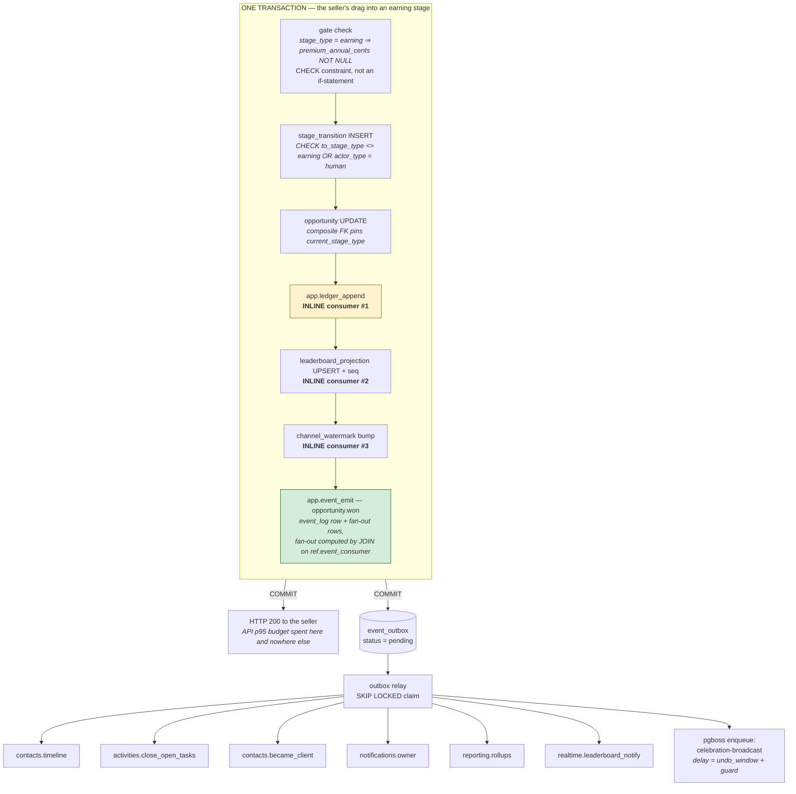
```mermaid
flowchart TB
  subgraph TX["ONE TRANSACTION — the seller's drag into an earning stage"]
    direction TB
    G["gate check<br/><i>stage_type = earning ⇒ premium_annual_cents NOT NULL</i><br/>CHECK constraint, not an if-statement"]
    ST["stage_transition INSERT<br/><i>CHECK to_stage_type &lt;&gt; earning OR actor_type = human</i>"]
    OP["opportunity UPDATE<br/><i>composite FK pins current_stage_type</i>"]
    LG["app.ledger_append<br/><b>INLINE consumer #1</b>"]
    LB["leaderboard_projection UPSERT + seq<br/><b>INLINE consumer #2</b>"]
    WM["channel_watermark bump<br/><b>INLINE consumer #3</b>"]
    EV["app.event_emit — opportunity.won<br/><i>event_log row + fan-out rows,<br/>fan-out computed by JOIN on ref.event_consumer</i>"]
    G --> ST --> OP --> LG --> LB --> WM --> EV
  end
  TX -->|COMMIT| RESP["HTTP 200 to the seller<br/><i>API p95 budget spent here and nowhere else</i>"]
  TX -->|COMMIT| OB[("event_outbox<br/>status = pending")]
  OB --> RELAY["outbox relay<br/>SKIP LOCKED claim"]
  RELAY --> C1["contacts.timeline"]
  RELAY --> C2["activities.close_open_tasks"]
  RELAY --> C3["contacts.became_client"]
  RELAY --> C4["notifications.owner"]
  RELAY --> C5["reporting.rollups"]
  RELAY --> C6["realtime.leaderboard_notify"]
  RELAY --> PB["pgboss enqueue:<br/>celebration-broadcast<br/><i>delay = undo_window + guard</i>"]
  style LG fill:#fff3cd,stroke:#856404
  style EV fill:#d4edda,stroke:#155724
```

The whole point of the picture: **eight statements inside the transaction, not eight handlers.** `ARR-EVT-32` states plainly that running the eight declared consumers of `opportunity.won` before responding to the drag would blow both the API p95 < 300 ms budget and the < 100 ms interaction budget on the single most important gesture in the product. The tiering is what buys that budget back, and the tiering is a table.

---

### 2. The two-tier classification as an enumerable artifact

`ref.event_consumer` (already in the signed data model) is the artifact. It is a **table**, seeded by migration from a generated file, with `PK (consumer_name, event_name)` and `event_name` typed as the `app.event_name` enum. Two consequences fall out for free:

- `event_outbox (consumer_name, event_name) REFERENCES ref.event_consumer` — a fan-out row for a consumer that does not exist **cannot be written**.
- A registry row naming an event outside the 49 **cannot be seeded**, because the enum rejects it, so the migration fails and therefore the deploy fails.

#### 2.1 The inline tier is closed, small, and counted

The inline tier is defined by a single admissibility rule, and the rule is stated so a future addition has to argue against it:

> **A consumer may be `inline` only if its eventual consistency would be a monetary error or a legal error.**

That admits exactly three families, and they are the three command paths a second model can audit line by line:

| `consumer_name` | `event_name` | Why it cannot wait for a commit | Anchor |
|---|---|---|---|
| `earnings.ledger` | `opportunity.won`, `opportunity.value_changed`, `opportunity.reopened`, `contact.merged` | The ledger row and the stage write are one unit, exactly-once per `source_event_id`. A queue hop introduces enqueued-but-rolled-back. | `ARR-EVT-06`, `ARR-EVT-07`, `ARR-MVP-05`, `ARR-MVP-06` |
| `earnings.leaderboard_projection` | (driven by the ledger append, same statement) | The board reads a projection, never a `SUM` over the ledger; a lagging projection is a public money number that is wrong for as long as the lag. | `ARR-UX-10` |
| `realtime.watermark` | every event bound to a poll channel | The 304 machine must be correct at the instant the 200 is returned, or the seller's own poll answers 304 against their own write. | `ARR-UX-09`, `ARR-UX-10` |
| `pipeline.gate_verdict` | `opportunity.gate_blocked` | A refusal is the **absence** of a state change and must still leave a durable verdict row; the counter that proves the 12× guard fires is the only evidence it was not bypassed. | `ARR-EVT-11` |
| `compliance.block_recorder` | `compliance.send_blocked` | Emitted synchronously at the point of refusal, before the typed refusal is returned; this is the number that proves the gate works. | `ARR-EVT-15`, `ARR-CMP-01` |
| `consent.stop_recorder` | `message.received` where `intent_hint = 'stop'` | The consent row and the suppression row commit **with** the message row. An eventually-consistent suppression list is an eventually-legal system, and the named failure is "a STOP honored on SMS but not on the dialer". | `ARR-EVT-12`, `ARR-EVT-13`, `ARR-EVT-31` |

Six rows. **A CI test asserts `SELECT count(*) FROM ref.event_consumer WHERE delivery = 'inline'` equals a literal in the test file.** Adding a seventh inline consumer turns the build red until someone edits that literal — which is the review gate, expressed as a diff a non-coder can see the shape of. This is the mechanical form of "only the ledger and the gates run in the transaction".

Note what is *not* inline and is often assumed to be:

- **`contact.became_client`** is a post-commit consumer of `opportunity.won`. It schedules a cross-sell 45 days out; nothing about it is monetary or legal in the next 200 ms.
- **The audit trail** is not a consumer at all. `event_log` *is* the `ARR-EVT-20` sink and it is written by the emission itself. `audit_log` is a different artifact with a different key, carrying privileged writes, gate verdicts and supervisor book views — which is why `book.viewed` is an audit row and correctly **not** an event, consistent with the catalog's own rejection of that name in §4b.
- **The celebration** is a `pgboss` consumer with a delay, never an inline one. §4 of `03-mvp-definition.md` still describes the celebration "firing from the same transaction as the ledger write"; that text is superseded and is flagged in this document as narrative appendix, per Puerta 12.

#### 2.2 The two tiers use two different mechanisms, deliberately

Inline consumers are **not** dispatched by `app.event_emit`. They are ordinary statements written into three command paths (the close gate, the compliance gate, the message materializer). Their registry rows exist to *declare and lock* the classification so CI can assert it — not to drive execution. Dynamic dispatch in the money path would be a worse trade than three explicit call sites.

Post-commit consumers are the opposite: **the emitter does not know them.** `app.event_emit(name, envelope, payload)` writes the `event_log` row and then computes the fan-out set with a single `INSERT ... SELECT` against `ref.event_consumer WHERE event_name = $1 AND delivery IN ('outbox','pgboss')`. An emitter therefore *cannot forget a consumer*, and adding a consumer requires zero edits to any emitter. That is the structural cure for the 66-ghost failure mode `02b` §2 discovered — modules waiting forever for events that never arrive — and it is also the whole answer to §7 of this document.

**The double-credit trap and its two nets.** If `earnings.ledger` were ever *also* registered as an `outbox` consumer of `opportunity.won`, the sale would be credited twice. Net one: the fan-out `WHERE` clause excludes `inline`. Net two: a CI query asserts no `consumer_name` appears with both `inline` and a non-inline delivery for overlapping events. Net three, which holds even if both fail: `UNIQUE (tenant_id, source_event_id)` on `earnings_ledger` makes the second append a no-op success path.

---

### 3. The contract is generated, not written

`ARR-EVT-01` (mandatory 9-field envelope, validated at every ingress), `ARR-EVT-02` (closed enum of 49, enforced at write time) and `ARR-EVT-27` (schema_version implies a registry replay must honor) are three requirements with one implementation.

**Single source of truth: `contracts/events/`.**

```
contracts/events/
  envelope.schema.json                 # the 9 fields, once, forever
  lead.created.v1.schema.json
  opportunity.won.v1.schema.json
  ... 49 names, one file per (name, version)
  consumers.yaml                       # (consumer_name, event_name, delivery, singleton_key_expr,
                                       #  max_attempts, backoff_seconds, external_effect)
  fixtures/<name>/v1.json              # frozen payload samples for the replay test
```

Nothing downstream is hand-written:

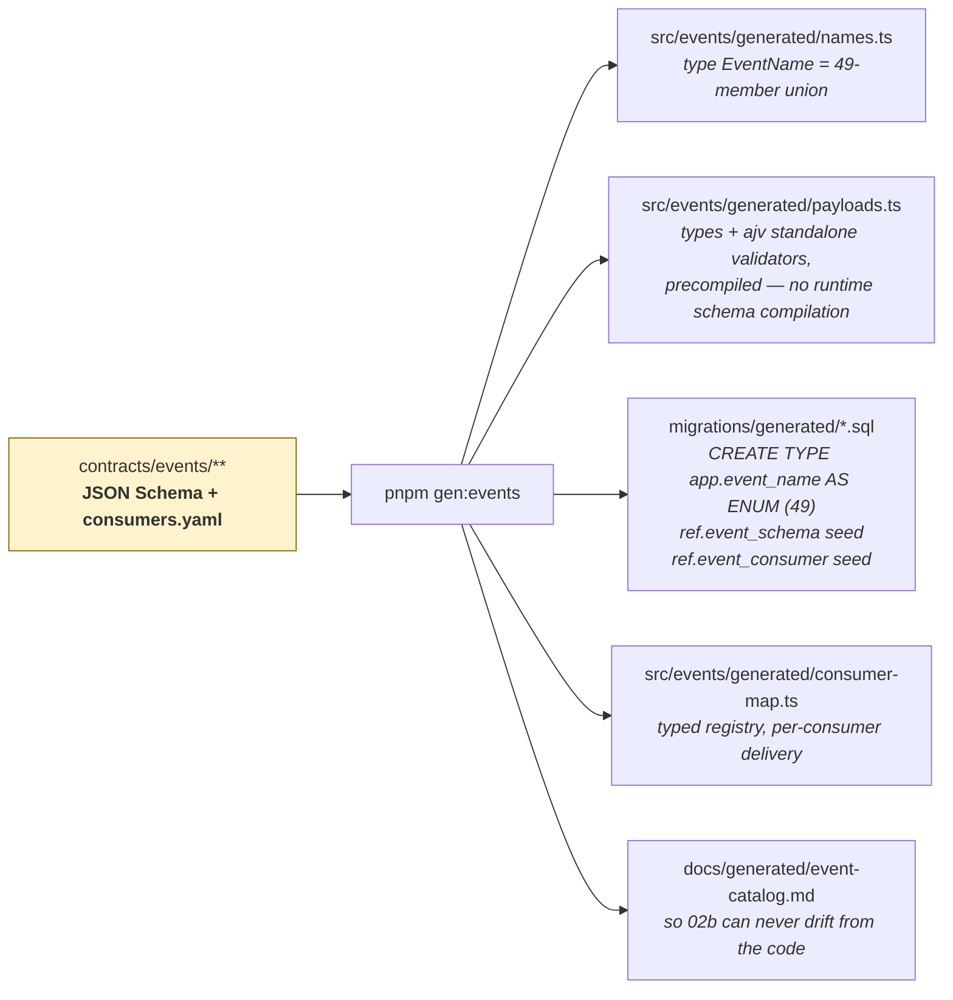
```mermaid
flowchart LR
  SRC["contracts/events/**<br/><b>JSON Schema + consumers.yaml</b>"] --> GEN["pnpm gen:events"]
  GEN --> TS["src/events/generated/names.ts<br/><i>type EventName = 49-member union</i>"]
  GEN --> PL["src/events/generated/payloads.ts<br/><i>types + ajv standalone validators,<br/>precompiled — no runtime schema compilation</i>"]
  GEN --> SQL["migrations/generated/*.sql<br/><i>CREATE TYPE app.event_name AS ENUM (49)<br/>ref.event_schema seed<br/>ref.event_consumer seed</i>"]
  GEN --> MAP["src/events/generated/consumer-map.ts<br/><i>typed registry, per-consumer delivery</i>"]
  GEN --> DOC["docs/generated/event-catalog.md<br/><i>so 02b can never drift from the code</i>"]
  style SRC fill:#fff3cd,stroke:#856404
```

**Subscribing to a name that does not exist fails at BUILD — through four independent doors, in this order:**

1. **Typecheck.** `defineConsumer({ name: 'contacts.timeline', on: ['call.creted'], delivery: 'outbox' })` — `'call.creted'` is not in the generated `EventName` union. `tsc` fails in the pre-merge CI tier.
2. **Drift gate.** `pnpm gen:events && git diff --exit-code` fails if any generated file was hand-edited. Without this, "single source" is a claim rather than a fact — someone edits `names.ts` to make the red build green and the schema files silently stop being the source.
3. **Migration.** `ref.event_consumer.event_name` is `app.event_name`. A bad name produces `invalid input value for enum`, the pre-deploy migration job aborts, and the deploy does not proceed.
4. **Three-way equality test.** `enum_range(NULL::app.event_name)` ≡ the schema filenames ≡ the exported handler map. A registry row with no exported handler fails; an exported handler with no registry row fails.

**The reverse ghost — a name nothing can emit — is caught by a coverage gate.** At the end of the integration suite, CI asserts that all 49 names appear at least once in `event_log`. A catalog entry that no code path can produce is exactly the class of defect `02b` §2 found 215 of, and this is the only mechanism that finds it without reading code.

**Envelope duplication is made impossible rather than corrected.** `02b` §4's `lead.created` row re-lists seven envelope fields inside its payload column and omits two; every other row just says "ENVELOPE, …". The generator **raises** if any payload schema declares a property whose name appears in `envelope.schema.json`, and every payload schema is `"additionalProperties": false`. The envelope exists once.

**`schema_version` becomes a foreign key.** One relation is added on top of the signed data model:

- **`ref.event_schema`** — `PK (event_name, schema_version)`, plus `json_schema jsonb NOT NULL`, `upcast_fn text`, `registered_in_migration text NOT NULL`. `event_log` gains `FK (event_name, schema_version) REFERENCES ref.event_schema`. Registry class `reference`, `exception_reason = 'global schema registry, no tenant dimension, SELECT-only to crm_app, seeded by migration'` in `security.table_registry`.

You cannot write a v2 event before the v2 schema is registered by a migration. A version bump requires a fixture for the previous version and an `upcast_fn`, asserted by CI; the replay test runs current consumers against the stored v1 fixtures. This is `ARR-EVT-27` as a constraint instead of a promise, and it matters precisely because the retention window is unbounded: **v1 rows will still be replayed in 2031.**

#### 3.1 Catalog corrections this phase makes binding

These are the `02b` inconsistencies the ARR flagged. They are settled here because the generator will otherwise encode the contradiction:

| Item | Ruling | Mechanism |
|---|---|---|
| `to_stage_is_closed` / `to_stage_closed_type (won\|lost\|null)` in `opportunity.stage_changed` | Replaced by **`to_stage_type (open\|earning\|lost)`** and `from_stage_type`, matching the signed data model. `closed=won` and `earning` are the same flag under D1/D4. Semantics unchanged; names reconciled. | The payload schema has no `to_stage_is_closed` property and `additionalProperties: false`; the enum is `app.stage_type`. |
| `lead.owner_changed` named in §2's reconciliation table | Ghost. The real name is **`contact.owner_changed`**. | Not in the 49-member enum. Any reference fails typecheck. |
| `earnings.updated` carries no stage-configuration reference (`ARR-EVT-08`) | Payload gains `stage_config_version` and `stage_name_snapshot`, mirroring the ledger row. | Required properties in the schema; `NOT NULL` on the ledger columns. |
| `call.initiated`'s consumer column still says speed-to-lead measures from initiation | Superseded by §4b binding correction 2. **Speed-to-lead stops on `call.completed` with `disposition_canonical ∈ {connected, voicemail}`.** One stop point, per Puerta 12. | `opportunity.first_touch_latency_seconds` is write-once by trigger, and **only** the `pipeline.speed_to_lead` consumer of `call.completed` is registered to write it. No consumer of `call.initiated` binds to that column — a negative fact that is queryable. |
| `04-ux-flows` Flow 5 D1: "`call.initiated` is emitted only on a 2xx from Aloware" | Superseded by §4b binding correction 1 and `ARR-EVT-18`. It is emitted **before** confirmation. | `call.aloware_call_id` is nullable at insert; the Aloware dial is an outbox row dispatched post-commit. |
| The `note` value in the activity type enum | Never used — a note is its own table. Recorded as a harmless catalog inconsistency rather than "fixed" by someone later. | A CI assertion that `activity` contains zero rows with `type = 'note'`. |
| `appointment.starting_soon` (T-15m, to the seller) vs the T-1h reminder (a `message.sent` to the lead) | **Two distinct things.** Collapsing them loses one. | Two `scheduled_job` idempotency keys: `meeting_id\|\|':starting_soon_t15'` and `meeting_id\|\|':reminder_t60'`, both under `UNIQUE (tenant_id, kind, idempotency_key) WHERE canceled_at IS NULL`. |

#### 3.2 The nine Amendment-1 events, specified

`02b` §4b lists nine additions with only Emitter/When/Why. Puerta 12 requires envelope + payload + consumers before any schema work, or they get built ad hoc — which is the sprawl the catalog exists to prevent. All nine carry the full 9-field envelope; the table gives the payload beyond it.

| Event | Payload beyond envelope | `inline` | `outbox` | `pgboss` |
|---|---|---|---|---|
| `lead.reposted` | `contact_id`, `opportunity_id`, `intake_source_id`, `raw_payload_id`, `vendor_name`, `fields_updated[]`, `repost_ordinal`, `dedupe_key` | — | `contacts.timeline`, `reporting.vendor_quality` | — |
| `compliance.send_blocked` | `channel`, `verdict` (`outside_window\|no_consent\|stop\|dnc\|10dlc_pending\|bad_number\|unknown_timezone\|unverified_mapping`), `contact_id`, `contact_phone_id`, `opportunity_id`, `attempted_via`, `local_time_at_contact`, `override_id` | `compliance.block_recorder` | `contacts.timeline` (60 s dedupe bucket), `notifications.owner` | — |
| `compliance.override_started` | `override_id`, `started_by_user_id`, `reason`, `scope`, `expires_at` | `admin.audit` | `realtime.banner_broadcast` | — |
| `compliance.override_ended` | `override_id`, `ended_by_user_id`, `end_reason`, `duration_seconds` | `admin.audit` | `realtime.banner_broadcast` | — |
| `appointment.starting_soon` | `meeting_id`, `contact_id`, `opportunity_id`, `starts_at_utc`, `contact_timezone`, `offset_minutes = 15` | — | `notifications.owner` | emitted **by** the scheduler dispatcher |
| `opportunity.gate_blocked` | `opportunity_id`, `contact_id`, `attempted_stage_id`, `attempted_stage_type`, `missing_fields[]`, `moved_via`, `actor_type` | `pipeline.gate_verdict` | `reporting.gate_health` | — |
| `contact.owner_changed` | `contact_id`, `old_owner_user_id`, `new_owner_user_id`, `opportunities_moved[]`, `reason`, `admin_user_id`, **`money_moved = false`** | `admin.audit` | `contacts.timeline`, `notifications.both_owners`, `comms.rethread` | — |
| `contact.bad_number_flagged` | `contact_id`, `contact_phone_id`, `phone_e164`, `reason` (`hard_bounce\|wrong_number\|invalid\|carrier_reject`), `source_event_id` | — | `contacts.timeline`, `activities.find_better_number`, `reporting.vendor_quality` | — |
| `integration.mapping_verified` | `mapping_id`, `user_id`, `aloware_user_id`, `from_number_e164`, `verified_by_call_id` | `admin.audit` | `notifications.owner`, `admin.alert_clear` | — |

`money_moved = false` is a literal in the payload on purpose: the ruling that a single-record admin transfer moves records but **not** money (`ARR-MVP-22`, US-9.12) becomes visible in the data rather than buried in a decision log, and the §4b claim that `contact.owner_changed` "moves leads AND money between books" is explicitly superseded. The mechanical form of the ruling is stronger and lives in the registry: **there is no row binding `contact.owner_changed` to `earnings.ledger`, and a CI test asserts that absence by name.** A negative assertion over a table is enforceable; "we decided not to" is not.

#### 3.3 The two rulings that delete a job

**`pipeline.stage_config_changed` is not a ledger input.** Because `stage.stage_type` is immutable by trigger in the signed data model — a seller who wants a different type creates a new stage and moves cards through the normal gated path — a stage-config change is structurally incapable of moving money. Therefore:

- `ARR-EVT-07`'s five ledger inputs become four (`opportunity.won`, `opportunity.value_changed` where closed-won, `opportunity.reopened`, `contact.merged`) plus `manual_adjustment` from the admin command path.
- **`ARR-EVT-09` is void.** The asynchronous bulk recompute job does not exist. The documented contradiction between item 61 of `03-mvp-definition.md` ("recompute on stage-flag change") and Area-3 D-2 / US-9.4 ("No recompute job exists — verify the job queue is empty after the change") resolves in favour of D-2, and US-9.4's assertion becomes literally true and testable: after a stage-config change, `SELECT count(*) FROM pgboss.job WHERE state IN ('created','active')` is unchanged.
- Enforcement: no registry row binds `pipeline.stage_config_changed` to `earnings.ledger`; CI asserts that pair's absence; and `ref.event_consumer` for that event name lists only `pipeline.board_rebuild`, `automations.stale_rule_flag`, `reporting.funnel_defs` and `notifications.affected_sellers`.

**The undo window needs no new event.** The ARR flags that nothing in the catalog models it, and that inventing an event is forbidden. The ruling is options (a) **and** (b) together, which is coherent and requires no new name:

- Undo inside the 5 s window appends an `opportunity.reopened` with a reversing delta — a real reversal, visible in Audit and Reporting, exactly as `ARR-EVT-07` already provides for.
- The public projection additionally applies a **time filter** so the floor never sees a number that later corrects itself: `recorded_at <= clock_timestamp() - app.undo_window()`.
- The undo is **silent**: no toast, no notification, no broadcast (non-negotiable 8).
- The celebration is a `pgboss` consumer with `delay = undo_window_ms + undo_projection_guard_ms`, and its handler re-checks that no reversal row exists for that `source_event_id` before broadcasting. Otherwise the whole office sees confetti for a cancelled sale.

---

### 4. Idempotency, ordering, replay, dead-letter

#### 4.1 Idempotency: three layers, and the middle one is the one that actually works

| Layer | Key | Protects against | Enforced by |
|---|---|---|---|
| Coarse | `event_id` (uuidv7, minted at the four ingress adapters) | Our own redelivery, replay | `PK (tenant_id, occurred_at, event_id)` per partition; global uniqueness by generation |
| **Natural** | `aloware_call_id`, `provider_message_id`, `(intake_source_id, dedupe_key, dedupe_bucket)`, `client_move_key`, `source_event_id` | **External** redelivery, which does not carry our `event_id` | Real UNIQUE indexes; `ON CONFLICT DO NOTHING` at the edge |
| Consumer | `(consumer_name, event_id)` implicit in the outbox PK | At-least-once relay redelivery | `PK (tenant_id, created_day, event_id, consumer_name)` |

`ARR-EVT-16` is explicit that `event_id` dedupe alone cannot protect the external paths, and that is the layer everyone forgets. **The dedupe check happens in the same transaction as the record write** — an `INSERT ... ON CONFLICT DO NOTHING` — never insert-then-check, because two concurrent webhook retries both pass a check.

**The exactly-once/at-least-once split is a design outcome, not a hope.** The relay claims in transaction 1 (`status := 'claimed'`) and then, in transaction 2, runs the handler's writes **and** the `status := 'delivered'` mark together. Therefore:

- A **DB-only** outbox handler is effectively **exactly-once**: a crash before commit leaves the row claimed and the writes absent; the stale-claim reaper (a pg-boss scheduled job, threshold in `system_constant`) returns it to `pending`.
- An **external-effect** handler is **at-least-once**, because the external call cannot join our transaction. Those consumers carry `external_effect = true` in the registry, and CI asserts that **every `external_effect` consumer either declares a provider idempotency key expression or sets `max_attempts = 1`.**

`max_attempts = 1` is the correct setting for `comms.aloware_dial`: retrying a dial rings a real human a second time. Its failure path is `dead_letter` plus the tenant-wide degraded banner, not a retry. `comms.aloware_disenroll` is the opposite — `max_attempts = 20` with a long backoff ladder, because `ARR-EVT-14` requires retry until acknowledged and the alternative is a robot texting someone who opted out. **Retry policy is a column, per consumer, not a global default**, which is exactly the distinction a global default erases.

#### 4.2 Ordering: the transport guarantees none, and that is stated as a rule

`ARR-EVT-17` forbids relying on ordering. Three rules, all mechanical:

1. **Consumers order by `occurred_at_ms`; arrival is ordered by `recorded_at_ms`.** The split is why a webhook 40 s late still threads correctly, and the ingress adapters must honour it per source: an Aloware webhook's `occurred_at` is the provider's `started_at`, never our receive time (`ARR-EVT-26`). Collapsing them destroys speed-to-lead.
2. **State machines are monotonic, never last-write-wins.** `call.state_ordinal` is guarded by a `BEFORE UPDATE` trigger that raises on regression, and field merges are `COALESCE(NEW.x, OLD.x)`. A `call.initiated` arriving after `call.completed` cannot regress a completed call to pending.
3. **The only ordering the system provides is per-key**, via pg-boss `singletonKey` (§5), plus a per-tenant total order via `event_log.seq` for replay only.

The test that makes this real: the **out-of-order suite** replays each webhook fixture set forward, reversed, and shuffled, and asserts the final row is **byte-identical** across all orderings. That is `ARR-INT-06` ("final state must equal in-order state") as an executable assertion instead of a paragraph.

#### 4.3 Replay is one job, and the ledger is not in it

`ARR-EVT-21`: rebuilding the leaderboard from scratch must be one job, and the retention window for money-bearing and contact-bearing events has no expiry. That rules out any transport whose durability is a broker retention window; **the event store, not the queue, is the system of record.**

`app.replay(from_seq, to_seq, consumers[])`:

1. Streams `event_log` ordered by `(tenant_id, seq)` — the `event_replay_idx` merge-appends per-partition indexes, which is exactly the access pattern a replay wants.
2. If the range covers an archived month, restores from `event_archive_manifest` first and **verifies the sha256 and the row count** before streaming.
3. Re-materializes `event_outbox` rows stamped `replay_of_run_id`, and the relay drains them by the normal path. Replay uses no special code path — the thing being tested is the thing being used.
4. **Raises if `consumers[]` contains any `inline` consumer.** The ledger is the one projection that is append-only-corrected-by-reversal rather than rebuildable, and re-running it would double-credit an entire year. The guard is a `SELECT ... WHERE delivery = 'inline'` inside the function, so the refusal is a database fact.

Because end-to-end idempotency comes from the **natural keys** rather than from outbox rows, `event_outbox` daily partitions can be dropped at 14 days while a replay from 2027 still works. That is the property that keeps the outbox from becoming the second monotonic storage line.

#### 4.4 Dead-letter: one table, nothing discarded, one visible counter

`dead_letter` takes every terminal failure with `origin ∈ {inbound_webhook, outbox, job}`, keyed `UNIQUE (tenant_id, origin, subject_type, subject_id)` so a repeat failure increments rather than floods. The raw body is retained **by reference** (`FK raw_payload_id → raw_payload_vault`), never copied and never lost — which is what Puerta 11 asserts: a job that throws N times lands in the DLQ **with the raw body intact**.

The count of unresolved rows is the number on `/admin/integration-health`; crossing a threshold writes an `admin_alert` of kind `dlq_depth`. Replay is an admin-only definer function that re-materializes the outbox row or re-enqueues the merge job and stamps `replayed_at`, `replayed_by_user_id`.

**The pg-boss version-drift hazard is contained by architecture, not by vigilance.** The public corpus is overwhelmingly 9.x/10.x against our pinned 12.x, and the drift lands precisely on retry and dead-letter semantics — a failure **by absence**, where a webhook is retried zero times and discarded and nobody notices for weeks. The containment: **the outbox path does not use pg-boss retry semantics at all.** `attempts`, `next_attempt_at`, `backoff_seconds[]` and the terminal transition to `dead` are our columns in our table. Only the `pgboss`-delivery consumers depend on pg-boss's own semantics, and that set is enumerable with one query. Add the pinned version, the vendored README in the repo, 100 % of the surface wrapped in `src/jobs/` behind our own types, and the Testcontainers DLQ assertion.

---

### 5. Serialization by key: the call-enrichment merge

This is the failure the thesis names as non-negotiable 9, and it deserves the diagram because the naive fix is *also* wrong.

**The hazard.** Aloware posts recording, transcript and AloAi summary as separate late webhooks for one `aloware_call_id`. Two arriving 50 ms apart, processed by two workers, with a `SELECT`-then-`UPDATE` merge, produce a lost update. The symptom is a timeline entry that **looks perfectly fine** and is simply missing the transcript — invisible, and it corrupts `last_activity_at`, the 7-day cold rule and the rot badges downstream.

**The naive fix that silently loses data.** Put the webhook body in a pg-boss job payload with `singletonKey = aloware_call_id`. pg-boss will refuse the second job while the first is active — and the second job's *body* is the data the first one does not have. You have traded a lost update for a lost webhook.

**The correct shape:**

```mermaid
sequenceDiagram
  participant A as Aloware
  participant I as ingest role<br/>POST /webhooks/aloware
  participant DB as PostgreSQL 18
  participant W as worker role<br/>queue call-merge

  A->>I: recording webhook (t=0ms)
  I->>DB: INSERT raw_payload_vault + inbound_webhook_event<br/>ON CONFLICT (provider_event_id) DO NOTHING
  I->>DB: pgboss.send('call-merge', {aloware_call_id}, {singletonKey: aloware_call_id})
  I-->>A: 204 (no merge, no domain access, no parse)
  A->>I: transcript webhook (t=50ms)
  I->>DB: INSERT vault + inbound_webhook_event
  I->>DB: send('call-merge', same singletonKey) → collapsed, and that is safe
  I-->>A: 204
  W->>DB: BEGIN; SELECT * FROM inbound_webhook_event<br/>WHERE aloware_call_id = $1 AND status='received'<br/>ORDER BY received_at FOR UPDATE
  W->>DB: fold ALL unmerged rows: COALESCE(new, old) per field,<br/>state_ordinal monotonic guard
  W->>DB: app.timeline_upsert (UNIQUE ref_type, ref_id → updates in place)
  W->>DB: mark rows merged; COMMIT
```

Four properties, each with its own enforcement:

1. **The job payload is an id, never the data.** The handler re-reads *all* unmerged rows for that call. A collapsed duplicate job is therefore harmless: the surviving job does the work of both. Mechanism: the `JobPayload<T>` type admits ids and scalars only, and the `call-merge` payload type is `{ alowareCallId: string }` — a body cannot be put there without a type error.
2. **The `singletonKey` is in the handler's type signature.** `defineConsumer` is a discriminated union on `delivery`; `delivery: 'pgboss'` makes `singletonKey: (p: P) => string` a **required** property. Omitting it does not compile. Backed at the storage layer by `CHECK (delivery <> 'pgboss' OR singleton_key_expr IS NOT NULL)`.
3. **The ingest handler never merges.** It does a verbatim insert and returns 204 — write-first, respond-fast, process-async (`ARR-INT-04`). Enforced by dependency-cruiser: modules under `src/ingest/**` may not import anything under `src/domain/**`. The one number that could invalidate this shape — whether Aloware demands a sub-second synchronous response — is a Puerta 7 measurement.
4. **The merge is idempotent in place.** `timeline_entry`'s `UNIQUE (tenant_id, ref_type, ref_id)` makes late enrichment an update, never a second row (`ARR-EVT-17`), and `crm_app` has no INSERT/UPDATE on that table at all — only `app.timeline_upsert()` can write it, so "nobody writes timeline rows directly" (`ARR-EVT-22`) is a privilege fact.

Puerta 2 asserts zero lost updates in the field-level merge under 20 000 webhooks in 60 seconds with the singleton key active. Puerta 11 asserts the key actually serializes two webhooks for the same call arriving 50 ms apart.

**The same pattern, once, for messages.** `message-merge` with `singletonKey = provider_message_id`. One idempotency shape shared by calls and messages rather than a second implementation (`ARR-INT-05`).

**And the untrusted-transport rule.** Schema `pgboss` is on the RLS exception list — it owns its own DDL and knows nothing about our session context. The compensating control is not "be careful with payloads"; it is that **the job payload type cannot contain `tenantId`**. The handler wrapper calls `app.resolve_owner(subject_type, subject_id)` — a `SECURITY DEFINER` function — and sets the three GUCs from *that*. You cannot trust a field that does not exist. This closes the open question the data model left between HMAC-signed payloads and re-derivation, in favour of re-derivation: cheaper, stronger, and it makes the wrong thing unrepresentable rather than detectable. Note the contrast with the outbox, which **is** trusted transport: its rows are written in the same transaction as the event, FK-constrained to the registry, and never leave our schema.

---

### 6. Realtime: NOTIFY is an accelerator over a polling floor, never a transport

The adversarial review found the failure this stack does not see on its own: `NOTIFY` delivers **only to sessions listening at that instant** — no buffer, no replay, no cursor. If the dedicated `LISTEN` connection drops and reconnects (rolling redeploy, node recycle, database maintenance, idle timeout, OOM at 512 MB), every `NOTIFY` in that window is gone forever, while the browser's SSE connection stays alive with heartbeats, no reconnection fires, and the transport-in-use metric reports SSE **and reports the truth**: the transport *is* SSE, it simply delivers nothing.

The architectural answer is to make that failure a latency problem instead of a correctness problem:

> **Every `NOTIFY` in this system carries a channel name and a watermark `seq`. Never data. The client's reaction to a frame is a conditional GET, and the poll interval remains a floor that runs regardless.**

Consequences that fall out:

- A lost `NOTIFY` costs latency, not data. The board converges on the next poll tick.
- `ARR-EVT-23` becomes structural: the tenant-wide frame type is `{ channel: string, seq: number }` with `additionalProperties: false`. **You cannot leak a lead row through a channel whose payload type cannot express one.** A CI test asserts the SSE frame schema contains no PII-typed field.
- The relay uses the same discipline internally: `app.event_emit` sends `NOTIFY outbox_ready`, and the relay also polls on a 1 s floor. A lost wake-up costs up to one second.
- The two-legged synthetic check (non-negotiable 5) is what detects the degraded state: one leg asserts the leaderboard ETag moved via **polling**, the other asserts a headless SSE subscriber received the frame via **push**, both within 10 s. A one-legged ETag check passes green while the board is frozen for all fifty.

**`ARR-EVT-24` restated per channel, as Puerta 12 requires.** The p95 < 2 s contract applies to **call state** — leg-A answer, leg-B answer, `call.completed` — which is the channel `04b` Part 3 §1.10 has no entry for and which the wrap-up sheet depends on. For the **leaderboard** the honest number is different and no transport can beat it, because `ARR-MVP-10` imposes it: `undo_window (5 000 ms) + guard (500 ms) + delivery`, so **p95 ≈ 5.6 s from drop to the floor's screen**, and the seller's own private "My Earnings" view updates immediately because it reads the ledger directly with pending entries marked. The demo claim "while the call is still warm" survives; "instantly" does not, and this document says so rather than letting CI discover it.

---

### 7. Plugging in a new module without touching an existing one

This is the acceptance test for the whole design, and it is three files and zero edits:

1. **Add rows to `contracts/events/consumers.yaml`** — `(consumer_name, event_name, delivery, max_attempts, backoff_seconds, external_effect[, singleton_key_expr])`.
2. **Export a handler** with the matching name from the module's `consumers.ts`.
3. **Run `pnpm gen:events`** and commit the regenerated files. The migration seeds the new registry rows; `security.harden()` classifies any new tables or the deploy fails.

**No emitter changes.** The fan-out is a `JOIN` against `ref.event_consumer` computed by the database at emission time, so the module that emits `opportunity.won` does not know and does not need to know that a ninth consumer now exists. The 66-ghost class is cured at the source rather than policed.

**No consumer changes when a channel is added.** Adding WhatsApp is a new value in the `app.channel` enum and a new provider adapter; `message.sent` / `message.received` already carry `channel`, and `conversation` already reserves `whatsapp_reserved`. Zero consumers are touched, which is the property `02b` §2 designed the `sms.*` + `email.*` → `message.*` merge to produce.

**Worked example — `comms.aloware_disenroll`, which is not in the MVP.** It is deliberately *absent* from the registry today, because a registry row with no exported handler fails the build; there is no such thing as a declared-but-unimplemented consumer. When Automations ships in V1.1, the change is: one row `(comms.aloware_disenroll, sequence.paused, outbox, max_attempts=20, external_effect=true, idempotency_expr='enrollment_id')`, one handler, one regeneration. The emitter of `sequence.paused` is not opened.

**The one thing that *is* a migration:** adding a 50th event name. That is intentional. `ALTER TYPE app.event_name ADD VALUE` is a migration with a review gate, and it is the mechanism that stops the 262-event sprawl from regrowing (`ARR-EVT-02`). A CI test asserts `enum_range` has exactly the number of labels declared in the test file — so growing the catalog is a visible, deliberate diff.

---

### 8. Folded into one process, or split into three

The owner's requirement is that the three-process split be **deployment configuration, not an architectural assumption**: launch folded and cheap, separate later without redesign or migration. That is achievable here for one reason, and it is worth stating baldly:

> **There is no in-memory communication anywhere in this system. Every hand-off between the three roles is a row in Postgres — an outbox row, a pg-boss job, a `NOTIFY` on a Postgres channel. Folding is co-locating three loops in one Node process. Splitting is running the same loops on separate machines. Neither changes a single semantic.**

#### 8.1 The mechanism

One image, one entrypoint, one env var:

```
ROLES=web,worker,ingest     # ESCALÓN 0 (local) and ESCALÓN 1 (pilot)  — one process
ROLES=web    /  ROLES=worker  /  ROLES=ingest    # ESCALÓN 2 — three services
```

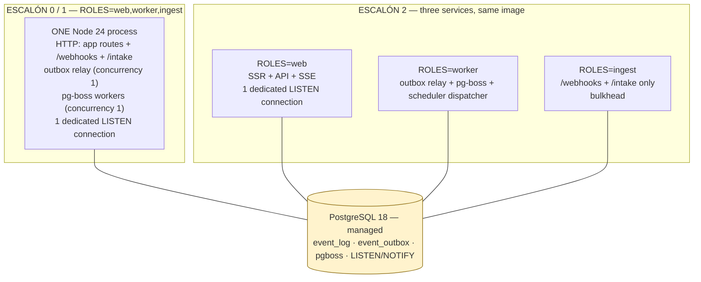
```mermaid
flowchart TB
  subgraph FOLDED["ESCALÓN 0 / 1 — ROLES=web,worker,ingest"]
    P1["ONE Node 24 process<br/>HTTP: app routes + /webhooks + /intake<br/>outbox relay (concurrency 1)<br/>pg-boss workers (concurrency 1)<br/>1 dedicated LISTEN connection"]
  end
  subgraph SPLIT["ESCALÓN 2 — three services, same image"]
    W["ROLES=web<br/>SSR + API + SSE<br/>1 dedicated LISTEN connection"]
    K["ROLES=worker<br/>outbox relay + pg-boss + scheduler dispatcher"]
    G["ROLES=ingest<br/>/webhooks + /intake only<br/>bulkhead"]
  end
  P1 --- DB[("PostgreSQL 18 — managed<br/>event_log · event_outbox · pgboss · LISTEN/NOTIFY")]
  W --- DB
  K --- DB
  G --- DB
  style DB fill:#fff3cd,stroke:#856404
```

Composition rules, each with its enforcement:

| Rule | Mechanism |
|---|---|
| A route can only be mounted on the role that owns it | The route table is a generated manifest tagging each route `surface: 'app' \| 'ingest'`; the mount function takes the role set. CI asserts the two mounted sets **union to the full manifest and intersect empty** — so `/webhooks` is unreachable on `web` when split, and reachable exactly once when folded. |
| No consumer may be invoked by a function call from its emitter | `src/events/` exports only `emit()`. Handler modules are imported **only** by the generated dispatcher registry. A dependency-cruiser rule fails the build if anything outside `src/events/dispatch/**` imports `src/consumers/**`. The "it's the same process anyway, just call it" shortcut cannot be committed. **This single rule is what makes the fold reversible.** |
| Exactly one `LISTEN` owner | The dedicated connection is opened only when `web ∈ ROLES`; a boot assertion fails on a second owner. The two-legged synthetic check proves it is alive in both shapes. |
| Migrations are never part of a long-running process | `migrate` is a separate one-shot entrypoint running as `crm_migrator`, and it refuses to start with a non-empty `ROLES`; the long-running entrypoint asserts `current_user = 'crm_app'` and is not the schema owner (non-negotiable 13). |
| Concurrency and pool sizes differ by shape, not by code | `WEB_POOL_MAX`, `WORKER_POOL_MAX`, `INGEST_POOL_MAX`, `RELAY_BATCH`, `BOSS_CONCURRENCY` are env, sized against the **measured** connection ceiling from Puerta 1 with 2× headroom for a rolling redeploy. |

#### 8.2 The mechanism that proves it, and it is the important one

> **The entire integration suite runs twice in CI: once with `ROLES=web,worker,ingest` in a single process, once with three processes each carrying one role. Both legs must produce identical outcomes.**

Call it the **topology matrix**. It costs one dimension in a test matrix, not a second codebase, and it converts "the split is configuration" from a design claim into a build-breaking assertion. Without it, the folded shape silently accumulates same-process assumptions — a shared in-memory cache here, a direct call there — and the day the pilot becomes production, splitting is a rewrite. Local development runs the **folded** shape by default (`docker compose`, same image as production), so the escalón-1 topology is the one the developer sees every day, and CI is what keeps the escalón-2 topology honest.

#### 8.3 What is genuinely lost when folded, stated without euphemism

Folded, the ingest bulkhead is gone: a webhook storm shares an event loop with the seller's board. At escalón 1 — two or three sellers, no storm — that is the correct trade. The mechanisms that keep it a **dial** rather than a redesign:

- The ingest router carries its own rate limiter and its own connection pool with its own `max`, keyed by role. Folded, they are smaller and still separate.
- A concurrency semaphore on the ingest surface, sized by env. Under a storm the folded process returns 429/503 to the provider, which retries — a correct outcome, and strictly better than freezing the board.
- The relay and pg-boss run at concurrency 1 when folded, so background work cannot monopolize the loop.
- Puerta 2 (20 000 webhooks in 60 s while 50 simulated sellers hold the polling floor) is run against **both** shapes. The folded shape is expected to fail the ingest leg at production volume — that failure *is* the trigger to split, and the split is an env var and a second service, not a change.

**The connection budget, both shapes** — this is what Puerta 1 must measure, and the design is sensitive to it:

| Shape | Sustained connections | Rolling-redeploy transient |
|---|---|---|
| Folded (`ROLES=web,worker,ingest`) | web pool + worker pool + ingest pool + 1 LISTEN | ≈ 2× for the overlap window |
| Split (three services) | same three pools, on three hosts, + 1 LISTEN | ≈ 2× for the overlap window |

The totals are nearly identical because the pools are sized by workload, not by process count. That is not an accident — it is the reason folding does not require re-tuning, and it is a claim Puerta 1 must confirm rather than assume. If the pooler is needed, it is Render's PgBouncer in **transaction mode only**, which is safe precisely because every unit of work in this system — HTTP request, pg-boss handler, outbox dispatch, CSV import, export job — is already an explicit transaction whose first statement is three `set_config(..., true)` calls.

---

### 9. Sizing, so the storage line is not a surprise

At 50 sellers, order 20 000–50 000 events/day plus 10 000–20 000 webhooks/day (assumptions carried since Phase 0 — OQ-2 is still unmeasured, and Puerta 7 measures the burst shape).

| Table | Volume | Residence | Why it does not grow forever |
|---|---|---|---|
| `event_log` `retention_class='permanent'` | ~30 of 49 names; money, consent, lifecycle, admin | Postgres, forever | Small: ~600–800 B/row on the low-volume names |
| `event_log` `retention_class='archivable'` | `call.*`, `message.*`, `activity.*`, `appointment.starting_soon` — the volume | Postgres 13 months → R2, manifest-indexed, digest-verified | Monthly partition `COPY` → R2 → `DETACH` → drop. **Archived is not expired**; replay restores first |
| `event_outbox` | ~4 consumers × events ≈ 80k–200k rows/day | Daily partitions, dropped at 14 days | Safe because replay idempotency comes from natural keys, not outbox rows |
| `pgboss.job` | high-churn, order 4×10⁵/month | Retention configured **explicitly** | Unconfigured, the bloat degrades the database serving the board within months (Puerta 11) |
| `raw_payload_vault` bodies | the bulk | Postgres → R2 within hours, R2 lifecycle rule expires them | No purge job anyone can forget. Window still an open decision |

Storage on this provider is roughly double the alternatives and **cannot be shrunk once grown**. The archive boundary is therefore not an optimization — it is the mechanism that keeps the only monotonically rising cost line on the cheap tier.

---

### 10. What this section closed, and what it did not

**Closed:** the transport decision (§1); the two-tier classification as a table with a counted inline set (§2); the generated contract with four build-time doors (§3); the nine Amendment-1 event specifications (§3.2); `contact.owner_changed` excluded from the ledger inputs by a named negative assertion (§3.2); `pipeline.stage_config_changed` excluded and `ARR-EVT-09`'s recompute job deleted (§3.3); the undo window without a new event (§3.3); idempotency, ordering, replay and dead-letter (§4); the call-merge serialization including the naive fix that loses a webhook (§5); `NOTIFY` demoted to an accelerator and `ARR-EVT-24` restated per channel (§6); the plug-in procedure (§7); the folded/split topology and the matrix that proves it (§8).

**Left open, deliberately, with the gate that closes each:** whether Aloware signs its webhooks and whether it demands a sub-second synchronous response (Puerta 7 — the second number decides whether write-first/respond-fast is sufficient); the real burst shape of ping-post and webhook traffic (OQ-2, Puerta 7 — it sets the partition cadence, not the design); the measured connection ceiling in both topologies (Puerta 1); the raw-payload retention window (a CCPA minimization decision that must be chosen before the first vault row, because it is written into every row at insert); and whether Render grants `CREATE EVENT TRIGGER` (Puerta 0/5 — the design does **not** depend on one; `security.harden()` as the last statement of the pre-deploy migration is the primary, and an event trigger would be belt-and-braces only).

---

# Part III — API, Auth and Permissions

## API, Auth and Permissions

This section fixes the shape of every server surface in the product: how a request is routed, validated, scoped, cached, authenticated and denied. It exists because four of the register's most expensive failure modes live here and none of them is visible on a screen: a query that forgets the owner predicate (ARR-MVP-01), a response with a shared cache directive (thesis non-negotiable 14), a `403` where a `404` was required (ARR-UX-04, ARR-PRV-04), and a poll that stops answering `304` (ARR-UX-09, ARR-OPS-02). Each subsection ends with the mechanism, because Jorge validates by behaviour and a convention nobody can forget is not a convention — it is a hole with a comment above it.

---

### 1. API style: resource routes, and why this is *with* the framework rather than against it

The ARR's warning is real and it is the single largest source of silent architectural drift in this stack: *using a framework against its idiom, under vibecoding, produces permanent erosion*, because every example the model has seen points the other way (variants-v2 §B2, framework layer). But the warning has been mis-stated in the earlier drafts as "forbid `loader` and `action`". That is fighting the framework, and a rule that fights the framework loses in session sixty.

**React Router 8 framework mode has two kinds of route module, and one of them is a JSON API.** A route module that exports `loader`/`action` and **no** `default` component is a *resource route* — the framework's own, documented, first-class way to serve non-HTML responses. So the ruling is not a prohibition, it is a **partition**:

| Tree | Exports | Serves | Data access |
|---|---|---|---|
| `app/routes/ui/**` | `default` component **only** (plus `ErrorBoundary`, `meta`, `links`) | HTML | none — TanStack Query against `/api/**` |
| `app/routes/api/**` | `loader` and/or `action` **only**, produced by `defineEndpoint()` | JSON, `304`, `text/event-stream` | one handler in `src/http/handlers/**` |

One rule, and it is structural rather than stylistic: **a route module exports a component or it exports a loader/action, never both.** That is trivially checkable, it maps onto a concept the framework already has a name for, and it survives a model that has read a thousand loader examples — because the loader examples are still legal, they just live in `routes/api/**` where they belong.

#### 1.1 Why the application's data does not travel through UI-route loaders and actions

Four independent, register-anchored reasons. Any one of them alone would be enough; together they close the question.

1. **ARR-UX-01 / D3-01.** A Class-O stage move is held entirely client-side for 5000 ms and asserted *at the network layer* to produce zero requests when undone. `useSubmit`/`fetcher.submit` fire immediately by construction. A deferred-commit scheduler layered on top of an action is a scheduler fighting a router.
2. **ARR-UX-20.** Every block on seller home and My Day is an independent fetch with its own error and its own retry; a failed rank block must not take My Day down. Route-level `loader` is a *page*-level data unit with a page-level error boundary — precisely the pattern the register forbids.
3. **ARR-UX-09.** One shared scheduler owns every timer, does conditional GETs with `If-None-Match`, skips a tick if the previous request is in flight, backs off 5/10/20/30 s, and tears down per route while surviving an overlay. `useRevalidator` revalidates *all* loaders on the matched route tree — it cannot express "refresh only the leaderboard, only if the tab is visible, only if the last one finished".
4. **ARR-UX-02.** The pagehide flush uses `navigator.sendBeacon`, which posts a `Blob` to a URL. It cannot participate in a fetcher submission, cannot set headers, and its response is unreadable. The move endpoint therefore has to be an ordinary URL with an ordinary body — which is what a resource route is.

#### 1.2 The one whitelisted UI loader

The pipeline route's first paint carries real data: twenty cards per column with the server-computed count, annualized sum, health enum, single signal and gate verdict (ARR-UX-07), dehydrated into the HTML for TanStack Query. That requires exactly one `loader` in the UI tree.

It is allowed, and it is not a second implementation: **the loader's body is one call to the same `boardRead` handler the `/api/board` resource route calls.** The whitelist is a single-entry versioned file; adding a second entry is a PR that touches that file and nothing else, in the same style as the RLS exception list.

#### 1.3 `defineEndpoint()` — the only way an endpoint can exist

Every file under `routes/api/**` exports the result of one factory. The factory is where the whole contract lives, and its **type** is what makes the contract non-optional:

```
defineEndpoint({
  method, path,
  role,            // 'web' | 'ingest' | 'both'   → process-role binding (§2.1)
  audience,        // 'owner' | 'tenant' | 'public-ingress'
  scope,           // 'owner' | 'tenant_read' | 'tenant_admin' | 'token' | 'provider'
  mfa,             // required whenever scope === 'tenant_admin'
  input,           // Zod, strict
  output,          // Zod
  etag,            // { channel, key } | { custom } | { none, reason }   ← GET only, NOT optional
  list,            // { defaultLimit, maxLimit, sort } — required iff output is an array
  idempotency,     // { field, constraint } | { natural, constraint } | { none, reason }  ← non-GET only
  csrf,            // 'header' | 'body'  ('body' only for beaconCapable endpoints)
  beaconCapable,   // boolean
  handler,         // (ctx, input) => output
})
```

Four of those fields are **not optional in the type system**, which converts four things that are normally review comments into compile errors:

- a `GET` with no `etag` declaration does not compile;
- a handler whose `output` is a top-level array with no `list` cap does not compile — this is ARR-MVP-25's "no unbounded query, every list path paginated or hard-capped" expressed as a type;
- a non-`GET` with no `idempotency` declaration does not compile (ARR-MVP-16, ARR-EVT-16, ARR-UX-02);
- a `scope: 'tenant_admin'` endpoint with `mfa` unset does not compile.

A `GET` handler receives a `ReadTx` whose type has no `insert`/`update`/`execute` members. **A `GET` that writes does not compile.** That is simultaneously a CSRF guarantee (safe methods are actually safe), a caching guarantee (a `GET` with a side effect is a `304` bug waiting to happen) and an HTTP-semantics guarantee, obtained once.

The one required exception is `book.viewed`: ARR-PRV-03 makes a supervisor's *read* a write path. It is resolved without weakening the type — the audit row is written by `app.audit_write()` inside the scope resolver, in the same request frame, before the handler runs. The handler still holds a read-only handle. That is literally ARR-PRV-03's "read scoping and audit writing must be composed in the same layer".

#### 1.4 The generated route registry — the keystone

`security.table_registry` is what makes it impossible to add a table without a policy. The API needs its own: **`route-registry.generated.ts`**, produced at build time by scanning `routes/api/**` and reading each endpoint's declared metadata. CI regenerates it and fails on any diff.

Five test suites iterate the registry rather than a hand-written list:

1. **Silo** — every endpoint is called as Seller B with a Seller A id and asserted to return the byte-identical not-found body (ARR-MVP-02's per-endpoint build gate, obtained automatically for endpoints that do not exist yet).
2. **Cache** — every response is asserted to carry exactly one of the two permitted `Cache-Control` values and no `access-control-*` header (§6).
3. **ETag** — every `GET` with a watermark declaration is asserted to answer `304` on an unchanged second call and `200` after the watermark bumps; every `etag: 'none'` is asserted to be on the versioned exception list.
4. **Pagination** — every list endpoint is called with no `limit` and asserted to return no more than `defaultLimit`, and with `limit=10^6` and asserted to clamp to `maxLimit`.
5. **Topology** — the union of `role` across the deployed process set is asserted to cover every route, so no endpoint can be orphaned by a deployment change (§2.1).

**There is no OpenAPI document.** The registry *is* the contract; it is TypeScript; the single client imports the input and output types directly, so client/server drift is a type error rather than a spec mismatch. This works only because there is exactly one client, and it stops working the day there is a second — recorded as such rather than pretended away.

---

### 2. Route conventions

#### 2.1 Families, and the fold/split requirement

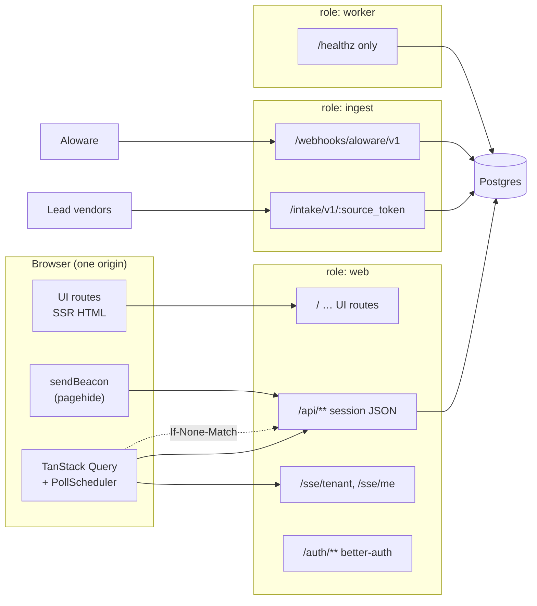
```mermaid
flowchart LR
  subgraph client["Browser (one origin)"]
    UI["UI routes<br/>SSR HTML"]
    Q["TanStack Query<br/>+ PollScheduler"]
    B["sendBeacon<br/>(pagehide)"]
  end
  subgraph web["role: web"]
    R1["/ …            UI routes"]
    R2["/api/**        session JSON"]
    R3["/sse/tenant, /sse/me"]
    R4["/auth/**       better-auth"]
  end
  subgraph ingest["role: ingest"]
    R5["/intake/v1/:source_token"]
    R6["/webhooks/aloware/v1"]
  end
  subgraph worker["role: worker"]
    R7["/healthz only"]
  end
  UI --> R1
  Q --> R2
  Q -. "If-None-Match" .-> R2
  Q --> R3
  B --> R2
  V["Lead vendors"] --> R5
  A["Aloware"] --> R6
  R2 --> PG[(Postgres)]
  R5 --> PG
  R6 --> PG
  R7 --> PG
```

| Family | Auth | Audience | Cache class | Process role |
|---|---|---|---|---|
| `/` and all UI paths | session cookie | owner | `private, no-store` | web |
| `/api/**` | session cookie | owner or tenant | `private, max-age=0, must-revalidate` + ETag | web |
| `/sse/tenant`, `/sse/me` | session cookie | tenant / owner | `no-store`, `X-Accel-Buffering: no`, compression off | web |
| `/auth/**` | better-auth | — | `private, no-store` | web |
| `/intake/v1/:source_token` | hashed source token in path | public-ingress | `no-store` | ingest |
| `/webhooks/aloware/v1` | provider credential | public-ingress | `no-store` | ingest |
| `/healthz`, `/readyz` | none | — | `no-store` | all |

**The fold is deployment configuration, per the owner's new requirement, and it is enforced rather than asserted.** Every endpoint declares a `role`. Each process reads `PROCESS_ROLES` (`web,worker,ingest` folded; `web` / `worker` / `ingest` split) and mounts only the matching families. Nothing else in the code knows the topology.

Three concrete consequences, because "it folds" is worth nothing without them:

- **No URL breaks when the topology changes.** In split mode the ingest routes are *also* mounted on the web process behind `INGEST_FALLBACK=on` (default). A vendor still posting to the web hostname is accepted, the lead is never lost, and each occurrence writes an `admin_alert` of kind `ingest_on_web` so the misrouting is visible instead of silently eating the bulkhead. The published vendor URL lives in `intake_source`, and token rotation-with-grace already exists to re-issue it.
- **The bulkhead is a hostname decision, not a code decision.** Which hostname vendors are given is what buys the isolated event loop (variants-v2: the 333 req/s retry storm, Puerta 2). Folding costs the bulkhead and nothing else; the register accepts that at Escalón 1 (2–3 sellers, no storm) and rejects it at Escalón 2.
- **CI runs the whole E2E suite in both topologies.** `TOPOLOGY=folded` and `TOPOLOGY=split` are a matrix axis on the nightly tier. The mechanical form of "separating later needs no redesign" is that the un-separated build is tested on every merge, forever — otherwise the fold rots the first week and nobody finds out until the day it is needed.

#### 2.2 Naming, versioning, verbs

- **`/api/**` is not versioned in the URL.** Client and server ship in one image from one repo; a version segment is cargo cult that costs a rename and buys nothing. The things that *are* versioned are the event payloads (`schema_version`, ARR-EVT-27) and the cursor codec.
- **The two externally-called surfaces are versioned**, because we cannot redeploy a lead vendor or Aloware: `/intake/v1/{source_token}` and `/webhooks/aloware/v1`.
- **Reads are nouns; commands are verbs on a resource.** `POST /api/opportunities/:id/move`, `/win`, `/reverse`. There is deliberately no `PATCH /api/opportunities/:id` that can set `stage_id` — ARR-MVP-09 and ARR-UX-03 require exactly one server transition, and a generic patch endpoint is the standard way that requirement dies. The mechanism is not the absence of a field in a Zod schema (that is a convention); it is `REVOKE UPDATE (stage_id, current_stage_type, stage_entered_at) ON app.opportunity FROM crm_app` (§9.3). A patch endpoint that grows a `stage_id` key gets `permission denied` from the engine.
- **No response envelope.** A read returns the resource, or `{ items, next_cursor }`. `{data, meta, errors}` wrappers cost bytes against the 25 KB gzip leaderboard budget (ARR-UX-10) and buy nothing with a single typed client. Errors are the only shaped body.

#### 2.3 The fourteen measured endpoints

ARR-UX-24 §3.4 names the endpoints k6 measures silo-scoped at 50 VUs. They are the registry's `measured: true` set:

`GET /api/board` · `GET /api/my-day` · `GET /api/contacts/:id` · `GET /api/contacts/:id/timeline` · `GET /api/search` · `GET /api/leaderboard` · `GET /api/notifications` · `POST /api/opportunities/:id/move` · `POST /api/opportunities/:id/win` · `POST /api/opportunities/:id/reverse` · `POST /api/calls` · `POST /api/messages` · `POST /api/activities` · `POST /api/notes`

Plus the four delta/health channels that carry the polling floor: `GET /api/board/since`, `GET /api/my-day/since`, `GET /api/leaderboard` (again, as the 5 s channel), `GET /api/integrations/aloware/health`.

---

### 3. Validation at the edge with Zod

ARR-EVT-01 requires one validation function at **every** ingress and rejection at the border rather than repair afterwards. There are six ingresses and they all funnel through the same primitives: HTTP commands, vendor ping-post, Aloware webhook, CSV import, the scheduler, and the outbox relay.

- **Strict by default, permissive by exception.** The house schema constructor is `obj()` = `z.object().strict()`. An ESLint rule bans bare `z.object(` outside `src/schema/primitives.ts`. Unknown keys therefore produce `400 unknown_parameter` everywhere — which is what makes "there is no `scope=global` query parameter" a fact rather than a hope (§8.4).
- **One named exception, and it is required by the register.** ARR-MVP-18 says an intake payload's unmapped extra keys must not cause a 400 or data loss. So `vendorPayload()` = `z.object().passthrough()`, and dependency-cruiser forbids importing it outside `src/intake/**`. The extra keys survive verbatim in `raw_payload_vault` regardless, because the vault write precedes parsing.
- **Money never crosses the border as a number.** Every monetary field is `z.string().regex(/^\d+$/).transform(toMoneyCents)` producing the branded `Money` type. `z.number()` on a monetary key is caught by the same CI test that fails on a plain `number`-typed money field (thesis non-negotiable 4d). JSON numbers above 2^53 and float coercion both die at the border rather than in the ledger.
- **Timestamps cross as epoch milliseconds** (`occurred_at_ms`, `recorded_at_ms`), never as ISO strings, because ARR-EVT-17's out-of-order threading and speed-to-lead need integer comparison and because an ISO string invites a timezone-bearing parse on the client (ARR-MVP-14 forbids implicit local time anywhere).
- **Output schemas are enforced in dev and CI on every endpoint, and in production on exactly one.** Response validation on 0.5 M daily responses is not free; validating in CI catches the failure it exists to catch (a leaked column). The production exception is the leaderboard payload, because ARR-EVT-23 makes it the only tenant-wide channel and a leaked lead field there is the worst single outcome in the product. Its type is generated from `leaderboard_projection`'s column list, so it cannot *express* a lead field — you cannot leak a column the projection does not contain — and it is re-validated on the wire anyway.
- **The 9-field envelope has one Zod definition** and the 49 event names are a Postgres enum from which the TypeScript union is generated (ARR-EVT-02). An event name outside the catalog fails at compile time on the emitting side and at the constraint on the writing side.

---

### 4. Pagination, filters, cursors

**Keyset only. `OFFSET` does not appear in this codebase.** ARR-UX-13's timeline is the deepest scroll in the product and `OFFSET` degrades linearly; `timeline_contact_idx` and `opportunity_board_idx` are both built as `(… , sort_key DESC, id DESC)` precisely so that keyset is an index range scan. Mechanism: an ESLint rule bans Drizzle's `.offset(` across `src/**`, with no exception list.

**Cursor format.** Base64url of `{v, k, f}`:

- `v` — cursor codec version. A deploy that changes a sort order changes `v`; an old cursor returns `400 cursor_version` and the client restarts the list. Without `v`, a shipped sort change makes old cursors silently skip or repeat rows.
- `k` — the sort tuple only, e.g. `[occurred_at_ms, id]`.
- `f` — a hash of the normalized filter set. If the client changes a filter and keeps the cursor, the server answers `400 cursor_filter_mismatch` instead of returning an incoherent page.

**A cursor never contains a tenant id, an owner id, a filter value or any predicate.** That is why it needs no signature: it is a *position*, not a capability. The mechanism is the type — `decodeCursor()` returns a branded `SortTuple`, the repository's `after` parameter is typed `SortTuple`, and there is nowhere to put an id. A CI test mints a cursor as Seller A, replays it as Seller B, and asserts B gets exactly the rows B would have got with no cursor at all.

**Filters are an enumerated, per-endpoint set of enums, ids and date ranges.** There is no generic filter grammar and no `where` parameter. A generic filter DSL is how an ownership predicate ends up outside the query plan, which ARR-UX-04 forbids, and it is the same class of mistake as a permission matrix in a product ARR-MVP-30 froze at three roles. Free text goes to `/api/search` and nowhere else.

**Caps.** `defaultLimit` and `maxLimit` per endpoint, in the registry, enforced centrally and tested automatically (§1.4). Board columns are `20` by ARR-UX-07 and the count and annualized sum arrive as aggregates in the same round trip, not as a second request per column.

---

### 5. ETag, conditional GET, and the `304` steady state

This is the mechanism that makes 5-second polling affordable, and it is the reason DoD-9's "no polling loop faster than 30 s" is amended rather than obeyed (see §10).

#### 5.1 The header trap that would have destroyed it

The instinctive header for a private API is `Cache-Control: private, no-store`. **`no-store` forbids the browser from storing the response, and a response the browser did not store cannot be revalidated — so there is no `If-None-Match` on the next poll and every poll is a full `200`.** The entire cost model of this product dies to one word, silently, with no error and a *worse* p95 that looks like normal growth.

Two permitted values, and only two, enumerated in one module:

| Class | Value | Used by |
|---|---|---|
| **Revalidatable** | `private, max-age=0, must-revalidate` + `ETag` + `Vary: Cookie` | every `GET /api/**` |
| **Non-storable** | `private, no-store` | all UI HTML, `/auth/**`, SSE, ingress, export links |

`private` is the directive that keeps shared caches out. `Vary: Cookie` is belt-and-braces and is explicitly **not** the mechanism — many intermediaries normalize or ignore `Vary`. Thesis non-negotiable 14 already permits both forms; this pins which is used where and why.

#### 5.2 ETag derivation

```
ETag: W/"<channel>:<seq>:<build_id>"
```

- `seq` comes from `channel_watermark` — one row per `(tenant_id, owner_user_id, channel)`, bumped inside the same transaction as the underlying write. The `304` path is therefore **one index-only primary-key lookup returning one bigint**, and the handler never runs.
- `build_id` is in the ETag because a deploy that changes a payload shape must invalidate every outstanding ETag. Without it, a client holds a `304` against a payload shape that no longer exists — permanent, invisible staleness that survives reloads and appears only as "some sellers see old fields". This is the same class of bug as the frozen-ETag failure the adversarial review found in the eliminated variant, arriving by a different door.
- **Weak (`W/`) on purpose.** The body is semantically identical but compression and key order need not be byte-identical, and a strong ETag would force us to guarantee something we do not control.
- **The leaderboard is the one custom derivation** and it is a genuine correctness trap: its public value is time-dependent, because entries younger than `app.undo_window()` are excluded, so the visible number changes with **no write**. A purely write-derived ETag would answer `304` while the board silently froze — the most expensive failure in the product. The ETag is `hash(max(seq), pending_watermark)` where `pending_watermark` is the max `recorded_at` inside the window or `0`. It changes exactly once more per win and is stable the rest of the time.

#### 5.3 Request pipeline

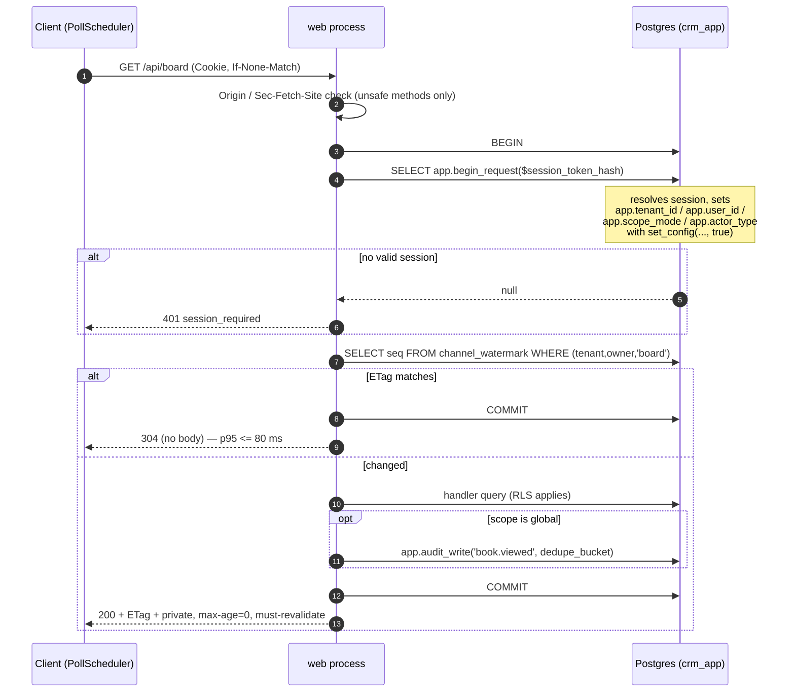
```mermaid
sequenceDiagram
  autonumber
  participant C as Client (PollScheduler)
  participant W as web process
  participant PG as Postgres (crm_app)
  C->>W: GET /api/board  (Cookie, If-None-Match)
  W->>W: Origin / Sec-Fetch-Site check (unsafe methods only)
  W->>PG: BEGIN
  W->>PG: SELECT app.begin_request($session_token_hash)
  Note over PG: resolves session, sets<br/>app.tenant_id / app.user_id /<br/>app.scope_mode / app.actor_type<br/>with set_config(..., true)
  alt no valid session
    PG-->>W: null
    W-->>C: 401 session_required
  end
  W->>PG: SELECT seq FROM channel_watermark WHERE (tenant,owner,'board')
  alt ETag matches
    W->>PG: COMMIT
    W-->>C: 304 (no body) — p95 <= 80 ms
  else changed
    W->>PG: handler query (RLS applies)
    opt scope is global
      W->>PG: app.audit_write('book.viewed', dedupe_bucket)
    end
    W->>PG: COMMIT
    W-->>C: 200 + ETag + private, max-age=0, must-revalidate
  end
```

Two index probes on the `304` path — the session row and the watermark row — inside one transaction. **There is deliberately no session cache**: an in-process cache would make revocation and `user.deactivated` eventually-consistent, and two index-only lookups on tables that live permanently in shared buffers are cheaper than the cache-invalidation machinery would be.

#### 5.4 Board deltas are a manifest, not a diff

`GET /api/board/since` returns the **full** `(opportunity_id, stage_id, current_stage_type, last_activity_at)` manifest for the seller's live cards — at 300 open opportunities that is roughly 18 KB, served index-only from `opportunity_board_idx`, and almost always a `304`.

A diff would require a change-log table and a retention window, and a missed diff drifts silently. A manifest cannot drift: it *is* the authoritative state. This is also what feeds thesis non-negotiable 7 — the client hard-corrects any card whose stage disagrees with the manifest **and raises a visible toast**, which is the only thing that converts "a coalesced move that never POSTed, i.e. a sale that was never recorded" from silent to noisy.

#### 5.5 The arithmetic, stated so it can be falsified

ARR-UX-09's corrected profile: notifications and leaderboard at 5 s, My Day and board deltas at 15 s, health at 30 s only while degraded. Over 50 sellers × 8 h that is order **0.5 M requests/day**, ~17 req/s sustained in the US window, of which ≥97 % must be `304`.

At an assumed 2 ms of process CPU per `304` (TLS terminated upstream, two index probes, no handler, no serialization), 17 req/s × 2 ms = **34 ms of CPU per wall second ≈ 7 % of a 0.5-CPU Starter instance**. That is the number that makes a 5-second poll compatible with USD 7/month of compute. It is an *assumption* until Puerta 2 measures it at 20 000 webhooks in 60 s with the polling floor running underneath, and it is the number to watch — if the real figure is 8 ms rather than 2 ms, the floor is 28 % of the instance and the next instance step (+USD 18) is still under the ceiling.

---

### 6. The prohibition on shared cache headers

> A cached response from one seller served to another is the worst leak in this file and it is invisible: the request never reaches Postgres, so RLS does not run, `FORCE ROW LEVEL SECURITY` is irrelevant, the repository is irrelevant, `SET LOCAL` is irrelevant — and the p95 *improves*. (adversary-v2 §3.A; thesis non-negotiable 14.)

This stack has none of the cost pressure that made that hazard likely in the eliminated variant, and the control is installed anyway, because "nobody would do that" is not a mechanism.

**Five layers, in the order they fire:**

1. **There is no call site.** Handlers return a plain value; they never construct a `Response` and never touch headers. The only place `Cache-Control` is written is `sealResponse()` in `src/http/response/**`. An ESLint rule bans the literal `Cache-Control`, `headers.set(` and `new Response(` outside that directory. A model that "adds caching to the polled endpoint" has nowhere to type it.
2. **The enum has no unsafe value.** `sealResponse()` selects from a two-value union derived from the endpoint's declared `audience`. There is no `public` member. Adding one is a PR that touches one file — the same shape as the RLS exception list, deliberately.
3. **Pre-merge CI walks the route registry** and fails the build if any response contains `public`, `s-maxage`, `proxy-revalidate`, `immutable` or `stale-while-revalidate`, or omits `private`, or carries any `access-control-*` header.
4. **The two-seller body test** (thesis 14b): the same authenticated URL is requested as two different sellers with seeded distinct books and the build fails if the two 200 bodies are byte-identical. This catches shared caching *and* a scope object that silently collapsed to a constant — one test, two failure modes.
5. **The assumption is measured, not trusted.** Render's proxy is believed not to cache, and a synthetic check from Better Stack fetches `/api/board` with two distinct session cookies from outside the perimeter and alerts if the bodies match or if an `Age` header appears. "Our platform does not cache" is exactly the kind of assumption this file exists to convert into a measurement.

**Corollary, easy to miss:** SSE responses must carry `no-store` **and** disable proxy buffering and response compression. A buffering proxy or a gzip stream turns a live SSE channel into a channel that delivers nothing while remaining perfectly open — and the `transport-in-use` metric will honestly report SSE (Puerta 3). Compression is disabled per-response for `text/event-stream`, asserted by a header test.

---

### 7. Authentication

#### 7.1 Cookie shape

better-auth 1.6.x, self-hosted in our Postgres with the Drizzle adapter, exact version pinned and its surface wrapped in `src/auth/**` (dependency-cruiser confines the import).

```
Set-Cookie: __Host-crm_session=<opaque>; HttpOnly; Secure; SameSite=Lax; Path=/; Max-Age=...
```

- **httpOnly is forced by ARR-UX-02**, not chosen: `sendBeacon` cannot set an `Authorization` header, so an in-memory bearer token cannot survive the pagehide flush. Cookie sessions are the requirement, not the preference.
- **`__Host-` prefix** forces `Secure`, `Path=/` and *no* `Domain`, which makes the cookie un-settable by any sibling subdomain. Asserted by a CI test on the literal `Set-Cookie` string.
- **`SameSite=Lax`, not `Strict`.** `Strict` withholds the cookie on a top-level cross-site GET, which breaks the notification deep-link path ARR-UX-04 requires to render the owner-scoped not-found for a foreign record — under `Strict` the seller lands on a login page instead, which is a support call and not a security gain, because CSRF is closed by §7.5 independently.
- **Opaque, hashed at rest.** The session table stores a hash; the cookie carries the secret. This matters specifically because the `auth` schema is on the RLS exception list (§7.2), so the compensating control is that a database read of that schema yields nothing usable.

#### 7.2 `app.begin_request()` — one statement, two jobs

Non-negotiable 10 requires that **every** unit of work be an explicit transaction whose *first* statement sets the three GUCs with `set_config(..., true)`. But the session must be resolved *before* we know the tenant — which is exactly why schema `auth` is on the versioned RLS exception list.

Naive resolutions are both wrong: doing the session lookup first breaks "first statement", and doing two transactions per request costs a round trip on the hottest path.

**Resolution:** `app.begin_request(session_token_hash bytea)` is a `SECURITY DEFINER` function that (a) resolves the session and its user, (b) calls `set_config` for `app.tenant_id`, `app.user_id`, `app.scope_mode` and `app.actor_type` itself, and (c) returns the resolved identity. It is the first statement of the work transaction. The invariant is preserved *and strengthened*: the application does not compute the context it then declares — the database derives it from a valid session or returns null.

`app.scope_mode` is derived server-side from `app_user.role` inside the function, never from a request header or query parameter, and `app.scope_is_global()` re-verifies the role against `app_user` on every policy evaluation rather than trusting the GUC (data-model §7).

`app.actor_type` is hard-coded to `'human'` by `begin_request()`. The job path uses `app.begin_job(actor_type)` whose TypeScript signature is `Exclude<ActorType, 'human'>` — **a job that claims to be human does not compile**, which is the request-layer half of ARR-MVP-08 (the other half is the `CHECK (to_stage_type <> 'earning' OR actor_type = 'human')` on `stage_transition`).

**Honest limitation, stated rather than papered over:** `EXECUTE` on `set_config()` is revoked from `PUBLIC` and granted only to `crm_migrator`, but Postgres does not gate the `SET LOCAL` *utility statement* on custom placeholder GUCs, so a hand-written `SET LOCAL app.user_id = …` by `crm_app` remains syntactically possible. The nets are therefore: (1) `src/db/` exports only `withTenant(ctx, fn)` and the pool object is module-private, enforced by dependency-cruiser; (2) an ESLint/grep gate fails the build on the literals `app.user_id`, `app.tenant_id`, `app.scope_mode` outside `src/db/context/**`. A signed-context GUC (an HMAC over tenant‖user‖scope‖txid, re-verified inside `app.current_tenant()`) would close it in the engine; it is specified as a **Sprint-0 measured option**, not adopted blind, because those functions are evaluated by RLS and the cost has to be measured against API p95 ≤ 300 ms before it is load-bearing.

#### 7.3 Session lifetime, and the write-amplification trap

| Setting | Value | Reason |
|---|---|---|
| Absolute lifetime | 16 h | Covers a US business day plus overtime (ARR-OPS-04); a session cannot outlive the day it was created in. |
| Idle timeout | 12 h | A seller logs in once a day and is never logged out mid-shift. |
| Renewal (`updateAge`) | **3600 s** | The trap. |

A sliding session that renews on every request means **0.5 M session-row UPDATEs per day** on the hottest path in the product — write amplification that turns the cheapest endpoint in the system into a write endpoint, bloats a table that sits in shared buffers, and shows up as p95 drift with no obvious cause. `updateAge=3600` caps it at ~8 writes per seller per day. Mechanism: the value is pinned in one config file and an integration test issues 200 polls and asserts at most one session UPDATE.

#### 7.4 Rotation and revocation

The session identifier is **rotated** (old row invalidated, new cookie issued) on: login, password change, role change, MFA enrolment or reset, and break-glass engage/end. Rotation on login is what closes session fixation; rotation on role change is what stops a supervisor-turned-seller from carrying a `tenant_read` scope in an old session — although `app.scope_is_global()`'s `EXISTS` re-read makes that harmless in the engine too, which is the point of having two.

Revocation is immediate because there is no session cache (§5.3). `user.deactivated` deletes the sessions in the same transaction as the deactivation.

#### 7.5 CSRF

Four layers, and the third one exists because of a collision that would otherwise have been "fixed" by exempting the most dangerous endpoint in the product.

1. **Safe methods are actually safe.** A `GET` handler cannot write, by type (§1.3). There is no state-changing GET to forge.
2. **Origin / `Sec-Fetch-Site` check on every unsafe method,** centrally in `defineEndpoint`, fail-closed: a request whose `Origin` does not equal the deployed origin, and which does not carry `Sec-Fetch-Site: same-origin`, is rejected `403 csrf_origin_rejected` before any record is resolved.
3. **The token travels in the header — except on the one beacon-capable endpoint, where it travels in the body.** `sendBeacon` cannot set `X-CSRF-Token`. Rather than exempt `POST /api/opportunities/:id/move` from CSRF (which is exactly what would happen under time pressure, on the endpoint that moves money), the endpoint declares `csrf: 'body'` and its Zod input schema carries a required `csrf` field. A CI test asserts that every endpoint with `beaconCapable: true` has `csrf: 'body'` and a `csrf` key in its input schema, and that no other endpoint accepts a body token.
4. **`SameSite=Lax`** is the fourth belt; it is not the mechanism, because `Lax` still permits top-level cross-site POSTs in some legacy clients.

**Dev-environment trap, named because it will be hit:** the beacon posts `application/json`, which is *not* a CORS-safelisted content type. Same-origin requests are not subject to CORS so this is fine in production — but a dev setup with Vite on `:5173` and the API on `:3000` makes it cross-origin, the preflight fails, `sendBeacon` cannot preflight, and the flush silently does nothing. Mechanism: the Vite dev server proxies `/api` and `/auth` so dev and prod are one origin, and a startup assertion fails if `new URL(apiBase).origin !== location.origin`.

**CORS on `/api/**` does not exist.** There is no browser client on another origin. An ESLint rule bans `Access-Control-Allow-` anywhere in the repository, and the registry cache test asserts no `access-control-*` header on any response.

#### 7.6 MFA

TOTP is available to every user and **required for the `tenant_admin` scope**, because the admin command set can void ledger rows, transfer ownership and engage break-glass. `defineEndpoint` makes `mfa` non-optional for `scope: 'tenant_admin'`; the admin handler context type has a `mfaVerified: true` field, so an admin endpoint that skipped MFA does not compile; a registry test asserts every admin route declares `mfa: 'required'`.

**Consequence Jorge must ratify, and it follows directly from the no-email decision:** there is no self-service password reset and no self-service MFA reset. An admin who loses their authenticator is locked out. Mitigations: recovery codes issued once at enrolment, at least two admin accounts, and a documented `crm_migrator` SQL runbook that clears a factor and writes an audit row. With 50 users and one operator this is operable; it is a product decision, not a technical detail.

#### 7.7 What deliberately does not exist

Absence is the guarantee (ARR-MVP-30):

- No self-signup, no SSO, no OAuth, no password reset email, no invitation flow.
- No role builder, no permission table, no per-user toggles. `app.user_role` is a three-label Postgres enum and a CI test asserts `enum_range` has exactly three labels.
- **No machine API tokens.** ARR-MVP-08 lists "API token" among the non-human origins that must be refused an earning transition; the cleanest way to satisfy that is for the credential class not to exist. The only non-session credentials in the system are `intake_source.token_hash` (write-only, into intake) and the Aloware webhook credential.
- No unauthenticated data surface at all (ARR-PRV-06): no kiosk route, no public leaderboard URL, no share links. `/healthz` returns a literal and touches no tenant data.

---

### 8. Permissions

#### 8.1 Three scopes, not a matrix

Authorization is one enumerated scope modifier applied inside the data layer, exactly as ARR-MVP-30 requires:

| `app.scope_mode` | Who | Read | Write |
|---|---|---|---|
| `owner` | seller | own rows only | own rows only |
| `tenant_read` | supervisor | tenant-wide, same queries with the ownership filter lifted by `app.scope_is_global()` | **nothing** in any seller's book |
| `tenant_admin` | admin | tenant-wide, same queries | **nothing** in any seller's book — only the enumerated admin command set, all through `SECURITY DEFINER` functions |
| `system` | jobs, relay, purge | four enumerated cross-tenant definer functions | via definer functions only |

The critical and slightly counter-intuitive ruling: **an admin is not a super-seller.** The `WITH CHECK` clause on every owner-scoped table is `tenant_id = app.current_tenant() AND owner_user_id = app.current_user_id()` with no admin escape hatch — so an admin attempting to write another seller's contact, note, activity, card or call gets SQLSTATE 42501, exactly like a supervisor. This is not extra work; it is the policy the data model already generates. It closes a genuine hole: an admin drag into an earning stage would otherwise pass ARR-MVP-08's human-only check while crediting money to a seller who did not earn it. Admin power flows only through named definer functions that write their own audit rows.

#### 8.2 The complete role × action × module matrix

Legend: **own** = permitted inside the caller's own silo · **R\*** = global read over the same query, ownership filter lifted, writes a `book.viewed` audit row · **403** = visible but write refused (`supervisor_read_only` / `admin_cannot_write_seller_records`, SQLSTATE 42501) · **404** = owner-scoped not-found, byte-identical to a genuine 404 · **—** = the surface does not exist for that role · **admin** = permitted only through the named `SECURITY DEFINER` command.

| Module | Action | Seller | Supervisor | Admin | Enforced by |
|---|---|---|---|---|---|
| **1 Lead Intake** | receive ping-post `POST /intake/v1/:token` | (token, not a role) | — | — | `app.resolve_intake_token()`, cross-tenant definer |
| | quick-add lead manually | own | 403 | 403 | RLS `WITH CHECK` |
| | create / rotate / revoke intake source | 404 | 404 | admin | route scope + `tenant_admin_only` policy |
| | read intake error log (`parse_status <> 'parsed'`) | 404 | 404 | admin | `tenant_admin_only` policy on `raw_payload_vault` |
| | promote / dismiss unmapped inbound quarantine | 404 | 404 | admin | `tenant_admin_only` policy |
| | transfer ownership of a record | 404 | 404 | admin | `app.transfer_ownership()`; `REVOKE UPDATE (owner_user_id)` |
| **2 Pipeline** | read board / card | own | R\* | R\* | `app.scope_is_global()` in `USING` |
| | move card open→open | own | 403 | 403 | `app.stage_move()` + RLS `WITH CHECK` |
| | win gate (→ earning) | own | 403 | 403 | `CHECK (current_stage_type <> 'earning' OR premium_annual_cents IS NOT NULL)` |
| | lost gate (→ lost) | own | 403 | 403 | `CHECK (… OR lost_reason_id IS NOT NULL)` |
| | reverse inside undo window | own | 403 | 403 | `app.ledger_append(entry_type='reversal')` |
| | edit premium after close | own | 403 | 403 | `REVOKE UPDATE (premium_*)`; only `app.set_premium()` |
| | configure own stages / rename | own | 403 | 403 | RLS `WITH CHECK`; `stage_type` immutable by trigger |
| | edit stage template | 404 | 404 | admin | `tenant_scoped` policy, admin write |
| **3 Contacts 360** | read contact + unified timeline | own | R\* | R\* | `scope_is_global` |
| | edit contact fields | own | 403 | 403 | RLS `WITH CHECK` |
| | create / edit note (`If-Match`) | own | 403 | 403 | note `version` trigger + RLS |
| | flag bad number | own | 403 | 403 | RLS |
| | update consent (sole authority) | own | 403 | 403 | `app.consent_append()`, definer |
| | same-owner merge | own | 403 | 403 | definer; appends two reversing ledger rows |
| | CCPA redaction / erasure | 404 | 404 | admin | definer; `crm_app` has no DELETE anywhere |
| **4 Calendar** | read meetings | own | R\* | R\* | `scope_is_global` |
| | schedule / reschedule / cancel | own | 403 | 403 | RLS `WITH CHECK` |
| | record outcome (held / no-show / …) | own | 403 | 403 | RLS `WITH CHECK` |
| **5 Activities & My Day** | read **My Day** | own | own | own | policy has **no** global widening on this surface |
| | create / complete / cancel activity | own | 403 | 403 | RLS `WITH CHECK` |
| | see a seller's activities in context | — | R\* (board, timeline) | R\* | `scope_is_global` |
| **6 Communications** | dial (`POST /api/calls`) | own | 403 | 403 | one compliance gate + RLS; button not rendered |
| | send SMS | own | 403 | 403 | same gate; `tenant.sms_enabled` inside the gate |
| | read conversation / messages | own | R\* | R\* | `scope_is_global` |
| | after-call wrap-up | own | 403 | 403 | RLS `WITH CHECK` |
| | read own Aloware number mapping status | own row, tenant-readable | R | R | `tenant_scoped` read (a seller must see why Call is off) |
| | create / verify / revoke number mapping | 404 | 404 | admin | `tenant_scoped`, admin write |
| | webhook ingest | (provider) | — | — | ingest role, `app.webhook_ingest()` definer |
| **7 Earnings & Leaderboard** | read public leaderboard | all | all (no self-row) | all (no self-row) | **sanctioned cross-silo #1**: `leaderboard_projection`, `USING (tenant) WITH CHECK (false)` |
| | read own ledger (My Earnings) | own | — (no book) | — (no book) | `append_only_owner` |
| | read a seller's ledger | 404 | R\* | R\* | `scope_is_global` on `earnings_ledger` |
| | void / adjust with reason | 404 | 404 | admin | `app.ledger_append(entry_type='manual_adjustment')` |
| | UPDATE or DELETE a ledger row | **never** | **never** | **never** | statement trigger `AP001` + `REVOKE`, fires for every role including the provider SQL console |
| **8 Automations (scheduled)** | any seller-facing automation write | — | — | — | the surface does not exist in the MVP |
| | reminder kill switch | 404 | 404 | admin | `tenant` table, admin write |
| | read scheduled-job status / terminal reasons | 404 | 404 | admin | `tenant_admin_only` |
| **9 Priority / Call Next** | read the work queue | own | own | own | owner-scoped; it is a working surface, not a report |
| **10 Reporting** | read metric tiles | own | R\* | R\* | same queries, filter lifted — no separate report endpoints |
| | export own book | own | — | — | `export_job scope='own'` |
| | export supervisor scope | 404 | own (masking forced) | own | `CHECK (scope <> 'supervisor' OR masking_applied)` |
| | export tenant-wide | 404 | 404 | admin | `CHECK (scope <> 'tenant' OR reason IS NOT NULL)` |
| **11 Notifications** | read own inbox / mark read | own | own | own | owner-scoped **without** the global widening — a supervisor has no business in a seller's inbox |
| | celebration broadcast | (server) | — | — | emitted server-side after the undo window and after re-checking for a reversal |
| **12 Administration & Audit** | create / deactivate user, set role | 404 | 404 | admin + MFA | `app.set_role()`; `REVOKE UPDATE (role)` |
| | tenant flags, cold thresholds, `sms_enabled` | 404 | 404 | admin + MFA | `tenant` policy `WITH CHECK … AND app.scope_is_admin()` |
| | break-glass engage / end | 404 | 404 | admin + MFA | `break_glass_override`; single-value scope enum |
| | see the break-glass banner | all | all | all | `tenant_scoped` read — the amber banner must reach everyone |
| | read audit log | 404 | 404 | admin | `append_only_tenant_admin`, `WITH CHECK (false)` |
| | DLQ read / replay | 404 | 404 | admin | `tenant_admin_only`; replay is a definer function |
| | integration health panel | 404 | 404 | admin | `tenant_admin_only` over tables we already own |
| | verified-restore age, archive manifest | 404 | 404 | admin | `tenant_admin_only`, immutable |

Two notes that are easy to get wrong and are therefore written down: **My Day and Notifications are never widened for supervisors** — global visibility lives on the read-scoped board and the contact timeline, never on a seller's personal queue (04-ux-flows, "My Day shows the supervisor's own items"). And **the supervisor gets no self-row on the leaderboard**; the header shows the tenant total for the selected period instead.

#### 8.3 The single status-code matrix (Puerta 12)

| # | Caller | Route class | Target | Status | `error` code | Produced by |
|---|---|---|---|---|---|---|
| 1 | unauthenticated | `/api/**` | — | **401** | `session_required` | `defineEndpoint` guard |
| 2 | unauthenticated | UI route | — | **302 → /login?next=** | — | root route |
| 3 | seller | any | own row | **200 / 201 / 204** | — | handler |
| 4 | seller | any read | another seller's row | **404** | frozen not-found | RLS returns zero rows |
| 5 | seller | any write | another seller's row | **404** | frozen not-found | RLS returns zero rows on the pre-read |
| 6 | seller | admin-only route | any | **404** | frozen not-found | route `scope` guard — the rule extends from records to **routes** |
| 7 | supervisor | read | seller row | **200** + `book.viewed` | — | `app.scope_is_global()` |
| 8 | supervisor | write | seller row | **403** | `supervisor_read_only` | SQLSTATE **42501** from `WITH CHECK` |
| 9 | supervisor | admin-only route | any | **404** | frozen not-found | route `scope` guard |
| 10 | admin | read | any row in tenant | **200** + `book.viewed` | — | `scope_is_global()` |
| 11 | admin | write | another seller's owned row | **403** | `admin_cannot_write_seller_records` | SQLSTATE **42501** |
| 12 | admin | admin command | — | **200** | — | definer function; MFA required |
| 13 | any | any | cross-tenant id | **404** | frozen not-found | RLS |
| 14 | any | `PATCH /api/notes/:id` | stale `If-Match` | **412** | `version_conflict` | note `version` trigger |
| 15 | seller | move → earning, no premium | own | **422** | `premium_required` | `CHECK` on `opportunity` |
| 16 | seller | move → lost, no reason | own | **422** | `loss_reason_required` | `CHECK` on `opportunity` |
| 17 | non-human actor | move → earning | any | **422** + `admin_alert` | `actor_must_be_human` | `CHECK` on `stage_transition` |
| 18 | seller | dial / SMS refused by gate | own | **422** + verdict object | `blocked_<reason>` | the one compliance gate |
| 19 | seller | gate lookup errors | own | **503** | `compliance_check_failed` | fail-closed |
| 20 | seller | replayed `client_move_key` | own | **200** (first result) | — | `UNIQUE … WHERE client_move_key IS NOT NULL` |
| 21 | seller | replayed `source_event_id` on win | own | **200** (unchanged total) | — | `UNIQUE (tenant_id, source_event_id)`; success path, logged |
| 22 | vendor | unknown / revoked / malformed token | — | **401** | `unauthorized` — nothing written | `app.resolve_intake_token()` |
| 23 | vendor | valid token, no phone or email | — | **422** | `phone_or_email_required` — raw body **still persisted** | vault write precedes token-scoped logic |
| 24 | vendor | duplicate inside the window | — | **200** | `duplicate_ignored` | `UNIQUE (tenant, source, dedupe_key, dedupe_bucket)` |
| 25 | vendor | over per-token rate limit | — | **429** + `Retry-After` | `rate_limited` | `intake_source.rate_limit_per_minute` |
| 26 | seller | cross-silo suppression lookup over cap | — | **429** + `admin_alert` | `lookup_rate_limited` | `tenant_lookup_meter` inside the definer |
| 27 | any | ledger append refused by engine | own | **500** | `sale_not_recorded` → *"Couldn't record this sale — nothing was saved. Try again."* | `AP001` trigger / `REVOKE` |
| 28 | any | pollable GET, unchanged | — | **304**, no body | — | watermark ETag |
| 29 | any | unknown query param or body key | — | **400** | `unknown_parameter` | Zod `.strict()` |
| 30 | any | cursor version / filter mismatch | — | **400** | `cursor_version` / `cursor_filter_mismatch` | cursor codec |
| 31 | any | unsafe method, bad or missing Origin | — | **403** | `csrf_origin_rejected` | central guard, before any record is resolved |
| 32 | admin | admin route without verified MFA | — | **403** | `mfa_required` | route guard |

**Refinement of thesis non-negotiable 15, stated explicitly rather than widened silently.** That rule says 403 exists for exactly one case. It is actually two *classes*, and both are safe for the same reason:

- **(a) role-on-visible-record write** (rows 8, 11) — the caller could already read the row, so the 403 leaks nothing new;
- **(b) request-level rejections that fire before any record is resolved** (rows 31, 32) — no record was looked at, so no record's existence can be inferred.

The prohibition is unchanged where it matters: **a 403 may never be the answer to "does this record exist?"**

**The timing side channel is closed by construction.** A genuine 404 (row absent) and an owner-scoped not-found (row present, filtered by RLS) are the *same query returning zero rows* against the same index — the response times are indistinguishable because the work is identical, not because we padded it.

#### 8.4 The denial mechanism: handlers cannot express a 403

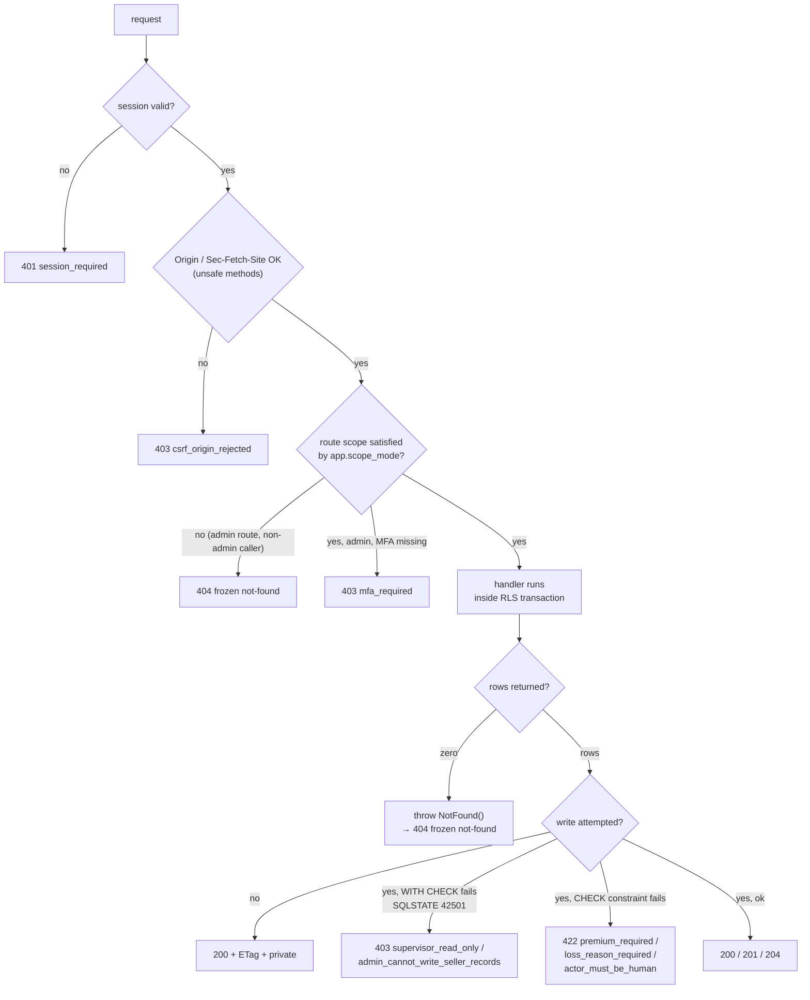
```mermaid
flowchart TD
  A["request"] --> B{"session valid?"}
  B -- no --> B1["401 session_required"]
  B -- yes --> C{"Origin / Sec-Fetch-Site OK<br/>(unsafe methods)"}
  C -- no --> C1["403 csrf_origin_rejected"]
  C -- yes --> D{"route scope satisfied<br/>by app.scope_mode?"}
  D -- "no (admin route, non-admin caller)" --> D1["404 frozen not-found"]
  D -- "yes, admin, MFA missing" --> D2["403 mfa_required"]
  D -- yes --> E["handler runs<br/>inside RLS transaction"]
  E --> F{"rows returned?"}
  F -- "zero" --> F1["throw NotFound()<br/>→ 404 frozen not-found"]
  F -- "rows" --> G{"write attempted?"}
  G -- no --> G1["200 + ETag + private"]
  G -- "yes, WITH CHECK fails<br/>SQLSTATE 42501" --> G2["403 supervisor_read_only /<br/>admin_cannot_write_seller_records"]
  G -- "yes, CHECK constraint fails" --> G3["422 premium_required /<br/>loss_reason_required /<br/>actor_must_be_human"]
  G -- "yes, ok" --> G4["200 / 201 / 204"]
```

Handlers never build responses. They return a value or throw from one error union. **The `Forbidden` constructor is not exported to handler code at all** — `SupervisorReadOnly` and `AdminCannotWriteSellerRecords` are module-private and are constructed only by `src/db/translate-sqlstate.ts`, which dependency-cruiser confines to `src/db/**`.

That is the whole guarantee, and it is worth stating plainly: **a 403 in this system can only originate from an actual policy violation on a row the caller was already permitted to read.** It is structurally impossible for a handler to hand-write a 403 and thereby confirm that a record exists. The only "you can't have this" a handler can express is `NotFound()`, whose body is a frozen constant with no id echo, no timestamp and no trace id (the trace id is a response *header* present on every response uniformly, so its presence carries no signal).

---

### 9. Making scoping impossible to forget in a new query

#### 9.1 What is already load-bearing (from the data-model section, restated as an API contract)

1. `FORCE ROW LEVEL SECURITY` on every relation in `app` and `ref`, with policies **generated** by `security.harden()` from `security.table_registry`. There is no place to write a policy, so there is no place to write a USING-only policy.
2. `harden()` is the last statement of the pre-deploy migration job and raises on any unclassified relation, so a migration that adds a table without classifying it **fails the deploy** — stronger than a CI check, because CI can be amended and a deploy that will not proceed cannot.
3. The application connects as `crm_app`, which owns nothing; the boot assertion refuses to start if the connection user is the schema owner or holds `rolsuper`/`rolbypassrls`.
4. Missing context yields **zero rows, not an error** — `app.current_tenant()` returns NULL, `tenant_id = NULL` is NULL, the policy denies. A query that escapes the wrapper returns nothing, in all five execution contexts.
5. `crm_app` has SELECT on no base table carrying `deleted_at`; it reads `*_live` views declared `WITH (security_invoker = true)` that hard-code `deleted_at IS NULL`. **A query that "forgets the filter" has nothing to query.**

The API layer adds two things: the **route registry** (§1.4), which makes ARR-MVP-02's per-endpoint silo test automatic rather than remembered, and the column-level revocations below.

#### 9.2 `REVOKE SELECT` on base tables + `security_barrier` views or scope-argument functions — evaluated, and mostly rejected

The brief asks this question directly, so here is the direct answer, with the cost.

**Rejected in its general form** (revoke SELECT everywhere, grant only on barrier views or on functions that take the scope as an argument), for four reasons specific to this schema:

1. **`security_barrier` defeats predicate pushdown, and our hottest reads are exactly the ones it would hurt.** A barrier view forces its own quals to be evaluated before any non-`LEAKPROOF` user qual. The board read is a keyset range scan on `opportunity_board_idx` with `ORDER BY stage_entered_at DESC LIMIT 20` **per column**, with `INCLUDE (premium_annual_cents, …)` so the per-column sum is index-only. Behind a barrier view the planner can be forced to materialize far more than 20 rows per column before the caller's predicate applies. That attacks P1/P7 — API p95 ≤ 300 ms, silo-scoped — which is a build-breaking budget. This is precisely why the design uses **`security_invoker` views** (PG 15+): RLS is applied as the caller, the caller's quals inline, and the plan is the same plan as against the base table.
2. **A function that receives the scope as an argument is strictly weaker than RLS, not stronger.** An argument is a thing a call site can get wrong; the GUC is read by the policy itself and cannot be omitted. Moving scope from a session fact to a call parameter reintroduces exactly the "someone forgets" surface that `FORCE` removes — it is the repository pattern with extra steps and one more place to be wrong.
3. **Drizzle tolerates it, at a real and enumerable cost.** Drizzle is a query builder over a relation object, so pointing it at a view is mechanical (`pgView`) and read-side ergonomics are unchanged. The costs: (a) **reads and writes target different relations**, so every repository grows a read model and a write model — bounded, and we already have that shape for the seven definer-written tables; (b) **`INSERT … RETURNING` requires SELECT privilege on the returned columns**, so revoking SELECT on a base table breaks `.returning()`, which Drizzle uses everywhere and which we rely on for `DEFAULT uuidv7()` ids. The workaround is to mint uuidv7 in the application and never call `.returning()` on those tables — legal (uuidv7 is time-ordered wherever it is generated) but it is a second id-generation path, which is a new invariant to police.
4. **Full adoption doubles the relation surface with a hand-maintained artifact** — the exact anti-pattern named in thesis non-negotiable 2, where the mechanism that exists to avoid hand-maintenance requires hand-maintenance.

**Adopted, in the targeted form, and generated rather than maintained.** `security.harden()` already generates policies and GRANTs from `security.table_registry`; it is extended to generate the `*_live` view and the GRANT set from two registry columns (`app_can_select_base boolean`, `live_view boolean`). The strong form is then applied only where it buys something RLS cannot give:

- **soft-delete filtering** — every table with `deleted_at`: base SELECT revoked, `*_live` view granted (already in the design);
- **column hiding** — `intake_source.token_hash` is not in the readable view, so `crm_app` cannot read it even by accident;
- **definer-only tables** — `consent_ledger`, `suppression_list`, `tenant_lookup_meter`: no SELECT at all, reachable only through `app.compliance_check()` / `app.consent_state()`, which return a verdict enum and a reason code and never a row. This is what closes the cross-silo privacy oracle at the privilege level.

For every other table, base-table SELECT under `FORCE` RLS stays: the marginal security is zero and the p95 cost is not.

#### 9.3 Column-level `REVOKE UPDATE` — adopted, and it is the cheapest new mechanism in this section

Postgres has column-level privileges and this design has not been using them. Four rulings that are otherwise "the service layer is the only writer" — a convention — become `permission denied`:

| Revocation | Turns which convention into a privilege fact | Register |
|---|---|---|
| `REVOKE UPDATE (stage_id, current_stage_type, stage_entered_at) ON app.opportunity` | "exactly one server-side stage-transition service"; kills any generic `PATCH` that can move a card | ARR-MVP-09, ARR-UX-03 |
| `REVOKE UPDATE (premium_monthly_cents, premium_annual_cents, premium_mode) ON app.opportunity` | **the single most-forgotten link in the money chain** — an `UPDATE opportunity SET premium…` that forgets the `value_correction` ledger row is refused by the engine; only `app.set_premium()` can write it, and it appends inside the same transaction | ARR-EVT-07, ARR-MVP-07 |
| `REVOKE UPDATE (owner_user_id) ON app.contact, opportunity, activity, note, meeting, conversation, message, call, contact_phone` | "ownership transfer is one transaction and writes an audit row" — only `app.transfer_ownership()` can move a record, and money never moves with it | ARR-MVP-22 |
| `REVOKE UPDATE (role) ON app.app_user` | "role changes are audited" — only `app.set_role()`, which rotates the sessions in the same transaction | ARR-MVP-21, ARR-MVP-30 |

Registered as `immutable_columns text[]` in `security.table_registry`, re-applied by `harden()` on every deploy and on every new partition, and asserted by a CI query over `information_schema.column_privileges` — the same shape as the existing `pg_class`/`pg_policies` gates, so it inherits four nets rather than needing new ones.

---

### 10. The one table of numbers that goes to CI (Puerta 12)

Phase 5 publishes one set and declares what moved. Where two prior documents disagreed, the tighter number wins and the looser one is recorded as superseded.

| Budget | Value | Was | Ruling |
|---|---|---|---|
| API p95, the fourteen endpoints, silo-scoped, k6 60 s × 50 VUs | **≤ 300 ms** | DoD-9 said 400 ms | Phase-4 number wins; DoD-9 amended |
| Conditional-GET `304` p95 | **≤ 80 ms** | — | unchanged; this is the cost model |
| Global search server p95 (fixture: 50 sellers / 25 k contacts / 200 k activities) | **≤ 200 ms** | US-LCP-08 said 500 ms end-to-end | 200 ms server, 500 ms end-to-end is a consequence not a budget |
| Dial tap → server verdict p95 | **≤ 300 ms** | — | the gate is synchronous, never queued |
| Optimistic repaint before round trip | **≤ 100 ms** | — | unchanged |
| Leaderboard payload, 50 sellers | **≤ 25 KB gzip** | — | unchanged |
| **Leaderboard visible-credit latency, honest** | **SSE: ~5.5–6 s p95 · polling fallback: up to ~10.5 s** | ARR-EVT-24 said "p95 < 2 s to every client" | **Restated per channel.** ARR-MVP-10 excludes ledger entries younger than `undo_window_ms + undo_projection_guard_ms` = 5.5 s. No transport can beat an exclusion window. The 2 s budget survives only for **live call state**, where SSE meets it. |
| Polling floor | **5 s leaderboard + notifications; 15 s My Day + board deltas; 30 s health while degraded** | DoD-9 said "no loop faster than 30 s" | **DoD-9 amended.** The 5 s loop is the one sanctioned exception, and it is sanctioned because the `304` path is two index probes (§5.5), which is DoD-9's underlying intent satisfied at 5 s. |
| Initial JS / CSS on the pipeline route | **deferred to Puerta 8 measurement** | ARR-UX-08 said 250 KB / 60 KB gzip; ARR-MVP-25 says interactive ≤ 2.0 s on Slow-4G at 4× CPU | The ARR proved these are **mutually unsatisfiable**: 250 KB at Slow-4G is ~1.25 s of transfer plus 0.9–1.2 s of parse ≈ TTI 2.4–3.0 s. One of the two moves and Puerta 8's measurement — not the aspiration — sets the number that goes to CI. |

---

### 11. Open questions this section raises

1. **Signed session context.** The HMAC-over-GUC hardening in §7.2 closes the last hand-written-`SET LOCAL` gap in the engine rather than in a lint rule, but `app.current_tenant()` is evaluated by RLS. It must be measured against API p95 ≤ 300 ms in Sprint 0 before it becomes load-bearing. If the cost is material, the lint gates stand alone and that is recorded as an accepted residual.
2. **Admin MFA lockout.** No transactional email means no self-service reset. Recovery codes plus two admin accounts plus a `crm_migrator` runbook is the proposed answer; Jorge must ratify it as a product decision.
3. **`INGEST_FALLBACK` default.** Mounting ingest routes on the web process by default guarantees no lead is ever lost to a stale vendor URL, and partially dissolves the bulkhead if a vendor never migrates. Default `on` with an `admin_alert` per occurrence is proposed; the alternative (a 308 redirect) is cleaner but relies on vendor HTTP clients following redirects on POST, which is not safe to assume for FE lead vendors.
4. **`book.viewed` bucket width.** Five minutes via `INSERT … ON CONFLICT DO NOTHING` on `(tenant, action, actor, subject, dedupe_bucket)` keeps a supervisor's global read inside API p95. A shorter bucket is more faithful to CCPA hygiene and more expensive; confirm five minutes satisfies the intent.
5. **SSE connection cap per user.** One connection per tab means a seller with five tabs holds five. At 50 sellers × 3 tabs that is 150 connections on a 512 MB Starter. Proposed: cap per user, reject beyond it with `429` and let the client fall back to polling — which is the declared fallback anyway. The cap number is a Puerta 3 measurement, not a guess.
6. **Supervisor global search.** There is exactly one search handler and no `scope` parameter, so a seller has no lever to reach the global path — but P7 also fails an index that only serves the supervisor's global read. Both properties must be asserted in the same k6 run: `(tenant_id, owner_user_id, …)`-led indexes measured seller-scoped, and the supervisor path measured on the same indexes with the filter lifted.
7. **The 401-versus-404 boundary for anonymous callers.** An unauthenticated request to an admin route returns `401`, which reveals that the route exists. That is deliberate — the client needs `401` to redirect, and route existence is not record existence — but it should be ratified rather than assumed, because it is the one place the never-403/never-confirm rule is relaxed by design.


---

# Part IV — Security and Personal-Data Protection

## Security and Personal-Data Protection

> **Scope of this section.** Not a generic hardening checklist. This is the security posture of *this* system: a single-tenant, silo-partitioned CRM holding the personally identifiable information of US consumers who were sold as Final Expense leads, dialing them under TCPA, operating three co-deployed Node processes against one managed Postgres, with **no human code reviewer anywhere in the loop**. Every control below is anchored to a requirement id from the ARR and every rule carries the mechanism that enforces it. A rule without a mechanism is not in this document.

---

### SEC-0 · The threat model, ranked, and the primary adversary

There are exactly four security catastrophes this product can suffer. Ranked by expected cost, not by how exciting they sound:

| # | Catastrophe | Why it is first-order here | Governing requirements |
|---|---|---|---|
| **1** | **Cross-silo leak** — one seller reads another seller's book | Fifty sellers, one tenant, one database. In an insurance context a leaked Final Expense book *is* a PII incident with named consumers, phone numbers, health-adjacent product interest and premium amounts. The corpus states it plainly: enforce isolation in components instead of the data layer and "the first API endpoint someone adds leaks another seller's Final Expense leads". | ARR-MVP-01, ARR-MVP-02, ARR-PRV-04, ARR-EVT-05 |
| **2** | **A TCPA violation with an audit trail proving intent** | We keep an append-only log of every dial. If the product ever lets a seller dial at 8:40 PM lead-local behind a checkbox, we have not built a compliance feature — we have built the plaintiff's exhibit. This is precisely why R3.1 overruled the amber-attestation design. | ARR-CMP-01, ARR-CMP-02, ARR-CMP-04, R3.1 |
| **3** | **Insider exfiltration** — a departing agent exports the book | Named in the corpus as the catastrophic scenario that makes exports a *security control, not a convenience log*. | ARR-PRV-05 |
| **4** | **Mutation or loss of the immutable core** | `earnings_ledger` has no recompute job by design; `consent_ledger` and `suppression_list` are the evidentiary record of what we were permitted to do. Covered in the ledger section; referenced here because the same append-only mechanisms are the security controls. | ARR-MVP-07, ARR-PRV-03, ARR-CMP-07 |

**The primary adversary is our own code generator.** This is the single most important sentence in this section and it drives every design choice below. In descending order of realistic likelihood the threat actors are:

1. **The model writing the code.** It will write `.onConflictDoUpdate()` on the ledger because that is the public idiom of upsert. It will write a `FOR SELECT` RLS policy because that is what every tutorial shows. It will `console.log(req.body)` while debugging a webhook. It will add an `owner_user_id` parameter to a route handler. Jorge validates by behaviour, not by reading diffs — so **every control in this section must fail loudly and visibly, or it does not exist.**
2. **A seller with valid credentials** who is curious about a colleague's pipeline, or who wants to know whether the agency already worked a household.
3. **A lead vendor holding a valid intake token** posting malformed, oversized, replayed or hostile payloads (ARR-INT-12).
4. **A departing seller** with legitimate read access to their own book and a browser.
5. **Opportunistic internet scanning** of the two unauthenticated POST routes.

Note who is *not* on this list: a sophisticated external attacker doing memory forensics on the managed Postgres volume. Controls that defend against #5-and-below while making #1 harder to catch are net negative and are explicitly rejected below (see SEC-5, application-level field encryption).

#### D-SEC-1 — Trust boundaries and the entire external attack surface

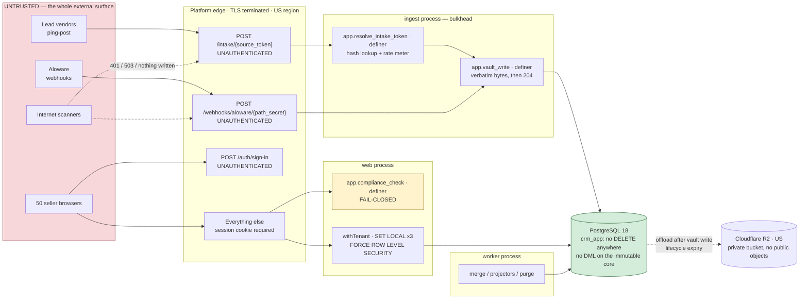
```mermaid
flowchart LR
  subgraph UNTRUSTED["UNTRUSTED — the whole external surface"]
    V["Lead vendors<br/>ping-post"]
    AL["Aloware<br/>webhooks"]
    BR["50 seller browsers"]
    NET["Internet scanners"]
  end

  subgraph EDGE["Platform edge · TLS terminated · US region"]
    I1["POST /intake/{source_token}<br/>UNAUTHENTICATED"]
    I2["POST /webhooks/aloware/{path_secret}<br/>UNAUTHENTICATED"]
    I3["POST /auth/sign-in<br/>UNAUTHENTICATED"]
    APP["Everything else<br/>session cookie required"]
  end

  subgraph INGEST["ingest process — bulkhead"]
    VAULT["app.vault_write · definer<br/>verbatim bytes, then 204"]
    TOK["app.resolve_intake_token · definer<br/>hash lookup + rate meter"]
  end

  subgraph WEB["web process"]
    GATE["app.compliance_check · definer<br/>FAIL-CLOSED"]
    RLS["withTenant · SET LOCAL x3<br/>FORCE ROW LEVEL SECURITY"]
  end

  subgraph WORKER["worker process"]
    MERGE["merge / projectors / purge"]
  end

  DB[("PostgreSQL 18<br/>crm_app: no DELETE anywhere<br/>no DML on the immutable core")]
  R2[("Cloudflare R2 · US<br/>private bucket, no public objects")]

  V --> I1 --> TOK --> VAULT
  AL --> I2 --> VAULT
  NET -.->|"401 / 503 / nothing written"| I1
  NET -.-> I2
  BR --> I3
  BR --> APP --> RLS
  APP --> GATE
  VAULT --> DB
  RLS --> DB
  MERGE --> DB
  DB -.->|"offload after vault write<br/>lifecycle expiry"| R2

  style UNTRUSTED fill:#f8d7da,stroke:#721c24
  style DB fill:#d4edda,stroke:#155724
  style GATE fill:#fff3cd,stroke:#856404
```

**The entire unauthenticated attack surface of this product is three POST routes.** That is not an aspiration; it is a consequence of decisions already made. ARR-PRV-06 killed the kiosk token ("an unauthenticated URL publishing 50 named employees' earnings is the highest-risk artifact in the product"), killed the document vault, killed SSN capture and killed media mirroring. There is no public read route, no anonymous share link, no CDN-for-private-assets problem, and no media storage tier to misconfigure. **A large part of this product's security posture was bought in Phase 3 by cutting features, and it must not be given back.**

---

### SEC-1 · OWASP Top 10 (2021), applied to this system

Each row names where the risk physically lives in *this* codebase and the mechanism that closes it. Where a row would be true of any CRM, it has been deleted.

#### A01 — Broken Access Control · **the defining risk of this product**

**Where it lives.** Not in one place — in **five execution contexts**, and four of them have no browser, no route handler and no middleware: the HTTP request, the pg-boss job handler, the outbox relay dispatch, the CSV importer, and the export job. A silo check written in a route handler protects exactly one of the five. Secondary surfaces: IDOR on `uuidv7` primary keys (which are *time-ordered and therefore partially guessable* — we do not rely on id entropy anywhere); the supervisor read-widening; the two sanctioned cross-silo reads; the four cross-tenant system paths.

**Mechanisms.** The full isolation design is specified in the RLS section; the security-relevant summary is that authorization is **generated, not authored**:

- `FORCE ROW LEVEL SECURITY` on every relation in `app` and `ref`, with both policies generated by `security.harden()` from `security.table_registry`. **There is no place in the codebase to write a policy**, which removes at the source the USING-only failure mode that has no compiler, no type and no functional test.
- `harden()` is the **last statement of the pre-deploy migration job** and RAISES on any unclassified relation — including newly attached partitions. A migration that adds a table without classifying it **fails the deploy**, which is strictly stronger than a CI check because CI can be amended and a deploy that will not proceed cannot.
- **The API never accepts `owner_user_id` from the client.** It is always the session user. Combined with `WITH CHECK (owner_user_id = app.current_user_id())` the cross-silo write is unreachable twice.
- **We do not rely on identifier unguessability.** A test issues a `GET` for a *known-valid* opportunity uuid owned by another seller and asserts the response is byte-identical to a genuine 404 — same status, same body, same headers, same latency envelope — on route, on search, on notification deep link and on admin-only routes such as break-glass (ARR-UX-04, ARR-CMP-03, ARR-PRV-04).
- Two denial semantics fall out of one policy shape rather than being hand-written per route: cross-silo read → zero rows → owner-scoped not-found; supervisor write on a legitimately visible record → SQLSTATE `42501` → 403 `Supervisors have read-only access to seller books`.
- **Session-to-user resolution asserts `deactivated_at IS NULL` on every request**, and `app.scope_is_global()` re-verifies the role against `app_user` rather than trusting the `app.scope_mode` GUC — so a seller session cannot produce `tenant_read` even if something upstream sets it (Puerta 5f).

#### A02 — Cryptographic Failures

**Where it lives.** Four concrete secrets at rest: `intake_source.token_hash` (the credential that resolves a lead to a seller), better-auth session and password material, `export_job.r2_object_key` (a bearer capability once presigned), and the Aloware API credential. Plus the bulk PII itself: names, `email_norm`, `phone_e164`, note and message bodies.

**Mechanisms.** Intake tokens are stored as a `bytea` hash with `token_last4` for display, `rotated_from_id` + `grace_until` for rotation-with-grace, and **`crm_app` never SELECTs `token_hash`** — the column is not in the readable view; resolution happens only inside `app.resolve_intake_token(hash)`, which returns three ids and nothing else. Session tokens are hashed at rest (the compensating control that puts schema `auth` on the RLS exception list). R2 objects are private, high-entropy-keyed and delivered as short-expiry presigned URLs, never as public objects — verified at runtime by an unauthenticated canary GET that must return 403 (SEC-5).

**Explicit non-goal, and it is a ruling, not an omission: no application-level column encryption.** See ADR-SEC-02. Encrypting `full_name` breaks the trigram index that ARR-UX-14 budgets at p95 ≤ 200 ms; encrypting `phone_e164` breaks the `CHECK (phone_e164 ~ '^\+[1-9][0-9]{7,14}$')`, the owner-scoped dedupe unique index (ARR-MVP-19) *and* the tenant-wide suppression match that a STOP depends on (ARR-MVP-15) — i.e. it would break the TCPA control to satisfy a checkbox. And it defends against disk theft, which the provider already covers, while doing nothing whatsoever against the realistic adversary, who holds a valid application credential and would receive the plaintext through the same code path everyone else does.

#### A03 — Injection

**Where it lives.** Drizzle parameterizes, so the ORM path is not the surface. The four real surfaces in this system are: (i) the **hand-written SQL** of the seven `SECURITY DEFINER` functions and the leaderboard projection module — the only places where SQL is composed by hand and, not coincidentally, the places that touch money and consent; (ii) the **CSV importer**; (iii) **`intake_source.field_map jsonb`**, the one structure where a *vendor-controlled key name* is used to project a payload into a column; (iv) the global-search term flowing into a trigram `%pattern%`.

**Mechanisms.** A CI grep gate fails the build on any string concatenation into `sql.raw` or any template interpolation that is not a parameter placeholder, scoped to the SQL corpus. The definer functions are `plpgsql` with typed parameters and are on the short list Jorge can have a second model audit line by line. `field_map` values are validated on write against a **generated allowlist of target column names** (a union type derived from the schema, not a free string), so a vendor cannot name a destination that does not exist. The search term is bound as a parameter and length-capped; a fuzz test drives the search endpoint with SQL metacharacters and asserts a 200 with zero rows rather than an error — because an error is the oracle.

#### A04 — Insecure Design

**Where it lives.** The corpus forbids five things by name, and the way each is forbidden is *absence*: no roles table, no `user_permission` table, no assignment/round-robin abstraction, no fourth role, no client-side compliance evaluation, no second stage-transition service. The insecure design here is not something we might add — it is something the model might **re-add helpfully**, because a permission matrix and a lead-routing engine are what every CRM tutorial contains.

**Mechanisms.** Absence is made mechanical: a CI test asserts `enum_range(NULL::app.user_role)` has exactly three labels, so a fourth role requires `ALTER TYPE`, a migration and a review gate. `crm_app` has **no DML at all** on the money/consent/audit/event/timeline tables, so a "quick fix" endpoint that bypasses `app.stage_move()` or `app.ledger_append()` cannot be written — it returns `permission denied`. `CHECK (to_stage_type <> 'earning' OR actor_type = 'human')` on `stage_transition` means an automation, an import, a webhook or an API token **physically cannot credit money**. `CHECK (scope = 'timezone_and_window')` on `break_glass_override` means the schema cannot express an override of suppression. And ARR-UX-27's rule — a cached client verdict may only ever be *more* restrictive — is asserted by a test that seeds a permissive cached verdict and asserts the server still refuses.

#### A05 — Security Misconfiguration · **the highest-probability failure in this stack**

**Where it lives.** Three specific configurations, each of which fails *silently and healthily*:

1. **The connection identity.** In Postgres the owner of a table is exempt from its own policies unless `FORCE` is set; the connection string the provider dashboard hands you to copy-paste **is the owner's**; and `docker compose` with `postgres:18` hands you the superuser by default. The development environment trains the broken configuration with perfect fidelity. Without a check, the app works, every screen loads, every functional test passes, and each of the fifty sellers sees the full book of all fifty — with no error, no warning and no log line.
2. **`FORCE ROW LEVEL SECURITY` lost on restore.** "The provider takes backups" is not "our data is restorable to a working system". A restore that comes back without FORCE **disables the silo silently and boots looking healthy.**
3. **Response headers and caching.** An SSR app that emits a shared `Cache-Control` on an authenticated board response turns any intermediary into a cross-silo leak.

**Mechanisms.** (1) A **boot assertion** that exits non-zero if `current_user` is the schema owner or holds `rolsuper` or `rolbypassrls` — and Puerta 5a proves it by deliberately pointing at the superuser string that `docker compose` supplies. (2) The **monthly restore drill** runs the *complete* silo and append-only suite against a dump restored into a Testcontainers Postgres and asserts that custom roles, revoked GRANTs, immutability triggers and FORCE all survived; `event_archive_manifest.verified_at` makes "the archive is readable" a measured fact with an age, and an alert fires when the last verified restore is older than 7 days. (3) An E2E asserts the full header set on a real authenticated response and that two different sellers requesting the same board URL receive different bodies with `Cache-Control: private, no-store` (Puerta 5g).

**Header set, emitted by the application** (not by platform configuration, so it survives a platform config reset and is testable):

| Header | Value | Why this value, here |
|---|---|---|
| `Content-Security-Policy` | `default-src 'self'; script-src 'self' 'nonce-…'; style-src 'self' 'nonce-…'; img-src 'self' data:; connect-src 'self' https://<sentry-ingest>; frame-ancestors 'none'; base-uri 'none'; form-action 'self'; object-src 'none'` | `connect-src` limited to self plus the one telemetry host is what neuters a compromised transitive npm dependency: it can read the DOM but it cannot ship it anywhere. No `unsafe-inline`, no `unsafe-eval` — SSR with nonces makes this tractable. |
| `Strict-Transport-Security` | `max-age=63072000; includeSubDomains; preload` | Emitted by the app so a platform reconfiguration cannot silently drop it. |
| `Permissions-Policy` | `geolocation=(), camera=(), microphone=(), payment=()` | **`microphone=()` is product-specific and load-bearing:** ARR-INT-03 rules there is no embeddable softphone and no browser telephony. Any code path that requests a microphone is a bug, and this header makes it fail. |
| `Referrer-Policy` | `same-origin` | Deep links carry contact and opportunity uuids in the path. |
| `X-Content-Type-Options` | `nosniff` | The vault serves admin downloads of vendor-controlled bodies. |
| `Cache-Control` | `private, no-store` on every authenticated response | Puerta 5g. |

#### A06 — Vulnerable and Outdated Components

**Where it lives.** With no human reviewing diffs, the realistic supply-chain attack is a compromised *transitive* dependency of a build tool that exfiltrates `DATABASE_URL` at build time or reads the session cookie at runtime.

**Mechanisms.** Lockfile-frozen installs in CI; `pnpm audit` at `high` as a pre-merge gate; **a package-manager `minimumReleaseAge` cooldown** so a freshly published malicious version cannot be installed on the day it lands — the single highest-value supply-chain control available on a free tier, because nearly every npm compromise is discovered within days. **GitHub Actions pinned by commit SHA, never by tag** (a tag is mutable; a SHA is not), enforced by a CI check over the workflow files. pg-boss is pinned to an exact version with its README vendored in the repo (Puerta 11). The CSP above is the runtime containment for anything that gets through. And **`gitleaks` runs over the full history, not just the diff** (SEC-3).

#### A07 — Identification and Authentication Failures

**Where it lives.** better-auth sessions on cookies — *forced*, not chosen: ARR-UX-02 rules that a pending board move must be flushed on tab close via `navigator.sendBeacon`, and `sendBeacon` cannot set an `Authorization` header, so in-memory bearer tokens are structurally excluded for the board. Second: **there is no self-service password reset**, because transactional email is out of the MVP — an accepted consequence of the signed stack.

**Mechanisms.**

- Cookie: `__Host-` prefix, `Secure`, `HttpOnly`, `SameSite=Lax`. **Lax, not Strict** — Strict breaks the notification deep-link flow, and `None` would be a cross-site POST invitation. Asserted by a test on the `Set-Cookie` string.
- **CSRF by origin verification, not by token** (ADR-SEC-07). Every state-changing request is rejected unless `Sec-Fetch-Site` is `same-origin` (falling back to an `Origin` allowlist check when the header is absent). A double-submit token is rejected because `sendBeacon` cannot set a header and threading a token through the beacon body creates a second secret to manage for no gain. A test issues a cross-origin POST carrying a valid session cookie and asserts 403.
- Login throttling is **durable in Postgres**, not in process memory, because it must survive a redeploy and be exact across the folded/split topologies: 5 failures per email per 15 minutes, 30 attempts per IP per minute. The lockout message is identical to the wrong-password message so the endpoint is not an account-existence oracle. Asserted by a test that enumerates a non-existent email and a real one and diffs the responses including latency bucket.
- **Password reset is an admin-initiated, audited privileged action** with a one-time credential handed over out of band. It writes an `audit_log` row with `action='user.credential_reset'` and the acting admin. This is a documented consequence of deferring email, not a gap someone forgot; a self-service reset arrives with V1.1 email.
- Sessions are invalidated on `deactivated_at` being set, checked on every request — the departing-seller control that must not wait for session expiry.

#### A08 — Software and Data Integrity Failures

**Where it lives.** The migration job is the only thing that ever connects as `crm_migrator`; if a CI workflow can be made to run arbitrary code with those credentials, every mechanical guarantee in this document evaporates in one statement. Second: replay integrity — projections are rebuilt from `event_log` and from R2 archives, so a corrupted archive silently rewrites history.

**Mechanisms.** Migrator credentials exist only in the deploy job's environment, never in the test or preview environments; the workflow that holds them runs no third-party action that is not SHA-pinned and executes no code from the PR branch. `event_archive_manifest` stores `sha256`, `row_count`, `min_seq` and `max_seq` for every archived partition, and the monthly drill downloads the object, verifies the digest and the count, and writes `verified_at` — so a corrupted archive is discovered by a job that goes red on its own, not by a replay that quietly produces a wrong all-time board. `schema_version` is on every event row and a replay test runs current consumers against stored v1 payloads (ARR-EVT-27).

#### A09 — Security Logging and Monitoring Failures

**Where it lives.** Inverted, for this product. The audit requirement is already over-satisfied: `audit_log` is append-only *by engine*, covers every gate verdict, every dial, every consent and suppression write, every export, every break-glass action and every supervisor book view (ARR-PRV-03). **The actual failure mode here is over-logging.** Sentry will happily capture a request body containing a consumer's name, phone and email; Axiom will happily index it; and both are third-party systems outside our retention and erasure controls. A CCPA erasure that redacts the database but leaves the consumer's phone number in a 90-day log index is not an erasure.

Second failure mode: Sentry's free tier goes blind at 5,000 events/month and then **discards silently** — a signature-verification bug across 10,000–20,000 webhooks/day burns that in hours, so the observability system fails during exactly the incident it exists to observe. Spike Protection is therefore not optional configuration, it is the control that keeps the tool alive.

**Mechanisms.** See SEC-6 in full — a generated field-name allowlist that makes PII field names fail to type-check, a `beforeSend` scrub with a test that feeds a synthetic event containing an E.164 and asserts the scrubbed payload does not contain it, and job payloads typed as ids and scalars only.

#### A10 — Server-Side Request Forgery

**Where it lives.** This system fetches a URL in exactly three places, and **one of them takes the URL from an untrusted payload**: `consent_ledger.certificate_url` arrives inside a vendor ping-post body (the TrustedForm-class certificate reference). The other two are Aloware's `recording_url` / `transcript_url` — which ARR-PRV-06 rules we **link out to and never mirror** — and R2, whose endpoint is fixed.

**Mechanism, stated as a flat rule: no URL that arrived in a payload is ever dereferenced by the server.** `certificate_url` is stored, displayed and linked; it is never fetched, never previewed, never thumbnailed, never validated by a HEAD request. The outbound HTTP client is a single module with a compile-time-fixed host allowlist (the Aloware API host and the R2 endpoint), and a dependency-cruiser rule fails the build if `fetch`, `undici` or any HTTP client is imported outside `src/http/outbound/**`. A CI test asserts the allowlist contains exactly those hosts. This is the whole control, and it is sufficient precisely because we already decided not to mirror media.

---

### SEC-2 · Rate limiting: three tiers with three different mechanisms

The naive version of this control breaks the product. The board polls every 5 seconds per user for a full US business day — roughly 288,000 polling requests/day on the read path alone (ARR-OPS-02) — and a recovering provider legitimately delivers 20,000 webhooks in 60 seconds (Puerta 2). **A global request limiter would either be set so high it is decorative, or it would take the floor down.** So the limiter is split by what it is actually defending.

| Surface | Limit | Where enforced | Over-limit behaviour |
|---|---|---|---|
| `POST /intake/{source_token}` — valid token | `intake_source.rate_limit_per_minute`, default **120/min per token** | **Inside `app.resolve_intake_token()`**, which increments its own meter in the same statement that resolves the token | `429` + `Retry-After`; **the raw body is deliberately NOT vaulted**; `admin_alert(kind='intake_rate_limited')` with `occurrence_count` |
| `POST /intake/{token}` — unknown / revoked / malformed token | **60/min per source IP** | ingest process, in-memory + durable spill | `401` with nothing written (ARR-MVP-18); the meter exists to stop noise, not guessing — tokens are 128-bit |
| `POST /webhooks/aloware/{path_secret}` | **No per-minute limit.** Bounded in-flight concurrency sized against the *measured* Postgres connection ceiling (Puerta 1) | ingest process semaphore | Over the bound: `503` + `Retry-After: 5`. Nothing is lost; the provider retries |
| `POST /auth/sign-in` | 5 failures / email / 15 min; 30 attempts / IP / min | **Durable, in Postgres** | Identical response to a wrong password |
| Global search (ARR-UX-14) | 10/s per user, burst 20 | In-process token bucket | `429`, client backs off; typeahead already debounces |
| Dial / text initiation | 60/min per user | In-process bucket + gate | `429` + `admin_alert(kind='dial_velocity')` — a human cannot exceed this, so exceeding it is automation, which is a TCPA velocity risk |
| Export creation | 5/hour per user; `scope='tenant'` 2/day | In-process + `export_job` row count | `429`; **and independently**, any export with `scope='tenant'` or a row count over threshold raises an `admin_alert` regardless of rate (ARR-PRV-05) |
| **Cross-silo privacy oracles** — the tenant-wide suppression check and the non-attributive recent-contact signal | **60/min per user per kind**, default | **`tenant_lookup_meter`, incremented by `INSERT … ON CONFLICT DO UPDATE` inside the same `SECURITY DEFINER` function that performs the lookup** | Function returns `rate_limited` and writes an `admin_alert`. There is no other way to call the lookup, so the meter cannot be bypassed |

**Two rulings inside that table deserve their reasons written down.**

**(a) Webhooks are admitted, not rate-limited** (ADR-SEC-06). Rate-limiting a webhook endpoint converts a provider's recovery burst into a longer, retried burst — the provider does not go away, it comes back with backoff, repeatedly, for hours. The correct control is that the handler is *cheap enough to be uninteresting*: one `INSERT` of verbatim bytes into `raw_payload_vault`, one `inbound_webhook_event` row, one pg-boss enqueue with `singletonKey = aloware_call_id`, and `204`. It never merges, never parses business meaning, never touches the domain (ARR-INT-04). Provider-level dedupe is a partial unique index, so a replayed delivery is `ON CONFLICT DO NOTHING` and returns in under a millisecond. The bulkhead — ingest as its own process at Escalón 2 — means that even if this saturates, the seller-facing web process does not.

**(b) The privacy-oracle meter lives in Postgres and everything else lives in process.** A durable per-request counter is a write per request, which the poll floor cannot afford. An in-process bucket is exact when the topology is folded into one process (Escalón 1) and becomes effectively *N×* the configured limit when the processes are split (Escalón 2) — acceptable for abuse throttling, **not** acceptable for the two lookups that are, by construction, a way to enumerate the entire agency's book one phone number at a time (ARR-CMP-11). That asymmetry is why exactly those two paths pay for a durable meter and nothing else does. It is also why the meter increments *inside the definer function*: there is no second way to perform the lookup.

**One further distinction that matters legally:** the compliance gate's own suppression read on a dial is **not** metered. It is not enumeration — it is bound one-to-one to a dial the seller could make anyway, and metering it would produce a fail-closed block for a seller doing their job. Meter the enumeration surface; never meter the enforcement path.

---

### SEC-3 · Secrets: inventory, storage, rotation

**Inventory** (the complete list; anything not here is not a secret and must not be treated as one):

| Secret | Held by | Rotation class |
|---|---|---|
| `DATABASE_URL` (`crm_app`) | Platform env, all three processes | Unilateral, coordinated |
| `DATABASE_URL_MIGRATOR` (`crm_migrator`) | Platform env, **deploy job only** | Unilateral, coordinated |
| `BETTER_AUTH_SECRET` | Platform env, web process | Unilateral — **invalidates every session** |
| `ALOWARE_API_KEY` | Platform env | Third-party coordinated |
| `ALOWARE_WEBHOOK_SECRET` / path secret | Platform env | Third-party coordinated |
| `R2_ACCESS_KEY_ID` / `R2_SECRET_ACCESS_KEY` | Platform env, web + worker | Unilateral, two-value overlap |
| `SENTRY_DSN`, `AXIOM_TOKEN`, Better Stack tokens | Platform env | Unilateral |
| `intake_source.token_hash` | **Database, hashed** | **Rotation-with-grace is a schema fact** |

**The intake token is the only credential whose rotation is already modelled**, and it is the template for how rotation should feel: `rotated_from_id` plus `grace_until` means a rotation is two live tokens for a bounded window, the old one is accepted until `grace_until` passes, `token_last4` lets an admin identify which vendor holds which, and `revoked_at` kills one instantly. **Rotation is a row, not a runbook.** Nothing else in the inventory has that property, and that asymmetry is honest: the rest rotate by deploying with both values accepted and then removing the old one.

`BETTER_AUTH_SECRET` deserves a stated position: rotating it signs everyone out. ARR-OPS-04 gives us a 3 a.m. window at effectively zero cost, so the rotation posture is "rotate off-peak, accept the sign-out, do not build a dual-key session-verification path for a single-tenant product with fifty users". Building key-rollover machinery here would be more code, more surface and more for the model to get subtly wrong than the thing it avoids.

**Per-tenant secrets (ARR-MVP-29d).** The roadmap requires that Aloware credentials and webhook tokens be *storable* per tenant. Today there is one tenant and they live in platform env. The door is left open **without adding a table**: every call site reads them through `getIntegrationCredentials(tenantId)`, which today ignores the argument and returns from the parsed env config. The day it becomes a table lookup, zero call sites change. A dependency-cruiser rule forbids reading Aloware or R2 credentials outside that module, which is what makes the door real rather than aspirational.

**Mechanisms.**

1. **`process.env` is readable in exactly one file.** `src/config/env.ts` parses the whole environment through a schema at boot and the process **exits non-zero** on a missing or malformed secret. Dependency-cruiser fails the build on any other module touching `process.env`. There is no `process.env.X!` anywhere, so a missing secret is a refusal to start, not a `undefined` that becomes a 500 an hour into the day.
2. **The app refuses to boot on placeholder values.** Any secret equal to a known placeholder (`changeme`, `secret`, `test`, empty) fails the boot assertion. `.env` in `.gitignore` is not a control; this is.
3. **Full-history secret scanning.** `gitleaks` runs over the complete commit history on every push, not only the diff. The realistic failure in a no-code-review project is the model pasting a real connection string into a doc, a test fixture or a migration comment; scanning only the diff catches it once and then forgets it exists.
4. **`crm_migrator` credentials are never present in a workflow that executes PR-branch code.**

---

### SEC-4 · Aloware webhook authentication — designing for an unverified provider

ARR-INT-02 is blunt: the corpus never establishes that Aloware signs its webhooks, retries them, or preserves order, and the architecture must **assume at-least-once, out-of-order, possibly unsigned delivery until the Sprint-0 spike says otherwise** (Puerta 7, ARR-MVP-31). This is not a gap to be filled later — it is a variable the design must hold open **as a persisted, admin-visible fact rather than a code assumption.**

**The mode lives in `system_constant`, not in code and not in a new column:** `system_constant['webhook_auth_mode'].value_text ∈ {'hmac', 'path_secret', 'unauthenticated'}`. This reuses the table whose stated purpose is to be the single source of values that must not drift, requires no schema change, is admin-visible, and — critically — makes the mode a value the ingest handler *reads* rather than a branch someone must remember to update when the spike returns. `inbound_webhook_event.signature_valid` remains **nullable on purpose** (a `NOT NULL` boolean would force a lie) and `signature_scheme` records what was actually checked, so a year from now the row itself says how it was authenticated.

#### D-SEC-2 — Ingest trust boundary

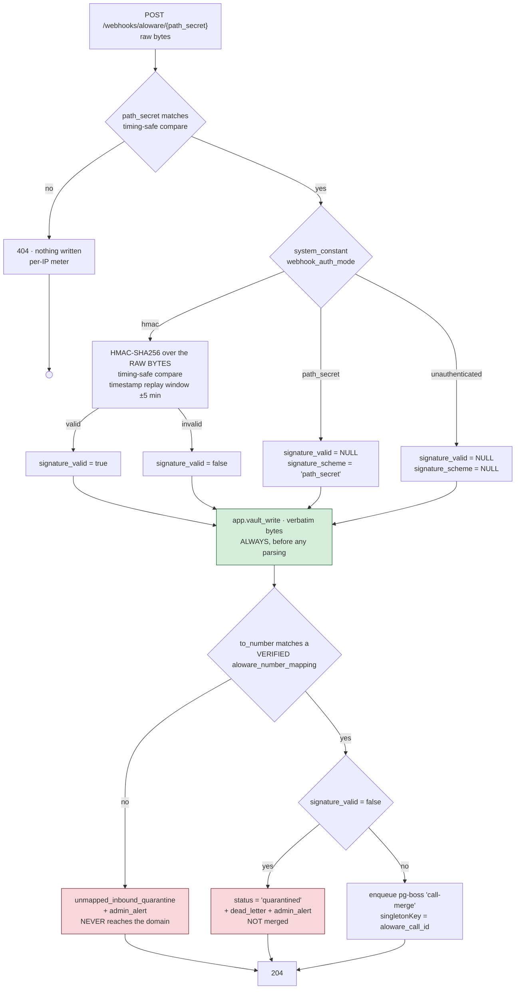
```mermaid
flowchart TD
  IN["POST /webhooks/aloware/{path_secret}<br/>raw bytes"] --> PS{"path_secret matches<br/>timing-safe compare"}
  PS -- no --> D404["404 · nothing written<br/>per-IP meter"]
  PS -- yes --> MODE{"system_constant<br/>webhook_auth_mode"}

  MODE -- hmac --> H["HMAC-SHA256 over the RAW BYTES<br/>timing-safe compare<br/>timestamp replay window ±5 min"]
  MODE -- path_secret --> OK1["signature_valid = NULL<br/>signature_scheme = 'path_secret'"]
  MODE -- unauthenticated --> OK2["signature_valid = NULL<br/>signature_scheme = NULL"]

  H -- valid --> OK3["signature_valid = true"]
  H -- invalid --> BAD["signature_valid = false"]

  OK1 --> VAULT
  OK2 --> VAULT
  OK3 --> VAULT
  BAD --> VAULT["app.vault_write · verbatim bytes<br/>ALWAYS, before any parsing"]

  VAULT --> Q{"to_number matches a<br/>VERIFIED aloware_number_mapping"}
  Q -- no --> QUAR["unmapped_inbound_quarantine<br/>+ admin_alert<br/>NEVER reaches the domain"]
  Q -- yes --> SIG{"signature_valid = false"}
  SIG -- yes --> QSTAT["status = 'quarantined'<br/>+ dead_letter + admin_alert<br/>NOT merged"]
  SIG -- no --> ENQ["enqueue pg-boss 'call-merge'<br/>singletonKey = aloware_call_id"]

  ENQ --> R204["204"]
  QSTAT --> R204
  QUAR --> R204
  D404 --> END(( ))

  style VAULT fill:#d4edda,stroke:#155724
  style QUAR fill:#f8d7da,stroke:#721c24
  style QSTAT fill:#f8d7da,stroke:#721c24
```

**Four rulings inside that diagram.**

**(1) The HMAC is computed over the raw request bytes, never over a re-serialized object.** A JSON round trip changes bytes — key order, whitespace, unicode escaping — and produces a valid-signature-fails bug that presents as "the provider is broken" and takes a long investigation to find. The bytes we hash are the same bytes we vault, which also means the vault row remains independently verifiable years later. Mechanically: the raw-body reader is the only body accessor available on the webhook route, and the framework's JSON body parser is not mounted on it.

**(2) A signature failure returns `204`, not `401`** (ADR-SEC-05). This looks wrong and is not. A `401` teaches a provider with retries to hammer us for hours; and a signature failure is far more likely to mean *our* key is stale than that an attacker is present. So the payload is **accepted into the vault and refused entry to the domain**: `status='quarantined'`, a `dead_letter` row, an `admin_alert`, and the DLQ depth counter on `/admin/integration-health` rises — visibly, on a screen, which is the only kind of alert that works here. Nothing is discarded (ARR-INT-07) and nothing is trusted. A replay endpoint lets an admin re-materialize it after fixing the key.

**(3) The `to_number` check is the real authentication when there is no signature.** A webhook whose destination number does not match a **verified** `aloware_number_mapping` row (ARR-INT-11) is quarantined and never reaches the domain — which means, in particular, **it never reaches the STOP chain**. This matters more than it looks: `message.received` → `consent.updated {status: revoked}` is legally load-bearing and irreversible-in-spirit, so a forged inbound "STOP" is a denial-of-service against a seller's book. Requiring a verified mapping on the receiving side closes it, and `UNIQUE (tenant_id, from_number_e164) WHERE revoked_at IS NULL` guarantees one number maps to exactly one seller.

**(4) State plainly what a forged webhook can do in the worst case** — `unauthenticated` mode, attacker knows a seller's Aloware number and a lead's phone number. It **can**: inject a fabricated call or message row on that contact's timeline; mark a number bad; trigger a STOP for a number it already knows. It **cannot**: credit money (`CHECK (to_stage_type <> 'earning' OR actor_type = 'human')` — a webhook is `actor_type='webhook'` and the row is rejected by the engine); create or modify a seller; read anything at all; reach a contact in a seller's book whose number it does not already possess; escape the tenant. **The blast radius of the weakest possible provider posture is bounded by database constraints, not by the provider's security choices.** That is the design goal and it is met.

---

### SEC-5 · Encryption in transit and at rest

**In transit.**

- **Browser → edge:** TLS terminated at the platform, HSTS with `preload` emitted by the application (SEC-1/A05).
- **App → Postgres: `sslmode=verify-full` with the provider CA bundled in the image**, asserted at boot — the process refuses to start if the parsed connection string does not carry `verify-full`. This is a real ruling, not boilerplate: `sslmode=require` is encryption *without authentication* and is one DNS answer away from a transparent MITM, and the difference between `require` and `verify-full` is one file in the image and one line of config. It is exactly the kind of setting that is right on the day it is written and silently downgraded later by a "fix the TLS error" commit — hence the boot assertion rather than a comment.
- **App → R2:** TLS + SigV4. **App → Aloware:** TLS, host on the outbound allowlist (SEC-1/A10).

**At rest.** Postgres volume encryption by the provider; R2 server-side encryption. `intake_source.token_hash` and better-auth credential material are hashed, not encrypted. Export artifacts in R2 are private objects with high-entropy keys, served exclusively as short-expiry presigned URLs against `export_job.expires_at`.

**The bucket-is-private check is a runtime assertion, not a configuration note.** A scheduled probe performs an **unauthenticated GET of a canary object key** and raises a critical `admin_alert` if the response is anything other than 403. Bucket ACLs are a console setting nobody re-reads; a probe that goes red is a mechanism.

**No application-level field encryption** — the reasoning is in SEC-1/A02 and formalized in ADR-SEC-02.

---

### SEC-6 · What is logged, and what is never logged

**The rule: PII is stored, never logged.** `raw_payload_vault` is the one place raw consumer data lives outside the domain tables; logs and telemetry exist for correlation and nothing else. This is not a style preference — Sentry, Axiom and Better Stack are third-party systems with their own retention, outside our CCPA erasure controls, and a phone number in a log index is a copy of PII we cannot delete on request.

**Never permitted in any log line, breadcrumb, span attribute, error report, job payload or metric label:**

`phone_e164` · `contact_value_norm` · `email_norm` · `full_name` · `display_name` · note `body` · message `body` · `certificate_url` · `captured_ip` · `source_ip` (unhashed) · `zip5` · `state_code` paired with a name · `token_hash` or any token plaintext · any presigned R2 URL (it is a bearer credential) · any connection string · **the `payload` jsonb of an event** · **any request or response body, on any route, without exception**.

**Always present, on every log line:**

`correlation_id` · `tenant_id` · `owner_user_id` · `actor_user_id` · `event_id` · `event_name` · `subject_type` + `subject_id` (uuids) · gate `verdict` enum + reason code · `moved_via` · latency · SQLSTATE · outcome.

Note what that second list buys: **every incident is fully reconstructible from uuids plus the vault plus `audit_log`**, and the reconstruction requires an admin-scoped, audited read rather than a log search. That is not a limitation, it is the access-control boundary working as intended.

**Three enforcing mechanisms, in order of how early they fire:**

1. **The field names do not type-check.** A single logger module is the only permitted logging entry point; ESLint bans `console.*` and dependency-cruiser fails the build if anything outside it imports the underlying transport. The logger accepts a `LogFields` record whose **key type is a generated union of allowed field names** and whose value type is `string | number | boolean | Uuid | Iso8601`. `log.info({ phone: contact.phone_e164 })` does not compile, because `phone` is not in the union. This is the strongest available guarantee: the model cannot log a phone number by forgetting a rule, because the rule is a type error.
2. **A scrubber with a test that fails the build.** Sentry `beforeSend` and `beforeBreadcrumb` strip `request.data`, `request.cookies`, `Authorization` and `Cookie` headers, and drop any string in `extra` matching an E.164 or email pattern. A unit test constructs a synthetic Sentry event containing `+14155550123` and `a@b.com` in five different nesting positions and asserts none of them survives serialization.
3. **Job payloads carry ids and scalars only.** Every pg-boss payload type is generated from the consumer registry, and a CI test asserts that no generated payload type contains a field named in the denylist above. This is also the compensating control that puts schema `pgboss` on the RLS exception list.

**The one honest exception, documented rather than hidden:** `raw_payload_vault.body_raw` and `.headers` contain PII by design. The table is `tenant_admin_only`, `crm_app` cannot write it except through `app.vault_write()`, it is on the 60-day clock, and **reading a vault body writes an `audit_log` row** (`action='vault.body_viewed'`, bucketed on `dedupe_bucket` exactly as `book.viewed` is, since the table is immutable and bucketing must be insert-or-nothing). Looking at raw consumer data is a privileged act and leaves a record.

**Postgres-side:** `log_statement='none'` and no `log_min_duration_statement` low enough to capture parameter values on the hot path — a slow-query log with bound parameters is a PII log with a different name.

---

### SEC-7 · Retention: two clocks, and the 60-day ruling

ARR-PRV-02 requires retention per data class with raw PII-bearing bodies on a **short** clock, separate from the long clock of the derived record, and records the 30–90-day window as unresolved. **This section closes it at 60 days.**

#### D-SEC-3 — The PII lifecycle

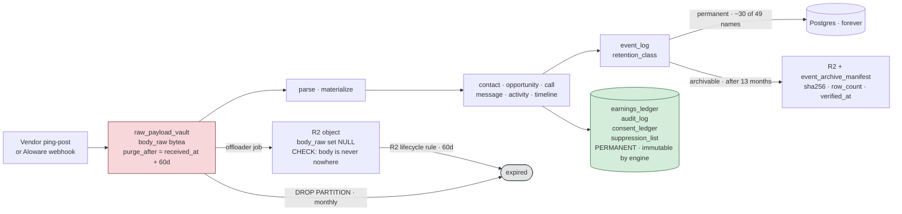
```mermaid
flowchart LR
  V["Vendor ping-post<br/>or Aloware webhook"] --> RAW["raw_payload_vault<br/>body_raw bytea<br/>purge_after = received_at + 60d"]
  RAW --> PARSE["parse · materialize"]
  PARSE --> DOM["contact · opportunity · call<br/>message · activity · timeline"]
  RAW -->|"offloader job"| R2["R2 object<br/>body_raw set NULL<br/>CHECK: body is never nowhere"]
  R2 -->|"R2 lifecycle rule · 60d"| GONE(["expired"])
  RAW -->|"DROP PARTITION · monthly"| GONE

  DOM --> EV["event_log<br/>retention_class"]
  EV -->|"permanent · ~30 of 49 names"| FOREVER[("Postgres · forever")]
  EV -->|"archivable · after 13 months"| ARCH["R2 + event_archive_manifest<br/>sha256 · row_count · verified_at"]

  DOM --> LEDG[("earnings_ledger<br/>audit_log<br/>consent_ledger<br/>suppression_list<br/>PERMANENT · immutable by engine")]

  style RAW fill:#f8d7da,stroke:#721c24
  style LEDG fill:#d4edda,stroke:#155724
  style GONE fill:#e2e3e5,stroke:#383d41
```

**Why 60 and not 30 or 90** (ADR-SEC-03):

- **30 is too short for the failure it exists to cover.** The vault's purpose is that a *mapping bug is recoverable* — and the corpus names the specific bug class that stays invisible: a silent reconciliation backfill or a bad field map presents to a seller as "the cold badges are wrong sometimes" (ARR-INT-08), which is the kind of complaint that takes a while to become a report and longer to become a diagnosis. 30 days routinely expires the evidence before the symptom is understood.
- **90 doubles the only monotonic cost line for no additional recovery value.** Raw bodies are the storage-cost driver, provider Postgres storage is roughly double the alternatives and **cannot be shrunk once grown**. A mapping bug not found within 60 days will not be fixed by replay; it will be fixed forward.
- **60 sits comfortably inside CCPA obligations because the raw body is not what answers a request.** A right-to-know request is answered from the *derived* record — contact, timeline, consent, activity — which is retained long. That separation is the entire point of the two-clock design and it is what lets the short clock be genuinely short.

**Mechanisms, and note there are two independent expiries by design:**

1. `raw_payload_vault.purge_after` is `NOT NULL` and written at INSERT — **a vault row without a retention clock cannot exist.**
2. Monthly range partitions mean `app.retention_purge()` is a `DROP PARTITION`: O(1), no bloat, no mass `DELETE` against a table `crm_app` has no `DELETE` grant on anyway.
3. The R2 lifecycle rule expires the offloaded objects independently. **Belt and braces are correct here specifically because the failure mode is "we kept PII too long"** — a job that stops running is a compliance failure, and a bucket rule that keeps working is the safety net.
4. **The inverse check, which is the one nobody writes:** a scheduled assertion that the oldest live vault partition is younger than 60 days + one partition width, raising a critical `admin_alert` otherwise. Retention silently *stopping* produces no error, no user complaint and no metric movement — only this check goes red.

**Legal hold** (ARR-PRV-02). The MVP implements it as `system_constant['retention_purge_paused']`, which `app.retention_purge()` reads and honours, and which raises a daily `admin_alert` for as long as it is set. This is deliberately coarse — it pauses *all* purging, not a per-subject hold — and it is stated as a limitation rather than dressed up: a per-subject `legal_hold` table is a V1.1 relation, and a global pause with a nagging alert is the honest MVP shape. It is auditable, it is one value, and it cannot be forgotten in the on position without complaining every day.

---

### SEC-8 · CCPA rights, served concretely

| Right | How this system serves it | Mechanism | The honest gap |
|---|---|---|---|
| **Know / access** | An admin-scoped `export_job` filtered to one consumer identity across the tenant | The **same** queries with the ownership filter lifted by `app.scope_is_global()`, run under the requester's context, writing an `audit_log` row. **There is no privileged export path** (ARR-PRV-05) | — |
| **Delete** | **Redact in place** — `redacted_at` + `redaction_reason`. Blanks message bodies, note bodies, name, `email_norm`, recording and transcript references; emits `message.redacted` | `crm_app` holds **no `DELETE` grant on any table** (ARR-PRV-01). Cascade-delete is not a strategy that exists here | **Spans two systems** — see below |
| **Correct** | Ordinary edit paths | `audit_log` carries `before`/`after` on privileged writes | — |
| **Opt out of contact** | STOP / DNC → `suppression_list`, tenant-wide, keyed on E.164 | Read live by the gate on **every** attempt, never a per-session cache (ARR-MVP-15) | — |
| **Opt out of sale / sharing** | Out of scope — we are neither. The lead **vendors** are, and `consent_ledger.certificate_url` + `vendor_name` is the artifact that records where the burden sits | `CHECK (source <> 'import_attestation' OR attesting_admin_user_id IS NOT NULL)` — an import cannot assert consent without naming the human who attested it | — |
| **Non-discrimination / minimization** | No SSN field. No document vault. No mirrored media. No unauthenticated surface | Absence. There is no column, no table, no route, no storage tier (ARR-PRV-06) | — |

**Three subtleties that a generic CCPA section would miss and that are specific to this product:**

**(1) A consumer can exist twice, legitimately.** Identity is **owner-scoped** — two sellers who both bought the same consumer from a ping-post reseller get two `contact` rows by design, and neither can see the other (ARR-MVP-19). **A right-to-know or right-to-delete request must therefore span both.** The CCPA console is one of the paths that legitimately reads tenant-wide; it is not a *new* privileged path, it is the same `app.scope_is_global()` widening under the admin scope with an audit row. A deletion implemented as "redact the contact I found" would silently leave a second copy, and the mechanism that prevents it is that the erasure workflow keys on `phone_e164` / `email_norm` at **tenant** scope (using the existing `contact_phone_tenant_idx`), not on a single `contact_id`.

**(2) Deletion deliberately retains an identifier, and this is a documented minimization exception.** `contact_phone.phone_e164` stays in plaintext on a redacted contact, and `suppression_list` and `consent_ledger` rows are never redacted at all. The legal basis is direct: **you cannot honour "never contact me again" without retaining the identifier of who not to contact.** It also means a later ping-post repost of the same consumer matches the redacted skeleton rather than creating a fresh shadow record for someone who asked to be erased. This exception is written down here precisely because it is the kind of thing a regulator asks about and an engineer would otherwise never document.

**(3) Erasure spans two systems and we cannot yet truthfully promise it is complete.** Aloware holds recordings and transcripts; ARR-PRV-01 records that whether they expose a deletion API is **unverified**. The mechanism: the erasure workflow issues the outbound request, and on failure or absence writes an `audit_log` row with a **partial-completion state** plus an `admin_alert` that stays unacknowledged until a human confirms the provider side. And the enforcement that matters: **until the spike proves an Aloware media-delete API exists, no string in the catalog may promise complete erasure.** Because ARR-MVP-28 routes every user-facing string through the catalog and locks compliance-bearing copy, this promise cannot be written by accident inside a component — the only place it could be written is a file whose compliance strings are locked.

---

### SEC-9 · The legal calling window — closing the timezone data-source decision

ARR-CMP-05 leaves the lead-local timezone source explicitly open and flags why it is load-bearing: it is the input to a **hard block that can stop fifty sellers from working**, so a stale or missing table is an outage, not a data-quality issue. ARR-CMP-04 makes the window 9:00 AM – 8:00 PM lead-local, hard-blocked, evaluated at initiation, with scheduled sends re-evaluated at fire time. **This closes the decision.**

#### The ruling

> **Primary: a bundled ZIP/ZCTA → IANA table, generated at build time from named public-domain primary sources and seeded into `ref.zip_timezone`. Fallback: NANPA area code → `ref.area_code_timezone`, always `tz_confidence='low'`. Last resort: `ref.state_timezone`. Unresolved at every level fails the gate closed. Where a ZIP or a state straddles a timezone boundary the resolver returns a CANDIDATE SET and the window must be legal in EVERY member.**

| Layer | Rows | Size | Precision | `tz_confidence` | Refresh |
|---|---|---|---|---|---|
| `ref.zip_timezone` | ~41k (≈33k ZCTAs expanded to USPS ZIPs) | ~1.5 MB in Postgres | Exact except for boundary-straddling ZIPs, which are represented as **multiple rows** | `high` (single row) / `medium` (multi-row) | By migration only, generated from primary sources; version in `system_constant['tz_dataset_version']`; `/admin/integration-health` alerts past 12 months |
| `ref.area_code_timezone` | ~340 NPAs | trivial | **Wrong for ported mobiles** — a consumer who moved NY → FL keeps a 718 number, and this is common in the FE lead market — and wrong for the ~20 NPAs that straddle | **`low`, always. Never `high`, under any circumstance** | With `tzdata` |
| `ref.state_timezone` | 51 | trivial | Ambiguous for FL, TX, KS, NE, ND, SD, IN, KY, MI, OR, ID, TN — represented as multi-row candidate sets | `medium` (single-zone states) / `low` (multi-zone) | With `tzdata` |

**Why the table is in Postgres and not a file in the image:** the gate is a `SECURITY DEFINER` SQL function evaluated inside the request transaction, and `AT TIME ZONE` with the database's live `tzdata` is the evaluator. A JS offset computation against a bundled JSON file is a second implementation of the same rule that will drift from the first, and drift here is invisible: the board is right almost always and wrong for a handful of leads on the two DST transition days.

**Why the dataset is generated, not installed:** the ruling is that **only redistributable public-domain sources may be used** — the Census ZCTA relationship files joined to IANA `tzdata` zone definitions — and the generator script emits a header listing its source URLs and their checksums. A CI check asserts that the committed table file's header matches the recorded sources. *Do not take a random npm ZIP-to-timezone package*: its provenance and licence are unknown, its refresh cadence is somebody else's, and it feeds a hard block.

#### The straddle rule, which is the sharp part

A ZIP or state that spans two zones cannot be collapsed to one answer, and the intuitive collapse is **wrong in one direction of the day**. Assume a ZIP straddling Eastern and Central: choosing Eastern is conservative in the evening (it closes the window earlier in real time) and *permissive in the morning* (it opens the window before 9:00 AM Central). Choosing Central inverts both errors. There is no single zone that is conservative at both ends.

> **Therefore: the resolver returns the set of candidate zones, and the verdict is `allow` only if the current instant is inside 9:00 AM – 8:00 PM in EVERY member of the set.** The window is the **intersection**, not a choice.

This costs a small amount of legal calling time on a small number of leads and it makes an illegal dial structurally unreachable through ambiguity. It is expressible directly: `ref.zip_timezone` carries one row per (zip5, tz) pair and `app.calling_window_check()` requires `bool_and(...)` over the returned set.

**Where the answer is computed matters.** `contact.lead_local_tz` / `tz_confidence` / `tz_source` remain the **persisted, cached triple** used for display, for the `Time zone unconfirmed` badge, and for the dual-labelled slot picker (`9:30 AM (12:30 PM their time)`). **The gate resolves the candidate set live from `zip5` → NPA → `state_code` at evaluation time.** Two consequences, both good: a dataset correction takes effect for every lead at once with no backfill, and there is no stale-copy bug class where the badge says one thing and the block says another.

#### D-SEC-4 — Resolver chain and the fixed gate order

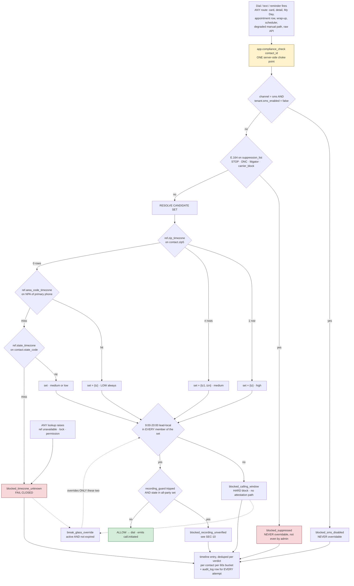
```mermaid
flowchart TD
  T["Dial / text / reminder fires<br/>ANY route: card, detail, My Day,<br/>appointment row, wrap-up, scheduler,<br/>degraded manual path, raw API"] --> G["app.compliance_check contact_id<br/>ONE server-side choke point"]

  G --> C1{"channel = sms AND<br/>tenant.sms_enabled = false"}
  C1 -- yes --> BA["blocked_sms_disabled<br/>NEVER overridable"]
  C1 -- no --> C2{"E.164 on suppression_list<br/>STOP · DNC · litigator · carrier_block"}
  C2 -- yes --> BB["blocked_suppressed<br/>NEVER overridable, not even by admin"]

  C2 -- no --> TZ["RESOLVE CANDIDATE SET"]
  TZ --> Z1{"ref.zip_timezone<br/>on contact.zip5"}
  Z1 -- "1 row" --> S1["set = {tz} · high"]
  Z1 -- "n rows" --> S2["set = {tz1..tzn} · medium"]
  Z1 -- "0 rows" --> Z2{"ref.area_code_timezone<br/>on NPA of primary phone"}
  Z2 -- hit --> S3["set = {tz} · LOW always"]
  Z2 -- miss --> Z3{"ref.state_timezone<br/>on contact.state_code"}
  Z3 -- hit --> S4["set · medium or low"]
  Z3 -- miss --> BC["blocked_timezone_unknown<br/>FAIL CLOSED"]

  S1 --> W
  S2 --> W
  S3 --> W
  S4 --> W{"9:00-20:00 lead-local<br/>in EVERY member of the set"}
  W -- no --> BD["blocked_calling_window<br/>HARD block · no attestation path"]
  W -- yes --> RG{"recording_guard tripped<br/>AND state in all-party set"}
  RG -- yes --> BR["blocked_recording_unverified<br/>see SEC-10"]
  RG -- no --> OK["ALLOW → dial · emits call.initiated"]

  BG["break_glass_override<br/>active AND not expired"] -. "overrides ONLY these two" .-> W
  BC -.-> BG
  BD -.-> BG

  ERR["ANY lookup raises<br/>ref unavailable · lock · permission"] --> BC

  BA --> L["timeline entry, deduped per verdict<br/>per contact per 60s bucket<br/>+ audit_log row for EVERY attempt"]
  BB --> L
  BC --> L
  BD --> L
  BR --> L

  style G fill:#fff3cd,stroke:#856404
  style BB fill:#f8d7da,stroke:#721c24
  style BC fill:#f8d7da,stroke:#721c24
  style OK fill:#d4edda,stroke:#155724
```

#### The fail-closed rule, stated exactly

- **Empty candidate set at every level** → `blocked_timezone_unknown`, locked copy: *"We can't confirm this lead's time zone. Add their state to continue."*
- **A lookup that ERRORS** — `ref` unreachable, lock timeout, permission failure — is also `blocked_timezone_unknown`, because ARR-CMP-01 says a lookup that errors blocks the send. **Mechanically: `app.compliance_check()` contains no exception handler that swallows.** Any exception propagates; the caller maps *any* error, of any class, to the fail-closed verdict. A test injects a permission failure on `ref.zip_timezone` and asserts the verdict is `blocked`, not `allow` — because the natural way to write this in application code is `try { … } catch { return ALLOW }` and that single line is the whole vulnerability.
- **Low confidence never blocks intake.** The lead is created, the card carries `Time zone unconfirmed`, and the block happens only at send time. The badge is on the appointment row *from the moment it is booked*, not sprung at appointment time.
- **Scheduled sends re-evaluate at fire time**, never at enqueue time — which is why `scheduled_job` payloads carry `subject_id` and deliberately no precomputed `allowed` decision (ARR-CMP-04, ARR-MVP-17). A test asserts that a job enqueued while a number was clean and fired after a STOP landed resolves to `skipped: suppressed`.
- **Break-glass releases exactly `blocked_timezone_unknown` and `blocked_calling_window`** and nothing else. That release valve is precisely why the whole design can afford to fail closed: the "the table is broken and fifty sellers are stopped" scenario has an admin-only, audited, self-expiring answer.

#### tzdata staleness is an outage

The corpus's own open question. Two mechanisms:

1. **A CI test asserts the app image's ICU/`tzdata` version and the database's `pg_timezone_names` agree**, and fails the build on a mismatch — because a disagreement between the app rendering *"12:30 PM their time"* and the database deciding whether the dial is legal is exactly the invisible bug class this product cannot detect by observation.
2. **Golden DST cases in CI**: fixed instants either side of the March and November transitions in `America/New_York`, `America/Chicago`, `America/Denver`, `America/Los_Angeles` and `America/Phoenix` (no DST — the reason zones are stored as IANA names and **never as fixed offsets**), asserted against expected verdicts.
3. A monthly scheduled check raises an `admin_alert` if the pinned `tzdata` release is more than one release behind. It alerts; it does not break production.

---

### SEC-10 · Call recording and two-party consent (D9)

**The facts.** Aloware records at the **account** level; whether the recording announcement fires on the **Two-Legged Call** path is **unverified** (ARR-CMP-10, Puerta 7). The corpus names CA, FL, PA, IL, WA and MA as all-party-consent states. Recording attachment, player and retention are already out of the MVP, and ARR-PRV-06 rules that recordings and transcripts are **referenced, never mirrored**.

#### The ruling, and it does not wait for the spike

> **Recording is DISABLED at the Aloware account level for the MVP, regardless of what the spike finds.**

The MVP does not attach, play, mirror, index or retain recordings. Recording therefore produces **zero product value and one hundred percent of the legal exposure** — per call, in six states we sell into, with statutory damages per violation. There is no reading of the trade-off in which "we recorded without a provably compliant announcement" is worth a feature we already cut.

What the spike actually decides is not *whether we record* but **what V1.1 has to build**: if the announcement fires on the two-legged path, V1.1 recording is a per-state policy object keyed on `contact.state_code` and a per-call disclosure decision at dial time. If it does **not** fire, V1.1 recording requires us to play our own disclosure on a path the provider may not support — in which case recording may never ship in this product, and that should be said out loud now rather than discovered as a surprise later.

#### How you mechanically enforce a setting you do not own

This is the interesting problem: the control lives in a third party's dashboard, where a support engineer, a plan change or a UI redesign can flip it, and nothing in our system would know.

1. **Probe the setting.** The existing `scheduled_job` kind `aloware_health_probe` also reads the account recording configuration via API. If it returns *enabled*, or if it **cannot be read at all**, the probe sets `system_constant['recording_guard'] = 'tripped'` and raises a critical, unacknowledged `admin_alert`. Fail closed on the probe too.
2. **Proportionate enforcement, not a floor-wide stop.** While the guard is tripped, the compliance gate adds the verdict **`blocked_recording_unverified` for dials to contacts in the all-party-consent states only.** Every other dial proceeds. This is exactly proportionate to the exposure and it is buildable today because ARR-CMP-10 already requires that *"the dial request must already carry the lead's state today so that path is not a rewrite"* — the requirement anticipated this control. The state list lives in **data** (a `ref.state_recording_regime` relation classified `reference` in `security.table_registry`), not in an `if` chain, so changing it is a seeded row rather than a code change.
3. **The best detector is the artifact itself.** *"The dashboard says recording is off"* is a claim. **A `recording_url` arriving on a webhook is proof that a recording exists.** The merge consumer raises `admin_alert(kind='recording_detected')` on any non-null `recording_url` while the guard is not explicitly `disabled_verified`. This mechanism does not depend on the provider's configuration API telling the truth, does not depend on anyone reading a dashboard, and fires on the first affected call.
4. **`blocked_recording_unverified` is not overridable.** `break_glass_override.scope` is a single-value enum with `CHECK (scope = 'timezone_and_window')`; adding a third overridable verdict is `ALTER TYPE`, a migration and a review gate.
5. **Absence as guarantee:** no recording-player component exists, and the string catalog contains no *"this call is recorded"* copy. There is nothing to accidentally render.

---

### SEC-11 · Break-glass: the only sanctioned bypass, and what it can never touch

The schema already carries most of this: `expires_at` as a `GENERATED ALWAYS AS (started_at + interval '60 minutes') STORED` column, `CHECK (length(btrim(reason)) >= 10)`, `UNIQUE (tenant_id) WHERE ended_at IS NULL`, and the single-value `scope` enum. What this section adds is the set of behaviours that must be *tested*, because they are what makes the feature safe rather than merely present.

| Property | Requirement | Mechanism |
|---|---|---|
| **Admin only** | ARR-CMP-03 | RLS: tenant-scoped read (the banner must reach everyone), admin write |
| **Seller / supervisor hitting the endpoint** | Owner-scoped **not-found**, never 403 — the not-found rule extends from records to **routes** | E2E asserting the response is byte-identical to a genuine 404 (ARR-UX-04, ARR-PRV-04) |
| **Reason required** | ≥ 10 characters after trimming | `CHECK` — a whitespace reason is rejected by the engine |
| **Expires at 60 minutes with no job** | ARR-CMP-03 | Computed on read. Test: insert with `started_at = clock_timestamp() - interval '61 minutes'`, assert the gate treats it as inactive **and** that engaging a new override auto-closes the stale one with `end_reason='auto_expired'` |
| **At most one live override** | — | `UNIQUE (tenant_id) WHERE ended_at IS NULL`, with a deterministic two-statement close-then-engage (a predicate cannot contain `clock_timestamp()`) |
| **Every permitted dial is individually attributed** | ARR-CMP-03 | Test: N dials during an active override produce **N** `audit_log` rows with non-null `override_id`. **No bucketing here** — bucketing exists only for `book.viewed` |
| **Visible to every signed-in user including supervisors** | ARR-CMP-03 | Rides the existing `degraded_banner` poll channel and its `channel_watermark` row — no new transport, appears within one poll interval |
| **The copy says what is still enforced** | R3.3, verbatim: `Compliance override is on — calling-window checks are paused. STOP and DNC are still enforced.` | Locked in the string catalog (ARR-MVP-28) **and** a test asserts the rendered banner contains the substrings `STOP` and `DNC`. A snapshot test on a compliance string is a legitimate build-breaker, because here the requirement literally is the words |
| **Cannot ever override suppression** | ARR-CMP-03 | Two independent mechanisms: `CHECK (scope = 'timezone_and_window')` makes the schema unable to express it; **and** the gate evaluates suppression *before* consulting any override, in the fixed order of ARR-CMP-02. Test: a suppressed number is blocked **while** an override is active |

---

### SEC-12 · The security gate matrix — when each mechanism fires

Everything in this section is one of six kinds of check, and the kind determines what a failure looks like to Jorge. This table is the answer to "how do I know any of this is true without reading code".

| Fires at | Checks | What a failure looks like |
|---|---|---|
| **Compile / type-check** | PII field names absent from the `LogFields` key union; money as `bigint` cents, never `number`; job payload types; generated event-name union; consumer registry ↔ handler union | Build error, no deploy |
| **Pre-merge CI** | `pg_class` / `pg_policies` catalog gate (FORCE + ≥1 policy + both `qual` and `with_check` non-null + no `cmd <> 'ALL'` + `crm_app` has no DELETE anywhere + no UPDATE on immutable tables); `pg_proc.prosrc` contains `app.current_tenant()` in every definer function; three-label role enum; 49-label event enum; no `now()` in the leaderboard SQL module; no `set_config(..., false)`; no bare `SET`; no `console.*`; outbound-host allowlist; SHA-pinned actions; `gitleaks` over full history; `pnpm audit` high; Sentry-scrub test; tzdata/ICU version agreement; DST golden cases; cross-origin POST → 403; header set incl. no `unsafe-inline`; owner-scoped 404 byte-identity | Red build, no merge |
| **Deploy** | `security.harden()` RAISES on any unclassified relation or partition | Deploy stops. **Stronger than CI: CI can be amended, a deploy that will not proceed cannot** |
| **Boot** | Connection identity is not the schema owner, not superuser, not `rolbypassrls`; `sslmode=verify-full`; every required secret present and not a placeholder; dormant tag/custom-field tables empty in production | Process exits non-zero, loudly, immediately |
| **Runtime, continuous** | Gate fail-closed on any lookup error; rate meters; `admin_alert` on unmapped number, unmapped disposition, non-human earning attempt, DLQ depth, unverified mapping, recording detected, intake rate limit, dial velocity, tenant-scope export; R2 canary GET → 403; recording guard probe | A row on `/admin/integration-health` and a Better Stack alert |
| **Monthly / scheduled** | Restore drill: full silo + append-only suite against a restored dump, asserting roles, revoked GRANTs, immutability triggers and **`FORCE ROW LEVEL SECURITY`** survived; archive digest + row-count verification writing `event_archive_manifest.verified_at`; oldest-vault-partition age; last-verified-restore age > 7 days; tzdata release age | A job that goes red on its own |

**The one-line summary of the whole section:** every security property of this product is either a database constraint, a privilege, a generated policy, a type, a build-breaking test, a boot refusal, or a red job. **None of it is a convention.**


---

# Part V — Aloware Integration, the Ingestion Bulkhead and the Sprint-0 Gate Ladder

## Aloware Integration, the Ingestion Bulkhead, and the Sprint-0 Gate Ladder

> This section specifies the only third party the MVP cannot route around, the edge that absorbs its traffic, and the ordered list of measurements that must return before anything is built on top of either. It closes four contradictions the corpus carried forward, and it specifies the ingestion design **twice** — once for three separate processes and once for the folded single-process deployment — because the owner requires the split to be a deployment variable, not an architectural assumption.

---

### 1. What we actually have, and what that forces

Aloware is a **token-authenticated REST API plus outbound webhooks**, and nothing else. We are not a native partner; there is no embeddable iframe or SDK softphone for arbitrary custom apps (`01-benchmark.md §3.7`, ARR-INT-03). Three consequences are structural, not stylistic:

1. **Every dial is a server-side API call.** The browser has no telephony. That makes the backend the only possible location of the compliance gate (ARR-CMP-01), and it makes the 5–15 second two-legged silence a **UI state problem, not a latency problem** (ARR-INT-03). It must never be modelled as an async job the seller waits on.
2. **Delivery guarantees are unknown and must be assumed to be the weakest case.** The corpus never established that Aloware signs webhooks, retries them, or preserves order (ARR-INT-02). Everything below is designed for *at-least-once, out-of-order, possibly unsigned* and is *not* redesigned if the spike returns better news — better news only relaxes an alert threshold.
3. **The provider's capability set is a variable, not a constant.** Whether the Sequence API, the Power Dialer API, per-seller caller ID on the two-legged path, a call-list API, and recording-announcement behaviour exist at our tier is *unverified* (ARR-INT-02, ARR-CMP-10). A design that hard-codes "the list API exists" is a design that silently loses ARR-INT-08's reconciliation backfill.

Point 3 is why the adapter is not a client library. It is a **capability registry with a compile-time and a boot-time gate** (§3).

#### 1.1 The anti-corruption boundary, as a build rule

Aloware semantics may not leak into domain code (ARR-INT-01 *implica*). Four modules, four import rules, all enforced by `dependency-cruiser` in the pre-merge CI tier:

| Module | May import | May **not** import | What it owns |
|---|---|---|---|
| `src/ingress/**` | `src/db/**`, `src/ingress/**` | `src/domain/**`, `src/ui/**`, `src/realtime/**` | The HTTP edge for `/hooks/*` and `/intake/*`. Bytes in, `204` out. |
| `src/adapters/aloware/**` | `src/ingress/extract/**`, HTTP client | `src/domain/**` | Outbound REST, the capability registry, the disposition vocabulary map. |
| `src/jobs/aloware/**` | `src/domain/**`, `src/adapters/aloware/**` | `src/ui/**` | The merge, the backfill, the health probe. |
| `src/domain/**` | itself | `src/adapters/**` | Knows `call`, never `aloware_call_id`'s provider. |

The domain's vocabulary is `disposition_canonical`; `disposition_raw` is carried as enrichment only, because the real disposition vocabulary is unknown until the spike returns (ARR-MVP-31, US-604 Notes). **A disposition string that fails to map does not throw and does not guess:** it writes `disposition_canonical = NULL`, keeps `disposition_raw`, and raises `admin_alert(kind='unmapped_disposition')` — one of the five health signals the MVP must serve from tables we already own.

---

### 2. Topology is a deployment variable

The system is **one TypeScript application, one container image, three runnable roles**. The roles are selected by a single environment variable:

```
ROLES=web,worker,ingest      # Tier 1 — pilot, folded, one paid service
ROLES=web                    # Tier 2 — production, split
ROLES=worker
ROLES=ingest
```

The composition root mounts *runnable units* from a static registry. A unit declares the roles it belongs to; nothing else in the codebase knows what a process is.

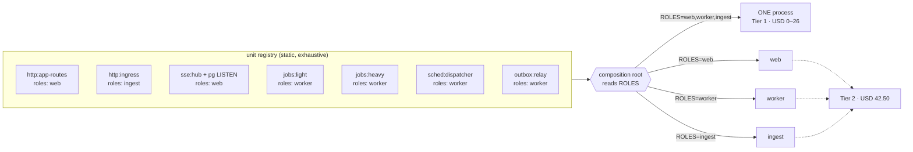
```mermaid
flowchart LR
  subgraph REG["unit registry (static, exhaustive)"]
    U1["http:app-routes<br/>roles: web"]
    U2["http:ingress<br/>roles: ingest"]
    U3["sse:hub + pg LISTEN<br/>roles: web"]
    U4["jobs:light<br/>roles: worker"]
    U5["jobs:heavy<br/>roles: worker"]
    U6["sched:dispatcher<br/>roles: worker"]
    U7["outbox:relay<br/>roles: worker"]
  end
  REG --> BOOT{{"composition root<br/>reads ROLES"}}
  BOOT -->|"ROLES=web,worker,ingest"| FOLD["ONE process<br/>Tier 1 · USD 0–26"]
  BOOT -->|"ROLES=web"| P1["web"]
  BOOT -->|"ROLES=worker"| P2["worker"]
  BOOT -->|"ROLES=ingest"| P3["ingest"]
  P1 -.-> SPLIT["Tier 2 · USD 42.50"]
  P2 -.-> SPLIT
  P3 -.-> SPLIT
```

**Three things make the split configuration rather than a migration:**

**(a) The ingress hostname is separate from day zero.** Aloware webhooks and vendor ping-post are registered against `in.<domain>`, never against the app hostname — *even in Tier 1, where `in.<domain>` is a second custom domain pointing at the single folded service.* Splitting later repoints one CNAME. No vendor re-registration, no Aloware reconfiguration, no code change. Registering the webhook URL on the app hostname is the single decision that would make the split a migration, and it is the one the model will make by default, because that hostname is the one in the browser. Mechanism: a CI grep gate fails the build on any string literal containing `/hooks/` or `/intake/` outside `src/ingress/urls.ts`, and that module composes URLs from `INGRESS_ORIGIN`; the intake token is stored, the URL never is.

**(b) Every unit is transport-agnostic about work.** The ingest edge does not call the merge — it enqueues it (ARR-INT-04). The web process does not run consumers inline except the two the registry declares `inline` (the ledger append and the gate emission); everything else is post-commit outbox (ARR-EVT-32). So folding changes *who executes*, never *what executes*.

**(c) Job weight is declared, not discovered.** The job registry carries `weight ∈ {light, heavy}` `NOT NULL`, seeded from the same generated file as `event_consumer` and re-asserted by `security.harden()`. In a process whose `ROLES` includes `web`, `heavy` jobs (export, event archive, replay, reconciliation over a wide window) run at concurrency 1 with a 200 ms cooperative batch budget; in a dedicated worker they run at the configured concurrency. **Adding a job without classifying its weight fails the deploy**, because `harden()` raises on an unclassified registry row exactly as it raises on an unclassified table.

**What the folded tier gives up, stated plainly:** the process boundary. Postgres is shared in both topologies, so the bulkhead was never total; what the split buys is an independent CPU and an independent event loop. §7 specifies exactly what degrades without them and how the degradation announces itself.

---

### 3. The outbound contract: REST endpoints we consume

Aloware's capability set is *unverified* (ARR-INT-02). We therefore do not model capabilities as functions that exist. We model them as **rows with a verification state**, and the type system refuses to let an unverified capability be called.

```
ref.provider_capability (
  provider          app.provider     NOT NULL,
  capability        text             NOT NULL,
  status            app.capability_status NOT NULL,   -- unknown | verified | absent
  tier              app.capability_tier   NOT NULL,   -- mvp_required | mvp_optional | probe_only
  verified_at       timestamptz,
  evidence_ref      text,                              -- the spike run that proved it
  PRIMARY KEY (provider, capability),
  CHECK (status <> 'verified' OR (verified_at IS NOT NULL AND evidence_ref IS NOT NULL))
)
```

| Capability | Tier | Used by | If the spike returns `absent` |
|---|---|---|---|
| `two_legged_call` | **mvp_required** | Every dial (ARR-INT-03) | The product has no dialer. Stack decision unaffected; the MVP is not shippable. Escalate immediately. |
| `webhook_subscription` | **mvp_required** | Everything in §4 | Same. |
| `sms_send` | mvp_optional | Text + the T-1h reminder | SMS-dark becomes permanent rather than temporary (§8). Nothing else changes. |
| `call_list` (`GET /calls?since=`) | **mvp_required** | ARR-INT-08 reconciliation backfill | **ARR-INT-08 has no implementation.** A dropped webhook then silently deletes a call from history and corrupts `last_activity_at`, the 7-day cold rule and the rot badges. Fallback: raise the webhook DLQ alert threshold to zero-tolerance and make `admin_alert(kind='reconciliation_unavailable')` permanent and un-acknowledgeable. This is a gate assertion, not a nice-to-have. |
| `contact_lookup` | mvp_optional | Aloware-side pre-create | Nothing. Dedupe is **ours** — the owner-scoped unique index on `(tenant_id, owner_user_id, phone_e164)` (ARR-MVP-19). We never ask a third party who owns a lead. |
| `sequence_enroll` | probe_only | — | Nothing ships that enrols. |
| `sequence_disenroll` | probe_only | ARR-EVT-14 | **`sequence_enroll` is structurally unreachable.** See below. |
| `recording_announcement_on_two_legged` | probe_only | ARR-CMP-10 / D9 | Recommendation stands: disable recording at the Aloware account level for the MVP. CA, FL, PA, IL, WA, MA require all-party consent. No MVP feature may depend on a playable recording. |

**Two mechanisms, both compile-time or boot-time:**

- `alowareCapability('x')` returns a discriminated union `{status:'verified', call: …} | {status:'unknown'} | {status:'absent'}`. Only the `verified` variant has a `call` member, so a caller that forgets to handle the other two does not compile. There is no `.callOrThrow()` and no default branch.
- `sequenceEnroll()`'s signature requires a `DisenrollProof` token that only `alowareCapability('sequence_disenroll')` in state `verified` can mint. **Enrolment cannot ship before disenrolment is proven** — which is ARR-EVT-14 ("disenroll with retry until acknowledged") expressed as a type rather than as a promise. A lead replying while a robot keeps texting is the fastest way to invite a TCPA complaint, and the failure mode of forgetting is *silence*.
- **Boot assertion:** the process exits non-zero if any `tier='mvp_required'` capability is not `status='verified'` while `system_constant['environment'] = 'production'`. This converts ARR-INT-01 and ARR-MVP-31 ("no dependent UI may be built until the spike proves…") from a process rule that a model will not remember into a deploy that will not start.

**Correlation.** Every outbound request carries our `correlation_id` in a provider field that the webhook echoes, and the spike must establish *which* field survives the round trip (ARR-EVT-25). If none does, the fallback binding is `aloware_call_id` alone, and `correlation_id` is recovered by join rather than by echo — recorded as a degradation, not discovered later as a gap.

#### 3.1 The dial, end to end

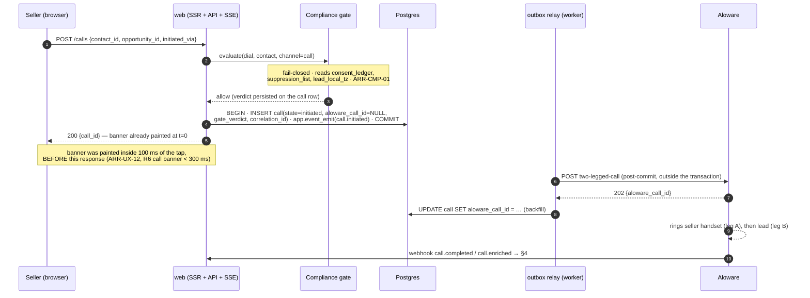
```mermaid
sequenceDiagram
  autonumber
  participant S as Seller (browser)
  participant W as web (SSR + API + SSE)
  participant G as Compliance gate
  participant DB as Postgres
  participant OB as outbox relay (worker)
  participant A as Aloware

  S->>W: POST /calls  {contact_id, opportunity_id, initiated_via}
  W->>G: evaluate(dial, contact, channel=call)
  Note over G: fail-closed · reads consent_ledger,<br/>suppression_list, lead_local_tz · ARR-CMP-01
  G-->>W: allow (verdict persisted on the call row)
  W->>DB: BEGIN · INSERT call(state=initiated, aloware_call_id=NULL,<br/>gate_verdict, correlation_id) · app.event_emit(call.initiated) · COMMIT
  W-->>S: 200 {call_id} — banner already painted at t=0
  Note over S,W: banner was painted inside 100 ms of the tap,<br/>BEFORE this response (ARR-UX-12, R6 call banner < 300 ms)
  OB->>A: POST two-legged-call   (post-commit, outside the transaction)
  A-->>OB: 202 {aloware_call_id}
  OB->>DB: UPDATE call SET aloware_call_id = … (backfill)
  A-->>A: rings seller handset (leg A), then lead (leg B)
  A->>W: webhook call.completed / call.enriched  → §4
```

**`call.initiated` is emitted *before* Aloware confirms, from inside the transaction that records the attempt; the external POST happens after commit, through the outbox** (ARR-EVT-18, `02b §4b` correction 1). `04-ux-flows.md` Flow 5 step D1 states the opposite — "emitted **only** on a 2xx" — and that line is **superseded here**. Under the 2xx-only rule, an Aloware 5xx arriving *after* the seller's handset already rang leaves a lead whose phone rang with no record, which is precisely what `attempt_count` exists to prevent. `aloware_call_id` is nullable at insert and backfilled; the partial unique index `call_aloware_uidx … WHERE aloware_call_id IS NOT NULL` exists for exactly this reason.

**Speed-to-lead stops on `call.completed` with a `connected` or `voicemail` outcome — never on dial initiation** (R1.1, normative; `02b §4b` correction 2). `verdict-v1.md` Puerta 12's line binding it to the 2xx is superseded by the normative ruling. `opportunity.first_touch_latency_seconds` is write-once by trigger, so the column is safe under either reading, but the *writer* is now decided: the merge job, and only when the canonical disposition is `connected` or `voicemail`. Binding it to the tap would make every no-answer dial report a fabricated ~21-second first touch on the one number that justifies the entire lead spend.

---

### 4. The inbound contract: ingestion

#### 4.1 Endpoint shape

```
POST https://in.<domain>/hooks/aloware/{endpoint_token}
POST https://in.<domain>/intake/{source_token}
```

Both resolve the tenant **from the token**, never from a phone number and never from a header. Token storage and resolution are identical to `intake_source`: hashed at rest, resolved through a `SECURITY DEFINER` function that returns ids only and increments its own rate meter, and listed as one of the enumerated cross-tenant paths. The tenant is never inferred from `to_number_e164`, because a number that is not in the identity map has no tenant and the inference would be a guess on the hot path of every inbound event.

#### 4.2 The edge algorithm — write-first, respond-fast, process-async (ARR-INT-04)

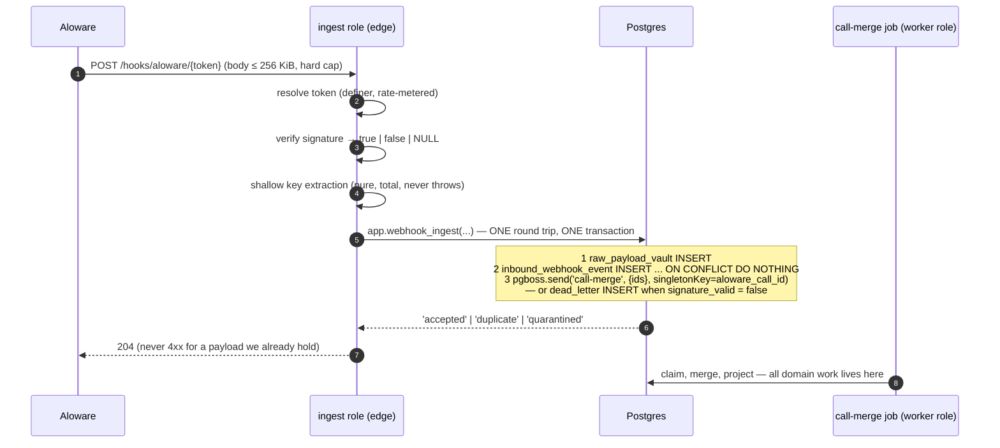
```mermaid
sequenceDiagram
  autonumber
  participant A as Aloware
  participant I as ingest role (edge)
  participant DB as Postgres
  participant J as call-merge job (worker role)

  A->>I: POST /hooks/aloware/{token}  (body ≤ 256 KiB, hard cap)
  I->>I: resolve token (definer, rate-metered)
  I->>I: verify signature → true | false | NULL
  I->>I: shallow key extraction (pure, total, never throws)
  I->>DB: app.webhook_ingest(...)  — ONE round trip, ONE transaction
  Note over DB: 1 raw_payload_vault INSERT<br/>2 inbound_webhook_event INSERT ... ON CONFLICT DO NOTHING<br/>3 pgboss.send('call-merge', {ids}, singletonKey=aloware_call_id)<br/>   — or dead_letter INSERT when signature_valid = false
  DB-->>I: 'accepted' | 'duplicate' | 'quarantined'
  I-->>A: 204 (never 4xx for a payload we already hold)
  J->>DB: claim, merge, project — all domain work lives here
```

Five rulings, each of which is a defect if inverted:

1. **One database round trip per webhook.** `app.webhook_ingest()` performs the vault write, the transport-dedupe insert and the job enqueue inside one transaction, in one call. Three separate statements means three network round trips, which at 333/s is three times the connection-seconds against the one resource both topologies share. This is the single largest lever on storm capacity.
2. **The edge never parses business meaning.** It performs a *shallow key extraction* to fill `provider_event_id`, `aloware_call_id`, `provider_message_id`, `from_number_e164`, `to_number_e164`. That extractor is a pure function that **cannot throw**: any failure yields all-nulls and the row is stored anyway with `parse_status='unparsed'`. Mechanism: a `fast-check` property test feeds it 10⁴ adversarial inputs — truncated JSON, non-JSON bytes, deeply nested objects, duplicate keys — asserting it never throws and never exceeds a 1 ms budget. A parser that throws at the edge turns a mapping bug into data loss, which is the exact thing ARR-INT-04's vault exists to prevent.
3. **Signature-invalid means stored and dead-lettered, never rejected.** `signature_valid` is `boolean NULL` **on purpose**: the spike has not established whether Aloware signs at all, and a `NOT NULL` column would force us to record a lie (ARR-INT-02). `false` → the row is vaulted, a `dead_letter(origin='inbound_webhook')` row is written, the admin counter increments, and no job is enqueued (ARR-INT-07). `NULL` → processed normally, and the fact that we cannot verify is a permanent visible line on `/admin/integration-health`, not an omission.
4. **We never return 4xx for a payload we already hold.** A `4xx` invites a well-behaved provider to stop retrying, and we already have the bytes; a `5xx` invites a retry we do not need. `401` is returned only for an unknown endpoint token, where nothing is stored — the same deliberate asymmetry as intake, where an unknown token writes nothing but a valid token with no usable phone or email returns `422 phone_or_email_required` **and still persists the raw body**.
5. **The response never waits on domain work.** The 204 is returned once the bytes are durable. The provider's synchronous-response requirement is unmeasured and is a gate assertion (§9, G2): if Aloware demands sub-second and our edge p99 is 40 ms, write-first is comfortable; if it demands sub-100 ms, the ingest role's admission bound moves and nothing else does.

#### 4.3 Webhooks we receive, mapped to canonical events

| Aloware webhook | Canonical event | Natural key | Consumer |
|---|---|---|---|
| Call disposition (any outcome, in/outbound) | `call.completed` | `aloware_call_id` | `call-merge` |
| Recording ready | `call.enriched` `parts_available=[recording]` | `aloware_call_id` | `call-merge` (updates in place) |
| Transcription ready | `call.enriched` `[transcript]` | `aloware_call_id` | `call-merge` |
| AloAi summary | `call.enriched` `[ai_summary]` | `aloware_call_id` | `call-merge` |
| Inbound SMS | `message.received` | `provider_message_id` | `message-merge` |
| SMS delivery status / failure | `message.delivery_failed` | `provider_message_id` | `message-merge` |
| Missed inbound call | **not a separate event** — `call.completed` with `direction=inbound`, `disposition_canonical=missed` | `aloware_call_id` | `call-merge` |

Three provider webhooks collapse into **one** internal `call.enriched` with `parts_available[]` so consumers need one handler, not three (`02b §4`). `integration.mapping_verified` is the canonical name for the verification event — this resolves the collision `04-ux-flows.md` flagged, where US-601 emitted `aloware.mapping_verified` and US-9.12 emitted `aloware_map.verified` and neither existed in the catalog. Both are bugs; the catalog name wins, and the `app.event_name` enum makes writing either of the others fail at write time (ARR-EVT-02).

#### 4.4 The idempotency ladder — one pattern, four keys (ARR-INT-05)

| Layer | Key | Table | Behaviour on second delivery |
|---|---|---|---|
| Transport | `(tenant_id, provider, provider_event_id)` | `inbound_webhook_event` | `204` in under a millisecond; no job enqueued. This is what lets a 20 000-webhook replay storm land without touching the domain at all. |
| Call | `(tenant_id, aloware_call_id)` | `call` | Merge, never insert. |
| Message | `(tenant_id, provider_message_id)` | `message` | Merge, never insert. |
| Money | `(tenant_id, source_event_id)` | `earnings_ledger` | `ON CONFLICT DO NOTHING`; returns `already_credited`; **logged as a success path, never surfaced as an error**. |

All four are real unique indexes. None is an application check-then-insert, because two concurrent deliveries both pass a check and only a unique index is a constraint under concurrency.

#### 4.5 The merge, and out-of-order tolerance (ARR-INT-06)

**One job, one queue, one key.** Queue `call-merge`, `singletonKey = aloware_call_id`, with the singleton key **in the handler's type signature so omitting it does not compile** (thesis non-negotiable 9). Two webhooks for the same call 50 ms apart are serialized by the queue, not by a `SELECT`-then-`UPDATE` that loses one of them. The ingest handler never merges.

The merge is a **declared field table**, not a hand-written `UPDATE`:

```ts
const CALL_MERGE: Record<MergeableCallField, 'additive' | 'corrective'> = {
  recording_url:   'additive',    // COALESCE(new, old) — order-free
  transcript_url:  'additive',
  ai_summary_text: 'additive',
  disposition_raw: 'corrective',  // applied only if provider ts >= provider_last_event_at
  talk_time_seconds: 'corrective',
  …
};
```

- **Additive** fields use `COALESCE(new, old)`: a late recording webhook cannot erase a transcript that arrived earlier.
- **Corrective** fields are guarded by the provider's own timestamp against `call.provider_last_event_at`, not by arrival order.
- `state_ordinal` is monotonic by `BEFORE UPDATE` trigger: a late `ringing` can never regress a `completed` call.

Two mechanisms make this hold forever:
- `MergeableCallField` is derived from the `call` column union, so **adding a merge-relevant column without classifying it fails typecheck**.
- A property test permutes the arrival order of a fixed webhook set and asserts the final row is **identical across every permutation** — which is ARR-INT-06's actual requirement ("final state must equal in-order state") expressed as a test rather than as prose. The symptom of getting this wrong is a timeline entry that looks perfectly fine and is merely missing its transcript, which nobody reports.

`call.enriched` **updates the existing `timeline_entry` in place** via `timeline_ref_uidx UNIQUE (tenant_id, ref_type, ref_id)`; it can never create a second row (ARR-EVT-17, ARR-EVT-22). The timeline is a derived projection with a write monopoly held by `app.timeline_upsert()`, so "the timeline is never written directly" is a `permission denied`, not a code-review rule.

#### 4.6 Dead-letter and replay (ARR-INT-07)

Nothing is ever discarded. Three origins land in one `dead_letter` table: a signature-invalid webhook, an outbox delivery that exhausted its backoff, and a pg-boss job that died `max_attempts` times. `UNIQUE (tenant_id, origin, subject_type, subject_id)` means a subject dead-letters once and a second failure increments `attempt_count` instead of generating noise. The raw body is **retained by reference** — `raw_payload_id` FK into `raw_payload_vault` — never copied, so the DLQ inherits the vault's retention clock and does not become a second PII store (ARR-PRV-02).

Replay is an admin-only `SECURITY DEFINER` function that re-enqueues the merge job from the vault row. It is the same job. There is no separate replay code path, which is why replay cannot drift from the live path.

**The counter is a product surface, not a log.** `/admin/integration-health` renders live rows: DLQ depth, unmapped-number alerts, unmapped-disposition alerts, unverified mappings, non-human attempts on an earning stage, ingest 429 count, event-loop p99, and reconciliation gaps. All five ARR-mandated health signals are materialized as `admin_alert` rows rather than reconstructed from logs.

---

### 5. The identity map, and the hole in the verification story

`aloware_number_mapping` binds seller ↔ Aloware user id ↔ outbound E.164, with `UNIQUE (tenant_id, from_number_e164) WHERE revoked_at IS NULL` and `UNIQUE (tenant_id, user_id) WHERE revoked_at IS NULL`. One number, exactly one seller; one live mapping per seller; a shared outbound line is forbidden by index rather than by rollout checklist (ARR-INT-11, US-601).

**Resolution is a total function with four outcomes and no default branch:**

```ts
type OwnerResolution =
  | { kind: 'resolved';   userId: UserId }
  | { kind: 'unverified'; userId: UserId }        // mapping exists, status <> 'verified'
  | { kind: 'challenge';  challengeId: ChallengeId }
  | { kind: 'unmapped' };
```

| Outcome | What happens | What the admin sees |
|---|---|---|
| `resolved` | Normal attribution. | — |
| `unverified` | Vaulted, **written to no book**, `unmapped_inbound_quarantine` with reason `mapping_unverified`. | "A call is waiting on a verification you have not finished." |
| `challenge` | Routed to the open verification challenge. **Never to a book.** | The verification row updates. |
| `unmapped` | Vaulted, quarantined, `admin_alert(kind='unmapped_number')`, `occurrence_count` increments. Never dropped, never guessed. | `1 call from a number we do not recognize. Nothing was written to a seller's book.` |

An unverified mapping also disables Call and Text on **every** surface that seller can open, with the fixed copy `Your calling number isn't verified yet. Ask your admin to finish setup.` The call-state banner is hidden entirely, not shown-and-broken.

#### 5.1 The latent defect the corpus already documented, and the fix

`04-ux-flows.md` Flow 4 narrates the exact failure: an admin types the wrong number against a seller, presses **Verify number**, the test dial goes out, the webhook returns `agent_id = U_9042` — *which is exactly what was typed* — and the mapping flips to verified. **Verification proved that the number and the Aloware user agree with each other. It cannot prove that the human behind that Aloware user is the CRM user named on the row.** Nothing was wrong on any screen for seven days, and a lead's callback landed in a stranger's book.

**Ruling: verification is three-way and the third leg is the seller's own session.**

1. Admin presses **Verify number** on seller S's row → a `mapping_verification` challenge row is created (code, `expires_at`), and a two-legged test dial is placed to the mapped number.
2. The inbound webhook must return an `agent_id` matching the mapping. *(Leg 1 — proves number ↔ Aloware user.)*
3. **Within the challenge window, seller S — from S's own authenticated session — presses "I answered this call."** Not the admin. Not another seller. *(Leg 2 — proves Aloware user ↔ the human on file.)*

In the documented defect, Renata's handset rings; Tomás cannot press the button, so the mapping never flips and stays `Not verified — leads will not route here yet`. If Renata presses it from her own session, the acting user id does not match the mapping's `user_id`: the attempt is refused and writes `admin_alert(kind='mapping_actor_mismatch')`.

**Mechanisms, not procedure:**
- Additive columns on `aloware_number_mapping`: `verification_challenge_id`, `verified_by_user_id`, `verification_expires_at`.
- `CHECK (status <> 'verified' OR (verified_by_call_id IS NOT NULL AND verified_by_user_id = user_id))` — a row cannot *be* verified without carrying the proof.
- The confirm endpoint is owner-scoped; the acting user is read from `app.current_user_id()` inside the definer function and **never accepted from the payload**, so the RLS policy itself is what prevents a cross-seller confirmation. A supervisor or admin hitting the confirm endpoint gets the owner-scoped not-found, per ARR-PRV-04's route extension.
- Re-verification of a pair whose `agent_id` now conflicts with the seller on file is refused, and the row falls back to unverified — which immediately disables Call and Text for that seller. The defect becomes visible in the room, not inferred from a log.

---

### 6. The two-legged call: state machine, transport, and the silent gap

The seller's handset rings first; the lead's rings 5–15 seconds later. `--time-dial-silence-max = 15000ms`. Those seconds are the worst moment in the product, and they are a UI-state problem (ARR-INT-03).

#### 6.1 The banner is a pure function of (server state, elapsed)

The banner lives in app-shell state **above the router outlet**, portaled to its own layer above the modal stack with an explicit z token, `role="status"`, never focus-stealing, one banner per seller ever (ARR-UX-12). It survives route changes and drawer opens; a component inside the board route dies the moment the seller opens the record drawer.

**Ruling: the client holds no call state machine.** The banner renders `f(serverState, elapsedSinceTap)` — a pure, total function. Client timers may only ever *escalate presentation*; they may never advance, invent or cancel a call state. This deletes the entire class of "banner stuck in a state" bugs, including the one where a `connected` frame arriving after the 20-second amber state leaves the seller looking at a failure notice during a live call.

| Server `call.state` | Elapsed | Visible copy (string-catalog key) | Notes |
|---|---|---|---|
| *(pre-response)* | 0–300 ms | *(a11y only)* `a11y.comms.call.checking` — "Checking the calling window." | **Ruling E: `Checking` is a11y-only, never a visible state.** A visible state that flashes for under the API p95 reads as a bug on a projector. |
| `initiated` \| `ringing` | t=0 | `comms.call.ringing` — "Calling {first_name} — ringing your phone…" | Painted within 100 ms of the tap. R6: tap→banner < 300 ms. |
| `initiated` \| `ringing` | t=6 s | + sub-line `comms.call.ringing_hint` — "Answer your phone first. Then we dial {first_name}." | **This sentence is the entire answer to the silent gap and the only thing that stops the double-tap.** |
| `initiated` \| `ringing` | t=12 s | + "Still ringing your phone — 12s." | |
| `initiated` \| `ringing` | t=20 s | `comms.call.no_leg_a` — "Your phone didn't ring. Call from your phone and we'll log it." + `tel:` + Log a call | Amber. **Presentation only** — the call is not cancelled and nothing is written. |
| `ringing` (leg A answered, leg B dialing) | — | `comms.call.connecting` — "Dialing {first_name}…" | **Not** "Connecting to…", which collides with the `Connected` outcome chip (Ruling E). |
| `connected` | — | `comms.call.connected` — "Connected · {timer}" | Tabular numerals so the width never jitters. |
| `completed` \| banner closed | — | `comms.call.wrapup` — "Wrap up" | **The wrap-up sheet opens on banner close, not on the webhook** (R2.4). The seller is never blocked by a third party; a later webhook enriches the entry in place. |

A unit test asserts the function is **total** over the cross-product of `app.call_state` × elapsed buckets. A new call state without a rendering is a failing test, not a blank banner.

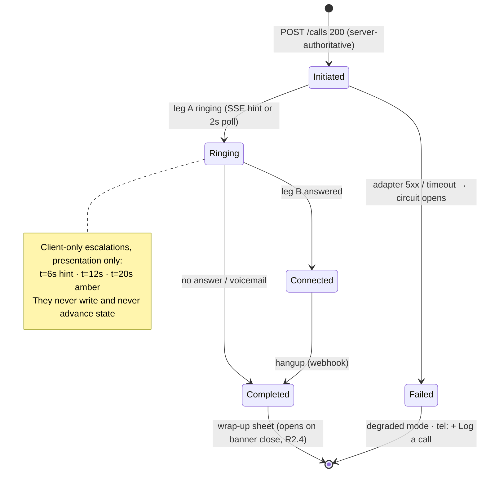
```mermaid
stateDiagram-v2
  [*] --> Initiated: POST /calls 200 (server-authoritative)
  Initiated --> Ringing: leg A ringing (SSE hint or 2s poll)
  Ringing --> Connected: leg B answered
  Initiated --> Failed: adapter 5xx / timeout → circuit opens
  Ringing --> Completed: no answer / voicemail
  Connected --> Completed: hangup (webhook)
  Completed --> [*]: wrap-up sheet (opens on banner close, R2.4)
  Failed --> [*]: degraded mode · tel: + Log a call

  note right of Ringing
    Client-only escalations, presentation only:
    t=6s hint · t=12s · t=20s amber
    They never write and never advance state
  end note
```

#### 6.2 Transport: push is a hint, poll is the truth

`ARR-UX-11` is explicit that no channel in the Phase-4 polling contract delivers leg-A answer, leg-B answer or `call.completed` to the client, and that Phase 5 must decide. **The decision:**

- **SSE from the web process**, one stream per session, fed by a **single dedicated `LISTEN` connection** taken outside the pool.
- **SSE frames carry `(channel, seq)` and nothing else.** No lead data, no names, no money. The client receives "channel *board* moved to seq N" and revalidates with a conditional GET. Two consequences: (i) a fan-out bug cannot leak another seller's row, because the frame contains no row — the tenant-wide leaderboard channel included (ARR-EVT-23's restricted payload arrives via the GET, under RLS); (ii) the frame vocabulary is a closed union that a CI test asserts contains only the channel enum, a `bigint` and a `uuid`.
- **The call-state poller runs at 2 s for the entire duration of a live call, always, regardless of SSE health.** It is a conditional GET against `channel_watermark (tenant_id, owner_user_id, 'call_state')` — a single-row primary-key lookup answering `304` in single-digit milliseconds. Bounded to ~50 concurrent callers tenant-wide, which is ~25 rps of index-only lookups: free.

**Why the poller is not a fallback.** `NOTIFY` delivers only to sessions listening at that instant — no buffer, no replay, no cursor. If the dedicated `LISTEN` connection drops and reconnects (rolling redeploy, node recycle, database maintenance, idle timeout, OOM), every `NOTIFY` in that window is lost **while the browser's SSE connection stays alive with heartbeats**. No reconnection fires, the fallback never arms, and `transport-in-use` reports SSE and reports the truth: the transport *is* SSE, it simply delivers nothing. A fallback that only runs during incidents is code that is tested in production, the first time, under pressure. Making the poll the correctness floor and SSE the accelerator means the incident path is the path that runs every day.

This is a **per-channel** reading of ARR-EVT-24, as Puerta 12 requires: `call_state` p95 < 2 s from provider webhook to banner (poll floor 2 s, SSE hint typically sub-second); the leaderboard's honest number is the undo window plus latency, because ARR-MVP-10 imposes it and no transport can beat it.

**The synthetic check is two-legged** (thesis non-negotiable 5): a headless SSE subscriber against the demo tenant, plus a ledger write, asserting *both* that the leaderboard ETag changed within 10 s on the polling path *and* that the subscriber received the frame within 10 s on the push path. A one-legged ETag-only check is green while the public money board is frozen for all fifty.

---

### 7. The ingestion bulkhead against the retry storm

**The threat, precisely:** 20 000 webhooks in 60 seconds — 333/s — which is what a provider does when it recovers from *our* 20–45 minute outage. This is not the "200 in 10 seconds" scenario that circulates; that is 20 rps and nobody feels it.

#### 7.1 Split topology (Tier 2)

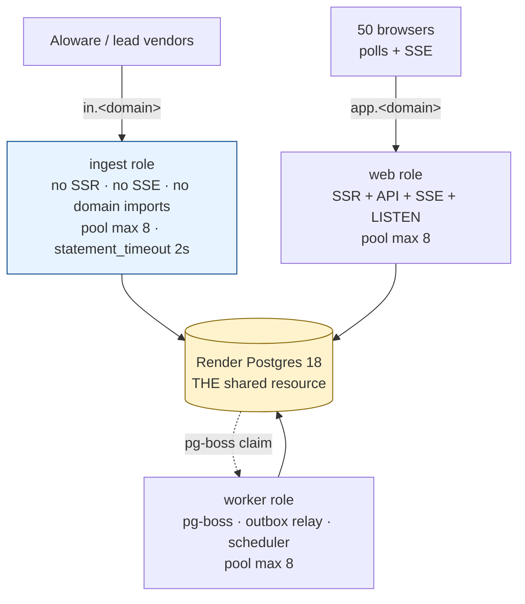
```mermaid
flowchart TB
  ALO["Aloware / lead vendors"] -->|"in.&lt;domain&gt;"| ING["ingest role<br/>no SSR · no SSE · no domain imports<br/>pool max 8 · statement_timeout 2s"]
  BROWSER["50 browsers<br/>polls + SSE"] -->|"app.&lt;domain&gt;"| WEB["web role<br/>SSR + API + SSE + LISTEN<br/>pool max 8"]
  ING --> PG[("Render Postgres 18<br/>THE shared resource")]
  WEB --> PG
  WRK["worker role<br/>pg-boss · outbox relay · scheduler<br/>pool max 8"] --> PG
  PG -.->|"pg-boss claim"| WRK
  style ING fill:#e7f3ff,stroke:#004085
  style PG fill:#fff3cd,stroke:#856404
```

The bulkhead is **not** the process boundary alone — Postgres is shared. It is three things together:

1. **Static per-role pool caps.** `ingest` cannot consume more than its `max` no matter how hard it is hit, so it cannot starve the web pool. Caps are sized against the **measured** connection ceiling with 2× headroom for a rolling redeploy (G1), not against a number from a pricing page.
2. **`statement_timeout` on the ingest role set to 2 s.** Every ingest statement is sub-millisecond by construction; a 2-second statement means something is wrong and we want it dead rather than holding a connection through the storm.
3. **Admission control that bounds concurrency, never the write.** A bounded FIFO in front of `app.webhook_ingest` with a fixed in-flight limit. `429 + Retry-After` is returned **only** when the queue depth cap is exceeded — because a provider that may not retry (ARR-INT-02) makes a 429 a lost webhook, and the reconciliation backfill is the only thing that recovers it. Shed load at the *last* possible point, never at the first.

Import isolation is a build rule: `src/ingress/**` may not import `src/domain/**`, `src/ui/**` or `src/realtime/**`. **The ingest role cannot execute domain code because it cannot link it.**

#### 7.2 Folded topology (Tier 1) — what degrades and how it announces itself

In the folded tier all three roles share one event loop and one 0.5 vCPU. The edge cost per webhook is roughly TLS + HTTP parse + HMAC over a small body + a shallow extract + one DB round trip ≈ **0.4–0.8 ms of CPU**. At 333/s that is 130–270 ms of CPU per second — **27–53 % of a full core, i.e. 53 % to over 100 % of a 0.5 vCPU instance.** The folded tier at 333/s is at or past the edge, and this document says so rather than discovering it later.

**The reason that is acceptable is the reason the tier exists:** the storm scales with the fleet. Two or three pilot sellers generate on the order of 600–1 200 webhooks a day, so a full-recovery replay is ~1 200 events — roughly 20 seconds at 60/s, which the folded process absorbs without a visible symptom. **The folded topology is safe precisely in the regime in which it is used, and the threshold is computed rather than guessed** (below).

| What degrades under a folded storm | Detection mechanism | Where Jorge sees it |
|---|---|---|
| SSR + API p95 (shared event loop) | `perf_hooks.monitorEventLoopDelay` histogram sampled per process; **p99 > 200 ms sustained 60 s → `admin_alert(kind='folded_topology_saturated')`** | `/admin/integration-health`, with the literal remediation: "Split the processes." |
| `304` p95 breaches the 80 ms floor | The same event-loop alert plus the existing Better Stack latency monitor | Alert + the admin page |
| SSE heartbeat jitter → clients enter the stale-connection state | The client's own three-state stale-connection UI (04b) — **a visible symptom by design** | Every seller's screen, immediately |
| Job latency; the T-1h reminder fires late | `scheduled_job.status = 'dropped_late'` when more than 15 minutes late — an auditable **terminal row**, not a log line | Rising `dropped_late` count on the admin page |
| Heavy jobs (export, archive, replay) crowd the loop | `weight='heavy'` runs at concurrency 1 with a 200 ms cooperative batch budget; backlog depth is a rendered number | Admin page backlog |
| Ingest sheds | The 429 counter | Admin page |

**The trip is mechanical, not editorial.** From the G6 storm measurement we obtain `cpu_ms_per_webhook`. The split threshold is stored as `system_constant['fold_split_webhooks_per_day_max']`, computed as the daily volume whose 60-second replay would consume more than 35 % of the instance's vCPU. The admin page renders *current 7-day inbound volume against that number*. Crossing it raises `admin_alert(kind='topology_split_required')`. Jorge does not have to remember a rule of thumb; the system tells him when the cheap tier stopped being cheap enough.

**Executing the split:** change `ROLES` on three services and repoint one CNAME. No code change, no migration, no vendor reconfiguration. And because the split path is exercised in the nightly CI tier (§9, G5), it is never run for the first time under pressure.

**Honest residual:** Node cannot preempt a handler that hogs the event loop. The folded tier detects a stall and attributes it to a job name via `AsyncLocalStorage`; it cannot prevent one. That is detection, not prevention, and it is stated as such.

#### 7.3 The reconciliation backfill (ARR-INT-08)

A `scheduled_job(kind='reconciliation_backfill')` runs hourly inside tenant business hours, queries the Aloware call-list API over `[now − 26h, now − 5m]`, and for every `aloware_call_id` absent from `call` **synthesizes an `inbound_webhook_event` at the ingest edge**. It does not write the domain. `src/jobs/reconciliation/**` may import only `src/ingress/**` and `src/adapters/aloware/**`, enforced by dependency-cruiser — **a backfill can never write something a webhook could not**, so it inherits every idempotency key, every merge rule and every quarantine path for free.

The documented hazard is that a silent backfill retroactively changes staleness and activity counts with no event emitted. Closed two ways: the recovered timeline entry carries `render_payload.recovered = true` and renders as *"Recovered from Aloware"*, and every gap increments `admin_alert(kind='reconciliation_gap')` with an occurrence count. A webhook gap becomes a number on a screen.

---

### 8. Degraded mode and SMS-dark launch

#### 8.1 The circuit breaker is a row, and probe staleness is itself the degraded condition

Opens after **3 consecutive 5xx/timeouts inside 60 s**, probes every **30 s**, closes on **2 consecutive successes** (ARR-INT-09). The state cannot live in per-process memory — it must be shared across every process and reach ~50 open browsers. It is a row:

```
app.integration_health (tenant_id, provider, state, consecutive_failures,
                        opened_at, last_probe_at, last_probe_result, next_probe_at)
```

Three rulings:

- **Any process may OPEN the circuit; only the probe job may CLOSE it.** A lucky success on one seller's request cannot close a broken circuit for the floor.
- **The banner state is computed at read time as `state = 'open' OR last_probe_at < clock_timestamp() - interval '5 minutes'`.** ARR-INT-09 requires that if the health probe itself cannot run, the banner stays red. Making probe *staleness* a degraded condition means a dead worker **cannot** present a green banner — the same read-time-expiry shape as break-glass, and it needs no watchdog job that could itself die.
- **Delivery reuses the existing plumbing.** A state change bumps `channel_watermark(tenant_id, ZERO_UUID, 'degraded_banner')`; the banner arrives on the same poll/SSE path as everything else. No new channel, no new transport, no second realtime consumer to budget.

**What degrades: the transport. What never degrades: the gate** (ARR-INT-10). Every Call button relabels to **Call from my phone**, a `tel:` link is offered, and the Log-a-call sheet opens pre-filled. **The compliance gate runs first on every tap, exactly as on the API path**, and if the gate's own inputs (consent, suppression, timezone) are unavailable it fails closed regardless of transport. The gate is a standalone server-side service, callable independently of the dial service — it is not a pre-step inside the Aloware client, because then its availability would be Aloware's availability.

Manual rows are stamped `call.source = 'manual_degraded'` and render as `Logged manually`, so the difference is visible forever.

#### 8.2 Manual-degraded call vs. late webhook — the corpus's unsolved dedupe

`04-ux-flows.md` states plainly that after a degraded window "a manual entry and a late webhook for the same physical call can both land," and no dedupe rule exists anywhere in the corpus. Left unsolved it corrupts `attempt_count`, `last_activity_at`, the 7-day cold rule and the rot badges.

**Ruling.** The `call-merge` job, on a webhook call with no matching `aloware_call_id`, looks for a `call` row with `source='manual_degraded'`, the same `(tenant_id, contact_id, direction)`, `started_at` within ± `system_constant['manual_merge_window_seconds']` (default 600), and `merged_manual_call_id IS NULL`. If found, it **merges into that row** and sets `merged_manual_call_id`; otherwise it inserts. Supported by a partial index `call_manual_merge_idx (tenant_id, contact_id, direction, started_at) WHERE source='manual_degraded' AND merged_manual_call_id IS NULL`, so the lookup is bounded to the outage window's rows.

Deterministic, cheap, one source for the window constant. **Residual, documented rather than hidden:** two dials to the same lead inside ten minutes during an outage merge into one. The seller sees it — the merged entry reads *"Logged manually · matched to an Aloware call"* — which makes the false negative visible rather than silent.

#### 8.3 SMS-dark launch (10DLC pending **or rejected**)

`tenant.sms_enabled` is a typed column, `NOT NULL DEFAULT false`. The launch ships dark and turns on later, or never.

| | Behaviour |
|---|---|
| **What turns off** | Every SMS *send*. Nothing else. |
| **What the seller sees** | Every Text entry point **rendered and disabled, never hidden**, under one banner: *"Texting is pending carrier registration (10DLC). Calling works normally."* (R3.4 — the banner never advertises email; email is V1.1.) SMS threads render inbound history with a **disabled composer**. Appointments read `Reminder off — texting is pending registration.` |
| **What still works** | Calling, logging, notes, scheduling, the pipeline, the gate, Earnings, the leaderboard. The MVP critical path is **call-only-viable** by construction (ARR-CMP-09): no lifecycle link depends on SMS. |
| **The reminder job** | Still enqueued unconditionally. At **fire time** the gate re-evaluates from `subject_id` — the payload carries no precomputed decision — and the job resolves to the terminal state `skipped`, `terminal_reason='skipped: sms_disabled'`, with a timeline entry. It does not error and does not retry. |
| **When the flag flips** | `admin.setting_changed` audit row; send buttons enable on the next page load; **previously skipped reminders are NOT back-sent.** |
| **If 10DLC is REJECTED** | Nothing architectural changes. The flag stays `false` and one string-catalog key changes. That is the entire point of making it a flag rather than a launch step. |

**The enforcement is the gate, never the UI** (ARR-CMP-08, ARR-MVP-27). Two mechanisms:

- `alowareSms.send()` requires a `GateVerdict<'allow'>` token that only the compliance gate can mint. **A route that skips the gate does not compile.** The UI's disabled state is a courtesy; the gate is the control.
- **The full acceptance suite runs a second time with `sms_enabled=false` in the nightly CI tier, and must pass with no path erroring** — which is exactly what ARR-MVP-27 demands, and which is only possible because configuration is injectable into tests rather than read from module-level constants.

---

### 9. The Sprint-0 gate ladder

One consolidated, ordered list, merging `thesis.md` Puertas 0–12 and `verdict-v1.md` Puertas 1–12. Each gate has a **verifiable assertion** and an explicit **failure criterion**. Ordering is by *how much work a late failure destroys*, not by convenience. Gates G0–G2 verify facts about the outside world; G3–G5 verify the mechanical foundations everything else stands on; G6–G9 verify behaviour under load; G10–G12 fix the numbers that go into CI; G13 closes the paper contradictions before anything is built on them.

---

**G0 · US region on the plan we will actually buy.** *Before any resource is created and before one line is written.*
- **Assert:** the workspace tier we intend to pay for permits creating web services, background workers **and** Render Postgres in a US region (Ohio or Virginia), confirmed against the provider's own current documentation and by actually opening the region selector on the create form.
- **Fail:** if US region is not available on that plan, the stack decision is **retroactively void** by the owner's own condition 3. Runner-up (Rails on DigitalOcean) is signed and not debated. This is the only open item capable of eliminating the winner, the evidence is split across two audits, and a gate is not compensated by a score.

**G1 · Platform truth probe: what the managed database actually gives us.**
- **Assert:** (a) real `max_connections` read from the instance, not assumed; (b) a rolling redeploy under load produces **zero** `too many connections` — the design sustains ~24 connections (3 × max 8) which transiently doubles to ~48; (c) the bundled PgBouncer in **transaction mode** preserves `SET LOCAL` context inside an explicit transaction and does **not** leak it between requests; (d) per-pool `max` pinned against the measured number with 2× headroom; (e) extension availability: `pg_trgm`, `citext`, **`btree_gin` with a uuid opclass**, and `uuidv7()`; (f) whether `CREATE EVENT TRIGGER` is granted.
- **Fail:** if `btree_gin`/uuid is unavailable, the search index falls back to plain trigram GIN plus an owner recheck — acceptable at 25k contacts but it **must be measured against the 200 ms p95 here, not assumed**. If the connection ceiling is low and the pooler is unusable, the only exit is folding ingest into web permanently, which weakens the bulkhead — record it as a topology constraint, not a surprise. Event triggers are **belt-and-braces only**: `security.harden()` as the last statement of the pre-deploy migration must remain the primary, because a design that depends on superuser on managed Postgres is a design that breaks on a provider upgrade.

**G2 · Aloware, against the real account.** *Hard gate by ARR-INT-01 and ARR-MVP-31; blocks all dependent UI in Communications, Calendar, pipeline quick actions and Leaderboard. Start the 10DLC filing in parallel — it is external, third-party-approved and rejectable, and its ownership (the agency's entity vs. ours) is an owner decision nobody else can make.*
- **Assert:** two-legged dial end to end; **whether webhooks are signed and with what scheme**; whether they **retry** and with what backoff; duplicate and out-of-order delivery observed; the **real disposition vocabulary**; missed-call events; whether the recording announcement fires on the two-legged path; the **actual 10DLC status**; the **burst shape** (OQ-2 — the 10 000–20 000 webhooks/day figure is an assumption carried since Phase 0, not a measurement); the existence of a **call-list API** for ARR-INT-08; **and the question no candidate asked: does the provider require a synchronous response below ~1 s**, because that number decides whether write-first/respond-fast is comfortable or tight.
- **Acceptance surface (US-601):** an unverified mapping accepts **neither dial nor webhook**, and one E.164 maps to exactly one seller — now including the third leg of §5.1.
- **Fail:** `two_legged_call` or `webhook_subscription` absent → the MVP is not shippable and this escalates immediately. Call-list absent → ARR-INT-08 has no implementation; record the compensating control and the permanent alert. Recording announcement does not fire on the two-legged path → **disable recording at the Aloware account level for the MVP** (ARR-CMP-10 / D9); that is a legal risk acceptance and it is Jorge's, not the architecture's.

**G3 · The money path, before a single screen exists.**
- **Assert:** (a) any `UPDATE`/`DELETE` on `earnings_ledger`, `audit_log`, `consent_ledger` or `suppression_list` is **rejected**, including an accidental `onConflictDoUpdate` **and including from the provider's SQL console** — which is what proves the trigger, not merely the `REVOKE`, is in place; (b) the close-gate transaction (gate check → `stage_transition` → stage write → `ledger_append` → projection → watermark → `event_emit` + outbox rows) commits or fails **as one unit**; (c) a second delivery of the same `source_event_id` is rejected by the unique index and treated as a **success** path — logged, total unchanged, not surfaced; (d) money crosses every seam as integer cents and a monetary field typed as plain `number` **breaks CI**; (e) `annualize()` exact over 10⁵ random values under `fast-check`; (f) `idle_in_transaction_session_timeout` set on every role, and a process killed mid-gate leaves no lock on the opportunity row or the leaderboard watermark.
- **Fail:** any one of these red → nothing is built on top. The ledger has no recompute job by design; losing or corrupting it is total and permanent, and it is the reason the paid Postgres with backups is the one non-negotiable line.

**G4 · The silo, end to end, and the boot assertion.**
- **Assert:** (a) the app **refuses to boot** when the connection user owns the schema — proven by deliberately pointing it at the superuser string `docker compose` hands out by default, because the development environment trains the broken configuration with perfect fidelity; (b) a query with no context returns **zero rows** under FORCE RLS in all five execution contexts (request, pg-boss job, webhook consumer, CSV importer, export); (c) a job running immediately after a request on the **same pooled connection** inherits none of that request's context; (d) the `pg_class` catalog gate enumerates every relation and breaks on any without `relrowsecurity AND relforcerowsecurity`, or without a policy, with the versioned exception list published and each entry carrying its written reason; (e) every policy has **both** `qual` and `with_check`, and no policy has `cmd <> 'ALL'`; (f) a seller session cannot produce `scope_mode = tenant_read`; (g) the same board URL fetched as two different sellers returns different bodies and **no response carries a shared `Cache-Control`**.
- **Fail:** any red → the silo is not demonstrated, and a silo that is not demonstrated is a silo that works perfectly in the lab while fifty sellers see the whole book with no error, no warning and no log line.

**G5 · Topology fold/split equivalence.** *(New — required by the deployment-configuration ruling in §2.)*
- **Assert:** (a) the app boots in all four `ROLES` configurations; (b) the **union** of units mounted across `web`, `worker`, `ingest` equals the unit registry exactly — a unit belonging to no role, or to two roles that both run it, fails the test; (c) the identical E2E acceptance suite passes against the folded deployment and against the split deployment, with **no test aware of which is running**; (d) `in.<domain>` resolves to the folded service and, after a CNAME repoint only, to the ingest service, with the same webhook and intake URLs unchanged; (e) the grep gate proves no `/hooks/` or `/intake/` literal exists outside `src/ingress/urls.ts`.
- **Fail:** if any behaviour differs between topologies, the split is not configuration and the cheap tier is a trap. This gate runs on the nightly tier forever after, so the split path is never executed for the first time in production.

**G6 · The retry storm — run in BOTH topologies.**
- **Assert:** replay **20 000 webhooks in 60 seconds (333/s)** while 50 simulated sellers sustain the polling floor. In split topology: `304` p95 ≤ 80 ms, API p95 ≤ 300 ms, **zero webhooks lost**, and zero lost-update on the per-field `call.enriched` merge with the singleton key active. In folded topology: the same run, recording `cpu_ms_per_webhook`, event-loop p99, 429 count, `dropped_late` count — and asserting that **the event-loop alert and the `folded_topology_saturated` admin row actually fire** rather than the process silently degrading.
- **Number corrected here:** the Starter instance is **0.5 vCPU, not a core**, so expected edge saturation in the folded tier is 53–100 %+, not 33 %, before TLS, parse, signature and the round trip. If it does not hold, the instance step is +USD 18 and stays under the ceiling — but the folded tier's honest ceiling is the number we publish.
- **Fail:** any webhook lost → the write-first design is not implemented as specified. `304` p95 blown in split topology → the bulkhead is not a bulkhead. In folded topology, degradation is **allowed**; degradation that is *silent* is not.
- **Output that goes into the product:** `system_constant['fold_split_webhooks_per_day_max']`, computed from the measured `cpu_ms_per_webhook`.

**G7 · SSE behind the platform proxy, and the failure nobody proposed testing.**
- **Assert:** 50 SSE connections held for 8 continuous hours with a 20 s heartbeat — measure buffering, idle timeout and exact behaviour during a rolling redeploy. **Then kill and re-establish the dedicated `LISTEN` connection while all 50 browser SSE connections stay open, and verify the two-legged synthetic check detects it.** Also assert the call-state poller keeps the banner correct with SSE fully dead, and that the SSE frame union carries no domain payload.
- **Fail:** if SSE is not viable behind the proxy, the swap is identified **now**, not later; the poll-is-truth design means the product still functions on the poller alone, which is exactly why the poller is not a fallback. If the synthetic check does not go red on a killed `LISTEN`, the check is one-legged and does not cover the failure it exists for.

**G8 · pg-boss under version stress.**
- **Assert:** version pinned exactly, its README vendored in the repo, 100 % of its surface wrapped in `src/jobs/` behind our own types; a Testcontainers test proving a job that throws N times lands in the DLQ **with the raw body intact** and the admin counter visibly rising; `singletonKey = aloware_call_id` serializes two webhooks for the same call arriving 50 ms apart; **job-table retention/archival explicitly configured**.
- **Fail:** the failure is by **absence** — a webhook retried zero times and discarded, or a DLQ that never receives anything — and nobody notices for a long time. Unconfigured retention at ~450k high-churn rows/month produces bloat that degrades the database serving the public board.

**G9 · The restore drill, as a CI job and never as a task for Jorge.**
- **Assert:** the full cycle once — hourly dump of `earnings_ledger` + `audit_log` + `consent_ledger` to R2, restore into a Testcontainers Postgres, and the **complete** silo and append-only suite run against the restored system. The mandatory assertion, which is the entire point: the restored system retains custom roles, revoked GRANTs, immutability triggers and **`FORCE ROW LEVEL SECURITY`**. Wire the alert `age of last VERIFIED restore > 7 days`.
- **Fail:** "the provider takes backups" is not "our data is restorable to a working system." A restore that comes back without FORCE **disables the silo silently and boots looking healthy.**

**G10 · The 5000 ms constant in four representations, and the celebration.**
- **Assert:** the TypeScript token, the CSS custom property, the SQL predicate of the public projection and the pg-boss celebration delay all read the **same source**, with a test that fails on any drift; the SQL predicate uses `clock_timestamp()` **explicitly** and never `now()`; the tenant-wide celebration is broadcast **from the server**, after the window closes and after re-checking that no reversal row exists for that `source_event_id`.
- **Amendment required here:** the design adds `undo_projection_guard_ms` (default 500) as a second named key from the same source, because `recorded_at` is stamped at INSERT while the seller's undo timer starts after COMMIT plus network. Either this gate covers **two named keys from one source**, or the guard is set to 0 and the residual risk (bounded by transaction tail latency) is accepted explicitly. Choose here, not later.
- **Fail:** being wrong by 200 ms is invisible — the board is right almost always and wrong exactly on the day of the demo; and in the worse variant the whole office sees confetti for a cancelled sale.

**G11 · Bundle and first paint, measured, because the two published budgets are mutually unsatisfiable.**
- **Assert:** `size-limit` against a skeleton pipeline route (React 19 + TanStack Query + the Radix subset + virtualizer + ICU runtime + drag layer), and a real Lighthouse run on the `mobile-ci` profile (4× CPU, Slow-4G) against the `perf-500` fixture.
- **The arithmetic that must be confronted:** 250 KB gzip on Slow-4G is ~1.25 s of transfer alone plus ~0.9–1.2 s of parse and execute on a mid-range Android at 4× → TTI ~2.4–3.0 s against an ARR-MVP-25 that demands interactive in 2.0 s. Fitting 2.0 s needs ~120–150 KB.
- **Fail:** none — **this measurement, not the aspiration, sets the number that goes into CI.** One of the two budgets moves and Phase 5 publishes which one.

**G12 · P6 on the real drag, with the move-sheet built first.**
- **Assert:** a 1200 ms drag across three columns of a 500-card board at 2× CPU throttling: no frame above 34 ms, no long task above 50 ms, **zero re-renders of non-dragged cards**.
- **Structure:** the move-sheet is built **first** as the universal path (mobile, keyboard, assistive tech, any breakpoint) and drag is bound only at ≥1024 px with a fine pointer — so if P6 fails the product is still functional and the failure is confined to one surface.
- **Ladder declared now, not improvised later:** coordinates outside the reactive tree with imperative ref writes → disciplined memoization and zero card subscriptions to a drag store → shrink the virtualization window → only then evaluate signals.

**G13 · Publish the contradictions before anyone builds on them.**
- **Assert:** one table of numbers (API p95, search p95, `304` p95 ≤ 80 ms, and the TTI/bundle pair that G11 returns); one status-code matrix (cross-silo = owner-scoped not-found **always**, including admin-only routes; a supervisor with legitimate read attempting a write = 403); the calling-window hard block with **no surviving attestation path**; speed-to-lead with **one** stop point (§3.1 — `call.completed` with connected/voicemail, per R1.1); `call.initiated` emitted **before** confirmation via the outbox (§3.1, superseding Flow 5 D1); ARR-EVT-24 restated **per channel**; the nine Amendment-1 events with envelope, payload and consumers; `contact.owner_changed` **explicitly excluded** from the ledger input set; `last_activity_at` under a deterministic `GREATEST()` rule; `integration.mapping_verified` as the canonical mapping event name; and §4 of `03-mvp-definition.md` marked a narrative appendix so nobody mines it as requirements.
- **Fail:** a contradiction that reaches CI becomes a red build that someone "fixes" by weakening the assertion — which is how a gate silently becomes a comment.

---

### 10. What this section deliberately does not do

- **It does not model the Aloware disposition vocabulary.** It is unknown until G2, and the semantic outcome comes from the wrap-up sheet with the provider disposition as enrichment only (US-604). An unmapped disposition raises an admin alert; it never guesses.
- **It does not mirror media.** Recordings and transcripts are **referenced, never copied**. There is no media storage tier in this product, which is simultaneously the storage-cost position and the CCPA-erasure position (ARR-PRV-06).
- **It does not build a routing engine.** The quarantine for unattributable inbound is explicitly **not** a shared pool and has no assignment logic: an admin picks an owner or the row is dismissed. Any behaviour that moves a lead between sellers is a feature that is not done (ARR-MVP-30).
- **It does not add a realtime service, a broker, or a cache.** The degraded banner, the leaderboard, the call state and the notification inbox all ride the same watermark-plus-conditional-GET machinery, with SSE as an accelerator over it. Adding a component would add a bill and a failure mode to a system whose entire cost thesis is that Postgres already does this.


---

# Part VI — Testing, CI/CD and Environments

## Testing, CI/CD and Environments

## 1 · The doctrine this section is built on

There is no human reviewer. Jorge validates by behaviour, never by reading a diff. That single fact inverts the normal purpose of a test suite. A conventional suite exists to tell a developer that a change broke something; this suite exists to make an entire class of change **impossible to merge, impossible to deploy, or impossible to commit to the database** — because "the reviewer would have caught it" is not available as a control.

Three consequences, and every choice below descends from them:

1. **A guarantee is a mechanism or it is nothing.** Wherever this section proposes a rule, it names the artifact that enforces it: a database constraint, a privilege, a catalogue query, a lint over the AST, a git-diff gate, a boot assertion, or a red check. A rule that depends on remembering is written here as a *risk*, not as a control.
2. **The gates must be ranked by what the model gets wrong, not by what a textbook pyramid says.** The public RLS corpus is full of `USING`-only policies; the public idiom of upsert is `.onConflictDoUpdate()`; `now()` and `clock_timestamp()` look interchangeable; `Time.now`-shaped mistakes are eight characters wide. These are the failures worth spending minutes on. Snapshot tests of a card component are not.
3. **The gates themselves are a budgeted resource.** GitHub Actions Free is 2,000 minutes/month on a private repo with **no payment method on file**, so exhausting the quota is a *blackout*, not an invoice — and the day it blacks out, **every build-breaking gate in this document turns off at once, silently, with nobody deciding it.** The CI minute budget is therefore a first-class, monitored, build-breaking budget in its own right (§11).

**Scope note on the cost ladder.** Nothing in this section changes between Escalón 0, 1 and 2. CI runs against ephemeral Postgres inside the runner (USD 0). The monthly restore drill runs against ephemeral Postgres inside the runner (USD 0). The synthetic probe runs inside the worker role, which exists at every rung (USD 0). There is no staging environment and no per-PR preview environment — see §13, where that is a decision with a named substitute rather than an omission.

---

## 2 · The failure-class map

Each level exists to catch failures the level below it structurally cannot see. If a level has no failure class of its own, it is theatre and is not built.

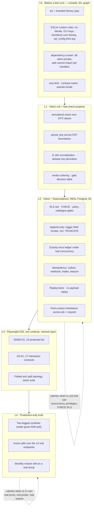
```mermaid
flowchart TD
    subgraph L0["L0 · Before a test runs — compile, lint, graph"]
        A1["tsc + branded Money type"]
        A2["ESLint custom rules: no-literals, ICU keys,<br/>Number() over Money, set_config third arg"]
        A3["dependency-cruiser: db client private,<br/>web cannot import job handlers"]
        A4["size-limit · contrast matrix · pseudo-locale"]
    end
    subgraph L1["L1 · Vitest unit + fast-check property"]
        B1["annualize() exact over 10^5 values"]
        B2["period_key across DST boundaries"]
        B3["E.164 normalization · dedupe key derivation"]
        B4["verdict ordering · gate decision table"]
    end
    subgraph L2["L2 · Vitest + Testcontainers, REAL Postgres 18"]
        C1["RLS silo · FORCE · policy catalogue gates"]
        C2["Append-only: trigger AND revoke, incl. TRUNCATE"]
        C3["Exactly-once ledger under real concurrency"]
        C4["Idempotency: outbox, webhook, intake, beacon"]
        C5["Replay-twice · v1 payload replay"]
        C6["Pool-context inheritance across job + request"]
    end
    subgraph L3["L3 · Playwright E2E, two contexts, network layer"]
        D1["DEMO-01..10 protected list"]
        D2["D3-01..17 interaction contracts"]
        D3["Folded and split topology, same suite"]
    end
    subgraph L4["L4 · Production-only truth"]
        E1["Two-legged synthetic probe (push AND poll)"]
        E2["Axiom p95 over the 14 real endpoints"]
        E3["Monthly restore drill on a real dump"]
    end
    L0 --> L1 --> L2 --> L3 --> L4
    L2 -. "catches what no unit test can:<br/>concurrency, privileges, FORCE RLS" .-> L2
    L4 -. "catches what no CI can:<br/>real proxy, real pooler, real restore" .-> L4
```

**The load-bearing observation:** the two most dangerous failures in this product are invisible to L0–L3 by construction.

- A restore that comes back **without `FORCE ROW LEVEL SECURITY`** boots looking perfectly healthy and shows every seller the whole book. Only L4's restore drill sees it.
- `LISTEN/NOTIFY` delivers only to sessions listening *at that instant* — no buffer, no replay. If the dedicated `LISTEN` connection dies and reconnects, every `NOTIFY` in that window is gone forever, **while the browser's SSE connection stays alive with heartbeats**, no reconnect fires, the fallback never arms, and the `transport-in-use` metric reports SSE *and reports the truth*. Only L4's **two-legged** probe sees it; a one-legged ETag probe passes green while the public money board is frozen for fifty people.

---

## 3 · L0 — the gates that run before a single test does

These are the cheapest minutes in the budget and they catch the highest-frequency model errors.

| Gate | Fails the build when | Anchors |
|---|---|---|
| `tsc --noEmit` with `Money` as a branded `bigint` type | any arithmetic on money outside `src/money/**` | ARR-MVP-23 |
| ESLint `no-number-coercion-on-money` | `Number(`, `parseFloat(`, `+`, `*` touches a `Money`-typed value or a `*_cents` field outside `src/money/**` | ARR-MVP-23 |
| ESLint `set-config-must-be-local` | `set_config(...)` third argument is anything but `true`, or a bare `SET` (not `SET LOCAL`) appears in the SQL corpus | ARR-MVP-01 |
| ESLint `no-transaction-start-clock` | `now()` or `CURRENT_TIMESTAMP` appears in `src/db/sql/leaderboard/**` | ARR-MVP-10 |
| ESLint `no-literals` + `static-icu-keys` + `no-concat` | a user-facing string literal in JSX or in `label/title/placeholder/alt/aria-*`, a computed `t()` key, or string concatenation building copy | ARR-UX-21, ARR-MVP-28 |
| ESLint `banned-constructions` regex over `en-US.json` **and** `.tsx` | the R3 banned-construction table (exclamation points, "another rep", user-blaming voice) | ARR-MVP-28 |
| `dependency-cruiser` | anything outside `src/db/**` imports the pool object; anything outside `src/auth/**` imports better-auth internals; **`src/web/**` imports `src/jobs/handlers/**` directly** | ARR-MVP-01, §12 |
| `size-limit` | entry + `/pipeline` route chunk > 250 KB gzip, or initial CSS > 60 KB gzip | ARR-UX-08 |
| Contrast matrix build | any token pair below its stated minimum; `N500`/`A500` used as text colour | ARR-UX-22 |
| Pseudo-locale render at 375 px with real font metrics | a missing key, or overflow at +30 % expansion | ARR-UX-21 |
| Workflow-file lint | any `runs-on:` value other than `ubuntu-latest`; any workflow carrying `schedule:` outside the literal allowlist `{nightly, weekly, monthly-restore}` | §11 |
| Event-payload fixture immutability (`git diff` gate) | any file under `fixtures/events/**` was **modified or deleted** rather than added | ARR-EVT-27 |

The last one deserves its sentence. `event_log` retention is unbounded for the ~30 permanent event names (ARR-EVT-21), so **v1 payloads written today will be replayed years from now by consumers nobody has written yet.** The way that guarantee actually dies is not a missing test — it is somebody "fixing" a v1 fixture so a new consumer goes green. Making the fixture directory append-only at the VCS layer is the only version of that rule that survives a model with a red build in front of it.

The `src/web/** → src/jobs/handlers/**` import ban is the mechanical form of the owner's new topology requirement: it makes folding the three processes into one a **runtime composition** rather than a code path. See §12.

---

## 4 · L1 — unit and property tests over a deliberately tiny domain surface

`src/domain/**` contains only pure functions: `annualize`, `periodKeys`, `normalizeE164`, `intakeDedupeKey`, `complianceVerdictOrder`, `gateDecision`, `stageMoveDecision`, `coldEpisodeKey`, `healthEnum`. Everything else needs a database and belongs in L2. This module is small enough that **100 % branch coverage over `src/domain/**` is a real, achievable, meaningful gate** — and it is the only place a coverage percentage is enforced anywhere in this project (§17 explains why a global percentage is refused).

Property tests with `fast-check`, because these four are exactly the shape where example-based tests pass and the invariant is still false:

| Property | Assertion | Why an example test misses it |
|---|---|---|
| `annualize(monthly) === monthly * 12` **exactly**, over 10⁵ random values in the legal range | no float ever appears | `249.99 × 12 = 2999.8800000000005`. Nothing turns red. Nothing looks wrong. The public money board drifts by cents that compound. ARR-MVP-23 |
| `periodKeys(ts, tz)` is internally coherent for every timestamp in a year, including both DST transition days in `America/New_York`, and on the 01:30 ambiguity of the fall-back day | `period_month === date_trunc('month', period_day)` and the same for week | The CHECK constraints in the schema catch an incoherent triple at write time; this test catches it before it reaches a customer's ledger. ARR-MVP-14, ARR-CMP-06 |
| `normalizeE164` is idempotent and total over generated US phone shapes | `f(f(x)) === f(x)`; every accepted output matches `^\+[1-9][0-9]{7,14}$` | Six ingress points normalize. One that disagrees creates two truths for one physical number. ARR-EVT-31 |
| `gateDecision` is a total function over the cross-product of `stage_type × premium_present × lost_reason_present × actor_type` | every cell has an explicit verdict; no default branch | The gates bind to `stage_type`, never a name. A missing cell is where a name-bound shortcut gets reintroduced. ARR-MVP-09 |

**What is deliberately not unit-tested:** anything whose correctness depends on Postgres. The exactly-once ledger append cannot be unit-tested — two concurrent check-then-inserts both pass in a mock. Silo isolation cannot be unit-tested — a mocked repository proves nothing about `FORCE ROW LEVEL SECURITY`. Those live in L2 and only in L2.

---

## 5 · L2 — Testcontainers with a real Postgres 18, and the required coverage

**Testcontainers is not a preference.** ARR-MVP-06 requires that the *second* ledger insert be rejected by a `UNIQUE` index and that the rejection be a **success path**; ARR-EVT-16 requires idempotency on external natural keys via `ON CONFLICT`; the entire isolation design is RLS, `FORCE`, `REVOKE` and `SECURITY DEFINER`. None of that exists outside a real engine. Every integration suite starts a Postgres 18 container pinned by image **digest**, runs the full migration chain, and finishes with `security.harden()` — the same path production takes.

Critically, **the container is initialized with the three real roles** (`crm_migrator`, `crm_app`, `crm_migrator`-owned definer functions) and the suite connects as `crm_app`. Connecting as the container's default superuser would reproduce, in CI, the exact configuration that disables the silo in production — the trap that `docker compose` and the provider's copy-paste connection string both train with perfect fidelity.

### 5.1 The required domain coverage

This is the table the brief demands: what *must* be covered, at which level, with the enforcement that makes "must" real.

| Domain area | Required assertions | Level / tool | How "required" is enforced |
|---|---|---|---|
| **Stage transitions** | `stage_type` immutability trigger raises on any type flip; a move writes exactly one `stage_transition` row; `client_move_key` double delivery conflicts and returns the first result (the `sendBeacon` retry path); `days_in_previous_stage` and both name snapshots are populated; a move via each of the seven `moved_via` values takes the identical server path | L2 Testcontainers | Named-assertion registry (§17); D3-02, D3-07 at L3 |
| **The two gates** | `current_stage_type='earning'` without `premium_annual_cents` is rejected **by the CHECK constraint**, not by the service; same for `lost` without `lost_reason_id`; a non-human actor writing an `earning` transition is rejected by `CHECK (to_stage_type <> 'earning' OR actor_type = 'human')`; the raw API, the move-sheet, the keyboard path, the wrap-up and a direct SQL insert all fail identically | L2 + L3 (DEMO-03) | The constraint *is* the test's subject — a test that passes by mocking the service layer is impossible because the assertion is on `SQLSTATE 23514` |
| **Dedupe / idempotency** | intake composite key `(tenant_id, intake_source_id, dedupe_key, dedupe_bucket)` yields exactly one contact and one `lead.created` on redelivery, and a genuine re-sale the next day is a new lead; `webhook_provider_uidx` makes a replayed delivery a sub-millisecond 204; `message_provider_uidx` and `call_aloware_uidx` under out-of-order arrival produce a final state **identical to in-order arrival**; `scheduled_job` reschedule leaves exactly one live row per `(subject, kind)` | L2 Testcontainers, with genuine concurrency (parallel clients, not sequential calls) | ARR-INT-05, ARR-INT-06, ARR-EVT-16, ARR-EVT-19 |
| **Ledger** | `UPDATE`, `DELETE` **and `TRUNCATE`** all raise `AP001` — including a zero-row `DELETE ... WHERE false`, which a row-level trigger would let through silently; `crm_app` has no DML at all and `.onConflictDoUpdate()` returns `permission denied`; two concurrent gate submissions produce exactly one ledger row and the loser is logged, not surfaced; the close-gate transaction (check → `stage_transition` → `opportunity` → `ledger_append` → `leaderboard_projection` → `channel_watermark` → `event_emit` + outbox rows) **commits or fails as one unit**; all five ledger inputs append rather than mutate, including the two-row `contact.merged` reversal pair | L2 Testcontainers | ARR-MVP-05, ARR-MVP-06, ARR-MVP-07, ARR-EVT-06, ARR-EVT-07 |
| **Silo isolation** | for **every** endpoint: called as Seller B with Seller A's id, the response body is **byte-identical** to a genuine 404 — on route, on search, on notification deep link, and on admin-only routes like break-glass; a supervisor read passes and a supervisor write raises `SQLSTATE 42501` → 403; a query with no session context returns **zero rows** (not an error) in all five execution contexts; a pg-boss job running immediately after an HTTP request on the same pooled connection inherits **nothing** | L2 + L3 (DEMO-04) | ARR-MVP-02 is a *build gate*: a CI test enumerates the route table and fails if any route has no corresponding foreign-id assertion. The route table is generated, so a new route with no silo test cannot merge |
| **Compliance gate** | fail-closed on unresolved timezone; hard block outside 9:00–20:00 lead-local evaluated at initiation; a STOP suppresses call and text for **every** seller in the tenant immediately; break-glass covers exactly two verdicts and expires by computation, not by a job; every permitted dial carries an `override_id` in its audit row; `compliance.send_blocked` is emitted on every refusal | L2 + L3 | ARR-CMP-01..04, ARR-EVT-15 |
| **Envelope + replay** | replaying the **entire** `event_log` twice into a running system produces zero new ledger rows, zero new notifications, zero new timeline rows, zero new outbound calls to the Aloware stub; current consumers process every stored `(event_name, schema_version=1)` fixture without error; the `app.event_name` enum matches the registry file exactly (49 labels) | L2 weekly tier | ARR-MVP-20, ARR-EVT-02, ARR-EVT-27 |

### 5.2 The pooled-connection inheritance test, stated separately because it is the one nobody writes

A single integration test issues an authenticated request as Seller A, then — **on the same pool connection** — runs a pg-boss handler, a webhook consumer, a CSV import and an export job, and asserts each sees `app.current_tenant()` and `app.current_user_id()` derived from its own payload and **never** from the previous unit of work. This is the test that makes PgBouncer in transaction mode safe to keep, and the one whose absence produces perfectly rendered pages full of the wrong rows.

---

## 6 · L3 — Playwright, and the protected list that cannot be skipped

Playwright is effectively mandated by ARR-UX-23: multi-context (DEMO-01 needs a second client re-ranking within 5 s), request interception (D3-01 asserts at the **network layer** that an undone move produced no request), CDP for `prefers-reduced-motion` and CPU throttling, and accessibility-tree assertions with announcement counts (D3-14).

### 6.1 The two harness traps, closed mechanically

**DEMO-01 versus D3-09.** D3-09 requires *zero* poll requests while a tab is hidden; DEMO-01 requires a second, non-focused client to re-rank within 5 s. If the harness backgrounds the second context, one of the two assertions is permanently flaky and somebody eventually skips it. The fixture therefore asserts, before the measurement window opens:

```
expect(await second.evaluate(() => document.visibilityState)).toBe('visible');
expect(await second.evaluate(() => document.hasFocus())).toBe(false);
```

A harness change that backgrounds the context now fails **loudly and specifically**, instead of producing a flaky money test.

**The Aloware stub is a first-class build artifact, not a mock.** It lives at `tools/aloware-stub`, is driven by cassettes recorded during the Gate-7 spike, and serves the failure modes DEMO-02 and the degraded-mode rehearsal need (leg A that never answers, 5xx, 10-second timeout, duplicate delivery, out-of-order delivery). A CI test asserts **every cassette parses under the current Zod schemas** — so a schema change that would break the real contract fails the build rather than silently diverging from the provider.

### 6.2 The protection rule, as a mechanism

> **No MVP item is marked done while its protected assertion is skipped, quarantined, or flaky.**

Three artifacts make that true without anyone remembering it:

1. **`protected-list.json`** maps each of the ten protected items to exactly one test id (`DEMO-01`…`DEMO-10`) and each of `D3-01`…`D3-17` to its criterion. A CI test fails if any entry resolves to zero or more than one test.
2. **A report gate** parses the Playwright JSON report and fails the run if any test titled `/^(DEMO-\d\d|D3-\d\d)/` has status `skipped`, or carries a `fixme` / `fail` annotation.
3. **There is no quarantine mechanism to reach for.** `e2e/protected/**` is configured with `retries: 0`, and an ESLint rule bans `.skip`, `.only` and `.fixme` in that directory. A flaky protected test is a red build, deliberately, because the classic failure mode is not a broken test — it is a test disabled "temporarily" and a demo that dies in month three.

DEMO-03 and DEMO-04 additionally run at L2 against the raw API and the database, not only through the browser, because "on any surface including the mobile move-sheet and the raw API" is the actual requirement.

---

## 7 · Schema gates as CI tests

These are catalogue queries. They are cheap, they run in the pre-merge tier, and they are the second of four nets around the isolation design (the first is `security.harden()` refusing the *deploy*; the third is the boot assertion; the fourth is the monthly restore drill).

| # | Gate | Query | Fails when |
|---|---|---|---|
| **S1** | FORCE + policy coverage | `pg_class` over schemas `app`, `ref` | any relation lacks `relrowsecurity AND relforcerowsecurity`, or has zero policies — **including partitions**, which the catalogue sees as separate relations and which is the specific hole a partitioned schema opens |
| **S2** | Both clauses on every policy | `pg_policies` | any policy has a null `qual` **or** a null `with_check` |
| **S3** | `FOR ALL` only | `pg_policies` | any policy has `cmd <> 'ALL'`. **This gate exists to stop the "fix".** `FOR SELECT` cannot legally carry `WITH CHECK`, so a red S2 is naturally "repaired" by splitting into per-command policies — which silently reopens exactly the hole S2 exists to close |
| **S4** | Versioned exception list | `security.table_registry` ⋈ the checked-in exception file | the two disagree, or an entry of class `reference` has a null `exception_reason`. **Adding an entry requires a PR touching that file and nothing else** — CI rejects a mixed PR, the same rule `perf-budgets.json` carries |
| **S5** | No delete anywhere | `information_schema.role_table_grants` | `crm_app` holds `DELETE` on any relation |
| **S6** | Immutability privileges | same | `crm_app` holds `INSERT`, `UPDATE`, `DELETE` or `TRUNCATE` on `earnings_ledger`, `audit_log`, `consent_ledger`, `suppression_list`, `event_log`, `timeline_entry`, `leaderboard_projection`, `event_archive_manifest` |
| **S7** | Immutability triggers | `pg_trigger` | any table in the immutable set lacks a `BEFORE UPDATE OR DELETE OR TRUNCATE **FOR EACH STATEMENT**` trigger. Statement-level is asserted explicitly: a row trigger never fires on `DELETE ... WHERE false` |
| **S8** | Definer functions re-assert tenancy | `pg_proc.prosrc` | any `SECURITY DEFINER` function body does not contain `app.current_tenant()`. This is the one way the design becomes a cross-tenant hole, and it is grep-checkable |
| **S9** | Soft-delete filter is unreachable | `information_schema` | `crm_app` holds `SELECT` on any **base table** carrying a `deleted_at` column. It reads `*_live` views declared `WITH (security_invoker = true)`; a query that "forgets the filter" has nothing to query |
| **S10** | Money is never a float | `information_schema.columns` | any column matching `/(_cents\|premium_\|delta_\|total_)/` has `data_type` in `(real, double precision, numeric)`. Money is `bigint` at the engine or it is not money |
| **S11** | Closed enums | `enum_range` | `app.event_name` ≠ the 49-name registry file; `app.user_role` ≠ exactly 3 labels; `app.override_scope` ≠ exactly 1 label |
| **S12** | Consumer registry | `ref.event_consumer` ⋈ generated file ⋈ exported TS handlers | the table, the registry and the handler union disagree — this is what makes "a subscriber to a name that does not exist fails at build" literally true |
| **S13** | One source for 5000 ms | `system_constant` ⋈ TS token ⋈ CSS custom property ⋈ pg-boss celebration delay | any of the four diverges from `undo_window_ms`, or `undo_projection_guard_ms` is read from anywhere but the same table |
| **S14** | Never a shared cache header | HTTP integration | any `/api/**` response carries `public` or `s-maxage`; **or** the same authenticated board URL fetched as two different sellers returns byte-identical bodies. A CDN indexes by URL and does not vary by cookie: one shared header hands A's board to B without the request ever reaching Postgres, where RLS is irrelevant because there is no query |
| **S15** | Money is never a `number` in TypeScript | `ts-morph` over the emitted `.d.ts` of the Drizzle schema and the API contract types | any property matching the money name pattern is typed `number` rather than the branded `Money` |

### 7.1 The money gate is five layers, because four is where it leaks

S10 (engine) and S15 (types) are two of five. The complete set, all mandatory:

1. A Drizzle custom type that parses to `Money` and **throws on coercion to `Number`**.
2. ESLint breaking the build on `Number(`, `parseFloat(` or arithmetic over `Money` outside `src/money/**`.
3. `fast-check` proving `annualize` exact over 10⁵ values.
4. **S15** — no money field typed `number`.
5. **S10** — no money column typed float or numeric.

Plus a server-side test proving a monthly value cannot reach the board, because ARR-MVP-23 demands that as a *server* assertion, not a client formatting check.

---

## 8 · The one performance table, and which number moved

The ARR proved that the Phase-4 budgets are **mutually unsatisfiable**: 250 KB gzip over Slow-4G is ≈1.25 s of transfer alone, plus ≈0.9–1.2 s of parse/compile/execute on a mid-tier Android at 4× CPU — TTI ≈2.4–3.0 s against ARR-MVP-25's "interactive in ≤2.0 s". Fitting 2.0 s needs ≈120–150 KB gzip.

**The number that moves is the TTI, not the bundle.** The reasoning is not aesthetic:

- 250 KB is the number with a **mechanism** (`size-limit`) and it is the only thing preventing dependency bloat. Loosening it removes the control.
- Cutting to 150 KB would require dropping the accessible primitive set (ARR-UX-16: WCAG AA on ten screens × four states, gate-blocking), the ICU runtime (ARR-UX-21: required from the first commit, build-breaking on a missing key), or the server-state cache and virtualizer (ARR-UX-05, ARR-UX-09). Those are three separate non-negotiables with their own enforcement. **You cannot buy the TTI without violating them.**
- 2.0 s has no mechanism except "ship less JS", which is the thing we just proved is unavailable.

So: **ARR-MVP-25's "interactive ≤ 2.0 s" is superseded by P20 below.** DoD-9's ≤2.0 s interactive, ≤400 ms API p95 and ≤3 s leaderboard re-rank are all superseded here. This table is the only set of numbers that goes into CI.

| # | Budget | Number (FAIL) | Warn | Profile / fixture | Enforced | Status |
|---|---|---|---|---|---|---|
| P1 | Pipeline LCP, desktop | **1 500 ms** | 1 300 | `desktop-ci` / `perf-500` | Lighthouse CI (nightly) | unchanged |
| P2 | Pipeline LCP, mobile | **2 500 ms** | 2 200 | `mobile-ci` / `perf-500` | Lighthouse CI (nightly) | **adopted** — closes 04b Q4 |
| P3 | CLS, 10 critical screens | **0.10** | 0.05 | both | Lighthouse CI | unchanged |
| P4 | Total Blocking Time, `/pipeline` | **200 ms** | 150 | `desktop-ci` | Lighthouse CI | unchanged |
| P5 | Interaction feedback, all 12 | **100 ms** | 80 | `desktop-ci` | Playwright, calibration-relative | unchanged |
| P6 | Drag frames | **p95 > 20 ms, any frame > 34 ms, any long task > 50 ms** | p95 16.7 | `dnd-ci` / 500 cards | rAF sampling, calibration-relative | unchanged |
| P7 | **API p95, 14 endpoints, silo-scoped** | **300 ms** | 250 | k6, 60 s × 50 VUs / `perf-floor` | CI relative + **production absolute** (§8.2) | **MOVED** from DoD-9's 400 ms |
| P8 | Global search, perceived | **200 ms** | 150 | `desktop-ci` / `perf-floor` | Playwright | unchanged |
| P9 | Search server p95 | **200 ms** | 120 | server / `perf-floor` | k6 + production | **MOVED** from US-LCP-08's 500 ms |
| P10 | Leaderboard 200 payload | **25 KB** gzip | 18 | server, 50 sellers | contract test | unchanged |
| P11 | Leaderboard **304** p95 | **80 ms** | 40 | server | k6 + production | unchanged |
| P12 | Initial JS, pipeline route | **250 KB** gzip | 200 | build | `size-limit` (pre-merge) | **held — this is the number that did not move** |
| P13 | Initial CSS | **60 KB** gzip | 40 | build | `size-limit` (pre-merge) | unchanged |
| P14 | Win-gate round trip | **500 ms** | 350 | server / `perf-floor` | k6 + production | unchanged |
| P15 | Dial gate verdict | **300 ms** | 250 | server | k6 + production | unchanged |
| P16 | Board heap growth over 10 min of polling | **30 %** | 15 | `desktop-ci` / `perf-500` | Playwright (nightly) | unchanged |
| P17 | axe-core, 10 screens × 4 states | **any serious or critical** | any moderate | `desktop-ci` | axe (nightly) | unchanged |
| P18 | Contrast matrix | **any pair below minimum** | — | build | pre-merge | unchanged |
| P19 | Keyboard call loop, 11 steps | **any step needing a pointer, or focus reaching `<body>`** | — | `desktop-ci` | Playwright (nightly) | unchanged |
| **P20** | **Mobile time-to-interactive, `/pipeline`** | **3 000 ms** *(ratchet — see below)* | 2 700 | `mobile-ci` / `perf-500` | Lighthouse CI (nightly) | **NEW — this is the moved ARR-MVP-25 number** |
| **P21** | **Public leaderboard visibility latency** — ledger commit → number visible to another seller | **6 500 ms push / 10 500 ms poll-fallback worst case** | 6 000 | production | two-legged probe (§10) | **NEW — replaces DoD-9's ≤3 s, which the 5.5 s undo exclusion makes arithmetically impossible** |
| **P22** | **Call-state channel latency** — provider event → banner state change | **2 000 ms p95** | 1 500 | production + L3 | probe + Playwright | **NEW — ARR-EVT-24 restated per channel** |
| **P23** | Ingest ack — `/webhooks/*` and `/intake/*` 204/200 p95 | **50 ms** | 25 | server | k6 (Gate 2) | **NEW — write-first is a latency claim (ARR-INT-04)** |
| **P24** | Retry-storm survival — 20 000 webhooks in 60 s (333/s) while 50 simulated sellers hold the polling floor | **any lost webhook, any lost update on `call.enriched`, P7 or P11 breached** | — | production-shaped | Gate 2, then quarterly | **NEW** |
| **P25** | Pre-merge CI wall clock | **12 min `timeout-minutes`** | 8 | runner | job config | **NEW — §11** |

### 8.1 P20 is a ratchet, not an aspiration

The number that goes into CI is set by **measurement at Gate 8**, not by wishing: `size-limit` on a skeleton pipeline route (React 19 + React Router 8 framework mode + TanStack Query + the Radix subset + virtualizer + ICU runtime + drag layer) and a real Lighthouse run on `mobile-ci` against `perf-500`. Whatever that measurement is, rounded up to the next 100 ms, becomes P20 — with **3 000 ms as a hard ceiling that cannot be exceeded even by measurement.** From then on P20 may only ever *decrease*, and only through a PR that touches `perf-budgets.json` and nothing else. A regression cannot loosen it; an improvement must lock it in.

### 8.2 Latency budgets are enforced twice, and the CI copy is relative

Absolute milliseconds on a shared GitHub runner are flaky, and the worst possible outcome of a flaky budget is that somebody disables the gate. So:

- **In CI:** every CPU-sensitive budget (P5, P6, P7, P9, P11, P14, P15) is enforced as `measured × (reference_calibration / this_run_calibration) ≤ budget`, where the calibration is a fixed CPU-bound plus Postgres-bound micro-benchmark committed to the repo and run at the start of each job. CI's job is to catch **regression**.
- **In production:** the same fourteen endpoints are measured absolutely from Axiom over a rolling window, with a Better Stack alert on breach. Production's job is to prove the **budget**.

Without the second half, a green CI and a slow product are perfectly compatible. Self-hosted runners are prohibited (a self-hosted runner is a server to administer, which the platform decision forbids), so calibration is the honest substitute rather than a shortcut.

### 8.3 The honest end-to-end number, stated because the demo depends on it

The public projection excludes ledger entries younger than `undo_window_ms (5000) + undo_projection_guard_ms (500)` = **5.5 s**. Therefore:

- **Public** visibility to another seller: 5.5 s + push latency ⇒ **p95 ≤ 6.5 s** (SSE), **≤ 10.5 s worst case** if the client is on the 5 s polling fallback.
- **Private** (the closing seller's own My Earnings): **immediate**, rendered *marked as pending*.

The demo's "while the call is still warm" claim survives on the private path and on the celebration at T+5 s; it does **not** survive as a claim about the public board, and DoD-9's ≤3 s re-rank is retired here rather than quietly missed later.

### 8.4 The polling-interval contradiction, ruled

DoD-9 forbids "any new always-on polling loop faster than 30 s". Item 62 and US-9.5 mandate a 5 s leaderboard poll. **Ruling: the 5 s channel is the single sanctioned exception**, permitted because it is a conditional GET answered from `channel_watermark` — a single-row primary-key lookup returning one `bigint`, p95 ≤ 80 ms (P11), in a 304-dominated steady state. That is what satisfies DoD-9's actual intent (cost), not its literal wording.

**Mechanism, so this does not erode into three fast pollers:** every poller registers with the one shared scheduler, and a CI test asserts that the set of registered intervals below 30 s is exactly `{leaderboard: 5000, call_state: 5000}` — a third fast channel fails the build.

---

## 9 · The split CI matrix, and the arithmetic that makes it fit

2,000 minutes/month. Private repo. No payment method, so the quota ends in a blackout. Every gate in this document is downstream of that number.

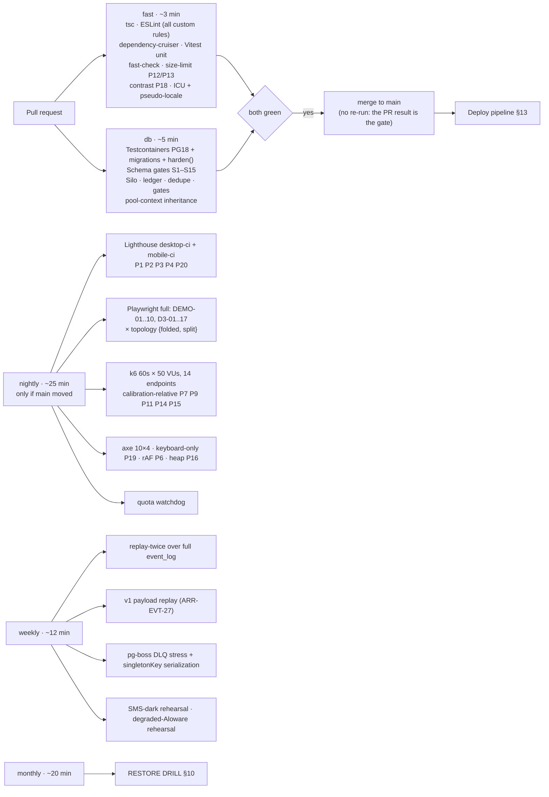
```mermaid
flowchart LR
    PR["Pull request"] --> F["fast · ~3 min<br/>tsc · ESLint (all custom rules)<br/>dependency-cruiser · Vitest unit<br/>fast-check · size-limit P12/P13<br/>contrast P18 · ICU + pseudo-locale"]
    PR --> D["db · ~5 min<br/>Testcontainers PG18 + migrations + harden()<br/>Schema gates S1–S15<br/>Silo · ledger · dedupe · gates<br/>pool-context inheritance"]
    F --> M{"both green"}
    D --> M
    M -->|yes| MERGE["merge to main<br/>(no re-run: the PR result is the gate)"]
    MERGE --> DEPLOY["Deploy pipeline §13"]

    N["nightly · ~25 min<br/>only if main moved"] --> N1["Lighthouse desktop-ci + mobile-ci<br/>P1 P2 P3 P4 P20"]
    N --> N2["Playwright full: DEMO-01..10, D3-01..17<br/>× topology {folded, split}"]
    N --> N3["k6 60s × 50 VUs, 14 endpoints<br/>calibration-relative P7 P9 P11 P14 P15"]
    N --> N4["axe 10×4 · keyboard-only P19 · rAF P6 · heap P16"]
    N --> N5["quota watchdog"]

    W["weekly · ~12 min"] --> W1["replay-twice over full event_log"]
    W --> W2["v1 payload replay (ARR-EVT-27)"]
    W --> W3["pg-boss DLQ stress + singletonKey serialization"]
    W --> W4["SMS-dark rehearsal · degraded-Aloware rehearsal"]

    MO["monthly · ~20 min"] --> MO1["RESTORE DRILL §10"]
```

### 9.1 The budget, written down

| Tier | Billed minutes/run | Runs/month | Subtotal |
|---|---|---|---|
| Pre-merge (`fast` + `db`, incl. two setups) | ~9 | ~120 | **1 080** |
| Nightly on `main`, gated on "main moved since last green nightly" | ~25 | ~20 | **500** |
| Weekly | ~12 | 4 | **48** |
| Monthly restore drill | ~20 | 1 | **20** |
| **Committed** | | | **1 648** |
| **Reserve for re-runs and incident debugging** | | | **352 (17.6 %)** |

Five decisions hold that arithmetic, and each is a mechanism rather than a habit:

1. **Two pre-merge jobs, not four.** Private-repo billing is per *job* minute, so every parallel job pays its own checkout and install. Four parallel 8-minute jobs bill ~32 minutes, not 8. Two is the point where fail-fast feedback still beats the setup tax.
2. **`concurrency: cancel-in-progress` on PR branches.** A force-push does not pay twice.
3. **Push-to-`main` does not re-run the matrix.** The PR's green result is the gate; re-running it is a pure duplicate charge.
4. **`timeout-minutes` on every job (P25).** A hung Playwright run would otherwise burn 360 minutes — 18 % of the month — in one incident.
5. **The quota watchdog.** The nightly reads the billing API and **fails the nightly** when consumption exceeds a straight-line pace by more than 20 %. Failing the nightly rather than the PR is deliberate: it is loud, it does not block merging, and it fires while there is still quota left to fix it with. Without it, quota exhaustion turns off every build-breaking gate in this document and nobody decides that.

**Two hard prohibitions, both lint-enforced (§3):** no macOS or Windows runners (macOS at USD 0.062/min is 10× Linux — one habitual macOS job costs the equivalent of USD 124 for the same 2,000 minutes); and `schedule:` may never be used as a production cron, which the GitHub Additional Product Terms forbid — the workflow lint pins the set of scheduled workflows to exactly three.

**One prohibition with no lint, recorded as a risk:** no real lead data in fixtures, ever. GitHub's Free runners offer no region selection, and a fixture containing real PII is the single path by which this stack could violate the US-jurisdiction gate. Every fixture is synthetically generated from a fixed seed.

---

## 10 · The monthly restore drill — the drill Jorge is never going to run by hand

> "The provider takes backups" is not "our data is restorable to a working system."

The gap is not the rows. It is the **roles, the revoked GRANTs, the extensions, the immutability triggers and above all `FORCE ROW LEVEL SECURITY`**. A restore that comes back without `FORCE` **disables the silo in silence and the system boots looking healthy** — every screen loads, every functional test passes, and fifty sellers see all fifty books.

**The drill, as a CI job:**

1. Pull the most recent hourly R2 dump of `earnings_ledger`, `audit_log`, `consent_ledger`, `suppression_list` plus the schema dump.
2. Restore into an ephemeral Testcontainers Postgres 18.
3. Run **the complete silo and append-only suite** — not a smoke test, the same L2 suite the pre-merge tier runs.
4. Assert explicitly, as named tests rather than as a side effect:
   - the three custom roles exist and `crm_app` is **not** the schema owner;
   - every table in `app` and `ref` has `relrowsecurity AND relforcerowsecurity` (S1);
   - every policy has both clauses and `cmd = 'ALL'` (S2, S3);
   - `crm_app` holds no `DELETE` anywhere (S5) and no DML on the immutable set (S6);
   - every immutability trigger is present and **statement-level** (S7);
   - the ledger row count and checksum match the values written into the dump at the moment it was taken.
5. Write `verified_at` on the corresponding `event_archive_manifest` rows checked in the same run.
6. Emit the metric **`age_of_last_verified_restore`**, with a **Better Stack alert at 7 days**.

That metric is the whole point. It converts "we have backups" from an assumption into **a measured fact with an age and an alarm**. The 7-day threshold is not arbitrary: the provider's PITR window on the Hobby workspace is 3 days, so a logical corruption introduced 9 days ago and discovered today is already outside it — and `earnings_ledger` is append-only, all-time, and **by design has no recompute job**. Losing it is total and permanent. This drill is the reason the paid Postgres line is the single non-negotiable cost in the ladder.

---

## 11 · The two-legged synthetic check

A one-legged ETag probe is **blind to the most dangerous failure mode of this transport.**

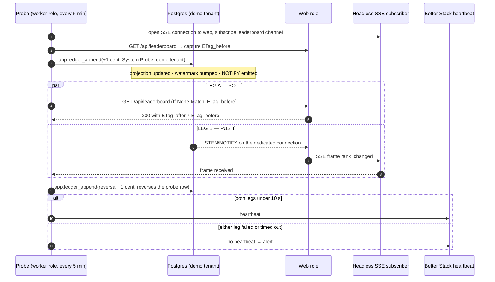
```mermaid
sequenceDiagram
    autonumber
    participant P as Probe (worker role, every 5 min)
    participant DB as Postgres (demo tenant)
    participant W as Web role
    participant S as Headless SSE subscriber
    participant BS as Better Stack heartbeat

    P->>S: open SSE connection to web, subscribe leaderboard channel
    P->>W: GET /api/leaderboard  → capture ETag_before
    P->>DB: app.ledger_append(+1 cent, System Probe, demo tenant)
    Note over DB: projection updated · watermark bumped · NOTIFY emitted
    par LEG A — POLL
        P->>W: GET /api/leaderboard (If-None-Match: ETag_before)
        W-->>P: 200 with ETag_after ≠ ETag_before
    and LEG B — PUSH
        DB-->>W: LISTEN/NOTIFY on the dedicated connection
        W-->>S: SSE frame rank_changed
        S-->>P: frame received
    end
    P->>DB: app.ledger_append(reversal −1 cent, reverses the probe row)
    alt both legs under 10 s
        P->>BS: heartbeat
    else either leg failed or timed out
        P--xBS: no heartbeat → alert
    end
```

**Why both legs.** `NOTIFY` delivers only to sessions listening at that instant — no buffer, no replay, no cursor. If the dedicated `LISTEN` connection in the web process dies and reconnects (rolling redeploy, node recycle, database maintenance, idle timeout, an OOM in 512 MB), **every `NOTIFY` in that window is lost permanently** while the browser's SSE connection stays alive on heartbeats, no reconnect fires, the polling fallback never arms, and `transport-in-use` reports SSE *and reports the truth*: the transport **is** SSE, it simply delivers nothing. Leg A's ETag changes regardless. **A one-legged check passes green while the public money board is frozen for all fifty sellers.** This probe is the only symptom detector in the system, and it must cover both legs or it does not cover the failure it exists for.

**Design choices, each with a reason:**

- **It runs inside the worker role, not from an external monitor**, and reports success by *pushing a heartbeat*. Better Stack's free tier cannot hold an SSE subscription. Making a missing heartbeat the alarm means a dead worker and a failed check raise the same alert — which is correct, since both mean "the push path is unproven."
- **It writes real ledger rows, in the demo tenant**, through `app.ledger_append` — the same single writer the close gate uses. A probe that writes to a fake table proves nothing about the path that matters.
- **It pairs a +1 cent row with a reversing −1 cent row**, so the demo tenant's totals stay at zero and a permanently seeded seller named *System Probe* sits on the demo board at $0.00. **We deliberately do not build a mechanism to hide a seller from a leaderboard** — that mechanism, once it exists, is exactly the thing that later hides a real seller by accident. A visible probe is honest and requires no code.
- **It exercises the whole chain in one shot:** exactly-once append, projection maintenance, watermark bump, ETag derivation including the `pending_watermark` term, `LISTEN/NOTIFY`, SSE fan-out. Every five minutes. In production.

**The ETag subtlety it also protects.** The public value is *time-dependent*: when a pending entry ages out of the undo window, the number changes with **no write**. A purely write-derived ETag would return 304 while the board went stale — a silent freeze on the most expensive surface in the product. The ETag is `hash(max(seq), pending_watermark)`; the probe's reversal leg is what would surface a regression to a naive `max(seq)` ETag.

---

## 12 · Folded and split topology as a first-class test dimension

The owner's requirement is that the three-process split be **deployment configuration, not an architectural assumption** — one process at Escalón 1, three at Escalón 2, with no redesign and no migration in between. That is a testing requirement before it is an ops requirement.

**The mechanism (three parts):**

1. **One image, one entrypoint, one variable.** `PROCESS_ROLE ∈ {all, web, worker, ingest}`. `all` mounts the web router, the ingest router and the pg-boss worker in a single Node process. There is no second code path — the split is a composition of the same modules.
2. **`dependency-cruiser` forbids `src/web/**` from importing `src/jobs/handlers/**`.** Handlers are reachable only by enqueue. This is what stops the folded mode from quietly growing an in-process shortcut that the split mode does not have — the shortcut that would make separation a redesign later.
3. **The nightly Playwright suite runs as a matrix over `{folded, split}`.** Both topologies run the *same* assertions, including DEMO-01..10.

**Why both, always, at every rung.** At Escalón 1 production is folded, so the split must still be tested — otherwise the day the split is needed is the day it is first exercised. At Escalón 2 production is split, so the folded mode must still be tested — because it is the **rollback target** and the local development topology.

**The one difference the tests must pin, because it is real:** in `all` mode the ingest bulkhead does not exist, so a retry storm competes with SSR and the 304 floor on one single-threaded event loop. P24 is therefore asserted **only** in `split` mode, and the folded mode carries an explicitly documented, tested-and-accepted degradation: under a 333/s replay, the folded process breaches P11 and the first symptom is `Reconnecting…` on the leaderboard, not an outage. Writing that down is what makes "separate later" a decision with a trigger rather than a hope.

---

## 13 · Environments, migrations, and deploy order

### 13.1 The three environments, and the one that does not exist

| Environment | Composition | Notes |
|---|---|---|
| `local` | `docker compose`: Node 24 + PostgreSQL 18 + **the same image as production** | The init script creates `crm_migrator` and `crm_app` and the app connects as `crm_app`. This matters more than it looks: `postgres:18`'s default connection string is the superuser-owner's, which is **exactly the configuration that disables the silo**, so an unconfigured local environment trains the broken setup with perfect fidelity. The boot assertion runs locally too and refuses to start. |
| `ci` | Ephemeral Testcontainers Postgres 18, pinned by digest | Same migration chain, same `harden()`, same roles. |
| `production` | Render, US region, three roles from one image, one managed Postgres | `system_constant['environment'] = 'production'` |
| ~~`staging`~~ | **Does not exist. Decision, not omission.** | A staging environment with production-shaped data is a second CCPA perimeter and a second USD 19 Postgres — the ladder forbids both. **Substitutes, each named:** (a) the monthly restore drill, which is a full-fidelity ephemeral clone of production including roles and `FORCE`; (b) the demo tenant living in production, which is where the ten-minute demo is actually given; (c) rollback by image, which is instant and does not require a rehearsal environment. |

### 13.2 Migrations: forward-only, additive-only, rollback is the image

There are **no down migrations**, and that is the point. DoD-12 and ARR-MVP-03 already require schema changes to be additive and forward-compatible — which is precisely what makes rolling back *code* safe without rolling back *schema*. **The unit of rollback is the container image.**

**Mechanism:** a CI gate parses every migration file and fails the build on `DROP TABLE`, `DROP COLUMN`, `ALTER COLUMN ... TYPE`, `ALTER COLUMN ... SET NOT NULL` on an existing column, or `RENAME`. An exception requires an entry in `migrations/destructive-allowlist.json` carrying (a) a written reason and (b) **the migration id of the earlier release in which code stopped reading that object** — the expand/contract discipline expressed as data rather than as a convention. Same PR rule as the RLS exception list and `perf-budgets.json`: that file and nothing else.

**pg-boss owns its own DDL, and that is a boot race across three processes.** Ruling: `migrate: false` in all three roles. The pgboss schema is installed by the migration job at a pinned version, and each process carries a **boot assertion that `pgboss.version` equals the pinned constant and exits non-zero otherwise.** The public corpus is overwhelmingly 9.x/10.x against our 12.x, and the drift lands squarely in retry and dead-letter semantics — where ARR-INT-07 says nothing may ever be discarded. The failure mode is *absence*: a webhook retried zero times and dropped, or a DLQ that never receives anything, unnoticed for a long time. The version is pinned exactly, its README is vendored into the repo so context reads the correct API instead of recalling it, and a Testcontainers test asserts a job that throws N times lands in the DLQ **with the raw body intact** and the admin counter rising on `/admin/integration-health`.

### 13.3 Deploy order: schema first, then code, and `harden()` is the last statement

```mermaid
sequenceDiagram
    autonumber
    participant CI as GitHub Actions
    participant IMG as Immutable image
    participant MIG as One-shot migration job (crm_migrator)
    participant PG as Postgres
    participant SVC as web · worker · ingest (crm_app)

    CI->>IMG: build once, tag by commit sha
    CI->>MIG: run migration job from THAT image
    MIG->>PG: forward-only migrations (additive-only gate already passed)
    MIG->>PG: pgboss schema at pinned version
    MIG->>PG: security.harden()  ← LAST STATEMENT
    Note over PG: harden() regenerates policies, GRANTs,<br/>FORCE flags and immutability triggers FROM<br/>security.table_registry — and RAISES on any<br/>relation with no registry row, including new partitions
    alt harden() raises
        MIG-->>CI: non-zero exit → DEPLOY ABORTS, old image stays live
    else success
        MIG-->>SVC: swap to the new image
        SVC->>PG: BOOT ASSERTION — current_user is not the schema owner,<br/>not rolsuper, not rolbypassrls; pgboss.version matches pin
        alt assertion fails
            SVC-->>CI: exit non-zero → health check fails → automatic rollback
        else
            SVC-->>CI: healthy
        end
    end
```

**A migration that creates a table without classifying it fails the deploy.** That is strictly stronger than a CI check, because CI can be amended and a deploy that will not proceed cannot. `harden()` also re-applies to newly created **partitions** — the specific hole a monthly/daily-partitioned schema opens, where a partition attached without `FORCE` is a silo hole with no symptom.

A Postgres `EVENT TRIGGER` on `ddl_command_end` would automate this further, but `CREATE EVENT TRIGGER` requires superuser and the managed Postgres does not grant it. **The design does not depend on one.** Confirm the grant set at Gate 0; if it exists, add the event trigger as belt-and-braces, never as the primary.

### 13.4 Where each net fires

| Net | Fires at | Catches |
|---|---|---|
| 1 — `security.harden()` | **deploy** | an unclassified relation or partition; regenerates every policy, GRANT, FORCE flag and trigger |
| 2 — CI schema gates S1–S15 | **pre-merge** | the same properties, earlier and cheaper |
| 3 — boot assertion | **process start** | connecting as the owner / superuser; pgboss version drift |
| 4 — monthly restore drill | **monthly** | a restored system that lost roles, GRANTs, triggers or `FORCE` |

---

## 14 · Demo data and fixtures

The demo seed is simultaneously the sales artifact and the E2E fixture (ARR-UX-23 + ARR-UX-25), so determinism and idempotency are **testable requirements**, not hygiene.

**Properties, each with its enforcement:**

| Property | Mechanism |
|---|---|
| Demo data lives in a **separate `tenant_id`**, never a flag column in a live tenant | It is a tenant row. There is no flag column to misuse. |
| **The seeder cannot write to a live tenant** | A dedicated role `crm_seeder` whose policy is `USING (tenant_id = app.current_tenant() AND EXISTS (SELECT 1 FROM tenant t WHERE t.id = app.current_tenant() AND t.is_demo))`. A seeder pointed at a live tenant writes **zero rows**. This is a privilege fact, not an environment check that can be bypassed by an env var. |
| **At most one demo tenant, ever** | `CREATE UNIQUE INDEX ON tenant (is_demo) WHERE is_demo` |
| **Idempotent** — a reseed never doubles totals | Deterministic uuidv5 ids derived from a fixed namespace + a stable natural key; every write is `ON CONFLICT DO NOTHING` or `DO UPDATE` to the same value. A CI test seeds twice and asserts every table's row count and every leaderboard total is byte-identical. |
| **Deterministic** | Fixed seed. A CI test asserts the checksum of the seeded dataset. |
| Spans **all four periods**, seeds 12–15 sellers, includes **one reversal**, includes a lead outside the calling window at any hour a demo is likely to run | Asserted as named tests, because each of these is an item the demo actually shows and each is a thing a "simplifying" reseed would drop |
| Visibly marked | `Demo` chip in the shell and a board footnote, asserted at L3 |

**Performance fixtures are versioned artifacts, not test scaffolding.** `perf-500`, `perf-floor` and `perf-myday` live in `fixtures/` with a **checksum asserted at test start** — an LCP "improvement" caused by a smaller fixture fails the build rather than being celebrated.

---

## 15 · Rehearsals that are tests, not procedures

Three behaviours in this product are *specified failure modes*. A specified failure mode that is only ever reasoned about is a specified failure mode that does not work.

| Rehearsal | Assertions | Tier |
|---|---|---|
| **SMS-dark launch** (`tenant.sms_enabled = false`) | No path errors. Every SMS-bearing route returns the specified copy; every scheduled reminder resolves to `status='skipped'`, `terminal_reason='skipped: sms_disabled'` — a **first-class auditable terminal state**, not an exception; `compliance.send_blocked(reason=sms_disabled)` is emitted; the Text affordance renders visible-and-disabled with its reason, never hidden | weekly |
| **Degraded Aloware** (stub returns 5xx / never answers leg A / times out at 10 s) | Red banner within 300 ms (DEMO-02); `tel:` link offered; the manual Log-a-call form opens pre-filled so the attempt is never lost; **the gate is never degraded — only the transport is**; the degraded-mode failure counter rises on `/admin/integration-health` | weekly |
| **Kill switch while jobs are in flight** (`reminder_kill_switch`) | Jobs already claimed resolve to a terminal `skipped` state rather than firing or erroring; the queue drains; no orphaned rows (DoD-12) | weekly |

---

## 16 · Anti-erosion rules

Every one of these exists because the corresponding erosion is the normal outcome, not an unlikely one.

| Rule | Mechanism |
|---|---|
| A budget can only be loosened visibly | A PR touching `perf-budgets.json` must contain **that file and nothing else** and must state measured before/after and reason. CI rejects a mixed PR. |
| An RLS exception can only be added visibly | Same rule on the exception file; `exception_reason` is `NOT NULL` for class `reference` (§7 S4). |
| A destructive migration can only be added visibly | Same rule on `migrations/destructive-allowlist.json` (§13.2). |
| A protected assertion can never be skipped | No quarantine mechanism exists; `retries: 0`; `.skip`/`.only`/`.fixme` banned by lint in `e2e/protected/**`; report gate fails on any skipped `DEMO-*`/`D3-*` (§6.2). |
| A v1 event payload fixture can never be edited | `git diff` gate: files under `fixtures/events/**` may be added, never modified or deleted (§3). |
| Flakiness is measured, not tolerated | Every run appends pass/fail per test id to a history artifact. A test that fails-then-passes three times in a rolling 14-day window opens a **failing** check on the nightly. There is no "known flaky" list. |
| Trend regression is caught inside budget | A 10 % regression that stays inside budget across five consecutive builds opens a warning check — the mechanism that catches slow decay before it becomes a breach. |
| The gates cannot be turned off by running out of quota | Quota watchdog fails the nightly at 120 % of straight-line pace (§9.1). |

---

## 17 · Coverage policy — and why there is no global percentage

**A global line-coverage percentage is refused.** It measures execution, not assertion; a model optimising for a red-to-green transition will reach any threshold by executing code without asserting anything, and the resulting number reassures precisely the person who cannot read the tests.

What replaces it, in three parts:

1. **100 % branch coverage over `src/domain/**` only** (§4). That surface is small, pure and total-function-shaped, so the number is both achievable and meaningful.
2. **A named-assertion registry.** `required-assertions.json` lists, per domain area, the named behaviours from §5.1 with their test ids. A CI test asserts every entry resolves to exactly one non-skipped test. Adding an endpoint without its silo assertion, or a ledger input without its append assertion, fails the build — because the registry is generated from the route table and the ledger-input table, not maintained by hand.
3. **DoD-11 as a gate rather than a checklist.** Each acceptance criterion maps to at least one automated test *named after it*; a CI test cross-references the criterion ids (`US-*`, `D3-*`, `DEMO-*`) against test titles and fails on an unmapped criterion.

**Deliberately not covered, recorded so it is not rediscovered as a bug:** visual snapshot tests (the design system's tokens and the contrast matrix are already build-gated; snapshots would be a second, weaker source of truth that goes stale); mutation testing (correct in principle, but it does not fit the minute budget, and the schema gates plus the required-assertion registry buy more per minute); load testing above the P24 storm shape (OQ-2 is unmeasured — the honest position is that 100–300 leads/day and 10,000–20,000 webhooks/day are assumptions, and the storm test is calibrated to the *recovery* shape, which is the one that actually bites).

---

## 18 · Traceability — requirement to gate

| Requirement | Enforced by |
|---|---|
| ARR-MVP-01 silo in the query | S1–S4, S9, L2 §5.1, `dependency-cruiser`, ESLint `set-config-must-be-local` |
| ARR-MVP-02 silo suite is a build gate | Generated route table × required-assertion registry; DEMO-04 |
| ARR-MVP-03 additive schema, no hard deletes | S5, S9, destructive-DDL allowlist gate |
| ARR-MVP-05/06/07 ledger atomicity, exactly-once, immutability | S6, S7, S10, L2 ledger suite, Gate 4 |
| ARR-MVP-09 gates bind to `stage_type` on every route | CHECK constraints as the test subject; DEMO-03 at L2 **and** L3 |
| ARR-MVP-10 undo-window exclusion + delayed celebration | S13, D3-04, D3-05, ESLint `no-transaction-start-clock`, probe §11 |
| ARR-MVP-11 leaderboard freshness, never-blank failure | P11, P21, D3-08, probe §11 |
| ARR-MVP-14 / ARR-CMP-06 three timezones | L1 property tests, period-key CHECKs, L2 |
| ARR-MVP-20 replay-twice | Weekly replay tier; fixture immutability gate |
| ARR-MVP-23 money discipline | Five layers §7.1 |
| ARR-MVP-25 performance budget | The table in §8, with the moved number declared |
| ARR-MVP-27 flags and kill switches | SMS-dark and kill-switch rehearsals §15 |
| ARR-MVP-28 / ARR-UX-21 strings and i18n | ESLint `no-literals`, banned-construction regex, pseudo-locale render |
| ARR-INT-04 write-first ingest | P23 |
| ARR-INT-05/06/07 idempotency, out-of-order, DLQ | L2 dedupe suite, pg-boss DLQ stress, Gate 11 |
| ARR-EVT-02 closed 49-name enum | S11, S12 |
| ARR-EVT-24 realtime contract | Restated per channel: P21 (leaderboard), P22 (call state) |
| ARR-EVT-27 versioned schema replay | Weekly v1 replay + fixture immutability gate |
| ARR-OPS-05 observability as a product surface | `/admin/integration-health` counters asserted at L3; `age_of_last_verified_restore`; `transport-in-use` |
| ARR-PRV-03 append-only audit | S6, S7, L2 |
| ARR-UX-04 owner-scoped not-found byte-identical | DEMO-04 at L2 and L3, S14 |
| ARR-UX-08 bundle ceilings | P12, P13 pre-merge |
| ARR-UX-23 E2E demo-visible behaviour | §6, protected-list gate |
| ARR-UX-24 budget harness | §8, `perf-budgets.json` PR rule, fixture checksums |
| ARR-UX-25 demo seed | §14, `crm_seeder` role policy |


---

# Part VII — Scale Plan, Foldable Topology and the Cost Ladder

## 9. Scale Plan, Foldable Deployment Topology, and the Cost Ladder

This section answers four questions with arithmetic: **what the MVP holds as built**, **what breaks first and what the cheap answer is**, **how three processes collapse into one and separate again without a redesign**, and **what every rung of the cost ladder costs, line by line, provider by provider**. It closes with what is already multi-tenant and what snaps the day tenant #2 arrives.

Nothing here reopens the stack. The stack is B2: one TypeScript application, three roles, resident processes on managed containers in a US region, PostgreSQL 18 managed by the provider, pg-boss inside that same Postgres, SSE over `LISTEN/NOTIFY`, R2 for the raw-payload vault and export artifacts.

---

## 9.1 The load model — the numbers this architecture is sized against

Every capacity claim below derives from four inputs, three of which are requirements and one of which is an unmeasured assumption that is explicitly flagged.

| Input | Value | Source | Status |
|---|---|---|---|
| Seller population | 50, single tenant, ~8 h US business window | ARR-OPS-04 | given |
| Poll channels and intervals | notifications + leaderboard @ 5,000 ms; My Day + board deltas @ 15,000 ms; Aloware health @ 30,000 ms **only while degraded** | ARR-UX-09 | requirement |
| Lead intake | 100–300/day via ping-post | ARR-OPS-02 | **assumption, never measured (OQ-2)** |
| Inbound webhooks | 10,000–20,000/day, bursty | ARR-OPS-02 | **assumption, never measured (OQ-2)** |
| Year-1 data volume | 10⁵ contacts, 10⁴ opportunities, 10⁵–10⁶ activities | ARR-OPS-02 | given |

### 9.1.1 Request arithmetic — the polling floor is the shape of this system

ARR-UX-09 corrects the Phase-0..4 assumption of a flat 5-second board poll. The real profile, over a 28,800-second business day:

```
notifications   50 sellers × (28,800 / 5)   = 288,000 req/day
leaderboard     ~0.6 duty-cycle × 288,000   = 172,800 req/day   (home screen)
                + 1 wall board × 86,400/5   =  17,280 req/day   (24 h)
My Day          50 sellers × (28,800 / 15)  =  96,000 req/day
board deltas    50 sellers × (28,800 / 15)  =  96,000 req/day
mutations/SSR   ~400 actions/seller/day     =  20,000 req/day
                                              ─────────────────
                                              ~690,000 req/day
```

**Sustained: 690,000 / 28,800 ≈ 24 req/s.** That is the number, and it is unremarkable for a resident process with a warm pool. The number that is *not* unremarkable is the peak.

**The visibility-return herd.** ARR-UX-09 mandates that polling stops when the document is hidden and *fires immediately on return*. Fifty tabs un-hiding within the same second — end of a stand-up, start of a shift — produce **four channels × 50 clients ≈ 200 requests inside one tick**. At 85 % `304` (~1 ms of work: one index-only probe on `channel_watermark`) plus 30 × `200` at ~10 ms, that is **~470 ms of CPU inside a ~1 s window on a 0.5-CPU Starter — 94 % saturation for one second.** Three things keep it from compounding, all of them already in ARR-UX-09: the ±500 ms per-session jitter, the skip-if-in-flight rule (a tick is dropped, never queued), and the 304 path being an index-only single-row lookup. This herd, not the steady state, is what Gate 2 must measure.

**The 304 ratio is a first-class number, not an optimisation.** Compare the two worlds:

| | CPU/s at 24 req/s | Egress/month | Fits on Starter? |
|---|---|---|---|
| With `channel_watermark` + ETag (design as specified) | ~80 ms/s ≈ **16 %** of one Starter | **12–18 GB** | yes, with 5× headroom |
| Without it — every poll re-runs the board query (~25 ms) | ~600 ms/s ≈ **120 %** of one Starter | ~104 GB | **no. Saturated by the floor alone** |

The `channel_watermark` table (PK `(tenant_id, owner_user_id, channel)`, one `bigint` returned) is therefore not a cache. It is the difference between this product running on a $7 instance and not running at all, and it is the single highest-leverage index in the schema. ARR-UX-10's requirement that the leaderboard read a maintained projection with a sequence-derived ETag is the same mechanism applied to the most expensive surface.

### 9.1.2 What the MVP holds as built

| Dimension | Comfortable | Binds at | What binds first |
|---|---|---|---|
| Sellers | 50 | ~120–150 | Node event-loop headroom on a 0.5-CPU Starter during the return herd, then the connection ceiling — **not** data volume |
| Concurrent SSE connections | 50–60 | unknown | provider proxy behaviour, **unverified** (Gate 3) |
| Leads/day | 100–300 | 10⁴/day | per-source rate limit (`intake_source.rate_limit_per_minute`, default 120/min), which is a designed cap, not a failure |
| Opportunities | 10⁴ | 10⁶ | nothing in the board path: `opportunity_board_idx` is bounded at 20 cards/column with an `INCLUDE`d sum (ARR-UX-07) |
| Contacts (search) | 10⁵ | **unknown — must be measured** | trigram GIN with the owner predicate inside the index key; if `btree_gin` for `uuid` is unavailable on Render PG 18 the fallback is a plain trigram GIN plus an owner recheck (open question, Gate 0-hour) |
| Events | 20k–50k/day | storage, not throughput | see §9.2.4 |
| Webhook burst | 333/s recovery storm | see §9.2.3 | ingest CPU |

The honest summary: **at 50 sellers this system is nowhere near a throughput wall. It is near a *CPU-share* wall during two specific one-second events (the return herd and the recovery storm), and it is on a slow, unbounded slide on exactly one storage line.** Everything below is organised around those three facts.

---

## 9.2 Bottlenecks in order, and the cheap answer to each

```mermaid
flowchart TB
  B1["1 — Postgres connections<br/>fires on a rolling redeploy"]
  B2["2 — 50-user polling floor<br/>fires on the visibility-return herd"]
  B3["3 — Webhook recovery storm<br/>fires when Aloware comes back up"]
  B4["4 — Monotonic event + audit store<br/>fires on a calendar, silently"]
  B5["5 — Egress<br/>fires only if the 304 ratio breaks"]
  B1 --> B2 --> B3 --> B4 --> B5
  B1 -.-> F1["$0 — measure ceiling,<br/>PgBouncer transaction mode,<br/>shrink pool max"]
  B2 -.-> F2["$0 — watermark ETag (already built),<br/>then multiplex the two 5 s channels"]
  B3 -.-> F3["$7 — the ingest bulkhead,<br/>then +$18 on that one service"]
  B4 -.-> F4["$0 — the R2 archive tier;<br/>otherwise ~$0.30/GiB/month, forever, unshrinkable"]
  B5 -.-> F5["$0 — alert on the 304 share,<br/>never a CDN (ARR-PRV-06 leaves nothing cacheable)"]
```

### 9.2.1 Bottleneck 1 — Postgres connections and the pooler

**The arithmetic.** Three services × pool `max` 8 = **24 sustained**. A Render rolling redeploy runs old and new instances concurrently, so that transiently doubles to **~48 for the duration of the swap**. On top: one dedicated `LISTEN` connection held by the web role, pg-boss's own internal pool (2–10 depending on configuration), and the one-shot pre-deploy migration job. Realistic transient peak: **55–60 connections**.

**The number nobody has.** `max_connections` on Render Postgres Basic-1gb was verified by no audit (price-audit marks Render as a secondary source throughout). Managed 1 GB instances land anywhere between 22 and 100. This is Gate 1 and it is a measurement, not an opinion.

**The cheap plan, in order, all at $0:**

1. **Measure.** `SHOW max_connections`, `SHOW superuser_reserved_connections`, then force a rolling redeploy under synthetic load and assert zero `too many connections`.
2. **If headroom is thin, enable Render's bundled PgBouncer in transaction mode — and only transaction mode.** This is safe here by construction and not by luck: every unit of work in this system is already an explicit transaction whose first statement is the three `set_config(key, value, true)` calls, so no session state ever needs to survive a checkout. Session mode or session-shared pooling is forbidden absolutely, because `app.user_id` set by seller A's request would survive on that server connection and be inherited by seller B — every page renders perfectly, with the wrong rows.
3. **If the pooler is unusable, shrink `max` to 5 per pool** (15 sustained, 30 transient) and accept lower write concurrency. At 24 req/s of which 85 % are single-row index probes, a pool of 5 is still ~4× oversized.
4. **Last resort: fold ingest back into web.** Costs the bulkhead and moves this system toward the failure mode §9.2.3 exists to prevent. Never the first answer.

There is **no rung on this ladder where the answer is a bigger Postgres.** At 10⁴ opportunities and 24 req/s the instance is nowhere near CPU or RAM; the constraint is a connection counter, and connection counters are solved with pooling and arithmetic, not with money.

### 9.2.2 Bottleneck 2 — the 50-user polling floor

Already sized in §9.1.1: **~16 % of one Starter in steady state, ~94 % for one second on the return herd.** The design that makes this true — `channel_watermark`, the sequence-derived leaderboard ETag, server-computed card anatomy shipped inside the card payload (ARR-UX-07) — is spent. There is no second free lunch here.

**The escalation ladder, declared now so it is not improvised later:**

| Step | What | Cost | Complexity |
|---|---|---|---|
| a | Adaptive notification interval: 5 s → 10 s for a session with zero unread for 60 s. Legal because ARR-UX-09 puts *every* timer under one scheduler, so the interval is that scheduler's decision, not a component's. Cuts the largest channel roughly in half. | $0 | low |
| b | **Multiplex the two 5 s channels into one conditional GET** returning a compound ETag over both watermarks. Notifications and leaderboard are both single-row watermark reads; serving them as one round trip removes 288,000 req/day. | $0 | medium — it is a contract change, which is why it is written down now |
| c | Web service Starter → Standard | **+$18/month** | trivial |

Step (c) is the only instance bump the budget contains (§9.4.4). Steps (a) and (b) come first for that reason.

**The failure mode to watch is not slowness — it is a broken ETag.** If the watermark stops being bumped inside a writer transaction, every poll returns `200` instead of `304`. Nothing looks wrong: the board is correct, just slower and more expensive. CPU goes from 16 % to 120 % and egress from 15 GB to 104 GB over a month, and the first signal a human receives is a bill. This is why the 304-share alarm in §9.5 is a cost control and a correctness control at the same time.

### 9.2.3 Bottleneck 3 — the webhook recovery storm

**The event that matters is not the daily average, it is the replay.** A provider that queued 20,000 deliveries during an outage and drains them on recovery delivers **333 req/s**. That is Gate 2's scenario. (The "200 requests in 10 seconds" figure that circulates is 20 req/s and nobody feels it.)

**Per-webhook work at the ingest edge, by design (ARR-INT-04, write-first / respond-fast / process-async):** TLS terminate → read body verbatim (2–8 KB) → optional HMAC verify → `INSERT` into `raw_payload_vault` → `INSERT` into `inbound_webhook_event` (`ON CONFLICT DO NOTHING` on `webhook_provider_uidx`) → one pg-boss `send` with `singletonKey = aloware_call_id` → `204`. **No parse. No merge. No domain read. No join.**

```
333 req/s × ~1.2 ms Node CPU  =  ~400 ms/s  =  ~80 % of one 0.5-CPU Starter
333 req/s × 3 statements      =  ~1,000 INSERT/s against partitioned tables
```

Two consequences, and the second is the one usually missed:

- **The bulkhead isolates CPU and memory. It does not isolate Postgres.** A saturated ingest service cannot steal the web service's event loop, but both talk to the same database. What protects Postgres is that the ingest path is *read-free and join-free*: three inserts into append-mostly partitioned tables, holding no long locks and touching no index the board reads. The board's `opportunity_board_idx` and the storm's `webhook_provider_uidx` do not intersect.
- **`intake_source.rate_limit_per_minute` (default 120/min) is a per-source cap incremented inside the same `SECURITY DEFINER` function that resolves the token** — so there is no way to perform the lookup without metering it, because there is no other way to perform the lookup. That is the vendor-side equivalent of the same protection.

**The cheap plan, in order:**

| Step | What | Cost |
|---|---|---|
| a | **The bulkhead itself.** A saturated ingest service returns `503`/`429` to Aloware, which retries, while the board holds `304` p95 ≤ 80 ms. This is the entire reason the third service exists, and it is why the split topology is the *recommended* rung and not a luxury. | $7 |
| b | `429` with `Retry-After` on the webhook path so the provider backs off instead of us dropping. Only legitimate if Aloware retries — **unverified, Gate 7.** ARR-INT-07 forbids discarding anything, so a `429` we cannot prove is retried is a lost webhook wearing a status code. | $0 |
| c | Ingest service Starter → Standard, **alone**, touching neither web nor worker. The cheapest possible response to a burst problem, and only possible because the roles are separate services. | +$18 |

**Render Starter does not autoscale. Do not plan on autoscaling.** The response to a burst is a bulkhead plus provider retry plus, if measured to be necessary, one manual instance bump.

### 9.2.4 Bottleneck 4 — the monotonic event and audit store

This is the only cost line that rises without anyone doing anything, and it is the reason ARR-EVT-21 ("money- and contact-bearing retention has no expiry") is a budget requirement and not just a compliance one.

**Row-level arithmetic (all-in: tuple + overhead + declared indexes):**

| Table | Rows/day | Bytes/row | GB/year | Residence |
|---|---|---|---|---|
| `event_log` — archivable tail (`call.*`, `message.*`, `activity.*`, `appointment.starting_soon`) ≈ 90–95 % of rows | ~32,000 | ~750 | **~8.7** | Postgres 13 months → R2, partition `COPY`ed, digest + row count in `event_archive_manifest`, then `DETACH` + drop |
| `event_log` — permanent (money, consent, lifecycle, admin; ~30 of the 49 names) | ~3,000 | ~750 | **~0.8** | Postgres, forever |
| `audit_log` | 10,000–30,000 | ~500 | **~3.7** | **Postgres, forever, no archive tier** |
| `inbound_webhook_event` | ~15,000 | ~300 | **~1.6** | Postgres — **retention class currently undeclared (gap, §9.6)** |
| `event_outbox` | ~175,000 | ~150 | flat ~0.37 GB resident | daily partitions, dropped at 14 days |
| `raw_payload_vault` bodies | ~15,000 | 2–8 KB | 21 GB/year of *flow* | hours in Postgres, then R2, then R2 lifecycle expiry |
| `earnings_ledger` | ~30 | ~400 | **~0.004** | Postgres, forever. Irreplaceable and free. |
| `consent_ledger` + `suppression_list` | ~50 | ~400 | ~0.007 | Postgres, forever |

**Year-1 Postgres steady state ≈ 18–20 GB. Year-3 with the archive tier ≈ 31 GB. Year-3 without it ≈ 49 GB.**

**Two findings worth stating plainly:**

1. **`audit_log`, not `event_log`, is the long-run growth driver.** `event_log`'s volume tail leaves at 13 months; `audit_log`'s does not, because ARR-PRV-03 gives it no expiry and every dial attempt and every gate verdict writes a row (five taps → five audit rows and one timeline entry). At 20k rows/day that is 3.7 GB/year that never leaves and never shrinks. By year 3 `audit_log` alone is ~11 GB — larger than the permanent slice of the event store. This deserves an explicit ruling (§9.6, ADR).
2. **Render Postgres storage is ~$0.30/GiB/month and it cannot be reduced once grown.** That is the sentence that makes the archive tier a budget mechanism rather than an optimisation. The R2 archive keeps year-5 `event_log` at ~14 GB instead of ~48 GB: **~$10/month of avoided, unshrinkable, permanently-billed Postgres storage at year 5, compounding by ~$2.90/month per additional year, forever.**

**The mechanism, not the intention.** A monthly pg-boss job writes one row per relation with `pg_total_relation_size`, and Better Stack alerts when (a) total DB size crosses 60 % of the plan's included storage, or (b) the 90-day linear projection crosses 100 %. That converts "storage grows on its own" from an invoice surprise into a scheduled decision with three months of warning. `event_archive_manifest.verified_at` is written by the monthly restore drill, so "the archive exists and is readable" is a measured fact with an age and an alert — not an assumption.

### 9.2.5 Bottleneck 5 — egress

```
13M req/month × (0.85 × 0.35 KB  +  0.15 × 7 KB)   ≈ 17.5 GB
+ SSR shell and static assets                       ≈  0.5 GB
+ SSE heartbeats (50 conns × 8 h × 1 per 20 s × 50 B) ≈ 0.08 GB
                                                    ─────────
                                                    12–18 GB/month
```

Render Hobby includes 5 GB; the overage is $0.15/GB. **(15 − 5) × 0.15 = $1.50/month.**

The naive model — 8 KB per response, no conditional GETs — yields ~104 GB and **$14.85/month**. The ETag design therefore saves **~$13/month, roughly 30 % of the entire recommended bill**, on top of the 7.5× CPU saving in §9.1.1. Same mechanism, two budgets.

**The escalations, and one prohibition:**

- Verify the 304 ratio is real. **Alert if the 304 share on the four poll channels falls below 75 %.** A broken ETag is otherwise invisible.
- The leaderboard `200` payload for 50 sellers stays under 25 KB gzip (ARR-UX-10), asserted in CI.
- The SSE heartbeat interval is a `system_constant`, so raising it from 20 s to 30 s is a config flip, not a deploy.
- **A CDN is not on this ladder.** ARR-PRV-06 leaves the product with no unauthenticated surface at all, and the shared-cache prohibition forbids `Cache-Control: public` or `s-maxage` on any owner-scoped route. A CDN here can cache the static asset bundle and literally nothing else. Any proposal to "put Cloudflare in front of the API to cut egress" is the seller-A-board-served-to-seller-B leak, restated as a cost optimisation — and RLS cannot stop it, because there is no query.

---

## 9.3 The foldable topology

> **The requirement.** The split into web / worker / ingest must be **deployment configuration**, not an architectural assumption. The system must run folded into a single process for the cheap rung and separate later **without redesign and without migration.**

### 9.3.1 The abstraction: one image, a role set, and Postgres as the only channel

There are two moving parts and they are both small.

**(1) One build artifact, one digest, a runtime role set.**

```
ROLES=web,worker,ingest    →  Rung 1, one Render service
ROLES=web / worker / ingest →  Rung 2, three Render services, same image digest
```

`src/main.ts` is a composition root: it reads `ROLES`, validates it against a closed union, and mounts the corresponding runtime modules from `src/roles/{web,worker,ingest}/`. Nothing downstream of the composition root can observe which roles are co-resident. There is no `if (isFolded)` anywhere, and there cannot be, because nothing has access to the answer.

**(2) The roles never talk in-process. Postgres is the only channel between them — folded or split.**

| From → To | Channel | Table / mechanism |
|---|---|---|
| any → any (domain fan-out) | transactional outbox | `event_outbox`, claimed by `app.outbox_claim()` with `FOR UPDATE SKIP LOCKED` |
| any → worker (time, delay, serialisation) | pg-boss | `pgboss` schema, `singletonKey` in the handler's type signature |
| worker/ingest → web (realtime push) | `LISTEN/NOTIFY` | emitted **only from SQL**, inside the `SECURITY DEFINER` writer functions and triggers |
| any → web (cheap polls) | watermark | `channel_watermark`, bumped inside the writer transaction |
| ingest → worker (per-call serialisation) | pg-boss queue `call-merge` | `singletonKey = aloware_call_id` |

**This is the whole trick, and it is why folding is safe.** The three roles already communicate exclusively through durable, transactional, cross-process channels. Folding them into one OS process **co-locates** them; it does not change a single message path, a single delivery guarantee, or a single line of consumer code. Separation is therefore not a refactor — it is starting two more copies of the same binary with a different environment variable.

```mermaid
flowchart TB
  subgraph IMAGE["ONE Docker image · ONE digest · roles selected at boot"]
    direction LR
    RW["role web<br/>SSR · API · SSE · the single LISTEN connection"]
    RK["role worker<br/>outbox relay · pg-boss consumers · scheduler dispatch"]
    RI["role ingest<br/>POST /webhooks · POST /intake<br/>3 INSERTs → 204. Never merges."]
  end

  subgraph RUNG1["RUNG 1 — folded · 1 × Starter 0.5 CPU / 512 MB · $7"]
    F["ROLES=web,worker,ingest"]
  end

  subgraph RUNG2["RUNG 2 — split · 3 × Starter · $21 · same digest"]
    S1["ROLES=web"]
    S2["ROLES=worker"]
    S3["ROLES=ingest"]
  end

  PG[("Render Postgres 18 Basic-1gb — the ONLY inter-role channel<br/>event_outbox · pgboss · LISTEN/NOTIFY · channel_watermark · scheduled_job")]

  IMAGE --> RUNG1
  IMAGE --> RUNG2
  F --- PG
  S1 --- PG
  S2 --- PG
  S3 --- PG
```

### 9.3.2 Exactly what changes, and it is only configuration

| Knob | Rung 1 (folded) | Rung 2 (split) | Mechanism that derives it |
|---|---|---|---|
| `ROLES` | `web,worker,ingest` | `web` \| `worker` \| `ingest` | parsed against a closed union; **boot fails on unset or unknown token** |
| Pool `max` | one pool sized for the union | one pool per service sized for its role | a pure function `poolMax(roles, measuredCeiling)`; the pool object is module-private to `src/db/` |
| `LISTEN` connection | 1 (owned by role `web`) | 1 (only the web service) | the listener module mounts only under role `web`; a boot assertion refuses > 1 |
| Pre-deploy migration | on this service | **on the web service only** | one migrator, N boot-asserters (§9.3.6) |
| Webhook / intake hostname | `intake.<domain>` → web service | `intake.<domain>` → ingest service | a **CNAME from day one**, folded or not — the split changes a DNS target, never a vendor's configuration |
| pg-boss schedules | registered by the migration job | identical | idempotent registration in the one-shot job, so N workers never duplicate a schedule |

**What does *not* change: nothing else.** No migration. No data movement. No consumer re-registration (consumers live in the `event_consumer` table, seeded from the generated registry). No queue re-declaration. No code.

### 9.3.3 What degrades when folded — honestly

**Correctness does not degrade. Not at all, not in any respect.** Every guarantee in this architecture is a database fact: `FORCE ROW LEVEL SECURITY` with generated `FOR ALL` policies, immutability triggers raising `AP001`, `REVOKE` on the app role, unique indexes carrying idempotency, composite FKs binding the gates, `SECURITY DEFINER` write monopolies. **Not one of them is a function of the process boundary.** Folding trades *isolation*. It never trades *correctness*. That is the property that makes the fold legitimate rather than a shortcut.

What is genuinely lost:

| Loss | Mechanism of the loss | Blast radius |
|---|---|---|
| **The bulkhead** | 333 req/s of ingest and the 24 req/s poll floor share one 0.5-CPU Starter. Ingest alone is ~80 % of it. | `304` p95 blows past 80 ms and API p95 past 300 ms during a recovery storm — precisely the two numbers Gate 2 exists to defend |
| **Memory isolation** | 512 MB shared. A CSV import or an export job buffering rows takes SSR **and** SSE down with it. | Full outage during an admin action |
| **Redeploy independence** | One rolling redeploy drops SSE, the `LISTEN` connection, the job workers **and** the webhook endpoint simultaneously. Split, ingest keeps landing webhooks while web restarts. | A redeploy during business hours becomes a webhook gap; the raw vault plus provider retry make it non-lossy, not invisible |
| **Latency isolation on the event loop** | A long synchronous body read in a merge handler adds directly to API p95. Node is one event loop. | p95 noise that looks like "the app is slow sometimes" |
| **pg-boss maintenance** | archive/purge runs in the same event loop as SSR. | periodic p95 spikes |

The `LISTEN`-dies-while-SSE-stays-alive failure (Gate 3) is **identical in both topologies** and is caught by the same two-legged synthetic check. Folding neither creates it nor mitigates it.

### 9.3.4 The tripwires that say "split now" — measured, not judged

Four alerts. None is a headcount and none is a hunch. Each is a query over tables this system already owns, which is exactly what ARR-OPS-05 requires (health signals derived from our own tables, rendered in-app, never reconstructed from an external APM).

| # | Signal | Threshold | Source | Split what |
|---|---|---|---|---|
| **T1** | `304` p95 on the four poll channels, during the US window | **> 80 ms for 5 consecutive minutes** | in-app probe → Better Stack | **ingest first** |
| **T1b** | Node event-loop lag p95 | **> 50 ms for 5 consecutive minutes** | process metric → Axiom | ingest first |
| **T2** | Webhook `204` p99, **or** any `inbound_webhook_event.status='failed'` on timeout, **or** `dead_letter` rows with `origin='inbound_webhook'` | **p99 > 250 ms**, or **any** DLQ row in a 5-minute window | `inbound_webhook_event`, `dead_letter` | ingest |
| **T3** | Scheduler lag: `max(clock_timestamp() - fire_at)` over `scheduled_job WHERE status='pending'` | **> 60 s** | `scheduled_job` | **worker** |
| **T4** | Process RSS | **> 400 MB of 512 MB for 10 minutes** | process metric | whichever role owns the allocation |

**T3 is the one with teeth beyond performance.** Scheduler lag means the T-1h appointment reminder fires late, and a reminder that fires late can fire *outside the legal calling window*. A latency alert on `scheduled_job` is a compliance alert wearing a performance costume.

**T1 fires before T3 in practice**, which is why the recommended separation order is **ingest first, worker second**. Ingest is the densest CPU event and the cheapest to peel off, because nothing reads it and it merges nothing.

### 9.3.5 The separation procedure

```mermaid
flowchart LR
  A["T1 or T2 fires"] --> B["Create Render service<br/>ROLES=ingest, same repo"]
  B --> C["Create Render service<br/>ROLES=worker, same repo"]
  C --> D["Repoint CNAME intake.&lt;domain&gt;<br/>→ ingest service"]
  D --> E["Set web service<br/>ROLES=web,worker,ingest → web"]
  E --> F["Boot assertions re-verify:<br/>pool sum vs measured ceiling,<br/>schema version, ≤1 LISTEN"]
  F --> G["Rung 2 — $42.50"]
  G -.->|symmetric, no data move| A
```

1. Create two services from the **same repository and the same image**, `ROLES=ingest` and `ROLES=worker`. Do **not** attach a pre-deploy command to either.
2. Repoint `intake.<domain>` from the web service to the ingest service. **Aloware and every lead vendor are never touched**, because they were configured against the CNAME from day one — that is the entire purpose of introducing the CNAME while folded.
3. Change the web service's `ROLES` from `web,worker,ingest` to `web`.
4. Pool maxima recompute automatically from the role set at boot; the boot assertion re-verifies the sum against the measured connection ceiling and refuses to start if it exceeds it.
5. Reversal is symmetric: set `ROLES` back to the union and delete two services. Nothing was migrated, so nothing is migrated back.

**There is no step for re-registering consumers, re-declaring queues, moving data, or changing code. If any such step ever appears, the abstraction has already rotted** — which is what §9.3.6 exists to prevent.

### 9.3.6 Why the split cannot rot while we run folded

The real risk of a foldable design is not the split. It is that a shortcut develops during the folded rung — a direct function call, an in-memory `EventEmitter`, a shared module-level singleton — which works perfectly folded and breaks silently when split. Four mechanisms close it:

1. **Cross-role imports break the build.** A dependency-cruiser rule (already in the pre-merge CI matrix) forbids `src/roles/web/**` from importing `src/roles/worker/**` or `src/roles/ingest/**`, in every direction. All three may import `src/domain/**`, `src/db/**` and `src/jobs/**`. **If no role can import another, no in-process shortcut can be written.**
2. **The full integration suite runs in both topologies, pre-merge.** One matrix leg with `ROLES=web,worker,ingest` in a single process, one leg with three processes against the same Testcontainers Postgres, asserting identical outcomes. **The split is rehearsed on every merge, so it can never be "the thing we've never tried."**
3. **`NOTIFY` is emitted only from SQL.** A CI grep gate fails the build on `pg_notify(` or `NOTIFY ` outside `db/functions/**`, and dependency-cruiser forbids `node:events` outside `src/sse/**`. There is no in-process realtime path to accidentally take.
4. **One migrator, N boot-asserters.** The pre-deploy migration command is attached to exactly one service. Every other role boot-asserts that the deployed schema version equals the version its code was built against and **exits non-zero on mismatch**, rather than running against a schema it does not understand. Additionally, `security.harden()` takes a `pg_advisory_lock`, so even a misconfiguration that runs it twice serialises instead of racing.

---

## 9.4 The cost ladder

All prices verified 2026-07-31, excluding tax. Render's per-instance prices come from a **secondary** source (the price audit could not extract Render's pricing page directly) and are flagged accordingly; the two lines that matter most — Starter $7 and Postgres Basic-1gb $19 — are corroborated by Render's own published statement that *an always-on Starter web service plus a Basic-256mb Postgres on a Hobby workspace typically ran about $13/month*.

### 9.4.1 Rung 0 — Development. **USD 0.00**

| Line | Provider | Detail | USD/mo |
|---|---|---|---|
| App + database | Docker Compose, local | Node 24 + PostgreSQL 18, **the same image as production** | 0.00 |
| Integration-test database | Testcontainers, on the runner | ephemeral Postgres per run | 0.00 |
| Public HTTPS for the Aloware webhook spike | Cloudflare Tunnel free | commercial use unrestricted in the Self-Serve Agreement | 0.00 |
| CI | GitHub Actions Free, private repo, `ubuntu-latest` | 2,000 min/month, **no payment method on the account** | 0.00 |
| **Total** | | | **0.00** |

Two properties worth naming. **Production *is* a container running a resident process against a Postgres**, so local development is not an approximation of production — it is the same shape: same Dockerfile, same pg-boss worker, same `LISTEN/NOTIFY`, same SSE, same direct connections. A serverless candidate cannot say this; cold starts, function duration limits and pooler semantics are invisible locally. And **the absence of a payment method on the GitHub account is the cost control**: exhausting the Actions quota is a blackout, not a bill — which is precisely why the CI matrix is split into a fast pre-merge tier and a nightly heavy tier.

### 9.4.2 Rung 1 — Pilot, 2–3 sellers, folded. **USD 27.00 all-in (USD 26 compute + data)**

| Line | Provider | Detail | USD/mo |
|---|---|---|---|
| Application, `ROLES=web,worker,ingest` | Render Starter | 0.5 CPU / 512 MB, Ohio or Virginia | 7.00 |
| Database | Render Postgres Basic-1gb | PG 18, same region, continuous backups, **3-day PITR** on Hobby | 19.00 |
| Egress | Render Hobby | ~0.9 GB at 3 sellers, 5 GB included | 0.00 |
| Object storage | Cloudflare R2 | < 1 GB, inside the 10 GB + 1M Class A free tier | 0.00 |
| Telemetry | Sentry Developer + Axiom Personal + Better Stack free | 5,000 errors/mo · 500 GB ingest, US East edge · 10 monitors | 0.00 |
| Domain | registrar | ~$12/yr amortised | 1.00 |
| **Total** | | | **27.00** |

**On the USD 0 variant of this rung.** Render's free tier gives a web service (512 MB, 0.1 CPU) that **spins down after 15 minutes of no traffic and takes about one minute to wake** — 200× over the 300 ms p95 budget — and a free Postgres that **expires 30 days after creation, with no backups and no pooling.**

So: **USD 0 is legitimate for a demo tenant with synthetic data and no real ledger row. It is not legitimate the moment a real seller closes a real sale.** The reason is not the backup — the hourly R2 dump of `earnings_ledger` + `audit_log` + `consent_ledger` gives an RPO of ≤ 1 hour on any plan — it is the **30-day expiry**, which is an unrecoverable scheduled deletion of the one artifact with no recompute path (ARR-MVP-07, ARR-EVT-21). That is why the paid Postgres is the single non-negotiable line on this ladder: it is not buying performance, it is buying *the absence of a scheduled deletion*.

The demo tenant is already a first-class, mechanically-guarded object here: `CREATE UNIQUE INDEX ON tenant (is_demo) WHERE is_demo` caps it at one, and a trigger refuses to create it when `system_constant['environment'] = 'production'` (ARR-UX-25).

### 9.4.3 Rung 2 — 50 sellers

**Minimum, folded: USD 28.50 all-in (USD 26 compute + data).**

| Line | Provider | Detail | USD/mo |
|---|---|---|---|
| Application, `ROLES=web,worker,ingest` | Render Starter | one 0.5-CPU service carrying the poll floor **and** the webhook storm | 7.00 |
| Database | Render Postgres Basic-1gb | | 19.00 |
| Egress | Render Hobby | (15 − 5) × $0.15 | 1.50 |
| R2 / telemetry | Cloudflare, Sentry, Axiom, Better Stack | free tiers | 0.00 |
| Domain | registrar | | 1.00 |
| **Total** | | | **28.50** |

This rung **runs**, and it will hold the steady state comfortably (§9.1.1: ~16 % CPU). What it does not hold is the two one-second events: the return herd at ~94 % and the recovery storm at ~80 %, sharing the same 0.5 CPU. It is the correct rung for launch and the wrong rung for the first day Aloware has an outage.

**Recommended, split: USD 42.50.**

| Line | Provider | Detail | USD/mo |
|---|---|---|---|
| `ROLES=web` | Render Starter | SSR + API + SSE + the single `LISTEN` connection | 7.00 |
| `ROLES=worker` | Render Starter | outbox relay, pg-boss consumers, scheduler dispatch | 7.00 |
| `ROLES=ingest` | Render Starter | `/webhooks` + `/intake` — **the bulkhead** | 7.00 |
| Database | Render Postgres Basic-1gb | PG 18, backups, 3-day PITR | 19.00 |
| Egress | Render Hobby | 12–18 GB, 5 GB included | 1.50 |
| R2 | Cloudflare | vault + archive + export artifacts, inside free tier at launch | 0.00 |
| Sentry / Axiom / Better Stack / GitHub Actions | free tiers | | 0.00 |
| Domain | registrar | | 1.00 |
| **Total** | | | **42.50** |

**Delta over the minimum: $14.00/month for the bulkhead and for redeploy independence.** That is the whole price of the property that Gate 2 tests.

### 9.4.4 Month 12 projection. **USD 76.50**

| Line | Provider | Basis | USD/mo |
|---|---|---|---|
| 3 × Starter | Render | unchanged | 21.00 |
| Postgres Basic-1gb | Render | unchanged | 19.00 |
| **Postgres storage** | Render | ~20 GB × ~$0.30/GiB — **the only line that rises on its own** | **6.00** |
| Egress | Render | ~21 GB with fuller sessions | 2.50 |
| R2 | Cloudflare | archive + vault beyond the 10 GB free tier | 1.00 |
| **Sentry Team** | Sentry | free tier is 5,000 errors/month and **exhausts in an hour when something loops**; Spike Protection drops events rather than billing, so exceeding it is a telemetry blackout | **26.00** |
| Domain | registrar | | 1.00 |
| **Total** | | | **76.50** |

### 9.4.5 The ceiling, and the two prohibitions

**Hard ceiling: USD 100/month (ARR-OPS-01 — already a build-breaking DoD check, and it has already vetoed PWA push, SMS-to-seller alerts, `priority_score_history`, period snapshot tables, media mirroring, TrustedForm certificate retention and the transcript index).**

Headroom at month 12: **USD 23.50.** What that headroom does and does not buy:

| Candidate escalation | Cost | Result | Verdict |
|---|---|---|---|
| One instance Starter → Standard, on **one** service | +18.00 | 94.50 | **Fits — exactly once** |
| Two instance bumps | +36.00 | 112.50 | **Breaks** |
| **Render workspace Hobby → Pro** | **+25.00** | **101.50** | **Breaks the ceiling by itself. PROHIBITED.** |

> **The workspace jump is prohibited because it is the single line item that, alone, exceeds the ceiling at the 12-month projection.** This is arithmetic, not preference.

What Pro would buy, and why each is either unneeded or already bought at $0:

| Pro benefit | Our position |
|---|---|
| Unlimited workspace members | There is one human. A second member is the trigger, and it is the trigger we refuse. |
| 25 GB egress (vs 5 GB) | Worth ~$3/month to us. Costs $25. |
| 1,000 build minutes (vs 500) | ~60 deploys × 3–5 min ≈ 180–300 min. Fits — **and must be alarmed** (§9.5), because exhausting build minutes on Hobby stops deploys. |
| 7-day PITR (vs 3-day) | Bought at $0 by the hourly R2 dump of the three immutable tables, whose restorability is *verified monthly by a CI job* rather than assumed. Strictly better evidence than a longer window nobody has ever restored. |
| SOC 2 / ISO reports, dashboard audit logs | No requirement anywhere in ARR asks for them. The product has its own `audit_log`. |

The second prohibition follows: **a second human account on the Render workspace is prohibited**, because it is a $25 workspace jump wearing a different name.

**Three of our free tiers fail by going dark, not by billing** — GitHub Actions (quota exhausted → the gates that break the build stop running), Sentry Developer (Spike Protection drops events), Axiom Personal (behaviour past 500 GB unverified). That is a *good* cost property and a *bad* observability property, and it is why §9.5 puts a canary on each of them rather than trusting a dashboard nobody opens.

---

## 9.5 Making the budget mechanical

Render bills overage automatically and publishes no hard spend cap. A ceiling that depends on someone remembering to check an invoice is not a ceiling. The variable surface is small and entirely self-measurable, which makes a forecast possible:

- **A daily job computes the projected month-end bill** from (a) `pg_database_size`, (b) response bytes summed from our own access logs in Axiom, (c) a **checked-in price table** with a `source_url` and a `verified_at` per line. Better Stack alerts at **$60 / $80 / $95**. The bill becomes a forecast with weeks of warning instead of a discovery.
- **A CI test fails if any line in the price table has no `source_url`, or a `verified_at` older than 180 days.** This is what keeps this section from quietly becoming fiction — Hetzner's US price tripled between two phases of this very project, and a stale table is how that kind of change reaches a decision undetected.
- **Better Stack free gives exactly 10 monitors.** They are allocated, and adding an eleventh signal requires retiring one:

| # | Monitor |
|---|---|
| 1 | Web `/healthz` uptime |
| 2 | Ingest `/healthz` uptime (reserved while folded) |
| 3 | **Two-legged synthetic check**: write a ledger row in the demo tenant, assert the leaderboard ETag changed **and** a headless SSE subscriber received `rank_changed`, both < 10 s |
| 4 | `304` p95 on the poll channels **and** the 304 share ≥ 75 % (T1) |
| 5 | Scheduler lag, `max(clock_timestamp() − fire_at)` over pending `scheduled_job` (T3) |
| 6 | `dead_letter` depth delta (T2) |
| 7 | Age of the last **verified** restore > 7 days |
| 8 | Projected month-end bill > $60 / $80 / $95 |
| 9 | `pg_database_size` vs plan storage, with a 90-day linear projection |
| 10 | Free-tier canaries: a tagged daily error asserted present via Sentry's API, a canary log line asserted present via Axiom's, and GitHub Actions quota > 70 % |

Monitor 3 is the only detector in the system that tests the **symptom** (the public money board froze) rather than a list of causes, which is why it earns a slot ahead of anything conventional.

---

## 9.6 The road to multi-tenant SaaS

The system is **multi-tenant-ready and single-tenant-operated**. That claim is only worth making if it is specific about which parts are real and which parts snap.

### 9.6.1 Already true today, at zero cost

| Property | Why it is real and not decorative |
|---|---|
| **`tenant_id` is a real leading key** | It leads every PK, `opportunity_board_idx`, `contact_name_trgm_idx`, every append-only index, and it is the RANGE partition prefix on `event_log`, `audit_log`, `raw_payload_vault` and `inbound_webhook_event`. Tenant #2 changes **no query plan's shape**. Even `tenant` itself carries `tenant_id uuid GENERATED ALWAYS AS (id) STORED`, so the catalog gate "every table has a `tenant_id`" has zero special cases. |
| **Isolation is generated, not authored** | `security.table_registry` classifies every relation and `security.harden()` generates two `FOR ALL` policies, the GRANTs, `FORCE ROW LEVEL SECURITY` and the immutability triggers from that classification. The predicate is already `tenant_id = app.current_tenant()`. Tenant #2 is not a code change anywhere. |
| **`period_key` is tenant-timezone-correct from row one** | Computed at write time inside `app.ledger_append()` from `tenant.business_tz`, with `business_tz_snapshot` carried on the row. A tenant in a different timezone gets correct day/week/month buckets on its first sale, with no backfill — and a monthly reset ships later as a `period_type` filter, i.e. configuration, not migration. |
| **Feature flags are typed columns on `tenant`** | `sms_enabled`, `reminder_kill_switch`, `cold_threshold_days`, `rotting_threshold_days`, `tags_enabled`, `custom_fields_enabled`, `is_demo`. Per-tenant behaviour is a column read, never a deploy. Typed columns and not a jsonb blob, because a typo in a jsonb key is invisible at runtime and a missing column is a compile error. |
| **Cross-tenant system paths were designed in from the start** | Exactly four, each confined to a `SECURITY DEFINER` function returning ids only: `app.outbox_claim()`, `app.scheduled_job_claim()`, `app.retention_purge()`, `app.resolve_intake_token()`. `outbox_claim_idx` is deliberately **not** led by `tenant_id`. A single-tenant design would not have needed any of this. |
| **Per-seller intake tokens already resolve a tenant** | `intake_token_uidx UNIQUE (token_hash)` is the one index in the schema with no `tenant_id`, precisely because the token is what *resolves* the tenant. That is a multi-tenant decision already made and already documented on the exception list. |
| **Aloware identity mapping is tenant-scoped** | `aloware_number_mapping` is unique per `(tenant_id, from_number_e164)` and per `(tenant_id, user_id)`. |
| **i18n is structurally ready** | Zero hard-coded user-facing strings is a build-breaking rule; `notification` stores `title_key` + `params`, never a rendered sentence. A notification written today re-renders correctly under a locale added later. |
| **Currency is pinned, not assumed** | `CHECK (currency = 'USD')` on `tenant` and on `earnings_ledger`. Lifting it is dropping a CHECK, not finding hard-coded dollars. |

### 9.6.2 Deliberately not built, and must not be

Billing. Plans and entitlements. Self-serve signup and tenant provisioning. Per-tenant custom domains. Usage metering. A plan-gated feature matrix — the flags on `tenant` are admin-set columns, **not** entitlements, and turning them into entitlements is the moment this becomes a SaaS. A cross-tenant admin console. Tenant-level SSO. Every one of these adds surface with zero MVP payoff, and several of them (entitlements, a tenant console) would add cross-tenant read paths to a design whose entire security argument is that there are exactly four of them.

### 9.6.3 What breaks first when tenant #2 arrives — ranked

| # | What breaks | Why | Shape of the fix | Complexity |
|---|---|---|---|---|
| **1** | **Aloware credentials are a process-level env var, not a tenant column.** | The signing key, API token and base URL are one set. Tenant #2 has its own Aloware account, so `app.webhook_ingest()` cannot verify a signature without first knowing *which* tenant sent it — and the only thing that resolves the tenant on an Aloware webhook is the destination number, which requires reading `aloware_number_mapping` **before** signature verification. That is an ordering inversion: authenticate-then-identify becomes identify-then-authenticate. | A `tenant_integration_credential` table keyed `(tenant_id, provider)` **plus a tenant-resolving path segment**, `/webhooks/aloware/{tenant_slug}` — exactly the pattern `intake_source` already uses with its token. Resolve from the URL, then verify. | **high — architectural, not configuration. This is the largest tenant-2 item and it should be named now, not discovered.** |
| **2** | **Cross-tenant claim fairness.** | `app.outbox_claim()` and `app.scheduled_job_claim()` order by `next_attempt_at` / `fire_at` across all tenants. One tenant's 20,000-webhook recovery storm **starves every other tenant's T-1h reminders** — and a reminder that fires late can fire outside the legal calling window. Noisy-neighbour with a compliance edge. | Round-robin the claim by tenant (`DISTINCT ON (tenant_id)` or a per-tenant lease) inside the same two definer functions. Nothing outside them changes. | medium |
| **3** | **The demo-tenant unique index.** | `CREATE UNIQUE INDEX ON tenant (is_demo) WHERE is_demo` permits **at most one demo tenant ever, across all tenants**. Correct and load-bearing today; a hard blocker the first time a customer tenant wants its own sandbox. | The demo becomes a property of a tenant *pair* (`demo_of_tenant_id`) rather than a global boolean — a real model change, which is why it is worth knowing about in advance. | medium |
| **4** | **`system_constant['environment']` is per-tenant but semantically per-deployment.** | With N tenants, the demo-creation trigger reads `environment` for *which* tenant? Today it is unambiguous; at tenant #2 it is a coin flip. | Move `environment` to a `ref.deployment_constant` table with no tenant dimension. `ref` is already on the versioned RLS exception list for exactly this class of data. | low |
| **5** | **The Hobby workspace's single member.** | Tenant #2 means a customer, which eventually means a second person needing dashboard access, which is the **$25 workspace jump that §9.4.5 prohibits**. Tenant #2 is therefore also the moment the cost ceiling changes shape. | Say it out loud in the same conversation as the first sales call, not afterwards. | — |
| **6** | **No per-tenant aggregate rate limit.** | `intake_source.rate_limit_per_minute` is per source. One tenant's misbehaving vendor consumes shared ingest CPU with no tenant-level cap. Same class as #2. | A `tenant`-level meter alongside the per-source one, incremented in the same definer function. | low |

**What does *not* break:** the silo, the ledger, RLS, the period keys, the event catalog, i18n, the four cross-tenant paths, the partitioning. The tenant-readiness claim survives contact with tenant #2 **everywhere except integration credentials and cross-tenant fairness** — and both were foreseeable from here, which is why they are written down here.

---

## 9.7 What this section hands to the Sprint 0 gates

| Item | Gate | Why it cannot be assumed |
|---|---|---|
| Render US region availability on the plans we will buy | **Gate 0** | The only open item capable of retroactively eliminating the signed stack |
| Real `max_connections` on Postgres Basic-1gb; PgBouncer transaction-mode context isolation proven | **Gate 1** | Every pool `max` and the viability of the three-process split derive from it |
| 20,000-webhook replay at 333/s **while** 50 simulated sellers hold the poll floor; assert `304` p95 ≤ 80 ms, API p95 ≤ 300 ms, zero webhooks lost, zero lost-update on `call.enriched` | **Gate 2** | The recommended rung's entire justification is the bulkhead |
| SSE behind the platform proxy over an 8-hour window; kill and re-establish the dedicated `LISTEN` connection while browser SSE stays open | **Gate 3** | `NOTIFY` delivers only to sessions listening at that instant — no buffer, no replay. SSE stays alive and mute, and `transport-in-use` reports the truth while informing nothing |
| `btree_gin` for `uuid` on Render PG 18, or the measured fallback | Gate 0-hour | Decides whether the primary search index puts the ownership predicate inside the index or after retrieval |
| Actual burst shape of ping-post and Aloware traffic (**OQ-2 — still an assumption carried since Phase 0**) | **Gate 7** | Inputs to partition granularity (monthly vs weekly) and the outbox prune window |
| Render Postgres per-GB storage price and included allotment, verified against the primary source | Gate 0-hour | §9.4.4's only self-rising line and §9.2.4's whole argument depend on it |

**Two unresolved rulings this section needs and does not own:**

- **`raw_payload_vault` retention window (30 / 45 / 90 days).** Simultaneously a CCPA minimisation decision and the main R2 storage line. The schema is indifferent (`purge_after` + monthly partitions + an R2 lifecycle rule), but the number is written into every vault row at insert, so it must be chosen before the first row exists.
- **`inbound_webhook_event` retention class is currently undeclared** — a real gap. At ~1.6 GB/year permanent, it silently becomes the third monotonic growth line alongside `audit_log`. It needs either an `archivable` classification or an explicit "permanent, and we accept the storage" ruling.

**One number this section defers to the published table:** ARR-MVP-25 states API p95 ≤ 400 ms while the Phase-5 brief states < 300 ms. All arithmetic above is computed against the tighter number. The single authoritative table of performance numbers — including whichever of the mutually unsatisfiable bundle/TTI budgets moved — is published by Gate 12 and governs.
